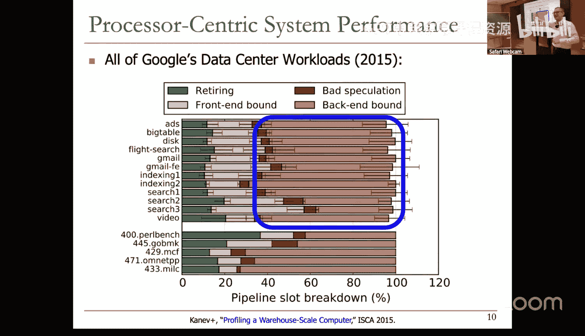
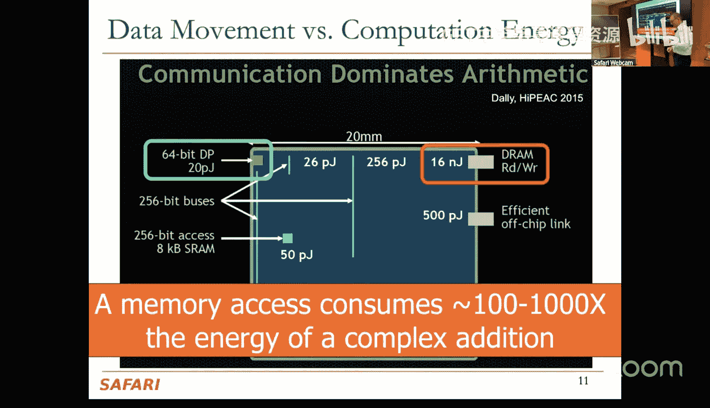
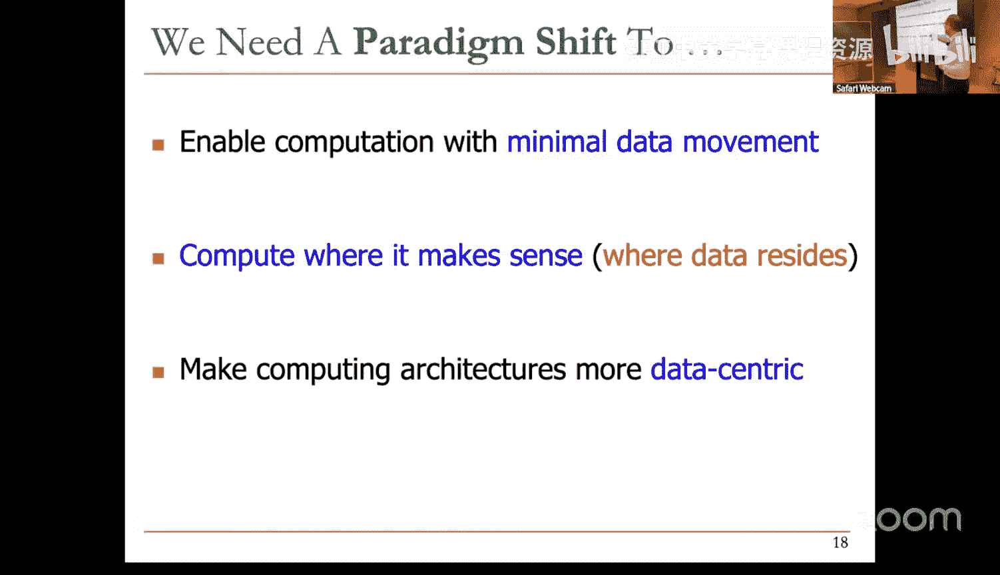
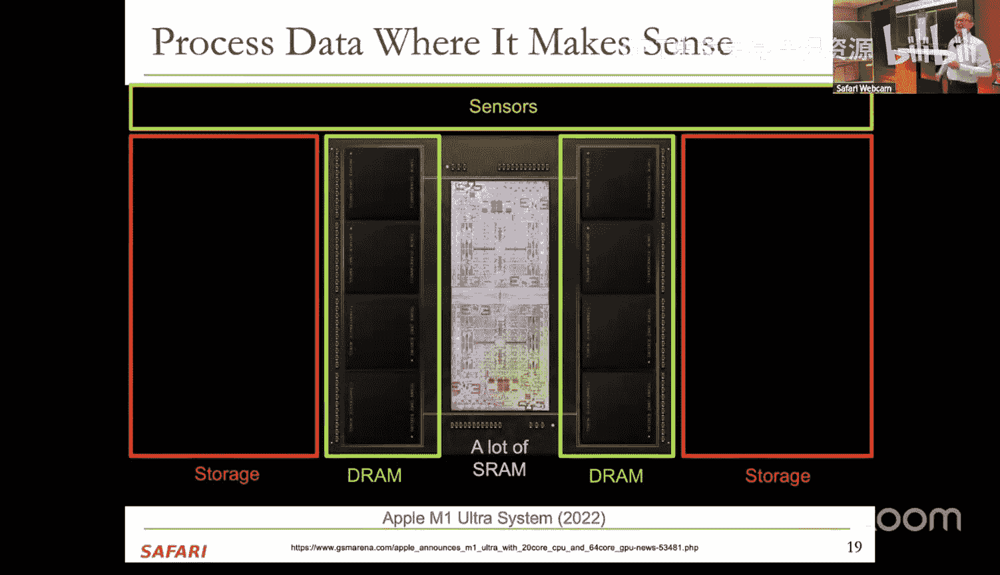
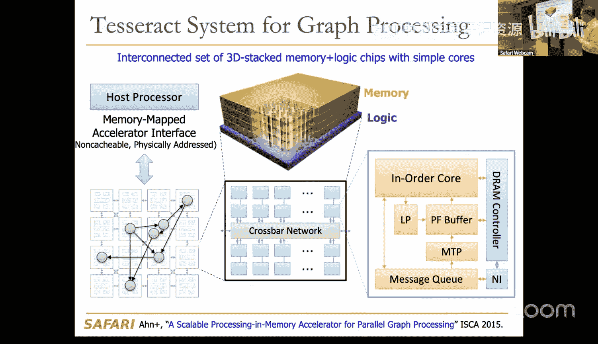
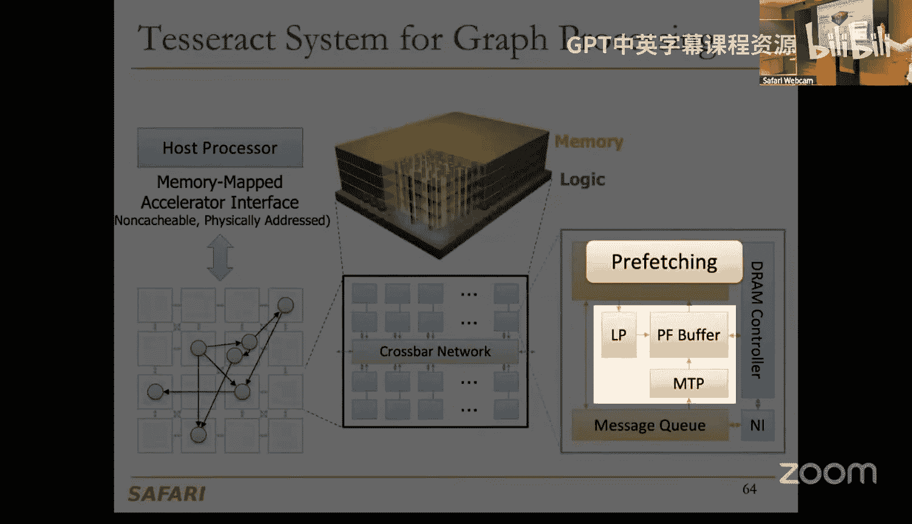
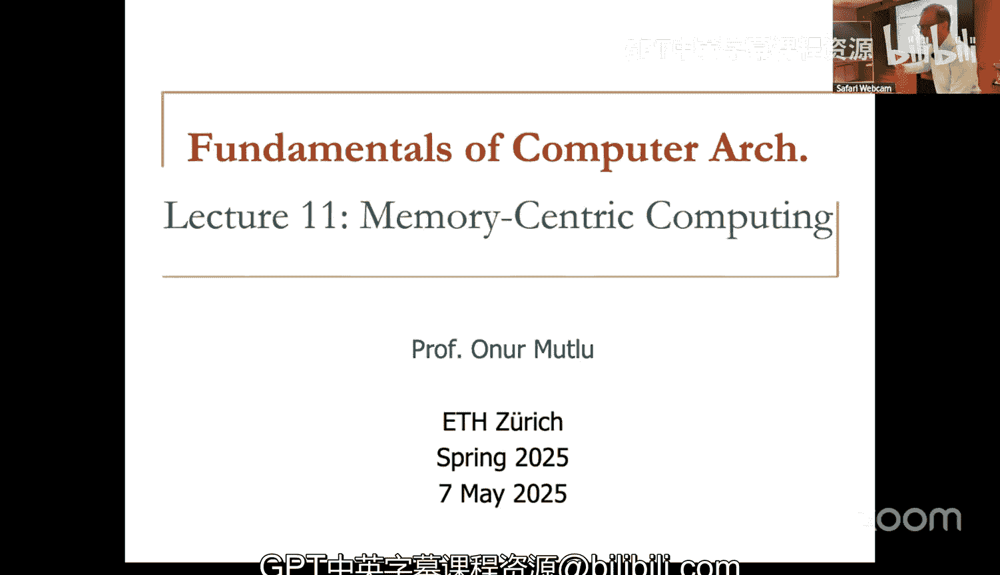

# ETHZ《计算机架构基础》课程：第11讲：以内存为中心的计算 (2025年春季)

## 概述

在本节课中，我们将探讨**以内存为中心的计算**这一新兴范式。我们将了解为何传统的以处理器为中心的计算架构在性能和能效上面临巨大挑战，并学习如何通过将计算能力移至数据所在之处（即内存或存储设备）来从根本上解决这些问题。我们将介绍两种主要方法：**近内存计算**和**内存内计算**，并通过具体的研究案例和原型系统来展示其潜力。

---

## 为什么需要以内存为中心的计算？

上一节我们回顾了传统架构中处理器与内存分离带来的问题。本节中，我们来看看当前计算系统面临的核心挑战。

当今的计算系统严重受限于数据。重要的工作负载（如机器学习、基因组学、视频处理）都是数据密集型的，需要快速高效地处理海量数据。然而，数据量的增长速度远超我们的处理能力。

我们目前的设计是**以处理器为中心**的：处理器在这里，内存在那里，数据需要在两者之间频繁移动。

*   **巨大的能量浪费**：数据移动消耗的能量远高于计算本身。例如，一次32位整数加法消耗的能量，可能只有从内存读取一个数据所需能量的1/6400。
*   **严重的性能损失**：处理器大部分时间都在等待数据从内存返回。研究表明，在尖端处理器上，工作负载只有10%-20%的时间在执行指令，其余时间都在等待。
*   **系统复杂性激增**：为了掩盖内存延迟，我们添加了巨大的乱序执行引擎、多级缓存、复杂的预取器等多线程技术。这导致超过90%的硬件资源被用于存储和移动数据，而非计算。

如果我们以“十岁孩童”的视角来看这个系统，会得到一个诚实的答案：这太不合理了。我们需要一种不同的方法。

---

## 以内存为中心的计算范式

上一节我们指出了以处理器为中心架构的弊端。本节中，我们来看看解决方案的核心思想。

以内存为中心的计算旨在**从根本上最小化数据移动**。其核心理念是：**在数据所在之处进行计算**。

这并非全新的想法，早在20世纪60年代就有相关论文。但今天它变得尤为重要的原因在于：
1.  **应用与系统需求**：数据密集型工作负载的能效和性能瓶颈已无法忽视。
2.  **内存技术挑战**：随着内存单元尺寸缩小，其可靠性下降，需要更智能的内存控制器来管理，这为增加计算功能提供了契机。
3.  **新兴技术与集成工艺**：如3D堆叠、混合键合等集成技术，使得将逻辑层和内存层紧密耦合成为可能。

我们可以通过两种主要方式实现以内存为中心的计算：

1.  **近内存计算**：将计算逻辑（处理器或加速器）放置在物理上靠近内存芯片或内存层的位置。逻辑和内存仍是独立设计的，但通过高带宽、低延迟的互连紧密耦合。
2.  **内存内计算**：直接利用内存器件本身的模拟操作特性进行计算（例如，利用DRAM中的电荷共享原理）。这是一种更根本的变革，逻辑和内存的界限变得模糊。

---

## 近内存计算

上一节我们区分了两种以内存为中心的方法。本节中，我们首先深入探讨**近内存计算**。

近内存计算通过在内存芯片内部或旁边添加处理单元来减少数据移动。以下是几个关键的研究方向和实例：

### 3D堆叠与图处理加速

利用3D堆叠技术，可以将逻辑层和多个DRAM层垂直集成。在一项早期研究中，我们设计了一个名为“Tesseract”的系统，用于加速图处理应用。

*   **核心思想**：将图数据分区存储在多个3D堆叠“立方体”的内存中。每个立方体的逻辑层包含一个简单的处理器阵列。计算时，不是将数据移动到函数，而是**将函数（以消息形式）发送到数据所在的位置**。
*   **结果**：这种架构为图处理算法带来了显著的性能提升（后来的一些工作甚至达到100倍加速）和能效提升。

### 机器学习推理的异构加速

机器学习模型的不同层具有迥异的特性：有些层计算密集，有些层数据移动密集。

*   **核心思想**：设计一个**异构加速系统**，包含：
    *   **以计算为中心的加速器**：处理计算密集型层。
    *   **以数据为中心的加速器**（位于内存逻辑层）：处理数据密集型层。
*   **运行时系统**：智能地将模型的不同层调度到最合适的加速器上执行。
*   **结果**：与单一的大型加速器相比，这种异构系统能以更小的总面积，实现约3倍的能效提升和更高的吞吐量。

### 存储内计算

对于超大规模数据集（如数百TB的基因组数据库），将数据全部移动到计算单元是不现实的。

*   **核心思想**：在存储系统（如SSD控制器）中加入简单的计算能力，执行初步的过滤操作。例如，在基因组比对中，先在存储端过滤掉那些与参考基因组完全匹配或明显不匹配的序列片段。
*   **结果**：只有少量无法轻易判断的数据需要被传送到主系统进行复杂计算，从而极大地减少了数据移动量和总处理时间。

**总结**：近内存计算通过将传统计算单元“拉近”内存，已经在特定领域（图处理、ML、基因组学）显示出巨大潜力，并且已有商业原型（如UPM的DRAM芯片内处理器）。

---

## 内存内计算

上一节我们看到了将逻辑靠近内存的威力。本节中，我们探讨一种更激进的方法：**直接利用内存进行计算**。

内存内计算的核心是利用内存阵列固有的物理特性来执行逻辑操作。我们以DRAM为例进行说明。

### 基础原理：利用电荷共享

DRAM的基本操作单元是电容和存取晶体管。关键发现是，通过**违反标准时序参数**、以特定方式激活多行字线，可以利用电荷共享效应实现计算。

#### 1. 数据复制（RowClone）
*   **操作**：先激活源行（将数据读入行缓冲器），然后**快速连续地**激活目标行。
*   **原理**：行缓冲器中的强驱动信号会将数据“推”入目标行的电容中，实现快速复制。
*   **优势**：在内存内部复制一个4KB页面的延迟可降至约90纳秒，能耗极低，且无需经过处理器和缓存。

#### 2. 位运算（例如AND， OR）
*   **操作**：**并发激活**三行（或多行）DRAM单元。
*   **原理**：被激活单元的电荷会在位线上共享。最终位线的电压状态取决于多数单元的电荷状态，这实现了**多数表决**函数。通过将其中一行固定为特定值（如逻辑1或0），多数表决可以衍生出**AND**或**OR**操作。
*   **公式表示（概念性）**：
    *   多数表决：`MAJ(A, B, C)`
    *   若设 C = 1，则 `MAJ(A, B, 1) = A OR B`
    *   若设 C = 0，则 `MAJ(A, B, 0) = A AND B`
*   **应用**：这种位级并行性非常适合数据库查询（位图索引）、集合运算、加密算法等。

### 从原理到系统：挑战与进展

将内存内计算集成到可编程系统中面临诸多挑战：

*   **编程模型**：如何向程序员暴露这些操作？一种方法是通过新的指令或函数调用，编译器将其转换为发送给内存控制器的微程序序列。
*   **粒度匹配**：DRAM一次操作一整行（例如8KB），但程序通常需要更细的粒度。研究提出了**细粒度DRAM架构**，通过分割字线，允许对更小的数据块（如512位）独立操作，从而更好地匹配现代向量化指令。
*   **可靠性**：在未修改的商用DRAM上通过“滥用”时序实现的计算，其成功率并非100%。要构建可靠系统，可能需要轻微修改DRAM设计或结合纠错技术。

### 其他有趣的原语

研究还表明，利用DRAM的时序特性还能实现其他功能：
*   **真随机数生成**：通过提前读取未稳定的DRAM单元，利用其固有的随机噪声来生成随机比特。
*   **物理不可克隆函数**：利用那些在特定时序下总是出错的DRAM单元，生成独特的硬件指纹，用于安全认证。

**总结**：内存内计算是一种极具潜力的底层原语，能够以极高的能效和并行度执行特定操作。尽管将其集成到通用计算系统仍面临挑战，但它在专用领域和作为加速器方面前景广阔。

---

## 采用挑战与未来展望

上一节我们探讨了内存内计算的技术原理。本节中，我们来看看要实现以内存为中心的计算范式所面临的更广泛的**系统级挑战**。

设计新的硬件只是第一步，真正的挑战在于整个软件栈和生态系统的适配：

1.  **编程与编译**：需要新的编程模型、语言扩展、编译器支持，让开发者能轻松利用近内存或内存内计算资源。
2.  **数据映射与放置**：操作系统和运行时需要智能地将数据分配到适合进行近内存/内存内计算的位置（例如，将需要频繁复制的两个页面放在同一个DRAM子阵列中）。
3.  **一致性**：当处理器和内存端加速器同时访问或修改数据时，如何维护缓存一致性？这是一个棘手的问题。
4.  **虚拟内存**：内存内计算单元如何理解并处理虚拟地址？这可能需要重新审视整个虚拟内存系统设计。
5.  **调度与资源管理**：系统如何决定将哪部分工作负载卸载到内存端执行？如何管理内存计算单元与主机处理器之间的资源竞争？
6.  **安全与隔离**：确保不同应用在共享内存计算资源时的安全隔离。

这些挑战既是障碍，也是研究机遇。解决它们需要计算机体系结构、操作系统、编程语言等多个领域的协同创新。

---

## 总结

在本节课中，我们一起学习了**以内存为中心的计算**这一重要范式。

*   **问题根源**：我们首先分析了传统以处理器为中心架构的致命弱点——**数据移动**已成为性能和能效的主要瓶颈。
*   **核心思想**：解决方案是让**计算靠近数据**，最小化不必要的数据搬运。
*   **两种路径**：我们深入探讨了实现这一目标的两种主要技术路径：
    *   **近内存计算**：在物理上将处理逻辑放置在内存附近（如3D堆叠的逻辑层），已有多项研究和商业原型展示其价值。
    *   **内存内计算**：直接利用内存器件的物理特性（如DRAM的电荷共享）进行计算，这是一种更底层、能效潜力更高的方法，但编程和系统集成挑战更大。
*   **系统级挑战**：我们认识到，要广泛采用这种新范式，需要克服从编程模型、编译器、操作系统到系统架构的一系列重大挑战。

以内存为中心的计算不是一时的潮流，而是应对数据洪流和能效墙的必然发展方向。它要求我们像“十岁孩童”一样，跳出固有思维，重新思考计算系统的根本设计。未来，我们有望看到计算、存储和通信功能更紧密融合的智能系统。