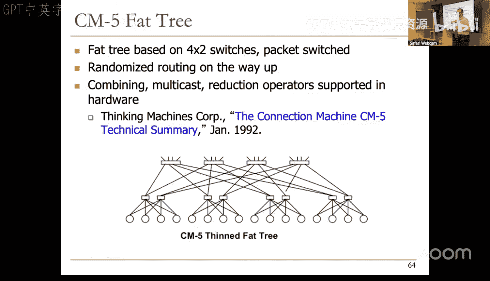
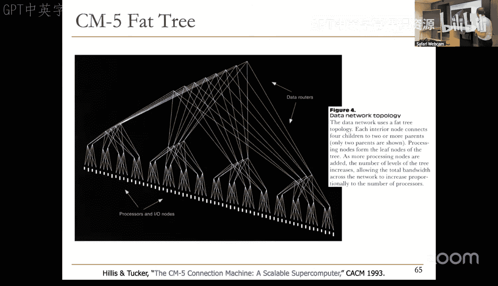
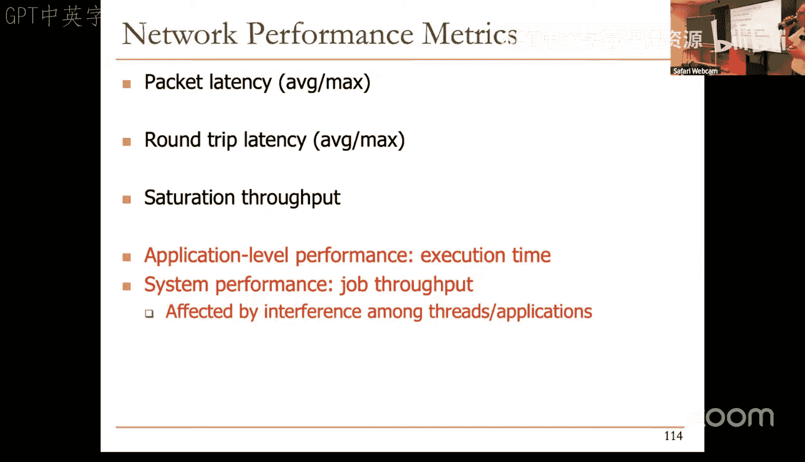

# 计算机架构基础：14：互连网络

在本节课中，我们将要学习计算机系统中的互连网络。互连网络是连接处理器、内存、缓存和I/O设备等组件，并实现它们之间通信的关键基础设施。我们将探讨不同的网络拓扑结构、路由算法以及流控制机制，理解它们如何影响系统的性能、可扩展性和成本。

## 概述

互连网络对于任何包含多个组件的计算系统都至关重要。它决定了组件之间通信的速度、带宽和可靠性。在本节中，我们将介绍互连网络的基本概念及其重要性。

## 为什么需要互连网络？

我们需要互连网络来连接不同的组件并实现它们之间的通信。例如，处理器需要与内存通信，缓存之间需要同步数据，I/O设备需要与处理器交互。所有这些都需要某种形式的互连。

互连网络影响系统的多个方面：
*   **可扩展性**：决定了系统可以扩展到多大规模。
*   **带宽**：决定了组件间通信的数据吞吐量。
*   **成本**：连接组件的硬件成本。
*   **性能与能效**：直接影响通信延迟和能耗。
*   **可靠性与安全性**：影响消息传递的保证和协议的正确性。

在计算机架构中，内存瓶颈和互连瓶颈常常交织在一起，因为数据不仅需要被访问，还需要在组件间移动。

## 网络拓扑结构

网络拓扑定义了网络中节点（如处理器、内存块）和链路（连接线）的物理或逻辑布局。它决定了通信路径、延迟和成本。

以下是评估拓扑的一些关键属性：
*   **直径**：网络中任意两个节点之间最长的最短路径长度。
*   **平均跳数**：所有有效通信路径的平均跳数。
*   **对分带宽**：将网络切成两半时，被切断的链路的带宽总和。这粗略反映了网络可维持的吞吐量。

接下来，我们来看看几种常见的拓扑结构。

### 总线

总线是最简单的拓扑结构。所有节点都连接到一组共享的物理线路上。

**优点**：
*   实现简单，成本低，适用于少量节点。
*   易于实现缓存一致性协议（如侦听协议）。

**缺点**：
*   **不可扩展**：随着节点增加，电气负载和仲裁复杂性上升，导致频率降低。
*   **高争用**：同一时间只能有一对节点通信，容易饱和。

总线适用于小规模多处理器系统。

### 点对点全连接

每个节点都直接连接到其他所有节点。

**优点**：
*   **无争用**：不同节点对可以同时通信。
*   **最低延迟**：无需经过中间节点。

**缺点**：
*   **成本极高**：每个节点需要 `O(n)` 个端口，总链路数为 `O(n²)`。
*   **布局困难**：在芯片上布线极其复杂。

这种结构不具备可扩展性。

### 交叉开关

交叉开关是一种折中方案。它有一组输入节点和一组输出节点，通过一个开关矩阵连接，允许任何输入连接到任何输出。

**优点**：
*   **高并发**：允许并发传输到非冲突的目的地。
*   **低延迟，高吞吐**。

**缺点**：
*   **成本较高**：仍然是 `O(n²)` 的复杂度。
*   **仲裁复杂**：随着规模增大，仲裁器变得复杂。

交叉开关常用于核心到缓存网络等小规模系统。实现时可以选择**有缓冲**或**无缓冲**设计。有缓冲设计更灵活，支持可变大小的数据包（可分割为**微片**），但需要额外的存储空间。

### 多级间接网络

为了降低交叉开关的成本，人们设计了多级间接网络（如Omega网络、蝶形网络）。在这种网络中，节点通过多级交换机连接，交换机本身不是通信节点。

**特点**：
*   **成本降低**：成本约为 `O(n log n)`。
*   **延迟增加**：需要经过 `log n` 级交换机。
*   **可能产生争用**：即使目的地不同，数据包也可能在中间交换机上冲突。

多级网络在成本和性能之间取得了平衡。

### 环形网络

节点连接成一个环，每个节点只与两个邻居相连。

**优点**：
*   **成本低**：复杂度为 `O(n)`。
*   **实现简单**。

**缺点**：
*   **高延迟**：平均跳数为 `O(n/2)`。
*   **可扩展性差**：对分带宽恒定，增加节点会降低性能。

为了提高性能，通常使用**双向环**。为了进一步扩展，可以引入**层次化环**，即用更高速的“全局环”连接多个“局部环”。

### 网格与环面网络

在网格中，每个节点与上下左右四个邻居直接相连（边缘节点除外）。

**优点**：
*   **成本低**：`O(n)`。
*   **布局规整**：易于在芯片上实现。
*   **路径多样性**：两点间存在多条路径。
*   **平均跳数**：约为 `O(√n)`，优于环。

**缺点**：
*   **边缘拥塞**：通信容易向中心汇聚，导致中心区域拥塞。
*   **非对称性**：边缘节点性能可能较差。

**环面** 通过将网格的边缘连接起来解决了非对称性问题，使每个节点都有四个邻居，提高了路径多样性，但布线稍复杂。

### 胖树与其他拓扑

**胖树** 是一种层次化拓扑，越靠近树根，链路带宽越宽（因此叫“胖”树）。它适合聚合通信模式（如规约操作）。

**超立方体** 是一个 `n` 维立方体，具有 `log n` 的延迟和 `n log n` 的链路数，可扩展性好，但布局复杂。

拓扑结构的选择没有绝对最优，需要根据系统规模、成本、性能目标和应用特征来权衡。

上一节我们介绍了各种网络拓扑，本节中我们来看看数据包如何在选定的拓扑中传输，即路由算法。

## 路由机制与算法

路由决定了数据包从源节点到目的节点的具体路径。

### 路由机制

1.  **算术路由**：基于简单算术计算下一跳。例如，在网格中使用 **XY 路由**，先沿X方向移动，再沿Y方向移动。
    *   `下一跳方向 = sign( dest.x - current.x )`，若为0则计算Y方向。
2.  **基于源的路由**：源节点指定路径上每个交换机的输出端口。交换机简单，但报文头开销大。
3.  **查表路由**：每个交换机根据数据包的目的地址查找路由表决定输出端口。灵活，支持容错，但交换机更复杂。

### 路由算法类型

1.  **确定性路由**：对给定的源-目的对，总是选择相同的路径（如XY路由）。简单，但无法利用路径多样性，可能导致拥塞。
2.  **随机路由**：随机选择路径，不考虑网络状态。例如 **Valiant 算法**：先随机路由到一个中间节点，再路由到目的地。旨在平衡网络负载，但可能增加延迟。
3.  **自适应路由**：根据网络状态（如拥塞、故障）动态选择路径。
    *   **最小自适应**：只在所有能减少到目的地距离的输出端口（“生产性端口”）中选择。
    *   **非最小自适应**：有时可以选择不减少距离的端口（“非生产性端口”）以绕过拥塞。性能潜力高，但需解决**活锁**问题。

### 死锁与活锁

*   **死锁**：多个数据包相互等待对方占用的资源，形成循环依赖，导致无法前进。解决方法包括：设计无死锁的路由算法（如限制转弯）、增加缓冲区、或检测并解除死锁。
*   **活锁**：数据包在网络中不断绕行，永远无法到达目的地。这在非最小自适应路由中可能发生。解决方法包括基于数据包年龄进行优先级调度。

自适应路由还可以用于**容错**，通过查表路由绕过故障的链路或路由器。

上一节我们讨论了数据包如何选择路径，本节中我们来看看当多个数据包竞争同一资源时，网络如何管理这些数据流，即流控制。

## 流控制与缓冲

流控制决定了网络在争用情况下如何管理数据包。

### 处理争用的方法

当两个数据包需要同一输出链路时：
1.  **缓冲**：将其中一个数据包存入缓冲区，稍后发送。需要缓冲区管理。
2.  **丢弃**：丢弃一个数据包，并通知发送方重传。适用于广域网（如TCP/IP），但在片上网络可能引入额外延迟和复杂性。
3.  **偏转**：将冲突的数据包通过另一个非生产性端口发送出去，让其绕行。这是**无缓冲路由**的核心思想。

### 电路交换 vs. 分组交换

这是一个更高层的设计选择：
*   **电路交换**：在数据传输前，预先在源和目的地之间建立一条专用路径。建立后，数据可以无缓冲地流式传输。
    *   **优点**：无仲裁开销，无缓冲，适合大数据流。
    *   **缺点**：链路利用率低，建立和拆除路径有开销。
*   **分组交换**：每个数据包（或微片）在每个路由器独立做出路由决策。
    *   **优点**：灵活，链路利用率高。
    *   **缺点**：需要每跳仲裁，可能需缓冲，延迟可能较高。

### 无缓冲（偏转）路由

这是一种极端的设计选择，完全消除路由器中的缓冲区。发生争用时，强制偏转一个数据包。
*   **优点**：路由器设计简单，面积和功耗低。
*   **挑战**：需解决活锁问题；在高负载下，由于缺乏缓冲，吞吐量可能下降。

偏转路由与某些拓扑（如层次化环）结合能取得良好效果。

## 网络性能分析

评估网络性能通常使用**负载-延迟曲线**。
*   **X轴**：注入负载（如每个节点每周期注入的平均数据包数）。
*   **Y轴**：平均数据包延迟。

曲线特征：
1.  **零负载延迟**：当注入负载为0时的延迟。由**拓扑**、**路由算法**和**流控制**的开共同决定。
2.  **饱和吞吐量**：延迟开始急剧上升时的注入负载。它代表了网络的最大可持续吞吐量，同样受拓扑、路由和流控制效率的限制。

**重要提示**：网络性能最终必须放在整个应用和系统背景下评估。特定的通信模式可能使某些网络设计表现得更好或更差。

## 总结

本节课中我们一起学习了计算机互连网络的基础知识。我们从互连网络的重要性开始，深入探讨了多种拓扑结构（总线、点对点、交叉开关、多级网络、环、网格、环面、胖树等）及其权衡。接着，我们了解了路由机制和算法（确定性、随机、自适应），以及它们面临的死锁和活锁挑战。然后，我们研究了流控制方法，包括电路交换、分组交换以及有趣的偏转路由。最后，我们介绍了如何使用负载-延迟曲线来分析网络性能。互连网络是一个丰富而复杂的领域，其设计需要综合考虑拓扑、路由和流控制，以满足特定系统在性能、成本、可扩展性和能效方面的需求。