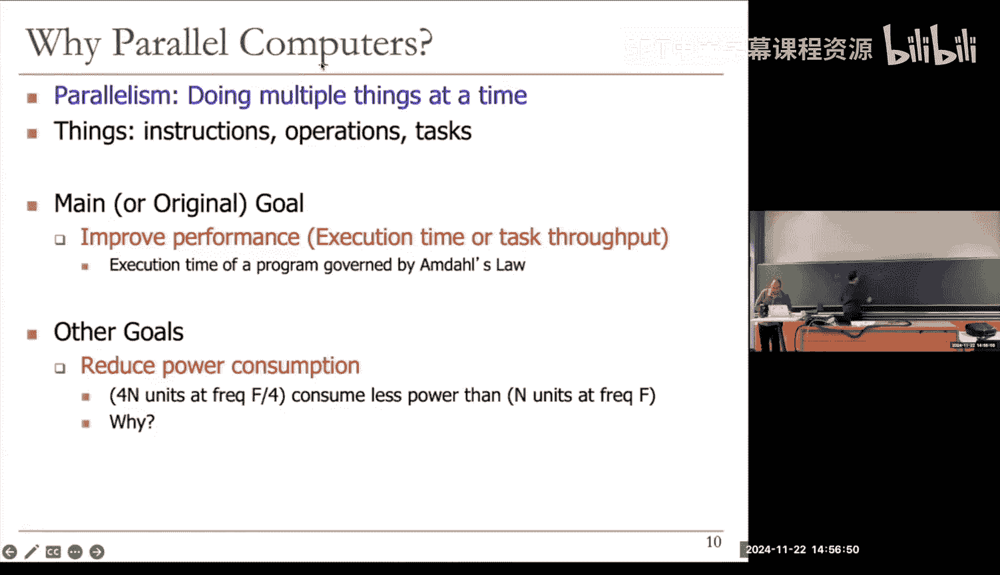
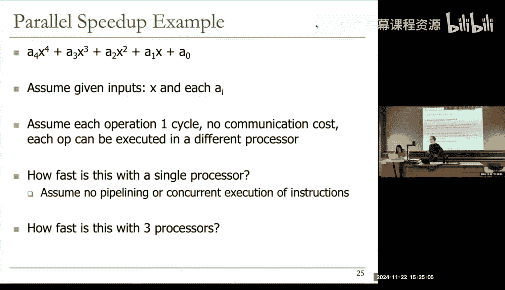
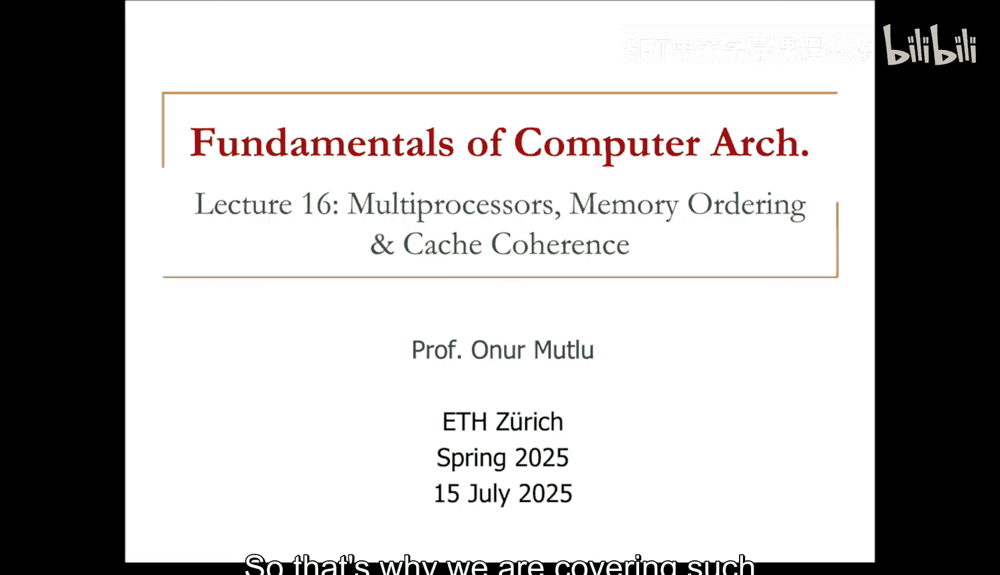
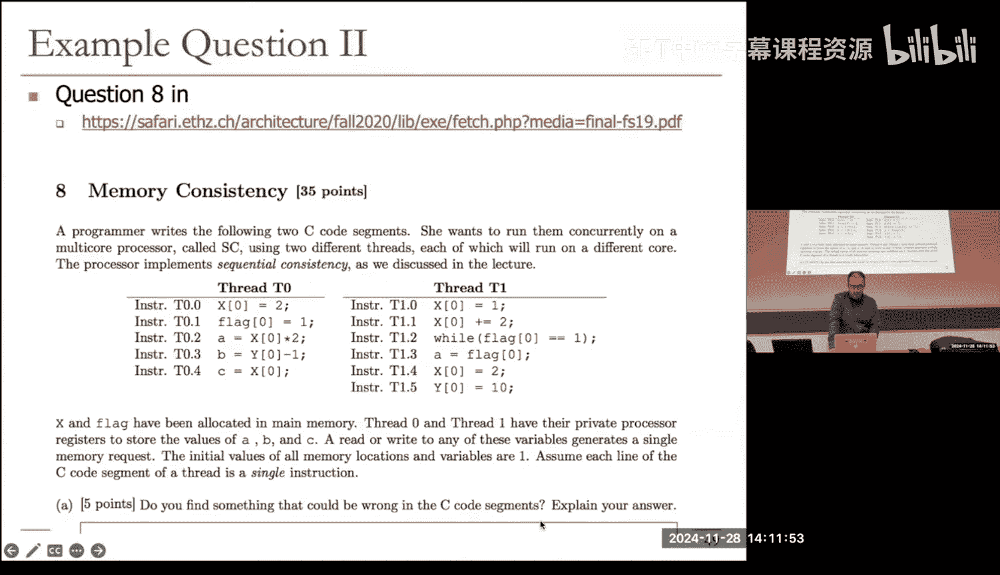
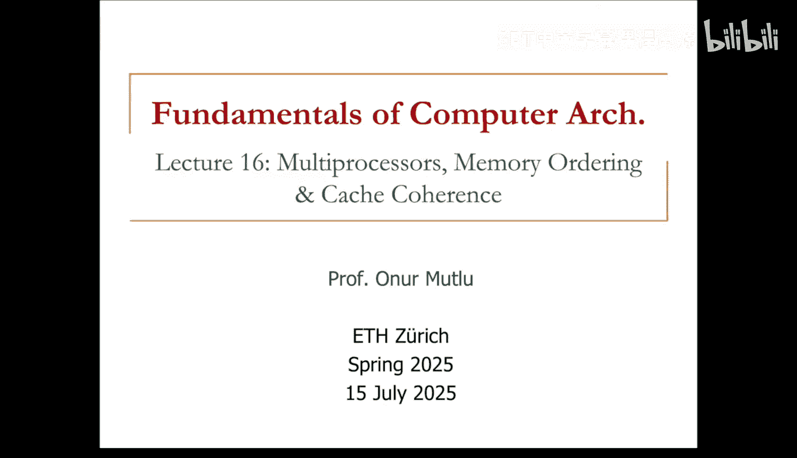
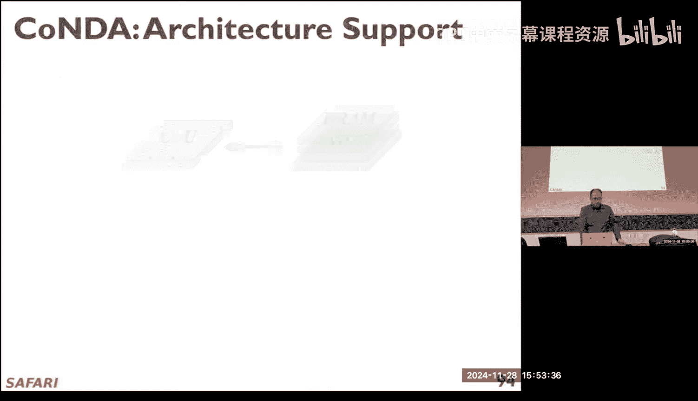
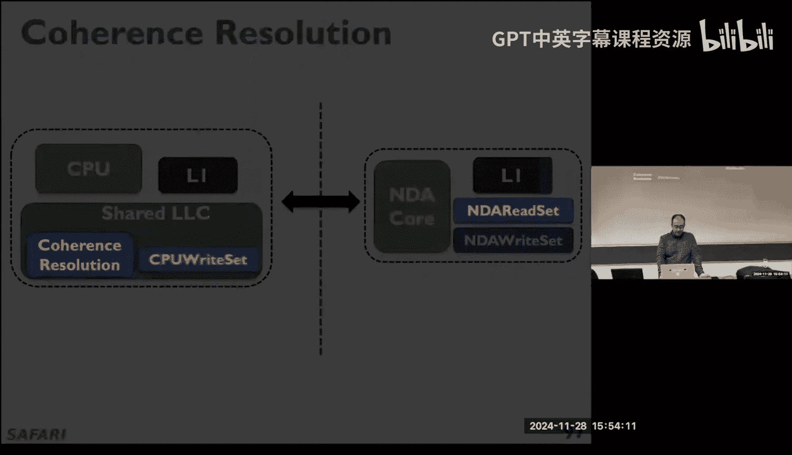
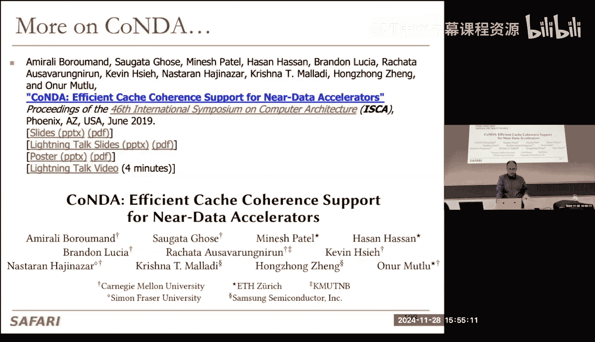
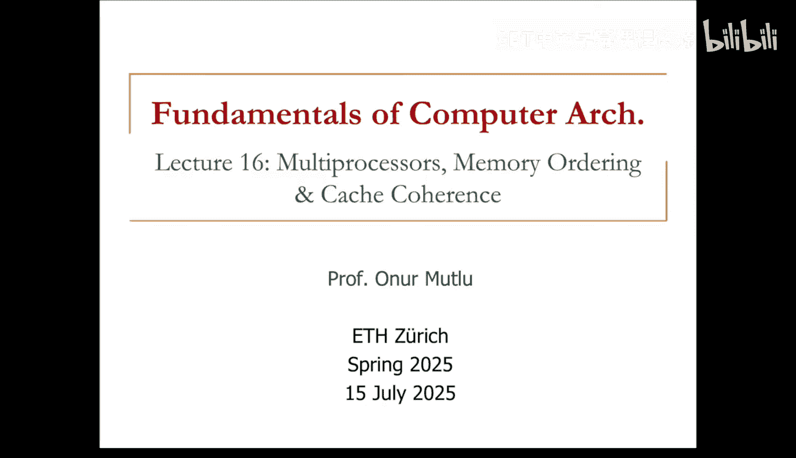

# ETHZ《计算机架构基础｜ETH Fundamentals of Computer Architecture 2025》中英字幕 p17 L16_ Multiprocessors, Memory Ordering & Cache Coherence (Spr. 2025).zh_en -BV1Xc19BnET7_p17-

Sll we get started？Is it all good only， okay？Okay， we've been talking about multiprocess。

But I have my lecture is also titled multiprocessors。

 so we're going to take a step back and give a different broader treatment of multiprocessors now。😊。

But hopefully so far， you've seen an interesting collection of ideas and also problems and multiproces。

These are some readings， I put MDd's paper as required。

You'll read it hopefully how many people have already read Amd's seminal paper。No one。

No one took DDCA here。I guess not。 Okay， if you were taken DDCA， that was a， it was an extra credit。

😊，You would get 1% of the course grade。For completing every review of it。Right yeah。Yeah。

 it's an important paper to read， and this is the full title， as you can see。

 Vality of the single processor approach for achieving large scale computing capabilities。😊。

And we've discussed that this is another paper that we will discuss。Probably not today。

 given how fast we're going probably next week， it's about sequential consistency。

And there's another paper on cash coherence the mei cash coherence protocols that is also here these are some fundamental papers there are a bunch more that we will discuss as we go along。

But I want to give a broader overview of multiprocesing and this starts with a taxonomy of computing in general。

 basically how do you design a computer is a question to ask and this paper from Mike Flynn in 1966 classifies different computers。

Based on how they operate and there are two dimensions。

In which he looks at the problem when his instructions and the other is data， right？

And you can have a single instruction or multiple instructions and you can have single instruction。

 multiple data， sorry， a single data， multiple data。

sAnd then you have a two by two matrix in this two by two matrix， one side。

 one part is single instruction， single data processes。

In this case a single instruction operates on single data elements it's a scalar another way of putting that is you have a single instruction operating on a scalar data elements。

 it's a scalar processor it's good to think about that way。😊，呃And呃。

Clearly it's not necessarily a single data right you may have multiple operas。

 multiple operas doesn't mean that doesn't violate this each of the ups that the instruction is operating on is a single piece of data。

It's not。😡，Specifying each opera doesn't specify a million pieces of data， for example。

 it's just a single scalar piece of data。So this is essentially a single sequential thread as we know it today。

😊，SIMD is you still have a single instruction。But it operates on multiple data elements。😡。

Now in this case。A single instruction specifiedifies a lot of work。

And there's a specific way of that work helps basically you do the same operation。

On many data elements， right？This is essentially array processinging or vector processinging as we have seen in DDCA。

But you also have someD instructions and existing Is like X to6， et cetera。

 but this is a way of designing the computer。You can combine these ways also。

 and we're going to briefly discuss that。So this is highly parallel clearly because the main benefit of single instruction。

 multiple data processor over single instruction， single data is clearly you unleash a lot of parallelism with a single instruction right。

 it could be a million element vector and we have discussed again if you haven't taken DDCA I'd recommend watching the lecture on CD processors。

 existing GPUs or CM processor today， we may have a lecture later on but maybe not let's see depending on how things go。

 essentially the benefit is you unleash a lot of work。

 but you also a different way of looking at unleashing a lot of work with a single instruction is you reduce the overhead of control。

😊，Now， what does this mean if you have single instructions， single data。

 every instruction specifiedifies little amount of work， so the amount of control。

That each instruction goes through is a big part of the overhead right you're doing really the computation is executing the computation on lots of data。

 but you need to fetch the instruction you need to decode the instruction you need to rename the instruction you need that instruction needs to a lot of pressing needs to be done on that instruction so that you can do。

Some work on two pieces of data。That's a lot of overhead if you look at the energy spent on NSISD processor。

 most of it is really spent on the overhead， not the computation itself。😡。

There's another way of thinking about， I'm not even talking about memory over here。

 forget about memory。😡，This is just the computation that you try to do and what is required to enable that computation means fetch instruction deco instruction setup with SIMD。

 and this is one of the major benefits of GPUs assuming or vector clusters in general。

Assuming you have the parallelism in your program。You decode fetch and decode the instruction only once and you unleash a million operations right so the efficiency of this is much better essentially the overhead of an instruction is really amortized over many data elements。

😡，Okay， and then there's a couple of other things on the other dimension。

 multiple instruction data and now we have multiple instructions， multiple instruction streams。

 I'd like to think of it that way， operate on a single data element。😊。

This is a bit of an awkward one essentially the closest form is actually something that we have examined in the DCA also a systolic array processor which is a way of building machine learning excccelerators today。

 essentially you input data to an array of processors。

 array of functional units you can all close think of it that way and the data gets processed in one functional unit and transformed into data prime and that gets input into the other functional unit。

 the other function does something on it and then transformed into data prime prime and then the other function unit gets it and transformed it and outputs it so basically the single data。

😊，I don't know what's going on， there's some connectivity issue， yeah。A single data element。

Is input once to multiple instruction streams， if you think about it multiple instructions in a systolic fashion。

 but it gets a fashion， it gets transformed in every operation I think this's the closest form that I could think of to misD processors。

😡，And then there's MIMD， which is really the subject of what we're going to talk about today。

 which is you have multiple instruction streams operating on multiple data。

 essentially you can think of this as instruction streams that are separate from each other and they're executing concurrently。

 it could be a multi thread processor， it could be a multiprocessor。😊，And clearly。

 today's systems are a combination of almost all of these。

 you have MIMD processors in a multi processorces and each。😊。

Core in that multiprosor is a sISD type of processor。😡，Which。As SD extensions。

And if you have an accelerator that is a machine learning excerator that may be Miy right a GP is clearly a Sdy type of processor。

 but you can it also has some accelerators internally that maybe that may look Miy okay so basically we use all of these paradigms today。

😊，Which is good so if you want to brush up on these different paradigms we cover essentially all of them in DDCA says the SD MiD。

Now we're going to talk about。Mimdy type of pears。But parallelm is more general， actually， clearly。

 all of these processing types exploit parallelism in some way to improve things。Peralism。

 in its very basic definition， it's really doing multiple things at a time， right？

Everything can be parallel， it's not a function of just computers clear。

Things from the perspective of computing could be instructions， operations or tasks， right？

And the question is， why do we do it？Why do we do it to anybody。Why do we do things in parallel？

Esster， exactly， basically the main original goal is really improving performance。

Execution time or task output depending on how you define performance and we're going talk about Mda law we talked about already。

 but that's not the only reason。There are other goals。Anybody。If you don't want faster， for example。

 you could want something else and parallelilism still can help you。Energy efficiency， why？就。后面就是我们。

嗯哼。😊，我了这个。一。嗯哼。Yes， not maybe it is more efficient， right， so basically energy or power。

 you want to reduce power consumption， right？😊，And。If you have， let's say， n units at frequency F。

 for example。It consumes more power than four n units at frequency F over over4。

You can think about that。Am I right。I'm not right or do you have another reason？The defralsh？

You can shut it down exactly that's one way of thinking about it。😊，But I mean， this may be slower。

 right？Maybe there's no time to shut it down。So the main reason over here is this is assuming you can perfectly paralyze your program by the way。

 first of all， there's an assumption over here， you can perfectly paralyze your program or you have completely independent things that way you can the baseline is you run n units at frequency F。

 or let's make n1 one unit at frequency F。😊，And。You have four units at frequency F over4。😡。

Assume that they take the same time。Because you reduce the frequency by four。

 this is still more power efficient。Why， or maybe you can say this is not power， then here's why。

Why is4 n units at F44 more power efficient than n units at？Yeah， why。系。😊。

You could keep asking why forever， right？No not physics， well， of course it's physics， right yes。Yes。

 okay。 that's， that's right。 Okay， maybe I'll write the power equation。

 but I don't know how to deal with these things。 Something is moving。我好注意。So。

I should have used this one， maybe。Maybe we can。There should be a way of blinding this， right？Okay。

 too much overhead， of course， switching as you can see。

Switching to a different medium always takes over it Yeah basically， as you have said。

 the basic reason is。At least dynamic power。Is equal to。C，V square F。Well。

 I guess I wrote large Jeff。

So if you reduce frequency。Clearly， this reduces， right？Now if you reduce frequency。

 you can also reduce this。Because you don't need to really power your circuits as much with high voltage。

And now this reduces。Now we have a quadratic effect right or cubic effect。😊。

Once you reduce your frequency， the power reduces actually cubicle。Makes sense。

Now you could also argue， I didn't say that I just looked at frequency。

 but assuming that you design a simpler core also。😡，Potentially， you could also reduce capacitance。

Who knows？Because there could be much less loading。

 much a heavy out of order core is actually much harder to design。

Then there are a lot of loading that happens on the buses， for example。

 as simpler in order core there's a lot less loading。

 so basically you would definitely gain on this one。

Gain more on this one and probably gain on this one。😡，And your dynamic power is much lower。

And this is dynamic， there's also static power。Even if you ignore static power。

 you gained alreadyd cubically， right？So if you actually have four n units。At F over4。

And n units at F， you can do the calculation Act， this is clearly going to be lower power。

Because again， you get cubic reduction over here， okay。

 I don't want I don't want to deal with that basically for cube， let's say。

Even though you increase the number of units by four。

 you'll hopefully reduce the power by 64 for 1664 okay。

 but static power is also another thing to think about and static power is usually related to temperature。

😊，An area， again， I don't have a good equation for this， but it's actually correlated with area。

 I will say。Because it's really leakage if your area is larger。😡，Your leakages also much larger。

If you actually design a smaller core， which was not what I said over there， it was frequency。

 but assume that you also design a smaller core， now you have lower leakage also overall。Actually。

 it's related to time also how long you execute， but the time was hopefully the same。Yes。Thank。嗯。对。

Yeah， is because。That's right。 That's what。Yeah， yeah。

 that's why I said assuming you can perfectly ferize things， I said you don't move data， right？

If you can perfectly paralyze a program。Yeah， but once you actually become imperfect。

 meaning you you have more data movement， you have more synchronization。

 you have some load imbalance you have yeah， you have resource sharing then of course your your power savings will not。

Be as much right， in fact， sometimes you may increase the power， right？

Because your performance will not increase。Makes sense。Yeah。

 that's why the assumption is really important， perfect parallelization。Okay， how do we go back。

Should be a simple button， no。No， you need to share， okay。

Oh， I see。Okay。Okay。Oh no， my second thing is already there。Okay。

 I'll give it to you so we we've covered the power consumption energy part the second reason is improving cost efficiency。

 scalability and reducing complexity I kind of put all of them together， right？😊。

So if you have parallelism， again， assume perfect parallelization。

It's harder to design a single unit that performs as well and simpler units， right？😡。

If I have perfect parallelzization， I'd rather go with n simpler units。

Hopefully that's kind of obvious I have I design a simpler thing I is replicated million times。

That sounds good。So that was another goal， what about the third goal？

Or if you have a fourth or fifth one， yes。Okay。O。So but you're saying performance and energy efficiency。

嗯。都这个。嗯。没。嗯哼。对。Yes。嗯。Yeah， I agree， but that's not adding one more goal， right？

You're actually covering all of them right now， they're simpler。

Which is through power a better power and also a better performance， yes。I agree。

But I'm looking for some other reason to do apparel computation。No other reason。

It must be something because there's some space over there。It's not a trick question in that sense。

 we're going to fill that space。Why would you ever want to execute some？

Thing on two different things。Yes。Exactly， I gave you too much hints， maybe。😊，Basically。

 improve robustness， yes， dependability basically if you have。Multiple。Of the thing multiple things。

 multiple processinging units， you can actually do the same thing on both of those processinging units and then compare the results this redundant execution of space。

I'm assuming no one else has another reason。That way I don't need to modify my slide because there's not enough space here as you can see yeah。

 I'm joking if you find some fundamental reason we'll find a way of modifying the slide。😊，Okay。

This is kind of like like page limits and articles， right？

They're designed to be like fixed and they don't consider what's really important。

We will add stuff to the slide and slide will become bigger and longer。

 the article will become become more it's a fundamental to add something important。

 but the page limit it goes against that fundamental thing right。😊，Okay， yes，嗯。

Not necessarily linearly， but yes， certainly。喂为。Yeah。Well。

 I don't want to talk about Den art scaling， but that's not a bad question。

I don't know if anybody can see this anyway， I don't want to switch too much。Okay。

 but basically you can see it right， CV square。😊，Essentially， then art scaling。

 which is a technology scaling， let's say law that used to hold in the past。

When you reduce the size of a circuit， it basically said that you could reduce the voltage associated with it。

 that's basically it。😡，And it doesn't say anything about linearly et ce。

 in the original paper there are some calculations， but it basically you can reduce the voltage。

 but at some point it became very difficult to reduce the voltage。So it's not happening anymore。

 so it's really related to the size of the circuit and how you can scale the voltage along with it。

Clearly， there's a relationship voltage to jump fleet frequency。

 but I would say it's more complicated than just linear。Does that make sense？Okay。

 so it's an online question or maybe they can write something。Okay。呃。Okay。

So there are different types of parallellism and different ways of exploiting them。

 we've covered some orD， so instruction level parallelism essentially different instructions within a stream can be executed in parallel and we've covered a lot of these and digital design and computer pipelineing。

 Autoor execution， speculative execution， realIW data flow。

 they're all exploiting instruction level pes。😊，Data parallelism。

 in this case different pieces of data can be operated on in parallel and SD is an example of it。

 systoic arrayase and streaming process are also examples of it。😊。

And then there's testal parallelism in which different tasks or threads can be executed in parallel。

This is actually really the multi thread and multi processinging and we're going to look at that in detail。

😊，So what is test double parallelm， so if you want task double parallelism you want tasks clearly and somebody needs to create those tasks。

😊，呃。The more difficult problem is the first one， the easier problem is this one。

 you already have the tasks because there are different programs， processes， different jobs。

 for example， and you run them together on different processors。😡。

But let's take a look at the first one first， you want to partition a single problem into multiplely related tasks or threats。

You could do this explicitly using parallel programming。😊。

This is easy when tests are natural in the problem。

 you can actually easily divide things into threads this's difficult when natural test boundaries are unclear actually。

😊，Loops， for example， could be paralyzable， but it's good to think about that or you could do this transparently or implicitly。

 this is also called thread level speculation let's say you can partition a single thread speculatively。

😊，Or non speculatively also， I should probably add that。

A compiler can try to do this for example completely a programmer can also try to do this well sorry not if a programmer does it then it's not really done over here。

 but hardware I might say hardware hardware can actually do this transparently。😊，呃， so。In a sense呃。

If you could， for example， ship a part of the program to a large core transparently。

 you're really paralyzing things， right？Or a small court， maybe。Okay， or you can run。

 so this is the hard part we're going to talk more about this one。😊。

The easier part is when especially when you have independent tasks that are already there。

 for example， you have different users， tasks from different users， tasks from different simulations。

 for example， you do the same simulation for a million different workloads right you're designing a processor and you want to simulate the different effects。

😊，So cloud computing workloads， for example， cloud computing systems take different workloads from different people。

 These have nothing to do with each other clear there are different tasks and they they could be executed on the same computer。

 They could be executed in parallel across different computers now this doesn't improve the performance of a single task。

 of course right which is a harder problem So we're going to focus more on the。

Improving the performance of a single task in this lecture。Okay， let's talk about some fundamental。

 there are two types of multiprocess they both exist today， looselyupled versus tight decoupled。

Lly coupled， the main distinction between them is whether the multi。

 the different processors share a global memory address space or not。😡。

So in loosely coupled multiproors， there's no shared global memory address space in tight couple。

 there's a shared global memory address space。Meaning when you run one program， it can reference。😡。

An address that can also be referenced by some other their program。Okay， that's interesting now。

This is also called a multicomp network， in a sense， network based multi processor。

 so if you're all on the same network。You can they could also be thought of losing a coupled multiproors and you can partition a program across my laptop and your laptop and your laptop and your laptop。

 for example。These are actually loosely coupled multi processors right now。

 maybe they're not explicitly designed that way， but they are。😡。

And I could actually participate in my program， of course。Your laptops。

 assuming I have the permissions to do so right？Yeah okay so this is more traditional multiproing so we're going focus more on the tightly coupled part it's also calledsymmetrictic multiproing I don't like that name that much but yeah because what the symmetric means assume something right essentially existing multi corere processors or multi thread processors are this way。

😊，Lose the couple multipros are usually programmed via a message pass。😡，You send messages。

 you send explicit calls， send and receive for communication。This doesn't have to be the case。

 but you could because there could be programming is actually different from whether or not you have a global memory address space。

 but let me talk about this first and then i'll clarify that essentially。

You send explicit messages to data to communicate data between the processors。

 because there's no other way in essence。You cannot say load from location next。😡，You could say that。

There has to be some。Level software that translates that to messages。

So that's the interesting thing about programming， right， programming can be anything。

And hardware can be anything。It all depends on what's in between。

You could program a loose a coupled multipro assuming a global shared memory space。

 assuming you have a virtualization layer， software layer that translates what you have done to。

Something that can actually execute on that hardware， which is message。So it's important to， I think。

 understand that that's why I say usually。Of course。

 if you program this with a global memory address， assuming a global memory address based programming model。

😡，going there are going to be some overhead to translate all of that to the underlying communication model。

 which is no global memory address space right？Okay， so a tightly coupled multi processors。

 a programming model is similar to unit processors， again in general。😡，呃， meaninging。

You assume loads and stores and different tasks communicate using loads and stores with each other。

So you could think of it as a multitasking unit processor。

 except operations on shared data requires synchronization。😊，Again。

 there's a difference between programming model and hardware execution model。

 you could have a tightly coupled multi processor， a multi core processor。And it could program it。😡。

Using message Pass。This is a bit easier to achieve， I think， actually， than the other way around。

 essentially if you have message passing based programs you just need to translate them to loads and stores。

😊，I believe it's easier。Okay。So I think in this slide。

 I covered different types of multipro and also the distinction between programming model versus the hardware execution model。

 right？Basically， the way these multipleprocesors actually differ is really the hardware execution model。

 which is whether or not you have shared global memory address space to communicate or not。

And usually they differ in programming models， so but not always。😡，Okay。

 so there are many design issues， we're going to focus a lot on tightly coupled multi processorcess。

😡，There are many design issues over here shared memory synchronization。

 how to handle synchronization， what kind of synchronization parameterss you have you've already talked about some of these if this was a more software oriented course。

 you could actually talk a lot about like parallel programming course。

 you could talk a lot about like how to optimize the logs， how to do better atomic operations。

 how to do better barriers， how to do better parallel programming。😊。

But we don't have time in this course for that clearly。

 that's the subject of a full parallel programming course。

which usually assumes shared memory synchronization also actually。

 which usually assumes tightly coupled MP， but we're not going to talk about that we're going to talk about some of the implications of it。

😊，Cash coherence becomes important you need to ensure correct operation the of private caches。

Keeping the same memoryria cache， we're going to talk a lot about that next week。😊。

Memory consistency the ordering of all memory operations is important。

 What should the programmer expect that the hardware provide in terms of ordering we're going to talk about that probably not today。

 given that we're going slowly we've talked about shared resource management that is actually an issue in。

I think all types of processors but tightly coupled multiprocess also suffer from that and then we're going to talk about interconnects which is also an issue across the board。

 but shared memory synchronization， cash coherence。

And memory consistency are especially issues that are imposed by a shared memory model。

Especially hardware models。Now， if you do a programming model， shared memory programming model。

 I think you can run in some of these issues also， even if your hardware doesn't support shared memory。

 which is it's not tightly coupled， but we're not going to look at that situation。Okay。

So their main programming issues， they're also programming issues。

 and mean you covered some of these actually in tightly coupled multiprocess。

 how to partition a single task into multiple tasks such that the load is balanced giving you an example from yesterday right partitioning a book and counting the characters in a book。

Even that task is not so easy in terms of load and balanceance。Partitioning is easy。 Lord and mouth。

 getting the Lord in mouth right is not easy， right， synchronization。

 how to synchronize efficiently between tasks， how to communicate between tasks there。

Again we're going to cover the basics to enable better synchronization but not talk about synchronization。

 how to do better synchronization and software better you talked about actually mechanisms to enable this like in a fast way without making the programmer go crazy yesterday right bottleneck acceleration and today also。

😡，But there's more if you are a programmer and if you want to optimize your program you can actually do more contention avoidance and management。

 we'll talk about that， but there's also a shared resource contention we already talked。

 how do you maximize parallelism and how do you ensure correct operation while optimizing for performance that's actually interesting。

😡，And kind of what we covered yesterday， how we motivated asymmetric multi corere was this， right？

We don't want programmer to。To reduce the size of the critical section at the expense of correctness。

And if you already have。Not so bad， let's say critical section， we're going to accelerate right。Okay。

So I will make an aside over here also。😡，Whi is hardware based multi threading essentially multi threading is also another approach。

 it's not basically you can execute multiple threads concurrently right？😊。

But these multiple threads don't need to execute on separate processor。

 they could execute on the same process。In the same processor。

 there are different approaches to hardware based multi thread， one could be coarse quained。

Fine grain and simultaneous and again all of these are implemented in today's processor。

Except processors that implement fine grain multi threading don't implement pimultaneous and vice versa in general but coarse grain is over there Cose grainin means basically you have a single processor and you multiplex time multiples multiple threads on it multiple tasks on it it could be based on quantums time quantums and that's what happens in today's systems right you switch to another thread after some milliseconds and the operating system as a schedule for that or you switch to another thread based on some event happening this thread basically yields for example you can actually explicitly yields the processor and then that notifies the operating system that this processor has become scheduleulable and the operating system schedules another thread on it。

Or it could be done at a finer ground layer event based。

 which is also called switch on event multi thread， for example。

 when you can switch on an alt threes。😊，You can have the。And Altremus。Happen in one threat。

And another thread。can be scheduled。Now， there's an interesting distinction here at some point。

Clearly， coursearse grain has different coursearse grain lit as you have seen right one is large time quantums。

😊，The other is events。Largetime quantums and coarse grain events don't require multiple hardware contexts to be in the same processor right？

But if you start switching on an altus， Alreus， for example now。😡，呃。

It takes a lot of time to change the context。😡，Because that requires an operating system call and the operating system needs to remove the existing threat。

 write its context， write its context to somewhere in memory， and then bring in some other thread。

 read its context from memory and put it into the hardware structures executing right including the register files。

 program counter， address translation， basic structures， etc。

So if your coarse grain grand larity is actually lower and lower。

 then you want to keep the thread context in the hardware also。😡。

So there's some coarse print multi thread。That doesn't require threat context in hardware。

 and there's some co grain multigraing that starts requiring threat context in hardware。

You need to have basically multiple sets of registers。

 multiple essentially multiple sets of registers， right？呃。Maybe even multiple sets of TLBs right。

 usually that's not done， but it's possible to do。O so呃。

That's coursese grain once you start going fine grainined as we have discussed in DDCA fine grain means we have also discussed in the last lecture right some Niagara approach was like this。

Essentially， you do cycle by cycle， every cycle you switch to a different track。😊，Clearly。

 you cannot do this in software at all。😡，You can do switch on Altist and software。

 except it'll be costly。😡，And you also need some mechanisms to signal to the software clearly you need to change the hardware。

 but here you have to change the hardware and add threat context， right？Simultaneous is。

I guess somewhat similar to fine grain， you have hardware thread contexts。😡。

But you don't switch to another if we every cycle。😡。

You just keep executing from different threats andcur。

You may fetch from the threads every other cycle， but instructions from different threads are everywhere in the pipeline。

 whereas fine grain means a given instruction， only one instruction can be from a given thread。😡。

In the entire pipeline。So different threads occupy different parts of the pipeline whereas here simultaneous everything can be simultaneous in the pipeline so the difference here is fine grain multi drain is a lot easier to implement in the sense that。

Within a thread， you don't need any dependency checking whereas simultaneous within a thread。

 you need to have dependency checking because you cannot guarantee that multiple instructions from the same thread is not present are not present in this pipeline at the same time。

Okay， so clearly today's processor simultaneous multifil intel called a hyper threading。

Which means nothing， I think。😊，I guess it's hyper compared to coarse grainin multi threading yes but fine grainin is also hyper than right fine grained is actually fine grainin doesn't have a good name also in my opinion that that's the way things are named。

😊，Fine grain is extremely cycle fine grade I would call cycle by cycle maybe。Okay。

 so this is important and clearly all of these issues that we're going to discuss arise in multi thread as well。

😡，But we used to cover more multi threadreading in past。

 well we still cover fine grain multi threading， but then I had more more multi threading lectures in an earlier class that I'm not going to cover。

These are actually very nice， interesting topics over here that we don't have time to cover。

If you're interested， you can look。Any questions？Okay， otherwise。

 we're going to cover something that is extremely important， I think。

 when we discuss parallel processing。And that's going to be the limits of parallelar speedup。

We're going to have some fun。I'm going to ask you to think a of it。

So this is my polynomial over here。A variable AI are actually constant。X is our variables。

 x is an input essentially， and this is x to the power of four x to the power of  three x is the power of two x to the power of one。

And thes next to the power of zero。To be， let's say， complete。

So assume that you are given inputs X and each AI。Assume each operation takes one cycle。

 there is no communication cost and each op can be executed in a different processor。

 this is the assumptions that we have had earlier right perfect parallel processing。😊。

There's no overhead in instruction fetch， forget about that， there's no instructions。

We just schedule operations into different processors， functional units。

Then the question there are two questions over here， how fast is this？

Polynomial evaluation with a single processor。And then you assume no pipeing or concurrent execution of instructions。

 just one instruction in the processor， right？One cycle in each process。

And then and then there's no distinction also between instructions， addition is the same cycle。

 the same one cycle， multiplication is also one cycle， okay？

And then the other question is how fast is this with three processes？If I go to the next slide。

 maybe not， okay。😊，If you had a photographic memory and if you took a picture of the next slide。

 then maybe you'll get it right。😊，Okay， I'll give you a couple of minutes。It。If you want。

 you can rewrite the expression well， assuming basically I want to compute this polynomial as long as you get the results right。

😊，呃。I'm not going to say I don't care how you do it because you may get lucky in getting the result right。

 but I want you to still compute this polynomial。😊，Yes， you have a question。No， okay。

 it got answered。That's not given yeah yeah， only X is given， only AI is are given， yes。

 I'll let you work through it。😡，This is fun。Let's see if we can achieve consensus。嗯，那's see。嗯。

Let me to see first and then。嗯，是。And maybe it' switch。

I to let's see how this works well we can overlap the latency of switching。

Don't go to the next slide。😀M。😊，It didn't start。 I get started。Un你 stop。

嗯。哭。So this is it。 Okay， I'm not gonna show anything yet。哦啊。也。Is it already completed yet。啊t。

We can wait a couple more minutes。嗯哼哼。😊，No using chat TPT I should have said that earlier。

 I wonder if it'll get it right actually， I'm curious。😊，If it's studied my old lectures。

 maybe I'll get it， right？嗯。Okay， go ahead。you size咗。嗯哼。What's it again？A piece of salt。

Two but I couldn't understand that part too。Two in two， like two by two。嗯。嗯哼。😊，有。Yeah， I mean。

 that will be tightly coupled in that case， assuming those tourist risk five cores are part multi processorces that actually have the same glowlad spacer。

But it may， it doesn't have to be tied decoupd。 It could be risk 5 core on Mohammamed's laptop and another risk5 core on my laptop。

 Now， if you partition the program across those。They don't share a global memory address space right。

 so it really depends on where those risk five cores are。

 so it's not a function of risk five clearly。It's really a function of whether the parallel processors share global memory address space。

Okay， anybody。And the answer is， there's one person who has an answer。

 There's another person who has an answer， three people。Maybe getting answers from more four。

Are there more？Don't tell the answer is yet five， okay？Do we wait one or two more minutes or。

Will we start collecting answers？I'll wait one more minute。Okay， let's start collecting answers。

Anybody wants to volunteer？So the first question was， actually。

 how long does it take to execute this polynomial which you don't see？On。A single core。

 single processor， not core。1Well things。E cycles。What model？ what。11， 11， okay， 12， eight， 11。

 no matches so far。Mine，14， Did you just make it up。No， 14。

 okay I don't know how you can get 14 on this one， but fine。Anybody else？Also，11。人。11。Anybody else？

Clearly， you won't be outlier with these because there's no outlier。Nobody else wants to volunteer。

 there's no embarrassment， don't worry。there's only one correct answer， actually。So。

Maybe none of this is correct。But。I think who said 11？Or people。Are you sure， Okay。

 I didn't count so it doesn't matter anyway。

This is how you would get 11。I think， well， you could get it in a different way， perhaps how do wait。

有的す。Actually， I don't think I need this。I was going to construct all of this， but we don't have time。

 so maybe we would go back to flights。Though 11 was the majority， right？

The majority is always correct。That's how democracy works。

😀H。😊，对吧。Fortunately， in science， we don't have to be democratic。All right。Thank you。 Sorry。

 I was I thought I was going to write， but。Maybe I don't need it so11 is the correct answer。

According to the majority。And this is what you get， this is how you get 11， I assume right。

 you try to do this。Basically， you take。Essentially there is a you multiply x twice。

 you get x squared， and then you multiply it one more time， you get x cubed。

 you multiply it one more time， you get x4， and then you input a。

And then you get input x to the power of 4， and this is a4 x to the power of 4 over here。

 and then you compute a1 x1，1 x a1， a2 x square， a3 x cube over here。And then you start adding。

A2 x cube over here with a4 x4， and then you add a2 x2 to it and then a1 x1 to it and then a0 to it right。

You have 11 operations， another way of doing it is basically one operation here。

So there's no operation anyway， you basically count the number of operations。11 cycles。Sounds good。

Now， what about the three processor words？There was another question。

 how many cycles does take with three？We're going get to it。 I think the majority is always right。

 So you have， you have no voice to speak in a democracy for one interpretation of democracy。

 I should say also let's not get into politics， but that's one interpretation of democracy。

 which is quite flawed in my opinion， but anyway。😊，Okay， three processors。

 I want to collect those answers。Nobody did it， he just did it for one。😊，Yes。6ix。6， okay。Five， okay。

 no this is not an auction， you know？Well， I don't know。 Yeah， that's right。 It's the lowest。

 Low wins in this case。 You're right。 Any else，6，6，5， I have。😊。

So more people did the single thread version。Which also shows something。

It's easier to do a single thread version， or maybe you forgot， I don't know。😊。

Maybe you forgot that there were two questions， should I give you more time or？Okay。

 I'll give one minute。So far six wins。We want some people to tip the balance。AlRightright。

 I'll give you one minute。I want an answer from the person who got 14 for the first one also。😀Okay，😊。

It's no， it's fine， we still haven't ended things yet。😊，But yes。

 I think you pointed to another flow of democracy， you cannot change your vote after you voted。😀。😀Ha。

😊，It doesn't matter anyway who you vote for。Okay。Can I collect more answers right now？Yes。😊，5。

 another5。Six six5 five， or maybe yours be between six and five and five and a half。

That doesn't work with the rules， though。Anybody else？Nobody else computed during this type。

That shows you the difficulty of parallelil programming。Okay， if you it out going once， yes。

 you have it。Maybe six， I like this approximate as or maybe six。Okay， so the majority says six then。

Is that true， yeah。Okay， so the majority won in the perel single thread case that was 11 hopefully no one has an issue with this 11 I have no idea why someone when we get 14。

 but we can figure that out later， how do you get 14？都可。Oh， I see。 yeah。

 but if you look at this no communication cost， each app can be executed a different process assuming each opening from one like。

 it doesn't say anything about fan out。😊，Yes， you assume something about fan out。Well。

 you were wrong as a result。Okay。I get five with three processors。And this is how I would do it。

X square here。84 x squared here。呃。And this is a2 plus a4 x squared here。

And it squared goes also here。And then it's a3x， and this is a3x square here。

And this a1x and then a0， a1x plus a0 plus a3x3， and you already have whatever I just said over here。

 a4 x squared plus。嗯。Yeah。Okay， anyway。Yeah， exactly， exactly， yes， a2 x squared plus a a4 a4。

And then plus。Did you get it this way for those who got it five？Yeah， okay， good。

So let's compute speed up。So a T3，3 pro third time is five cycles。The single proor time is 11 cycles。

 so the speed up you get with three processor is 11 divided by five。So2。2。

Not a linear speed up with three processors， but not terrible， I guess。Optimistic， what do you mean。

Yeah， yeah， sure， is this a fair， though that doesn't answer my question。

 my question is this the fair comparison？This is when the minority wins。😀H。😊。

It's absolutely not fair。Because the single pro algorithm。

 even though the majority suggested that 11 is the right answer， it's not the right answer。

So an informed minority， maybe we'll get to that， at least me。

 but you probably also would say you revisit the single pro algorithm with what you learned in high school。

How many people learned H's method in high school， you learned， there you go， you learned also。

I'm curious actually seriously， how many people learned and remember， of course。Worner's algorithm。

 not remember to the point of using it， but to the point of like you actually learned something like Hner。

Okay， how many people did not learn they're pretty sure they didn't learn this it's also good to know。

You're pretty sure， okay， you didn't learn okay， and you're pretty sure， okay， okay。

 it's good to know， I mean。Yeah it may depend on the high school， it may depend on the time。

 et cetera， but basically this guy Horner wrote a paper in 1819。

And talked about how to actually solve this sort of polynomial equations nicely or numerical equations generally。

 sorry， I won't get to it， but basically。😊，What you can do is this。I will not go to a H's algorithm。

 but essentially you。First do this a4 x， I'll say3 and then take X out。

 essentially you progressively take X out。And by doing so， you reduce。

Some of the computations you do right， you're really。

 in a sense you're doing some sub expression elimination right you can think of it that way。😊。

And if you do this， you would get。Eight， you got eight right， Okay。

 nobody else got eight and you did this essentially。Okay。

 and this is a much nicer version of the algorithm， as you can see on。A single processor。

So now your speed up is not 11 divide by 5， it's 8 divide by5 and you get 1。6 speed up。

Or maybe the multiple processor is not looking that good。

And we also made a lot of idealistic assumptions about this procedure。😡。

And this is actually a really important thing to think about。

So let's talk about this so there are implications of this clearly there are a lot of interesting things that happened over here one of the interesting things was clearly fewer people answered the question for the three processor case。

😊，Which kind of indicates。Maybe， I mean， it was not a fully controlled experiment， so I cannot say。

 but it indicates the difficulty of the problem。😊，And the second is。Most people didn't get it right。

Which also indicates that there is some difficulty here， right？😊，And this is drill even on。

A lot of algorithms and。Think about more complex programs actually right it becomes much。

 much worse than this。Basically， the key point actually before I go into the super linear speedup is key point is this comparison is not fair。

😡，Well， 11 divide by five was not fair。It inflated the benefits from technique。Parallel technique。

And the reason it was unfair was it was not using the best algorithm for a given。😡，Processor。

 a single processor。 So you were using actually the best algorithm for a multi processor。

 this was the best。Way of doing it。I don't think you can do it with four。Good luck。

 but we were not doing the best thing for the single processor。

And this is an important fallacy to avoid yes。It was pretty fair for the multiproor we need no communication the one cycle。

嗯。Fine， yes， that's right， but that's a different question。

 the question is whether this is fair or not。I will ask the exact same question to your whatever your favorite embarrassing app perel program you bring。

The same question applies， are you doing the fair comparisons？Right。Okay。

 so essentially the comparison is not fair and if you don't do fair comparisons。

 then you may actually build something that is not necessary。😡，Or not good。

And someone can actually do much better than you if they optimize your software。

So theres a lot of interesting things to think about here Okay。

 so one way of actually thinking about this is essentially we've seen this graph before right speed up graph you have number of press on the x axis parallel speed up compared to single threadd version on the y axis and typically the curve you get is like this it goes down actually this is not the best curve unfortunately。

😊，Typically， you get sublinear speed up for reasons we've discussed last time， right？呃。

Sometimes people get super linear speed up。And usually that's due to two main things。😊。

Whenever you see super linear speed up， you should be extremely wary。

 whenever you see linear speed up， you should be extremely wary also close to linear speed up also et cetera。

 but it's possible at least I think super linear speed up is not possible unless you're doing something wrong like unfair comparisons。

Like compare the best parallel algorithm to Wiimpy serial algorithm， the sound fair。

And mean you've seen companies do this also in the past， I will not name them here。

To sell their products。It's amazing the lengths to which companies will go to sell their products。

This is probably the。Maybe not as bad， okay， anyway。

 but then there is actually a real case where you can get super linear speed up anybody think of that？

😊，Yes。ok。Can you be more clear？嗯，O。Okay， yes。Yes， essentially cash and memory effects basically。

 this comparison assumes that。You're not adding anything else other than processors， right。

 but when you're adding a processor， if you're also adding more cache or more memory。

Then you may get fewer misses in cache and memory， so you don't go to memory as much anymore because you paralyze your problem。

 not just from a computation perspective， but also a cache perspective。😡，Now。

 instead of having one megabyte cash on chip， you have 10 megabytes cash one chip。😡。

And you never go to memory。With a single pro， you have only1 megabytes。

You could also say this an unfair comparison， maybe you should be comparing to one a single processor with a 10 megabyte of cash。

 but there may be good reasons that this may not be possible if you're doing a real system for example comparison so this is real with cache memory effects you could actually get super linear speedups。

😊，Hopefully you're not getting them because of unfair comparisons though。Okay。

 so hopefully this was a useful exercise， even though it took some time。😊。

And whatever we experience here is real。😡，嗯。In real life it's actually much more difficult。Okay。

 so I will also mention some metrics over here， there's some traditional metrics that we use to evaluate processors with multipros with。

😊，And these metrics assume all P processors are tied up for parallel computation for some amount of time。

It's of time， okay？Utilization is how much processing capability is used。

It's really the number of operations in the parallel version divided by how many processors you're tying up for how long。

😡，Weundancy is how much extra work is done with parallel processinging and there's almost always extra work in parallel processinging because you need to divide the tasks。

 you need to maybe replicate the puts， etc。This is a number of operations in app parallel version divided by number of operations in best single proor algorithm version。

And then efficiency is basically。Time with one processor divide by how many processors you're tying up for。

 how long？Efficiency is also utilization divide by redundance。 I' will not go through this in detail。

 but it's good to think about this like pictorially especially so utilization basically in this particular example that we've seen we were tying up。

 let's say。Actually yeah we had 10 operations in the parallel version and we took five time units we were tying up three processors that was a given for five time units assuming you tie up all of them because you don't know how long each of them will take right this also shows a load in balance across processors over here X means you're utilizing the processor at a given point in time over here。

So basically our utilization is really2 thirds， as you can see，10 over 15。

So these are kind of not used， you could allocate them to a process different thread。

 but you need to know that they're done。That's good to know what like how do you know they're done。

 right？So this is the load imbalance problem as we have seen earlier。

 so this simple example gives us a lot of problems。So redundancy is operations with the P processors。

 best number 10， operations with one processor， as we've seen to eight。

And redundancy is always greater than or equal to one。Whenever you do apparel processing。

 you increase the amount of work that you do。In this case， it's not bad， but it's still more than。呃。

20%， right？25% actually efficiency is basically how much resource you use compared to how much resource you can get away with。

Essentially， we're tying up one processor for。I guess T1 time units。

 my terrible writing over here I had to correct and then you're tying up P processor for TP time units you can really get away with eight。

Tying up eight one processor for eight time minutes。

 but we're really tying up three processors for five time minutes。

 so our efficiency is actually close to health， let's say。

Not so great you once you start looking at this metrics。

 these actually show that you're actually wasting a lot of resources on this particular problem。

 right with all of these assumptions。😊，Okay。We've covered some of these so I'm going to go through some of these very quickly。

 we've seen MDDA's law right and we've seen MDDA's law is really about the serial bic but just to show you some pictures again with my handwriting there is a parallellyzizable fraction and there's a nonparallyzable part over here you can derive MDD's law based on this time with P processors time is P processor is it really parallellyizzable part times time was one processor divided by P assuming it's perfect parallelization plus non-parallyzable part times time with one pro。

😊，Mdas。That equation that I showed you comes based on speedup， this is speedup with P processors。

 you do T1 divide by Tp。TP is this。T1 is t1， and then once you actually simplify the equation。

 this is what you get， which is essentially same as what I showed over here except F。😊，An alpha Z。

And if you take the limits of this asp goes to infinity， you get one divided by one over alpha。

 and that's the ballic forarel speedta。Now if you start drawing things nicely， this is one。

 this is P， this is the speed up and these are the speed up curves that I drew clearly with my hand。

 you could draw this nicely with some other program。😡，But you can see the key point over here is。

Adding more and more pros。Gives less and less benefits。If alpha is less than one。

 perizable part is less than one。So you need to be really close to。

100% paralizable if you want to see more and more benefit。And also。

 thiss another way of looking at it， this is basically a parallelizable part， and this is speed up。😡。

The benefit is small until you get closer to one。And this is another， I'm going to actually。

 I should have another better way of， okay， this is a better one over here。

This is the parallel fraction F。And this is real numbers using Excel and use Excel's terrible baseline graph。

 you can see that the speed ups become larger when you get really close to one。

 right and the differences。😊，Between different number of cores also become more interesting as you're very close to one。

So you want really embarrassingly parallel applications， as you said。Okay。

 so and we have also discussed that there parallel portions also not perfectly parallel and these results don't take into account synchronization。

 load im balanceance resource share。😊，So it's good to think about this。

 This is exactly why Amdl said。We should be focusing on the single processor， that's 1967。

And there's still good reason to focus on。Getting that single processor extremely fast and efficient。

And scheduling code that requires that fast speed and efficiency on that single process。😡。

We've already seen a lot of this so I'll go through this relatively quickly again。

 we've seen the sequential balck in the last lecture right and main reason for this is nonparlyzable operations on data。

 for example， if you have nonparlyizzable loops where you have a loop carried dependency，😊。

You don't get this beautiful parallelization， you need to have some serialization。

And there are other causes， single thread prepares data and spawn parallel test we discussed this yesterday also。

 and this is usually very sequential。So this is an example from a paper you're reading。

 so I will not go through this again in detail， but here for example， there's a critical section。

 there's another critical section， there is a parallel part。😊，And this part is serial。

 and this part is also serial。And this is what the execution time kind of looks like CR portions look like this。

And then parallel parts look like this and then critical sections are thelimers。

 this is again from the paper that we've discussed yesterday。

We've also discussed Booniccks imperial portion again。

 I will not go through this in detail to is just an overview。😊，呃。Essentially。

 synchronization operations manipulating share data cannot be paralyzed or you need locks。

 mutual exclusion barrier synchronization。😊，I also said yesterday that this social communication。

 essentially。Whenever task may need values from each other， you need to synchronize them。

 you can think of this as communication or synchronization basically。

And we've already discussed that this called threat utilization when ti data is contented we also talked about load imbalance。

 this is due either imperfect parallelization or micro architectitectural effects parallel tests may have different lengths and we've already talked about restore content a lot in these lectures parallel tests can share hardware resources delaying each other right。

😊，Okay， I think we've seen a lot of this。I'm going to skip a lot of this i'm going to talk about something else。

 which is at the very end this is just for your review we actually covered this okay this is it basically you've seen all of these difficulties right。

😊，Cereal ballneck， synchronization ballnecks， resource contention， et cetera。

 essentially if you're embarrassing the parallel。😊，You have little difficulty in parallel program。呃。

If the parallelism is very natural， for example， you're updating pixels on a screen。😡。

It's completely parallel， right unless you're manipulating pixels together。😡。

You're basically completely parallel up this physical simulation has a lot of parallelism right if you're actually modeling things that part of the room has nothing to do with this part of the room。

 for example， there is a lot of parallelism as long as you can divide your work such that things that do not interact with each other at a fine grain are separated to different processors。

 you have a lot of parallelism in that problem。😊，But now if difficulty is really in problems where this doesn't exist。

 it's emrassingly parallel things exist。First of all。

 you need to get parallel programs of work correctly even if they're emrassingly parallel。呃。

And if they're not。Easily parallellyzable， you need to optimize performance in the presence of bottle linkss。

😡，And as a result， much of parallel computer architecture is really about。😡。

Designing machines that overcome the sequential imparel bottlenecks to achieve higher performance and efficiency。

 that's one part。And the other part is really making the programmer's job easier in writing correct and high performance parallel programs。

 so what we're going to explore in the next lecture is are going to actually we've already looked at the first part right at least some of the techniques that are used to overcome the sequential imp parallel bottle。

We're going to see maybe more of that， but now we're going to focus a little bit more on making the programmer's job easier in how to write correct and high performance parallel programs well the first one actually helps that clearly because the programmer doesn't need to put as much effort。

 but there are some fundamental things that you need to provide。😡。

In hardware so that you can actually synchronize across different processes。

So there are summer readings that we've covered that I'm not going to talk about。😊。

Let me see how much time we have， we don't have time， okay。Any questions？

So I'm going to leave these slides， I'm not going to cover them in the next lecture。

 but this basically looks at task assignment or process that we briefly discussed。

 but you can look at them on your own， They're not that hard。

 it just covers some interesting trade offs。😊，If there are no questions。

 we can end early today and you can enjoy the winter。Okay， and I'll see you next week。Okay。

Let's get us started。Welcome everyone to another lecture of computer architecture today we're going to discuss two interesting topics。

Memory ordering is going to be the first topic that we're going to start and then we're going to get to cache cohers。

All these topics are actually coming up。When we want parallels。

 when we are using multiproces and multichore systems。

 so that's why we are covering such techniques after the parallellyzing lecture。

Okay。So。I'm going to start today's lecture with this recall from last week。

 so essentially we were discussing about difficulty in parallel programming and we say that there is little difficulty in parallels is natural。

 like when we have embarrassingly parallel applications，Like multimedia。

 physical simulation and graphics。But we have difficulties in basically when parallel programs to work correctly。

And then we want to optimize performance in the presence of Bonecks and in the end much of paralleled computer architecture is about designing machines that overcome the sequential and paralleled Bonecks to achieve higher performance and efficiency。

 which we have discuss a lot like last week with Boneck acceleration for example and another point is that making program job easier in writing correct parallel programs。

 not even high performance， so we're going to focus a lot how can we make things correct but then we're also going also see a little bit how we can make things high performance。

So essentially we have this trade off between performance and correctness and we have seen it a lot in this semester as well。

So these two metrics， they are fundamentally at odds with each other as you can imagine。

 and you can always improve performance at the expense of correctness， for example， you can say that。

I like to multiply two numbers or two vectors。Two metrics metrics says for example。

 and then you're going to guess you're not going to compute。So that， of course， is high performance。

 but probably not that accurate。So that's of course， this is quite。You know。呃。

kindind of exaggeration， but essentially you can actually make some trade off by guessing by speculating and provide better performance。

 but at the same time you need to make sure that you are not doing something wrong。So for example。

 we can forget some critical luck in your program we discussed also a little bit this in the in the last session that essentially you can for example。

 speculatively execute some critical sections assume that there is no conflicts like we assume that there are not。

There is only one thread in the critical section and then we had to check at the end of the critical section that what we have done is correct or not and then it's not if it's not correct we need to redo things so these things can be important and can provide better performance but at the same time we need to have some technique in order to recover from the execution which was not correct。

Or for example， we can design our architecture to ignore ordering of operation we're going to see today actually about that。

😊，And we're going to see examples in fundamental support in multi or MeD。

 like memory ordering and cache cos today。But I like to also mention that there is also sometimes a real trade off between performance and correctness there are some application that you are okay with like reducing correctness。

By some definition and then to provide a performance。Any thoughts？

Or any example you might remember from this course。Yes。Yes。

 and in which work we discuss some of them actually。You remember。Anyone。Do you remember Eden， yes。

 yeah， Eden， for example， is one of them。😊，That basically we show that we can improve D energy and performance by making DM a little bit faulty。

 but hopefully for those layers or for those parts of your data that they don't need exact correction。

 you can use this trade off essentially。So Eden is one of them heterogeneous reliability memory in DSN 14 is also another one。

And of course you can check these papers， we already covered them， so if you're interested。

 you can take a look。Yeah， and but this is。When you think about performance and correctness。

 it's also very similar to the latency and reliability trade of essentially。

So reliability is at the hardware component level， like each component is reliable or not。

But correctness is at the program semantic level or hardware function level so if you think about it there is actually a very nice analogy between them so there are also some ideas you know that you try to make a latency reliability to like eden actually it then make D a little bit unreliable。

But provide you know better latency， but when you think about。Use of Eden at the application later。

For neural network， let's say， then you are actually also considering this correctness issue。

So you need to always consider this bold trade off here。

And of course we have seen examples of latency reliability trade off before， like lecture nine。

 memory latency， which are these are actually from previous lectures。

 but you can see the links to the YouTube later。We also show that， for example。

 sometimes you can use this trade off for doing something useful like this。For a D puff that。

 for example you can when you violate timings， there are some sales that they always fail and you can use them as a signature of your device。

 for example， for this， or you can use them to use kind of basically tradeoff in order to provide random number generation in this work and also quoteng another one。

But now today we want to look into memory ordering in multiprocessor。

 which is actually very important in order to make sure the correctness of the execution and we don't want to make trade off here essentially。

 so we want to make things correct。But we can also try。

 we will also release the basically relax the model a little bit in the。

So these are required readings for this topic， we have this basically two page paper from Lamport。

 which is the concept of sequential consistency is proposed or define this paper so I would like to suggest you check actually is going to be one of the readings as well one of the required probably but there are also some recommended readings that we're going to also discuss them a little bit today。

 you can check them。For memory consistency。So let's start with some definition so what is memory consistency and what is cache coherence we're going to see cache coerence also later today。

 but it's good to know about them in the beginning so consistency is about ordering of all memory operations from different processors so first of all we are thinking we are considering several processors it's not only one processor。

So we have multi processorces system or multi core， and then we want to。

We care about the order of old memory operations that's coming from different processors。

Or essentially these operations are from different memory locations。

 they are not looking into one location。So this is the topic of global ordering。

 so global ordering of accesses to all memory locations are important in the consistency memory consistency topic。

Rel to this topic， we also have coherence， but with a little difference here that coherence is about ordering operations from different processors to the same memory location。

So basically inque， we care about local ordering accesses to each cache block。

That we're going to also see today， but we're going to start with consistency， as I said。

So we discuss about this much of a parallel computer architecture that is about designing machines to overcome sequential and parallel Butnecks and also make program job easier in order to write correct and high performance code。

So this is basically the problem statement for memory consistency， we have operations， ABCD。

 they can be memory operations。In what order should be the hardware execute and report the result of these operation。

 essentially， so that's the question about memory consistency。

So there should be a contract between the programmer and microarchitecture that is specified by ISA。

And then that's protocol preserve and expected， or let's say more accurately actually agreed upon order that simplifies programme life。

 so once the programmer knows that the ISA will obey some rules or some protocol。

 then basically you can expect， you can see that okay。

 you can basically make some you can have some expectation about how these things going to arrive。

So of course， why is it important you can guess is because of is of debugging。

 so if you don't know what's going on， you know you don't know and so you run your application and you see that okay。

 semantic is wrong。And then you want to debug it， but the second time that you run it。They can be。

 actually your program might work。Because of some orders that you don't know right so once you know that okay some which orders are possible or which are not。

 then you can actually have better debugging Also when about ease of state recovery and exception handling you might remember from or the DDC course digital design computer architecture that we discuss about precise exception once you have exception or interrupt your execution in Out of order execution you need to have the precise state such that when you're done with that exception you should know that in which state you need to come back essentially。

So these are really important in order to provide， otherwise essentially again。

 it also goes to correctness and the difficulty of debuing。But of course。

 when you want to provide this kind of expected， it usually makes the hardware designer's life difficult。

But it's very important for programmer and perspective， so you need to make things。

Also easier for them so in the game a trade off again between programming and hardware design so you need to see which for this topic how much we need to make program life easier how much we need to make hardware life we're going to start from a model that makes the program life very easy。

But then we're going to see that that model is actually quite costly and then we going to get to the model that show that。

 okay， programming can actually you can make the programming life a little bit harder。

 but that is price of I mean， as a reward of a lot of good less basically overheads in the hardware design。

Okay。So let's see about memory ordering in a single processor first。

 you know that that is specified by the phone human model。

 we have sequential order in a single processor essentially。

 so the hardware executes the load and stored operation in the specified by the sequential program even though you might have out of order execution but out of order execution does not change the semantics because in the end you retire execution retires instruction at the order of programs essentially。

 so that's why we have this reorder buffer for example that to make sure that things are happening the sequence of the program。

So these are the advantage of that， of course you can see that the architectural state is precise within an execution。

 which is I said why is' important to have precise estate。

 especially when you have exception or interrupt in your application。

Also the architectural state is consistent across different reals of the program。

 which again is important， so when you see an error you want to basically reproduce that error such that you can debug it。

 but once if you see errors randomly it's very hard to you know to originate。

 localize the error and fix the program essentially。

 but of course it comes at some disadvantages like we need to preserve order and that adds overhead。

Like this instruction window that we have this large instruction window reorder buffer。

 all these things are there and provide overhead I mean adds overhead to the design。

And they also reduce performance at the same time， because at some point you need to。

 in order to ensure the correctness or in order to obey this sequential execution， you cannot。

 I mean， you need to sacrifice performance sometimes so you need to stop。And also。

 it increases complexity and reduces scalability India India。

So you can also check our lecture in this link below of DDCA for these stuff also。But now also。

 let's see another extreme of this， which is data flow processor you might also remember data flow processor from our the DDC course。

 how many of you actually take our DDC course before？行 o。Yeah。

 but you can other also can check these links if you're interested。Yeah。Okay。

 so in data flow process or basically， you know that memory operation executes when it opera already。

 essentially in data flow data flow architecture is that， so there is no instruction level。

 instruction basically control。So you have operations and each operation has some opPs and when the ops are ready。

 you just fire the instruction， so it's true data flow and as I said ordering is specified only by data dependencies so that's the only dependency that you need to consider。

And of course， yeah two operations can be executed and retire in any order if they have no dependency。

 so that's the thing so it's very hard to basically reproduce or so when you read on data flow architecture。

 the order of instructions might be completely different。

Because not many instruction are actually dependent on each other and they don't have data dependencies。

 many of them they don't have data dependencies and you can just run them in any order in data flow processor。

So of course it's very good because it provides lots of parallellysis and high performance。

 but unfortunately there is no precise estate or ordering semantic。

 so essentially it's very hard for debugging。And also you cannot easily recover from issues。

 essentially。Okay。But now let's see memory ordering in a MinD processor。

 so we know that each processor processor's memory operation are in a sequential order。

 so each processor actually obeys for newman model so we know that。诶。

With respect to the trade running on that processor。

 but now we want to see if we have multi processorcess and each processor obeys for newman。

If everything is bright or we might run into some issues， essentially。

So how does the memory see the order of operations from old processors， or in other words。

 what is the ordering of operations across different processors？And if it matters in the end。

So why does this even matter， there are three reasons of that is of debugging。

 correctness and performance on overhead。So for ease of debugging。

 it is useful to have the same execution done at different times to have the same order of the execution。

 which is important for repeatability。So。Even though this is really important。

 but many of actually parallel processors that mean the architecture， they don't really provide that。

There are actually some works that you can record and replay that you record the sequence of instruction or sequence of memory operations when you're running in a debug mode and then you replay from that in order to see the problems essentially so you can replay from your record。

 but normally without that support you don't really have basically。You know。

 you cannot have the same execution done at different times， so depending on how cores are busy。

 how like the what's the status of your memory。What's the status of your pages in the memory。

 so there might be many different orders， essentially across threads。So in the end。

 when you work on multiprocess and parallel programming。

 debugging is always a hard task and if you write a parallel application。

 I guess you can tell that essentially it's not really easy to debug your code。But correctness。

 we want to provide that so can we have incorrect execution if the order of memory operation is different from the point of view of different processors so that' we're going to see that this is bad so if different processors observe different orders that shows that there is an issue in your execution。

And we're going to see it there with some examples。 So it' is really important to not。

R run into this issue， so we need to have make sure that there is no incorrect execution in such cases。

And then performance and overhead， like we can enforce a strict sequential ordering that we're going to see actually that can make life harder for the hardware designer。

But it's actually easier for programmers。But that is you can see the overhead here。

 like the tradeoff。So that kind of strict order link will add a lot of overheads to the design and。

Especially like the whole design components， like your architectural components like out of order execution。

 caches。So once you have caches， for example， not many so there is a local cache and many of operations from that processor to that cache is not observed by other processors。

 so now that if you want to have a kind of sequential order such that old processor knows about what is happening so you need to communicate all information。

And that complicates a lot of things which you're going to see a lot today。

So we're going to focus a lot on correctness first and then we're going to also see how we can reduce the performance overhead in designing this。

So呃。Essentially， this order affects work when we are protecting shared data。

If you are operating on private data， like assuming that you are like like updating some pixels and each processor or each exactly each processor or each thread is operating on some local pixels essentially。

 so those can actually work completely。You know， independent and you don't really care about the。

Order of memory operations， but things are important when you're operating on shared data and then the order is important like if you are sending several rights。

Like which writing actually should be earlier or later， essentially。So as I said。

 protecting shared data is important， threads are not allowed to update shared data concurrently for correctness purposes。

 and that's why we have these accesses to shared data are encapsulated inside critical sections。

 for example， or protected via synchronization constructs like logs。

 semi ofpho condition variables that they can actually lead to critical sections in the end as well。

So we know that only one thread can execute a critical section at a given time。

 which call it mutual exclusion principle。So we want to see that actually。

 So this is at the software basically level。 We want to see that。If you write a code。

 which is correct at the software level， so you actually you have done a good job in making these critical section logs and handling them。

But if you're on that quote in the hardware， is it going to work or not， essentially？

So a multiprocessor should provide the correct execution of synchronization primitives in the end。

 so these are prim like logs to enable the program to protect shared data essentially。

 so you need to provide the support， good support for these essentially these synchronization primitives in the heart。

Any questions so far？ok。So program programmer needs to make that make sure mutual exclusion is correctly implemented。

 we will assume this even though it's not really easy and there are many works going on there。

But essentially correct part program is an important topic， as I said。

 and you can check this di straw work is actually one of the。Basic of this topic。

 I'm not sure if any of you have。Read this paper。But yeah。

 this is actually one of very basic work like basic content of this。

 so if you want to work on parallel programming essentially you cannot avoid diisra so you need to of course check this well。

😊，嗯。Check this paper。But you might be aware of De's algorithm for mutual exclusion。Okay。

 so we're going to use Decars algorithm actually in this example， but of course。

 there are many many other also way to provide。Synchronization across different traits。

So essentially， programmers relies on hardware primitives to support correct synchronization。

And we want to see that if that's happening or not， question。Okay。

So if hard primitives are not correct or unpredictable， then programmer's life is tough。

If harder prims are correct， but not easy to reason about。

Or use then a state program life is a still tough。So it's very important that you provide at least you need to provide a contract hardware from the ISA to the programmer。

 such that programmer knows what to expect， but those also should be easy to understand。

 so that put a lot of basically difficulty in design such a processor。Okay。

So I want to explain this with this example here。Assume that we have two processor P1 and P2。

And you have a two。Yeah。Synchronization variable， F1 and F2。

Both of them are initialized to zero after some time and you have a critical section here and essentially you're controlling the access to the critical section by these synchronization variable。

 essentially。So this processor set F1 to1， meaning that I want to enter the curicle section。

But this needs to test the F2 variable。It can enter a critical section if the other one is not in the critical section。

 meaning that F2 is zero， so these test F2 is 0 and then if it is0 then it can enter into critical section and at the end of that it needs to reset these synchronization variables such that the processor P2 can enter it if it's waitinging for that essentially and the same thing is happening at P2 processor with the difference that it sets F2 to1 so you need to use different variables and it also checks the F1 essentially here。

Question， this is。Very simple daycars algorithm。So this can work， right？嗯。Yes。这后是我。If can vote。Yes。

But we don't want to discuss that those kind of issues now。

 but yeah it's not a best way of actually providing this synchronization。😊。

That' that's why I said that at software， you need to actually implement a lot of。

Like there are different levels of providing this synchronization and you need to work hard on that。

 but we think that this is okay， but now we want to see how this might not work in the hardware essentially。

Okay， so the question is that can the two processors be in the critical section it should not happen at the same time。

 giving that they both obey the forneman model， so that's the question and this is the baseline we consider。

所。If you consider that you have two processor and then there is interconnection network and there is one memory here。

 this might work。But if your memory is banked。Then you can see that this might not work and we're going to see with this example。

Okay。We also actually have a do come here， but I don't know。Okay。

 let's walk through this example together。This is the Y axis for the time。

 And then we can basically see the like， check this scenario。 So P1 first， it needs to set F1 to one。

 basically， right F one。Set to one and complete from Pon's view。 So basically。

 Pvo set that one and then retire the。Execution。So and then a sent to the memory。

 so this a is like set f one to one is already sent to the memory and from the processor one's perspective。

 this is done。Here also the same thing in parallel， P to assume that it reached to this x。

 we call this instruction X here。So these two A and B instruction and these two are X and what。

So P2 also executes instruction X， meaning that is set F2 to1。

 and then from processor two also point of view， you retire this instruction， essentially。

And you send this x to the memory essentially。So later on， you reach to that。

So P1 reached should this be instruction， which you need to test the value of F2。

So you need to test F2， meaning that you send this read request to read the value of F2 for main memory essentially。

 and now P1 is installed actually there because P1 doesn't know the value of F2。

The same thing happened also for P2 in P2 you need to test F1， but F1 is so you don't have it。

 you need to request from memory， so you send it a request from the memory and then you're installed here。

That instruction。So after some time， memory sends F2。wo key one。

But this can happen actually before that right。Before that write actually takes place in the main memory。

So from the process of view， you're done with that instruction because you already commit that instruction right。

 but it hasn't done。Like eventually， like eventually it can happen， it can be done。

 but so far it hasn't done in the main memory， like the main memory still have the absolute data。

 let's say zero and zero so memory basically applies to your read operation。And then send basically。

Zero essentially sent to the P1。And then， people on。Can enter the critical section， right。

 because this F2 is0。So。Exact action since if F2 is0， P1 enter critical section。

The same thing can happen also for the processor or P2， so memory replies with0 to P2。

And then P2 enters critical section。Then after some time， memory completes the Op A。

And F1 is now one and also in this side also memory complex Op x and F2 sets1。

 but these are clearly too late。So this can happen。Also。

 if you know that like these two operations are low essentially right。

 and in many actually cases for example， in interconnection network。

 people come up with a lot of prioritization techniques like you want to prioritize reads overrites usually。

Because they are on the critical path of execution。

 So it's actually kind of possible that you receive your read operation earlier than your restore operation。

 essentially， even though you issue that stored。Earlier。

 but you can get your re operationeration faster。Okay， so this is incorrect。

So now we need to see want to see like。Each processor review what's happening here。

So from the processor one perspective。This is the order。So processoror  one sends a。

And then pressor 1 sends B。Yeah。And then first or one， basically。

C is the x happening in the main memory， right？From the Peter's view。It see that okay。

 it sends x and then y and then a is happening from the P2 points of view。

So essentially from Pro1 vU， you have A， B， X， meaning that you have a and after that you have X。

But from pressor2's view， you have X Y A， and then essentially you have x。And after that， a。

So these two cannot be correct at the same time right so one of them is seeing a before x the other one seeing x before a and that's the reason we are saying that in memory consistency old processors should see the same order as long as you see the same order things would actually go correct you can actually test it。

And that's the topic of memory consciousness， essentially。

So the two processor did not see the same order of operations to memory。

 and this happened before relationship between multiple updates to memory was inconsistent between the two processor' point of view。

And as a result， each process of thought the order was not in the criticals。

Though the other was not in the critical section， which as a result， things can go wrong。

 essentially。So that's the problem， so how can we solve the problem？

The idea is sequential consistency， which is actually proposing that two page paper Lamport。

So all processors see the same order of operations to memory is actually quite a strong consistency model。

So all memory operations happen in an order called the global To order that is consistent across all processors。

 so this is really important。Alll cross sources is the same order across。

And as our assumption here is that within this global order。

 each processor's operation appear in sequential order with respect to its own operations。

 meaning that each processor obeys Amdo's law， sorry， for newman Mo。

Each processor obeys for newman model， which is sequentially consistent。😊，But also beyond that。

 all these multi processors that you have， they all observe the same order of operations in the memory。

So this you can actually read from this Laport paper and these are the two conditions that I already mentioned。

So this is actually a memory ordinary model or memory model。

 people call it and it' specified by the ISA。So this is。

 but how actually micro architectureit implements that model is another。

Basically issue here so now we know that this is a model and once we somehow we basically obey this model in the micro architecture。

 then we are our multi processor is sequentially consistent。And then programmer can easily。

 for example， run this takers algorithm and everything would be bright。

But the thing is that how we implement that is actually quite also it's not easy。

 and that's why we don't really have much sequential consistent processors in the market because it actually adds a lot of overheads。

 which you're going to see to the design and also to the performance of system。

From the programme's abstraction， you can assume that in a sequentially consistent multiprocessor。

 essentially there is a switch。Between your memory and I'll also the shared boss。 so memory only。

 you know， tries to。Basically。嗯。Service， basically say memory service is only one request at the same time and that service actually is observed by other processor essentially。

It's very similar to implementing that。Remember that I talk about multibank memory and also one bank。

 so if you have only one bank in memory like the whole memory is one bank。

 then you might have similar stuff， but the problem is that your memory is multibankor and then you need to provide such kind of illusion like understanding by providing sequentially consistent。

Okay， any question？Good。Okay， so there might be a lot of potential correct global orders and all can be correct。

As we said， we don't really care about debugging here much， we only care about correctness。

 so if you get back to our example before you can see that all these orders are possible。

And but the point is that each of them is consistent， so if processor P1 observes A B， X Y。

 processor P2 will also observe the same order， that's the key here。嗯。

But if you want to make it also easy to debug， you need to make sure that for example。

 you always have one of these order， or you might have many other orders。

 but at the at the time that you have some errors in your program in cementing you should be able to repeat the same order should be able to control that and that's why people come up with these you replay and record and replay stuff which is also as overhead。

Okay， so which order or this also called as interling。

 which order or interl is observed depends on the implementation and dynamic latetes。So yeah。

 there are a lot of dynamic latencies that you can imagine when you want to access your memory。

 you have interconnection network， you have memory controller。

 memory controller has scheduling a staff queuing， so there might there might be there might be a lot of different orders that can happen。

 but the important part is that all of them are。Each order is consistent across all the processors。

So these are also another important things to say， like reading the same executions。

 all processorers see the same below order of operation to memory so we don't have correctness issue just to want to repeat it。

And that satisfies the happened before intuition。And across different executions。

 different global orders can be observed， each of which is sequentially consistent。

 so debugging is still difficult as order changes across fronts。If you want to learn more， I mean。

 you need to check this paper， it's actually long paper is's only two page。

But provide that these concepts very nicely。Okay， question。嗯。Okay， nice。Okay。

 so now let's see what are the issues with sequentially sequential consistency so we know that this actually kind of nice abstraction for programming。

 but there are two issues。Versus that it's too conservative， like for the ordinary requirement。

 our approach is too conservative， and also it limits the aggressiveness of performance enhancement techniques。

So once you want to make this sequentially consistent。

 you need to actually sacrifice a lot of performance improvement techniques like as I said。

 for example， like caches， that caches are important in order to provide performance。

But if you really want to make things sequentially consistent。

 you need to communicate the order of all memory operations across all processors。

 so many of these memory operations are happening actually inside locally。

So then you need to actually communicate many things that happening local in the process or to other。

At some point you want to get rid of caches essentially， or if you have cash。

 you need to communicate all the updates or all the updates that happening to your cache。

But I mean that's also interesting because that's part of the issue that we're going to see today about cash clearance。

 but from the sequential consistent point of view， cash can be actually filter out a lot of memory operations and making。

Old process or ava of old memory operations is very hard once you have caches。Clear， yes。

The sequence。菠萝微信少。Yes。This should operation share。That's so first of all。

 sequential transition doesn't say that。So that's why we're going to relax the models in sequential consistent。

 say that the order of all memory operations should be。Yeah。

 and that's because we want to make the life easier for programming。

Because once you want to do that you're going to see actually。

 programming needs to differentiate between what is shared， what is not shared， right？😊。

But you can have the hardware。How hardware can decide on a shared or not shared？那就是这。I mean。

 that's something that I didn't think of。 Yeah， you still from the program。The program does not the。

 which。Now in the end is's actually part of the semantic of the program right so program knows that for example。

 this is critical section。And I want to operate so this is， for example。

 my consistency variable like not synchronization variable， which is important。

 so I want to make sure that that is happening consistently。But so in the end。

 programming needs to do something if you want to do such things。

 but sequential consistency say that。I will make sure that everything is consistent and all pressure observe the same order then the life is easy for programming program does not need to do anything essentially just write a quote I mean of course programming needs to write this take care algorithm for example。

 but as long as。They write， you know these simple primitives， things will be bright， essentially。

But yeah， but now the question is that is the total global order requirement is like too as strong。

 which I think we all agree that indeed it is。So do we need a global order across all operations and old processors how about a global order only across all stores and people actually like come up with all these weekend consistency model we're going to discuss about weak consistency model but that weak consistency model is not only wanting there are many。

 many like works in academia and also industry debate that people implement this micro architectureitect that they come up they try to not be that strong sequential consistent。

They implement some sort of big consistency model that we're going to see。So but this is one。

 for example， example， that you can have a global order only across stores because for a store you might care。

 I mean for reads， you don't really care much。And then or for example。

 you can enforce a global order only at the boundaries of synchronization。

 which is actually quite interesting and we're going to see about that today and this is actually relaxed memory models。

And you can get this called this consistency model as ER and release consistency model。

So performance enhancement techniques that could make sequential consistency implementation difficult。

So this out of order execution is one example that I already mentioned kind of that loads happen out of order with respect to each other and with respect to independent stores。

 so loads are usually happen out of order right so this makes it difficult for all processor to see the same global order of old memory operations。

😊，And another one is caching， which I already mentioned that a memory location is now present in multiple places。

 and that prevents the effect of a store to be seen by other processors。

 make it difficult for or processor to see the same global order of old memory operations。😊。

And we're going to also see that。Caashching can also cause this queryance issue。

 but that relates to one specific memory location， but in the perspective of consistency。

 like memory ordering。Even though。You might write to different addresses。But since you have caches。

 you are not if you don't communicate that to to the whole system。

 then the whole process or the whole processor do not know the order of all these memories so that's why actually why caching makes things like。

Providing sequential consistency once you have caching is not easy。

That's why people actually came up with this weaker memory consistency model。

So the ordering of operations is important when the order affects operation on shared data。

 meaning that when processors need to synchronize to execute the program region。With consistency。

 this one idea is that programmer specifies regions in which memory operation do not need to be ordered。

And this is with memory fence instructions， for example， in some ISAs。

That you need to delineate those regions and all memory operations before a fence must complete before a fence is executed。

 so before a fence。There are some memory operations， all this needs to be done。

And then all memory operations after defense must wait for defense to complete。

 so that's our model essentially。And this fences complete in program order is very also similar to barrier in some ISA。

 actually， they call it memory barrier or so。Okay， question。So this is a one example。

 so like examples of weak consistency model， as I said。

 this is one way of implementing weak consistency， but people also came up with different ideas in order to weak the consistency model。

 this is sequentially sequential consistency， which everything should be。

Like this arrow mean that V cannot perform until U is performed。

So in sequential consistency we have error basically among everything essentially this load cannot happen before this load finish。

 this is stored between before that load and so and so forth。

 but there are also some other consistency model that people come up in order to reduce the overhead this is processor consistency and people say that for example they observe that these store and load things these two are not needed to be consistent you can check these papers if you want to learn more but。

😊，This paper actually discussed also different ways to provide weak consistency here is actually two example。

 one of them is a weak consistency model。WC is kind of unfortunate。Naming。

And also release the consistency so in a weak consistency model that we have here。

 essentially you have this echo and release so you need to and then you have some critical sections so you echo a lot。

And you know that。By the definition that we say everything before that alike should be done。

 so when once you reach to this point。You accurate the log and then you enter critical section。

 so in this critical section， you can actually do order like operate on any order。

Because these are not your even this is critical section， but your。

Handling that like youre making sure that with these locks。

Thats not only one processor is inside this critical section， so you can actually operate them。

You benefit from your out of order execution。That being said， we still need to obey for newman model。

But with that you don't need to care about much so things you don't need to make sure that things are sequentially consistent across all processor inside this critical section。

 the only thing which is important is this echoing lock and releasing locks those should be consistent across all processors。

And then after this releasing， you have a。Also a quote here。

 which is not a critical section actually， but then this also doesn't need to be sequentially consistent。

Then here you have another critical section。But this critical section needs to be again。

 you need to echo a lot， essentially， so these two needs to be accurate。

 So this is a weak consistency model that this paper discussed。

But people also look into it like a little bit more and they come up with this release consistency technique。

Which actually quite interesting。It's kind of actually obvious。😊。

But at the same time this release consistency is very hard to implement。

 so not many processors today actually have that maybe none of them， which actually I'm not aware。

But in release consistency， you can see that。In order to。Assuming that these operations。

These blocked like block four， block two and block6。They might have a lot of out of order execution。

 like independent instructions。They might have， but the problem is that you cannot execute them。

 you cannot benefit from out of order execution because you are running them。In a sequential way。

 you know， you you a a lock， you run this， then you release a lock。

 then you need to you can go to this section， then you another lock。

Run this critical section and then release a lot So all these blocks block two。

 four and 6 are happening。InIn a kind of sequential order essentially。

 but they might have some instructions that they are independent， right？So with this kind of graph。

 you can actually try to run them in parallel as much as possible。So， running。Basically， a block4。

Needs only。Basically， according。Lock A， essentially。Right。No， yeah。

 but the thing is that if it's not related to your。Shared stuff， you know。

 you can as as long as you get the lock， so if you get the lock。

 at some point you're going to release the lock， right？You know that， so you get the lot。😊。

You can run this。And as long as this block4 is not related to block two， you can run that。Right。😊。

So now you can actually benefit from these parallellysis。But the interesting part is here。

In order to get to block6， you need to get the lock A and then you need to also get the lock B。

 so you can actually request acquiring lock A and B in parallel。

 not in parallel but back to back you get these lock and then you get the lock B and if you get all these locks。

 then you can actually run block6。You can see there's actually quite intuitive。

 but it's actually not very easy to implement， but yeah this clearly provide a very good parallelities Yes so we would you be。

😊，the acquired region。But outside。No， you need to be consistent for that for aR for that exactly。

 so you need to be consistent for your synchronization variable， essentially。

So order matters for when you are operating on synchronization variables and you don't have many synchronization variables。

 hopefully in your code't matter what order exactly。Yeah。

So if you want to learn more about weak consistency， you can check these papers。

 they are actually quite。Well written papers with a lot of interesting。Techniques。Yeah。

 I think I already also presented this release consistency in the previous slide。

So you can check release consistency from this paper as well。

So now let's kind of conclude with some trade off analysis。So of course。

 with weaker consistency advantages that no need to guarantee a very strict order of memory operations。

which is really good and that enables the hardware implementation of performance enhancement techniques to be simpler。

 like out of order execution caches and can be higher performance than a stricter order。

 which is clear。But as a disadvantage， you have more burden on the programmer or software because you need to get the fences and labeling of synchronization operations。

 correct？And debugging is also harder， harder to reason about what went wrong。And that's， yeah。

 but despite all these issues for the programmer。all this year。

 people realize that we need to make the program life a bit harder in order to provide this consistency model because sequential consistency is actually just too strict。

And doesn't really make sense because then it adds a lot of overhead to the architecture。😊。

And it's also another example of programming me architecture trade off that we've seen a lot in。

In this course， like in many cases。Christian。嗯。Okay。

 so you can check these papers if you're interested。But this topic is actually very interesting。

 for example。😊，The。So I'm going to show some sample exam questions。I'm not going to solve them。

You can solve them or just check the solution for that。But this is， for example。

 one example question that we had。This is like the two threads here thread A and B。

 and they are concretecurly running on a dual core processor that implements a sequentially consistent memory model。

 so that's the assumption。Let me say that assume that the value add address。

Basically Hx1000 is initialized to0， so that's the initialization。

And these are the two codes we have， so the first question is that these all possible values that can be stored in register three or three after both stress have finished executed。

Like depending on the order， order of these instruction like we have interleiving right。

 and you know that when we have sequentially consistent model。😊，诶。

We might have actually and we do have actually a lot of interling across memory operations the only thing is that these orders are the same from the perspective of T A and T B so that's the only thing here but we might have and we do have a lot of orders so depending on each order you might have different values for register。

做。You can practice on it， of course， at home。The next part is that after both stress have finished executing。

 you find that these values for these registers。How many different instruction inter livingaving of the two trays produce these results。

 essentially？This is also not that hard， but it might be a bit like。

You need to basically spend some time in solving these questions， of course。

What's the total number of all possible instruction in their living？

You need not expand factor else essentially。On a non sequentialially consistent processor is the total number of all possible instruction interings。

 less than or equal to or greater than your answer to question C。

It's also interesting to think about。You can easily find the solution actually if all these。

 there might be actually also some homeworks question。嗯。And you can check for solution of them。

This is also another example that we provide more， let's say。

 like detailed code and then we ask some question about。

Do you find something that could be wrong in the SQL segments， explaining your answer， for example？

And then， multiple。Other questions， questions。So this topic is actually very quite interesting for example。

Also for architects， of course。But yeah， and that'。Christian。Okay。

 then we are done with the first part after let's have a break and after that we can continue with cash clears。

Let's have a 15 minute break Hey， we come back。We're going to continue with cache coherence。

 which we already actually discussed， like at least the definition。

So caching in multiprocessor， you know that it not only complicates ordering of all operations。

 as we already discussed， a memory location can be present in multiple caches and that prevents the effect of a stored or load to be seen by other processors。

It also complicates ordering of operation on a single memoryial location。

Which is the topic of this lecture， essentially。So a single and memory location can be present in multiple caches。

Which makes it difficult for processors that have cache the same location to have the correct value of that location in the presence of update to that location。

 we're going to see actually with some example。So that's the definition of memory consistency and cache coordinates。

 which we already covered。These are some required reading。

 this color and sink book is actually very useful for this topic and we're going to also use a lot from this book。

Okay。But yeah， so you can check these recommended papers as well。So this is a shared memory model。

 essentially that many parallel programs communicate through shared memory。

 we also have another paradigm which is message passing。

Like whenever you want to communicate across processor， you send a message。

We actually kind of seen it in also one of the lectures。I guess last week。

 but in shared memory model， essentially you have a part of your memory which is shared and you use that shared。

😊，Section of the memory in order to communicate in order to synchronize， communicate or whatever。

 so all these things happen in that shared memory。做。

Like processor zero can write to an address and that can be followed by Pro one reading。

 so this way processor zero and processor one can communicate information。Essentially。

So each read should receive the value unless written by anyone， and that's the key here。

 which we're going to see that this can be not true actually when we have caches。

So this is a basic question that we want to answer here， if multiple processors catch the same block。

 how do they ensure they all see a consistent state？Let's see with some example。

 so processor two load。X value from the main memory to register2。

 and the value assume that assuming the value is 1000。After some time， processor one also load that。

Then processor one can update that to this value 2000。After some time。

 P2 actually wants to load this block again， so since。

P2 still has this value in his cache just reads 1000 right。

 so P2 should not load 1000 and that's the issue that we're going to see how we can ensure that you don't load absolute data essentially。

Is this example clear， you can get to understand the issue， right？

So the first question is that whose responsibility is to provide cash credits。

There might be actually some software solutions， we're going to actually provide a very brief overview of software techniques and then we're going to dismiss them。

Because。We can actually argue that true software implementation is almost impossible。So in the end。

 you need kind of support from hardware。And people actually come up with more， let's say。

 hardware based solutions。Of course， you can think of something between like software based and hardware base and you combine them。

 but if you want to have a truly software solution and also at the same time effective。

 then actually we can argue that this really。Almost impossible。

 it's very hard to say something is impossible。But you can say almost impossible here。

So the first question is that if you want to do it at a software。

 can programmer ensure accordance if cache is invisible to suffer。

 so we know that caches are essentially they are not really visible to suffer。

 there are some instructions at the ISA that you can know about caches。But after all， I mean。

 if you want to make sure that software or programmer can ensure coance。

 you need to actually communicate a lot of information。

 a lot of details about your caches to the programme Iiv。

So one way to provide the cor is actually doing it at a course screen。

That you can have page level cos and people have come up with those implementation。

 but clearly it has a lot of overheads， so you lock the whole page。

Once the processor wants to operate on data so you lock the whole page。

 meaning that only this processor can access this page， other processor should wait essentially。

And you are doing this coherence at the page graularity。Which clearly has a lot of overhead。

 If you want to update a block or a word， which is not。

It has nothing to do with other words or other blocks that other pro are updating。You cannot do that。

 right， because your core protocol is implemented at the core screen， essentially。

Another solution or let's say non solution I would say is that you can make shared logs or data noncaable clearly it's not a solution right so of course you can say that I'm not gonna caches and then yes that can providequeeres because you era the problem to begin with right you just say that okay I don't have cache so this is okay it might be a solution but yeah clearly is not a solution。

A combination of non cacheable and core green is doable and people have proposed that。

 you can also think of fine grain implementation。That like the ISA provides a cash flush instruction。

 then you actually need some instruction like flush Local。

 which is flushes or invalidates the cash block containing address a from a processor local cache。

 or you can have flush global A， which invalidates the。

 the cash block containing address A from all other processor caches。

And you can also kind of like kind of a heavy handed， flush cache X that flush old blocks in cache X。

Yes， by adding all these instruction， you might be able to provide coherence。

 but clearly they are not really effective and efficient， even if they are effective。

 then puts a lot of burden on programmer and makes program life really hard。😊。

So now the programmer needs to deal with consistency。

And coherence and many and together with many other issues as well so these things are not really easy to handle so that's why actually people mostly use hardware based coherence techniques or at some point also they combine。

😊，嗯。Any of you is aware of IBM CB processing？Have you played with PlayStation？

So IBM Cby is actually a processor which is used in Sony PlayStation。I have work actually with。

The IBM cellV， which is used for PlayStation3。So in PlayStations。

 you could actually put it in a kernel mode and you could install a kernel。

And then you can run application。You know， you can just use it as for a parallel program。

And we've done that actually， I use that also for some， I programmed a lot with CB。

I actually taught a course for that when I was in Iran I was teaching there was a course in multicho programming and I was teaching how to program GPUs CbeE and also multitrad processors so with CbeE actually I love that architecture and I see there are many interesting things about CB which there are some of them there are really I would say advanced。

And intuitive。But IBM designers， they wanted to make Cby quite simple。So they say that， okay。

 we're not going to support cash coins at all。And everything should be handled by the programmers。

And that's why， in the end。Even well experienced people well experienced programmer。

 they cannot really use Sby easily I'm not sure about other editions of Sby I clearly I haven't followed up opt。

😊，I only work with that Sby， which is used PlayStation three。

But it was really kind of headache to program and use that。

So even I guess IBM engineers after that I also realized that that wasn't a really good idea。

 so there should be something between not completely software。😊，If you look also to GPU。

 you can see that GPU in the beginning， they were not providing any kind of coherence。Essentially。

 you have only a shared memory and you in that shared memory， which is inside each ch。

 you can provide some sequential like synchronization。But in GPU， you say that。

If you are operating on your global threats。You should not really expect that they are coherent or consistent。

And then people actually have tried a lot to implement different coherence technique sequentially using consistency model essentially。

So you can look into that if you're interested to learn more about these topics。

There has been a lot of works in order to use software B in order to reduce the cost for hardware。

But in the end， people realize that there should be something between or completely hardware。

 relying completely on software， it just。You know，t doesn't work well。O。

So in the hardware you can greatly simplify a software job and the idea is that you can， for example。

 invalidate all other copies of block A when a core writes to a， for example。

 so when a core writes to cache block A， you can invalidate all other copies of block A in other caches。

I should also say that here we are talking about Lo。

 so that's the graity of the cache coordinate that we're going to talk about today like we want to have it like the graity of blocks。

 it can be also in guaranteeity of boards or bytes， let's say or beats。

 but of course that creates a lot of overheadhead。But these cache cors at the level of block can cause also some f dependency which has been seen in many actually software works like software programming。

Like when you map your data across different cores and these cores or threads are operating on different。

Essentially， different boards。But if these words are shared， they are shared across one block。

 you might actually think that oh like the processor or things that you have coance issues and that tries to handle that and cause a lot of performance overhead for you。

 even though these traits are not really operating on the same board。

 they are operating on different words， so if you have the covariance metric at the likequeance Port at the level of words。

You could potentially you know fix that problem， but then it has also comes at the price of huge overhead to the design so it's always trade off and good to think about it and now for that we think that it's actually a programmer's job in order to map data nicely such that you don't run into false dependency much。

So hopefully trade that operating they are operating on different cash blocks。

 so when you partition your data， you should not partition a cash block across several trades。

 essentially。But is that easy。It's that easy because sometimes you don't know how cash flows are。

Or you know how your data is going to map to cache blocks so that's one thing another issue is that also there are some applications that your accesses are not that regular regular you know you might have a lot of random accesses and you're going to run into some false dependencees at some point。

format。Say it again sorry。他个都。Yes， yess true。Okay。I provided kind of huge background here。

 but it's good， I think this kind of perspective is good to communicate such that we can follow the lecture better。

Okay， so now let's see a very simple coerency scheme valid invalid， we can just name it right now。😊。

So essentially caches snoop or observe each other's write and read operations if a processor writes to a block。

 all others invalidate the block。This is a kind of simple protocol I'm going to actually explain it in detail now because after that we're going to build up on this protocol。

 so it's very important that we learn about this protocol nicely。So here we are considering a cache。

 which is right through， meaning that when you update a cache block， you also update the main memory。

 this is right through and also you have no right allocate cache。

 meaning that if you have right miss，So clearly it' a mix right so you need to update the memory you need to you don't read the data from the memory。

 put it in the cache and then update it you just update the main memory So that's why you don't you have this no right。

Alllocate， right， you don't allocate rights if you， of course， if you have your data。

 you read your data and you put into the cache and then you have a right， So you have right hit。

 So you just update your cache and also update the memory because it's right true。

 But if you don't have the data and you encounter right miss， you don't allocate that in your cache。

Clear。And there are two types of actions here， actions of the local processor and the cash block。

Processor read and processoror write。And actions that are broadcast on the boss for the block。

 boss read and boss right。So let's take a look at this very simple protocol。

Which is actually correct rhetoric， you can proof it that this works。Whether or not it's effective。

 like performance effective， that's another question， but this is a correct protocol。😊。

So we have this kind of。This FSM， you need to keep for every cash block。

And also you need to for every process essentially。

 and there are some points from different processor perspective。Let's see we are in as one processor。

You want to read the。Memory address。If you access cash and you're in invalid state。

 meaning that you have reads right because it's invalid。

So you send this processor read and also you send bus read to the whole processor and then you go to the valid the state。

Right。😊，This actually protocol doesn't really do much when you send bus fleet。

But we have this signal here because we're going to use it for other protocols。

So now you're in a valid state and then at some point you do processor write。

 so you want to write to that block。As long as you do process read， let's say first。

 if you as long as you do process read。Basically， you stay in that valid， right。

 you don't do anything。But when you do a processor write， you need to send boss right。

Still you will stay here。Because you have the cash copy。So it's valid and you have right heat。

 so you stay in this state， but at the same time we also send boss right to the boss。

So from another processor perspective， if another processor has the data like it was in the value the state and it observed bus right。

 then it goes to invalid the state。Because it means that the copy that I have is absolute。

So I'm going to make it invalid such that if the processor like let's say P2 accesses that cache block。

 it encounters a mis such that you need to go to the main memory andload it。

And we know that the main memory coffee is actually off to date because we have right through cash。

Right。😊，So yeah， these things can work， but the thing is that when you want to implement them。

 you're going to get to a lot of also race condition， which you need to。

 and you're actually going to exercise with that at some point in lab6。Which is again， a bonus lab。

But yeah， you're going to implement messy Port that we're going to see today。

I should ask you quite interesting。Okay， question， of course， I didn't go into all these。

Let's see if any of them。Yeah， here also， if you're invalid state and you send the you have a process of rights。

This is actually the point that I mentioned， is we are when are our cache is no right allocate。

So if your cash block is invalid。And you have a processor right。有。Send bus right。

 which is important because there might be other copies that other caches have and they need to go to invalid the state。

But you also stay in the invalid。Because you don't allocate rights to your cash， essentially。

Question about this port。Good。Okay， so I'd like to review very quickly some non solutions to cache coordinates。

 no hardware based coordinates。That we need to keep keeping caches quo and is a software responsibility。

This makes micro architectureits life easier， but makes average program life much harder。

And then we need to worry about hardware caches to maintain program correctness。

 which usually as a program you don't really care about that， you need to care about consistency。

But you don't really care about coerence when you work， for example， it a multi programgram。

Multit trading。Yeah。Also there are overheads in ensuring coer in software that can actually comes at the price of other overheads like a page protection。

As we discussed， also page based software recording。And non catchable。

 So these are some techniques that we discuss very briefly。

 but you can you can imagine that the overheads of them， yes。So。Study。

Not necessarily faster because you know， for example， with this page based software conce。

 clearly you're serialerizing all all the core if they are， I mean。

 if you can actually your map the data to threads at a page level like each thread works on a page。

And they are not shading。Then yes， but then if you're not shading。

 then you don't really have a co issue right so at some point if you're operating on a shared data。

If you want to protect that shared data in a page， like say that， okay。

 I'm going to consider that page and protect it。Then you are serialerizing all the operations。

 essentially。Right。说。I mean， might be faster in some cases， like for example。

 in terms of micro architecture， sometimes your micro architecture is simpler。

 meaning that they can operate on。Larger frequency， or higher frequency， for example， you know。But。

 but even that。These techniques will add some other system level issues that overall your system performance。

 I don't think actually is going to be better。But there might be also some cases。

 do you have some example in your mind？嗯到 not check。But。We don't be do it that。啊哈。😊，Yes problem。

Can like。So。Yeah， so if your data is not shared。Thank。ExSo if yeah。

 but harder based query control also they don't need to operate much if you're like。I mean。

 there might be some， okay。Depending on how sophisticated the technique is。

 once you update a cash block， you need to send this boss right， for example。

 with this previous technique right， you need to send boss right command。And if your data。

 which is the cash block that you update， is not shared across them， so other。

Basically other course we receive these posts right but they don't do anything because they don't have this cash block to be in it right but still you send that request so that actually is not free so you send that broadcast information。

 but you can also come up with a better implementation of this protocol in order to reduce that overheads。

Okay， and another non solution can be old caches are shared between old processor。

Like now we know that so the reason that we have these cache query is that we have local copies of cash。

 like we have local L1。And so now these copies might not be seen by other processor。

 but if you assume that all caches are shared， then yes， I mean everyone is observing everything。

 but then yes， we don't need quas， but at the same time these shared cache becomes a boic of course。

 which is really easy to understand。And very hard to design a scalable system with low latency cash access this way。

 of course， and also for L1， you know you want a few cycle access to L1。And that clearly。

 that cannot be shipped。Across like hundreds of processors。Question。Okay。

So in order to maintain clears， we need to guarantee that old processors see a consistent value or consistent updates for the same memory location。

Rice to location a by pro or zero should be seen by Pro or one eventually。

 it doesn't need to be communicated at that time very immediately。

 but eventually needs to be observed and old rise to a should appear in some order。

So coordinateers needs to provide right propagation。

 so we need to guarantee that updates will propagate and right serialization to provide a consistent order seen by old processor for the same memory location。

 so these are the criteria for coordinates technique and essentially with any protocol you need to proof that you are providing these two requirements。

And of course， we need a global point of sterilization for this right ordering and we're going to see how we can provide that global。

Order。So harder cash coordinate， the basic idea is that a processor or cash broadcast hass its rights or updates to a memory location。

To all other processors。Another cache that has the location either updates or invalidates its local code。

 yes。不是。啊，手机就通。How every professor and perform writes or reads communicate with other professor。

If that be you to leverage some。哦好啊这。So there are some works that they like there are techniques that they s coherence。

Using consistency model。So the fact that as I said for GPU， actually。

 there are many works that people try to provide。Cash coordinate techniques。

 but there are also many other works that they try to implement coordinates technique using consistency model。

So this is interesting， yes， they around no。like you， anyway， communicating that well。No。

 cashqueance is very。I don't。 I mean。I'm not sure right because cache coordinate is actually only talking about one memory location it doesn't so you care about cache coordinateance when you are talking about one memory location right but in consistency you care about all memory locations so it's kind of if you think about the consist it's kind of superet of that so using cache coordinate to implement consistency at this I don't know about it。

Yeah。Lets。use。The other way around is possible， actually， and people， especially as I said for GPU。

 I read a lot of papers。嗯。O。So another cache that has the location either updates or invalid this is local copy。

 This is simple， so let's。Make let's review our basic protocol that we discuss how can we safely update replicated data？

So one option is that we use an update protocol， so we push and update to old copies。

 so once you update you also update you push this update to old caches that you have in your system and they should update。

Another option is that you just tell them that I update this block and they need to invalidate。

They need to invalidate their copies essentially。So on a read， if a local copy is invalid。

 put out request， if another node has a copy， it returns it， otherwise memory does。

 so this depends on your way of implementing querys essentially。

So sometimes you can get the up to date result from another cache copy because there is also。

Point of serialerilization。 So once you put your request on the boss or。

Or youre on a shared fabric other。All caches are also observing that this is actually part of a snoop snoopy cache we're going also see more but the other caches are observing that boss and once they see that okay。

 you want this lock and cash for example， for processor or zero has the most up to date。😊。

It just puts the data on that。Right， and urine。But it also would be the case that you just read from memory。

 or you can actually also only say that I'm not getting copies from other caches to simplify things。

 I'm just getting data from main memory。And that's why， for example， in that example。

 we needed this right through， for example， cash， for example， right？On our right request。

 we read Block into Ca as before。And then for update protocol。

 we need to write to block and simultaneously broadcast written data and address to share。

So this is for update protocol。Other nodes update the data in their caches if block is present。

 essentially。For invalid protocol， you write to block and simultaneously broadcasts in validation of address to shaders。

And other node invalidate block if the cachees if block is person， essentially。So makes sense， right？

Essentially， very simple。When you write to a cash block。

 you either send your updated data to other caches or you just send invalid。Com白。Okay。

 which one is better？😊，Like many questions that we have seen so far， it depends。

So it depends on right frequency and sharing behavior like for update technique。

 if share sit is constant and updates are infrequent we can avoid the cost of invalidate and reaccord a broadcast update pattern so essentially you don't need to send your updates are infrequent so that's good whenever that happened you just send them and you don't really。

Imose a lot of overhead。However， if data is related without interfering reads by other core。

 that updates would be useless so。You update， you send your updated value to other course。

 and other course also update without reading。So if you update a cache block。

 send it to another core and that core actually before updating read that data。

 at least it's useful right， that processor reads it and update it。But if you update。

 send the updated value to another core and that core also updated。And then another cor updates。

 So this is kind of useless， right， so that's why。This update protocol might not be ideal。

And in right through cash policy， bus can become a bottleneck， of course。

 because you need to inform memory as well。It invalidates after invalidation course has exclusive access rights。

 which is important。So once you update。You invalidate。

 you send invalid requests for other caches now this core has exclusive access to that cash block。

 meaning that you can silently operate on that data。

As long as your access is exclusive that we're going to actually see how we can support that。

 that core can easily just silently update， for example， which is good。😊。

And only cores that keep reading after each write retain a copy， which again is important。

 but if write contention is high， it can lead to pingponing rapid invalididation and accurate traffic from different processest。

Makes sense， right。So there are two cache corners meted。

 essentially how do we ensure that the proper caches are updated， one way is using a S newopy。

Which is boss B， our boss shared boss is single point of sterilization for all memory requests。

So processors observes other processor actions using that boss。

 so when processor like P1 makes a read exclusive request for cash block a on boss。

 p0 also sees this and invalids its own copy of a so they are all snoop， they are snooping that boss。

 they are observing that boss and they are taking actions based on it。

Another way is actually using directory。Which is single points of sterilization per block。

So you have a directory which can actually see the example very soon。That in directorory you。

perer each cash block， you store what are the cores or what are the processor that has the data essentially。

 that has that cash block。And this can be also implemented and distributed across nodes。

And then processors make explicit requests for blocks。So in a S pre model。

 once you send invalidation requests， you need to broadcast it。

 you don't know to who you should send it you just broadcast on the boss right and if matters to some of these parcel they take actions but in directory base you know what are the core that they are shading that cash flow so you can only send requests to all specific course or caches essentially。

So directory tracks which caches have each block and directory coordinates invalid validation and updates。

 of course。So let's see a very brief introduction to directory base。

 then we're going to actually move to Snoopy and then we're going to get back to directory again soon。

So the directory based coordinates， the idea is thatillogically central director directory keeps track of where the copies of each cache block reite。

 caches consult is directory to ensure coordinates so whenever you have Er you need to consult with your director。

So the an example mechanic can be for each cash block in memory we store p plus one p is the number of。

Processors and one is actually if one processor has that cash block exclusively essentially。

 so that one is because of exclusive bits。On a read the set the caches bit。

And arrange the supply of data and on the right we need to invalid all caches that have the block and reset their bids we can also have this exclusive bit and when you write to a cash flow you can set the exclusive betas。

So let's see an example here， so we have four processors and here we all have also this exclusive bit。

Processor one takes a read miss。To block a。Yeah。So directory is completely zero so no one has the data。

 so essentially you just read the data from main memorym and then you need to set this beat in your directory to one。

 meaning that P1 has this cache flow。Then at some point， P3 takes the readmis。

Then you also set the P3 corresponding B to1。At some point， P2 takes a rightmi。

 then you need to invalid P1 and P3's caches。Because you know that these two have the data。

So you invalid them， you send invalid requests only to P1 and P3。

And then you need to support right requests。And set these B to1 and also set exclusive B to1 here。

This is really important that we have this exclusive bit because it shows that。You know。

 I have this person has the data exclusively， and that makes it possible to do some operations silently。

 essentially。So。Yeah， and's after some time P3 takes the rightese， then you just reset。

And P3 has the data。You set this and also set the exclusive bit again。After some point。

 P2 takes the readmis， so you provide your supply from P3。

 it can be also supplied from a memory depending on the way that you implement your directory mechanic。

But essentially， now two processors have the data and you reset the exclusive bit because now two processor have the data。

呃，他高的一个。风包的。Yes， and that processor writes to that。 If you read， you don't set explicitly。

that oneYeah， yeah。 so this exclusive bit actually here in the in the concept of this example。

 it means that。You like here like actually like yeah have to hear example is better like piece P3 updates。

And it has the data exclusively， meaning that P2 and itss encounter arrhythmis directory knows that。

P3 has the most up to date value of that cash block。

 so basically P2 ask P3 to supplies that data essentially。Yes。The studies of this director has to be。

Every unique dash block。跟对边。Yeah。Which is， yes。And they're a way actually to reduce the cost。

In the end it's actually quite expensive， that's true。

But that doesn't mean that snow prebase is also easy。Because if it's a snowopy based。

 you need a boss and boss might be okay， tomorrow we're going to actually learn about interconnects。

But buss might be okay to connect8 processor or 16 processor。

 but once you have hundreds of processors。Yeah。收分。But then the question is that。

 do you need to make thousand processor coherence？You may not want that right you you can also think about clustering your chip and try to be coherent in every cluster and then when you want to allocate your program to them you don't allocate to all the cluster that you only allocate to those。

Partitions that they coherent。 So you can， of course， make some things。 but if you want to。

Keep thousand processor coherent， it's not really easy。So there are， of course。

 a lot of optimization in directory， so directory is the coordinator for all actions to be performed on a given block by any processor。

 and it guarantees correctness ordering。And of course， there are many opportunities for optimization。

For example。We can enable bypassing the directory and directly communicating between caches。

We will see example of this optimization later actually。

Provide directory techniques a little bit with more details。

But now let's get back to Sysh coordinate。So the idea here is that all caches snoop all other caches read the right requests and keep the cash block coin in it each cache block has coherence metadata associated with the tag store of each cache so in that example we say talk about invalid valid protocol so you need to keep that metadata for every cache block right？

So this is， of course， easy to implement if all cashs share a common boss。

Each cash broadcast its read and right operation on the boss and which is good for a smallest scale multi processorces source。

 but what if you would like to have a like？10000 node2 processor clearly it's not easy。

 So here is an example of that。 you have end processors and each processor has a cache。

 you need to keep the metadata for coherence in the in your tag essentially and this is your shared boss。

And these are the operation essentially， processor read， process write， bus read and bus write。

And of course you can also have these bus read exclusive meaning that you read from your this radar。

 this data is read exclusively essentially， so you can think about some optimization。

So this is an example that we have seen， a simple protocol valid invalid protocol。

 which is implemented on top of a Snoop。Sno pe cash。But now we want to see some extension。

 how we can make it better essentially。So what if you want write back caches。

 so in this example we consider that we have right to， right？What if want to have right back caches？

So that means we want to modify state。Which there should be a state that you say that okay。

 the data that I have is dirty， essentially。So that's bring us to this more sophisticated protocol。

 which we call it MSI。Modified， shared。Inval Portugal。

That extend metadata per block to encode three estate modified。

 meaning that cache line is the only cache copy and is dirty。

Shared meaning that Cashline is one of the potentially several cache copies。

Pay attention to this potential。Meaning that potentially this cash flow is shared。

 but it doesn't say that it's for short sake。And also it's clean。

 so these are two keywords here when you are in a shallow state。

Your attentiona is potentially shared and also it is clean， not potentially clean， definitely clean。

Because if it's not convenient， you need to be in a modified state essentially。😊。

And invalid the said which says cashline is not present in this cache。So when you have readmis。

 readmi makes a read request on both and transitions to S。So whenever you have a readthms。

 you go to the share and that's why we are saying that we are potentially she， we don't know。

There might be only one copy， but we don't get in this MSi Port， we just go to the She the state。

Rightrite me makes read exclusive requests and transitions to modify the state essentially。

And when a processor snoops read exclusive from another writer， it must invalid its own copy if any。

 so that's how we implement invalid。Makes sense。These topics are。Overall easy。

 but also sometimes not that easy to reason so you need to actually go over them multiple times。

 think about them to digest them nicely because。After all， you might also again。You know。

 comefuse use all these estates。But usually they make sense。

It's not really hard to reason about that。Okay， and we have this share to modify。

 which we call it as an upgrade because you're going to the。You're upgrading their privilege。

 essentially。Shared modified that can be made without accessing memory viaing validations。

 essentially， yes。So you send a read exclusive when you have write myth essentially。

 so when you have write myth， you want to update， right？You want to update that cash block。

But you don't have it because it's the rightness， right？So you need to read it， you need to read it。

 but you don't do readiness。You don't send the bus route yet read request because if you send that。

 it means that you don't want to update it， you just want to go to the shared state。

You send read exclusive requests such that other course that they have this catalogue。

 they understand that， okay， this core is going to update that。

 so we all need to invalidate our copy。So that's the way that they can differentiate across。

So this is the FSM for this more complicated protocol。These are essentially the main difference here。

 we have this processor right and you need to send both read exclusive。And。

If you in the basically if you are in the shared state。Meaning that you have the copy。

And then you want to write it， so you go to the modify the state and also you send this plus read exclusive to other courses。

 just telling them that they all need to invalidate。

And also you can move from invalidate again to modify as well。

 so this is the case that you get right hit， this is the case you get right miss。But both。

 you go to the modify the state and you invalidate other。Basically cash copies。And other copies。

 when they receive these boss read the exclusive， they all need to go to invalidated state。

 essentially。Okay， this is important。Yeah， so if you're also in the shared state。

 but then you get this post rate exclusive， you need to go to em it。Essentially。

 once you get this boss read， you menu see this boss read exclusive on the boss。

You need to invalid your copy， so that's why you go to this state of invalid。Go to the。

Bus be because bus， right。No， this is just， I guess， naming。对。This the kind of terminology。

 And if you check different。Also， books and paper， you're going to see a lot of different termologies well。

But the reason about this is that you want to read this。I agree。 actually， you want to write it。

Indusial。But yeah， it is exclusive because your access is going to be exclusive， you want to update。

Yeah。而且。whichhich side is right。This site， when you are in an invalid state。

And you want to write to that cash block。So you go from invited the state。

 you go to modify the state， so the processes a right。And once you are in the modified state you。

As long as you see this processor because you have this copy exclusive， right？

So you do this processor read， processor right， you don't need to inform anyone， essentially。

And that's the beauty， yes。I。就是。Yes。Essentially， agree。Also with exclusive and from every side。Yeah。

 yeah， that's right because you need to read it， bring that cash block。嗯。Thank you。So。Okay。

But now the question is， can we do better？但 m i。So a block is in no cache to begin with so essentially the problem with MSI is this thing that you are when you're in an invalid state and you read。

 you go to the shared state。So you are just assume that your data is shared。

 even though it might not be shared， you know， you might have the only copy in the system。

So that's the main problem with MSO。So this is what is written here on a read。

 the block immediately goes to share the state， although it may be the only copy to be cacheed。

 no other processor be cacheed。So why is this a problem？

So suppose the cache that reads the blog wants to write it write to it at some point。

 so you don't you need to broadcast essentially， right？While if you have that exclusive copy。

 you can just sign into your update， right？It needs a broadcast。

If the cache know it had the only cache copy in the system。

 it could have written to the block without notifying any other cache。

 which saves unnecessary broadcast of invalidations。So that's bring us to this solution and messy。

 modify exclusive shared invalid。But essentially we add another state which is exclusive a state。

 and the idea is that this estate indicates that this is the only cache copy and it is clean。

So when you read， when you are in invalid state。And you want to read the data if you can actually read it exclusively and get to them exclusive。

So how you can realize that you have the only copy。One way is to use wired or implementation。

So you have boss and all cashs are。You know， they are observing this boss right when you want to when you're in the invalid state and you want to read a cash block。

All caches are also they are observing the bus right if they have the copy of these。

 they can assert the boss or they can assert this wired or like this is a wire that if one of them is one that in the end is one meaning that are not your access is not exclusive。

 but if none of these caches they assert these wired or I mean all of them put like zero let's say then the result of this wired or would be zero meaning that I can get the copy exclusively and then you move to the exclusive state。

And the good thing here is that you can silence transition from exclusive to modified with rights。

This messy is also called the Illinois Portugal。Which actually has been designed by Peel and one of his master's students。

In 1984。Okay， yeah， you can see here。So you're in an invalid state and you need to read data。

 you send a processor read。And only， if only this processor has data， you go to the。Exclusive。

 clean state。But from invalid， if you send F read and others also have this data。

 you go to the shared clean essentially now we have two different states。

 exclusively clean and shared clean。The good thing is that now you can silently go from exclusive clean to exclusive modified state。

你。😊，Is another way of looking at messy state machine。

 it's very similar so you can also check this from a color and sink book。And this is your lab。

 which we're going to release at some point， La six。That you need to implement Me。

Even though the protocol makes sense， you're going to encounter a lot of issues when you want to implement it and make it work。

You're gonna see。Which is quite it's not interesting that you're going to encounter issues。

 but it's interesting to see how these things are hard to implement。

Like this messy protocol has been used in Pentium Pro。

And that actually has some books so later on people actually even though you know they test a lot and the protocol makes sense。

 the protocol works right， but once you want to implement it。Actually， make it work is a hard test。

That's why this lab is actually quite interesting。So I'd like also to emphasize these two terminology。

 downgrade and upgrade。So a transition from a single owner estate like exclusive or modified to shared is called a downgrade because the transition takes away the owner's right to modify the data。

And another terminology upgrade， which is a transition from shared to a single owner of estate。

 exclusive or modified。Then we upgrade it， so it's just a term that you need to be ava because。

And this is your lab。This is also the messy protocol that has been used in Intel Pentium Pro。

But let's see how if we can do better。So now I like to discuss basically some tradeoffs。

 so should a downgrade from modify。Should we go to the share the stage or invalid it？

So shared is that if data is likely， so you are in a modified state。Right。And then another。

Another core wants to get have the data essentially。

 are you going to share the state meaning that want I want to be one of the cores that has this data or you just invalidate your copy。

It defense so shared。It makes sense if data is likely to be used before it is written by another processor。

An invalidative data is likely to be not reused before it is written to by an o essentially。So again。

 it depends。You can actually think of some intelligent techniques that decide。

 but those can also complicate things even more。Cash to cache transfers on a above read should data come from another cache or memory？

Should it supply the data from memory or from another cache？

So another cache may be faster if memory is slow or highly contented。But for memory it is simpler。

 not need to wait to see if another cache has a data first and list contention at other cache。

And that requires right back， but this requires right back on modified downgrade。

 so once you are downgrading from modified state， you need to write back to the memory。

And that brings us actually to another model， which is more easy。

Write back on modifiedified to shared needed since shared state is clean。

 so that's the definition of shared the state which is clean so when you want to go from modified to shared you need to write back。

Can we avoid that？One possibility is we define a state name owner in Moisey Portugal that essentially one cash should own the latest data。

The thing is that when you from the modified the said， you go to the share。And all of them。

 they have updated data， so you actually communicate。But once you want to evict the data。

Who is responsible to update them MP。 So that's the thing， you know。

 that's the thing that you need to make it clear。 So that can happen with this owner attribute。

So once you go to the share the state， one processor is responsible for this specific cache block to update the memory as well。

So memory right back happens when old cache is a big copies essentially。

So Macy actually has some problems again， like the observations as I said。

 shared the state requires data to be clean， all caches that have the block have the opt to date copy and so does the memory and that problem is the right you need to write back。

So we can improve it one idea is that we can we do not transition from a modified to shared on a above read。

 we just invalidate the copy and supply the modify block to the requesting processor directly without updating memory you actually discuss it so it can be useful in some cases if your data is not likely to be used。

You don't have future accesses or read to that data。

 so it be actually it might make sense to just invalidate for that cache block。

The second idea is actually transition from modified to share。

 but designate one cash as the owner who will write a cash block back when it is evicted。

So that's the key here now shared means shared and potentially there so you can actually implement it by adding another state to your state machine or you can change the definition of your estate。

Now they shared the state， you can define it as shared and potentially dirty。

Which can also implement it。And this is a version of Mo easy Port。But essentially。

 the trade of in sophisticated cashque protocol， the protocol can be optimized with more estates and prediction mechanism。

 so you can reduce unnecessary invalidates and transfers of blocks。However。

 more estate and optimization are more difficult to design and verify。

Like it's not only about designing them， it's also like making them work and also verify them。

 as I said， even for messy that people tested it。Later on， people observe box。

 so it's very hard to make this works。And also we have this， they provide diminishition returns。

 meaning that from valid invalid protocol to MSI， you actually observe huge improvement from MSI to Mey。

 you observe a little bit less improvement from Mey to Moiseise。

 you see some improvement but not that much。And that's。

Reduce and all your improvement and your basically returns is get。No air I know it。

As you optimize more and more， so at some point it doesn't really make sense like it's not worth it depending on your tradeoffs essentially。

Christian。Okay， nice。So yeah， this is the two protocol now let's compare them very quickly。

 like a noy cash mislatency critical is short。嗯。Essentially， we need to just request。

 you need to check this bus transaction to memory。And this there is this global serialerilization。

 which is easy to implement as long as you have a boss， so boss provides this already。

 so implementing that global sterilization is easy。😊，And it's simple。

 which can adapt Postspace unit processors easily。But it relies on broadcast message to be seen by all caches in same order。

Essentially， having this boss is not easy。😊，Bus is not scalable at some point you need to design a virtual bus。

 so you have a network which is not a bus， but you can make a virtual bus in that network we're going to see a little bit actually tomorrow how we can do that。

 but this is not really easy to implement。😊，With directory， it adds in direction to miss latency。

 which is。You know， it can cause some critical pests。It can increase the criticalcopus。

 so the request goes to directory and then memory。And it requires extra storage and space to track share sets。

This can be approximate you can actually reduce that by you know。

 because false positives are okay I mean for at least for correctness so you can think of starting。

Like some balloon filters， essentially， so you can have your directory as as balloon filter that since it doesn't so balloon filter does not have false negatives right。

 So it's okay for correctness， but false positives can essentially impose some performance overhead。

 which we like to minimize。Protoals and race conditions are more complex for high performance。

But the good thing for a directory is that it does not require broadcast to all caches and exactly as as scalable as interconnect and directory storage。

This is much more scalable than this， so you can easily。Easily。

 you can distribute your directory across a lot of course。

 and as long as you can scale your interconnect， hopefully you can also scale directory well。😊，Okay。

Let me quickly also revisit directory base and then we can take five minute break。On this。

 there are questions。Okay。So a logically central directory keeps track where the copies of each cache block reside and caches consult this director to ensure coordinates。

There can be some example make this is one example for each cache block in memory we store p+1 bits。

 we already discussed it and on a read we set the cache beats and arrange the supply of data and on the right invited these old caches that have the block and reset database。

 we can also have this exclusive bit associated with each block for that。

We already seen this example。嗯。也 so。Essentially， directory base is required when scaling past the capacity of a single boss。

 so when we know that this single boss cannot be really scalable。

We can it's really important to use directory base。And it can be also distributed。

 so query requires a single point of serial for a given block。For right serialization。

 but you can actually distribute it so serialization location can be different from different blocks。

 so the point of serialilization can be different when when you distribute your directory。

Meaning that。Their metadata for different cash flows can be stored in different versions of directory。

 so then the point of serialization is different for every cache block。

 but instead there is a serialization point of view。😊，Yeah。

So it's very also interesting that we can reason about Portugal for a single block， one server。

 which is directory node， and many clients， which is private caches。

So now that you have this intermediateent node you can actually make it intelligent so that directory can make a lot of decisions essentially because you're consulting with another node like a server and you can actually implement different algorithms in that server essentially right so that's actually quite interesting and。

😊，Yeah， another point that I wanted to mention here is that。With directory。

 you can easily also update your protocol with a snowybase， for example。

 if you want to from go from MSi to messy， you cannot right you just need to redesign the whole thing。

 but with directory you can actually have some storage。That those bits or data。

Shows how you make decision or it actually in a directory it can be a software code or something like that。

 you know just you can just update that and then the policy can be different。

So for directory data structure required to， I we need to require， I mean。

 this data structure is required to support invalidation and cash block requests。

So the key operation to subver is set inclusion test。Which as I already discussed。

 false positives are okay， want to know which caches may contain a copy of a block and basically in order to avoid invalidations。

But false positive rate， they come at the price of performance overhead。

Most accurate and also most expensive way is to have full bit vector。

 but of course that's not happening if we have many processors。

So we can also use this compressed representation using link leaves balloon filters。

Theyre all possible and people actually have worked on compressing directory a lot answer。

I should also say that directory that we have in our hardware is actually a cash。

Fored main directory。Because your main directory might be actually huge， right。

 so if you cannot keep it on cheap。So sometimes people cache directory。

 but we have inside the hardware and the main directoryies is stored in the main memory， essentially。

Okay。So basic operation essentially they follow semantics of this new based system。

 they are not really that different， but with explicit requests and reply messages so you need to communicate with your directory。

 which is like a server， you communicate and that reply to you。So directory receives。

 read and read exclusive and upgrade requests from notes and sends invalidate a downgrade message to sharers if needed。

 and also directory for request to memory if needed and replies to requested and updates sharing mistake。

Let's see some example， but before that， as I said。

 protocol design is also flexible because you can actually implement。Different technique， right。

 because it's another node and you can reconfigure bit。As much as you want， of course。

 you need to consider some reconfigurability in that directory。

 but as long as you consider that you can easily。Okay， so yeah here' is one example。

 processor zero once data， so I an address for reading。It accesss home， which is home directory。

And then this home directory sends data exclusively to processor zero or send it in the shared manner again。

You might have different。Policies here， and they actually can implement different policies。

Or for example， directory can ask another node like processor1 to acquire the data。

 send the data to the P0 essentially， so P0 wants to read the data。

 this home directory knows that okay P1 has the data has the updated data。

 so we'll ask P1 to send the data to P0 essentially。嗯。Read exclusive with the former owner。

So press or zero once。Sends this read exclusive command to home。

And then this home director in needs to invalidate， send invalidate requests to the owner。

And then owner sends a revision as I said， there are many different technologies here。

 This revision is like revised or update to that cash block essentially so this owner sends a revised。

A revision of that cash flow to the home directory and also sends it to the processoror zero。

And here also another example when you have contention and how you resolve that。

So both Pro zero and Proor one， they send read exclusive to their home directory。

Ondirecty acknowledge one of them and send the data to that and for other one you can send acknowledge。

 you can send N or you can， for example， queuee the request。

 like queuee the request and acknowledge or service when you have time。

And that makes Pro zero happy and Pro one。Unhappy。But at some point， Proor one sends read。

Repeat its request， read the exclusive to the home directory。

 the home directory sends invalid to the processor zero and supplies data to P1。Sounds good， right？

And people werent really happy。But of course， when you have contention。

 you have issues so you need to escape race conditions by nagging requests to busy entries like pending invalid。

Original request they need to reize the request。Or you need to queue request and granting in sequence。

And of course， that comes at the fairness issues， like which requester should be preferred in a conflict。

 interconnect， delivery order and distance， all these matters。Like if your as I said。

 directory is actually distributed across nodes right。

 so your processors are in a network and directory is also in the network。

Sometimes the cash block that processor P1， let's say request， like P1 and P， let's say 100。

 they both request cash block X。And Ca blocklock X is a stored in a directory which is closer to P1。

 like in the network。😊，So P1 can access that directory in， let's say one or two hops， let's say。

 but P00 needs to take。Hundre0 hops to get to that directory。So now okay。

 now you have different definition of furnace this is ka and that one further so what should we do essentially should we basically NA proor one just because another  P00 needs to walk 100 hopes to get to that so there are many basically challenges here。

😊，And pmponium can also， this can be reduced with protocol optimization， of course。

 or better higher level synchronization。In the end。

 there should be a effort from both hardware and software to make things nicer。

So how large is the directory， these are some scaling questions。

 how large is the directory how can we reduce the access latency to the directory。

 how can we scale the system to thousands of nodes？

Can we get the best of anooping and directory protocols with heterogeneity。

 which you can check this token queryus， it's a very nice paper。

And thats you know take advantage of both。And again， this is also a very nice topic for the exam。

 so you can see some example question here。I'm not going to review the answer you can see later。

This is also not that new， I think you have seen this paper Moisy prime in our cashs。

 not cash clears， our row hammerd lectures。So people actually have shown that the querys protocol in noy can actually cause。

呃， Ro海面。And so and this paper actually shows that problem and prevents coence induced hammering in comm workflow。

 which is actually quite interesting。ok。Let's take a five minutes break and then I will provide or we can actually continue and then finish early。

 whatever we prefer。5 minute right now。Okay， no one wants for that。

So now I want to very quickly talk about the cacheque in a recent example。

 remember that when we have lectures on crossing memory。

 we say that this memory centerric design in order to make it work。

 you need to also revisit the entire stack right and you need to also address a lot of adoption issues and we actually we've seen this slide that there are many barriers to adopt peM。

And essentially。Coerence is actually one of them here。Coherence synchronization is one of them。

So we actually work on that this work， lazy beam and also the extension of that。

 which a lot of improvements conduct。This is actually the work that provides cash coherence support when we have near data accelerators or let's say processing near memory engines。

I'm going to cover this paper very very quickly and' not go into details of that。

 hopefully you will read it as part of your readings。But I will give you the high level idea。

So essentially， you know that we have specialized accelerators and NDAs。

This NA here is the near data accelerator。So now the challenge is that you have NDA compute unit in dataRA and you have your CPU which level of caches。

 so now the challenge is that how you make coordinates between NDAs and CPUs。

 so these two should be coordinate essentially right？

Because after after you can also think of India as another core， right。

 So now there are different cores， but some of them。They are not the cores at the CPU， but now still。

 you need to make them coordinate。So in application generate a large amount of chip data moving if you want to make it coherent。

And it's impractical to use traditional cornish particless， I'm going to show some result for that。

We extensively study existing NDA coordinates mechanic and make three key observations。

These mechanisms eliminate significant portions of Ns benefits， meaning that。

You use this pro memory to improve energy and performance。

 but once you want to make it coherent and if you don't。Support Coency coordinate。Intelligently。

 then you're going to basically you don't get performance improvement at some point you actually can reduce performance。

And also worse said energy consumption。So the majority of off chip coordinate traffic generated by these mechanisms is unnecessary。

 that's actually one of the key observation， so which is good you don't need to send a lot of cors terrific。

If you do it intelligently and much of the offshiftve traffic can be eliminated if the currentous mechanic has insight into the memory axis。

😊，So we use an optimistic approach， which I guess you are aware of this technology that you're optimistic。

 you say that。Everything should be okay， so I assume that things should be okay， so you're wrong。

You run inA and assume that everything would be fine with meaning that you don't。

 you're not going to into coerence issues。But then after that， you need to check。

 after the execution， you do these coordinatedance checks。

And we need to perform only the necessary requirementsness request。

Meaning that we need to update or read on execution。Okay。So let me provide some more background。

 so at NDP， you know， I'm not going to talk about it。So these are the applications that we look into。

 for example， here in different domains， hybrid databases and graph processing。

So we find not all portions of applications benefit from MB。

 meaning that these applications have memory intensive and company intensive or cache friendlying portions。

Meaning that you need to use both N or first linear memory engines and also your。

CPU at the same time。Right， because。You don't offload the whole application to aid either of these engines。

 essentially。So the first key observation is that CPU trades often concurrently access the same region of data that N cares access。

 which leads to significant data sh。Which is not is not good news， essentially。

 meaning that it's important to make themque。But the second observation makes things interesting。

 like CPU trades and NA cares typically do not concurrently access the same cache lines。

Which is good， and then we are actually benefit from these key， second key observations。

So this is also the report from this graph， this graph application， connected components。

So we conduct some analysis on existing cors mechanic， we analyzed three existing cors mechanic。

 one is noncaable。Like we mark the N data as noncaable， essentially。

 meaning that the CPU needs to access main memory for any of the when it needs to operate on these cache blocks or memory addresses。

Another one is coarse grain coordinates， we get the cors permission for the entire NA region。

So N get the a qua' permission。And then CPU should not do anything。

 is if CPU needs to access that vision needs to be solve。And another one is fine grain quas。

 which we implement traditional quas protocols。Like mayy， these particular that we already discussed。

 You can check the paper for details of that， but essentially you can implement that right you just you need to send all these。

Read requests， write requests， I mean， everything needs to communicate through the boss， right？你。😊。

So if it's non cachesable， you mark N data as non cachesable。

So CPU generates a large number of offchiep accesses and it is significant here CPU trace performance。

We observed that noncaable phase to provide any energy saving and perform actually 6% worse than CPU。

So even though you have a processing near memory engine， overall with this noncasable approach。

 your performance is 6% worse。With coarse grain， basically。

Unnecessarily flushes a large amount of dirty data， especially in pointer chasing application。

So you need to get permission right when you want to access that region。

So we use a course Can logs to provide exclusive access。

Like CPU is running and then N wants to operate so we access to N data and then CPU stop because it it doesn't get the permission right and when once N is。

So let me explain again， So CPU is running is doing some computation。 N is also doing。

 so they are overlap at some point， but at some point CPU reach to the region that N is operating on。

So CP request to access that region， and NA of course。

 doesn't permit that because we are using this core screen block management。coursese can locks。

So then as a result， the CPU needs to be installed。And the CPU can continue when N is done。

 so that's the way of implementing these poor screen locks， essentially。So we observe that， yes。こ。Oh。

 yes， yes， yes。诶。Yeah， it needs to be in the host score。

 but also it needs a hardware support as right， both， yes。We operate the virtual address。Yeah。

 of course。Yes， we shall address。So this core screening fails to provide any performance benefit of NA and performance actually 0。

4% worse than CPU。Again， another way is to do is fund grainingques using fundgringques has to benefit。

 simplify NA program model。And allows us to get permission for only the pieces of data that are actually accessed。

 but the problem is that。We have basically there are a lot of cheap Korean traffic through this bus。

And that caused a lot of issues。 So we observed that fun grain cos eliminates so fun grain coance actually provides some performance improvement compared to the compared to other coance techniques。

 but it eliminates7 almost 72% of the energy benefits of the of an ideal NA mechanic。

 an ideal NA mechanic meaning that。You don't really do anyque。

You ideally assume that you don't need to do anyque checks。And here are the results that you can see。

This is the ideal one。Which that shows the room for improvement。

And see everything is also normalized to CP only， meaning that you don't have NDX at。

Processing near memory engines。So non cacheable， you can see that it reduces performance。

 core screen。In many cases， actually reduces in some cases， slightly outperform。

Fund grain actually provides some performance improvement。But in terms of energy。

 you can see that fun graining actually reduces。诶。Also reduces energy but。

Like you can see a huge gap between IDL NA。And these funing methods。Yes。

 you can walk through all these animations。So that's the motivation of this work like poor poor handling of Koreans eliminates much of N's benefits and the majority of of cheap current traffic is unnecessarily our goal is to design a current mechanic that。

Retains benefits of idealL NDA and enforces coordinates with only the necessary data model。

That brings us to Connda， I will just provide the overall key idea of this technique。

So we leverage two key observations， we know that having insight enables us to eliminate much of unnecessary chotrophic and a low rate of collision for CPU traces and N careness from the observation that we had。

So we propose to use optimistic execution for NA。Let me。Yeah。

 so NA executive Kner assumes it has core permissions。

And then gains insight into memory accesses when execution is done performs only the necessary coordinateance request that's the whole technique。

 but the way that we implement is like that。So CPU T is executing at some point we start the optimistic execution for NA so be a flow the kernel to NA。

And this is optimistic， we don't check anyques technique。

And you can see that concurrent execution between CPU and India can happen。

There is no current request while we are doing computation。And then after that。

 we need to resolve coence to see if things are okay or not。

So basically we need to commit already execute， essentially。So how we do that。

 we just check the signature so。Essentially， once India is running， you get signature。

 meaning that what are the basically memory accesses that you touch， you know， you can。

You can have the record up there using you can actually summarize them in a with a hash hash function essentially。

 but yeah， that signature is actually kind of you know。

 make a signature of all the memory accesses that you touch or essentially memory exactly you touch。

And also the memory requests that you also touch in CPU。

 and then you need to compare NA sense signature to CPU and then you need to compare these signatures。

And based on that。You can decide to permit or the execute。So how do we identify currents violation？

So coordinate sers are only necessary if both N and CPU access a cacheline and at least one of them updates it。

 right clear。So in the paper you can actually read。

 but we discussed three possible inter living of accesses to the same cache line， so NA read。

And CPU right。So this is coordinateous violation， essentially。

That NA read on a blot that CPU rise to that block， so this is queryous violation。But in other way。

 N write and CP read and N right and CPr from the point of view of NA。

These are not co's issue because NA does not read something which is wrong。

 but then you might have consistency issue。Which kind of assume here。

 I mean you can actually check the paper for more detail。

 but these these two things can be handled by consistency model essentially。

Because the kind of ordering that you have。So here is an example。😊。

CPU writes to this cash block and N reads so that this cash block， so now we have Korean's issue。

Because India reads old value of Z。And we need to ask CPU to flush Z to the Dm and then reexecute N essentially。

But here we have right and read to Y and here also in the we have right to why。

So this is not a quarance issue because C4 and C5 are ordered before N5。

 so you can handle that with your consistency model essentially。Okay。

 so now we have a bunch of slides about architecture support that I'm going to just skip。

 you can check for detail of the mechanic。

But yeah， the important thing here is that this L1 cache that you consider for your NA core。

You catch things， but you don't commit things。So you commit them to the main memory once you make sure that what you have executed is correct。

 so after checking like the signature if things are okay， you just commit things。Lo of slides。

 Let see。

O。And here are also some results。Like that's basically Connda， you can see that。

It reaches the gap nicely， and it reaches to the。Kind of almost the performance of ideal India。

So in only。所食咩。Yeah， conduct consistently retains most of ideal N benefits。

And coming within 10% of the ideal NBA performance， which is good。

And you can also see the good results for energy consumption。

There are many other results in the paper that you can also check。Oh。

And also this conclusion that I'm not going to repeat it。Okay， so yeah。

 if you want to learn more about details of this technique because I just provide the overall idea of this technique。

 please check the paper it's also one of your reading， of course。

And that brings me to the end of this lecture。Any question？Okay， so tomorrow。

 there are actually some other topics in cash Co that Professor Mutu actually will discuss them next week on Thursday。

 I guess， but tomorrow I'm going to talk about interconnects。

 which you kind of know why interconnect is actually very important。

We discussed a lot about interconnect in today's lecture in cashsh Qs。

We're going to learn a lot about interconects， which is interesting。

So see you all tomorrow and have a nice evening。