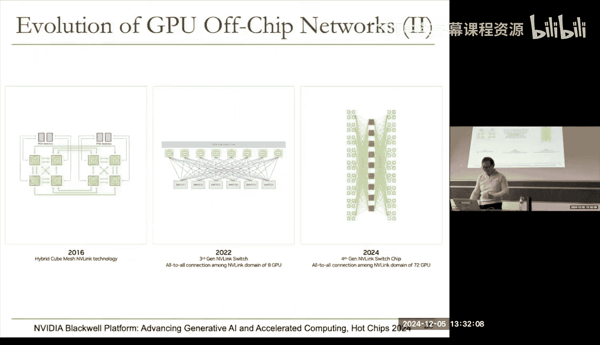
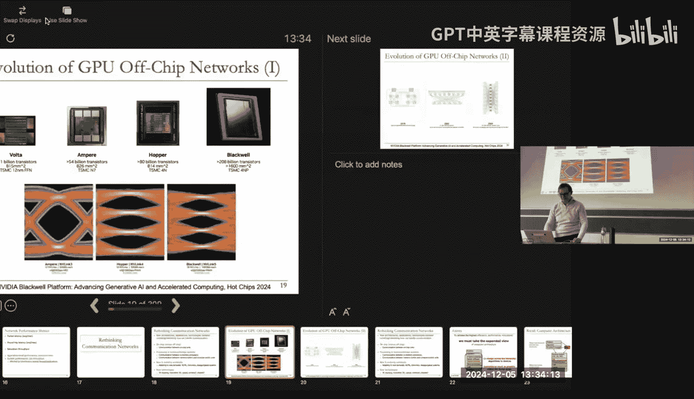
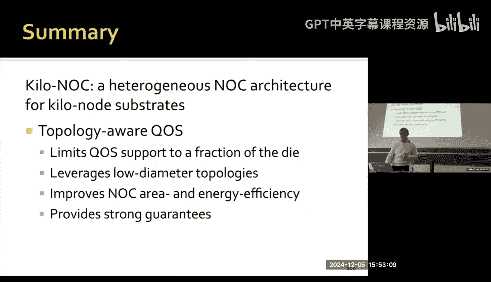
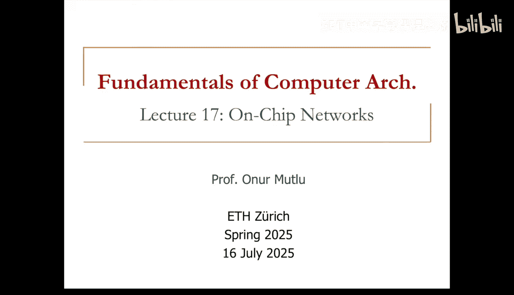

# ETHZ《计算机架构基础｜ETH Fundamentals of Computer Architecture 2025》中英字幕 p18 Lecture 17_ On-Chip Networks (Spring 2025).zh_en -BV1Xc19BnET7_p18-

People'll seem cold。Is it cold outside， okay？Okay， so we are nearing the end of the semester。

 we're already at lecture 23。that's a lot of lectures， we've covered a lot of concepts。

Today we're going to cover some more。I'm going to focus on chip networks today。

 but I'd like people to think about communication substrates in general。

We talked a lot about memory in the early lectures， and then we talked about。

Some approaches to tolerating and hiding memory latency。

And then we started talking about communication last week， which is really part of memory。

 memory and Interconnect are very tightly integrated。呃。

And these are really big sources of latency and energy in our systems。And going forward。

 I think this not only memory needs to change， but also interconnect needs to change。

 and together I think they need to change significantly to really satisfy the needs of workloads。

We discussed a little bit last time， but we're going to discuss a little bit more。

Oh。Okay。So this is just a recall slide just to jog your memory。

 we've talked about interconnection network basics， we've covered a lot of toppologies。

 we've discussed routing algorithms。And we discussed buffering and flow controls。

Keep that in mind and there were many design decisions over here and these are actually quite interesting。

 I think in the end a lot of these can be coupled with each other as we have also discussed。😊。

And we talk about buffer flow control and this is actually what people have been thinking about for a long time today we're going to kind of deconstruct buffer flow control where you're going to try to get rid of buffers as much as possible again this is another use slide you've seen a lot of this we looked at how to do the buffering what to buffer and how to do the forwarding etc we talked about stormor and forward warmhole and then we talk about using virtual channels because it doesn't make sense to block some of the packets that are going on routes that are really not contented and you've seen this picture before so I'm not going to go through this in detail but virtual channels enable you to not block packets unnecessarily。

Because you have PIFO queuing， so it's a tweak on PIO queuing in a sense。

 you have multiple PIfos and you can select from different PIOs。

So you can think of in order scheduling， which is fiveF。

And then out of completely out of order scheduling。

 you have to examine every single thing in your entire buffer to decide which packet can be scheduled to which destination。

 which port。😡，Virtual channels give you complexity closer to PIO away from the out of order by getting some of the benefits of out of order schedule。

So in DDCA for example， we've covered out of order execution right you have in order execution of instructions which is terrible for latency tolerance。

 you have complete the out of order execution of instructions which is bad for complexity but good for performance think of virtual channels as a way of achieving part of the out of order scheduling benefits without having complexity commensurate with out of order schedule in processor core we actually very used to out of order scheduling of instructions right in networks。

😊，Maybe we're less used to out of order scheduling of packets。

 but it's good to think about that going into the future。

Okay so that's virtual channels these were we discussed last time and then we also discussed how to communicate buffer availability this' is an interesting issue because you have really a network and if you want to send a packet to some other node downstream you need to know whether their buffer is available and there are different ways of doing this and we discussed those different ways all of the math complexity in the end and this is one of the complexities that we actually wanted to get rid of with some of the network networking design choices that we're going to discuss in this lecture。

😊，All this sounds good， no questions on these topics。Haveve covered this in the last lecture。

We also talked about interconnection network performance。

 I'll go through this a little bit because I think this is important this is a really fundamental curve essentially it's called a load latency curve load is really the x axis which is which could be measured in different ways but one way of measuring it is to measure the injection rate into the network this is the rate of packets that go into the network every second let's say or every clock cycle or the other way of thinking about it is the amount of load on the network network you can think of network as having a capacity which is the load that it can bear and 100% means every single capacity in the network is kind of utilized maybe and what happens this curve shows what happens to the latency。

😊，which could be measured in different ways also this could be the average latency of a packet from a source to the destination right it could be the maximum latency also。

 but essentially this cure shows the effect of the amount of load injected into the network on the latency。

😊，And this is a very fundamental figure clearly you can draw this for synthetic patterns as we have discussed last time。

 but before I go into that， I should say that these are really determined by the latency you get。😊。

For a given access pattern， for a given injection rate is really determined by all of the design choices that we discussed。

 So you have some minimum latency given by topology。 So if your topology is， for example。

 point to point where every node is connected to every other node。

That latency is probably the minimum latency you will ever get， Of course。

 you have a lot of complexity because you have dedicated wiring between every single point。

 every single node in the network。But of course， if your topology is something totally different。

 a mesh topology， for example， two dimensional mesh。

 then you need to go through multiple hops to reach your destination。

 assuming that source and destination are far from each other。

So this is what I mean by minimum latency given by topology on top of that you need to do routing on a topology topology by itself doesn't mean anything you need to do routing to actually make use of the topology right you need to get from source x to destination Y and there are many different routing algorithms you can use and different routing algorithms have different minimum latencies and they behave differently at different injection rates for given topology。

😡，So it's good to think about that， so there's some minimum over there and there's some complexity in the routing algorithm。

 you need to make the decision so it takes time to actually do the routing。

On top of that you have flow control and buffering that affects your minimum latency because yes。

 you do the routing， but they affect the design choices that you make for whether you have buffers or not how big your buffers are what is your flow control mechanism。

 they all affect the latency of when you can send the packet when you can buffer the packet when you need to stall and as a result that also affect your minimum latency and these effects can be different at different injection rates also depending on the efficiency and the scalability of your algorithm。

And that's that's what that's what gets us to zero load latency。 So this smpt over here on the。

Y axis really gives you the zero load latency if you don't have any load on the network。😡。

Were over here basically what is the minimum latency that you can get of course as you keep adding more as as you keep injecting things you get more latency okay so you can do the similar you can do the same thing on the other side which is what is the injection rate the maximum the maximum injection rate you can have in a network is really determined by your topology your topology basically tells you this is how much you can your network can。

How much load your network can carry and it can still deliver packets， right？😡，Clearly。

 this curve doesn't extend all the way over here， meaning。

This particular network for a given pattern， cannot have this injection rate。

 cannot sustain that injection rate，Also your routing has some inefficiency。

 which means that it affects your throughput， I'm going to name this saturation throughput basically over here。

 it really affects how much load your network can sustain because of the inefficiencies at test and also on top of that buffering and flow control has some inefficiencies that reduced your throughput so you can see that on the y axis we've added more latency based on our design choices on the X axis we've also reduced the injection rate based on our design choices。

Then the question is what is the cure right basically here you have the zero load latency。

 here you have the saturation throughput， meaning the throughput at which the network doesn't really cannot really function beyond which it cannot function or latency shoots up。

😡，And this curve can be。Essentially plotted for different types of access patterns。

 for different types of design choices。Okay， I will already discuss this。

So I'm going to skip these because we've already discussed this。

 but ideal latency you cannot achieve it because you have sold this is really the latency due to wire delay between source and destination clearly we don't have just wire delay between source and destination right what I just discussed over here all of these at things beyond the wire delay right even if you have a point to point topology you have things beyond the wire delay right you have to send the packet and receive the packet right at least at the very least。

And you have to figure out which destination to send the packet also right because you have a lot of connections to everybody else okay so there's because dedicated wiring is completely impractical and also controlling it with zero latencies impractical you really segment the wires by inserting routes and also you have additional lowerheads。

So that brings us to the load latency curve over here ideally basically you should get something that looks like this。

 but really in workloads this is what we get and this curve really depends on what kind of communication pattern you have I will not go through this in detail you will see a lot of examples that look like this in many network papers where we look at different types of traffic and if we look at the latency。

 load latency curves for different types of traffic for different in this particular case different topologies with some particular buffering and flow control and routing choices so all of those effect so for example if someone gives you a curve like this and tells you these are my topologies and I pick some let's say pattern uniform random traffic this means that any note can send can be can be a source and it uniformly and randomly send packet to any other node。

😊，the network and the probability of the communication between any given source and destination is equal that's the definition of a uniform random traffic If someone tells you this is my traffic pattern。

😡，These are my topologies， and these are the curves I get。

Then the first question you probably should ask is， okay， this doesn't tell me anything。

You basically say， what is the routing？What kind of routing decisions have you made。

 What kind of buffering decisions have you made， What kind of flow control decisions have you made。

 because all of those really affect this curve in the end。😡，You may have an not so great topology。

In terms of connectivity， but you may do extremely well in routing。😡，And flow control， for example。

 and that topology may outperform a very well connectedned topology ideally should not that means that you're probably not doing a good job in how you are doing routing and also flow control in your well connecteded topology Act。

😊，So this is just to give you an idea that。You need to question all of these numbers and also these are synthetic traffic patterns if you look at this these are not applications and we're going to talk a lot about applications today。

 these synthetic traffic patterns are interesting to understand the different design choices you may make and how that affects essentially this load latency curve for different type of synthetic patterns that you can perhaps understand better。

 but this may not tell you anything about how the application will perform as we will see soon。

Does that make sense because an application is really not a synthetic pattern in the end？

Very few applications， though purely uniform random traffics。

Very few applications do purely let's say I don't know here we have bit complement traffic basically it's an access pattern where you complement IJ and source and destination are IJ and sources IJ and destination is kind of JI something like that I may have gotten definition definition complete wrong because people define these things but these are very synthetic patterns as you can see it really depends on what the applications is doing the curve you get so these are some of the topologies that we've examined in the prior slide if you have time I'll get back to this but I think you've seen part of it right on the last lecture okay good。

I'm still covering stuff from last lecture。But I think it's good to examine topologies more and more so that we can understand better topologies and we've done some of that I'm not going to talk about that in this lecture and there's also other things that you can do if you have time I'm going to get to this today。

Any questions？By the way， load latetnt secure is quite general right it's actually not a function of a network。

 not just networks or you could consider everything is a network that's another thinking that you have everything like including us human beings our networks if you put more load on a human being you'll get more latnts right？

😊，Meaning if you send more emails at some point you'll get longer response times right and at some point youll get a saturation throughput none of the emails may get any response。

😊，So that's very fundamental， right？😊，Okay， so network performance metrics。

 we've discussed this a little bit last time I'm not going to talk about this today we're going to focus a lot on application level performance in the end what really matters is the application you're executing。

😊，And。Application level performance could be clearly execution time if you're executing a single application or a job throughput if you're executing many applications and clearly both of these could be affected by interference among different threads and applications and we're going to see some of that today。

But before I go into some of the more specifics， I think I will mention what I said earlier。

 I think we really need to rethink how we design communication networks going into the future because a lot of things are changing and they already change actually。

 but more changes to come clearly we're having new architectures。

 new applications and new technologies and they all demand revisiting rethinking how we actually handle communication。

😊，And I believe we're not doing enough of that in the design our systems。

So we're going to talk about on chip networks a lot today versus off chip so some of that rethinking is I'm going to show you with examples clearly there's communication that happens on chip units that is a bit different from communication that happens between off chip units in a supercomputer for example。

😊，呃。Then we discussed a lot a lot about processing in memory and storage in this course right and we talked about。

 for example， connectivity within the DM there's more to do over here basically if you have actually a lot of processing on the memory side。

 you need more connectivity across the processors as well。

 and I think this is going to be more important in the future there should be more communication between in memorym processors。

 there should be more communication between memory centric and compute centric units between the processing in memory system as well as the other accelerators in the system and I think this requires more rethinking and some of the actually work that's going on in architecture conference these target this which is good。

 but there needs to be more。😊，At the same time， we have new and evolving workloads。

 which are demanding changes both at the。At different levels of networks so clearly machine learning for example is a very data intensive work genomics is another one where disaggregating our systems more and more right you actually have essentially if you look at a data center today you really distributing computation and memory and storage across the entire data center so you really need to rethink how you handle communication between those units if you have for example disaggregate storage disaggregate memory where a lot of the memory and storage sits far away from a very computation is done。

Then you may actually need to rethink how you do the communication across those and within that disaggregate system。

 you may actually have computation also inside the disaggreg storage or member。😡。

So there's a lot to do over here and on top of this， I think we have new technologies， by the way。

 are these the latest lights？They don't seem to have what I added over here。It tripped my。

 maybe I sent you the， okay， there's the optical wireless chipts。

我没 see。I'll do the CRC check Oh no what happened here I can see myself it has a 295 slides supposed to be 309。

N see 295。Yeah， can you download it。好。Okay， while you're downloading it， I think。Yeah， go ahead。

It's trip my CRRC check， as you can see。But basically there are new technologies。

 3D Mal 3D for example， all of those are new technologies， they're also optical technologies。

 wireless technologies， I think these are actually interesting technologies to reexamine communication。

 both on chip and off chip。Okay， you got the right ones now。There you go。 Okay， I'll handle it。

 thanks。Good to know your slides。Okay， so I've showed this picture actually early on in the first lecture。

 if you remember this picture。😊，One of the things that is happening with new workloads that are executing on GPUs is computation is clearly increasing。

 right。There's also a lot of communication， so you can see this already happening partially in one of the largest companies。

 so if you look at NVdia for example， they've been investing not only in the computation infrastructure clearly which is important。

😊，They've been investing in the memory infrastructure。

 which is HM and they have also been investing in the communication infrastructure。 Yes oh it's not。

😊，Okay， so。

Okay， is that better？

好歌。Okay， yeah， basically you need to improve communication as well and one of the reasons why I believe they actually need to improve the communication a whole lot is there is a lot of communication across the GPUs and one of the reasons because memory is not enough in a single GPU you have HPM which is actually quite small。

😊，For the working sets that you need for training， for example， if you talk about training。

 the working sets are huge and HM is， let's say 80 gigabytes under 20 gigabytes。

And you really need to communicate data across all of these GPUs and if you want to communicate data across a large unified memory across GPUs。

 you really need a good network。😡，If you don't have something like the ME link that they have。

 which is I think， and then it's very hard to communicate that data quickly。😊。

Does that make sense so let's really exercise a lot of the bottlenecks that we've been talking about in this course in the end you want to communicate data if you actually don't communicate data maybe your networking needs to change in a different way。

😊，It's a very compute centric network if you think about it。Okay。

 so there have been technology improvements clearly to improve the bandwidth of a single link。

 but they also do other improvements like architectural improvements as we have seen these are different topologies actually these were some of their initial topologies in 2016 as you can see thiss kind of like a mesh network。

😊，A different slightly different one， and then they actually went to all tall connection within eight GPUs over here。

 and then they actually decided to do 72 GPUs over here with some indirect routes over here。

These kind of resemble what we have seen in the last lectures， right？And these are not new clearly。

 these are old concepts， but as the scale of the workload evolves。

 they need better communication mechanisms。Okay， maybe there's a much better way of designing systems than doing this。

 doing this meeting， really， if if you actually have a much more memory centric computing system。

 maybe these pictures will change more。😊，You've also seen actually the importance of the network when we talk about crossing year memory using Test Act。

 for example， graph processingsing accelerator， the network over there across within the processor inside the logic layer。

 as well as across the processors like 3D cubes or 3D stacked memory plus logic chips。

 it's actually very important for performance and a lot of the optimizations that later work did was on that network。

O。So this also， I think， points out that we really need to think what's happening across the stack when we design these networks。

😊，These are really slides that I've used in the first lecture。

 so we're going to get back to these slides。Okay， any questions？

Now I'm going to give you an exploration into on chip networks because we've done some of this rethinking when I thought it was actually also really important to do this when we were moving from。

 for example， single core to multi corere right there were people people were designing multi corere systems and there are a lot of questions that we tackled for example in this lecture about multi courses and how to handle interference etc。

 but how do you design the network in many core system where。😊。

Cos are actually on the same chip is a good question。By the way。

 this actually increases with wafer scale， maybe I didn't add the wafer scale technologies as part of the technology。

 but as you go to wafer scale your technology yet， your network becomes even more important because you're within a wafer and the efficiency of the network determines how well you can communicate across the entire wafer。

😊，Okay， so what is on chip networks， clearly on chip networks is a of a special case of general communication networks。

 your processing elements and your routes and all of these reside on chip。😊。

They they can connect core， caches， memory controllers， and if you have， let's say。

 thousands of cores， probably buses and cross barss are not scalable as we've discussed right in the last lecture。

They could be packet switch usually some common topology is 2D mesh。

 but remember we discussed different topologies last time hiarchical rings are also employed a lot actually in on chip Network today。

 so these are some examples。So at the time we were actually looking at a lot of these things。

 virtual channel buffering was common， it's actually something that we questioned， for example。😊。

But basically if you look at an on chip network， you primarily serve cache misses and memory requests you have a multithd application or multiprogramd application where the network really serves cache misses that come out of the processing element and routes those cache misses with the memory controller or maybe some other cache somewhere else on chipI and then returns the results back。

Of course， this includes a coherence request also。Don't forget about coherence you don't just get the data。

 but you also need to get the permissions for the data you also need to get translations。

 for example， potentially if you have virtual memory so there's a lot of stuff that may go on the network okay so this another picture you've seen this like common thinking at the time。

 which is really complex buffered virtual channel networks。You've seen all of this earlier。

 that's why I'm skipping relatively quickly。And these systems are actually built。

 these are some example networks， 2D mesh network and Tyler I've shown you this picture multiple times actually。

 and not only one network but there are multiple networks in general。

 for example in Tyler there were four packet switch networks and one circuit search network as you can see some of them are for request packets。

 one of the networks is for request packets， cash requests， networks is for response packets。😊。

This ensures that you don't have a high level deadlock， for example， a request delaying a reply。

 and if you have that sort of deadlock that's not good， then the network cannot make progress。

 but if you separate things into two networks， you ensure that requests don't delay replies， right？

So that's one of the reasons to build this of course。

 the other reasons to optimize things because request packets are small。

 you just request things right， it requires an address。

 it requires some coherence request for example， whereas response packets are usually large right especially if you' were getting a cash block it could be 64 bytes it could be 260 byte now we can customize your networks the different data types that are demanded by the packets that you're or the type of traffic that you're handling。

So there are other networks over here that you can read more about this in their papers。

And also we've discussed that they have a circuit switch networks。

 which is really good for transferring a lot of data from one note to another node。

 if you're streaming from one core to memory or from memory to another core， for example。

 if you have a display traffic going from a GPU all the way to the graphics memory。

 then you may actually want to stream all of that huge amount of data， through the network。

 and to be able to stream data， you can set up a connection。

Across a path and you don't change that connection because you don't really need to dynamically switch every single packet。

 which is much smaller than the amount of data that you may be streaming。

 you may be streaming gigabytes of data， for example。

 it doesn't make sense to actually make a routing decision at every router for every 64 bytes of that gigabytes of data if you actually have circuit switch that you set up the path and you don't need to make any dynamic decision anymore。

 that path is set up and you don't waste energy and the performance can be also very high with optimizations。

Okay， so again， I'm spending some more time， but hopefully this gives you an idea。Okay。

 so let's talk about on El。😡，Because we're going to deconstruct some of the things that are taken for granted。

So you have some advantages and disadvantages when you go from on chip to off chip， clearly on chip。

 you have low latency between course， no pin constraints， it's a huge advantage actually。😊。

When you go off chip， you have to go through pins， which are expensive and usually your area gets dominated by those pins。

You have a lot of rich and low power wiring resources if you think about wiring on chip。

We kind of don't even think about it sometimes， right， especially on a compute centric chip today。

 with memory chips today， as we have discussed， people don't think about wiring as well。

 wiring is not as common because they're supposed to just supply the data， right。

Whereas on a processor chip， you have wiring resources， you have multiple metal layers， maybe 14。

 15 me layers， so it can actually put a lot of wires on top of each other， right？

With the memory centric computing I think that also needs to change as we have discussed you probably need more wiring resources。

 but let's not get over there so on chip today on computer centric chips you have a lot of wiring as a result you have very high bandwidth on chip and if you have a lot of wiring you can do better coordination so contrast this with a supercomputer for example or whatever all of these networks laptops are connected to a network right internet。

If you think about it， the wiring is actually not plentiful。😡，On a supercomputer or the internet。

Basically you have wires， you have really physical huge wires well one chip you have physical wires also except we don't see that there a lot right technology scaling has enabled us to reduce the size of those wires unfortunately we don't have a similar technology scaling that has happened in the large scale or at least outside the electronics domain physical wires are still here and if you want to wire many of them you run into a huge amount of complexity。

AndIf you look at， for example， supercomputers， at least things supercomputers that don't use optical networks。

 one of the big issues is really figuring out how to wire those different processes。

And some of the bugs that have happened in supercomputers are because someone actually miswired a computer。

So it's good to think about that right one of the benefits of optical technology is it gets rid of a lot of that overhead of wiring right you don't need to have physical wires。

 you need to communicate in the optical medium wireless is similar also。Okay， so if you yeah。

 I've already said you you can do better global coordination across different cores if you actually have rich wiring resources that you can。

Access with low latnts but of course on chip also has constraints now your substrate limits the ease to implement topologies you have a two dimensional substrate three dimensional technology can change this of course。

 but it's not as flexible as this wire right here I can move this wire anywhere。😊，Whereas on chip。

 I cannot do that right not so easy and energy and power consumption becomes a key concern also because you have a total power limit on chip because of the cooling constraints and 3D doesn't help this actually three dimensional stacking doesn't help this。

 it makes it worse because heat doesn it cannot escape easily as a result。

 if you want to employ very complex algorithms in your network， for example， this may be undesirable。

Because it's now you need to do more computation to actually enable those algorithms and that computation it's away from other computation that you may need to do。

😊，This is less of a con if you have a dedicated router chip， for example， in a supercomputer。

 in a supercomputer， you have a processor and then you have a router chip and that router chip handles the communication and that router chip function is just to do route or networking functions。

😊，A lot of those get integrated into the processor today， of course。

 right because of the success of technology scaling again and Moore's law Okay another thing that's undesired launch cheap is large buffers because buffers are what consume area and power and we're going to tackle this。

And in the end， the wiring resources， you actually have a lot of rich wiring resources because you have a lot of area but。

Whether you have enough area and whether you have enough metal layers constrain the use of your wiring resources。

😡，So very complex topologies that may require a lot of wires to go on top of each other， for example。

 may not be easy to implement on chip。But they may be easier to implement off chip rights if you think about if you have a very complex topology where you require 50 wires to go on top of each other。

 well you don't have enough wiring enough layers of metal on chip because that's the technology that you're dealing with。

 but I can put 50 of these on top of each other， I can handle the complexity somehow right？😊。

There's a way， basically。So these are the key differences essentially so there are other things that we we can quickly discuss so what is the cost where it does cost come from off chip or on chip essentially off chip it's channels。

 pins， connectors， cables。😊，Whereas on chip。Some of these are not that important because pins。

 for example， you don't go off chip there's no pins essentially， cost really on storage and switches。

And this leads to networks with many white channels and less buffering。

But still buffering so channel characteristics on chip you have short distance low latency and essentially you can also do other things on chip more easily。

 for example， put logic and repeaters， right？And workloads also are a little bit different off chip。

 usually you have large scale parallel application。

 multi chip traffic or some sort of distributed computation。

As we discussed last time or in one of the lectures。

 we can distribute computation on the network right through message passing， et cetera。

 on the internet also essentially that sort of traffic is a little bit different from multico and cache memory traffic。

😊，Okay， so applications are also different so we're going to look at some of these tradeoffs but especially from the context of buffering and flow control。

 but if you're interested there are a lot of papers in this area。

 this is one of the earliest papers from Bill Dley and his student which talks about some of these for example。

 if you read this paper it talks about some of the interesting things what topology is our best match to the abundant wiring resource available on chip for example。

 what flow control methods to reduce buffer content as routeer overhead。

 which an interesting question to ask。😊，Even after this question was asked， let's say in 2001。

 a lot of people didn't think about it as deeply in my opinion。

 so we'll see some more thinking on this direction。😊，Okay。

 I'll not go through this so you can read the paper， it'll be on your homework， I think。Okay。

 so there is more also on chip and off chip trade offs， this is a paper that we published at sitcom。

 this may still be the only on chip network paper on sitcom sitcom is a major networking conference。

And surprisingly， they have kind of limited themselves to outside the chip。😊。

So natural networking for them goes outside the chip。

 but this is the only paper in my well I haven't checked every single proceeding recently。

 but that looked at some of the tradeoffs in on chip networks versus off chip networks。😊。

If you're interested you can take a look at it， I'm going to mention that later quickly。Okay。

Any questions？Yes。对。28。28， where is 28。Okay， this one， yes。这我。嗯哼。嗯。确人给。嗯。Well。

 this is a specific type of deadlock that I mentioned。

 you have a requests to cash request and then you have replies， which is data。

 you can think of as control packets versus data packets。So one of the problems。

 there are a lot of issues related to deadlock， I think part of them where we discussed in the last lecture。

 but one of the deadlock issues is higher level protocol level deadlock。

 where a request packet may keep resources such that reply packets cannot go through。

If you separate these networks， then you don't have that problem。 right， Does that make sense。Yeah。

 I'm not suggesting every single deadlock will not occur。

 but at least that type of deadlock you don't need to deal with。

 and also there are other reasons to separate those networks。😡，Okay。Okay。

So let let's examine one of these design choices， as I said， when architecture changes。

 when workload changes， when technology changes， maybe it's good to re-examine some of these resources。

 and by the way， this is actually a good way of thinking about research。😡。

If you're looking for a research problem， think about what is changing。

And what kind of implications that has on a particular important problem right in this case。

 we're talking about communication。😡，And things are changing， for example， for example。

 we're moving into memory centric systems。 How do we handle networking or communication in a memory centric system。

 right， How do we handle interconnects， What kind of interconects do we need。

 So it's good to ask those questions。 That's a good way of actually thinking about research questions。

 In other ways， technology， for example， I have this three dimensional technology。

 That's going to be very important 10 years down the road。 What can I do with it。😊。

That can bring you some other things， other new ideas as well， right？So all of these things I said。

 workloads， architectures， technologies， as they change， they also bring about new research problems。

Okay， so we tackled the issue of buffering because this was actually kind of bothering us。😊。

Basically， clearly we know that buffers are necessary for high network outputput as you increase the buffers you get better injection rates so for a given everything else being equal。

😊，And assuming your access pattern likes large injection rates， if you have large buffers。

 you'll get higher saturation throughput， essentially if you have small buffers。

 your throughput will saturate early because you cannot inject enough things in the network it's very intuitive right if you don't have enough buffers at some point the network will say I don't have enough buffers don't stop injecting right。

Does that make sense， so buffer has really determined the available capacity in the network。

So buffers are good in that sense， but of course buffers are bad in many other senses。

 especially in non chip networks， they consume significant energy and power。

 dynamic energy when you read or write， they also consume static energy when they're not occupied。

They also add complexity and latency as we have discussed， especially in the last lecture。

 but earlier today also， you need logic for buffer management， virtual channel allocation。

 credit based flow control or some sort of flow control mechanism。😊。

So they require significant chip area essentially， so there were actually multiple prototypes that were built that were large scale chips and this is one of them。

😊，I don't think it did buffering very efficiently， but because of that they actually the buffers occupied about 75% of the total launch chip network area。

 maybe 75% is too much， but you can actually buffers depending on how much buffer you use and what kind of technology used to implement your buffers。

 this could be 40% easily。😊，Because you do need buffering。

 especially in large scale networks to tolerate the round trip latencies， for example， yes。被告吧。

That what。Yeah， potentially， yeah， theres some slight difference over here。

 but I think I cannot really yes， this picture is not necessarily perfect。😊。

But I think there is actually that's a tougher one。😊，Because if you have larger buffers。

That that may not necessarily need large latnts， right？

D depends on how you use the buffer right if you actually， for example。

 depend on what kind of operations you do on the buffer。If the operations are searching the buffer。

 yes， but if the operations are these5O buffers， if there is our first and first out。

 then that may not affect your latency as much， that's why we didn't change that latency over there。

😡，Does that make sense？That's a good question Okay。

 so basically the question we asked us can we get rid of bffles？Again。

 this is another example where you examine an extreme right everybody is doing let's say a lot of buffering for us we felt actually there was too much buffering and too much complexity it's good to examine some extreme where you don't have any buffering。

😊，And ask the question， what is it going to happen if you actually get rid of buffers？Of course。

 there are intermediate points， and we're going to move to some more intermediate points from this extreme as research progresses。

 as you will see。Okay， so of course， the question is now， how much stupid do we really lose。

 How is latency affected， ettera， on applications。And after to what injection rates can be used with sort of bufferless sting？

And are there realistic scenarios in which a network on chip operates at injection rates below that threshold？

So can we achieve energy reduction， can we reduce area and complexity？

So this paper in ISca 2009 answers those questions， some of them very optimistically。

 we're going to fix some of these things later on， as you will see。

 I think of this as kind of the radar paper， if you remember the radar paper。

 we said we're going to get rid of refresh as much as possible。

 but we're going to be a bit optimistic about it because we don't know exactly how things behave like variable retention time something that can be later discovered right。

😊，Okay， so basically it's not a new idea also this's actually an old idea。

 this a beautiful paper by Paul Barran on distributed communications networks。

 it was written in 1962 it actually talks about a lot of issues on distributed communications networks including routing。

 including very low levelve issues technologies of the time in the 60s which are very different from technologies of today actually。

 and the idea is don't buffer things。😊，Meaning if two things。

 if two packets come to the same router and they need to take the same output port。😡，like this。

They contend with each other。Essentially， don't buffer one。

 so in a buffer network what happens if two packets come to the same router and need to take the same output port。

 one of them gets buffered right and you send it in the next cycle。😡，Potentially。Hopefully。

But bufferless String says。If theres no productive direction available for a given packet。

 send it to somewhere it doesn't want to go。So are these two things。

Ne to both of them need to go over here， but one of them gets deflected。😡。

It doesn't get always affected， for example， both of these packets may get to their destination。

 come closer to their destination if one of them goes here and the other goes here if the destination is over here。

 right？😡，Does that make sense？So that's what the productive direction not available means。😡。

Basically， existing routes try to route the packets such that。😡，You always go。

 make progress toward your destination， meaning you always take a productive direction。

 productive out the for。😡，Hot potato outing， as it's initially discussed， says。

Sometimes you can take the non productive direction as well。

 meaning go far away from your destination。😡，Does that make sense and this leads to clearly nonmin routing。

 meaning your the number of hops from your source to destination is not what is minimal given your topology。

 you can take the scenic route， it could take longer to get there。😡，But this way。

 you can eliminate the buffers。That's one advantage。

 and maybe you don't get that much performance impact because this packet now it goes to some other route and then it goes some other router and then it goes some other router。

 and hopefully it'll get to its destination。By taking it longer route。Okay。

 so this is called hot potato outing because essentially you can think of it as a hot potato out。

 yeah a package is a hot potato， nobody can hold it for too long。

 you cannot buffer it essentially you send the hot potato to the next person and we could actually play hot potato over here and let's see who gets burnt。

😊，Who gets burned is buffer her daughter？Okay， so basically。

 hopefully we're going to get rid of a lot of this complexity。😡，And as I said。

 this paper was a bit optimistic， we're going to hopefully go back to that later， yes。嗯。😊，Yeses。

That's right。嗯。有。嗯。说。Yeah yeah， so that's a good question and the paper tackles two things so if you do flip level routing if you use warmhole routing。

 what you say is true。😊，But you could also basically have a flip and treat it as essentially a packet right。

 So the easiest way of implementing this is really。😊，Having small fls， but treating them as packets。

 meaning having source and destination information over there as well。

 if you the paper discuss a case where you still have header information and source and destination information only in the。

Now， let's say what is this called first header packet， essentially， but then you run into two worms。

Hitting each other and at some point you may need to break up warm。

And that's not an easy thing to tackle so for complexity reasons。

 we discuss that case and we actually say you can actually do it。

 but it's much more complex than actually doing treating each F to be a packet。😊，Okay。

 so here basically yeah， essentially what we do is we replace the buffering and all of the buffer arbitration etca。

 virtual channels with F ranking and port prioritization essentially we create a ranking over all incoming fls to the router and for a given foot in this ranking we find the best free output port meaning this applies to each F in order of ranking essentially that's the router's job now so a router does these two only。

😊，Okay， of course， these are not necessarily cheap。

But essentially each fl is routeed independently that answers your question and we do F level routing。

 we do all this first arbitration which really guarantees livela freedom as we will discuss。

 essentially you have all this first ranking when you rank the Fs。

 you have some ages based on in each F and then you assign the fl to the productive port if possible。

 otherwise assign it to the non-productive port。😊，Then the question， of course。

 can this be applied to any topology， unfortunately not every topology。

 but most topologies that are implemented today， meaning number of outputs。

 I don't know what's wrong with this， but number of output parts need to be greater than equal to the number of input parts。

If you have number of output ports less than number of output ports， then you have a problem， right？

You don't have enough， in a sense， you don't have enough buffer。😡。

What's the definition of buffering here， buffer you're really buffering packets on links right now you're really using the links to buffer things。

Okay， and every router needs to be reachable for every other router of course。

 so now the flow control becomes completely local。😡，Now what does this mean。

 you don't need to check for buffer available to downstream， right？😡，That communication goes away。

You can inject whenever the input4 is free。You don't have any deadlocks。Every foot is always moving。

😡，Right right。Assuming your topology supports it， it should。 now you have the problem of livelas。

And we're going to talk a lot more about that later on。

 you have the problem of livela meaning you misr it or deflected a fl。

 and it may not reach the destination。Assuming you have all first ranking and assuming every year outer obeys oldest first ranking is not a problem。

 right？All this foot will always reach its destination。

 and then some other foot will become the oldest， right。Okay。

So clearly this comes at advantage and disadvantages， we' covered a lot of these over here。

 so I'm not going to go through everything， but essentially adaptivity is one advantage packets are deflected around congested areas。

 so you have some local congestion。😊，You can actually tolerate that local congestion by deflecting the packets outside so that packets take longer routes。

We discussed ultra latency reaction， I'm not going to talk about that clear there's area savings。

 but then there are disadvantages also。I think we've talked about this。

 there's also increased buffering at receiver unfortunately。

 because now your fls don't necessarily arrive in order。

 your each fl is routeted independently and a packet for example， like a cash for example。

 a cash data packet， cash block packet， maybe 64 bytes， each maybe  eight bytes right？

Now you need to reassemble all of that 64 bytes in the destination。So on the destination。

 you need to have offers。As we will see in the later work， these buffers are already kind of there。

These are mis buffers， right when the processor quits a cache block。

 it really allocates space for 64 bys， and it waits for those 65 bytes to come back。

Clearly all first arbitation is complex， we have header information in each clip that's expensive compared to warmhole routing。

 so if we need additional wires for header information， QS becomes a little bit more difficult。

 but that there needs to be more work in that area。😊，Okay。

 so we did some evaluation and this is with some synthetic traces。We get what we expect。😊。

Meaning this is Blesss and this is the best baseline line with some good routing minimal adaptive routing over here。

For uniform random injection rates， you get significantly reduced throughput。

This doesn't sound like good news right， if you just look at synthetic traffic。Now。

 some other workloads are actually not like this， workloads are not always uniform random if they do caching so you don't go to the network a lot。

😡，And we see basically good results on real workloads。

 So this was one of the other things that we wanted to convey in this paper on real workloads。

 you may not need that much to and ladyworks actually kind of showed that as well。

So we get basically very little workload application level degradation。

 I don't want to go through this in detail， but that's how it is。

But you'd get significant energy savings。 so if you look at this picture over here。

 what should I look at over here？Essentially， these are the bufferless networks over here。

 we can reduce the buffer energy significantly。😊，What increases link energy actually increases because now we have more。

More links that are being traversed， right？Because you're actually using more of the link capacity。

And the others actually are kind of similar， but they increase slightly so because you reduce the buffering energy significantly。

 you have an overall significant energy savings。😊，Hopefully， that makes sense。Of course。

 this assumes if your buffers are a lot more optimized， these savings may be lower。

So it really depends on what is your energy distribution？Across buffer links and realty。

 if your links are very expensive in terms of like with， for example。That also may not be very good。

 right， but then in the baseline that may not be very good also so it's good to think about that。

So the savings you get really depend on where is energy spent this is not an unreasonable picture actually over here you get this is other functions of the out blue part。

 this is the link energy and this is the buffer energy Li energy may be all attire if your frequency is higher for example。

 ettera。😊，Okay， so basically the takeaways over here is on real workloads。

 injection rates are not very high。😊，And there are multiple reasons over here。

 one of the reasons is your caches have some effectiveness you're not sending every single request and also it depends on where you place the network right if your network is after L1 or after L2 it's good to think about in this case we look at after L1 and also after some point the cores don't keep injected it's actually good to think about。

😊，Some of these access patterns say you keep injecting。Meaning it's an open loop traffic。😡。

You keep injecting and the cores keep injecting and they can keep injecting forever。

That's not real in the sense that in a processor， you're running a real application。😡。

And that real application is using buffering resources inside the processor instruction window and at some point。

You run out of resource in the processor and you cannot keep injecting into the network right because that makes sense。

 You cannot， you cannot sustain more than some number of cash misses。

And you've discussed this issue also like Gr ahead， for example。

 tries to solve this problem when you're stall， essentially at some point the processor will stall。

 so the networks are really self struggling。Okay， so basically we for bursts and temporary outspots。

 you can use network links as buffers。Okay， these are the conclusions， I have not go through this。

 but essentially our goal was to make a strong case for rethinking of network on chip design。😊。

And future research， this is what we are mentionedant。Any questions？ Yes， please。你此。嗯。嗯。Yes。

 I think this is basically there's you still need to have some pipeline buffers。

Meaning there are different kinds of buffers， right one is really buffering a packet that cannot go out。

And then you still have pipelining in the alt， right and that pipelining requires some buffers。

Does that make sense？So that's actually interesting and that's a very good question some of the later works actually looked at using those pipeline buffers as also buffers。

😊，So it's good to think about that you actually already have some buffers inside or outer。一个。嗯。😊。

Sllight performance degradation， yes， exactly。嗯。Exactly， yes， exactly。

So you get significant energy savings and area savings， but yes， performance slowdown， you incur on。

But we're going to actually make this a lot more， let's say。呃。Detailed soon。Any questions。Okay。

 so of course the question as always can we do better that's the question we asked and also we wanted to understand whether some of the things that we assumed were doable。

😊，And we will find out that some of the things are not as easy to do， but we can do better also。Okay。

 so basically these are some of the major issues in bufferless deflection roing。

 you have live lock problem to solve。And we're going to talk about that。呃。

The good thing is you don't have a deadlock problem right we discussed deadlock， for example。

 in the last lecture， we discussed a turn model with a beautiful model for routing， et cetera。

 you don't need to deal with any of that。Was was about for Leal。but because of livela。

 there's some actually resulting roing complexity that we have that needs to be taken into on so we're going to go deeper into out design a little bit more。

😊，There's off courses performance issues and congestion issues， especially at high loads。

 So the reason we didn't see a lot of performance degradation is because workloads were not。

reallyally having high loads on the net。But on workloads where you have a lot of high injection rates you will see a lot more performance degradation and I'm going to show you some results again the question is whether those workloads are realistic or not realistic I don't know。

 I think this needs to be investigated depending on what your workloads are but it's good for a research paper look to look at the entire spectrum and then there's quality of service and fairness issues that I'm not going to talk a lot about we're going to look at that in a different way。

😡，Okay， so this is the next paper which tries to solve some of the issues we call chip I think I've kind of summarized things over here this was the conclusion these were the conclusions of the blessedless paper。

 energy savings area reduction and small performance loss。😊，Unfortunately。

 we did not address some of the complexities in the route and especially the live lock issue leads to long critical path and we have large reassembly buffer。

 so we recognize especially the large reassembly buffer and we said it's not a big problem。

 but we're going to look at some other issue over here at the protocol level。

And the goal over here in this work was to obtain benefits as much as possible while simplifying their outer to make bufferless NOCs more practical。

 So let's take a look at these problems， essentially we must provide livela freedom right。

A packet should not be deflected forever if you think about it。

And you must reassemble packets on your eye。Essentially。

 they have a bunch of packets and they arrive at a destination node and they need to reassemble in some order。

Okay， so this is the high level view of a bufferless router， essentially this is the router。

 this is local node in the router you have some deflection roing logic and then the crossbar and then you inject and then you eject。

😊，When you eject， meaning when the packet or fl reaches a destination。

 you put it into a reassembly one。And then yeah， you serve it to the process。

So we're going to solve these issues first problem is livela freedom。

 the second problem is packet reassembly， these are different points as you can see。😊，Okay。

So livela freedom is actually interesting essentially well I've already said this so the livela freedom that originally that we thought and a lot of people thought was you need to sort the list by age and then assign them in age order to output porch this is called oldest this first arbitration it' thought to be complex and in this paper we quantify the complexity of it。

😊，And essentially， we find out that the router needs a much longer critical path than a buffer router to be able to do this and we will see the reasons a little bit。

And you also should reassemble packets upon arrival。

 and the number of buffers you have on the reassembly site or the destination side needs to be sized for the worst case。

And worst case meaning what is worst case？Every single node is sending something to the same destination。

 right？So for example， for a small network， 64 node， 64 byte blocks， it could be 4 kilobyte per node。

As network scales， of course， this also increases。Okay。

 you may think this is not that bad and I agree it's kind of not that bad。

 but some of the issue that we're going to discuss is not going to be just about the size of the buffer。

Okay， let's talk about livela freedom so what stops the Fl from deflecting forever。

 essentially youve time step all fls。😊，Assuming everybody has the same time。

 which is also another problem， right， synchronization。

All the splits are assigned their desired ports。😡，Which means that prior work impose a total order among fls。

 and every router obeys that total order。😡，The age of Fs forms at all order。

And you guarantee progress for the F。That has the oldest age。If our al sees that foot。

 it prioritize that， if our al doesn't see that foot and it sees some other fl。

 it prioritize the oldest one， essentially。Now New traffic gets the lowest priority， of course。

 in their al。So what is the cost of this extension， so let's take a look at a little bit deeper。

 so we want to sort Fs by H， this can be done using a short network， sorting network。

So if you think about a router， four by four router。It really is composed of。

These three levels of two by two routes。You can think of it that way。

And if you have four fls coming and these are the priorities of the Fs。The highest priority is one。

 the lowest priority is four， you need three comp stages。

Let's take a look at the first router over here， it basically compares one and four。

 it says one is smaller than four so it's highest priority so I'm going to push it up， let's say。😡。

And then the second route also does something like that。Okay。

 so this is your sorting network in the end okay you can design the entire sorting network basically what this does is it really the goal is to compare things so that you get the ordering of the ages in order at the outputs。

😊，Make sense。😊，Okay。You can design these people have been designing this for a really long time。

So these are expensive， essentially， this is clearly you have a sorting network that you need to do on top of this。

After sorting， you need to allocate Fs to outputs in priority order。 Now what we've done。

 what we've done is just determine priorities， right， which splits has higher priority。

Now we need to allocate ports。😡，Essentially fleets that have higher priorities should get their productive output points。

This means that。Younger Fs， the ports that are assigned to younger Fs depend on what has happened to the older Fs。

 right So there's some sequential dependence in the port allocator。So let's take a look at that。

So the first F， the one that is determined to be the highest priority to oldest。Request east。

 well it gets east yes， because nobody else requested east so far， this is the highest priority。😡。

This is the job of the port allocator， clearly there's a circuit that does this。

 which means that only north， south and west are available to the next priority F。😡。

It requests also east， too bad。You don't have east， you get a sign north。

 and this happens to be a nonproductive port so you get deflected。Now。

 only South and west are available for the next priority。It requests south， so it's good。

 it gets to this productive output port。 only West is available for the poor last priority fleet。

 If it requests West， it's lucky if it doesn't， and it also gets deflected as you can see。

 So now we deflected two fls。😊，And we have grant productive port to two Fls。

This could actually lead to not so optimal decisions also as we will see later on。Okay。

 so this is the route that we kind of designed， you have a priority sort。😊。

That determines which flips are rich priority， and then you allocate the ports based on priority levels。

And if you design something like this， you get a much longer critical path than a buffer router。

 state of the a buffer router。😡，Now， of course， you can say I can do a lot of these things parallel。

 Yes absolutely， you can actually parallellyze a lot of things。

You can basically do speculative decisions， for example， you can make the， for example。

 this sequential dependence can be gotten rid of by saying。

This is the port I would assign to the second plate， assuming I have north southwest available。

 and then you also have。😡，Southwest East available。 So you basically specly make multiple decisions。

 And based on what you actually assign to the first F， you pick the one。That is correct。Of course。

 this leads to some exponential dependence now because you need to do more。

For three you need to do more options for four right essentially you need to do a lot of calculations and this's only four inputs if you actually have more inputs then you have even bigger problem Okay so by actually adding more hardware。

😊，You can paralyze a lot of these。 and this is another example of latency。😡，Area trade off rate。

 You can actually reduce latency a lot by adding more area。

 but we didn't want to do that necessarily。 We wanted to actually solve the problem with。

Live lock freedom and a more like let's say。Or tell you creative a way。😡，So basically。

 the question is， is there a cheaper way to route while guaranteeing livela freedom？And the question。

 if you actually ask this question， then you really need to think。

 what is really necessary for a livela freedom in a network like this？

Is oldest first really necessary and the answer is basically yes well oldest first is not necessary。

 so the answer is no， so basically with oldest first you have a footage that forms total order。😡。

key insight is you don't need that total or for livela freedom if your goal is to satisfy livela freedom。

😡，呃Only。There is no need for tall order， it's enough to pick one fl。😡，To prioritize until arrival。

Basically， the whole network guarantee， you pick one F and you call it the golden F and you say。

 I'm going to make sure that golden F。After it's injected or after it becomes golden。

Get delivered to its destination。So it gets prioritized everywhere in the network。

And so you did that， that's good。And then if you ensure any fl is eventually picked。

Then you guarantee live life freedom。Hopefully this makes sense。And you don't need any age over here。

😡，You don't need to know when a packet fl is injected。

You can just assign an arbitrary static ordering across all potential。😡，Flets that could。

Go into the network， that's the idea over here。Okay， so basically which packet is gold。

 we select the golden packet so that a given packet stays golden long enough to ensure arrival。😊。

Meaning maximum， no contention latency， because this will be definitely prioritized by every single router in the network。

😡，And need to ensure enough time for a packet to stay or fl to stay golden so that it reaches its destination。

 right？And then the selection rotates through all possible packet IDs。

 or you can think of it as fleet IDs。Essentially， if you have a static rotational schedule for simplicity。

Let's take a look at that so we have a packet header source destination and request ID。呃。

So for example， starting from cycle zero。😡，A potential request that goes from source zero to request zero is okay。

 so a potential request。That is injected by source zero。😡，And occupies request zero slot。

 this is a request that could be injected by source zero into the network and source zero may have 128 potentially requested good inject。

😡，We basically say at cycle zero， this is the golden one。We don't care if it's in the network。

We don't care if source E is actually running anything。Does that make sense？

So source Ser may not have injected anything over there， but it's golden。😡。

So the network will never encounter it。But this is simplicity， meaning。

Every router knows that at cycle zero， this is the packet that's golden。😡。

And it will stay golden until cycle 100。At cycle 100， every router in the network says。

Request zero that's from source one is golden。😡，This could be in the network or may not be in the network。

 or maybe it will be injected later。😡，We don't care again。If it's golden。

 it will be golden okay and cycle 200 source to hopefully you get the idea right so you basically have a static rotation schedule for every source and every request。

😊，Now， this gives you a bound on live like freedom。😡，Hopefully the worst key bond is not good。

But the average case is actually quite good。And you can read the paper for more detail， okay。

So this is the minimum requirement again we're kind of taking an extreme position over here right if there's another minimum let me know so now your routing decision becomes much simpler。

 you only need to properly route the golden fl。😡，You don't care about an order。

Essentialsly the priority sort。Is G known it for full sort？And no need for sequential allocation。

So let's draw out the golden Fls in a two input router first。The first step is pick a winning fl。

 and the algorithm is if this is what we want to achieve， if you have a golden F。

That's the winning flip。Otherwise， you randomly pick one flip to prioritize。

Me meaning to be the winning flip。And then step two in the router in this two by two router is to steer the winning foot to its desired output port and deflect the other foot。

Okay， this's a local decision over here。The route is going to be bigger， of course。

 this a two by two， we're going to be do a four by four route。

So a golden F is always routed toward this destination。

 so this satisfy this part this building block satisfies what we want to do。😡。

And it doesn't care about anything else。 Everything else is random。

 right now this is going to be a performance problem later on， as we will discuss。

 but maybe not too terrible。😡，Okay， so now if you do golden F trouting with four inputs。

Each of these two by two routers will make a decision independent， so there is no dependence。😡。

So deflection becomes a distributed decision across these two by two routes。

 let's take a look at an example， assume that this yellow fl coming into the west input port is golden and it's supposed to go over here。

 the red fl coming in the north input port is supposed to go over here east input port the green F is supposed to go over here and the blue one is supposed to go over here let's assimilate what happens based on what I just described。

😡，So in this。Two by two router。You flip a coin because none of these is golden。

And the red one happens to win。So our red one。The structureer knows that red one' is supposed to go over here。

 so it prioritizes the red one to go over that way。Now。

 the Greenmon still has a chance to a good part， right？😊，Because it' even though I didn't win。

 it was lucky that it actually went to this part。Okay。

So here we know that this is golden so it's still going to win。

t we're not going to actually flip a coin over here， it's going to win。

 meaning that it needs to go towards here and the only way it can go towards here is if it gets this output point。

😡，So we are kind of having a router。 we have a bigger network。

 This is really a network within a network right。 if you think about it。 Okay。

 so the blue one is still also lucky， it can still reach its destination， right。😊，Okay。

 now we go to the second stage。These are our inputs， these are our inputs over here。

 let's take a look at the top router。Will you randomly flip a coin？The green one wins。

So a green one goes to this destination a productive destination and blue one happens to also still have a productive destination。

 so they both are happy that's good in this party case here the golden one wins。😊。

So it gets route tweets。Productive output port。But the red one loses and it gets deflected in this case。

 there was no other choice So this case a good case。 well。

 the red one would have been buffered right in a buffered network。

 the red one would have been buffered， but now it gets deflected so it's going take some longer route。

To its destination， Okay， now we've seen that this these two by two routeers can be completely independent。

 right。So there's no depends， so that priority short。Get replaced and actually。

 both of them get replaced。 I've actually replaced。The entire altar for you。Make sense。

Now you can design something six by six， eight by eight if you have that big connectivity。Okay。

 so this is our permutation based network based pipeline we discussed the injection injection problem sorry。

 we discussed the router。Essentially now our alt is replaced， actually， I don't have that picture。😊。

I guess I did have that picture over here， but this router is very simpler right now。

 Now let's talk about the ESly offers， any questions。Yes， no， okay。

Let's talk about reassembly buffer， essentially these buffer are large because in the worst case。

 every node needs to packet send a packet to one receiver。And if you think about end sending notes。

 you need ON space in the receiver。And we cannot make we assemblyly buffer smaller because if it's too small。

 you can cause deadlock。Let's take a look at that issue。

You can have many senders over here and not large enough， the assemblymbly buffer， let's say。

Senders are sending to that receiver and at some point the green gets ejected to the receiver and it's waiting for its pair。

Meaning the other packet， the other fl that is needed to reassemble the entire packet。

Blue gets ejected， it's waiting for the other fl。Now。What may happen is。You may inject those。

A bit later， the yellow one cannot get ejected over here because the reassembly buffer is full。

 so it's going to go around in the network。😡，That sound fun in the network， let's say here right。

But the senders are not。Trottle yet， they will send a lot of stuff。 and if it so happens that。

These matching packets that are occupying the re assemblyly buffers over here。

 matchings that are pairing the fls that are occupying the reassembly buffers over here gets。

Injected too late。The network may be。Basically， this is full， this is full。

 meaning all of the links are full with deflecting packets， terrible for energy also。😊。

And as a result。You cannot inject or your deadlock。 So for forward progress。

 these remaining foots must be injected， but there is no way to inject。😡。

So this is a higher level deadlock problem。Yeah， again， circular dependency on the buffers， right。

 and in this case， the circular dependency is not just on the buffers。

 but also in the network network becomes full like。So that's why we cannot make them smaller。

 but we would like to ideally make them smaller， So how do you solve this problemClearly there can be many solutions to this problem right you can drop whatever is in the network。

 you can communicate that you're really waiting for this so we're going to talk about one solution。😡。

So one solution to avoid the sort of deadlock is have every send to ask for permission。

 this is a conservative or very conservative solution， right？

Whenever a sender wants to send their request， it asks permission。

 do you have a reassely buffer available for me？So you first reserve your slot。

Does space get control packets？And the receiver says yes。

 I have one buffer available for you so you can send me your fls so you need to have an act。

And then the sender sense。Clearly， it's not good for latency， right。

 because it adds additional delay to every request。And this is in general。Very bad thing to do。

 the sort of conservative communication， meaning asking， do you have something available。

Is not good for lantency。Because you' were really adding inefficiency over a potentially very efficient network。

😊，Okay， so of course， the opposite is being optimistic， so this is conservative or pessimistic。

 so it can be optimistic so you assume that there's a buffer available and you inject into the network。

😊，That's the idea and if it turns out this assumption was not true。

 the receiver drops the packet and says sorry， I don't have something available so I'll send it again right so's a negative acknowledge and then the sender retransits。

So now the sender sends two fls。And they both get dropped， let's say。

 and the receiver nexts signed a negative acknowledgement saying， I dropped your fls。

It can tell exactly which fls， of course， if because there'll be more than one flip probably。

And then some other packet completes at some point。

And space becomes available and the center at some point retries， and when it retries。

 hopefully it'll get the space but it's not guaranteed it could be retrying many， many times， right。

So this is retrying without having any information about buffer available。Okay。

 and then at some point it gets an act， meaning only after it gets the act。

 it can delocate these buffers right。😡，I it send her freeze the data。So okay。

 there's no additional delay in the best case， that's good in this， let's say。

 aggressive or optimistic approach。😊，But now you have transmit buffering overhead foril packets。😡。

And also potentially many retranss， you could be retransmiting many。

 many times and you could get on luckyuck actually。😡。

It's very basically whether or not or when you will get a buffer slot。😡。

Now it depends on other what's happening， what else is happening in the network， right。

 who else is freeing the buffer slot， et cetera， who else is sending something。

So there's a lot of retransit traffic in this particular case。Okay， clearly。

 I've given you two ends of the spectrum and the solution lies somewhere in between。In this case。

 the one solution is to retransmit only when space becomes available。😡，You're optimistic initially。

 and then you become pessimistic。A pessimism doesn't add additional delay because。

You communicate information between the sender and the receiver。

 receiver knows that you try to send and receiver takes a record of it and says。

 when I have a buffer space available， I'm going to inform the guy whose packet I dropped。😊。

Makes sense。That's the idea over here so a receiver drops the packet if the reassembly w is full and knows which packet it drops and when space frees up receiver reserves space or we translate its success。

😊，Now the receiver， of course needs to do some bookkeeping in terms of what it has dropped right that's the idea。

😡，Of course you can actually add complexity and do more things in this case receiver notifies the sender to we can okay。

 let's take look at this quickly because hopefully you got the idea the sender is optimistic to begin with it sends its fl the receiver drops it and takes a note。

😊，It doesn't negatively acknowledge yet。😡，Potentially。And then at some point。

 buffer space becomes available。😊，And then at that point， the receiver says。

 I dropped your packets but I did reserve a buffer for you， so please retransit。😡，Makes sense， right？

And then once the center retransits。It will get the buffer。

 so there are no unnecessary retrans except for the first one in this case。😡，呃，两。

Does that make sense。Any questions。O。Great以 all， yes。こ my。对。That's right， yes。是。对呀。你看。嗯。It's for。Yes。

 but those are actually small because you're not keeping track of data， right？

So that sort of buffer is small。😡，You're really keeping track of some node ID， packet ID or F ID。

So that's much smaller than a 64 byte or 256 byte cash block？Look at。

And then clearly there's a family of policies that look like this right this is re transmitm once but you could do retransmit n times potentially right and you can have different flavors which I'm not going to talk about over here okay and the other idea in this paper is really these buffers are already there。

😊，If you have a tight integration between the processor。Assuming this is cash mis traffic， of course。

Or traffic that goes up to memory right memory traffic in general。

 if you have a tight integration between the processor。And the network design。

You don't need to add additional buffers in the network because the processor needs to keep track of outstanding cash misses or any request that it puts out because waiting for it right it has to keep a record of it it has to keep space for it so these buffers are already there essentially。

😡，So if you use the MSHRs or mist handling registers as buffer as reassembly buffers。

So basically you have reassembly buffering for free， it's really a truly bufferless network on chip。

 but of course this requires the design of the or basically the MSHRs together with the network if you actually have separation。

😡，Like if you're in a company where two parts don't talk to each other。

 somebody designs the MSHRs from the Encore， and then somebody else totally different in a totally different department designs their route。

😊，The relative people will say， oh， I have buffers， so whatever it comes to me。

 I have a buffer over here， right？😡，And this buffer is clear they replicate actually somewhere else in a slightly different form。

 maybe， but it's there。So there's a lot of redundancy that happens because they're different。

Let's say groups doing different parts of the design。But now you've taking this course。

 you've seen some of these things maybe be more fluid maybe， right， it requires more communication。

 of course。Okay， so that's three assembly buffers essentially now we replace them with mis buffers。

So this is， in the end， I think this becomes a truly bufferless network because you really don't have reassembly buffers either。

 but you do need to manage the mis buffers in the way that we have discussed。Okay。

 so that's the end so that's the final i'm going to show you some results and we're going to take a break now we had the baseline bufferless deflection router which had a long critical path because it was sorting by age it was allocating port sequentially with golden packet and permutation network design we replaced it with something much simpler。

😊，And we had the reassembly buffers， we had large buffers for the worst case， with retransmit ones。

 we can reduce the size of those buffers with some additional bookkeeping。

 and now we can also use cash mis buffers as buffers。As network buffers， and in the end。

 this is what our out looks like。Now the question is how simple it is。

 so we evaluated it with actually very heavy workloads。

 as you will see soon and different system configurations， etc cetera， you can find more information。

😊，And we stress the interconnect as much as possible。If you actually have a perfect alt。

 it stresses interconnect a lot。Meaning the interconnect is between L1 and L2 and all of your traffic is actually within the L2。

If you go to memory that actually relaxes some of the traffic on the interconnect。

 because some of your requests go to the memory controller and wait for hundreds of cycles。

And that core at some point stalls， right， so you don't have as much traffic。Okay。

 so there's hardware modeling power that I'm not going to talk about in detail。

 but these are the results that we see so for multith applications we don't see that much performance degradation so this is buffer the a blessed chipper。

😊，Because most of them actually are not that intensive， let's say。

If you look at multi program applications， the average performance degradation is about 13， 14%。

So you can see that it's worse than b。So a Blis is actually more optimistic。

 but maybe not as easy to implement。😡，呃。In multigrade， it's actually better。

And on most workloads that are not as intensive， you have a small performance degradation on workloads that are extremely intensive。

 you have a large performance degradation。So streamam， for example， is a very intensive workload。

 almost every request is a cache miss， so we really flood the network over here。

How realistic are they， it's good to ask the question。

 but there may be some workloads like this in real life too。Okay。

 so basically for low to medium intensity workloads， you get small loss。

 but for a high intensity workloads， you have a large loss clearly。It depends。

So power reduction is actually better than bliless。

 so a bliss gets some power reduction if you get even more power reduction over here。😊。

Because of the routetor design， route is much simpler right now。呃。And also。

 I should say that the Bless evaluations are optimistic over here。

 they don't look at as much complexity in their alar。Okay。

 I've already said that so this is the route area compared to again bufferford。

 we you see get significant area saving similar to B as you can see。

 but we say very little bit more the key improvement over b is the critical path phase now we can reduce the critical path significantly。

😊，Clearly， this is a trade off， as I said， you can actually reduce the critical path of less by increasing the out area significantly。

 but that's another design point。😊，那个。I will not talk about the conclusions because Ive already said all of these。

 but essentially now frequency becomes comparable to buffer buffer routeuchs at much lower area and power cost and minimal performance loss。

 especially on applications that don't stress the network。😊，Any questions？Otherwise。

 we should take a break with yes。微。Okay。😊，走话。嗯，Yes。おかビまして。嗯，哋。Not more equals enough， yes， exactly。

これ。Yes， I mean， equality is enough， right？But if you have more， why not？还有一下啊。For somebody。

 it's going。眉笔。Depends on like how what kind of communication you have。 That's right。

 But equal is what we have today， right， in most workload， If you look at a ring， it's equal。

 if you look at a mesh， it's equal。😊，Okay。😊，Okay， so let's take a break， let's be back at。

 I think 1455。And then we're continue。 We're going to ask the question， can we do better？

And the answer will be yes。Okay， so let's continue。

So now that we've improved upon the basic bufferless router。

 we're going to talk a little bit more about can we do better？And there are many aspects to it。

 and I think this research is not done yet， but I'm going to talk about a better router。

And in the end， I think the realization is that completely bufferless is probably not that great。😊。

So we were at this extreme， right， completely bufferless。 if you really want to get。

higher performance， you need some amount of buffering。

 but maybe that buffering needs to be in a different way。

And this paper introduced a different way of doing the bufferuffing。Essentially。

 high deflection rate that you have hurttz performance at high load。

Even though you get very good benefits in power and area。And the idea in this work。

 this work actually introduces multiple techniques to bridge the gap between buffer and bufferless。

Essentially， we're going to buffer。Some deflected fls。 Thiss actually a different kind of buffer。

 right， existing buffer routes buffer everything。Here we're going to buffer only deflected fls or otherwise to be deflected fls。

I'm going to show you and then we have some ejection ballneck as we will see because because you're bufferless。

 you have nowhere to take or ingest the things that want to get out of the network。

And a particular fl may or eye to its destination。But multiple foots may arrive for that destination。

And if you。Defflect one of them。That one of them actually goes around a lot more。

 So it creates more congestion。 So if you actually increase the bandwidth to eject things from the network。

 you can be much more efficient and much higher performance。😊。

This doesn't affect the baseline network as much as this affects the Bless network a lot。

Because you're really putting a lot more pressure on the network。

 it's in bufferless network when you have high load and then we're going to talk about unnecessary deflections very quickly I've kind of alluded to it so I can actually have better prioritization。

So in the end， it's actually much better than bufferless reals in terms of performance。

 so it really closes the half of the performance gap between buffer and bufferless it put you in a much better space while keeping the area and power benefits actually mostly。

It's interesting。So there's still more work to be done to close that other gap。

But actually some of the other works that I'm not going to talk about close that gap。Okay。

Let me talk about this a little bit more， we've already talked about a lot of this。

 we want to improve high load performance。😡，So we talked about livelock， deadlock。

 we protocol level deadlock， at least， and now we're going to talk about high load。

 avoiding performance degradation at high load a little bit more。

So essentially there are multiple performance issues in the buffer network， you have link contention。

 there is no buffers。😊，And this is an extreme design choice， any link contention cause a deflection。

So we're going to walk back on this extreme choice。

 but it was a choice that was really taken explicitly to say， okay。

 there's some space here that is not examined in research， right？

So we're going to walk back to closer to bufferuff。We're going to talk about the ejection bick。

 which happens because you can eject only one fl per router per cycle。

 and if you have simultaneous arrival of multiple fls to a destination it causes deflection。

And we're going to talk about deflection arbitration， essentially。

 if you design a very fast arbiter like we've discussed in the cheaper work。

 it deflects things unnecessarily。So we're going to introduce a few ideas。

 A lot of them are actually quite simple Once you know the problems， we're going to use side buffers。

 I'm going to talk about what that is。 We're going to eject more flips per cycle。

Which is not going to affect complexity a lot， but it's going to buy you a lot of performance and we're going to introduce a silver flat in addition to gold F so that we don't deflect things again。

 this's another level of priority right we're walking。😊，They're extremes， right。

 all this first may be considered one extreme。😡，呃。Golden F may be considered another extreme for livela freedom and we add a little bit more prioritization you can say okay add more prioritization now you'll get closer and closer to all this first rate。

😊，Okay， so let's take a look at this， essentially buffering a fl can avoid defle on contention。

 but if you actually buffer everything like in buffer networks，😊，This is not good。

 this is what we were trying to eliminate right so the key idea in this work is to add a small buffer。

😡，To a bufferless deflection router， to buffer only fls that would have been deflected otherwise。

 that's the idea。So this is our baseline router， that's the bufferless router。

 let's take a look at you have two fls， red and blue。😊。

Red gets deflected for some reason and blue well not for some reason because of the way of redes the outer and the blue goes to its destination。

So red one essentially gets deflected。 so we're not going to deflect it。 We're going to take it。

So a side buffer。And essentially， you can remove up to one undedelected per cycle from the output port。

And take it to the side buffer。And this is a P4， so it's a very simple buffer。

 but you can now we're going to add a little bit to the injection pipeline so that we're going to inject from the side buffer reva。

 not just from the local node， but also from the side buffer。You can think of this as a loop back。

 right？The deflected foot doesn't go anywhere else。 It stays in the s， but it loops back。

 and it gets reconsidered again。 It gets a second chance。 You can also think of it that way。

 or maybe a third chance。 I maybe a fourth chance。 It could get getting reflected。 Of course， right。

 That's the idea。So basically you reinject the split into the pipeline when a slot is available。

Make sense。😊，Okay， it has a little bit more complexity。

 of course now you have a little bit buffering， you have a little bit more complexity over here in the injection。

 a lot of these you can hide with good design， let's say， but it is complexity in the end。😊，Okay。

 so hopefully it won't get defed the next time。But he can only hope。

You can guarantee if it becomes gold then you guarantee that it's not going to be defed， of course。

 right，Okay， so I think essentially relative to bufferless shelters， you reduce the deflection rate。

😊，That's good and we did some studies if you have only a four foot buffer deflection rate reduces by 39%。

Clearly， you can add more buffering。And relative to the buffer ders。

 buffer is much more efficiently used， you use the buffer only when it's really absolutely necessary。

 right？😊，Buffffer routers essentially use buffers for everything。

Now you could try to optimize that also， so you could basically get similar performance with 25% of the buffer space。

Okay， let's talk about ejection this again relatively quickly because it's a simple idea。😊。

Flets deflect unnecessarily because only one fl can eject per router per cycle。

And we find that in 20% of all ejections， more than two flips could have ejected。Essentially。

 all but one flip must deflect and try again。😡，And they cause additional contenttion。

So if you actually make the ejection port bandwidth two flips per cycle。

 your deflection rate reduces by about 20%， which is not bad。Of course， you can make it three， four。

 five， but then that adds more complexity。Okay， that's the idea and I guess I don't need to animate this idea necessarily。

 but you have one e over here and this guy。Red one， even though is that its destination route。

 it gets deflected right with side buffer， that's good， you can eject it better。

 but if you have dual ejection。😊，Well， if you have single with ejection， basically。

 it needs to come back at some point and try， or it needs to come from the side buffer。

 but then that complicates this area a little bit also。Okay， if you have two ejection ports。

 both of them can be ejected consecutively or in peril。Makes sense。Okay， and for fair comparison。

 of course， you need to include this in the baseline routes as well， right？😡。

Now the interesting thing is baseline orders don't benefit that much from the performance benefits of dual with ejection because they don't have as much of a problem。

 right？In the baseline router， if you actually have this problem， then you buffer things。

Meaning the decision that you make in the baseline route is not as costly for performance， right？

Here in bufferless Ras， the cost is really。Congestion， sorry， not congestion， deflection。

 And if you think about deflection， you need to visit。Depending on your topology。

If your topology is a mesh， you need to visit one to three routers at least to get back to your destination。

 right？Does that make sense， I don't know if I made that calculation correctly。One， two， three， yeah。

 three routes， at least right？So it def is really costly and this kind of a。

Not all deflections are equal in assess。 This is a kind of a terrible deflection。

 You reach your destination。 Now you're deflected because you don't。

 The destination can cannot take you。 right， That's the idea。Okay。Okay。

 and then there's a deflection arbitration basically deflections sometimes occur unnecessarily because fast arbitators use simple priority schemes like we've discussed and chipper。

😊，We don't want age based priorities， we've discussed it already。

And we already discussed the state of the art defle arbitration。

 golden packet and two stage permutation networks right So this random arbitration。

 if you don't have a golden packet， you randomly choose which one to prioritize。

Leads to actually not uncoordinated arbitration， meaning everything can get deflected because of this。

😡，If you actually put some coordination to this arbitration， meaning prioritize something else。

 that's not golden if the golden one doesn't exist。😡，Then you can actually get to a better decision。

So we already discussed this earlier， right， Ts Pri to F always routes to this destination and golden packet is always a winning fl。

 right？I think we already discussed all of this so let's take a look at how does lack of coordination cause unnecessary deflections we have this red packets its destination is here。

 green packets its destination is here， there is no foot that's golden。😊。

Meaning all fits have equal priority， all of these routes will randomly pick。One of the flips。

 so in this first stage， red F wins。So it still has a chance that's good。And blue F goes there。

Greenfoot loses at the first stage。Well， it' already lost getting to its destination， right。

 now it must be deflected。😊，And in the second router the。The random number is unlucky， let's say。

 which means that it chooses。Basically， it decides that。Green F goes somewhere。 Basically。

 prioritize the green F。 right， Let F loses。So as a result， Greenf goes to。A destination。

That network needs。So this happens because there is no real coordination。

 there's no prioritization in any of these routes you basically have。Random decision making。

So you could at least solve some of this by prioritizing one F， right？So a golden Fl。

 it's not present。😡，Let's say let's say there's a silver flip。And at another priority level。

Basically， ensure that at least one fleet does not deflect in each cycle。Okay。

 we've already discussed golden packet， next highest's priority is one silver split per router per cycle。

 you can choose that pseudo randomly again and locally to one router。😊。

Let's take a look at the idea the same situation over here。

Let's assume that there is no fleet golden， but red F is chosen as a silver one。

 so because there is no fleet that's golden， red F is guaranteed to go to the destination。

So red flag twins at the first stage。Because it's prioritized because it's silver。

This still happens to the green F， unfortunately。And Red F reaches its destination a productive destination part。

 so at least one foot is not deflected now you can say okay。

 I could make it more complicated and yes。😊，So it can certainly add more priority levels right you could actually have a second level priority and。

Or third level priority if you consider golden packet， first double priority is which it is actually。

 and certainly you'll get a little bit more performance。😊，Okay。

 so this is the minimally buffer deflection route there。

 we solve a link contention problem using a side buffer now or extra unnecessary deflections using the side buffer。

😊，We solve the extra deflections due to the ejection bine using dual with thejection。

And we saw the unnecessary deflections due to the routing decisions that are made in the distributed arbitration mechanism using。

By adding another level of priority。So clearly， all of these lead to additional deflections and we're trying to get rid of the deflections as much as possible。

😊，Okay。Makes sense so the paper is a lot of analysis i'm not going to go through this in detail and we compare to a lot of different routers etc ce I will mention one thing there is also other work that was proposed after we published our original work there's a hybrid bufferless and buffer router。

Which is interesting， it has both input buffers and deflection routing logic。

 so it performs coarse grain switching。😊，Meaning sometimes you use deflection routing completely。

 sometimes you use buffer routing clearly you pay the cost， area cost of buffers and static energy。

 but you don't pay the dynamic energy cost。So it's a little bit more complex。

 but there's comparison to that also， so there could be other ideas also if you think about it。Okay。

 so these are the results very quickly all mechanisms individual reduce deflections because they're designed to reduce deflections。

 so you can see that these are the different deflection rates with different mechanisms。😊，呃。No。Yeah。

 so side buffer alone， if you look at this blue one side buffer alone is not sufficient for performance。

 so weights of speed up higher is better over here as you can see and as you actually add more and more over here。

 you get better and better performance。😡，And these are the deflection rates that we see in the end。

 so we start with about a 28% deflection rate and we can reduce it down to 10%。Which is interesting。

And that improves performance and this also clearly depends on workloads。

 but you can find the information in the paper， so these are the comparison points to other works buffer duchers clear their high performance over here and here we classify the workloads based on the injection rates that they have in the networks network clearly the higher injection rate workloads buffer ders win over here but if you have small buffers that's also not good as you can see。

The small buffer is sized to be the same as the side buffer that we introduced。

So compared to the small buffer network， we actually do a little bit better on average and better in workloads that inject a lot。

Compared to very heavily buffer network。We still have some gap， as you can see。But essentially。

 we kind of bridge half of the gap between the shipper and buffer like heavily buffered networks。😊。

Okay。You can look at the numbers， it's exactly 2。7% somewhere。Okay。

 so there's more results that I'm not going to talk about。

 but I should probably say that okay here I think actually I kind of assume that Bed 41 was actually the same。

 but it actually has four virtual channels I think。

 so we get similar performance to some buffer network with 25% buffering space。

So we can reduce the buffer by 275% if you think about it， that's the same performance level。

 that's always good to also know。Okay， so I'm going to skip some of these results over here。

 but there's a lot of analysis and buffer power is still much smaller and minimally buffer deflection network。

 even though we add a four foot buffer。😊，So that's good。And there's more in the paper。

Okay I'm going to skip these because there's a lot of analysis there's more analysis which is a performance power spectrum over here which is interesting so clearly if you do a design space exploration you can vary the buffers that you have with different types of buffering。

😊，呃。And at some point your buffers are too many， so your performance improves very little。

 but your poverty increases， as you can see。 So chip is over here， this is the green one over here。

 and this is the MinBD over here。Which is actually not at a bad point。

 right it's the lowest power network， but it has reasonable performance。

So these energy efficiency so in terms of energy efficiency。

 if you look at the performance for what this wins compared to other networks。

 but there's a more detailed analysis of this in the hierarchical Rs paper that I'm not going to talk about。

Okay， so clearly， you can ask， what is the diaea and critical path this essentially affects the diaea and the critical path a little bit compared to chip because we're adding more bufferers clearly。

 right， but it's not that bad。😊，Okay， so critical path increases。

 but I think we could optimize that better。So the critical path increases because you really are adding the stool with ejection and also side buffer。

 right you need to consider new things。To be both ejected as well as injected into the pipeline。

Any questions。Now have you got into the guts of routeary design audit？More。那uck给。So that's the paper。

 the question is always， can we do better？And I'm not going to go into a lot of detail on how we can do better。

 but I'll give you some basic ideas。So one of the issues is whenever you packet contents in the network。

You actually have congestion right and deflection happens and once deflection happens。

 your load in the network increases even more。Because you don't want deflection。

 deflection is really unnecessary use job links。😊，If you can reduce those deflections with minimum buffer deflection outing。

 that's good， but there's another way of reducing deflections。

 meaning meaning don't inject into the network。So if you can identify when you can get away。With。

Not injecting into the network sometimes。You can actually reduce the。呃。

Reducuce the congestion in the network and that's what this work does。

 Basically the key idea of this work is really figure out which applications to throttle。😊。

Such that you can actually not congeest the network too much。 And this actually improves performance。

 And I'm not going to talk about it， but you get a significant performance and energy efficiency improvement compared to state of the artradling policies。

I think it's very interesting， but it's going to be even more interesting if you combine this sort of idea with something else that I'm going to talk about。

 hopefully we will have time for that。😊，Which is if if you understand。

 so here the throttling mechanism is really application level。

 some applications are more sensitive network， some applications are less sensitive。

If you're less sensitive， maybe you should be throttle more right。

 don't inject too much into the network and usually the ones that are less sensitive。

 more sensitive need to or less sensitive have a lot of load on the network。Okay。

 so you can take a look at the paper， I will not go through this in detail。

 but there's more interesting things to be done in this area I think。😊。

Last time we talked about hi echo rings， I think combining topology and also flow control and buffering is actually very interesting。

 I think。So we develop methods for bufferallesssic clearings which is I think a very nice topology in fact if you actually design hierarchy into your topology you reduce a lot of the overhead so if you look at a non hierarchical mesh network。

 it's not very scalable right？😊，So if you want to have， let's say。Hundd by hundred mesh。

The distance between one node that's over here and another node that's over here is a lot of hops。

 right？You can actually， it's 200 hops， right in the best case。

But if you actually rethink your topology such that it's more hierarchical。

 clearly you can have a hierarchy where you have a mesh。

 but then you concentrate and let's say00 nodes can be something else， right？😊。

Now you reduce the distance clearly， but again， mesh has some issues in the sense that you only have local communication rights。

And people have actually tried to eliminate that local communication， we did that， for example。

 with multi multi Me network， multidop Express channels。One of the downsides of mesh。

 it' very used to layout。😊，Because it has only local communication。

 every router communicates with the router that's next to it and nothing else。😊，Right。

But it's also not scalable because of that， right at least one of the reasons is that because you in terms of latency。

 it's not scalable because you have to go through every single router to get to your destination。😡。

Makes sense， so one way of reducing that is to have communication that is more global。

And that's what hierarchy enables at least this sort of hierarchy enables。

 so if you look at this sort of hierarchy。😡，呃。This is a ring over here clearly。

 and you have local communication between the red notes。😡。

But if you have another ring that looks like this over here。😡，You can communicate。

Between these red notes and these red notes， relatively fast。

As opposed to compared this to having a single ring， of course， right？

A single ring is not scalable also because you have to go through ON latency anywhereware n is the number of node to reach your destination。

Here we have partition not partition， but we added hierarchy to the network。

 so you don't need to go ON， you really need to go OM where really M is the number of partitions that you need to traverse。

Makes sense。Okay， so this sort of topology is very interesting as a result。

And this is a paper that talks about it。 Now， the good news is。😊。

This is an area where it's very hard to have impact on industry， in my opinion。

 but industry has picked up these ideas， thiss a very hard to read paper。😊，If you're able to read it。

 they do actually something very similar to the hierarchical rings with deflection routing。😊，Yeah。

So there are more papers over here that I'm not going to talk about。

 but I'd recommend people to take a look。Any questions， I'm going to switch gears all it， yes。いス礼でか？

嗯。Yeah嗯。好了。What space， could you say it again？Director based， yeah。嗯。😊，No yeah。

 that's a great question basically if your interconnect looks like this or something else that is not bus based right if you're bus based you can do snooping based protocols if you're interconnectors like this now you don't have a single point of serialization。

😊，Physically， and as a result， snooping is very difficult to do。

 You could do it if like if you have a bus based partition， right？

So hierarchy can be such that a collection of processor， let's say 16 of them are connected via bus。

 you could do snooping based coherence over there， but once you go out of that domain。😊。

You need to do directory based so yes， basically the answer to your question is yes a lot of the existing protocols are directory based protocols and even though there may be a bus based or snooping based component to it。

 it's restricted to a very small fraction of the chip。😊，That's a very good question。

 so clearly there's a design or co design of thequerarianance protocol and interconnect as well。😊。

But I should also say that this may。😊，If you think about it， snooping。Is a higher level choice。

It's really， you can think of， so this is the physical implementation right。

 this is how the network looks like。😊，A snooping。The assumption of snooping is a virtual assumption。

 meaning it doesn't really require a physical bus。As long as you can guarantee。

With some other techniques。That you can do snooping。Does that make sense？Now， clearly。

 swooping is easy on a shared medium。😡，If you have a shared bus。

 you can snoop to bus and you can figure out who， who has the data in validate and in validation automatic。

 You could do this on a network like this。 It becomes much more complicated。

You need to design a virtual snooping protocol that works on a non shared medium。

And there are papers on that it's very complicated， but it's possible to do。Does that make sense。

So conceptually snooping does not require a physical， shared medium or shared interconnect。But for。

 let's say， simplicity its really good to have that shared medium。呀。Okay。Any other questions？Okay。

Okay， now let's jump into there's more papers over here that I'm not going to talk about。

 I think I'm going to skip this one also you can read it。

So we've also looked at heterogeneous networks and clearly we have some heterogeneous networks today。

 but I't talk about packet scheduling elements because I think this' is an important topic。

We're kind of switching gears over here。 Clearly you need to schedule packets in bufferless networks。

 we've kind of looked at that， but now we're going to look at packet scheduling at a higher level。

 meaning application level。Okay， so basically what is packet scheduling。

 essentially a router needs to decide which packet to choose for a given output port， right？😊。

And routetors need to prioritize between competing Fs。

Which input port to choose which virtual talent to choose which applications packet to choose and these are all questions to ask we're assuming buffered over here but again that doesn't matter as much there are common strategies that are used for example。

 a lot of on networks。Used to use roundro across virtual channels。

 the pick one virtual channel in the next cycle， pick another virtual channel， et ce。

You do all this packet first or an approximation of it because it's expensive as we've discussed。

You prioritize some virtual channels over others because that virtual channel may be carrying some important traffic right for quality of service。

Basically we want better policies in a multi core environment and we're going to use application characteristics。

 this will resemble some of the things that we have done with memory scheduling as you will kind of see and in the end a lot of the scheduling problems are similar at some level。

😊，But maybe you'll need to consider the different parts of the system where you're implementing that。

Okay， so we're going to talk about application andware packet scheduling。

 so this is a higher level abstraction of the problem you have a bunch of applications running。

And you have network on chip， which is a critical resource shared across multiple applications。

So the problem is packet scheduling essentially， I'll skip through this。

 we're assuming a buffer router but that doesn't matter as much over here。

 so the conceptual view is you have a bunch of virtual channels over here at different ports including the processinging element that is connected to this router and let's assume that you have a bunch of applications。

😊，The scheduler task is to choose for each output virtual channel， one input。

 the question is which packet to choose， right？So you could do round boing based， you。

 you could do age based， the problem with a lot of these policies is they're local to route。

Now what does this mean， this is kind of what you've seen earlier right when we talked about memory scheduling。

 memory schedule does some decision。And it doesn't consider what the core does。

Here it's also similar one router makes one decision。

And one author may decide to prioritize a packet， and another author may decide to deprioritize it。😡。

And these reals actually may contradictory decisions。

So a packet from one application may be prioritized by one route。Only to be delayed at next。

And if all routers are uncoordinated， which is the case in many。Systems。

 you could actually be making a lot of suboptimal decisions。

 And these decisions actually become worse as the network size scales。

So that was one of the things that we wanted to solve the other problem is this is application oblivious so you treat all applications packets equally。

😡，And the problem is applications are very heterogeneous， as we already know by now， very well。

So the solution that we're going to look at is really application of where global scheduling policies and you could do this in on chip networks more easily because you're restrained to only a single chip right you don't go outside and makes these decisions outside it becomes harder to do it outside of course if your applications span many chips then you're back to the same problem but if you handle it nicely within a chip maybe the problem is reduced globally also。

😊，Okay， so I'm going to give you an example of this sort of we call it full time critical scheduling example。

 so assume that this is the packet injection order at the processor。

 we're going to look at three cores， core one， core two， core three。呃。And this is time step。

 which cycle the packets are injected at。And we're going to do some batch based scheduling that i'm not going to talk about in detail。

 we did that at par B if you remember， so it's similar over here we're going to consider three batches over here。

😊，And we're going to rank the threads based on some order over here。So you remember parBS。

 you can apply the same principles over here in a simpler way， I would say。

 so let's take a look at how our round dropping scheduler would schedule these packets。😡。

It would basically。Okay， what's our on Rob schedule you basically take packets from。

Applications in our own dropping ways。So well， sorry not applications。

 input ports in around Rob base， basically you go around dropping across different virtual channels。

😡，So you take packet five from first virtual channel， second virtual channel， third one， fourth one。

 etc ceter。So clear， this is not aware of the applications at all。

 an application may be not so intensive and may want to be prioritized， right？😡。

So these are the stall cycles that you would get assuming if you consider only this route。

 the paper is analysis for more routers。😡，So if you do a round job in scheduling。

 essentially these are the stall cycles that you would get。

 the red one finishes its requests after 11 cycles， the blue one finishes after six cycles。

 the green one after two cycles。😊，No， sorry eight cycle， sorry， this is time from left to right。O。

I think I got it right to that8 cycles。 So the average is 8。3。 Now， if you do age based scheduling。

You happen to be better over here？So you basically prioritize the packets that have the oldest age meaning the lowest injection cycles right you basically first pick one over here and then you pick two。

Since everything is marked based on its injection cycle。It looks nicer， as you can see。

And the stall cycles reduce or happen to reduce in this case， they don't have to reduce necessarily。

 which is good。But if your application aware and if you rank the applications then if you obey the ranking order at every router。

Then you can actually do much better。So that's the idea over here。

You form a ranking order and that ranking order gets broadcast to routers and every router obeys the same ranking order。

Now， if you do that， this router prioritizes the green applications packet。

 which is good for that green application because that green application didn't inject a lot of packets。

明明。If you actually take out its packets quickly， hopefully it'll make faster progress。

 similarly to the principles that we have for memory scheduling， right？Then the blue application。

 which is less a little bit more intensive， but much less intensive than the red application gets prioritized and then the red application gets prioritized。

 You can see that the average to cycles is much lower over here。😊。

I'm going through this relatively quickly because we've seen parallelism over batch scheduling。

 for example， and the principles here are relatively similar。

 except the decision needs to be coordinated at across routes。So in this case。

 this router will reduce the stall time of average stall time of applications。

 but also other routers will do the same thing。😡，Now what enables this is really you can coordinate this ranking across routes for this to work。

 you need to have a way of communicating the ranking， computing the ranking。

 that's why we do batching for every given batch， your computer ranking and that ranking needs to be coordinated across all other routes。

😡，So there is a central structure that actually computes this ranking and communicates it to all other authorss。

 which is the least nice part of this work。😊，But it is possible to do for an on chip network Once you go off chip。

 it's good to forget about it probably because it's a lot of communication， but within chip。

 you have a lot of resources and you can dedicate some of those resources to compute this ranking and enforce this ranking。

Does that make sense。Okay。Okay， so there's a lot of evaluation in the paper。

 You can take a look at it。 I like this sort of work because it really considers application awareness into the network。

 So if you look at a lot of the work in networking a lot of them was were based in the past on。😊，呃。

 syntheticthe traffic。I input these synthetic graphics and as a result I get this performance right。

 which is okay from a network perspective， but not so great from an application perspective right but in the end what we really need to evaluate。

😊，The network， not just the network， actually， the entire system is really from an application perspective。

 what kind of application performance do we get？😊，O。

Now I'm going to give you another example of prioritization that takes into account the application characteristics and that's Slack and this is also a general concept so we've talked about application of a prioritization clear this' is a very general concept right you could do this in a network you could this as a memory controller。

 you could do this in the storage controller and in the end I think all of these concepts needs to be coordinate across all of those controllers right？

😊，Because your network may do something， and then your memory controller may do something completely different。

 as a result， you have a subopmal performance。 Slack is another concept that's actually very general。

And I think we need to think more about Slack going into the future。

Because it really can enable you to focus policies on things that really matter。Here。

 if you think about it， maybe some applications matter more than others right and we've already discussed that many times。

 but even within an application， some things matter more than others。😡，Some things are more critical。

 some things are less critical， and you've also already seen that concept as well right。

When we talk about bottleneck acceleration， right， we said we have some critical paths in a multithd application if we can predict that and prioritize it in some way by for example。

 shipping the critical path to large core， we can get better performance。大会跟你。

Kind of use a similar idea。I think slacklack and criticality are two sides of the same coin。

If something is not critical， that means it has some slack。Meaning you can delay it in some way。

If something is critical。Probably you cannot delay it， right， Probably it has zero slack。Okay。

 so now we're going to look at this packet slack because we're looking at it from the perspective of the network。

So。Actually， I should before I go， the same thing exists in a memory controller also right。

 So some requests， for example， may be critical because they're blocking the window。

 Some requests may not be critical because。Their latency is overlapped and they're not blocking the window and their latency will be hidden even if even if you prioritize I mean it's not going to buy you any performance right so we're going to take advantage of that notion of slacklack。

😡，Okay， so what is the slack of packet， in this case slack of a packet is the number of cycles that can be delayed in our router without significantly reducing applications performance。

😊，Now if you knew this information or if you could calculate this information or if you could estimate this information。

You could design your routing policy。To prioritize packets that don't have any slack。

We call it local network slacklack because it's a local metric for at that point in time for a particular package right there's also a global slacklack which is if you look at the entire application。

 but we're not going to talk about that in this particular work so why is there Slack basically whatever we discussed in earlier lectures because there are latency tolerance mechanisms。

😊，There's memory level parallelism， there are multiple requests outstanding， for example。

 from an application， and one of them may be long latency， the other may be short latency。

And the short latency one。Probably has a lot of slack。Essentially。

 latency of an application's packet is hidden from the application due to overlap with latency of pending cash misres or other long latency operations。

 this is a long way of saying what I just said。😊，So the key idea of slacklack based scheduling is to estimate the slack of each packet。

😊，Which may not be perfect。As we will see， and then prioritize the packet with lower slack。

So I think I've already said all of this， so let's take a look at。What is the concept of this slack？

So if you look at the instruction window of a core。

This is the core and it's going to try to access this。I don't know， it could be a memory control。

 it could be L2 cache over here， L2C block or L2 cache slice that's on this part of the network。

So this load myth。Causes some communication on the network that looks like this。

This other Lord missed blue one。Happens to access a catch block that's over here。

 clearly this is shorter。And。It finishes while the other cache misses ongoing， right？

So if you look at this， the blue ones latency is hidden， that makes sense。

And you can compute it slackck exactly assuming， you know all of this。

So the latency of the green one， minus latency of the blue one gives you the slack of the blue one。

Makes sense。So you have a 20 hop latency slack。😡，A can。

Delay that blue one maybe for some time this doesn't take into account of course dependencies et cetera in the application it's approximate if you really want to look at this slack in terms of a performance impact perfect on the application then I need to do a lot more than this。

 but this is the network slack。😡，Does that make sense？Okay。

 so if you're just looking at from the network。Okay， so that's the slack。Now。

 let's take a look at how we can take advantage of this。

This is the exact same application that I showed core A， and let's take a look at core B over here。呃。

Well， I guess it's a bit different over here yeah in this case packet the similar application I shouldn't say the exact application。

😊，green packet has a slack of zero hops and blue packet has a slack of 10 hops。

The other application does something that looks like this。It has an orange packet and a pink packet。

An orange packet has a slack of zero hops， but the red packet has a slack of six hops。对。

Now you can see that there's some contention in these routes。

The question is once you have a contention in these authorss， which one do you prioritize？

We know that the slack of the red one is greater than the slack of the green one。

 so prioritize the green one。Make sense。😊，Of course。

 now you can actually be smarter and compute how much slackla is left once you delay things。

 so if you can have an accurate estimation of the slacklack。😊。

Every router can get supplied that information along with the packet， so when you inject a packet。😡。

So the network？If you can guess what kind of slack it will have， you can。

Put that information into the header of the packet。

And whenever it gets delayed because some other thing is prioritized。

 you can actually update that slide。And the paper has a lot more detail that I'm not going to talk about over here。

 but actually these are the slack and real applications， this is slack in cycles on the X axis。

 and this is the percentage of all packets over here。😊，So for example， for this application。

 50% of packets have。A very large number of flag cycles。

And the reason for that is we have large memory lates。Basically。

 some requests go and wait in the memory controller。😊。

And they're the ones that are label niing the application。

 and some requests sit in the caches and their latencies are mostly overlapped。

So prioritizing those requests from the application that are actually inside the network and they're not going to go to the memory controller。

 they're going to be serviced from an L3 cache for example or L3 cache does not make a lot of sense if you have something more important to prioritize right so that's the idea over here。

So you can see that a small fraction of packets have smaller slack cycles， but still significant。

So you can actually identify things as critical versus non criticalit based on the slacklack that's one definition of criticality so you can see that there are other applications different applications are different。

 so for this application a very large number of packets have zero slacklack cycles。

 which is interesting。😊，And there's a huge variation across different applications that we have exempt。

😊，Okay， so saries between packets of different applications and also within a single application。

Okay so the question is how do you estimate a priority level based on slackla so I will not go into a lot of detail because you do need to do a lot of prediction to be able to do that so we're going to define slacklack as a maximum so for a packet this is the slack of a packet。

😊，And we know what packets we've injected from a given core。😡。

And we kind of have an estimate of the latency of P。 So we're going to estimate both。😡。

The first one is maximum latency of piece predators， all of the packets that you've injected so far。

 you have an estimate of that， and then you have an estimate of the latency and you do this computation。

Hopefully that makes sense， right we're looking at cash M traffic that's why this says outstanding cash M request from Ps issue。

So the problem is packet latencies are not known when you're issued。No。

 you need to predict the latntence you have any packet。Q。

 you have higher latency if  Q is an L to miss because now you go to the memory controller。

 we're assuming a network where L1 cache requests， L1 cache misses go on the network。

If find go to the appropriate L2 cache slice somewhere in the network and then if it misses in the L2 cache goes to a memory controller there's still communication from the L2 cache slice to the appropriate memory controller。

 but now the expectation is that you're going to wait for a long time in the memory controller right all of these become much more complicated if you have prefet。

 etc so it's good to think about this。😊，So you have higher latency of two has to travel farther number of hops。

 of course。So I'll give you the basic idea。 So what we do is。😊。

This predicted L2 M is set if any predecessor package is servicing an alt2is。

But you may not know that again。😡，You may not know that information unless there' is communication that has happened from the destination al2 cache slice to the processor back。

 so you need to predict whether something is an altis。

So this is an area where predicting whether you will have an altist will help。

If you remember an earlier lecture， we talked about Hermes， right？

Whether something will become an altous now you can connect some of these concepts right So there are other benefits to predicting whether accurately。

 whether you'll get an altomus。Okay， so that's the latency of key and。😊。

So this myL2 set if P is not servicing an alt， you can read the paper for more detail and。

Essentially， we have an hop estimate that's maximum number of hops of predators minus the hops of two so this is simplistic。

 but the results show that it works reasonably so how do you predict whether you get an L2 hit or miss at the core。

We have an altruist predictor。But we have a better one with hers today。

 so maybe this needs to be done better it's a threshold based altist predictor that I'm not going to talk about you can find and you can compute the number of mispredecessors by using a list of outstanding altists。

And we do the hop estimate using essentially assuming X y routing in this case。

 so very very simplistic in our estimation， but even simplistic estimation actually provides better performance。

😊，I'll give you very quickly the performance results this is across a bunch of applications I don't remember how many okay。

 let's go through this shortest job first is essentially what we discussed earlier。

 we called the shortest job first which is applicationscheduling so that provides performance improvement and we knew that。

😊，If you actually do Sck based packet scheduling by itself。

 it's better than shortest job first with slightly less complexity， arguably。

 if you actually combine both of these ideas， the application where scheduling as well as Slack。

 you actually improve performance even more。And the comparison points are age based scheduling。

 Ron Robbin and some other work at the time。So we also look at unfairness and this reduces unfairness as well。

Basically shortest job first actually doesn't help on fairness。

 but actually if you do Slack based scheduling， you help on fairness as well because if you take into account Slack youtting you're making much more informed decisions。

And this informed decision is hopefully not delaying things unnecessarysarily so if you actually make the right decision of Slack right prediction of Slack。

 you should not be delaying things that are not supposed to be delayed。

 you should really strictly be reducing the slowdowns。😊，And that's what's happening actually。

 as we see， that's not true for shortest job first， if you actually do a shortest job first。

 which is prioritizing applications that are less intensive。😊，Then that's not good for unfairness。

 actually overall。Well， I guess actually compared to the baseline it's still better。

 but's not that much better。O。Okay， so I wanted to discuss this idea because this is another idea that's actually very generally applicable and when we design our systems。

 we should probably be thinking more of slacklack and criticality。😊，S you a holy grief， maybe。Okay。

 any questions。No questions。Otherwise， I'll keep going。Okay。

 there's more work that I'm not going to talk about over here that are actually really interesting。

 but we don't have time。Let me give you one more thing because i'll do this very quickly I don't want to go through a lot of detail。

 but this is also another example where thinking。😊，Rethinking how to design a network。

So such that you can actually optimize for。A very large scale network and constraints like quality of service is going to be more important。

 So hopefully people will kind of I think everything that I discussed today is really rethinking how you would design the network right you need to design a large scale network You have on chip constraints and you have you're not off constraint with off chip anymore how do I rethink the network right we're gonna to give another example of this over here So basically our goal in this work was to really think about many。

 many agents in the near future So we have a bunch of things course accelerators network on chip。And。

This is going to scale and this is actually true， especially in reinforce killer processors today。

 you have a lot of agents， but even in a GPU you have actually a lot of agents today that communicated with each other。

Also in CPUs， maybe not thousands and CPUs yet， because some of the CPUs are quite complex。

 right or coarse。So we wanted to actually have a network that has high efficiency and good performance and strong quality of service guarantee。

 so this was actually a big constraint for us。😊，So the idea over here is actually interesting because we want we design a topology that provides quality of service so the problem is if you want to actually provide quality of service you can do it in each shelter each outer may be providing some sort of quality of service to different。

Flows or different applications。And this leads to increase in buffer arbitration and bookkeeping。

So we actually did work on that that I'm not going to talk about and in the end the result was more complexity。

 although you get good quality of service， you get more complexity also。😊。

So we want to actually provide quality of service guarantees at low area and power cost and the idea is。

To rethink how we actually handle shared resources， Basically。

 don't make everything shared or don't distribute your shared resource everywhere。

 isolate them in a region of the network。And support quality of service。

Only in the routers within that area， you still have a network of connectivity between those shared resources。

 so your routers need to support quality of service。😡，But outside of the network。

 you don't need outside of that shared region area， you don't need to support quality of service。😡。

But now the question becomes， how do you access that region？😡，With quality of service。

 so we design the topology so that applications can access the region without interference from other applications。

 that's where the topology design comes in。 So this is a pictorial example。

 one picture is worth 1 thousand0 words probably so this is the baseline。

All routes are quality of service enabled。😡，And you may have multiple virtual machines， for example。

 the virtual machine one is allocated these cores over here。

 eight cores over here and there's some concentration over here。

 four cores are connected through direct links for example or through a bus for example。

But everything is quality of service aware over here in the als， for example。

 and the shared resources are everywhere， I don't know why the shared resource don't show up but fine。

😊，Okay， I'll go through this relatively quickly。So essentially。

 whenever you're accessing a shared resource， these are the shared resources over here。

 you have MME access。And you may content across different virtual machines。

 or you can consider these as different applications we were looking at virtual machines over here。😊。

So clearly this leads to a quality of service issue。

 so we wanted to really have network wide guarantees without network wide quality of service support。

So if you have something like this， then you need to support quality of service in all of their alters。

Because your network is really not designed to provide some sort of isolation。

 this virtual machine tries to access a shared resource。

But it has no way of accessing that shared resource by going through another virtual machine's resources。

 let's say， or another virtual machine's physical node as a result。

 all of the nodes need to provide some sort of all other authorss everywhere needs to provide some sort of quality of service。

Does that make sense and we want to reduce that？Okay。

 so basic insight over here is to leverage rich network connectivity。😊。

Whi naturally reduces interference among flows and this also limits the extent of hardware quality of service support but of course this requires a low diameter topology like we've discussed in the last lecture multi droprop express channels is one of them you can think of these as express links right you go from this。

Or this part of the network to this part of the network with a single link。😡。

And that single link has multiple jumps。Over here。 But if you go through the single link all the way over here。

 you don't have any interference。 Okay， that's the idea。😡。

So that's the multi drop Express channel topology that gives you some isolation。😡。

Meaning you're going through from here to here with a single link。Okay。😊。

So you can have other single links that look like this and if you actually complete the topology。

 you actually have a lot of rich concept connectivity that has direct connections。😊，Okay。

 and that's the route， which I'm not going to go into。So this actually one to many topology。

 it is a low diameter two hops maximum yeah， it's asymmetric So there's arbitration complex I'm not going to go through this because we discussed this you discussed this last time right。

 Muhamd， maybe a little bit。😊，But we don't have a lot of time also so you can read it。

 but you can see that the key what what this enables is really express an express link from this part of the network。

 which could have many routers， it could be a network within a network as we discussed to this part of the network。

😊，And these sort of express links are really important for both reducing latency。😡。

As well as providing isolation， as we will see。Yeah。

Of course the cons are there's some increased arbitration complexity because you can have multiple drops over here and you need to also decide。

 as you can see this is a richly connected network。

 you need to decide which link to send your request in。Okay。

 so this is the idea that I want to discuss basically。

 we dedicate quality resources to or shared resources are actually constrained to some parts of the network。

 we call these dedicated quality of service enabled regions。So whenever you actually reach this part。

 and if you want to access a shared resource that may be somewhere over here。

 you get quality of service in your routers， so your routers here are very expensive， potentially。

So the rest of the day is really quality of service free。So you reduce some costs over here。Now。

 the question is， how do you get from this part of the di？

To the shared resources and the idea is really to use this richly connected topology to enable traffic isolation。

Essentially， this sort of network like multid drop express channels。

Gives you the ability to reach this part this quality of service enabled region from any part。

With isolation。You just sent a request from this express link， if you will。

That's the idea of basically， you use the topology of the network to provide traffic isolation。😡。

And this way。This virtual machine can access。This quality of service enabled region directly。

 while this other virtual machine is also accessing this quality of service enabled region。Excccess。

Okay， and theres no interference between that。Similarly。

 this virtual machine can communicate with this virtual machine internally。😊，Buts。

Now there could be interference over here。So you can still use these routers。😡。

But if you use these routes to communicate， for example， some of your cores are allocated over here。

 some of your cores are allocated over here because you're running a big virtual machine。

 let's say and your。Resource manager did not do a good job or you didn't it didn't have any option right because it's allocating it's using some allocation algorithm this application can may need to communicate with this other part of the application over here。

So you can do this。😡，But if you really want quality of service in that communication。You can do this。

Makes sense， so you take a longer path。But you actually can go through a quality of service enabled route。

You get isolation here， you get isolation here， and you get good quality of service management over here。

Does that make sense。So this is actually interesting。

 this is something that has not been enabled in many systems。Okay。

 so I will not go through the details of evaluation because there's a lot involved over here actually there are more ideas over here than just。

Just the idea that I mentioned， but those require I think a little bit more background than thinking for example。

 we do low power links and we use low power links but you can read the paper for more detail。

 but in the end let me see。😊，You get significant energy and performance benefits。呃。

And with lower area compared to a quality of service enabled drug。

Or entire quality of service enabledment。

That's the sumit。ok。The speak。Gun over time， we have very little time， you can ask questions。

Any thoughts， you've covered a lot of concepts over here。

 but I wanted to push this topology design for， let's say good quality of service as an example also because but topologies are usually designed。

Or performance。And we've seen a lot of that。It's good to think about some other metrics， as well。

Especially if you really want to scale to a very large number of nodes。😡。

Having complicated routetors in all parts of your network is probably not a good idea。Any questions。

 thoughts？Okay， I think people are tired。It's also very dark。

Okay。We're done， so I'll see you tomorrow。