# ETHZ《计算机架构基础》课程：第18讲：新兴存储技术 (Spring 2025) 🚀

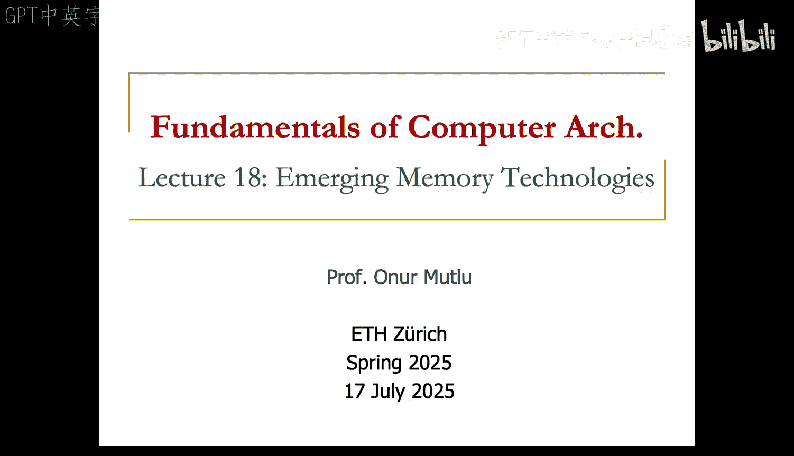

## 概述

在本节课中，我们将探讨新兴存储技术。我们将看到一些案例研究，以及我们和其他研究者为启用这些技术而开发的方法。正如我们过去讨论过的，DRAM存在许多可扩展性问题，我们需要通过智能内存控制器等技术使其更智能，以突破极限。但同时，思考其他可能替代DRAM或其他存储模块的技术也是有益的。

## 从闪存到新兴技术

闪存在过去也曾是新兴存储技术。在20世纪80年代，人们努力使其工作，当时也有很多人对这种架构持悲观态度。但在某个时刻，所有的研发努力都得到了回报。现在，闪存可以说是我们口袋里的智能手机能够存在的关键原因之一。否则，我们如何携带一个装有旋转硬盘的手机呢？下周我们将详细讨论闪存和固态硬盘，敬请期待。今天，我们将关注更多仍处于“新兴”阶段的存储技术。

## 电荷存储的局限性

让我们快速回顾一下电荷存储的局限性。

*   在闪存中，我们有一个浮栅，需要控制其中的电荷。
*   在DRAM中，我们有一个存储电荷的电容器。

本质上，存在晶体管漏电问题。在DRAM中，需要频繁刷新。在闪存中，最终也需要刷新。例如，如果你将数据存储在闪存中几年不碰它，很可能无法完好地恢复数据。幸运的是，我们的闪存现在被集成到SSD中，SSD使用相当智能的控制器来使闪存正常工作。

可靠的感测变得困难，因为电荷存储单元的尺寸减小了。当你想缩小尺寸时，它会变得越来越小，最终你将无法可靠地存储电荷和感测电荷。这就是为什么这些架构从根本上存在可扩展性问题。

## 解决方案概览

我们讨论过不同的解决方案。

*   **解决方案一**：新的内存架构，通过以内存为中心的系统设计来克服内存缺点，例如新颖的内存架构、接口、功能、更好的浪费管理等。
*   **解决方案二**：新兴存储技术。存在一些新兴的电阻式存储技术，它们似乎比DRAM更具可扩展性，并且也是非易失性的。

DRAM是易失性的，需要电力来保持电荷并需要刷新。但这些电阻式存储器是非易失性的，不需要电力来保持数据。

## 新兴电阻式存储技术示例

以下是几个例子。

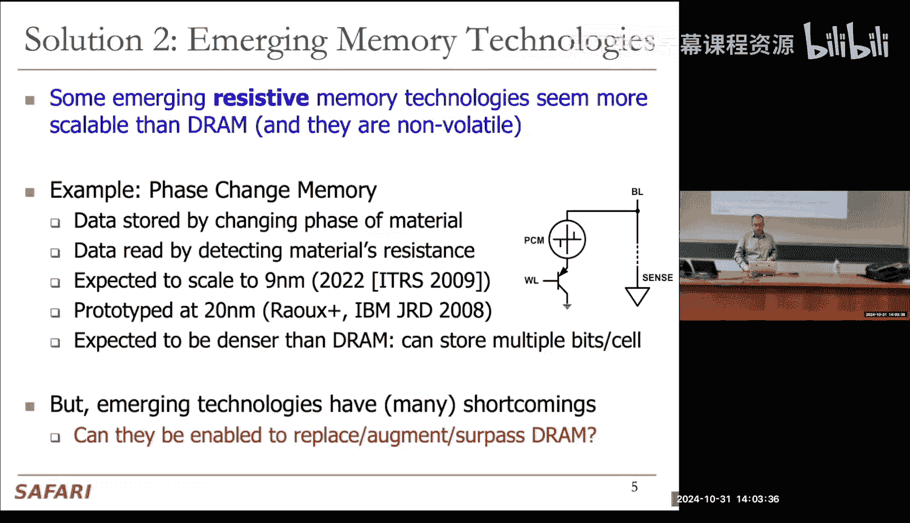

*   **相变存储器**：通过改变材料相态来存储数据。数据通过检测材料电阻来读取。PCM早在20世纪60年代就已开发，并已用于可重写CD。后来，人们意识到材料的相态变化也会导致电阻变化，并可以转换为电流，从而设计出感测电路来解码材料状态。
*   **自旋转移矩磁阻随机存取存储器**：通过注入电流来改变磁极方向，电阻由磁极方向决定。
*   **忆阻器**：通过注入电流来改变原子结构，电阻由原子距离决定。

这些技术提供了许多优点，因为电阻是非易失性的，并且从根本上更容易缩小尺寸。但同时，当你想注入电流来改变这些状态时，需要消耗大量能量和产生高温，这会导致许多问题。

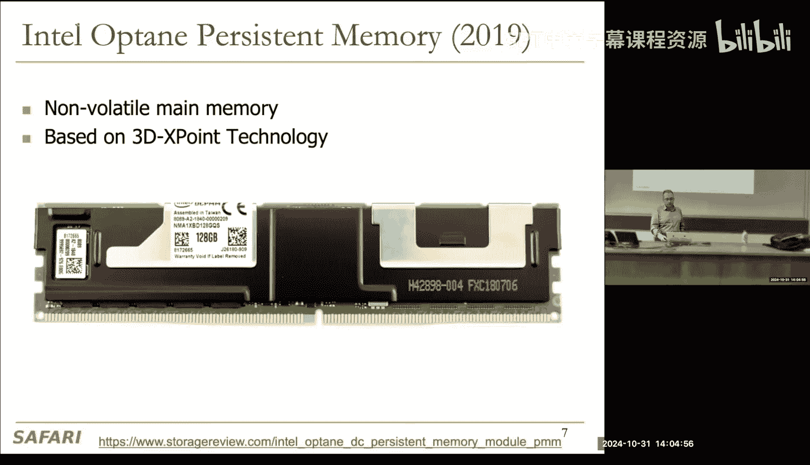

## 相变存储器详解

PCM是一种电阻式存储器。在高电阻状态下可以编码为0，在低电阻状态下可以编码为1。PCM可以在状态之间可靠且快速地切换，但这个“快速”并非像DRAM那样快。

### PCM工作原理

写入操作需要通过电流注入来改变相态。有两个基本操作：置位和复位。

*   **置位操作**：需要持续电流，将单元加热到结晶温度以上，并保持较长时间。
*   **复位操作**：注入相当高的电流，将单元加热到熔化温度以上，然后快速淬火，从而得到非晶态。
*   **读取操作**：通过检测材料电阻来检测相态。

有趣的是，在结晶态时，电阻约为1k到10k欧姆；在非晶态时，电阻很高，约为1兆欧或10兆欧。这两种电阻状态之间存在明显差异，这对于可靠地从这些存储器中读取数据非常重要。

### PCM的优势与挑战

PCM提供了一些机会。

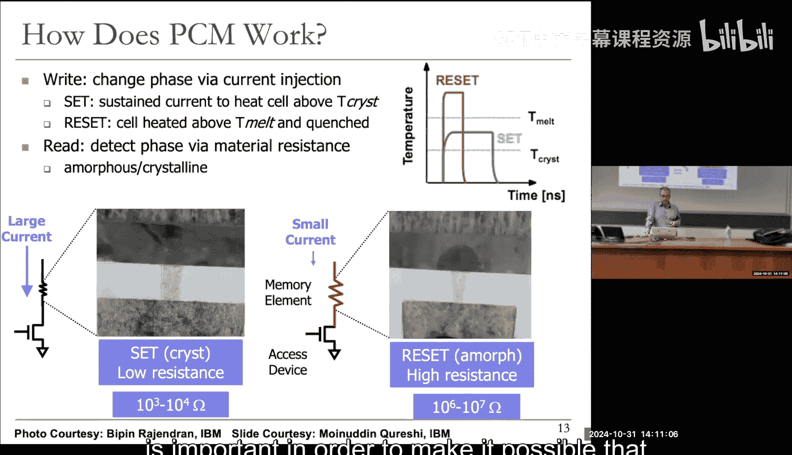

*   比DRAM和闪存具有更好的可扩展性。
*   需要电流脉冲，其大小随特征尺寸线性缩放。
*   预计可扩展到9纳米。
*   可以比DRAM更密集，因为它可以更好地缩小尺寸，并且由于电阻范围大，可以在每个单元中存储多个比特。

当然，这里存在权衡。当你增加每个单元的比特数时，电阻值之间的差异就不那么大了。如果你想把电阻窗口分成16个状态来存储4个比特，那么差异就不大了，问题在于你的感测电路需要相当精确才能检测出差异。

PCM也是非易失性的，可以在85摄氏度下保持数据超过10年，无需刷新，静态功耗低。

### PCM的多级单元

我们可以将这个电阻值窗口分割。例如，分割成四个区域，就可以在每个单元中存储2个比特。当然，与单级单元PCM相比，你需要花费更多的时间和能量来读写。

### PCM的特性调查

我们想了解PCM的特性，并对2003年至2008年的原型进行了调查。我们查看了所有这些数字并整理成表格。例如，有些原型的置位时间为100纳秒，置位电流为200微安，复位时间为50纳秒，复位电流为600微安。此外，还有写入耐久性。

**耐久性**本质上是指你可以可靠地向存储单元写入多少次。例如，如果你向PCM单元写入超过10^7次，那么你的单元可能会失效。有时单元并非完全失效，但变得不可靠，这意味着为了避免错误，你需要更强大的纠错码，这会导致很多问题。耐久性实际上是所有新兴存储技术的不幸问题之一。

从调查来看，PCM的耐久性范围从10^4到10^9不等。在进行新兴存储技术研究时，你并不确切知道这些数字，因为人们使用了不同的方法，设计了不同的感测电路。因此，使用参数范围进行研究总是一个好主意。

## PCM在系统中的定位

我们可以在系统中考虑PCM的位置：主存、缓存和存储。我们想考虑将其作为主存。PCM的延迟接近DRAM，但不如DRAM好。PCM的读取延迟约为50纳秒，是DRAM的4倍，但比非易失性闪存快。写入延迟约为1150纳秒，是DRAM的12倍，但低于非易失性闪存。动态能耗也高于DRAM，读取动态能耗是DRAM的2倍，写入动态能耗是DRAM的43倍。耐久性大约是DRAM的10^-8倍。单元尺寸比DRAM大，但可以通过特征尺寸和多级单元技术更好地扩展。

这里的要点是，PCM不太可能取代DRAM，因为它存在许多缺点。让我们再次总结一下PCM相对于DRAM的优缺点。

*   **优点**：更好的技术可扩展性、非易失性、持久内存、低静态功耗。
*   **缺点**：更高的延迟、更高的动态能耗、更低的耐久性、可靠性问题。

在启用PCM作为DRAM替代品方面存在挑战，因此需要减轻PCM的缺点，并找到在系统中放置PCM的正确方式。

## 用PCM完全替代DRAM的研究

在这项工作中，我们考虑完全用PCM替代DRAM。我们考虑了从调查中得出的所有数字：延迟是DRAM的4倍，写入延迟是12倍，能耗读取是2倍，写入是43倍，耐久性是10^8倍。

我们进行了模拟，在一个四核、4MB L2缓存系统中用PCM替换了DRAM。PCM的组织方式与DRAM相同。长话短说，结果并不好。执行时间延长了约60%，能耗增加了2.2倍，平均寿命为500小时。有些应用的性能开销甚至更大。

结果不理想，这在预料之中。现在的问题是，我们能否克服这些问题？我们对此进行了研究。

### 改进思路一：多行窄行缓冲器

在DRAM中，我们有一个大的感测放大器，因为读取操作是破坏性的，需要这个感测放大器进行电荷放大以确保正确。但PCM没有这个问题，所以你不需要感测放大器像整个阵列的行那么大。你可以使用更小尺寸的感测放大器，从而节省面积预算，并用这些预算来添加一些锁存器和缓冲器。这些锁存器和缓冲器本质上可以隐藏延迟，充当缓存。

### 改进思路二：细粒度写入

在DRAM中，写入时首先写入感测放大器，然后需要等待该值在DRAM行中恢复。但在PCM中，你不需要更新整行。你可以只更新发生变化的部分，也许只更新一个字节或两个字。这可以显著减少写入周期，从而有助于耐久性问题。

通过实施这两个想法，你可以获得性能改进，但执行时间仍然增加了20%，能耗相当，平均寿命更长。但这里有一些注意事项：最坏情况下的寿命要短得多，因此没有保证；密集型应用会遭受较大的性能和能耗损失；我们甚至考虑的是乐观的PCM参数吗？事实证明，其中一些参数实际上非常乐观。

如果你想完全用PCM替换主存，你不会获得性能改进，反而会得到性能下降，并且还存在许多其他问题。

## 混合主存架构

现在让我们看看另一种方法：混合主存。记住我们过去讨论过的图片：你有CPU和不同的控制器，例如DRAM控制器控制快速且耐久的DRAM，但它容量小、有漏电、易失且成本高。另一种存储技术如相变存储器，容量大、非易失且成本低，但速度慢、耐久性差且动态能耗高。

通过将两者结合使用，希望你能从多种技术中获得最佳效果。这就是使用混合内存的想法，但这当然也带来许多挑战，例如如何映射数据，如何决定哪些数据应该去DRAM，哪些应该去PCM，如何迁移它们。或者，你是否将其架构为缓存，即DRAM作为PCM的缓存？或者DRAM是内存地址空间的一部分，这样DRAM和相变存储器共同构成整个内存地址空间。如果是这样，程序员也需要处理它，例如使用一些指令将数据存储在DRAM部分，或使用一些指令将数据存储在PCM部分。编译器也可以提供帮助，但也可以作为缓存，即DRAM可以作为PCM的缓存。

目标是通过多种存储技术提供多种指标的最佳组合。当然，正如我所说，有许多问题或挑战需要解决，例如我们是设计为缓存还是主存？数据移动或管理的粒度应该是细粒度还是粗粒度？应该是硬件控制还是软硬件协同？何时迁移数据？因为迁移总是有成本的，所以本质上何时调度它？以及如何设计可扩展且高效的大型缓存？

一个选择是我们可以将DRAM视为PCM的缓存。PCM是主存，DRAM缓存内存行和块。好处是减少了DRAM缓存命中的延迟，并且还进行写入过滤，从而可以改善或消除PCM的写入耐久性问题。内存控制器硬件应管理DRAM缓存，这消除了系统软件开销。但至少存在三个问题：哪些数据应放置在DRAM中，哪些应保留在PCM中？如何智能地管理你的缓存？数据在它们之间移动的粒度是多少？以及如何设计低成本的硬件来管理DRAM缓存？

这里有两个想法方向：数据放置的局部性，以及芯片标签和粒度。

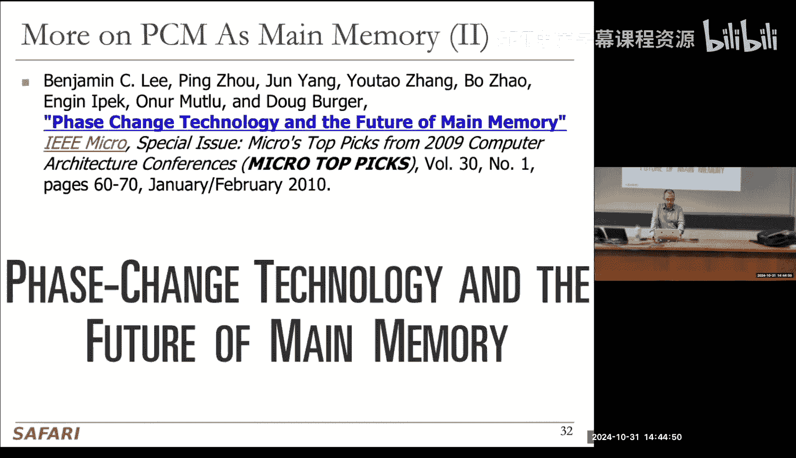

### DRAM作为PCM缓存的研究

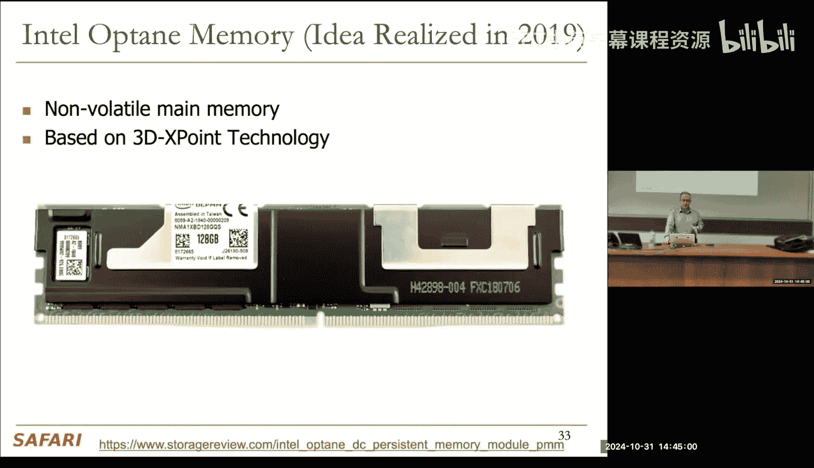

目标如前所述，是实现DRAM和PCM或NVM的最佳结合。它最大限度地减少了DRAM的用量，同时不牺牲性能和耐久性。DRAM作为缓存来容忍PCM的延迟和写入带宽。当然，PCM作为主存以良好的成本和功耗提供大容量。

这里的关键是如何管理DRAM缓冲区。有一些技术，比如写入过滤技术，你可以采用延迟写入的方法。当你从闪存或硬盘驱动器带来数据时，不要立即写入PCM，而是首先将它们写入这个DRAM缓冲区作为延迟写入页。然后，如果你意识到它们被需要，或者因为你在该DRAM缓冲区中捕获了一些写入而变脏，你需要将它们写回PCM。但在某些时候，你甚至不需要将它们写回PCM，只需将它们写回闪存或硬盘驱动器。你也可以进行页面绕过，即丢弃使用率低的页面。

这项研究进行了一些分析。他们考虑了一个16核系统，具有8GB DRAM，主存访问延迟为320个周期，还有延迟为2毫秒的硬盘驱动器，以及延迟为32微秒的闪存，并假设闪存命中率为99%。他们的假设是PCM的密度是DRAM的4倍，这考虑了PCM的优良特性。PCM比DRAM慢4倍，块大小等于PCM页大小。

结果显示，拥有32GB PCM加上1GB DRAM作为缓存，你实际上可以获得性能优势，平均性能非常接近32GB DRAM基线。这很好，这正是我们从混合内存系统中所期望的。

## 数据放置与混合内存管理

让我们在更高抽象层次上思考数据放置和混合内存。本质上，你有这些核心缓存和内存控制器，以及多个通道。一个通道可以是内存A，它快速但容量小；通道B可以是内存B，它容量大但速度慢。想法是，你希望将你的页面分配到这些不同的内存中。

在某个时刻，你想将页面2迁移到通道A，因为你想要更快的访问。但问题是，这会导致一些数据移动。此外，你现在在通道A上也有一些争用。因此，如果你这样实现，也可能以降低带宽为代价。

为了最大化系统性能，我们将每个页面放置在哪个内存中？但同时，你还应该回答其他问题，例如你不应该让通道B闲置，并可能导致负载均衡问题。

### 基于访问模式的数据放置

DRAM和PCM之间的数据放置，其想法是如何表征数据访问模式并指导混合内存中的数据放置。

有些工作负载具有流式访问。当你有流式访问时，它们在PCM中可以和在DRAM中一样快。然而，对于随机访问，它们在DRAM中要快得多。因为对于随机访问，你总是需要支付访问延迟。但当你有流式访问时，希望你可以通过利用带宽来隐藏这些延迟。因此，对于具有流式访问的应用程序，你可以将它们映射到PCM。对于随机访问，你可以将它们映射到DRAM。这就是这项工作的想法：将具有一些重用性的随机访问数据映射到DRAM，将流式数据映射到PCM。

这里有更多细节：行缓冲器同时存在于DRAM和PCM中，因此行命中的延迟在DRAM和PCM中是相似的。然而，行未命中的延迟在DRAM中很小，在PCM中很大。这就是为什么行冲突对PCM来说代价高昂，所以你不喜欢随机访问。而当你有流式访问时，你实际上可以从行缓冲器局部性中受益，所以你可以将它们映射到DRAM或PCM，两者都可以工作。但当你有随机访问时，很可能会有很多行冲突，这就是为什么最好使用具有较低未命中延迟的内存。

因此，将数据放置在DRAM中，这些数据很可能在行缓冲器中未命中，行缓冲器局部性低，这意味着在DRAM中P很小，并且被多次重用，这值得移动成本，并且在DRAM中有空间。如果满足这两个标准，你实际上可以移动或迁移该数据到DRAM。

现有解决方案的一些弱点是，它们都是启发式的，只考虑了内存访问行为的有限部分，并没有直接捕捉数据放置决策对整体系统性能的影响。

## 大型DRAM缓存的设计挑战

这是一个问题：当我们有大型DRAM缓存时，它需要大量的元数据，例如基于标签的块信息存储。我们如何设计高效的DRAM缓存？当你发出加载请求时，你首先检查数据是否可以从这个DRAM缓存中获取，所以你需要检查元数据，然后访问它。如果命中，你可以从DRAM获取数据；否则，你应该去PCM。所以想法是我们如何存储标签。

一个想法是，我们可以将标签存储在DRAM中与数据相同的行中。在你的DRAM行中，你有缓存块，也有标签。好处是你不需要片上标签存储开销，因为标签阵列需要相当高，你可以在家做一些计算。但本质上，这是因为你的DRAM缓存在这里相当大，然后你需要相当大的标签元数据。所以你不需要为此付费，但也有一些缺点：缓存命中只有在DRAM访问之后才能确定，这相当耗时；缓存命中需要两次DRAM访问，所以你需要访问DRAM来获取标签，然后在检查标签之后，如果命中，你需要再次访问并读取块。所以这是一个问题。

第二个想法是，我们仍然可以将所有元数据存储在DRAM中，但我们可以减少元数据存储开销。我们还可以在片上SRAM中缓存一部分频繁访问的元数据。那些你更频繁访问的块，你可以将它们的元数据缓存在SRAM中。这样实际上可以降低访问元数据的成本，现在你可能同时拥有快速的元数据访问和较低的存储开销。

第三个想法可以是动态数据传输粒度。有些应用程序受益于缓存更多数据，所以它们可能具有良好的空间局部性，你可以考虑它们具有较大的缓存块。其他应用程序则不然，大粒度会浪费带宽并降低缓存利用率。所以第三个想法是，我们可以通过成本效益分析来确定基本数据和缓存块大小的简单动态缓存粒度策略。然后，他们可以将主存分组为行集，例如，不同的样本行集遵循不同的固定缓存粒度。其余的内存遵循最佳情况。

结合所有这些技术，你实际上可以获得非常接近理想情况的性能，但复杂度要低得多，因为存储开销更低。在能效方面，你可以获得更好的能效，因为你没有减少太多性能，但由于存储更低，你降低了很多成本和功耗。

DRAM缓存方面也有很多最新的选择。人们也做了很多工作，我们和其他人都做了很多工作，这里可以看到许多不同的研究，比如不同的方案。这篇论文实际上对它们进行了很好的比较，比较了所有这些方案或技术，例如它们如何处理DRAM缓存命中、DRAM缓存未命中、如何处理替换流量、替换决策等等。如果你感兴趣，你也可以查看这篇论文。

## 新兴存储技术的其他机遇

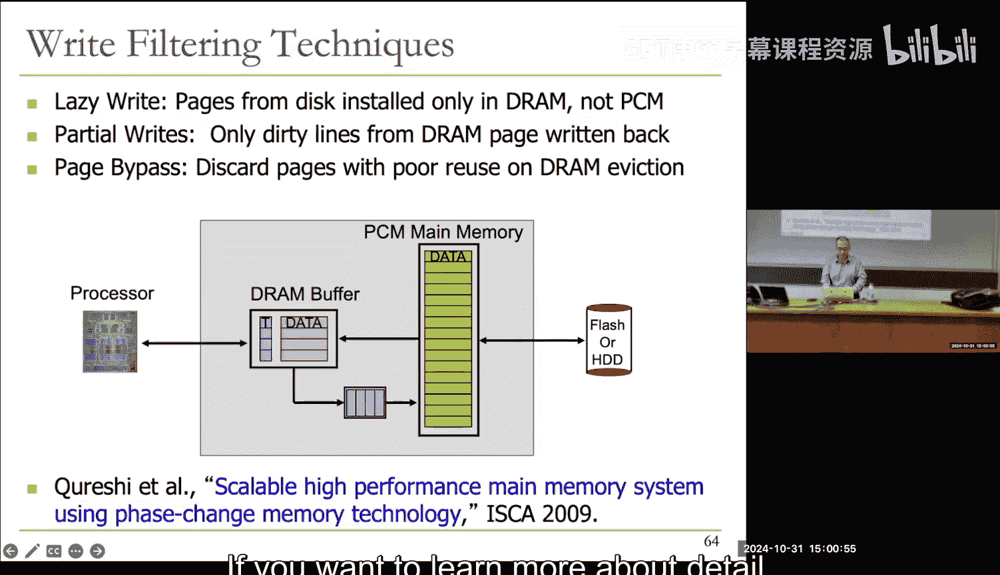

现在我想看看新兴存储技术的其他机遇。这里我将列出其中一些基本机遇，我们将涵盖其中几个。

### 机遇一：内存与存储的融合

目前它们没有融合，我们有DRAM和SSD或硬盘驱动器。潜在地，由于新兴存储技术是非易失性的，你实际上可以将它们融合，并使用单一接口来管理所有数据。

你还可以考虑新的应用程序，例如超快速检查点和恢复，这对于持久内存非常重要。通过减少数据丢失，你可以拥有更健壮的系统设计。

你也可以考虑与内存紧密耦合的处理，例如使用内存中处理技术。我记得我们在关于使用内存的第一讲中，我不再赘述，例如我们可以使用DRAM做很多计算，比如按位操作和行克隆，同样的DRAM。

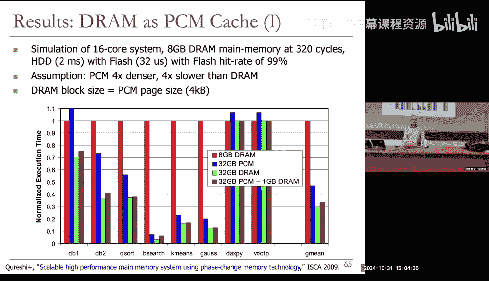

人们已经证明，例如，新兴存储技术也可以同时进行按位操作和行克隆。有趣的是，这些架构还可以执行一些使用DRAM处理无法轻易完成的操作。这是因为它们的构建方式，例如用于数组操作的内存交叉阵列。

这些架构设计成交叉阵列方式，例如一些新兴非易失性存储技术具有交叉阵列结构，如忆阻器、电阻式RAM、相变存储器、自旋转移矩磁阻随机存取存储器。这些交叉阵列可用于执行点积操作，利用模拟计算能力。通过执行点积操作，潜在地你可以进行矩阵向量乘法，潜在地你可以进行神经网络卷积神经网络等等。它们可以使用基尔霍夫定律对多个数据片段进行操作。

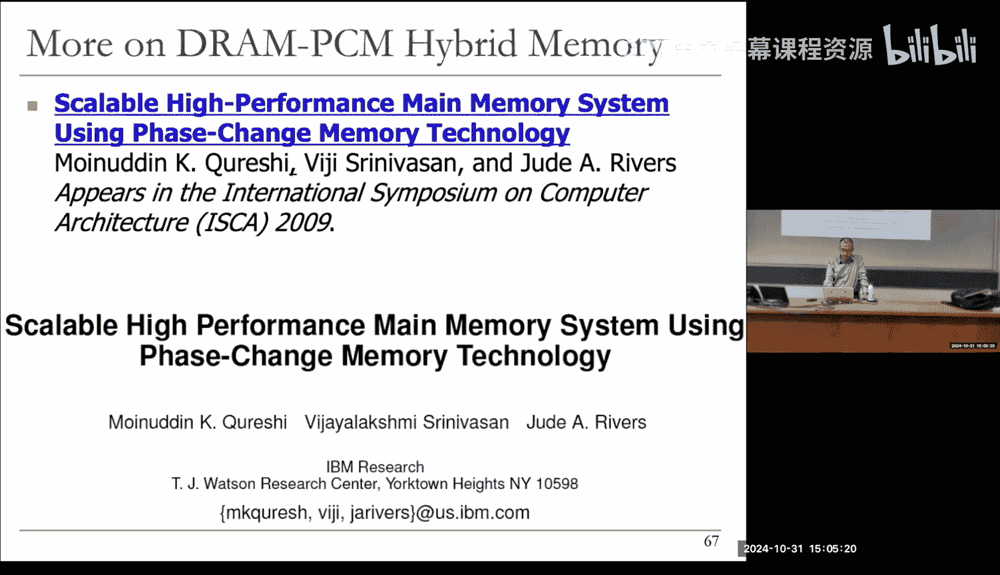

计算是在模拟域中进行的，在交叉阵列内部，所以你需要前置电路，如数模转换和模数转换来处理输入和输出。

这里有一个例子：你可以看到我们这些数模转换器，这里是你的交叉阵列区域。这是一个采样保持器，你可以把它想象成一个锁存器，你在这里采样你的模拟数据，这里有一个模数转换器。

本质上，这里发生的是，你在这里施加的电压，可以基于你的输入向量确定，所以你有一些输入值，如0和1，你使用这些数模转换器将它们映射到一些电压值。这些电压会导致一些电流流经这条线，取决于这个电阻的电导。然后，这条位线上的电流值将是这些电流值的总和，基于基尔霍夫定律。这就是为什么你实际上可以看到这实际上是一种点积，所以你可以使用这个模拟视角，然后将其转换为数字，以轻松进行点积操作。人们已经做到了。

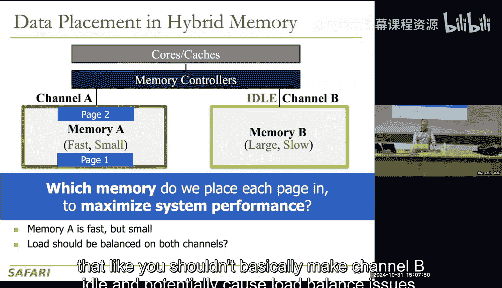

所以本质上，你可以认为，例如，你有这个输入数组，这是你的矩阵，你的权重矩阵。你可以将你的权重矩阵作为电阻值放在你的交叉阵列中。然后你将这些值输入到输入电压中，然后你得到输出。

这可以实现，是的。当然，你需要支付编程能量、编程延迟，例如编程自旋转移矩磁阻随机存取存储器或忆阻器。这也是耐久性问题的一部分，例如，人们已经证明，使用忆阻器阵列进行推理相当好，你只需编程一次电阻，然后进行大量推理。但一旦你想进行需要更新权重的训练，那么你的交叉阵列将很快磨损。

这实际上首先在...中提出，但你知道，人们已经将其用于加速卷积神经网络，例如在ISCA论文中。请记住那篇论文非常清楚，因为ISCA论文的第一作者是我在2011年的第一位导师。当时我们一起研究自适应路由算法或互连网络，但我们稍后也会看到一些关于这方面的讲座。

所以你可以考虑如何将这个想法用于卷积。这里有一个卷积的例子，本质上你有输入特征图，有一个窗口在你的输入上移动或滑动。你在每一步进行一些计算，然后计算输出特征图。当然，你还需要进行一些填充，以确保你总是有一些数据，因为有些区域你的窗口可能会超出你的输入特征。

所以你可以考虑它，然后你可以用它来进行卷积神经网络的操作。但在卷积神经网络中，你不仅要做点积，还有其他层，如非线性层，如ReLU。所以，在你的芯片中，本质上，你可以有这个基于非易失性存储器的交叉阵列来进行这些点积，你还需要做一些非线性函数阵列，你可以将其视为近内存处理引擎，它们也集成在这里，以便加速非线性神经元操作。

通过这样，他们基本上可以提高性能。我们也在这个主题上做了工作，比如GenPx。John明天在我们的基因组学讲座中可能也会稍微讨论一下这项工作。

所以，在这项工作中，还有Swordfish，我不确定我们明天是否会讨论它，但它也将成为你阅读的一部分。这也很有趣，因为人们已经大量使用忆阻器来进行神经网络，基本上用于进行卷积神经网络或深度神经网络等应用。

但问题是这些内存资源不理想。因此，每当你进行计算时，都会有一些错误。这项工作实际上试图研究这些错误如何使你的假设出错，以及这些错误如何导致使用这些内存时的精度损失或性能损失。了解所有这些问题是很好的，这样你就可以设计技术来克服它们。

这是提到的ISCA论文，以及该领域的其他论文。人们已经开发出来。这也是历史领域和卷积讲座的一部分，如果你感兴趣，这是一个美丽的主题，你也可以从Mos教授的讲座中查看。

### 机遇二：内存与存储的统一接口

我们讨论了内存与存储的融合，让我们更深入地探讨一下。你可以有一个统一的接口。

这是一个传统系统，本质上，你有内存和存储。处理器通过加载和存储指令访问DRAM，然而要访问这些，我们需要进入I/O子系统，基本上I/O块栈，你需要打开文件，读取I/O，然后更新等等。

这表明，每当你想要访问存储时，你都需要支付操作系统开销，这在早期的计算机系统中并非如此，当时我们使用磁芯存储器。那是人们用作主存和存储的一切，虽然不是很大的内存，但那是人们拥有的唯一内存。但后来，随着技术的进步，人们开发了DRAM，然后这些接口实际上逐渐分道扬镳。所以现在我们有不同的接口来访问主存和访问存储。

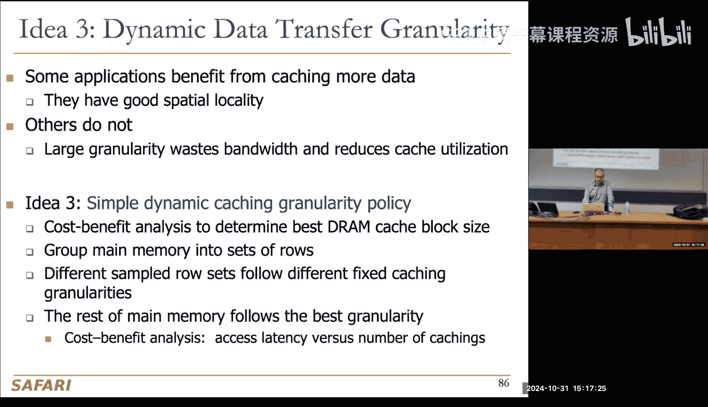

我们知道硬盘驱动器是非易失性的，但速度慢，并且是块可寻址的。我们知道DRAM是易失性的，速度快，并且是字节可寻址的。

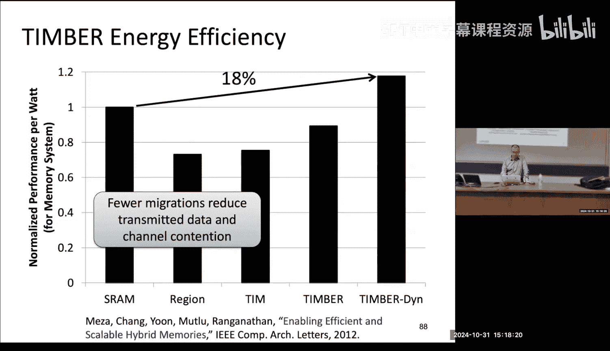

同时，我们也知道有一些非易失性尝试内存，如PCM或自旋转移矩磁阻随机存取存储器，它们相对较快，至少与闪存或硬盘驱动器相比，并且它们是字节可寻址的，并且是非易失性的。所以现在的问题是，我们能否使用这些非易失性存储器来合并内存和存储，以便我们在它们之间拥有一个共享接口？

这就是两级内存和存储模型的想法。传统的两级存储模型对于非易失性存储器来说是一个瓶颈。原因是，当你考虑这个例子，比如两级存储。你有这个处理器和缓存，每当你想要访问你的存储时，你需要进入操作系统和文件系统进程。

但这种开销可能还可以，因为硬盘驱动器本身就很慢，所以你可以支付这种开销，因为音频块延迟可能不会比访问磁盘的延迟长。但事实证明，对于SSD来说，情况并非如此，这就是为什么人们也开发了新兴接口来访问SSD，比如我们下周将要学习的NVMe接口。

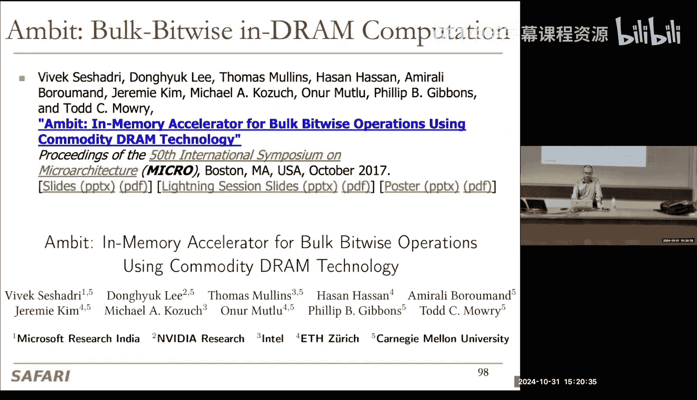

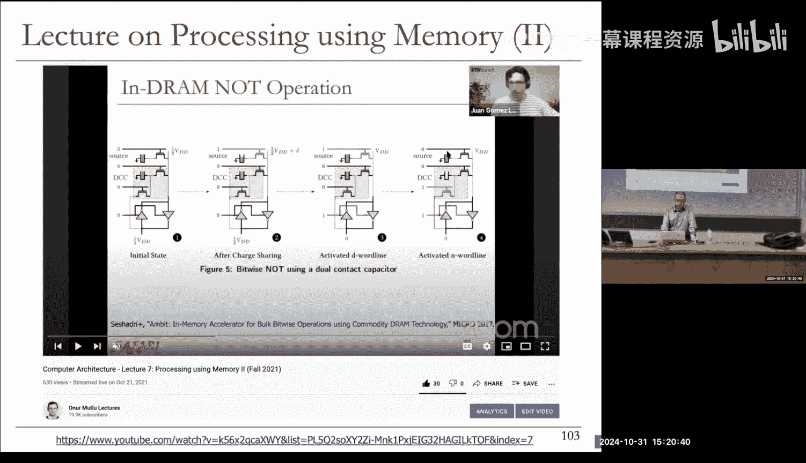

然而，如果我们考虑这里我们有PCM，那么PCM比SSD快得多，例如比闪存和硬盘驱动器快。所以现在你需要支付很多延迟来通过操作系统，然后你访问该PCM的延迟相当快。所以显然这不是一个好的决定，所以现在你可以看到，当我们使用非易失性存储器作为存储时，这种两级设计是次优的。

所以目标是我们希望在单个单元中统一内存和存储管理，以消除在定位、传输和转换数据方面的浪费。这当然可以提高能源和性能，并且简化了编程模型。编程模型不需要处理不同的内存类别、是否持久化或不同的接口。一切只是统一的。这自然提供了编程的便利性。

通过非易失性存储器，我们可以提供持久内存，正如我们讨论的，这是直接在非易失性存储器内存中操作持久数据的机会。

这里有一个例子。你有不同的内存模块，比如DRAM、闪存、非易失性存储器和硬盘驱动器，比如不同的存储技术，它们都在硬件中，但你正在统一接口，作为一个持久内存管理器。

你通过加载和存储访问这个持久内存管理器，这个管理器将访问DRAM、闪存、非易失性存储器和硬盘驱动器。所以处理器最终只看到这些加载和存储，还有一些来自软件和运行时的提示，你可以使用这些提示在DRAM、闪存、非易失性存储器和硬盘驱动器之间智能地映射你的数据。

所以这不是一个非常容易的例子，比如持久对象，有一个文件，你将其分配为持久对象，然后你可以根据其特性将该文件作为持久对象映射到闪存、非易失性存储器或硬盘驱动器。

持久内存管理器使用访问和提示信息来分配、定位、迁移和访问异构设备阵列中的数据。持久内存管理器暴露一个加载存储接口来访问持久数据，这是这里的关键区别，应用程序可以直接访问持久内存，没有持久数据的转换、翻译和定位开销。

它管理数据放置、位置、持久性和安全性，以获得多种存储形式的最佳效果。它还管理元数据存储和检索。这当然会导致需要管理的开销，并为系统软件暴露接口、钩子和接口。

为了在异构设备之间进行高效的数据映射，给你一些思路：持久内存暴露一个大的持久地址空间，但它可能使用许多不同的设备来实现这一目标，从快速、低容量、易失性的DRAM到慢速、高容量、非易失性的硬盘驱动器或闪存。你还有介于两者之间的其他非易失性存储器设备，所以性能和能源可以从这些设备之间的良好数据放置中受益。这就是为什么你真的需要从这些提示中学习，并很好地映射你的数据，利用每个设备的优势，并尽可能避免其弱点。

例如，考虑两个重要的应用程序特征：局部性和持久性。这里有一个例子：你有像数据库应用程序这样的应用程序，比如列存储中的列，它们只是偶尔被扫描，放置在闪存上。显然，它的局部性较差，因为不频繁，并且你使用扫描。但它是持久的，因为它是数据库的一部分。所以你可以将其特征分类为这个节点。同时，可能有一些应用程序，如内容分发网络的频繁更新索引，它具有更多的局部性并且是临时的，所以你需要将其放置在这里，这就是你实际上可以管理存储、持久内存的方式。

我们使用这些系统评估了这个想法。我们考虑硬盘驱动器基线，即具有易失性DRAM内存和持久硬盘驱动器存储的传统系统。当然，这具有操作系统和文件系统代码以及缓冲的开销，以及硬盘驱动器访问延迟。

我们还考虑了非易失性存储器基线，它与硬盘驱动器基线完全相同，但硬盘驱动器被非易失性存储器取代。好处是，由于非易失性存储器访问速度更快，但仍然存在两级存储模型的问题。不幸的是，当时我们还没有SSD基线，这也是这项工作的一个局限性。

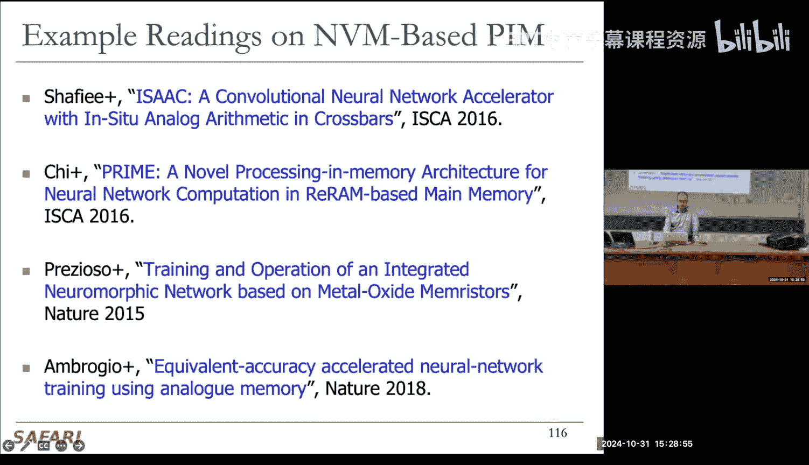

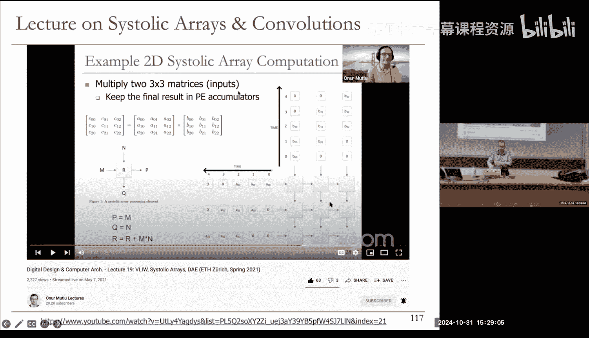

持久内存，我们只使用非易失性存储器，并且没有DRAM来确保全系统持久性。所有数据访问都使用加载和存储，所以本质上没有两级存储模型。它不会在系统调用上浪费时间，数据直接在非易失性存储器设备上操作。

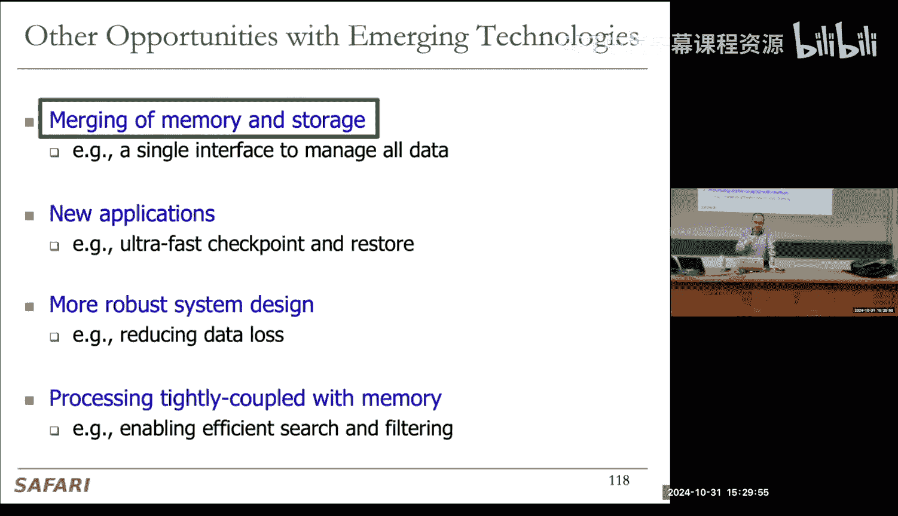

所以你可以看到，从硬盘驱动器两级到非易失性存储器两级，我们获得了24倍的加速，这相当好，因为非易失性存储器相当快。从非易失性存储器两级到持久内存，我们获得了大约5倍的加速。这也显示了这种想法的有效性。我相信闪存在这里某个位置，因为闪存的延迟比硬盘驱动器好得多。例如，访问硬盘驱动器大约需要10毫秒，但考虑到所有其他延迟，访问SSD的读取延迟可能在200微秒左右，所以使用闪存访问速度要快几个数量级。

在能源方面，当你使用持久内存时，你也可以观察到相当大的加速。如果你想了解更多，你也可以查看这篇论文以获取更多细节。

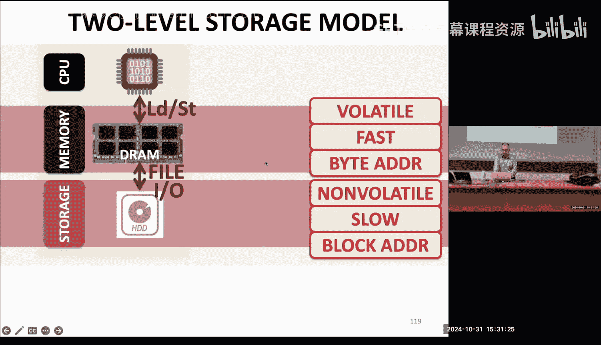

### 持久内存的挑战

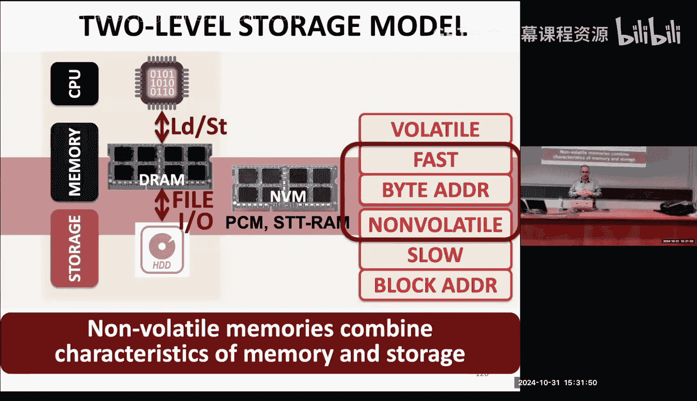

这些是我们在这里讨论的挑战和机遇，例如将内存和存储结合在一个统一接口中以访问所有数据。所以人们工业界已经在这方面做了工作，这是我今天多次展示的幻灯片，但这些Optane内存。人们实际上已经展示了如何将这些Optane内存作为系统的一个DIMM添加，你可以看到它实际上就像DDR内存条。然后他们将其用作持久内存，人们开发了库，可以使用这个Optane内存作为持久内存，并报告了与将DRAM作为非持久内存和SSD作为持久内存相比的结果。

人们还添加了处理数据引擎，我不确定为什么在这里，但无论如何。

持久内存存在许多挑战，我想在这里指出的一个关键挑战是：如果所有内存都是持久的，如何确保系统数据的一致性。

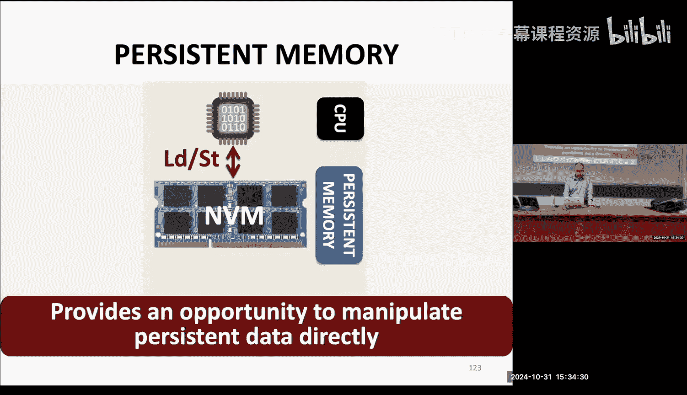

有两个极端：程序员透明，让系统处理。你不想让程序员做任何事情，你想提供相当的程序便利性，所以系统应该处理它。这对程序员来说非常好，但当然很难实现。另一个极端是程序员处理。

我认为好的解决方案可能介于两者之间。但在研究中，有时采取极端行动也是好的，因为你想看看你将面临哪些挑战，以及当你想突破界限时你将如何应对它们。这就是为什么在新兴存储技术领域进行研究也很有趣。

这是一个例子，比如崩溃一致性问题，这实际上是众所周知的。例如，你想向链表添加一个节点。有一个指向下一个节点的链接，也有一个指向前一个节点的链接，你总是希望以原子方式完成。因为如果你不这样做并且发生崩溃，那么你可能会得到这种链表，即指向前一个节点的连接存在，但指向下一个节点的连接不存在。然后你的链表基本上就断了。这实际上是一个已知问题，并导致内存状态不一致。

因此，有相应的解决方案，基本上有明确的接口来管理一致性。本质上，你需要以原子方式完成，所以有一些原子开始和结束，你在这里插入你的代码以确保所有这些操作将以原子方式发生，要么两者都发生，要么都不发生。这是你在原子写入时需要确保的关键。

但当然，这限制了非易失性存储器的采用，因为你必须重写代码，明确区分易失性和非易失性数据。这就是为什么将负担放在程序员和编译器上并不是一个好主意。

因此，也有一些引用，我稍后不会展示，如果你感兴趣，可以稍后查看。但本质上，有一些。让我看看。是的，所以你需要使用事务内存。为了确保你以原子方式完成。

这里还有一些列表，在库访问中，你需要进行事务内存获取，以确保获取以原子方式完成。但你基本上已经明白了，所以它应该像手动声明持久组件。有时你需要新的实现，第三方代码可能处于不一致状态。所以你需要将它们放在事务内存访问中。但本质上，你需要从这些库和代码中受益以提供一致的代码。

但我们希望有一种方法，比如软件透明的持久内存一致性。我们希望在持久内存中完全软件透明。

关键想法是，我们定期检查状态，并在崩溃发生时恢复到先前的检查点。这是一种基于硬件的检查点机制，以多种粒度进行检查点，以减少检查点延迟和元数据开销，并且我们重叠检查点和执行以减少检查点延迟，并且它适应DRAM和非易失性存储器的特性。

我们在这方面做了很多工作，这并不容易，也不容易。我不确定我们是否真的应该推荐人们使用它，因为它给系统增加了很多复杂性。当然，在这项工作中，我们还考虑了一个单一节点，你只需要处理你的内存和存储，但假设你正在考虑一个分布式系统，并且你有来自网络的数据，例如你的网卡。那么你将如何检查点，你知道，人们也在研究分布式系统中的检查点，比如在数据库中。

但你可以想象，检查点会导致多少开销，比如所有检查点也会导致大量数据移动和能源消耗。这就是为什么在完全放在程序员身上和完全程序透明之间找到一个中间解决方案可能是最好的方法。

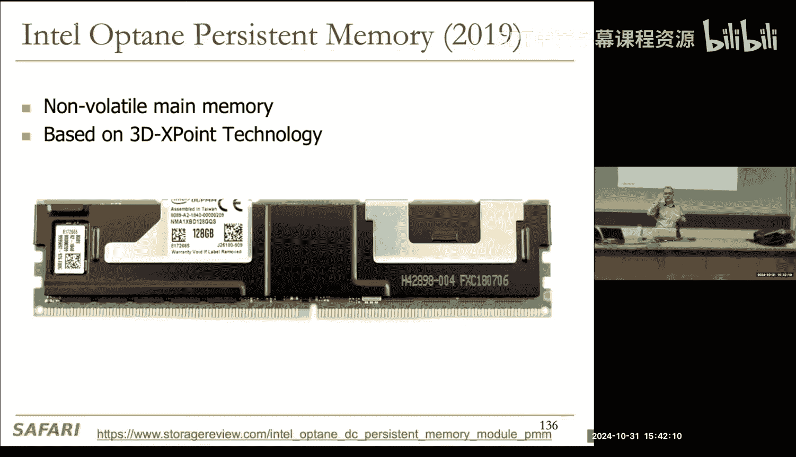

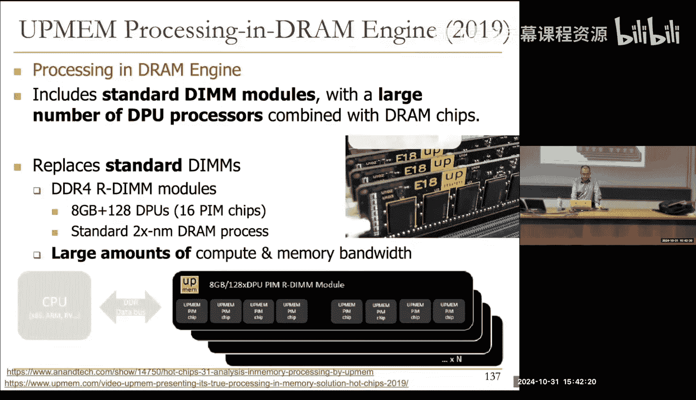

但我们也得到了很好的结果，比如我们的性能在理想化的具有零成本一致性的DRAM的5%、4.9%以内。

我们还做了关于如何重叠检查点和执行的工作，因为如果你这样做，然后花时间检查点，然后运行和检查点，那是相当愚蠢的，因为你为检查点增加了很多开销。所以想法是，你希望通过运行其他线程或其他什么来重叠这些检查点。所以本质上，你应该能够很好地调度它们，以便尽可能多地重叠检查点和执行。

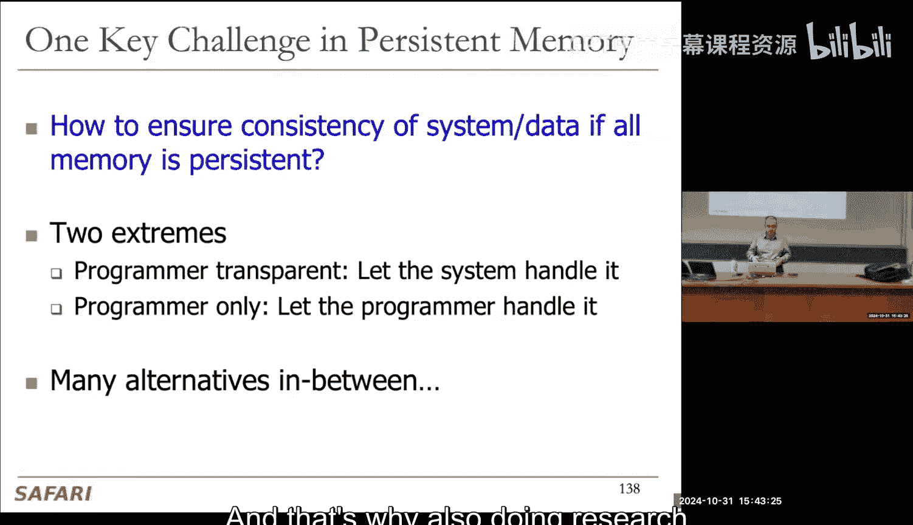

是的，如果你想了解更多，你可以查看这篇论文，它也将成为你作业中的阅读材料之一。

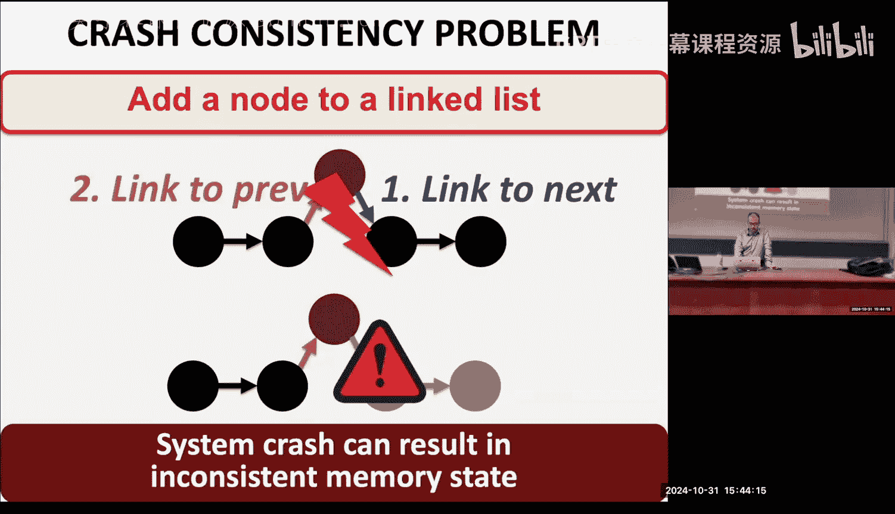

但持久内存中还有另一个关键挑战，比如利用持久性的程序。人们在这方面做了很多工作，如果你有兴趣了解更多，你也可以查看这些论文。

### 安全与隐私问题

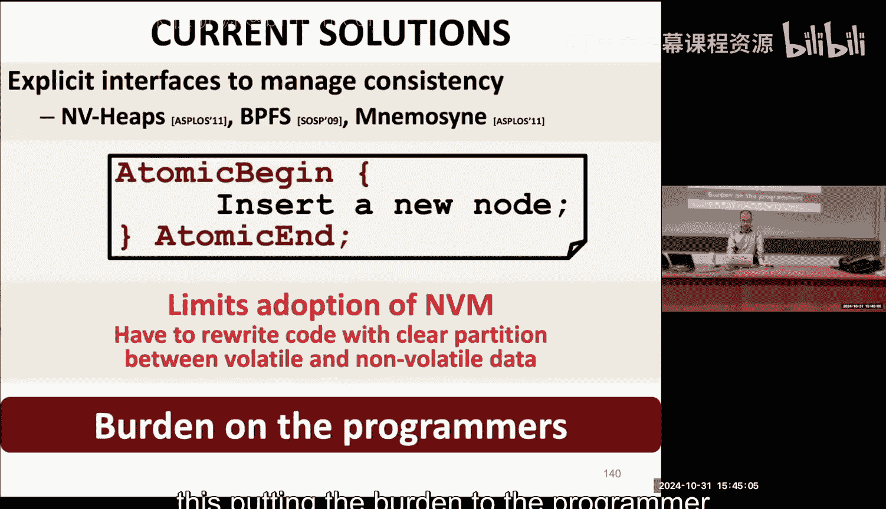

现在我们谈到安全和数据隐私问题，你的同事实际上提到了。本质上，在非易失性存储器中，我们存在这些安全和隐私问题。首先，由于耐久性问题，我们存在这些磨损攻击。

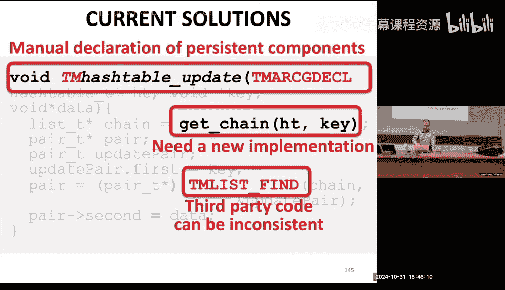

人们实际上可以设计攻击，导致你的芯片快速磨损，例如。例如，如果你在这里攻击，例如，发出或发出大量写入到你的PCM内存。这会导致，你知道，该芯片的磨损。当然，有一些技术，如磨损均衡，人们一直在使用，试图限制写入次数，例如，在你的PCM中。

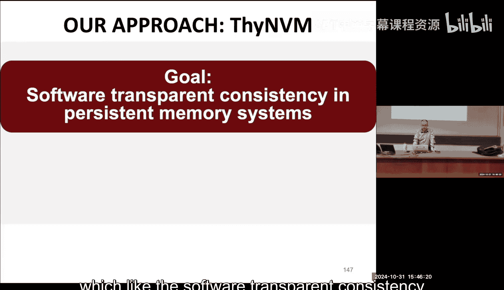

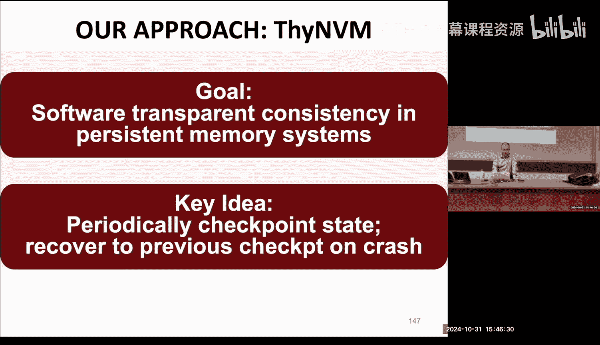

假设耐久性是10^8，如果你只向一个单元写入10^8次，那么该单元将会失效。但如果你平衡你的写入，你使用一些技术，如磨损均衡，你基本上尝试在整个内存阵列中以平衡的方式写入。那么希望你可以实际上容忍更多的写入。但是，当你设计攻击技术时，攻击者实际上也可能足够聪明或足够有创造力，并试图，我不知道，欺骗你的磨损均衡技术，从而本质上导致大量写入到你的单元。

在混合内存中，你也可能存在性能攻击，例如，人们也在这方面做了工作。你的同事提到的另一件事是，断电后数据不会被擦除。在DRAM中，当你关闭电源时，你的数据被清除，除非你想进行这种冷启动攻击，并且你知道将你的DRAM冷却很多，但一般来说，当你关闭电源时，事情就完成了。但在非易失性存储器中，情况并非如此，你可能在这里存在一些隐私问题，需要研究。

## 总结与未来展望

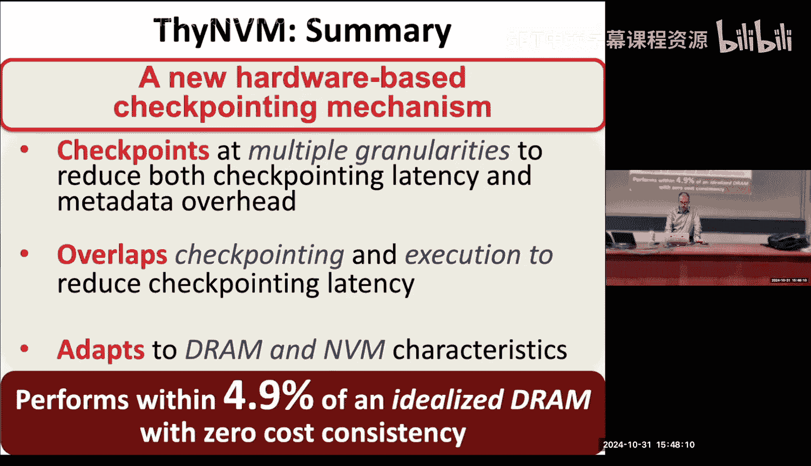

让我们总结一下，有什么问题吗？我在一些幻灯片上有点快，但我试图尽可能传达想法。希望你们从这次讲座中获得了一些很好的见解。

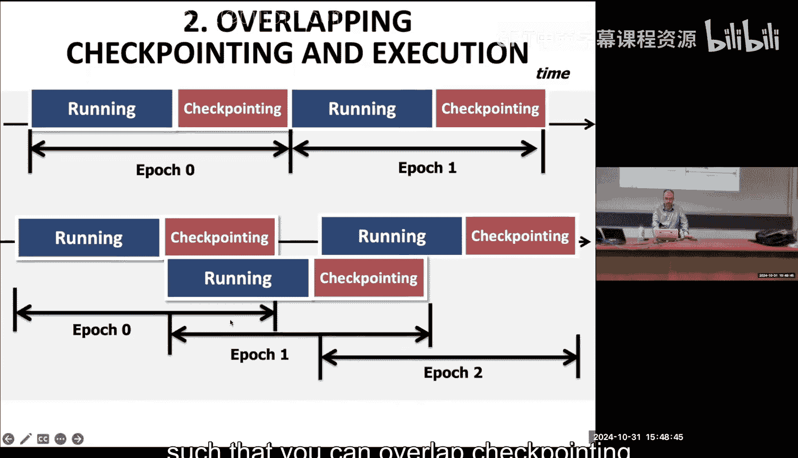

新兴技术的未来是光明的，无论底层技术和上层问题需求存在何种挑战。它可以实现数量级的改进以及计算系统中的新应用程序。

然而，我们必须像我们一直讨论的那样，跨堆栈思考，并设计启用系统。这里有一个很好的例子：你有一个新设备，这个新兴存储技术。你可以设计不同的技术，你知道，就像我们已经观察到的那样，比如微架构软件技术。

人们也在算法设计方面做了工作，例如，如何改变你的算法以减少写入次数。当你设计算法时，通常你根本不会考虑这一点，比如使用DRAM，你从未想过，好吧，我有多少次写入，但有了这个新的角度，比如计算机科学也需要意识到，从事理论计算机科学工作的人说，这些算法也应该考虑写入次数，你知道，人们也在那个方向上做了有趣的工作。当然，如果有疑问，请参考闪存，一个至少二十年来备受怀疑的新兴技术。

但现在你可以看到，闪存无处不在，我的意思是，在我们所有人的口袋里。下周我们还将学习很多关于闪存的知识。

在这个领域有许多研究和设计机会，比如实现完全持久内存，正如我们也讨论过的，使用基于非易失性存储器的内存进行计算，混合内存系统，持久内存中的安全和隐私问题，可靠性和耐久性问题，非易失性存储器的虚拟内存系统，以及例如，虚拟块接口。

这也是一个有趣的思考点。虚拟内存出现的原因是，基本上你的主存不够大。这实际上使程序员的生活相当困难，你知道，他们想要设计程序的方式，所以人们开发了这个虚拟内存的绝妙想法，基本上给人一种更大内存的错觉。

但使用这种非易失性存储器，你实际上可以拥有相当大的内存，比如几十TB、几百TB。所以我们需要重新思考所有这些事情，我们真的还需要虚拟内存吗？当你想要研究新兴存储技术时，所有这些事情都相当有趣。

为了克服这些问题，你真的需要重新思考整个堆栈，并重新思考你几十年来所做的所有假设，你知道，这很有见地，并且你知道你可以突破界限，并且你知道你可以用许多开箱即用的解决方案来克服问题。

这个虚拟块接口也是我们做过的一项工作，旨在让你对虚拟内存有不同的思考，如果你感兴趣，可以查看它，或者你可以在Naran的讲座中观看，那是四年前2024年秋季计算机架构讲座之一。

到此，我结束这次讲座。我们提前了五分钟。意见。基督徒。我们可以休息五分钟。

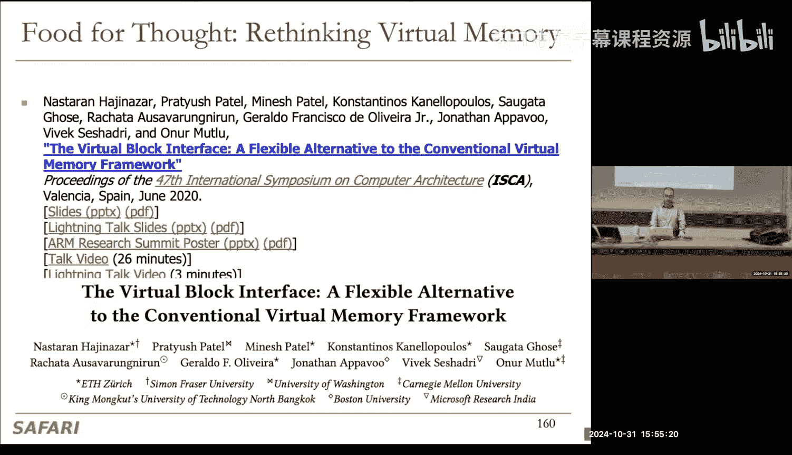

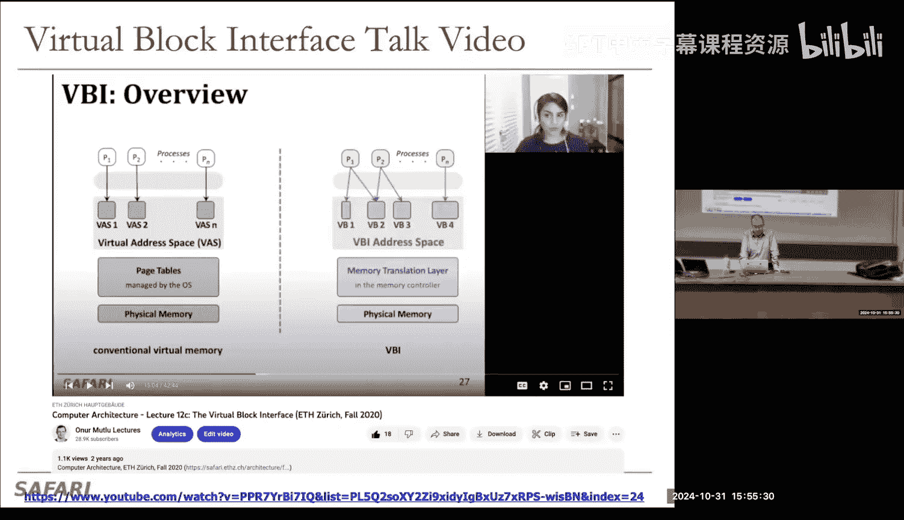

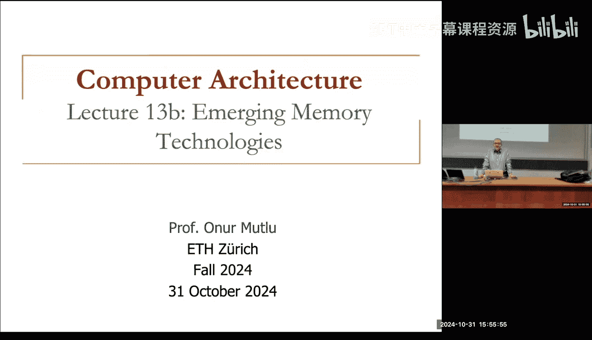

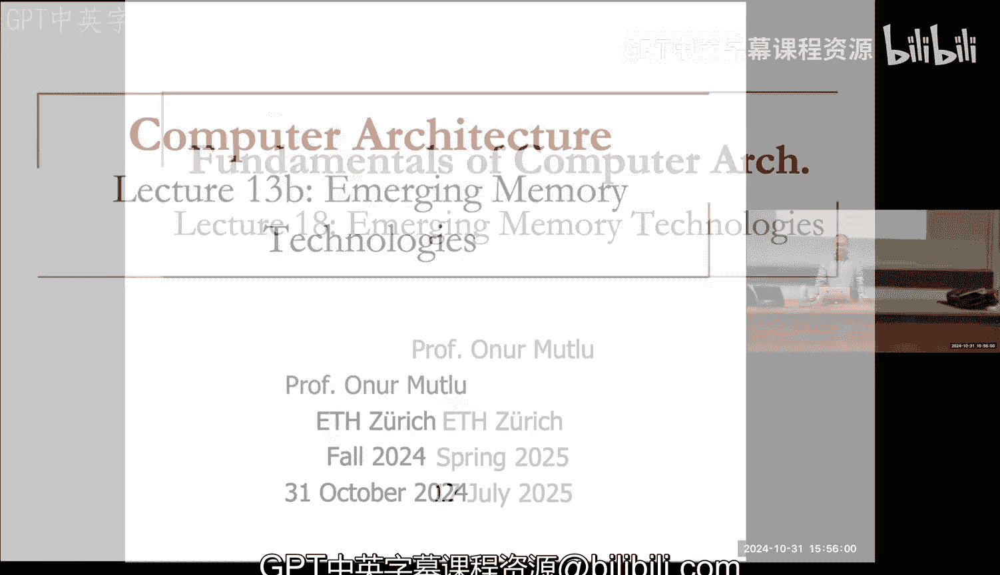

好的，那么明天见，玩得开心。