# ETHZ《计算机架构基础｜ETH Fundamentals of Computer Architecture 2025》中英字幕 p20 Lecture 19_ Genome Analysis (Spring 2025).zh_en -BV1Xc19BnET7_p20-

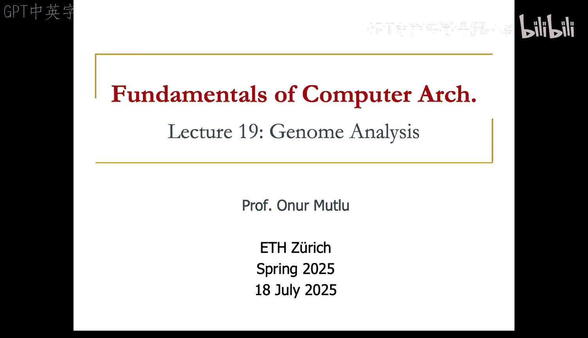

So with that let's get started first I want to introduce myself I am John I am a senior PhD student in the Sari research group and a lecturer at ETH Zic my research interests in the intersection between bioinformatics and computer architecture specifically I'm interested in designing algorithms architectures to enable real time analysis for genomic data and also designing algorithms for gen editing and error correction and so on you can get to know us of course and our research our group using these websites and contact me using these links over there so these slides are already available on the course page so what we're going to cover today is some basic introduction to genome analysis to genomics I'll give you some basic background and then I'll show you some step bystep how we platform or how we analyze genomic data and then will show you what are the state of the art algorithmic and hardware。

Acccation works for genomics and we'll briefly to touch on the future opportunities for analyzing the genomic data。

So we need faster scalable and acute genome analysis because it is important for many reasons。

 for example， it enables us to uncover and treat diseases that are linked to genomic variations it also enables us to alter the genomes directly to solve fundamental challenges of life。

 it enables us to detect the pathogens living among us so that we can take an early action for example for epicellions of disease outbreaks and of course there are many。

 many important applications based on the genomic analysis data。

 but then what is genome right so a genome is what enables us to have different traits so different perhaps eyecol。

 different phenotypes and so on， so the genome lose speaking especially at least for aarytic genomes is so these are the DNA's bunch of DNAs or the chromosomes that are located inside yourself cell。

In your nucleus and for human genome we have 23 in most cases we have 23 pairs of chromosomes and these chromosomes contain certain nucleotide letters that look like this right so when you convert the DNA into a digital form you'll see a bunch of ACT genes so the next question is essentially how large is a genome or maybe more specifically how large is is a human genome so what you're seeing here is one of the beautiful buildings in Zurich specifically located in orleon so this is Andrea's term so this is about 100 meters along so to give you some illustration on how large genome is so if you wanted to basically start from the beginning of the first chromosome and then write every letter on a4 page until you reach to the end of to the last chromosome for a single cell。

And then you pile up all these papers on top of each other。

 which you'll get basically a paper that is as high as basically is under as term and if you are curious。

 I did the mat here it checks out。

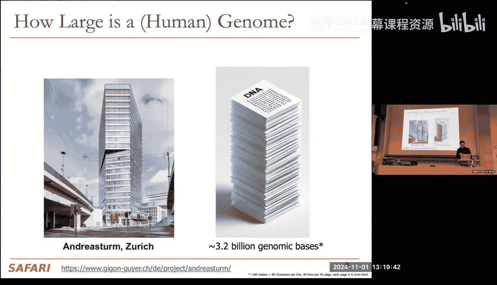

So since this is basically a very also important area that has many promising applications。

 people started looking at essentially the human genome and tried to decipher the human genome and this effort。

 although it started even a lot earlier， given the improvements in the technologies many scientists started to basically to recover the human genome starting from 1990s and then this took around 13 years and it cost it around 3 billion U dollars so that we could decipher 3 billion bases that we have in the human genome and this is of course very important because we can now look at the human genome and then see what makes us human and what makes us different than other living organisms and other individuals。

 but this first human genome， human efforts genome constructed was not fully complete although it took 13 years and billions of dollars。

So to generate it as a sequencing technologies， the machines that use to generate the genomic data as they improve and also as well as the algorithms improve。

 we could basically complete the gap that was previously in the initial version of the human reference genome we could complete that and so that we can finally have a nearcomp of the Sw reference genome and this was so let's say important such that these four individuals that were behind completing the Sw reference genome were selected as one of the most influential people of 2022。

So we've been talking about the human reference genome so let's take a little bit a closer look at the other species。

 so here what you're seeing is the illustration of a viral genome， it usually has around 5。

000 basis in its genome。When we move a little bit further， what we see is a bacteria。

 this is specifically E coli bacteria， and in its genome it has around 5 million bases。😊。

So when me move a little bit further， we have the mamalians specifically here the homocephiens which are humans which has around 3。

2 billion bases in one of the pairs of of their genome and essentially you might be seeing a trend here essentially as the genome size increases maybe the complexity or the intelligent increases but this is not specifically the case because as we move further what we see is basically an onion which has a lot larger genome than the humans and we even have larger genomes。

 so basically this tells us something which is the genomic data yeah God ahead that yes。你所过。

So this information is per cell， actually even more specifically this is per haptype。

 for example the homocephipiens， the mammals are deployed。

 meaning we have actually one pair of essentially two copies of chromosomes and then you just take the one copy and then look at a single cell this is the amount of the basis that you're going to see actually in total for two pairs it's around 6。

4 billion。But then the plant genomes are essentially a lot larger because they are not deployed。

 they are essentially polyoid， meaning they have actually multiple copies of the same chromosome。

 but here we're still looking at a single cell over there。

 given for your other question about whether it differs cell by cell， whos speaking。

 they don't differ much。😊，You hope that they don't differ actually much if they differ too much and this is likely that you're either copying something like for too much which may cause perhaps a cancer or you have a huge deletion basically。

 which is again which can be another problem so those speaking。

 all of the cells have around the same amount of basis。For the same species。

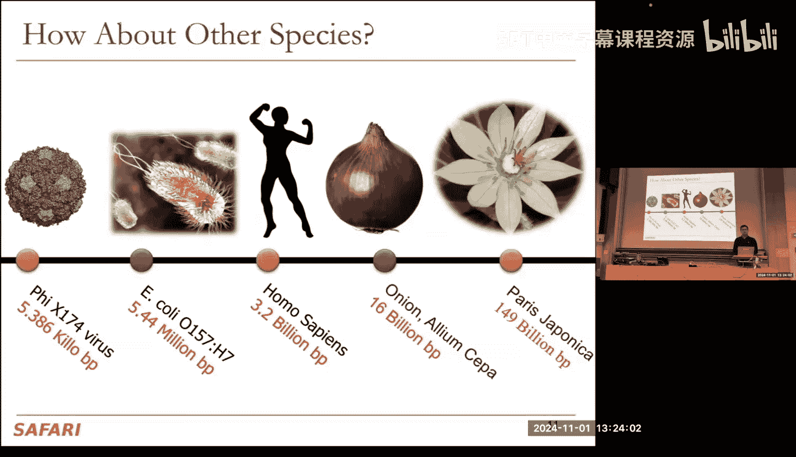

Okay， so let's move on then。And so basically DNA is usually referred as the blueprint of life right and the reason for that is because it is used in the later step to create the functionality and actually I like to use this although it is not perfectly accurate I like to use the analog of using source code and then building applications with it and this goes by essentially imagine your DNA is simply a source code DNA source code has useful parts but also it has useless parts maybe you have some comments or essentially some parts that will not be basically translated into a functional at later on so this is a similar case in DNA and this DNA is usually transcribed into RNA and this is similar to basically translating your source code to an assembly code so here the functional parts are taken out now you have the instructions over there。

So that you can then translate this RNA to protein so that it makes the functionality similar to how you execute basically these instructions on your microprocessor。

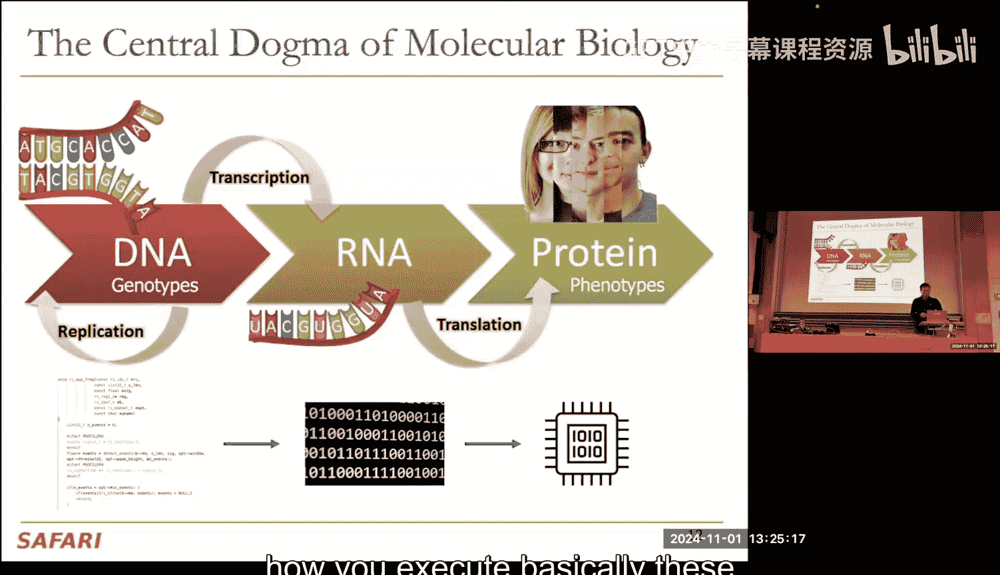

And we look at the DNA because as I said， it is important also to understand the functionalities and so on。

 but it also enables us to compare the individuals to each other so that we can identify whether there is a particular DNA portion that makes us more prone to have a particular disease。

 and this is usually for as genomewide association study。

 so usually what you have you have a control group， maybe people with a particular symptom。

 for example， a heart disease and you have your control group without a certain symptom and your cases with a certain symptom maybe with heart disease and what you do is essentially you compare the genomes of these individuals and then try to find whether there is a particular variation that we consistent to see in our case group。

But not in our control group so that we can link this particular mutation to， for example。

 having a particular disease right so if you consistently to see， for example。

 a particular mutation or single nucleotide polymorphism or called SNP in this particular group we can say oh maybe when you have this cNp over there you're going to likely to have a heart disease so this is a statistical analysis that you may be doing。

And what you can do you can get your genome sequenced and there are these open databases out there so you can already identify your SNPs and then you can query your SNPse in these databases to see whether these SNPse or these mutations mean anything right so you can check them out from these websites so as we also covered earlier there are also of course much larger variations or structural variations that cause even more serious perhaps diseases or other symptoms。

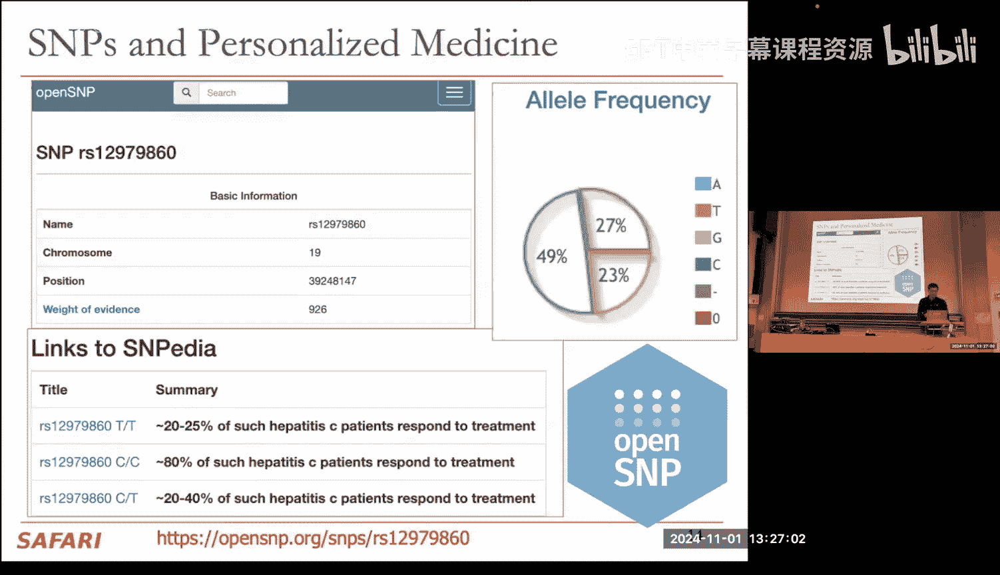

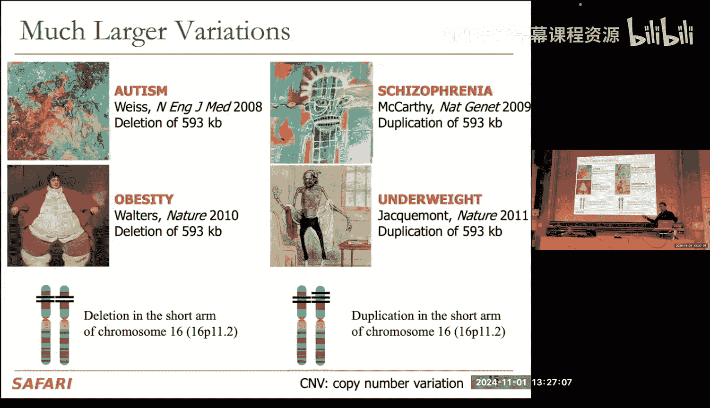

And essentially the applications are I would say are only limited by our imagination so it's not just about linking the diseases to each other so one application that I'm really interested is the genome editing today what we can do is we can pinpoint a particular region in your genome and we can perhaps alter that content in the genome so that perhaps maybe you dis to functional in your genome that makes you prone to a certain type of cancer right and of course this is very an important discovery and the people were behind this idea which is essentially showing that we can program this genome editing and then almost target anywhere in the genome to alter its content so this was awarded by the novelbel prize to these two individuals we also want to do large scale analysis right so we don't really necessarily look at a single individual we want to analyze maybe。

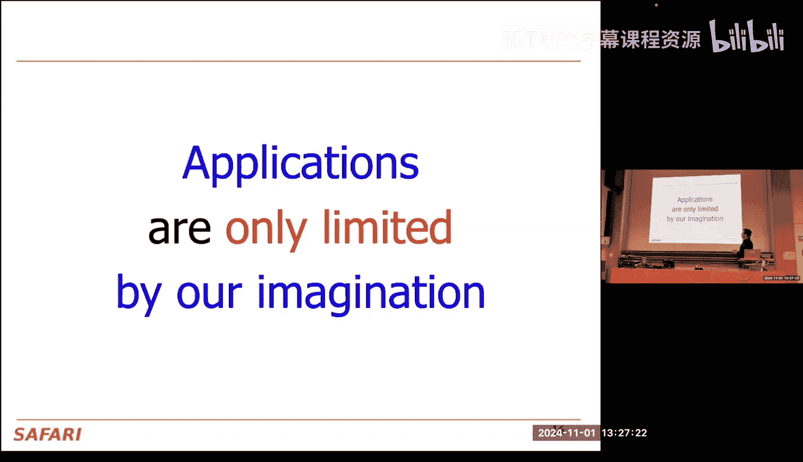

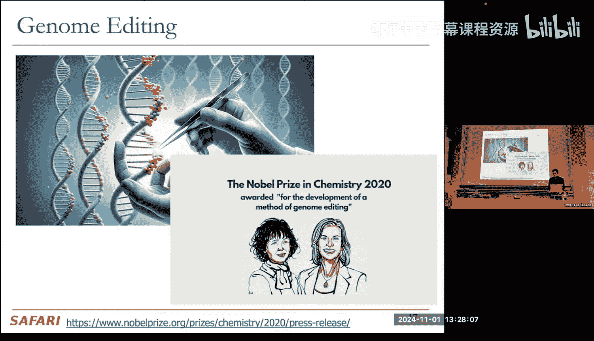

The entire population quickly， so doing the genome analysis in a large scale is also very important。

😊，The genome analysis is also used for the rapid surveillance of disease outbreaks， for example。

 it was used to identify the Zika virus spread， also used for COVID and also the Ebola surveillance and so on。

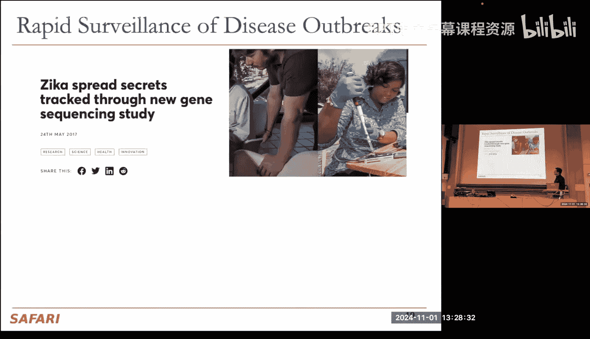

Genome sequencing is also used for testing purposes there are papers that show how to do that and also we can perform in field portable genome analysis so imagine you attach your drone with a sequencer and then you let the drone run in a field and then it does the analysis for you maybe in an agricultural environment it continuously to checks whether that farm is now contaminated with something dangerous so that you can take an early action。

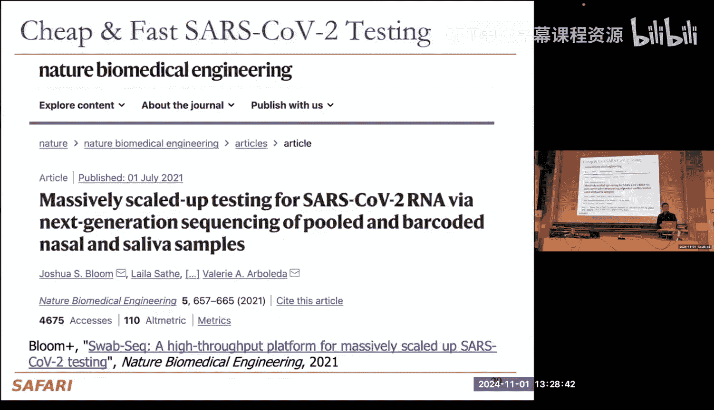

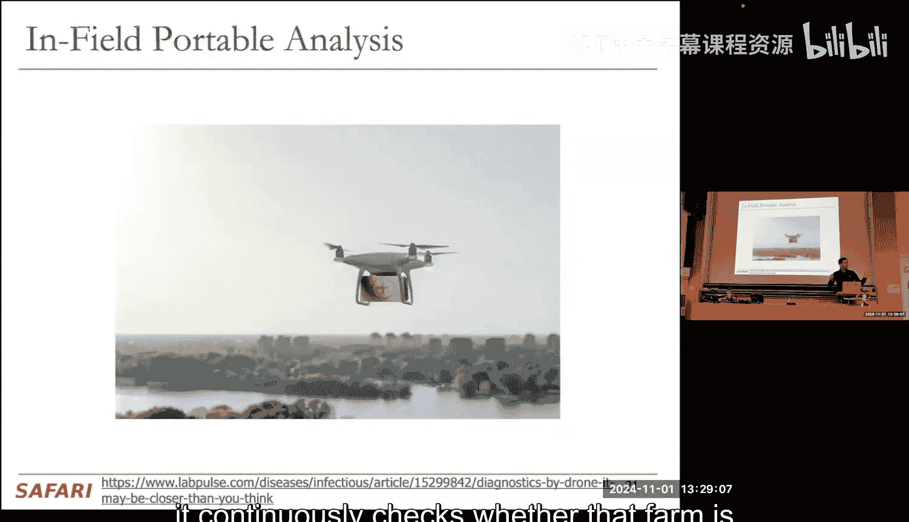

And of course， we want to do also the genome sequencing analysis and challenging environment。

 maybe in even the outer space to see basically how certain organisms behave in the outer space。

 maybe even in March there are papers discussing this。诶。

Of course DNA is also a very valuable asset to protect right this is a very sensitive information。

 very sensitive data and this has become actually more important very recently because I'm not sure if you heard of it。

 but there was this relatively recently actually this happened last year in 223 where people would usually sent their genomic sample to this company that is called 23 and me。

 I'm not sure if they are under now or they are still surviving， but this was a huge leak。

 but then what happened what was happening is that when you sent your sample they would be analyzing your genome and then would be giving you some insights right？

But essentially parent that they were keeping the data about you and this data got leaked so certain individuals now essentially have the very sensitive data of many individuals many many people and this is essentially very important because so genomic data is very important right and one example of how can be used。

 how this can be used against you is imagine you want to get and health insurance and then somehow your estimate is much higher than what you expected so you don't understand or you don't know why your estimate is higher but perhaps。

The insurance company who secret has the data about you maybe knows why and that's why maybe they are giving you that code that you cannot understand why so this is basically one example of how this can be used in a hostile way right and you don't want people to use it for such reasons。

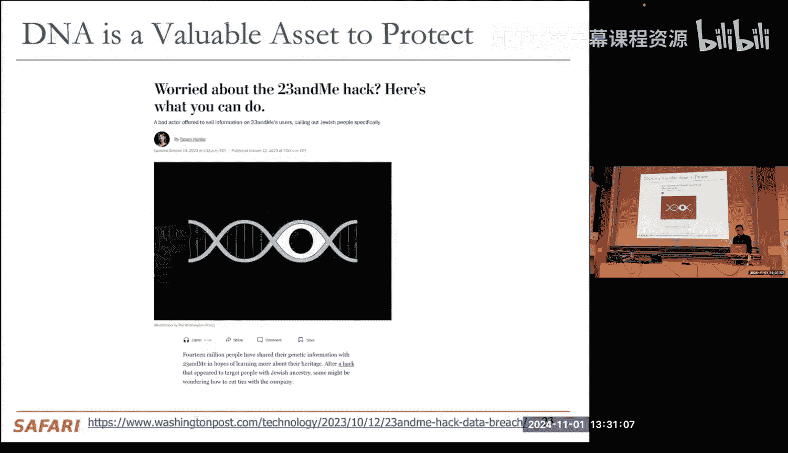

Another application is you can also shop with your DNA so imagine you go into a grocery and then you're not sure whether you're allergic to a certain product。

 so what you do perhaps you read the barcode of the product and then send it to the company that about you knows about your genomic data and it can quickly tell you whether you're allergic to it or not right so you can quickly get some answers about the product and about you and whether you really need to buy it or even maybe more insight so you can see basically how this information can be used in the data life。

Furthermore， people also use DNA to do the computation， so for example。

 we can now solve heart problems， even traveling salesman problem by using the DNA and how people do it is essentially they encode the DNA in a way that this DNA will make the connection only if there's a certain path in the graph and then what you do you just let the DNA do its natural job it makes the connections and so on and after some time since this is a huge massively parallel。

 the computation， the compute unit， let's say after some time if there's such a path in your graph it will essentially do the DNA connection and then you can sequence and and see whether you have that answer or not so you can do the computation even with the DNA now。

So as I said the applications are limitless and even maybe there are more applications that we cannot think of now so the other question is how where to enable this fast accurate cheap and scalable genome analysis right and today what we usually do is that we have these special purpose machines that the use for data generation specifically to generate the genomic data so they are essentially very fast because they are designed to generate the data at a very fast rate but essentially what we're doing is we're trying to analyze this data using these general purpose machines for data analysis so this machine as you can see it is pretty scared because it is slow and it is scared because it doesn't know how to analyze this data in the best way right so that's why the data generation speed and it the analysis needs do not necessarily always match with the hardware that we're use。

😊。

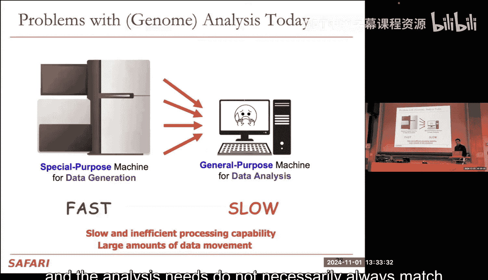

Underneath it。And to resolve this problem， we're looking at essentially different architectures and constantly asking question。

 given this particular data type and given the requirements of the application。

 what sort of architecture or sets of architectures we should use right so this can be GPUs or SSDs or inmem computation and so on that basically the devices and architectures that we've been covering so far in this course。

😊。

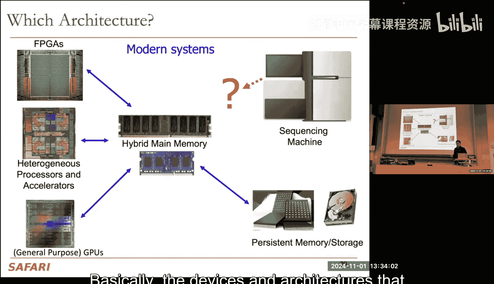

And even maybe mobile solutions that you can connect this genome sequencer into your mobile phone and perform then us。

 so this means that it needs to be also an energy efficient computation and of course they achieve this as you've probably seen this figure so many times we need to look at basically the entire stack of computer architecture to co-design the algorithm architecture and software altogether。

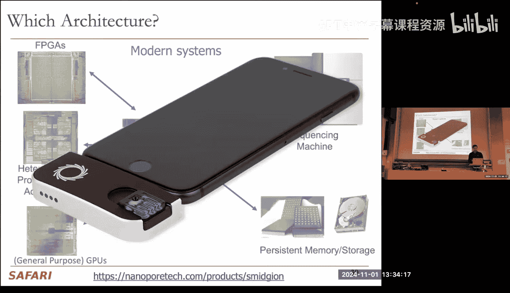

So if you are interested in learning more on how we essentially accelerate the genome analysis。

 you can take a look at this paper， this is a review paper。

 the im review paper that was presented last year and published and presented last year at Tech。

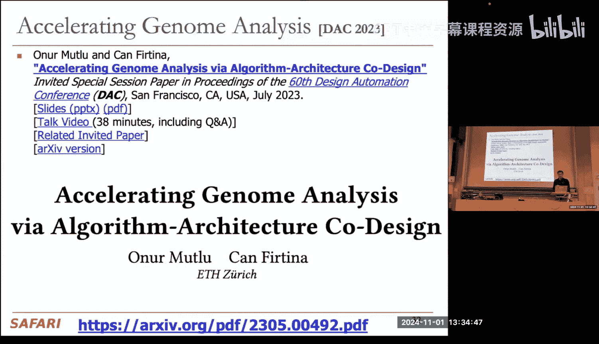

This is also another work that shows how we what are basically the current efforts to exc genome analysis so now I'll quickly cover some step by step analysis of the genomic data so in high level we usually start with the sample collection so this can be your plot or or your tissue or basically any particle cell that might be coming from an organism and then we sort of prepare it so that the library that we prepare that contains your genomic data can speak to the machine which is the genome sequencing machine。

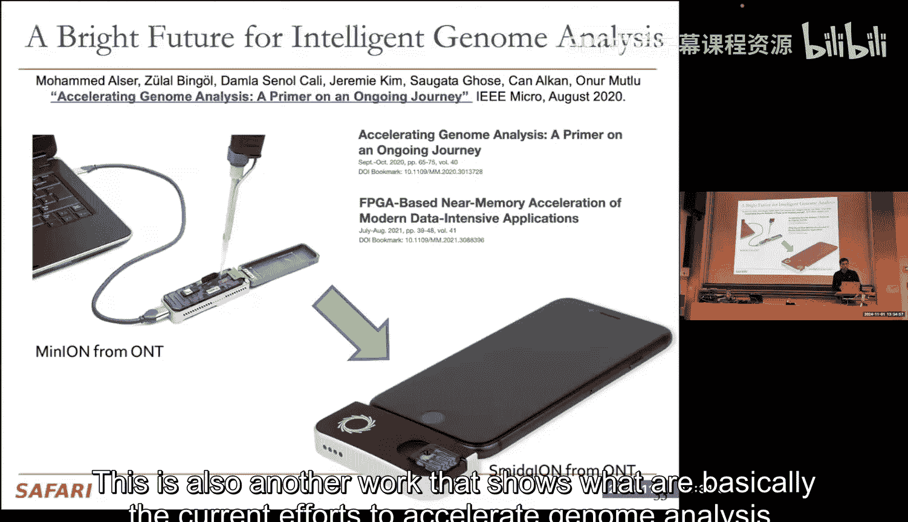

And then this genome sequencing machine generates initially the raw sequencing data。

Then we use this slow sequencing data to do the analysis。

 so here most of the computational steps essentially are here and we're mostly interested in these parts。

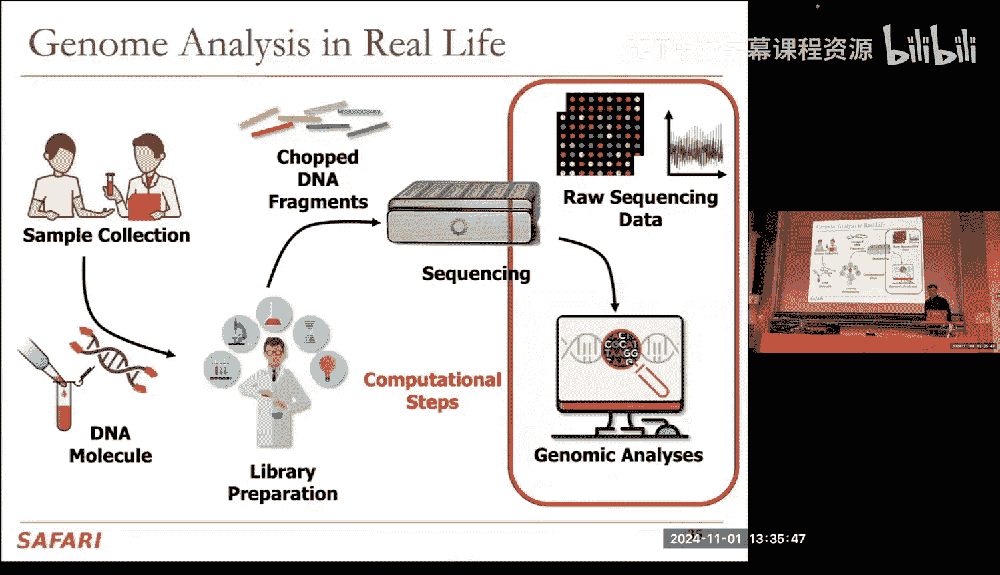

And the common genome analysis pipeline includes multiple steps。

 and this starts with the genomic data generation。So what we initially have is essentially a biological molecule which is maybe your DNA or RNA。

 which is not human readable right so we need to somehow convert this biological molecule into a human readable form and to do so we use these machines that are called highter sequencing machines that essentially generates fragments from this biological molecule and then converts them into the sequences of necleotides that we call reads。

There are certain challenges to this data analysis。

 one challenge is now once we convert this into digital form。

 their origins are lost so we don't know where they are coming from now in your genome。

The second challenge is these sequences may contain some variations or errors。

 so you need to deal with them。The third challenge is there is essentially a large volume of this data that we need to analyze and compare it against a large space of the reference genome。

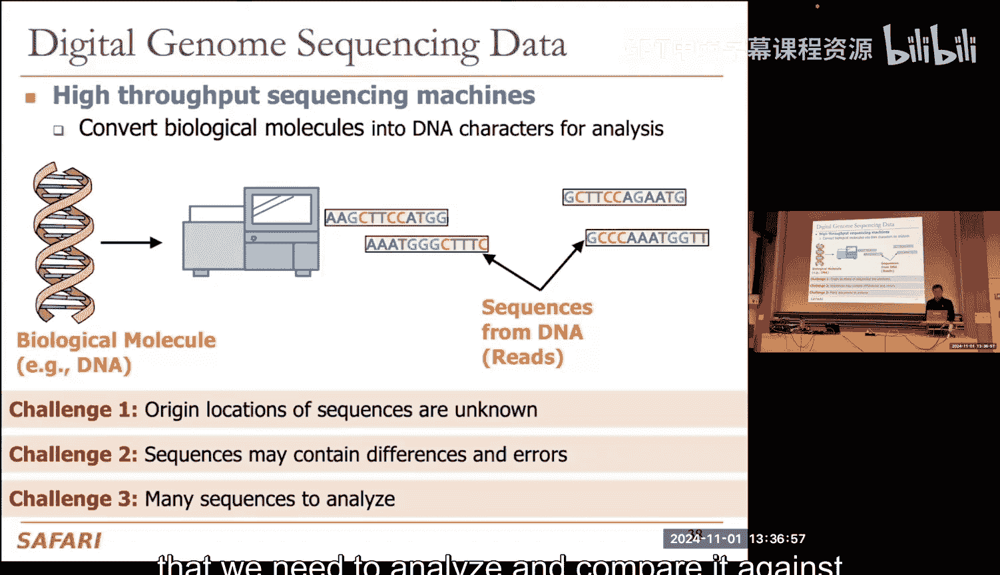

There are many sequencing technologies that we can use to generate this genomic data。

 and each of them， depending on the technology that they use underneath。

 they generate essentially different types of row sequencing data。

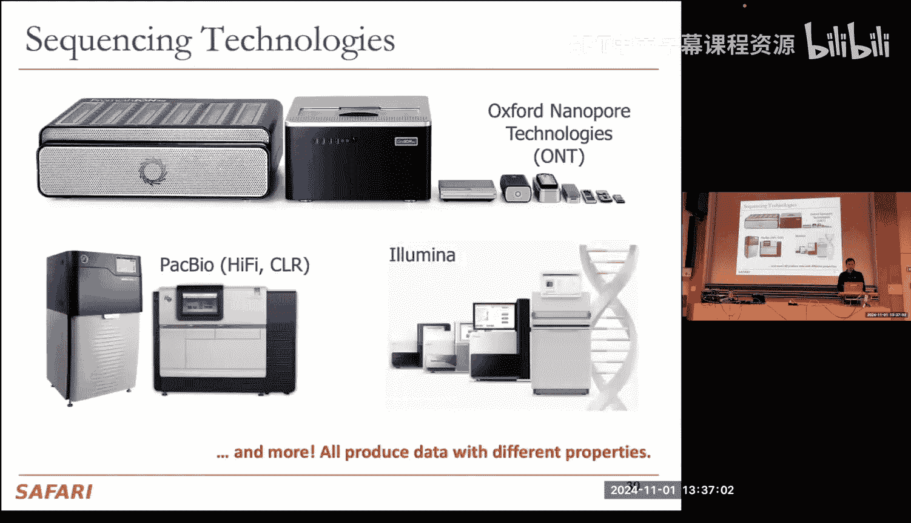

And we look at essentially these newverse sequencing technologies and the opportunities related to them and I'll basically mainly focus on one particular sequencing technology that is nonpo sequencing technology because we're essentially interested in this direction as you'll see in the coming slides so this is in high level this is how nonpo sequencing work so here you have this mini device a very small device that is called a mini mean and sequenceer and this can literally fit in the palm of your head so this is a small device and inside this there is this flow cell that is the consumable that you buy generate or sequencing data it has some essentially asics and sensor so that it can convert the raw data or the analog data to the digital format but in the very low level what it has is these。

Bunch of tiny pores that we call nanopos and these nanonopos are actually the little devices that perform the sequencing and as output it will generate the electrical signal data so but of course this is the current state of this nanopore sequencing technology so we can now fit this entire and large scale sequenced into a very small device but it didn't start with this initially so it started with an idea in the 19 adss by David Dimer and the idea was essentially can we create a three- layer solution or let's say even to make it even sim5 can we create a two layer solution here maybe one layer is charged with particular ions and the other one is charged with the other type of ions for example here this part might be positively charged and this part might be negatively charged。

So David was thinking about this idea because probably he would know that the DNA is also negatively charged and the question was can we essentially move this DNA from one region to another region while we have a current flow between these two regions and can the movement of this DNA disrupt the ionic current flow and would this ionoc current disruption be informative for us so that we can tell each phase each nucleotide in the DNA so this was the idea right so we want to look at ionic current disruptions and then based on these disruptions we want to tell that each phase in the DNA so in terms of idea it is be what it didn't work well back then and the reason for that was when you put the DNA over here and then you create the electrical charges according to for example。

 this part negative。And they charge and this part is supposedly charged and then you want to let the DNA run from here through here。

It essentially was moving too fast。So you could not basically you did not have the technology。

 the sampling technology to sample the ionic current disruption for every base that is moving inside this narrow area。

 so there were two challenges one， we needed to slow down this DNA somehow and we needed to basically improve the technology so that we can increase our sampling rate。

 so as the time moved on， of course this technology improved and we could now essentially sequence every base。

 not just once on average actually 10 times so that we generate electrical signals 10 times for every nuclear type to increase your confidence。

😊。

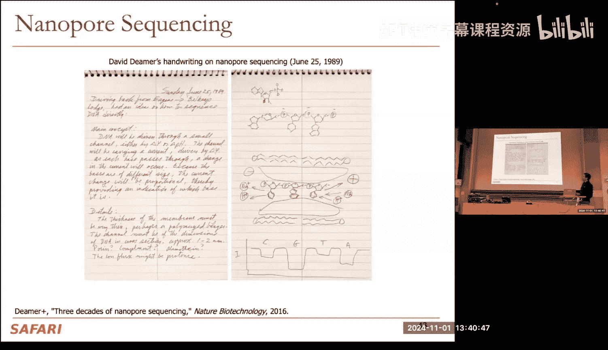

So this is nanooppo sequencing and due to its essentially benefits。

 it's a widely used sequencing technology， it can produce long fragments of DNA up to4 million genomic basis it is portable so you can carry it around and use it if you want it is relatively cost effective and it provides some more unique features that I'll cover next so this is basically how a portable nanopo sequencer looks and inside that there are thousands maybe a few hundreds to thousands of pores tiny pores and each of them is essentially contains a three layer solution as I explained earlier right so we have negatively charged region per the charged region and in the middle we have a membrane by this nanonopo is attached and what is happening is that this motor protein which was essentially very essential to slow down the speed of this DNA it initially attaches to the DNA and then it guides it towards this nanooppore。

😊。

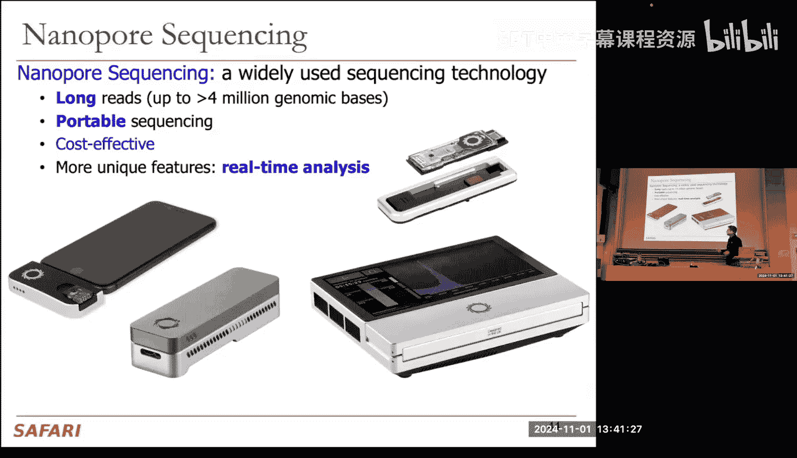

Once this attachment happens， what happens is that this DNA literally it first performs a essentially double strand break and then a single strand is now moving from one region to another region and as it moves through it generates electrical signals。

 we measure the ionic current changes or disruptions and these electrical signals are generated at a certain triple and what we can do is that as this raw signal electrical signals generated。

 we can start analyzing these electrical signals， even we can perform realtime analysis。

 meaning we can start analyzing them instantly as they are generated。😊，And furthermore。

 we can even take some make some realtime decisions， for example。

 based on our real-time analysis we may realize that whatever we're sequencing now is not useful for us。

 so we can tell the sequeer to stop sequencing that particular read and so that it can move on to another DNA so that we can utilize these consumables even better。

 so there are two main benefits to real-time analysis to summarize one is it will stop sequencing it will reduce your sequencing time and cost。

 but the second it will enable you to overlap the sequencing time the analysis time with sequencing so that you can reduce the latency。

😊。

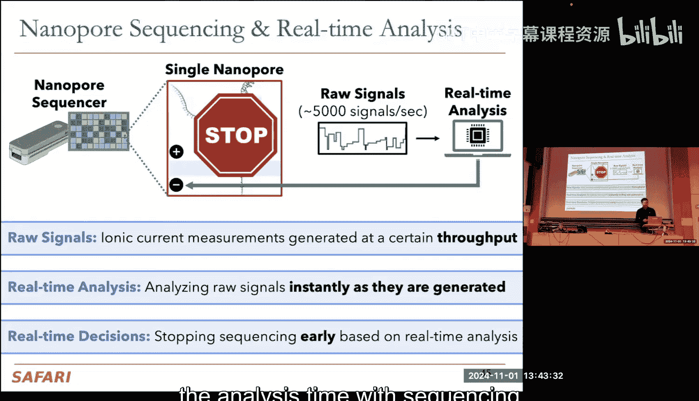

So this is essentially how we generate the genomic data。

 but initially what we have is a row sequencing data so what we need to do we either translate this raw sequencing data into the nucleotides in a human readable form this is called base called sequencing data using for example some neural networks or we can somehow process this data by reducing the noise inside it and then perform analysis directly without base calling so these are two traditional approaches one we translate and then we have AGCs and then we performform our analysis so this is usually more accurate because the translation removes almost all the noises in the electrical signal and there are of course many tools that were developed that uses this space called sequencing data but this translation process is very costly and it requires the use of power hungry devices such as GPSUs there are more recent。

that aim to directly analysis raw sequeing data without the translation step。

 so they provide efficient analysis with better scalability and portability and also raw signals retain more information than just individual basis for example。

 you can infer the chemical structure of the DNA also from the electrical signal so then the question is need do we need a translator to analyze the genomic data。

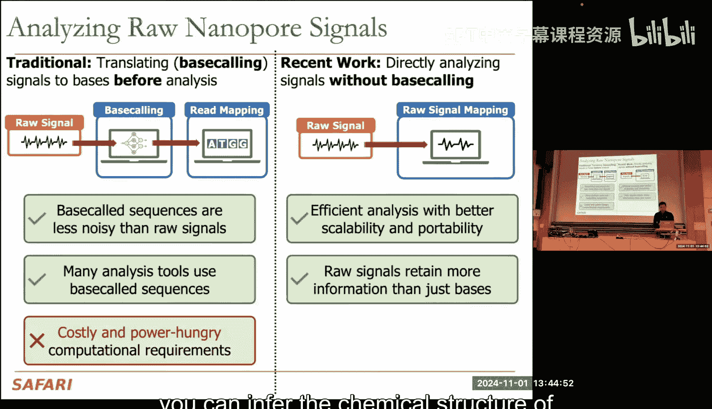

And the answer for now is it depends on the application。

 but what you can do is you can process the electrical signal such that you recognize somehow the passing of nucleotides somehow by identifying the abrupt changes in the signal so that you can assign or use the values that corresponds to sequencing of a certain DNA and then perform the analysis using these values。

 so we are interested in this direction and we essentially publish several works towards this direction for example this work enables the analysis of raw sequencing data in real time without translation this is a subsequent work that improves its accuracy and performance we also want to identify the mutations in raw sequencing data without even base calling so this means that we need to somehow align individual signals to our reference genome so this is。

What role line does so it performs the alignment so that we can identify the mutation in the raw sequencing data without base calling。

We also look at how we can make the base calling part more efficient， more accurate。

 so this is a framework that discusses many opportunities and optimization techniques to reduce the complexity of your deep neural networks that are mainly used in the base calling works so we also look at how we can perform。

Base calling using in memoryory or using memory computation， as I said。

 the base calling heavily uses neural models， so this means that you have a bunch of。

 for example multiply and accumulate operations so what you can do is you can rely on certain lot computations to perform these multiplications and accumulations and then so that you can do your neural net computations and perform the base calling so this reduces the latency and also improves reduces the energy consumption by doing the computation in memory。

There are also some errors in the sequencing data， so we use machine learning techniques to understand and correct these errors。

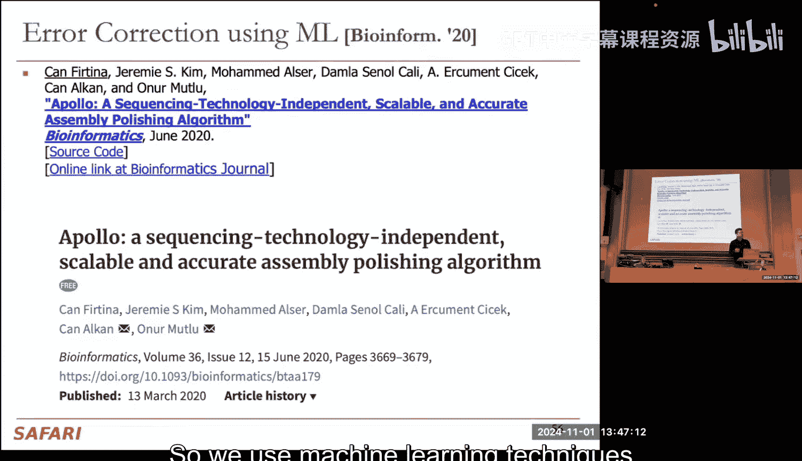

So this is basically how you prepare， let's say this sequencing data so that we can analyze it in the later step to identify the origin of sequencing data and also to identify certain mutations and variation so we do this in a step that is called read mapping mainly the aim of read mapping is to solve life's puzzle from the sequencing output and we do this by comparing the sequences to each other in a practical way and we need to do this quickly and accurately because otherwise it would not be practical given given the large space of genomic data so I like to use the puzzle analogy over here so I assume that your biological sequences your reads your DNA are maybe the pieces of a puzzle right so initially we don't know where each piece belongs to so what you can do for example you can compare these sequence。

to each other so that you have some sort of an idea what this particular genome looks like by comparinging them to each other or you may have a template that we call reference genome as it also so happens in the puzzle solving case you have a picture that you look at and then see try to identify whether this region is belongs to here or somewhere somewhere else right so this is how you would use the reference genome but the idea is essentially to have an understanding of where these sequences are coming from and what are they exact differences to each other and this is essential to understand the functionality of a sequence because it enables us to identify the mutations diseases and so。

So if you want to look more closely on how we perform the mapping or the puzzle solving of the reads so this is how the DNA logically looks like this is how physically it looks like but initially what we have is these bunch of reads and our goal is to given this difference genome is to identify where these where each of these pieces are coming from and also identify the exact alignment exact changes compared to those regions so this is basically called read mapping and doing this practically is important because these reads are usually very short and you have millions of them and then you want to for example look at the human genome that includes three billion characters so you can imagine the size of the problem or you don't even have to imagine you can take a look at this illustration and then assume you want to do the mapping of a read to reference genome this is a single。

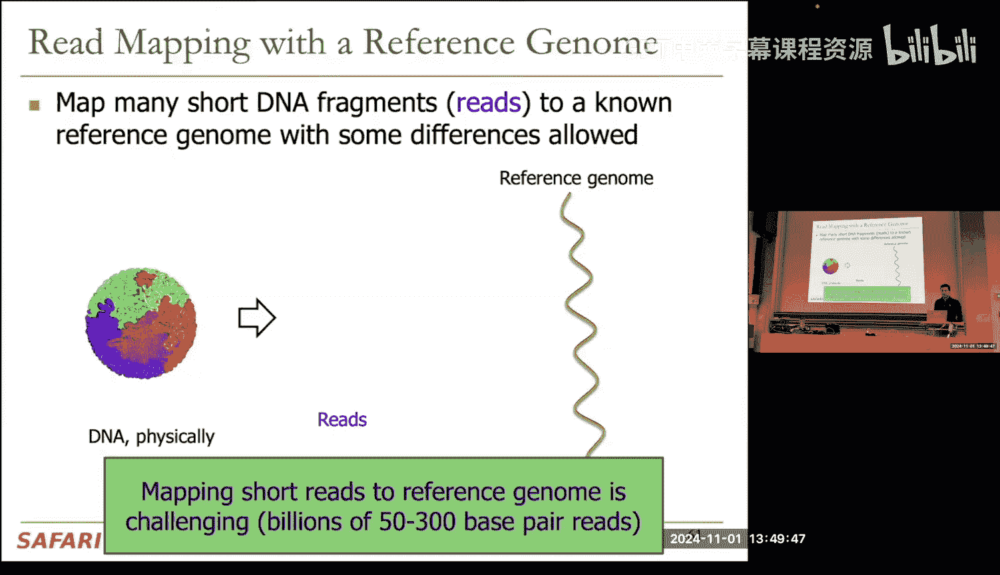

Read to a reference genome in a naive way meaning you perform your approximate matching algorithm for every base of a read to every base starting starting at every base in the reference genome so if you do this basically this is a long process it requires a large number of approximate matching computations which eventually is not basically very practical to do so so somehow we need to reduce this complexity and then we do it basically by relying on some heuristics and also data structures to perform this similar identification in a practical way so imagine we have this reference genome so this can be huge right maybe trivialing characters and then you have your read so what we initially do is that we store certain subsequences from a reference genome inside a data structure that we call hash table or we refer to it as index as well where when you see a certain。

Subsequence you store it as a key in the hash table and then you store its position as a value。

 so meaning when you query this hash table with a a subsequent。

 what you'll get as an answer is list of positions where this subsequent appear in the reference genome or if it doesn't appear you'll get a no response。

So if we use the s table so that sorry yeah this is what I just described。

 we use the has table so that we can also extract some subsequents from the readT and then quickly query these reads using the s table so that we can identify some potential similar regions between a readT and the reference genome。

😊，Then we will eventually have some multiple candidate regions。

 some regions that we think that this street might be coming from， but most of them will be false。

 so to identify these false regions we can also perform some filtering or some other algorithms that are known as chaining so that we can remove some false matches then lastly we perform our approximate matching or the alignment step which is a costly step but our goal is to reduce the execution of this as much as possible after seeding and filtering then we perform this alignment so that we can identify the exact matches and exact differences between the street and the reference genome at the position where we think that the street belongs to so this is basically the steps in read mapping to make the sequence comparison practical。

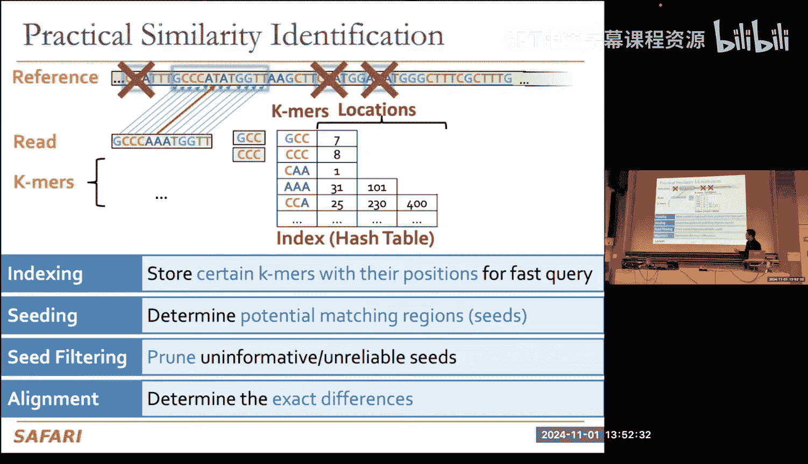

We look at essentially how we can perform this seed matching or subsequent matching accurate to basically improve accuracy and the performance of free mapping so if you're interested in this direction you can take a look at this paper but eventually what we see is that the dynamic programming computation inside the read mapping which mainly is used in alignment and chain consists of almost the entire execution time of free mapping so the rest of the steps for example the seeding the filtering and so on they are not essentially causing a huge computation overhead but the DP computations。

So maybe one could look at how we can accelerate these steps but second question is do we really need to rely on also a single go ahead？

F。对对。That you then show up。Nooppore sequencer does not give you a fixed length read so the length of them will vary a lot and I would say theoretically there is no limitation to the read length that the nanonopore sequencing could sequence but due to the imperfections in the library preparation step。

 for example， even you shake your library orbit some of the DNAs will get fragmented very quickly so it will break them off so due to these imperfections and of course as the DNA gets longer there is a higher chance that it will get tangled。

 so if you disregards all of these imperfections theoretically in the theoretical side there is no limit to the read length that nanonopo sequencer can read to。

She。So this is a good question because。It depends on the application。And also。

 it depends on the genome that you're using。 for example。

 if your goal is to identify the exact position of the read。

Usually those subs are off length 16 to 21， 22 and so on。

 so there are some theoretical works behind it that shows like why this is a good number。

But if your goal is to identify whether this re is coming from a particular genome。

 particular organism， you're not looking at basically what is its exact location。

 but whether it belongs to a certain genome， then you can increase that subsequent length a little bit more。

 maybe up to 50 to 60 basis。To think that's larger than if you just want to detect。

Given if you're the amount of informational level of information you want to get is coars， let's say。

 so that you can tolerate maybe some caveats。That is caused due to the exact matching of these subequences right。

 but then maybe in some other region like maybe you have a pool of reads， maybe you have 1003s。

 but maybe it's just enough for you just matches like one of them matches and then you identify。

Are there more questions？Okay， and let's move on。So the question was。

Do we really need to use also a single difference genome right so this is what we showed earlier。

 this is maybe the image that you're looking at， you're taking a clue at and these are the pieces。

 these are the fragments from your genomic data and data lengths are different given the technology and so on。

So by looking at a single reference genome， what we do is we recover the origin locations right by looking at a single one of them。

 but the problem is if your organism or if you're sample that you're looking at is somewhat relatively too different then the reference genome that you're relying on。

😊，And this means that maybe these can be due to certain huge variations。

 maybe there are some structural variations that you cannot recover and this means that you'll only map a few of these pieces and you'll missm some of the other pieces that are two different than the reference genome that you're looking at so this is called the reference bias right so you're looking at one image and then you see that oh this is too different or maybe then these pieces are not coming from this organism。

 but this is not necessarily true these reference genomes not represent the entire humanity but it's only a collection of certain individual。

So the idea like one solution to it okay let's not use one reference genome then let's use multiple of them but this is not also very clever right because then this means that you're scaling your problem and times verse maybe you're increasing your run time also n times if you use n mini reference genomes so what is an idea then the idea is to use graphs and inside behind it in most cases for most regions the organisms from the same species they will be highly similar to each other so they'll only differ at particular locations so then this means that you can eliminate this redundancy you can store this efficiently store this redundancy using a graph structure right and you can still have let's say edges and nodes for the regions where maybe individuals tend to differ so this is basically the idea behind using a graph。

to represent the reference genomes and this is essentially a recent approach that the field is moving towards to and we're also interested in these directions and this is essentially how the genome graph would look like to represent many different variations that a single reference genome cannot represent。

😊。

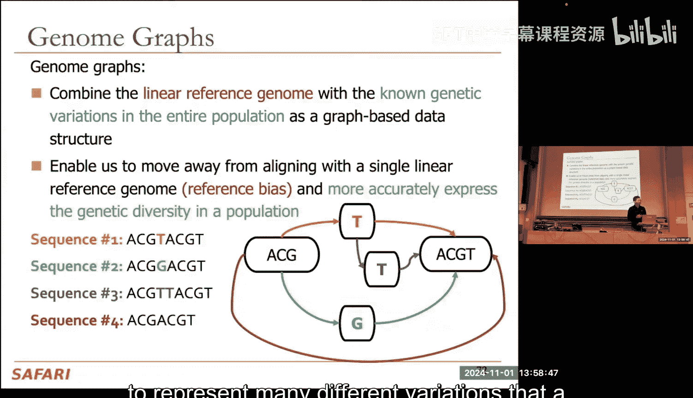

So this is the read mapping step so the last is to utilize this information that we generate from the read mapping step which could be maybe the positions that you identify maybe the alignment information you identify and then somehow use it in a useful manner so there are many useful cases maybe you can identify similarities between these so that you can re constructstruct the genome you may want to look at you may want to pile up basically these read to each other and then take a consensus of the alignment information to identify the variations or you may want to identify the presence of the genomes in your sample so that maybe you can take an action according to so this is called metagenomics the goal of metagenomics is to identify the organisms that you have in your sample which are unknown initially so these are a bunch of DNA。

You don't know where they are coming from and there are many steps to perform genome analysis one is you extract the cameras from the reads。

Then what you do is so what you do is you use these large databases that contain the information from many species instead of maybe a single reference genome and then you try to find basically the matching cameras between this database and the re that are coming from your sample and then once you have these matching subences as you also ask earlier what you can do is that maybe you can confident to say if this particular k is matching to a certain region certain genome。

 you are very confident that this must be coming from that organism so by doing so you can count perhaps take the relative abundance estimation of each organisms in your sample and then you try to see whether you have a bunch of bacteria。

 viral genomes or harmful pathogens growing in your sample。

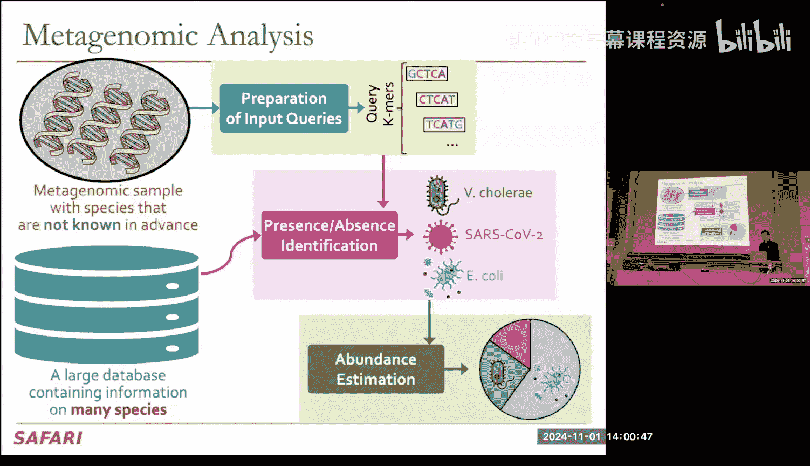

So I think this is a good time to take a break， so in the second half or almost the second half of this lecture。

I will go slowly。Because I realize that actually I've been going a little bit fast assuming that I wouldn't be able to finish all the content on time。

 but hopefully we'll be able to do it so you welcome everyone we're going to go slower。😊，Okay。

 so in the almost second half， relative the second half of the lecture。

 we're going to cover the algorithmic and hardware acceleration works for accelerating genome analysis。

😊，But before that， we need to understand that there are significant barriers to achieve fast and efficient genome analysis。

And one reason， one big reason is there is a significant performance gap between the data generation and data processing as we covered before。

 and when we look at basically the throughput at each step。

 starting from the data generation where you sequence the data and you generate your data and then starting from the translation step。

 you move further in the genome analysis pipeline， you perform your read mapping and maybe variant calling。

So when you look at basically the throughput at each step。

 you'll see what you'll see there is a huge imbalance between steps and this is because。😊。

Each step doesn't necessarily know what the prior or the next step is doing。

 so you don't necessarily pipeline them really well。

 or some steps really require you to fully finish the prior step so that you can start processing or performing the analysis in the later step。

 so there is basically not a clear solution to streamline this nicely starting around the data generation up until you get the answer that you want to get from the genome analysis。

And yes， so we show this slide before one big reason is there's a huge mismatch between the data generator and the machine that they're using to analyze this data。

The second， the other major issue that we're seeing is the data moments are expensive that probably you already know from the previous lectures。

 but the second we have many of them in genome analysis so when you start from the sequencing machine remember we're generating a large volume of data that you need to analyze and this data needs to usually needs to sit at the SSD at the disk and then it used to move through the main memory on your processor and so on and so forth so this means that you're making lots of data moment and probably as you've seen this slide before the cost of data moment is much higher than doing simple operations in terms of the energy and the latency。

So this means that there's a huge latency and the energy waste that is caused by this data moment and one big reason is because the data analysis performed far away from the data。

😊，And to solve this， we need to orchestrate algorithms and architecture well so that we can handle the data and its computational well。

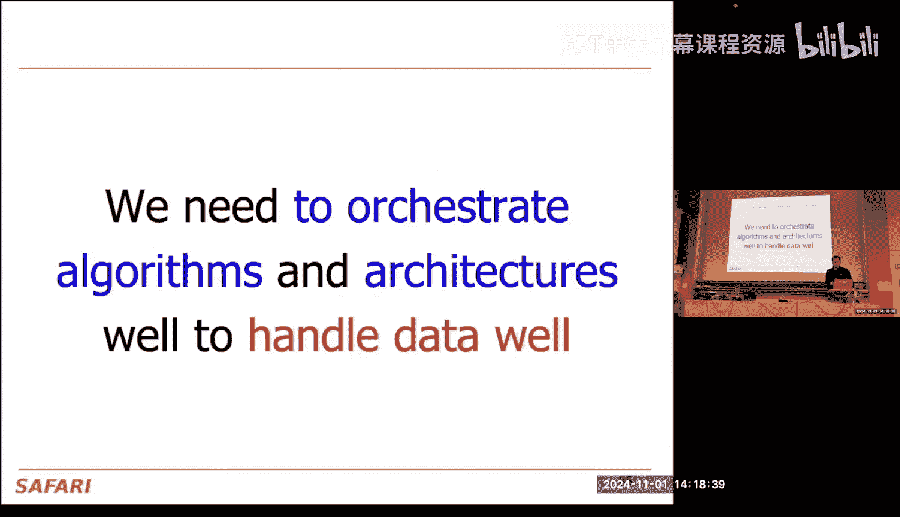

So in general， if you are interested in this direction， of course。

 you can take a look at these materials that we make available on YouTube so the links are already on the slides so you can take a look at them。

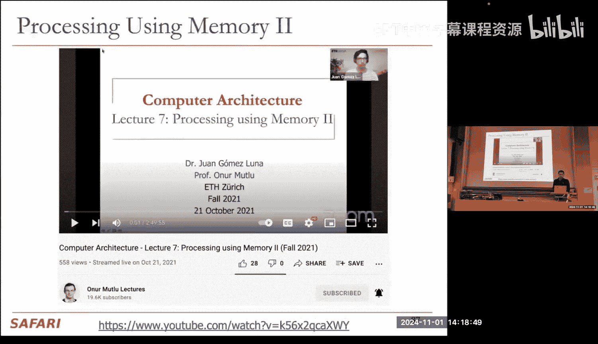

But to illustrate this on the genomic scale， I'll talk about this recent work from our group。

 which is JamPP， which mainly focuses on the two steps in genome analysis and aims to reduce the data moment or。

So as we covered before， this is particularly how the nanonopo sequencing looks like right so we have this nanonopore。

 we generate the electrical signals。😊，These you'll have a bunch of electrical signals from many。

 many res that you're sequencing。And what you do you store this raw sequencing data。

 this is electrical signal， this is not necessarily in a compressed form。

 it essentially contains a larger amount of information than individual basis。

But then next what you do， you move this data to do some computation specifically to translate these electrical signals into ACTGs using closelyly complex operations maybe deep neural networks。

 so this is basically steps by step what you do so that you can translate these electrical signals into the base called sequences。

 but then you store that。And then next you do another computation， you check， oh。

 this one is less accurate， you take a look at the accuracy scores。

 the quality scores that the base calling is giving you so that you can prune some of the data that may reduce your accuracy。

 not necessarily impact your performance， but also more importantly reduce your accuracy。

So you prune some of those and you'll continue with the remaining ones。

To do youll essentially store them again。And then you'll do further computation maybe read mappingping right so you'll look at reference genome and then see whether the re is un mapped or mapped and so on。

 this is also a costly process and it also includes bunch of data structures that we covered before。

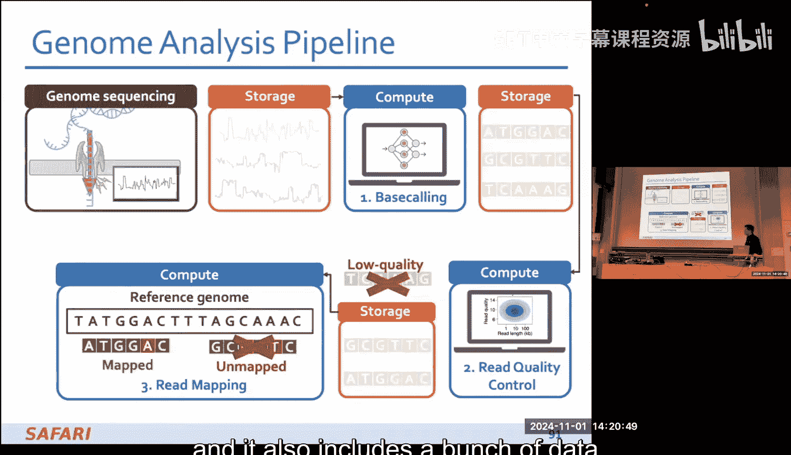

就。What I'm trying to show is there are two main limitations in these approaches， one。

 this is not necessarily limitation， as we know， there are multiple steps in genome analysis。

 but what we see is that there's a large data movement between multiple steps right starting from the raw data generation up until the step that we get our answers。

Second， there is a lot of faceted computation。Down on the data that is data discovered to be users。

 for example， when you're doing your quality check。

 some of the reads will not be used in the later steps。

 so this means that you base call them for no reason， so it is a wasted computation。

 wasted energy wasted time。

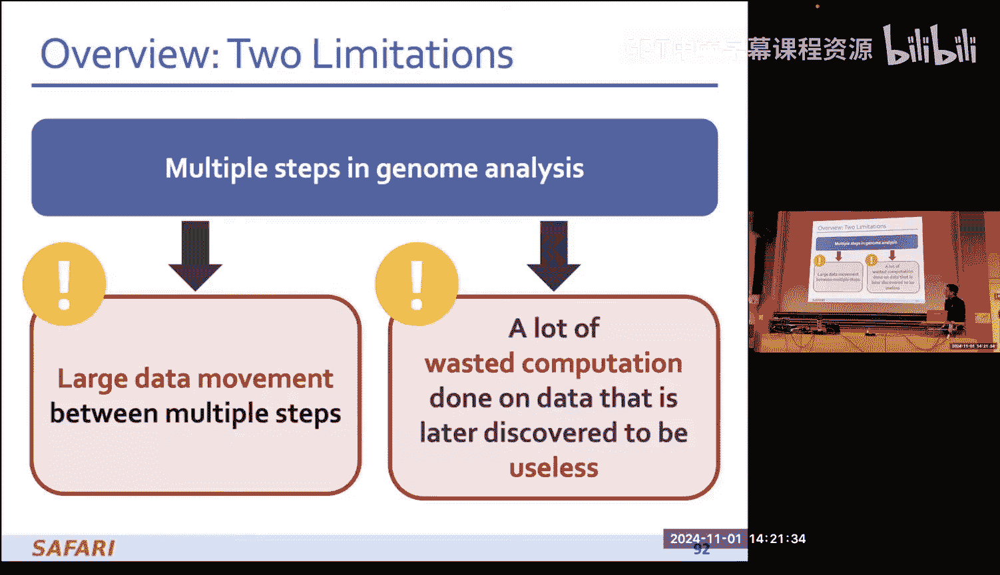

So there are of course works that tries to elevate this。

 but I'll illustrate a bit more the first mutation before showing these works。

 so when you basically look at the amount of data moments that we're doing at those step so we initially start with the raw signals which this can be in the scale of terabytes。

And then you base call them then this data is compress a bit right but now you have a few hundreds of gigabytes of data that you need to compute so you move them your process again some removed then you do computation again and later what you end up having is basically this amount of data but。

Once you see， basically the amount of data that you're moving across steps is basically there's a huge data on。

😊，But we don't stop from here because this data moment is not necessarily useful for us because imagine you process maybe 100% of your reads that you generate from base calling。

 but then some of them will be eliminated in the called score checking and some of them will be eliminated furthermore in the read mapping。

So this means that you're also doing the data moment and also the computation unnecessarily because they are eliminated later on in the later steps。

So how do you avoid some of these overheads right so one idea oh let's try to then reduce data moment and one idea is hopefully everyone knows now is the use of PM right so you can use Pm to do some computation here specifically use we do processing using memory to perform the dot product operations on a nonmo based memory。

So this can do the base calling for us because as I told you earlier。

 this base calling includes a bunch of neural net operations。

So we can also use a content dis memory to perform search right so this enables us to identify perform maybe sequence matching and we can do it again in a pM fashion so that we can reduce the data moments as well and this is useful in the read mapping step right so then this means that maybe we can reduce the data moment in between these steps which will hopefully enable us to improve the performance of these genome analysis and reduce the energy。

But then as you reduce the data moment in between these steps。

 ratio wise you're increasing the basic ratio of data moment。

In between other steps that you're not dealing with right and also we recognize that there is essentially no prior work that tackles the unnecessary data moment in between these base calling and read mapping。

So we try to understand whether there is a motivation。

 whether there is an opportunity for us to tackle this particular problem right so our goal is to efficient accelerate the entire analysis pipeline starting from basease calling up until maybe variant calling or read mapping by minimizing the data moment and use this computational moment right so if we do this motivation analysis here on the X axis we will show a different configurations and on the Y axis we have the normalized essential speedup。

Here， essentially compared to the no Xccelator solution。

Here what we assume is that we have a team solution for base calling and read mapping when we have this。

 what we see is that we can achieve speed up of up to 2。7 x。

Then we assume there is no data moment between these accelators because you can use PIm for base coding and read mapping。

 but whatever you generate using these steps， you'll need to move them basically to the later step to for example from base coding to read mapping so we assume that such a data moment does not exist and when we assume such a case we see that we can increase the performance by6 x。

Then we further go ahead and assume there is no data moment and there are no useless computations there are no useless leadss that we unnecessarily base calling and read mapping this is the ideal case so when we look at this what we see is that we can achieve6x speed up compared to the case where we don't have an accelator so this is a motivation for us right this is how we start and then we see okay so how can we essentially achieve or get close to this ideal case so this is what we do what we aim to do in jammI so JamIip is inmeory accelator for genome analysis that tightly integrates the base calling step and the read mapping step and then enables them to communicate with each other so that we can reduce the unnecessary computation and as well as the data moment。

😊，For that we have two key techniques， one chunk based pipeline so we don't necessarily fully。

 for example， convert the robot electrical signal to its base code version and analyze it what we do is we go chunk by chunk only basically call a small portion of it and then analyze it and then if it is necessary we continue with the further chunk second is earlier rejection。

 meaning based on the analysis that we've done so far on the chunks we try to assess whether we want to continue analyze this particular read or not right if for example this really turns out to be is maybe it's going to be useless for us we can stop at any point so that we reduce or minimize the unnecessary computations that otherwise would have been computed by basically this read fully。

By doing so we achieve essentially significant speedups and the energy reductions which I'll come to it soon so this is the chunk based pipeline as I described earlier this is an illustration of it so what you do in the usual base calling configuration is you base call the raw signals chunk by chunk this is how the deep neural networks work in their structure but then what you do is you basically call non chunk Pi chunk。

Then after your base coding is finished fully what you do you assemble these chunk reads and then you perform your quality score checking and then you read mapping right so usual step by step process so what we instead do is so we still base the chunk of data because this is what base colors take then what we do is as soon as essentially we generate this data we can actually start our computation right so we can sort of overlap also the latency because we can let the second step of base coding also around but in the meantime we can also do the quality checking and read mappinging for the amount of information that we generated so far。

没 doです。As long as we either decide to stop at any point or maybe not stop until to the end of the signal right and by doing so you first of course do some overlapping latencies。

 some save some cycles。

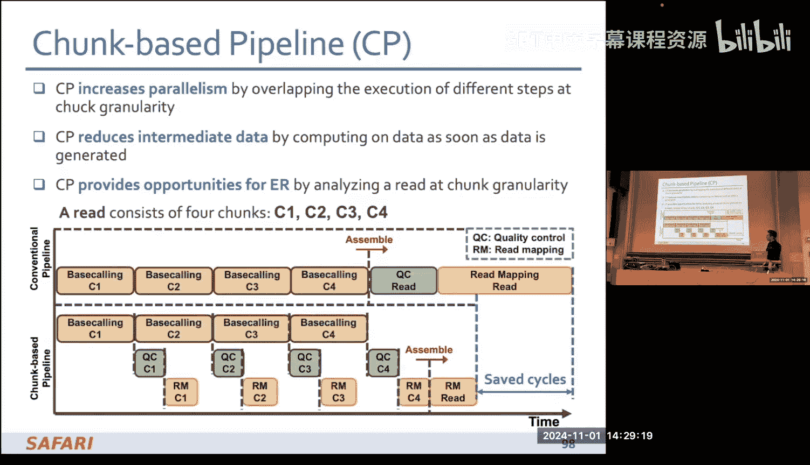

But also， if you decide， reject early， you even save even a larger amount of cycles and energy。

So this is on hardware how the jump looks like so what we do we use the prior Pm accelerators for base calling and read mappingapp so this particular work is in memoryory based color and this is in memorymory readmpper but what we also integrate is basically a mechanism that enables these two accelerators to communicate with each other and also to stop to process whenever this is needed so there is basically data flow control and the decision making going on in between。

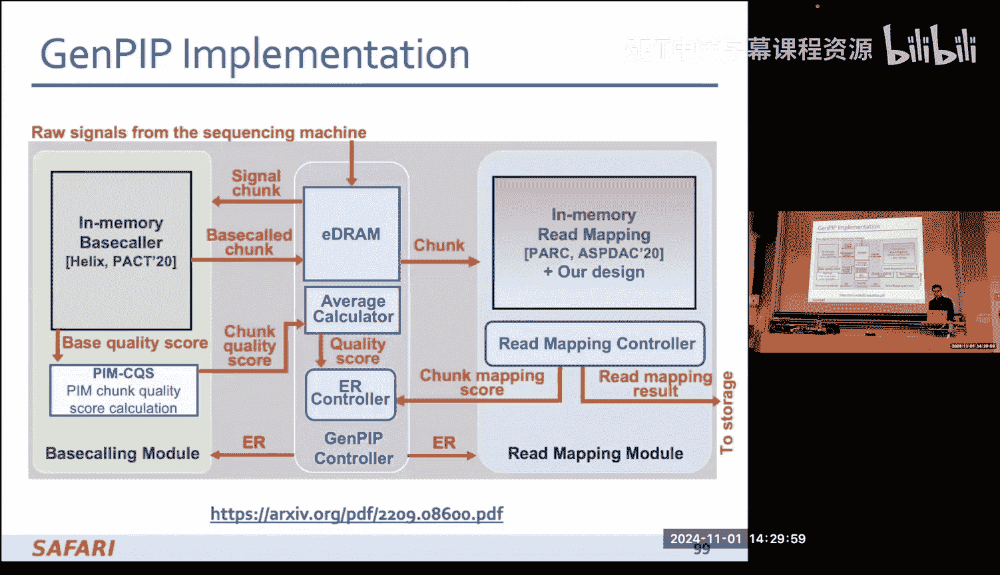

So here we show some results， we start with the performance results。

 again this is a normalized speed up to the CPU base。

And what we see is that by looking at both bacterial and the human genome on average。

 what you see is jumping provides a huge speed up compared to CPU GPU and also the optimistic pin where we assume there is no data movement between the accelerators。

诶。So essentially these are critical for the speedup。

 so we look at also the energy reduction that we're getting similarly。

 Ja reduces the energy reduction because it doesn't only reduce the unnecessary or reduce the data moment。

 but it also reduces the unnecessary data moment and useless computation。By doing so。

 we can even improve the energy reduction compared to this optimistic Kim。

Because it still does some useless computation over there。

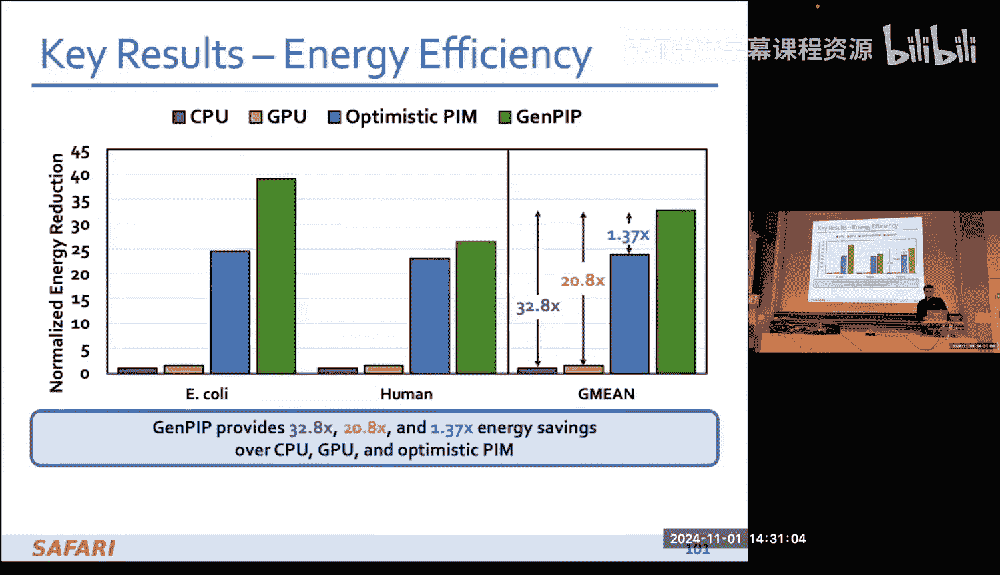

that you consider an I piece have no data between the two accerators。Yes。This folks still。

Between these two excators， we are overlapping。Exactly。

 and also you by being able to decide rejecting early。

 you're also sort of reducing your amount of cycles that would have been madeted otherwise so that early rejection also sort of。

ItRuces， so it doesn't really minimize up to the the zero part。

 but it reduces towards that goal the decision during。Right， exactly， exactly， exactly。

Its three hand data in Chinese it doesn't have some。 Its quick。 I like usually I get more。

Yeah excellent question yes it there is actually we and we do this analysis and pre analysis we see what is the effect of chunk size so the accuracy and meicide Xr chunk size according to that analysis since you ask this I'll also mention the chunk size related to the base colors so that particular chunk size is also a bit。

😊，Tightly integrated how the base colors work。And this usually goes with。Essentially。

 you need a larger。Chunk of flow signals to perform the base calling accurately。

But what we observe is based on our raw signal analysis works and so on。Actually， your analysis。

 the read mapping analysis， for example， doesn't need。😊。

That amount of chunk so you can still you could use a smaller chunk and then still perform a cure analysis。

 but just because your base color needs a larger chunk you're basically limited with that and then you rely on that and then do your analysis so this is basically one motivation that we're also using against oh then let's use row signal analysis right because we can even focus on the smaller chunk of data to perform a analysis。

More questions。Okay， so this is jam Pip so you can see basic it idea is beautiful right so maybe simple but also beautiful it provides the important benefits by simply letting two steps communicate between each other maybe there are more ideas that we can discover similarly in this direction。

😊。

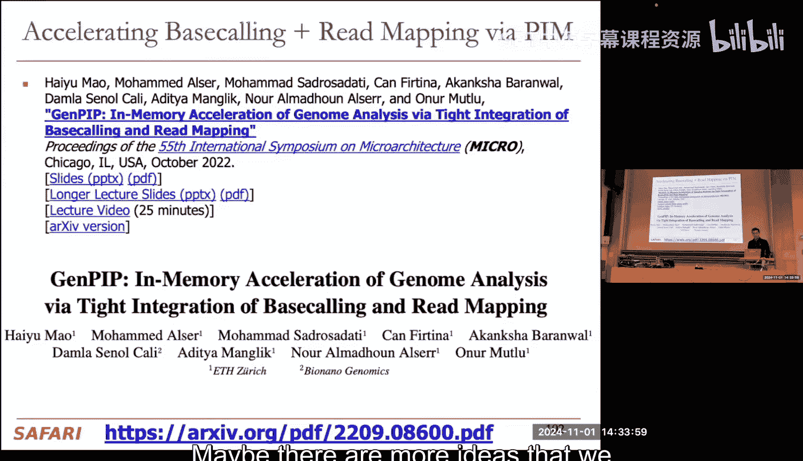

So this is soish as I mentioned earlier I won't go into the details of it。

 but here what we essentially mainly look at is so you can use memistister devices to train or to perform the neuralnet operations right this is a common case in neuromorphic computing as well and this is not specific to genome analysis because relying on the Kaws law and also omlo you can do summation and the multiplication which is basically useful for you to do the neuralnet operations and of course the question is oh then why not rely on this also for base calling in the genome analysis case right we can do it but then the question is these mems are not really the ideal devices so you're not going to always get the exact answer that you want to get from these meal devices so we call them nonideities there are some there is some noise。

In these devices so the question is， assume you train your model using some a hardware maybe CPUs and so on now you have a trade model and then you offload this model on our members that maybe crossbar RM base at so the question is will you be able to perform the inference at the same accuracy so that you would be performing on a CPU so the answer is usually no because of these nonideities so the question is can we understand these nonideities can we understand this noise better？

And then somehow inject this in the training phase of base calling so that our model is aware of these not9 doubt so that you make it a bit more robust such that you do your base calling more accurately given basically such a noisy hardware。

 so this is basically the idea in swordfish and this was presented at micro last year。😊。

So if we also look at how we perform further analysis using computing memory here。

 we to classify we try to perform food profiling which is relatively a common case in agriculture so you try to identify whether your food for example poisoned or not right but this is not done very commonly because of the cost of the operation so if you could reduce the cost a little bit if you could make it faster maybe we can improve the human health right so this is a step towards that direction。

We also look at how we perform some dynamic programming operations using complete using PIM in this case we look at essentially the use of a processing memory device that is commercially available and then look at how we essentially offload certain approximate imaging algorithms that are used for alignment to that particular hardware so that we can perform the alignment in a in a higher performance and reduced energy。

So we've been looking at processing in memory， but the question is can we even get closer to the data and then processing do the process even closer to it right and if I'm asking this question probably the answer is yes to illustrate this a bit more I'll talk about this gen store paper which essentially focuses on the in processing for genome analysis。

So you've been looking at different levels and in memory hierarchy right so you have the storage system main memory caches and now then eventually you compute it somewhere right so maybe CPUs or excccelators。

What usually happens is that we need to move this data from the storage system。

 maybe from your SSD to wherever you're doing the computation。And。

We know that the computation could be a bottleneck if you are doing alignment， for example。

 this is computational costly。But also there is a data moment overhead at。

 you need to move this data from the storage system to the accelerators or to the CPU。

And maybe if you look at this perspective initially without designing any excccelator or editing。

 you may see that all the the the essentially execution time is made the bottleneck by the computation right then you may want to accelerate this rightfully because why not right so you're going to get a huge speed up but then。

😊，If you when you improve as you improve the algorithms right maybe you design heuristics to reduce the amount of computation。

 you design some excccelators， you design some filters。

 the amount of data that you're computing so this means that the bottleneck will actually shift maybe you'll elevate the computational bottleneck so this means that。

😊，Maybe you're not going to spend lot of time in computing。

 but you'll spend a lot of time by moving the data right so now the goal is is to minimize this and we do this basic engine store by filtering the reads that sit in the SSD。

That do not require maybe costly computation。In the later steps。

 rather maybe we can do some simple computations within the SSD so that we don't have to move them across in the many levels of the memory hierarchy so that you reduce the data moment。

😊，So， this means。You filter some reads by doing some computation within the storage and you just only send the ones that are needed to be sent。

 for example， to your excccelator， and you can do this。

 essentially this type of computation as long as your computation is relatively cheap because you don't have basically necessary。

 the complex the computational capabilities inside the SSD unless your designing read is something very special for a particular application。

So this means that for example， we can design simple accelerator。

 simple logic to identify the exact matching reads so identifying exact matching is very simple you can do even some exor and then identify the exact matching or maybe some non- matchingching reads。

 meaning maybe this read is highly dissimilar to a reference genome that we're going to analyze and then you can somehow identify this hugelyilar again quickly so that you don't send this data because you know that it won't map when you send it so this is basically these are the two steps that are're doing in genome analysis but of course there are challenges one is beat mappingping works exhibit different behavior given different technologies different genomes so how you design hardware that is flexible enough also as I said there are limited hardware resources so how do you utilize these resources efficiently so that you do the computation that you need to do in this SD in an effective way。

😊，So。By addressing these challenges， we propose essentially a Jantor enabled storage system that can do the computation。

 the necessary basic computation inside size SSD and by doing so it can reduce the computation overhead as well as the data on overhead。

By doing so， again， Jan achieve a significant speed up and energy reduction。So yeah。

 this is basically one work that performs in storage computing for genome analysis。

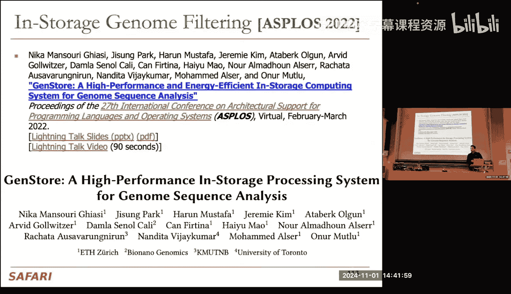

I'll move on to a similar work again， this work was again led by Nikika， similar to Jantor。

So here in this work we look at a different application which is the metagenomics okay so we want to rather than doing essentially read mapping mapping to a particular reference genome。

 you want to perform metagenomics in the storage so me to the essentially we propose megas megas is the first install storage system for end to end metagenomic analysis and the idea is somewhat similar to Jantor but of course there are differences so that we can fit the application well the essentially the idea is we want to cooperate the install storage processing for metagenomics between the SSD and also the host system because you don't necessarily always use the SSD to do all the computation but you can rely on the host system maybe or CPU to do some of the computations and then if you can communicate if you can create a communication well create a nice communication let's say between these tool systems the whole system。

SSD， maybe you can still exc the entire application。

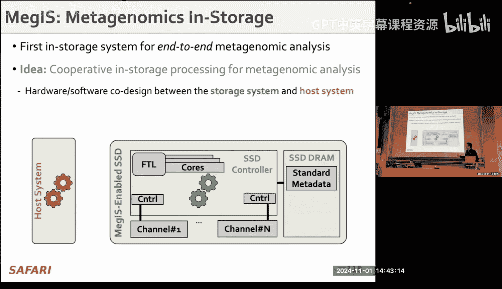

So to remind you how metagenomics usually works again we start with this bunch of DNA then what we do is in the first step we extract kmes or subsequences from your input read set then there is this particular large database that contains the information of many species right so this can be up to 100 terabytes of length so what we do is we query these subsequences to this database to identify the presence and absence information for each potential organism and then we calculate the abundance distance based on these matching so this means that overall when you look at it。

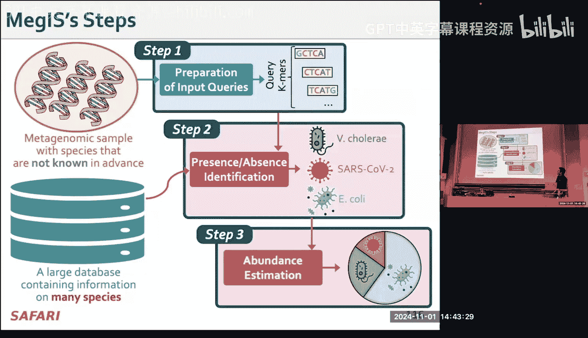

There is some。Camer preparation step right so you extract ks from the DNA， you prepare the data。

 then you query the database， then you perform some intersection operations to generate this abundance estimation。

 so this is overall the set of maybe computations that we're doing。

So moving this what we realize is that you don't necessarily have to use SSD for the entire operations in metagenomics。

 for example you can process the input data which is your reads you can extract the cameras。

 you can sort them you sorting is also it's not necessarily cheap to do it in SSD so you can do all these computations in your whole system。

 you can prepare the data then once you prepare the data you can send it to your to your enabled SSD so that it perform rest of the computation so then still there are challenges right meaning for example you're going to access huge database but you don't want to randomly access this data so somehow you want to optimize your excesses so that you minimize the randomness so this means that so how do you lay out the metagenomic database such that you。

😊，Mimize this random aes and how do you essentially essentially communicate or arrange this communication between the whole system and the SSD and so on so that you hide。

 you overlap these all these laencies and so on and for intersection we have a small excccelerator over here so once you fetch the necessary data from the large database within the SSD you can directly do the computation right where the SSD is located right inside the SSD so that you don't have to send this huge data to main memory and then do the computation in the CPU and then send it back again so you can do it right over here and then your simple operations are done our platform where the data resides so this is basically so as you can see。

😊，This is not simply basically using the SSD right so this requires you to understand what are the limitations of SSD。

 what are the resources that you can use in SSD， what are the requirements that you need to take care of so that you deal with your data layout right？

And also what are the other basically the hardware that you can rely on right so you can imagine a hetero system here it doesn't have to be a CPU over there。

 maybe there is another patient that can benefit from the GP so how do you communicate these two and then perform the data flow efficiently so that you can hide certain latency so this is basically if you want to learn more about these the mes provides really good insight data how you optimize all of these steps nicely。

😊，So when you look at then the results in terms of the speedup compared to the software baseline here the software baseline is we have a performance optimized software baseline which is fast metagenomics tool running on a CPU there is an a optimized baseline again a slow tool but exceedac and then we have me software there so we look at two different SSD configurations one is the cost optimized SSD the second one is the performance optimized SSD where you have higher bandwidth looking at both we see that me improves the performance quite substantially compared to of course the CPU baselines so we can see basically by simply just reducing the data movement and doing the important operations quickly inside the SSD you can simply platform much better than these CPU works。

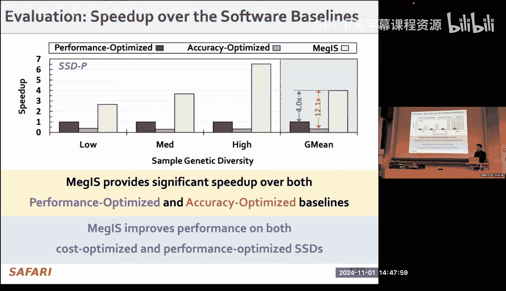

So we also look at the energy that we're consuming using the performance optimize a optimized baselines and also looking at PIM here what we see is again since you minimize data won't so essentially you reduce the energy consumption because the PIM usually requires a higher power consumption then simply the SSD。

 so by essentially relying on the SSD and the computations inside SSD you can also reduce the overall the energy consumption compared to PIM as well。

There are， of course many other analyses， or if you're interested。

 we can take a look at the megaus paper。So yeah， this is Mes。诶。

If there are no questions I'll move on with the genasm， so this is relatively a different prediction。

 is this still an hardware accelerateccelator。Okay。

 then I'll move on so so one of the last works that I'll cover is Gnam。

 this is an hardware accelerator for accelerating approximate sting matching。

Wwhich is commonly used in genome analysis and which is found to be one of the most computationally intensive steps in genome analysis so our goal is to accelerate this step and this is basically the first approximate st matching acceleration framework for genome analysis so we're seeing because this is highly flexible to certain parameters。

 so it uses an approximate string matching algorithm called biTch because it can perform this st matching using simple and fast bit by its operations。

So this is really suitable for simple cheap hardware。😊。

But we don't stop there because BiTap has limitations， so we modify the algorithm as well。😊。

So that we provide the support that we need for alignment。

So this is actually a first work that shows that on the algorithmic level as well。

 it's not just the hardware level on the algorithmic level it shows that a BTap can do more what it can do。

 let's say， so I'll simplify it for now as is， but in the later slides， I'll explain what it means。😊。

So we co design algorithm and hardware together and also optimize the memory placement so that we can reduce the data moment。

And in gm， so this is the how the overall the hardware looks like。

 so we have mainly how two parts one is the gism DC this is this refers to the distance calculation DC here we literally directly use the Bta algorithm so we accelerate the byta algorithm here to perform the approximate string matching。

But what is further needed in alignment is the approximate string matching tells you essentially the edit distance。

which is basically the minimum number of operations that you need to do to make one sequence identical to another one right so this is a enough good information for us if your goal is to just to check whether particular sequence is similar enough to another sequence but if your goal is to identify what are the exact operations maybe the insertions deletions mismes and so on to convert one sequence to another then the byteap will not give you that which is basically usually generated the traceback step so we modify the byte algorithm so that it supports the traceback meaning。

Once you once you identify your edit distance。What we further do is we reuse the information that we generated so far so that we do traceback to identify the operations that gives us this minimum edit distance so this is the TB part the traceback part in Genm and this is again done by some simple operations short next so in the distance calculation part we rely on a systoic array structure because the byta algorithm is a simple bit vector bitwise based it includes some bitwise operations using bit vectors so this means that you can have simple logics and the output that you're generating in the previous time step or the previous step will directly be consumed in the next byTap step so this means that you don't necessarily need to move this data back to maybe to far away from where this is taught right or you can rather just place the next。

Thissing an element right next to it so that you can directly consume it because you know that you consume it directly in the next PE so this is basically still array structure that we're utilizing in genaism and this is the bitwise operations that we're doing for the distance calculation。

😊，So further once we generate all our bit vector to identify the immuno meta distance。

 we then iterate on these vector quickly so that we identify the optimal alignment operations again using some simple logic here。

 so this is the TB part in Gism。😊，So by doing so meaning you accelerate the computation yes right so you do the bitwise operation。

 you essentially peak and nice algorithm that is nicely suitable for hardware but you don't stop there you essentially efficient design it on hardware but again you don't stop there you understand the data moment between steps so you minimize the data moment and by essentially codesigning all of these nicely what we show is we can achieve substantial improvement in terms of performance and reduction in the energy consumption so basically I'm explaining these in a high level so that I can at least tell you a little bit just about what we essentially look at right so we don't simply implement an algorithm on hardware we understand the application and we co-design the application algorithm and the hardware according so that we will minimize the potential problems that we are likely to have if we would have simply。

Iment that particular algorithm on a hardware。 So this is basically the the beauty of the hardware algorithm and software core design。

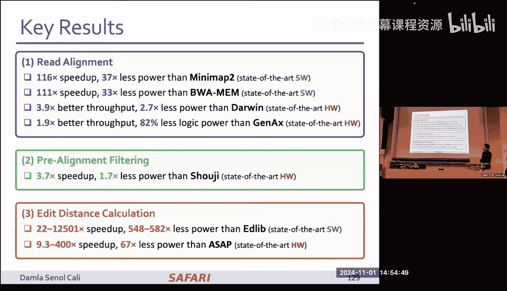

So if you're interested in learning more about Ganism。

 you can take a look at this total video that was delivered by Dmla。

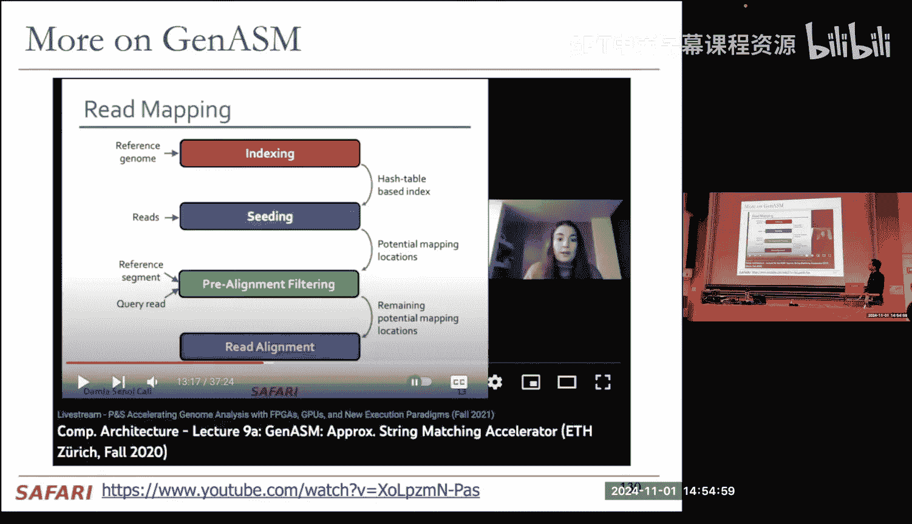

Go is now at 10 x genomics。So we also further improve the Scroge。

 further improve the Gasism algorithm by doing some optimizations and implement it on not just on the hardware。

 but also for CPUUs and GPUs， so meaning that there is still like room for further improvement and one can work on it to provide further performance and energy improvements。

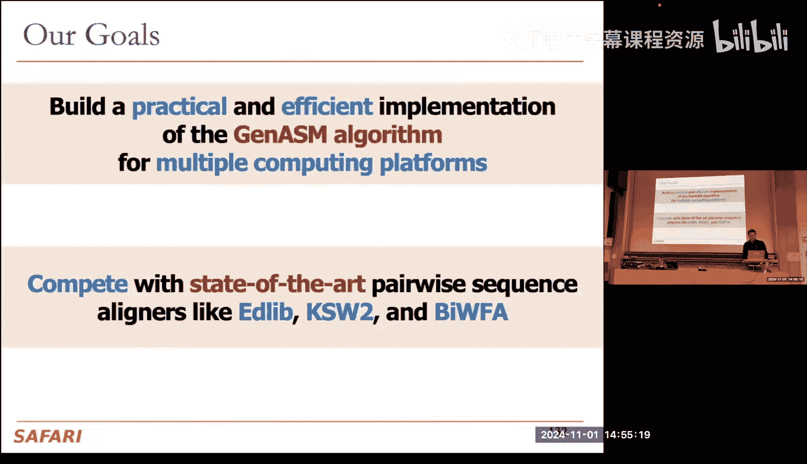

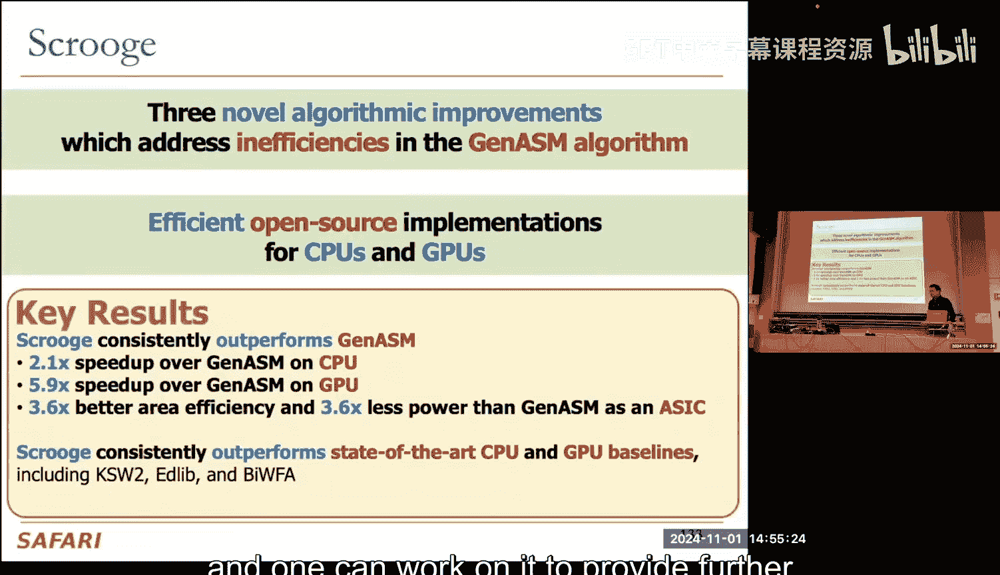

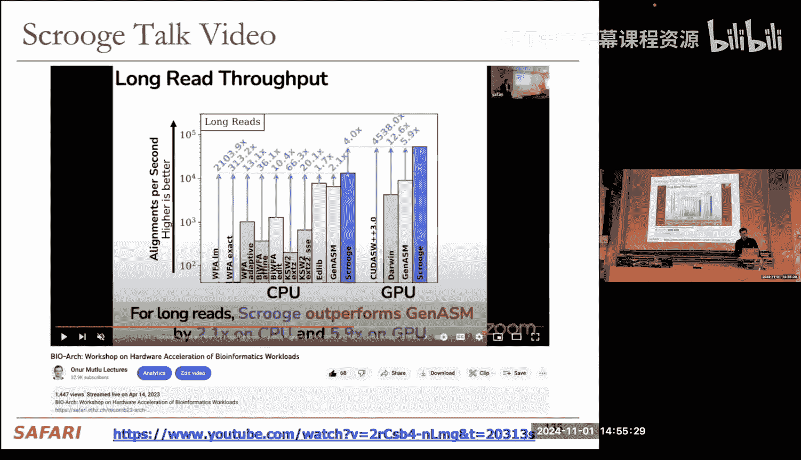

This is a talk video if you're interested。嗯。The next work that I'll cover is SaG this is mainly this is mainly built on gennaism but it looks at the read mapping problem at a different perspective but focusing on the sequence to graph mapping so remember as I showed you earlier we mainly use a single reference genome but there are certain caves to it。

 so the question is，Then can we use graphs。We know that we can use graphs。

 the next question is what are the computational issues and can accelerate them so SeG focuses on these issues to accelerate the sequence to graph mapping。

So this is essentially the problems with to analyze the van the reads using a linear reference genome and if you use graph you can annotate the potential variations inside the graph so that you can perform more accurate analysis so sequence to graph is useful and these are essential to steps in the sequence to graph mapping so this is mostly similar to regular linear reference genome mapping so what is mainly different is is basically the seeing of course the graph construction part you construct your graph that is the different part but also the seeding part so the seeding is not necessarily now just simple matching to a linear reference genome but you need to match it to a graph but then further on how to identify basically the right path in the graph by performing the alignment and so on。

And。So essentially we look at this pipeline and what we recognize is this particular alignment part is now more costly。

 so we know that it was already costly in the linear reference genome mapping because it includes many dynamic program operations。

😊，But essentially the nature of dynamic programming operation， the linear reference genome case。

 it looks at a certain number of cells to perform the dynamic computation。

 but when you move on to the graphs， the amount of cells that you need to compute in the dynamic programming manner。

 they increase。😊，And also now there is no particular pattern。

In the cells that you're checking in the DP so this means that you can almost look at anywhere in the Dp table to do the alignment so this makes the computation a little bit more complex。

 meaning it is now slower so we try to accelerate the entire sequence to graph mapping on hardware and when you look at it it actually is similar to gm so what is different is we have this now minse part over there which does not necessarily use all subsequences in your read it's rather samples it perform some sampling in your read so it reduces the amount of data that you're processing so this requires this is done by finding some minimizer so this is a sampling technique that is commonly known and it requires some sorting and so on so that you can identify some minimum let's say data local minima in。

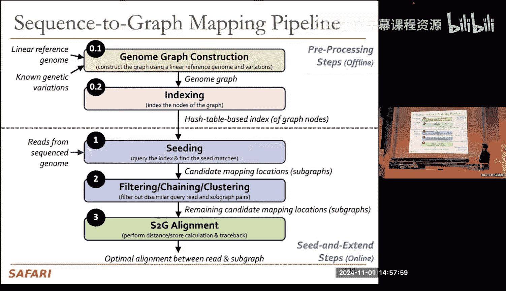

Data and we do all of these basically again on hardware so that we identify these minimizers and so on。

 but then you use this sample data to perform the mapping and the alignment so what is different at this part so this part mainly uses gam but what is different is basically is the hop cues so these opes essentially enables you to look at further back in your dynamic programming table so that you can perform the computations that the sequence to graph is requiring you to do so so this is basically the part that the mainly modifying in segram and by doing so we can perform sequence to graph mapping on hardware。

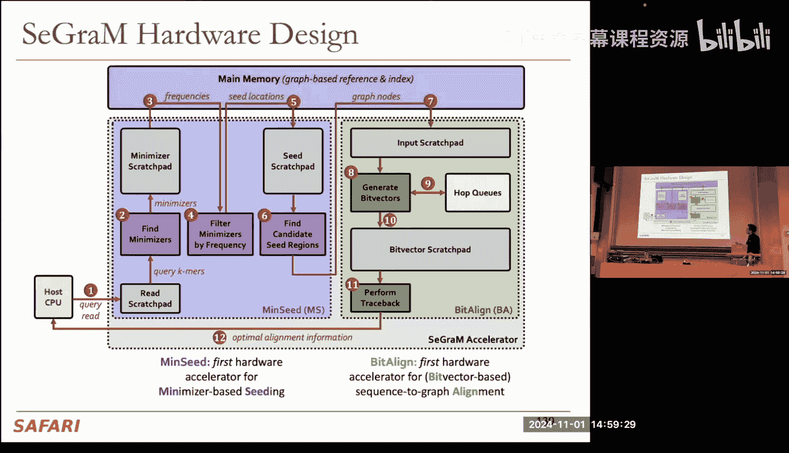

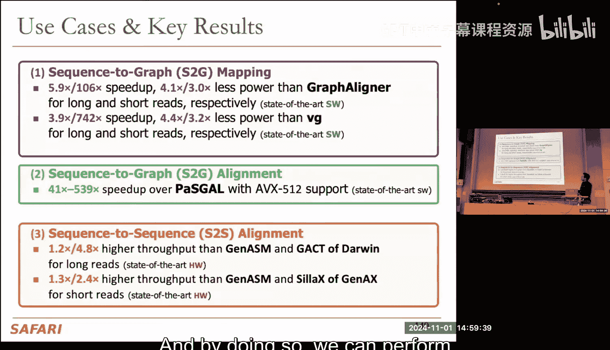

So yeah， if you want to learn more about the in operations and little more details on the challenges you can take a look at this talk that Dmla gave at IsA when she was presenting Sagramm。

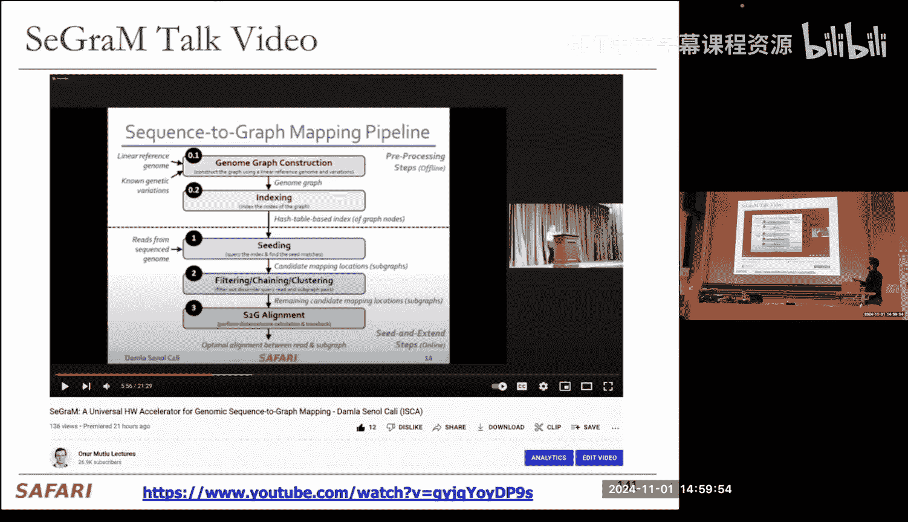

So yeah， this is Se Grman。This is a very good point to stop because in the next part of the lecture。

 I'll mainly cover some algorithmic optimizations rather than data hardware optimizations。Yes。

 we can take again， another 15 minute break and be back at 350。

 but to fill the to fill the time a bit， I updated slides so now we have we have more slides。😊。

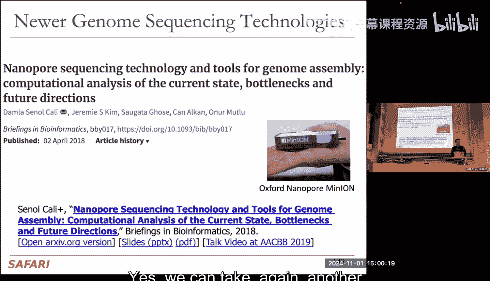

诶。Yes， so that I can go faster again。Buty I guess we will finish abitarily， I assume we can go。

 hopefully。😊，Okay， so。The last slide was the segram。

 we covered some hardware acceleration works from our group for genome analysis。

So I'll also now cover some other optimizations that we've published so far。

 some of the papers we've published so far in our group。For example， we asked the question。

What happens basically when we have a new version of def genome right so these def genomes are not constant。

They are updated regularly， some minor updates every few months， some major updates every few years。

So and the question is。Essentially， do we move to this new reference genome or do we stay in the old reference genome and you may answer this。

 of course this question differently， if you didn't already do your analysis。

 of course you can use go ahead and use the new reference genome。

But if you already did your analysis on old reference genome the questions always。

 is it worked basically， is it worth doing your entire analysis again on the new reference genome because you don't know whether using the new reference genome will be useful for your particular reads that maybe the information is exactly the same looking at the part in the reference genome that you want to analyze or maybe there are some important changes but you're still not sure right so how can you decide this efficiently。

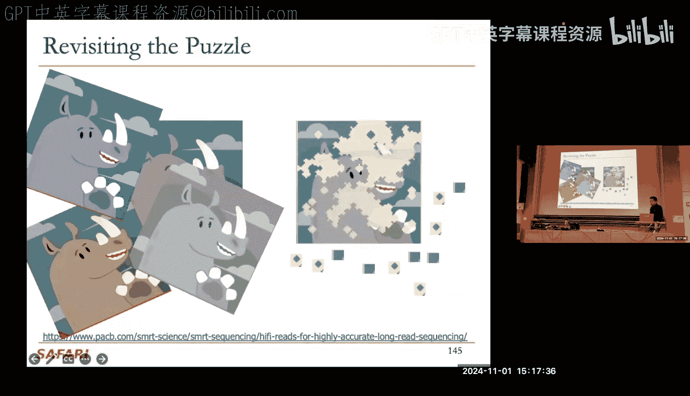

And of course people are also asking， when is it the right time to change the reference genome substantially because it usually improves the accuracy。

 but it comes at the cost of additional computations that you need to do。

 which is the entire read mapping from scratch right and you don't want to do this unnecessarily。

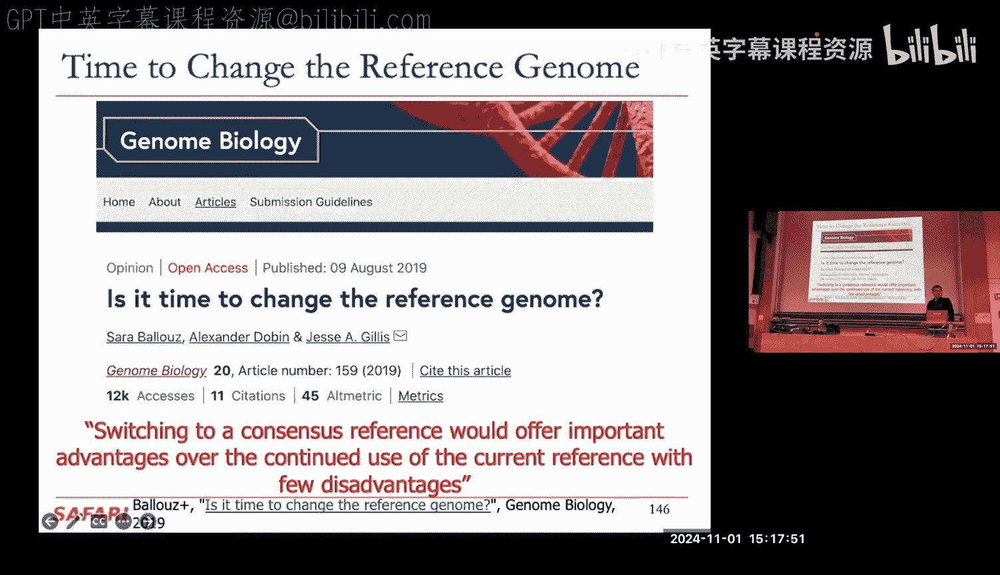

This is what we aim in AirLi， we want to mitigate useless computations whenever the reference genomes are updated and whenever you want to move from old reference genome to a new reference genome so a key observation as I already told you reference genomes are updated。

The key idea that we are proposing here， not basically the entire reference genome is going to be substantially updated。

 so there will be a large portion that will stay constant。

 it will stay unchanged so the our idea is can we quickly recognize the differences between old and new reference genome and can we leverage thisinform and during the read mapping。

So this is the illustration of potential changes that we may have in the new reference genome so I assume this is your alterre genome and this is the new reference genome and we label mainly four parts the first part is the constant regions so those are the regions that do not change at all so they stay exactly the same in terms of their base content so we also have updated regions so those are the regions that have slight changes maybe some single character change of few character changes。

Between the regions。There are some regions that we call retard regions that do not appear anymore in the knee reference genome。

 so they are completely now gone， they are deleted。

And there will be some regions that we call new regions that will be completely novel in in the new reference genome。

 so those are basically the four complete changes that you can have between the old and the new reference genome so the question essentially is。

So the question is。Can we leverage basically this information and what we do in airlift is that we create a dictionary。

😊，That gives you some coordinate mapping， so assume your mapping was at this particular position。

 so you query this dictionary and then ask what should I do so basically this is the question that you're asking。

So if the dictionary tells you that， oh， actually you're at a region， you're at a constant region。😊。

So what we can do is we can simply just update the mapping position and nothing else and nothing else means。

 for example the alignment information right maybe the edit operations that identify in the old difference genome the reason for that is mainly because again this is a heuristic decision but this particular region is now is not changed it is constant so this means that whatever the operations we already performed on the old reference genome we should be able to transfer that information to the new reference genome so only thing that we need to change are the positions because these can move right and left depending on the retired and and the new regions right but of course the dictionary can also tell you or maybe you have a readT that is under this retired region so then what it enables you is essentially tells you actually you need to redo the alignment you need to redo the read mapping for this particular read that falls under that。

RegionSo for these reads you do the read mapping from scratch right so then it's basically sort of like many in the middle a guidance for you so that you don't necessarily do the read mapping for all of the reads that was previous map to your old reference genome rather you ask oh can I simply just move the position or not and if not you do your read mapping according then we do some hdle optimizations for the updated regions and so on so this is basically purely an algorithmic optimization and this reduces the use computations that you would be doing moving to a new reference genome。

嗯。So as I said， we are also looking at the newer genome sequencing technologies， for example。

 the Nooppore sequencing technologies is a special interest for us。

 and previously in this paper led by Domla， we looked at basically what are the challenges。

 what are the computational steps in analyzing the Nopo sequencing data， what are the challenges。

 what are basically the potential future directions for it。We also directly work on this direction。

 specifically， as I also mentioned earlier， we try to perform the analysis。

 the genome analysis by eliminating the base next step。

 meaning we want to directly use the raw sequencing data and then do the analysis directly using raw sequencing data without any translator in between。

And。😊，So this is basically this straw hassh work enables that and I'll give you some key idea and the key insight observations that we generate from this paper。

 so the key observation is that we're utilizing and that was also utilizing the prior works is there is noise in raw electrical signals and raw sequencing data and the noise means when you're sequencing particular DNA content assume you are sequencing ACTG right you'll generate an electrical signal。

And then when you're sequencing again， maybe at a different time using some other nanonopo sequencing device。

😊，You you will generate another electrical signal， so the observation is。😊。

There is noise in these electrical signals and this noise will create will cause basically generating similar raw signals not exactly the same electrical signals。

 but similar row signals when you're sequencing identical DNA content and since we already had this observation meaning the raw signals will be similar to each other。

 they won't be exactly the same maybe we can identify the similar by calculating some distance between them right so you can encode them as vectors。

 maybe a bunch of signal values in pico ands and then from vector distance calculation on hyperdimensal space。

😊，But essentially this is a costly step， so because distance calculation using millions or billions of factorss in a large space。

 if you especially worked on KNN， you will know that this is this an costly process。

 rather what we want to do is we somehow generate hash values from these raw signals。

Suchuch that we can just use these hash values to match them each other so basically if these those signals are similar you want to generate the same hash value and then enable finite dissimarity based on these fast hash matches instead of the distance calculation but there are certain challenges to it is one change of course how do you generate the same hash value from the similar enough signals right so because usually especially when you're using a lowgen hash function if your input is even slightly different the hash value that you're going to generate is going to be completely different。

And of course。We want to accurately to find similar regions as few similar regions as possible。

 meaning we don't want to find hash matches in a million of regions。

 but only a few hash matches and those hash matches will be accurate。😊。

And these are some overview of steps in when we're performing realtime mapping while the sequencing is happening in raw hassh without base calling。

 so what we do essentially we convert， we convert the reference genome。

 into its signal representation， so we know that how or what each sequence should look like in terms of its signal。

 we convert the reference genome the signals。And we somehow do some purification and denoing and so on on both the reference genome and also on the raw signals。

But then further what we do is that to enable the matching of signals we perform quantization。

 so this means that the quantization approach will perform some bucketing such that the close by values will be assigned to the same bucket。

😊，So that you can generate the same hash release from the similar raw signals。

And what we do is that once we generate the hash values from the reference genome signals。

 we store them as usual in the read mapping step in the hash tables to use them as index and the hash values that we generate in real time from the raw sequencing data we query these hash values in the hash table and then we get some matching positions if they occur in the hash table and we perform the regular the conventional chaining and mapping steps and then we continues to ask question。

 given this chaining information that we generated so far， the mapping information。

 it continues to ask whether we want to keep sequencing or we want to keep mapping this particular data or not。

 maybe we're not still confident enough to tell okay we want to stop sequencing so if that's the case if the answer is yes。

 we get the next chunk of data remember these are generated in real time so this means that all this operation needs to be done in realtime meaning the computation throughput should at least match the data generation through。

😊，That's why it is important to do all of these operations quickly。But then if the answer is no。

 we can actually tell the seer to stop sequencing， so there are certain functionalities that can do that and then at the middle basically partially sequencing the data you can stop sequencing the read so this means that you can reduce the sequencing time and cost that would otherwise be impossible without the real time analysis。

😊，So this is essentially Ro hash， this is the first hashspace work that enables the analysis of large genomes such as human genomes in real time without base calling。

I see something in the chat。So there is a question in the chat or you don't see。

 I'll read the question。So the question is so in Ro hassh you hash the bucket not the signal that was placed in the bucket that is correct so there is actually one more additional step to it after so bucketing is really like reducing the resolution of the signal right imagine you may have I don't know 5000 signal values and bucketing it will just reduce its resolution maybe I don't know 16 buckets or 32 buckets and so on so this is like a loss compression right but then it will enable us to assign the the close by signal values into the same bucket meaning the same value。

We could use the value， whatever the value we assign for that bucket for matching。

But then actually there is an additional challenge to it because a single signal represents a very short region in the DNA。

😊，So this means that you will actually find。😊，Too many matches if you just try to match this particular bucket value so what we further do is actually I didn't show this what we further do is we somehow pack multiple buckets into each other by preserving the order of the DNA so that we essentially increase the region that we're panning with this bucketing and packing approach and then after packing we generate some hash value from these packed values and then we use that hash value for matching。

I hope it was clear， so if it isn't clear， just write in the chat again， I'll take a look at it。😊，二算。

So this is Ro Hash。😊，Okay。So this is Rohessh， if you prefer to improve Rohesh by performinging the quantization a little bit more intelligently by doing some mapping decisions in machine learning fashion as well to make more robust decisions。

 so this is what we provide in Rosh to。😊，We also have Ro line in Ro line our goal is actually form signal alignment。

 so after mapping the signal after identifying where the signal might be coming from in the reference genome this is what Ro has provides it will just tell you the position the next step is actually performing the alignment right so given the position given the region。

Can you do that line。So the challenge to it is the alignment is costly。

 so this is an additional step on top of mapping， but then you are limited by a certain throughput right because you want to do the analysis real time。

So the challenge is actually， how you insert something additional to the pipeline but still achieve a good throughput。

And we show that actually we can do this because the alignment operation gives us extra confidence。

 which enables us to relax some of the other parameters that we've been using in raw hassh so that we reduce the computational cost of the raw hassh part and by doing so we essentially balance the performance by still improving the accuracy thanks to this alignment so once we have this alignment information the next step would be how you utilize this alignment information right so is a good question to ask。

😊，I would say。So this is Roa line。😊，We don't stop here。

 we also ask the question can we enable new applications in raw signal analysis without performing base calling right because currently the challenge the raw signal analysis is limited also by the number of applications you can do you can map your read and identify maybe the organism and so on perform contamination analysis or do alignment but then the question is what do you do with this alignment information or basically what are other applications we can do we want to achieve this because our bigger goal is to completely get rid of the need for the base calling and perform full downstream analysis fully using raw signals and in row sample we try to tackle one part of this work one part of this direction here what we do is instead of mapping your raw signals to a reference genome？

We rather map them to each other because it may so happen that you don't know what the reference genome is。

 it may be unknown， maybe it's not generated right so it doesn't exist or you just want to create the genome from scratch and the usual approach to do it is to find overlaps between reads and we essentially transfer this idea to raw signal space and we find overlaps between electrical signals so that we can construct genomes directly from electrical signals without a base calling and we show that we can actually construct a single piece of fragment that is half the genome length of E coli。

So here to illustrate this in a more numeric way， so here the half the length is around 2。

7 million and as I showed you in the initial part of this earlier part of this lecture。

 the E coli genome is around 5 million basis so here this single piece is constructed by simply looking at the overlap between row signals and the length is 2。

7 million。The average rate length that we have in this particular database is around 6，000 pagess。😊。

So then this means that you by just simply overlapping。

 you increase the sort of the synthetic ring length by about 400 times。So this is one， of course。

 the benefit of overlapping and constructing the assembly。

 there are many other benefits that we're excited to basically tackle as future work。😊。

So as we approach to the end of the slides， I want to it a little bit some of the points that I've been seeing。

So but actually before that， I'll illustrate what other directions we can follow using this overlap information right so one direction is。

We can now use this overlap information， maybe improve the base coding accuracy right so this is an overlap information。

 this is a useful information that you can feed to your base color and then maybe your base color will be able to utilize this external information to make the model more accurate by maybe still making it less complex right now because you have a more useful information。

😊，As I said earlier， we want to do the peripheral of full dancing analysis fully using raw signals without base calling。

The other question is can we cooperate through signal analysis with the base code sequencing analysis right so this is if it goes back into this maybe jamie idea or the other filtering ideas you don't blind the base code right maybe you do some cheaper operation。

😊，And then decide whether you want to base or not， maybe using the sourcing analysis。

 and then you do your base coding。😊，And of course， there are many。

 many other directions that by keeping the hardware design and the underlying sequencing technology in mind。

So I'll now conclude with some future opportunities in genome analysis。

So what we see is the computing is still bottleneck by the data moment because as I said。

 there are many steps in genome analysis， there are many applications and essentially depending on the application the needs will change so remember the pipeline that I showed you earlier。

But what you see is that essentially the things are happening in the industry。ForEx。

 one of the sequencing companies， the Eina， which produces one of the solutions based on sequencing by synthesis technology。

So this is basically commonly as a market leader in the field。

 so they now integrate these FPGS solutions。😊，Inside AC concerts。So， that。

You'll do your analysis while the sequencing is happening。

And this is basically essentially their mention for hardware acceleration inside to sea concern so biotech companies are already realizing the importance of this so so this is this platform is dragon。

And诶。Probably I was dais enough to update this slide but there has been a recent publication related to this a few days ago in nature there is actually further improvement that there is a huge speed up for the entire genome analysis to reduce the entire genome analysis latency such that we cannot perform we can generate the data and then perform the full analysis starting from read mappinging to the variant calling and then do them maybe even within PVs so if you are interested。

I won't be able to provide you the link here maybe I'll update the slides later on。

 but take a look at this papers pretty interesting although you won't be able to find the source code。

 which is。

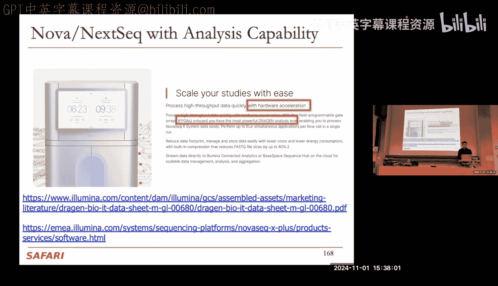

Something to discuss， I guess， anyways。诶。Essential the tech companies are also looking at the important workloads。

 the important computations that are used， the important fields right， for example。

 I' be mentioning the dynamic programming computation right so Ds are used for many workloads and of course these tech companies want to provide fast support for these custom operations so that if we can perform them quickly。

And what they do is actually they look at the genome analysis。

 so once you provide these DP instructions， the specialized instructions。

 can we compute them much more quickly than we've been competing before and they look at basically the genome analysis workload over there and then they see 7XP up by simply providing the the DP instruction support on these H100 GPUs。

😊，Biotech companies and the tech companies are also now collaborating。

 they are providing they are describing their requirements solutions。

 the biotech companies and the tech companies are trying to provide solutions in terms of either software or hardware to these particular requirements。

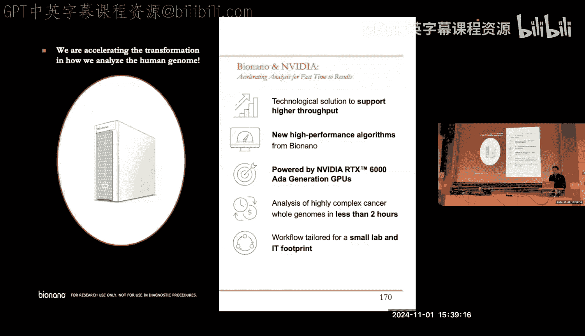

诶 so。AI ML operations are also very commonly used in genomics as well as in many other fields as we've seeing we've been seeing nowadays a lot in the field。

 so there are so there is this cerebra's recent waiver scale engine right so this is from this year actually we've been using older version for some time so this basically a huge waiver scale engine that includes series of transistors to perform the AI ML operations in a much quickly and in the largest scale so this is their benchmarking and they show that they provide basically the best solution the fastest solution compared to their competitor so I took this image a few months ago maybe this already outdated since the field is moving a lot faster enough。

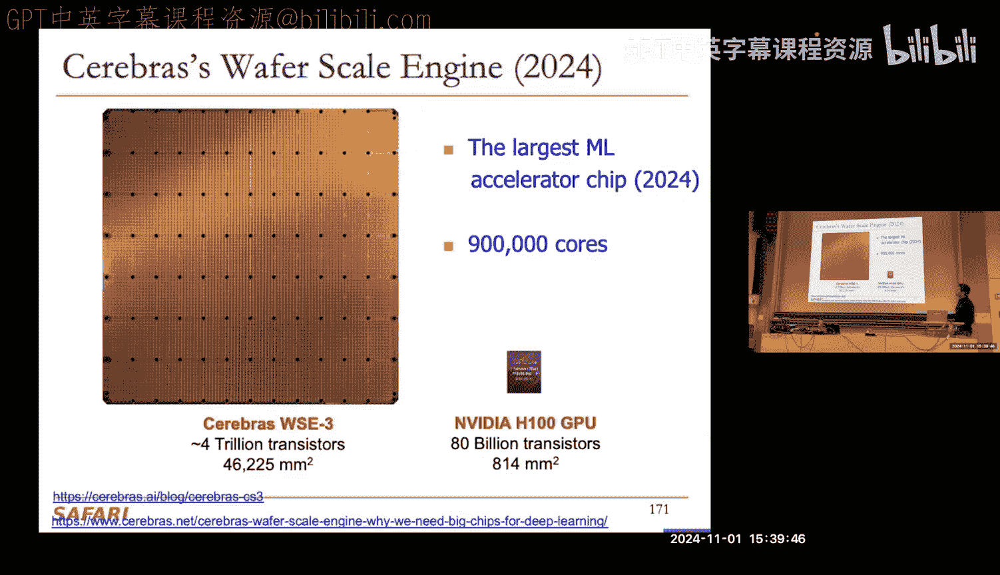

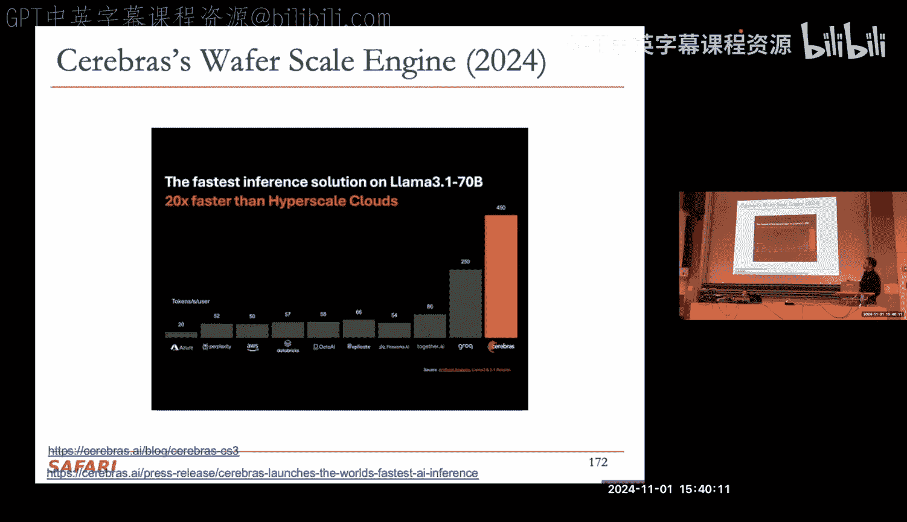

So we also look at the processing in memory solutions。

 we collaborate with the companies that provide these products the solutions。

 this is one example here you can buy these essentially modules and then perform your processing in memory computations using these upMM DM devices。

We are part of this bioopium project where we have many partners。

 this is basically an EU funded project， but our goal is to essentially elevate the data moment issues in genome analysis so that we can achieve fast and energy efficient and scalable genome analysis。

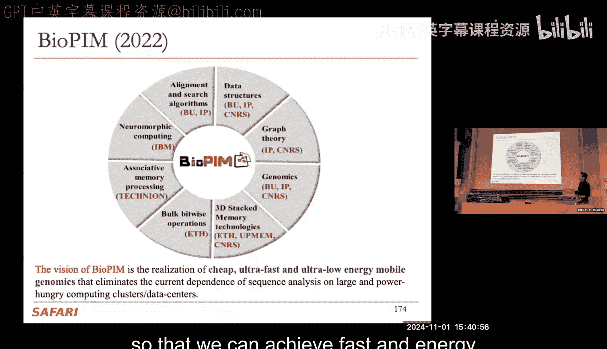

So if you're interested again， in this direction， as you might already guess， there are many。

 many materials available you can。😊。

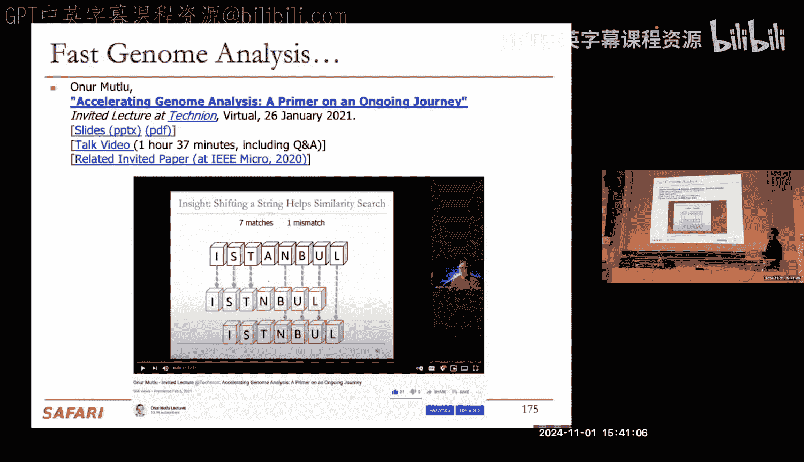

Take a look at these talks， watch them and learn more about this direction。

 we also organize workshops related to this direction this workshop was organized last year jointly V three company companiesies a top conference in the bioinformatics field where we invited speakers to talk about how they accelerate how we should accelerate basically the genome analysis workdos by codesigning hardware software。

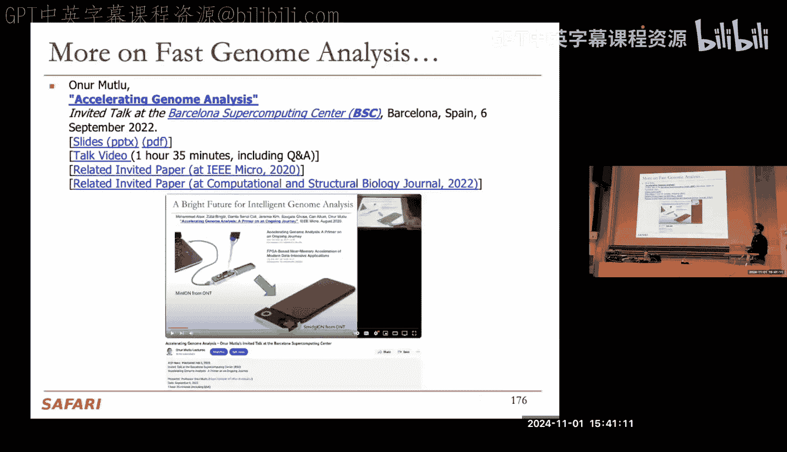

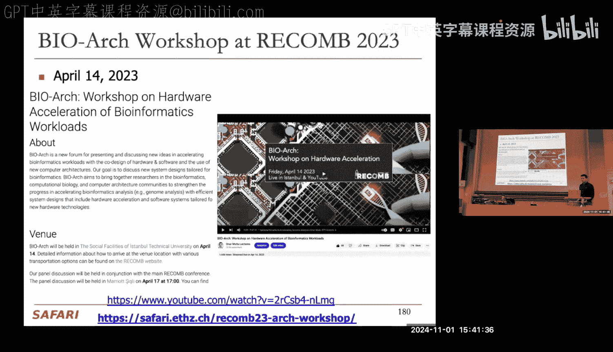

And the entire workshop is available on YouTube。We also provide scheduled organized courses。

 we have this genomics course that we offer every semester and we make the videos available on YouTube so you can take a look at these as well。

So to conclude， today， we covered many recent ideas to accelerate genome analysis。

And also to analyze the genomes in ways that were not possible before， for example。

 the analysis of raw signal analysis and the assembly from the row signals。诶。So essentially。

 enabling cost effective。😊，Fast and accurate genome analysis is important。

 but also another important item here is portable so portable analysis has different implications right so you want to achieve a low power solution that perhaps has resource that is limited by the computation resources so how do you do operations in such resource distinctive environment and how do you do how do you perform your analysis in an acute and energy power efficient way right so these are some important requirements some important actions to take a look at。

And so other question is can we do even better is of course very general question and probably the answer is usually asked for certain things。

 but what I'm specifically referring to is can we。Take a closer look at。The sequencing process。

 the sequencing technologies right so we took a closer look at at Nnopo sequencing today。

 we have discussed a little bit how nano4 sequencing works。

 but actually can we take even closer look at maybe even nanonopo sers or other sequencing technologies。

Forignizing other types of biological data， for example， the proteins。

So I believe many future opportunities exist， especially with new sequencing technologies。

And especially with the new applications and use cases。So with that。

 I'll finish the lecture so if there are any questions， I can take them。

Are there any questions on YouTube？Okay， then we can add the lecture today。

 thanks everyone for attending。

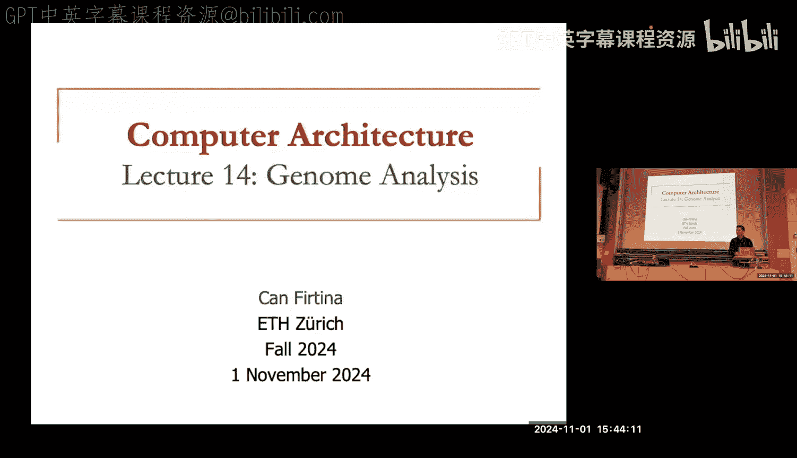