# ETHZ《计算机架构基础｜ETH Fundamentals of Computer Architecture 2025》中英字幕 p21 Lecture 20_ Enabling Memory-Centric Computing (Spring 2025).zh_en -BV1Xc19BnET7_p21-

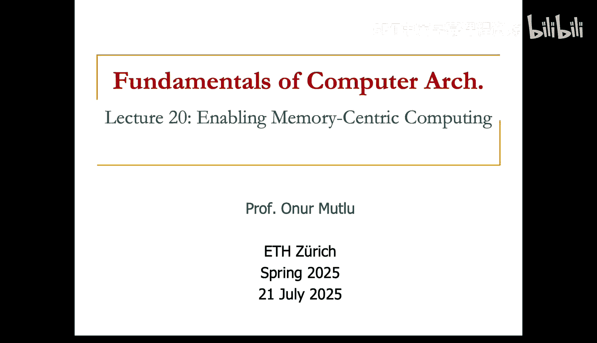

So hello everyone， I'm Geraldo and today are going to talk more about your favorite topic which is computing we are going to on already cover a lot on this subject so today I'm going to try to give a more deep dive on some of the topics that he already covered and I'm also going to announce and show what you need to do for lab3 which is going to be online the handouts going to be online later today。

So you're going to have a lot of fun messing around with memory and computing。So just a really， oops。

 I cannot click。O。Really brief self-introduction， so I'm Geraldo I'm a PhD here in Safari research group since 2018。

 I've been worked with owner since 2017 and I'm about to graduate。

 hopefully I guess I have dreams of that and if I do research mostly on proy memory so if you are interested on those subject or anything that I'm going to talk on the subject here today feel free to send me a mail eventually I get back to you。

Because we all honor students， so it takes time so just a recap。

On what is we are going to talk about here， the problem that we're trying to solve is that data movement is a bottleneck in today's systems and I'm going to try to be quite fast here。

 so I'm not going to promlongate myself much but data movement bottleneck are but movements are bottleneck in systems for a myriad of reasons。

 for example， your application might not have enough data locality to make use of deep cache hierarchies or scratch pad memories on your CPU or accelerator your main memory device or storage or your cache might might not enough might not give enough memory bandwidth for your application so that you can maintain high compute throughput for your system or maybe your latency your trip latency to go to main memory or going to storage when you all of those latencies is too high and then you cannot mitigate this data movement bottleneck so even though this is not a new problem nowadays data movement bottlenecks。

Are becoming key in system design because we're having a push from application and applications we where the money is and we design following that so for example。

 applications like neural networks or transformers in this case have been grown exponentially over time for their data usage and we expect that to continue increase over the year so this trend is just going up and is' not showing that is going to slow down anytime soon。

😊，Or you also showed on our showing in this lecture this work from Google that we did that the problem is not only on servers or in big scale systems。

 but even your phone or your laptop， this data movement bottleneck contributes significantly to today total energy consumption of your system。

 or your accelerator， for example， in Google HP accceerator in this case。😊。

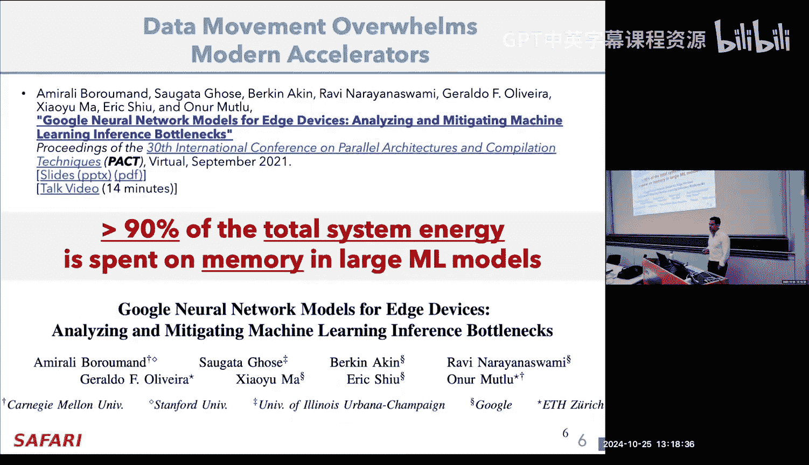

And the main problem over here that is behind this Bo onex both in terms of performance and in terms of energy is that we historically have been designed systems in the compute cas query。

 and this led us to design really efficient processor to a processor doing the precision computation takes on chip takes some picod of energy for you to compute but if you need to go off chip。

 if you need to go to your main memory or twoo storage。

 that is going to consume two to three more two to three the order of magnitude of doing the complex operation。

 so decrease creates an imbalance on how we have the systems today。😊。

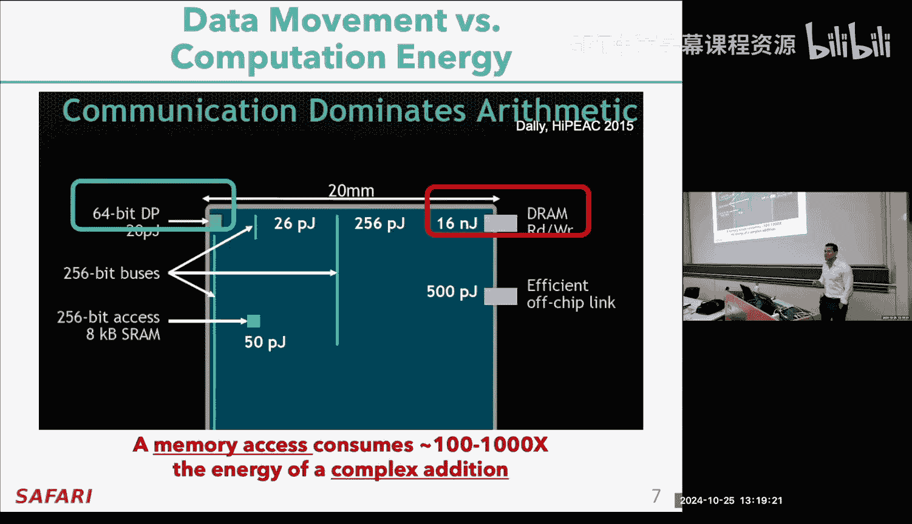

So we have been trying to mitigate these data movement bottlenecking systems with many many。

 many different solutions we are still trying every single generation of your iPhone you have a new and fcir hardware to prefectures that tries to predict before you access the data if the data is and bring the data earlier to the CPU core we have deeper and deeper and deeper cache hierarchies with larger and larger caches over time。

 so the trend of designing computercent architectures that tries to patch this data movement bottleneck problem is still there is not going to go away but this does not fundamentally solve the problem because the fact is that we are doing computation far away from where the data resides and one solution to mitigate this problem is to instead of thinking a compute cent QA we are going to think in a more memory sent QA on designing memory and architectures where you are going to move computing resources nearby the data itself。

😊，And one example that you mentioned in the lectures earlier dismiss of such memory and architectures is what we call proxy memory。

 so a proxy memory harderer have the benefit compared to compute cent counterparts or having access to larger memory bandwidth abundant array parallelism at the same time shorter memory access latencies so if your application is going to be boneck by any one of those components probably a proy memory architecture can be useful to mitigateage those bonecks。

😊。

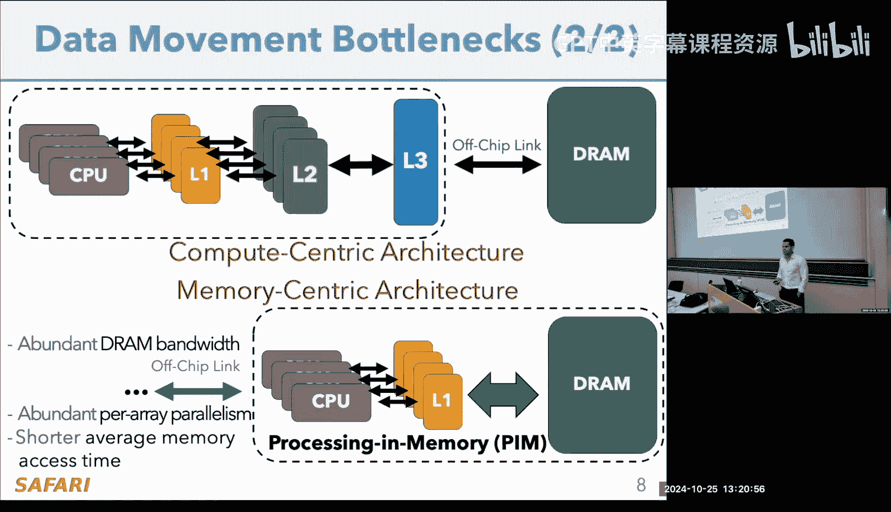

So we also talk about the taxonomy of processing memory architectures and we broke down processing memory architectures into two different subgroups the first one was processing near memory architectures and here we think about those process memory architectures as similar to what we think about regular volume human architecture where we are going to have a distinction between logic and and memory but it's different from a compute center approach in a volume architecture we are going to take this logic and move it closer and closer to the memory array itself the closer the logic is to the memory array the larger is the memory bandwidth and the shorter memory access time that that particular logic is going to be able to take advantage of the second approach that we mentioned in the lecture was using memory architectures and here the process is completely。

😊，From what we are used to in human architectures because we are not going to distinguish the component of the system into computation and its memory here the memory itself is going to be used for computation and we are going to just use the analog operating principles of the memory of themselves to perform computation so that was extremely fast recap of what we saw on the early lectures on processing in memory I don't know if there is any question I guess there was already some homeworks on that so you should be quite sharp on processing in memory but I guess the basic concepts are already everyone are in the same page so what we'm going to do today in this lecture is to elaborate more on those two subjects and we are going to talk a little bit more details about some processing using memory architectures that we've been designing here in Safari and some design principles that we follow to do that design and we are going to spend。

a lot of time as well talking about processing near memory architecture that we didn't spend so much time talking and in particular I'm going to give some focus on this lecture on explaining some some of the real process memory architecture that are out there either as prototype or as commercial commercially available chips that you can buy in the market and then hopefully this can motivate you to want to work on this field after your masters or your studies because those are quite a new opportunity that is out there now in the industry。

😊，Which was not the case when I started doing this five years ago。

 so it's really good for me as well。So starting with processing using memory before I talk about processuse memory I probably already know this by heart。

 but I need to give you some refreshments on how D is organized or device nothing that I talk after this point is going to make any sense to you so again I'm going to give a really quick background on how D operates and organized so if you have any questions related to that feel free to ask after I'm done so as probably already know at this point D is hierarchically organized as a hierarchy of components at the highest level of this hierarchy what we have is what is called D met D met is to D of D cells which are horizontally connected to word lines unfortunately connected through bit lines so the wordline shares local simplifier and the bit oh the D bit line share a looks。

F and the wordline shares a local row decoder a collection the next level of hierarchy you have a collection of those D mats。

 what we call a D subaret and a DRA subaret share global row decoder and a global worldline which spans across the several D mats inside a DRA subaret and a global ssimplifier which spans across is which share across the local simplifiers in the D subaret and your interface which is used to move data from the Dra mats to the outside world to the memory controller。

 the memory channel and the memory controller。😊，So for you to access DRAM。

 two main operations is performed， the forces is one activate。

 so when issuing activates to a given D row， the data in the D cells is read and amplified by the low cost simplifiers and after this data is stch and amplified by the low simplifiers the memory controller can issue written on right command to the data which brings portions of a column of the data to the global simplifiers and eventually to the memory channel。

😊，So we also saw in the previous lectures that we can use these operating principles of DR this activation comm in particular to perform some simple inD operation so we start really simple with inD row copy operations so they go here is to copy one source row to a destination row without involving the D the CPU diearrow and to do that we presented this row clone walk which issues proposed two issues back to back activations to the D row to do this inD row copy operations so when you issuing this row copy operations the first activates to the first row cops the source row to the local and splifier and then the second activate。

😊，I searched the worldlines in the target dur cells。

 which allows the local splifier to drive the data that was previously ledge into the destinationation row hence realizing in D rowco operations and also we saw that by doing so we can reduce the latency of copying4 kilobytes of data inside the dur chip from 1046 nanoseconds to around 190 nanoseconds and also improve energy consumption significantly to do this in Dr row copy operations。

😊，So we also saw that we can extend this approach to do something more fancy so we can do inD majority of three operations by simultaneously activating threeD rows at the same time so when you activate those3D rows at the same time the3D cells involve in the computation simultaneously perturbates the local bit and since what we have here is a differential simiplifier in the local simplifier this differential simplifier is going to pull up the voltage to the majority of the voltage levels in the3D cells themselves so in this case here the majority of blue yellow and blue is blue。

😊，So again， by doing operations in D majority operations like this。

 we can reduce the can improve energy efficiency of inD Booleing operations significantly compared to a baseline CPU die。

😊。

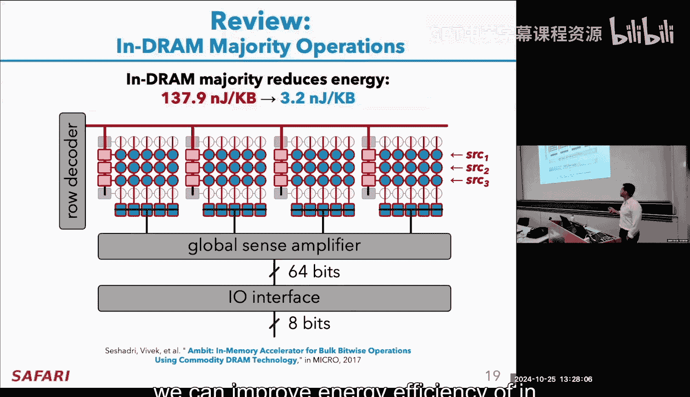

And we talk about this roll clone and ambit papers in details in the first memory and collector。

So hopefully you remember those there was already some homeworks on this subject。

 but now you're going to elaborate a little bit more on how to improve。😊。

Those processes using the operations by doing some more complex operations using those approaches and next I'm going to talk about some of those works which is part of my PhD T。

So the first one is Sdurum again honor briefly mentioned this in the lecture and the problem that you are trying to solve over here is that okay we can do inra rowco you can do inra majority operations this really cute that really nice but can I use this is this useful for to me to accelerate my kernel that does mostly my audition or multiplication or division right so the problem is that。

😊，We only support before this work we could only support some really simple primitives to do inDM computation which can be useful in some workloads。

 but they are not widely applicable to wide range of applications also we have a limited and fixed set of operations so we have those two primitives right inDM row copypy and inD majority and thats it so what if I want to do something else how do I use a new how do I can provide a new flexible primitive for my application to use this type of framework。

😊，At the same time we want to do minimum modifications to the DRM circuit itself because if you think about it。

 if I want to do audit， you can just tell me oh， just put editorer in each bit line in the local splifier and then you can do addition right that is easy and then they solve and then the two first problems here are solved but this comes at extremely high area costs which makes this substrate quite impraccticable to be deployed in real scenarios。

 so at the same time you want to keep the modifications to the DR chip as minimize possible。😊。

So basically the task that we went after to try to improve this work is to design this framework for process using memory that allows the user to efficiently implement complex operations in DurM in a flexible way at the same time without modifying the D architecture or minimal modify the D architecture。

 and the key idea of this work was SD and to end processing using D framework that provides the programr interface。

 the instruction set architecture and the harder support to compute complex operations in D using in Dur massively parallel SD substrate。

😊，So for us to do S D we use two main key ideas， the first key ideas to use a vertical data layout for process using D data。

 so as probably know from the homeworks data is stored in a layout in the D chip in conventional systems in an horizontal data layout so if you have a cache line of 64 bytes you take those 64 bytes you divide them across the for example。

8 D chips that you have in a D rank and each of those 64 bits in one D chip is going to be spread horizontally within one D row across many different D columns so but if the problem with that is that if you need to do some rich corporations that require us to move data across different D columns think about a rip carrier right where we need to move a propagator query from。

One bit to another bit we don't have a way of doing that without including some logic or interconnects that would allow us to move data across the D D columns which comes to its own cost the alternative is to not store data in horizontal data out can store data as we want and we are going to store them in a vertical data layout so here we are going to take those 64 bits inside a single du chip and we are going to in this case here is four bits in the example and we' are going to store all of those bits in a single du column is pending multiple du rows in that du sub which this allow us to do is now we can implicitly shift data using raw column operation so if I want to move this bit here to this bit position here I just row copy this row to this other row so if this is bit this is your most significant bit and this is your less significant bit if I just want to propagate。

Qury from here to here I just copied this bit to this bit using double activations as mentioning roll law another way another thing that this allow us to do is to think of a D sub arrayt as a massive parallel of simply substrate so if I keep doing in D operations here across a different D columns what basically what I'm doing is that I have a single instruction。

 this in D majority operation operating across multiple data each data across store in a single D column。

😊，So now I can see my Durham subet as a single structure multiple data processing engine。

 which I have as many C lengths as I have durham columns in a Durham subet。

 so in Na idea for chip we have around 65，000 D columns so it's a quite very wide CD engine and youre going to see the problems of that later on。

😊，So the other key idea that we are going to use is to use majority based computation for arithme so in the prior walk in the end paper the main operations that we are using there was we are doing the super activations to realize a majority operations but we are always setting one of the inputs to their zero or1 so that we could do bulletole and and or or or operations and we can compose for example a carrier using end and or and node gate right however。

 since the primitive that we have in inD computation is fundamentally majority gate is much more beneficial that for us to just use majority based logic instead of conventional of bulletolean algebra to compose our operations so this enable us to have higher performance because we need fewer cheaper activations to realize a given operation and higher toput。

😊，Tput because the latency is smaller again。So based on that we devised this three step framework。

 I don't know why all of my workss are three step frameworks for something it's never four or two it's only three and this framework takes as input use a desired operation from the user in the form of in or not representation of the gates。

 so this can be， for example， RTL version that describe the circuit it can be a graph based description of the circuit does not matter as long as is's in the form of in or not or I can infer in or not logic based on that input。

😊，And then the first step of this framework， we are going to convert this input into input graph that only uses majority and not gates。

 and then what is left for me to do is basically map this graph into sequence of inD rowco and inD majority operations and the result of this is what we call microprogram which is basically a recipe that tells the DR chip how to realize this initial user input graph inside the D for process using DM operations itself。

😊，So we store this micro programgram as inside the D chip for future use and we add a new SIMD instruction to the CPU ISA so that the user can instantiate this instruction in its application。

😊，Then during the execution of the application， the user enables or includes this intrinsic inside its application and then we have some control unitity the memory controller that understand that this instruction is across using D instruction fetchs the microprogram and then dispatch one by one。

 the sequence of inD rowcopies and inD activations that realize that inD operations in the DM chip itself。

😊，So I'm going to go a little bit in details on those three steps next。

 so the first step here as I mentioned is just to convert the inputs and or node graph into its equivalent majority inverted graph。

This can be done naively by using the same equivalentvalence that the Em paper uses。

 so if you want to do a end gate and you only have a majority gate to just use one of the inputs，😊。

As zero and if you want to do or gates using majority gate。

 you use one of the set one of the inputs as one。😊，Okay。

 it correct so we can so you can take our initial graph do use this equivalentvalence here and then each gate here is going to represent the other equivalent majority gate here the majority not inverted version of the same circuitry however。

 as I'm going to show next if you just do this you are going to you're not going to improve the performance of your circuitry because you have the same number as super activations to realize this graph as to realize the other graph but we can apply some。

😊，G algorithms so this think about logic simplification as you do in Boolean algebra there is the equivalentence of that for majority based graph so you know like there is the mor law all of those laws for Boolean based circuitry we have the same laws is not not is not this exactly the same procedure but it the equivalent of that for majority inverted graph。

😊，And then we apply those laws in a really optimization algorithm so that we can end up with a simplified version of that same circuitry so I'm not going to go through all of those input for this majority vertical graph here。

 but you can trust me that the output of these circuit with four gates is exactly the same output of these circuit here with a single gates so here we move for doing four triple activations to doing only one triple activations with if we apply those circuit simplification logic on top of the initial circuitry so just to summarize the goal of this first step in the samed framework it to generate this optimize majority implementation of the desired operation。

😊，So then we move to the second step and the goal of the second step is to generate this recipe。

 which I mentioned that we call microprogram， which dictates how I can implement that this majority not circuit inD using inD rollcopus and activations only。

😊，So this this step is broken down into two tasks， the first task is to allocate D rows to the input for each edge of that majority inverted graph。

 and the second task is to generate the micro programgram in an efficient manner。😊。

So I'm going to briefly mention， describe those tasks， start with test one。

 the allocation of D rows operations to operate。😊，And to do that we need to consider two main restrictions that we have for process using DRA architectures and these restrictions are actually engineering restrictions they are not they could be lift if you are up to pay the cost for them。

 but the restrictions there is that at least for the first one the second one is more fundamental so the first one is that in the embed design if you recall we take the D searet and we divide the D subt into three groups of rows。

 the first one was the data row there's the rows just store or data some rows that are constant rows so is one row that stores or ones and another row that or zeros and then a subgroup of rows called big group or bit twice group which are groups that are going to be connected to a special row decoder that allow us with a single address activates3 D rows at the same time。

😊，So but those to simplify the design of that row decoder。

 we only have some few of those computer row in the Dra sub so when I'm allocating the input rows for the majority inverted graph I need to take into account that you don't have infinitefin or the number of rows for computations you can think about them as registers。

 the number of registers that you have available for your operations is quite limited so it's like 16 addresses。

 for example。😊，The second constraint is more fundamental and is the fact that when you do triplepro activation。

 this triple activation is destructive， so if I activate the triDam cells of doing a triplepro activations the data store initially store in those3DM cells are going to be simultaneously overwritten by the output of the majority and this happens because when you do the triplepro activation the Dr cell is connected to the local bit right because is what the activation does。

😊，And then when the lo splifier finish the amplification process。

 the charge restoration process is going to start automatically right after。

 so the data that is led in the lo splifier is going to start being written back to those threeD cells that were involved during the computation。

😊，So if you need the data later on for future use， you need to copy it to a temporary row otherwise you're going to destroy that data。

So taking to those two restrictions into consideration， we designed this allocation algorithm。

 which first maps the sign as many inputs as the number of free computing roles as we have available。

 so you can think again actually actually what we actually use for this is register allocation algorithm that is quite common in compiler routines。

😊，I forgot exactly which one of them we use but is in the paper anyway this is just register allocation I'll them and there are many of them in the literature with different trade off so you pick one and then we treat those inputs as those rows as registers basically the second thing that we do is that since after the two activations the three du rows are going to have the copy of the data we are going to use this property to if in the following computation I need one of those inputs I'm going to use any one of those trees here as the input for the following up computation and basically this relax a little bit the allocation because instead of thinking of having only one register which the outputs of my previous computation now I have three register available and then I can use any one of those three which one which one is more convenient during the allocation。

😊，So the second task is that now now that I know how those inputs and output here are going to map to inD rows。

 I can start generating the two pro activations and inD row copies that would realize this operation here。

 so basically we traverse。We traverse the optimized majority inverted graph and then we generate inD row copies for the input row so that we don't destroy the data and then a majority to operation for to realize the input majority dates following cheaper activations and finally a copy to the temporary row to the destinational row for the computation so this should work so this should give you a valid micro programgram or a valid sequence of inD operations that would realize that computation inside the D chip itself but we can further optimize those by following some of the properties of that special row decoder that EmT uses so that we can further reduce the number inD operations that you need to follow so because of some of those properties of that inspecial row deco。

😊，We can coalesce some of those Dra row copies to a single row copy and also coalesce a majority followed by Dra row copy into a single activation activation precharge common because the first activates does the two activation and the second activates does the Dra row copy。

😊，So this give us to optimize micropro， which。😊，Can do that target in D computation in a more efficient way？

So what is led for us to do is that this operation does this computation for only one bit。

 so this and I forgot to mention since we are doing this computation in a vertical called it layout instead now horizontal。

 we need to compute in a bit serial manner so you go bit by bit， so row by row of your data world。😊。

And then in the end， if you have 32 bits， you're going to have to take 32 steps to get the output results that you want for the computation for addition。

 for example， if visa multiplication is worse because bits serial multiplication scale quited radically with the number of input bits that you have so if you have 32 bits multiplication。

 you're going to have to have 32 to the times 32 steps for the computation。😊。

So what is left here is to generalize this one bits sequence of this approach that does a computational for1 bit to n bits if it's something simple as an addition。

 we can just repeat this process here as the number of bits that you have if it's a little bit more complicated because you might have some control or your computation might。

😊，Depend on some of the bits that you just compute。

 you might have some control as well here inside this microprogram。😡，So in the end of this process。

 what we have， as I mentioned， is a microprogram that implements this interim operations in DRM。

 and then we start this microprogram in DRM for future use and we create a new CPU instructions called BVO so that the user can interface with this instruction in the application。

😊，So the final step then is to execute this micro programgram and then basically we want to do it transparent from the user we don't want the user to from the application start issuing in modifications because the application does not have the ability to do that anyway。

 so we basically。😊，Create a control unit inside the memory controller which loads when you issue a B obstruction。

 loads the micro programgram for the corresponding operation。

 it issues the activation and precharge comments that realize that given microprogram one by one and also deals with some control that is required for that。

😊，And in the end， we have the output inside the Dor chip。😊。

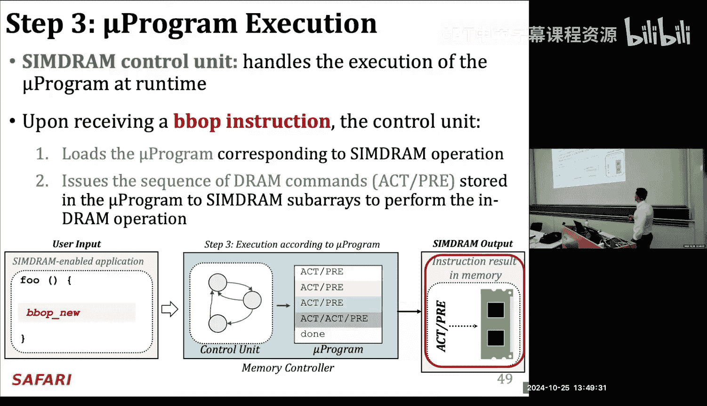

So in the paper， you also discuss several system integration challenge that needs to be taken into account if you want to realize this。

in a real system， the most important one I would say is the data transposition that needs to be happened so as I mentioned in the beginning here we are for processing using their operations instead of storing the data now horizontal data layout you need to store it now vertical data layout。

😊，嗯。But at the same time we don't want to store all of your data in a vertical data layout in the system that is a reason why we store data for CPU in horizontal data layout because we want to exploit the memory level parallelism of your D model so we don't want to break data abstract as well so basically we have this challenge now that we need to switch between sameD layout data in a vertical data layout and a CPU layout data in an horizontal data layout inside the same application and to do that in an efficient way we implement this transpositional unit that that sits between the less level cache and the memory controller。

😊，And basically tracks objects or memory addresses that are going to be used later on for process using D operations during the cacheline eviction PE。

 so if I have an address a here， that later on is going to be used for using D operations Is the address here and every cache line of this address that is evicted to DM because something your application is running right。

 I intercept that cacheline， I transpose this cacheline and then I write that data in a data layout。

😊，In aver delay and then later on， if you need to read that same cash line。😊，From Dam。

 I read the data and then I transport it back to the horizontal data layout and move it to the cache already in the correct format。

😊，So we did in the implement sorry I have a question so the D all the the D is transposed and stored industry or whenever the。

Ws to be used。So not it's not when the p is going to be used so and it's not it's not also the entire du that is transpoposed so only the memory object so this model assumes that you as a programmer knows which as for example are going to be later used in process using D operations so for those arrays that are going to be used for process using D operations you register its address to this object cracker here and every time that a cache line of that particular memory array is evicted to the memory chip we transpose that cache line but only the cache lines that are register here so if I'm going to do addition a plus B equal C you would register A and B and C and then the data will be transpose of A and B every time but if you if there is another if you do a sign between。

D and F which has nothing to do with A andB those data are never going to be transpoposed is going to always be kept horizontally so this is a best effort approach because we have we could have done something different right you could have say right before doing the computation I'm going to transpose the data of AMB but this puts the transposition latency in the critical path of the computation itself because I need to first transpose then compute but here since we don't expect the entire application to be executed in D because this has own limitation we expect that since then there are phase in the application right so you initialize your data and then you move on lit life and then at some point you triggered the process using D computation and then the hope here is that in that I'm moving with my life cash lines of the data were already evicted to the D chip。

So I can transpose that data without putting that latest in the critical path for the process neuro operation because it's going to be overlap with。

 I don't know you are reading a file for something else in the application。

 for exampleization you have to write。😊，这个地面修应的就比较。initial when you're just initializing the data。

 the data is going to be written， initialized to the traditional horizontal data layout。😊。

The moment the moment that the data start leaving the cache。

 the data is going to be starting transpose because you don't initialize data inside the D right so we initialize data in the caches in the CPU in the cache first and then eventually we start being evicted to to D chip。

😊，走。😔，Sure。For increasing the slides here。But the same AB N also needs to be used to get compute the sum。

 Yes， yes。 Now you have destruction of the data。 Yes， yes。 again。

 copy the data for computing a single sum bit again。So we don't compute it twice。

 so it was not clear because I didn't give the sequence for the rip carrier either。

 but basically since I know that that bit is going to be used both for carry and for the sum once I compute。

 I also copy to a temporary row so that I can use it later and don't distract the bit for the sum。

Computing area， twice。We move we move A and B once。

 we move A twice because of how this circuitry is designed， but B is only moved one。

 A needs to be moved twice。K， thanks so much for the questions。

So we evaluate Sd using this CPU simulator called Gen5 and we implement we compare it to a CPU and a GPU and also doing the same computation you following Em format。

 so using bullet and and all operations。We also evaluate four configurations of syn du using one bank for computation。

 four banks for computation， or 16， sorry， du banks for computation。😊。

So we use this three step framework to implement 16 different inDRA operations。

 including AD multiplication， division to attractiontraction。

 and we use those operations to accelerate seven CS7 real road applications。

 including some neural networks and some database primitives。😊。

So in terms of the throughput for those 16 different in operations， we see that。😊。

SymD can significantly outperform the CPU， but it cannot outperform the GPU if you only use one as one bank for computation。

 but if you scale the number of banks for computation eventually you can outperform the GPU as well and this is aggregated across all of those 16 different operations and you also see that it can outperform instead of the system at a time Mbit as well in terms of energy efficiency the results are much better we see that for those 16 operations SimD outperform the three baseline systems。

😊，For energy efficiency and when you consider the end2 end speed up for the seven real world applications。

 we see that SiDM cannot perform the CPU cannot perform the GPU depending on the number of DM banks that you enable for computation and can outperform Em as well。

😊，So there are many more studies in the paper， which I guess I don't know if it's a required reading。

 but maybe it is the consulting have a question sure。How。Is there a lot of happens。

 Is there something that different the user from the rate one computation happens。

So we discussed this in the paper this BO destruction is just integrated in the pipeline。

 so there is no need for a lock because this is not operating as a site accelerator itself the CPU still controls everything so this BBO ob is treated as any other load destruction so is registered in the MSHI entry goes through the memory hiarch bla b blah and eventually needs to go back to the CPU as well So if the CPU is going to depend on that particular BO destruction as if it' depending on a load so is waiting for it to。

To move back basically。 So is， is， is in that sense。

 this is not S a synchronous to the CPU I is there and also is there a link to the size of the problem that we can execute because the sub has a limited size。

 Yes， and is there a support for using sub。Moving data betweenNot in this work here。

 we don't for all of those operations the data fits or can be partitioned in a way that we don't need to move the data across the different D subase。

 but we discuss in the lecture here， these laser paper which connects the subs using some isolation transistors and we can move the data using that approach for example。

 so if you need to move data from one separate to another one because it does may not fit。我说。

The number of elements you on pretty much。It has to be at least in the size of the room。

 size of one room。It to be beneficial it needs to be in in at least the size of yes， to be for you。

 yes， to be fully utilized。If it's more than one would。

I'm going to talk about this later on because it's the other work that year I'm going to mention。

So let's take a break before I enter to the next one。And I guess I' just going to follow the billll。

 so you're going to take a regular 150 minutes break until then we'll come back everyone。

I need to hide that。啊。Okay。So。Where we were so we were doing processing D operations right so now we can do inD or copy。

 we can do D majority operations using Embed and we can do arithtic operations using SimD so if I want to make this a compute engine can you tell me what type of operation that are missing。

Sure branches。Yes， that is one for sure， other than control。Okay。Does anyone have any idea， idea？

So how do I do a？Orcoさ。Oh楚。Yes， so if you want to do。

 there is a class of operations called transendation functions that you can approximate using R operations。

 but you not necessarily can compute them or they are tabulated。😊，嗯。

Or like they because the space is， they are coming from a continuous space rather than a so。

The goal of this paper is to of this Pluto paper is to。

To close this gap so basically here we want to further extend the capabilities of process using D so that we can do complex operations here and complex in this case here in particular are those that are required for transcendational functions so the key idea of Pluto which is our solution for this is a quite old idea。

😊，So instead of usingriM corporations to do a particular computation。

 we are going to precomp that computation and store that into a lookup table and then we are going to replace the operation with memory read and basically a lookup table access and then we have our output so this is not new this is what fPJs does for example。

 but we are going to realize that in the ineffient way in what we call Plutoup lookup table query operation。

😊。

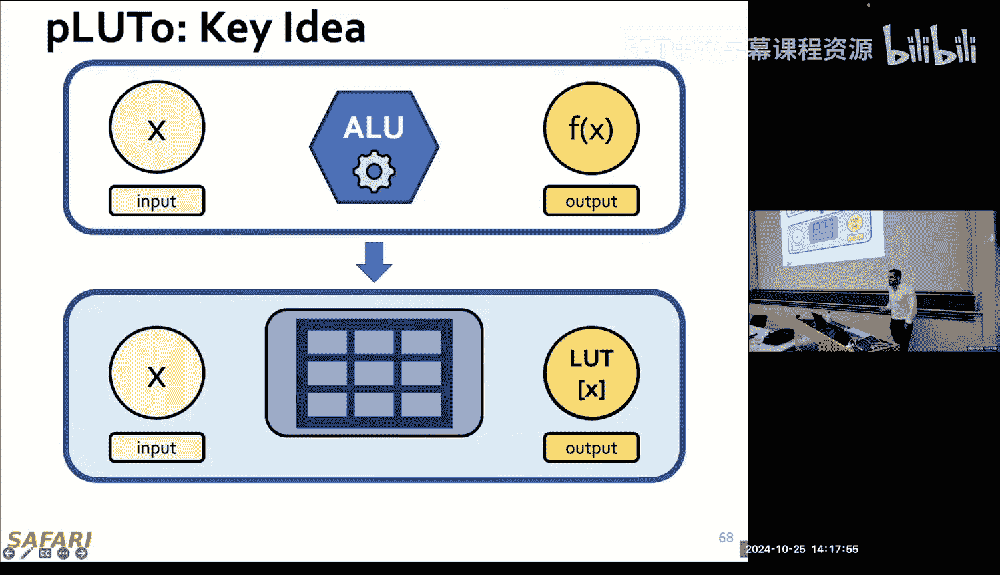

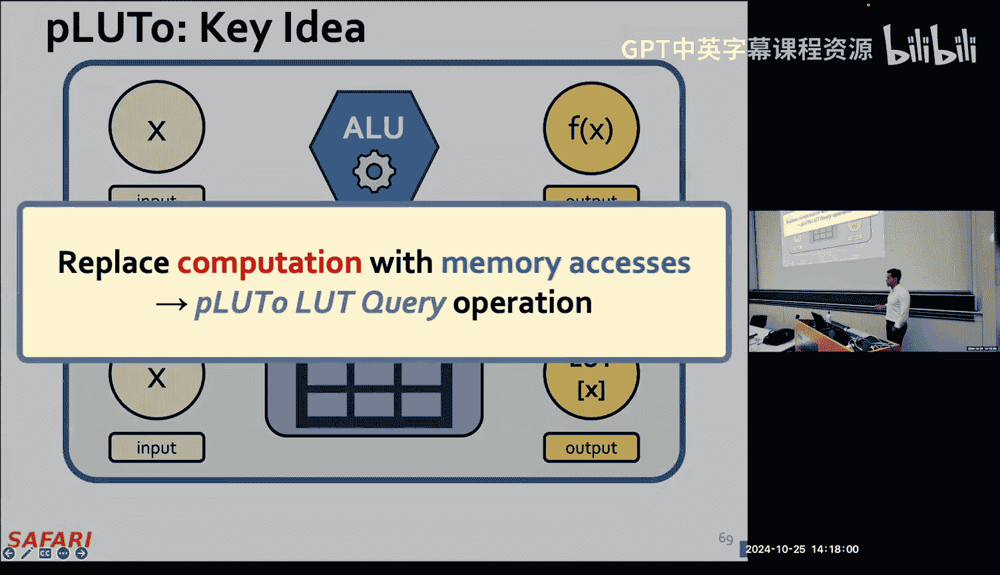

So I'm going to illustrate how Pluto works with a running example。

 so let's say that it's not necessarily a translationation function， but the same principle applies。

 so let's say that you have a lookup table query where I want to return the second。

 first second and fourth prime numbers in a natural sequence。😊。

So before doing anything I tabulate what are the sequence of prime numbers so the first prime number two。

 the second prime number three， the third prime number is5。

 the fourth prime number seven I start this in that table and I index them in order So the root index zero is going to point for the first prime number which is two the lookup table index one is going to point to the second prime number which is going to be threea one and so forth。

😊，Then I'm going to translate this query that I want to return into my input vector which are indexes to this lookup table lookup table that I'm going to query。

 so first one here is going to indicate the second prime number。

 zero here is going to indicate the first prime number。

 three is going to indicate the fourth prime number。😡。

And I want to have as an output in this output vector3，2。

3 and7 which is the second prime number the first prime number second prime number and the fourth prime number so now I'm going to start mapping those instructions here into in DR structures in Dam subt and so on and so forth so in one D subt I'm going to have the input vector that you want to return that you want to query in this lookup table query operation。

😊，And in another duur subee， we are going to have this output vector。

 which is going to be the output of my lootop query operation。😊，Then we are going to have the D sub。

 which is going to install this lookup table here and we are going to paint the du bank with some matching logic which is going to compare input the row that the row ID that I'm currently accessing so row0。

1，2 or3， is ID which with the inputs of the input vector。

 and if I have a match between the row that I'm currently accessing。

 and one of the element of this input vector， I'm going to assert some matching logic that connects the row buffer to the output vector which is going to allow us to copy that data in that position to the output vector。

😊，So as I mentioned you are going to have the lookup table store in the Durham subaret and you are going to have multiple copies of that lookup table store inside the durham subt so that we can exploit the dur parallelism so you can have many elements in this lookup table operation here as we have in theory du as the size of the Durham row is' not the size of the Drham row depends on the bit precision that you are using here。

 but you get the idea。😊，So to operate this we are going to create a new instruction called Bluelutto row sweep this works similar to how auto refresh operation works。

 so we are going to start activating each one of those du rows one by one in order。😊。

With a single du operation so let's see how it goes so the first once we receiving this pluuterero sweep operation we activate the first du row which operates as any other D activation copies the input copies the dating that du row to the row buffer and now my matching logic is going to start asking some questions all of those questions happens in parallel of course but I'm going to show here in serial so we can extend together。

😊，So the first question is going to start this row the matching logic is going to start comparing the address that I'm currently activating so address zero with the element of my input vector and a certaining the output the matching logic in that appropriate place that we have a match so I'm checking the first input of my input vector so I'm currently in accessing row zero not I'm not currently in row zero so that that position is not going to be asserted I'm currently in accessing row0 which yes this is true so that particular position is going to be asserted and I'm going to copy the data。

😊，From that position in the row buffer to the output vector。😡，Am I accessing row one， no。

 am I accessing row three， no， so no other connection is going to be made in those isolation resistors so nothing else is going to be copied to my output vector。

😡，Okay， this activation is done I move to the next row then again this process repeats and the matching logic starts asking questions again now I'm going to have a matching between the first element of my input vector I'm accessing row1 and the third element of my input vector as I'm accessing row1 again those positions are going to be in the matching logic is going to be asserted and I'm going to copy the data from my local row buffer to my output vector in those positions that were asserted。

😊，Then I move to the next row， row two， I don't have the data scopepe to the local row buffer。

 I have no matching in my input vector， so I'm not querying the third prime number in my lookup table query and then I move finally to the last one to to the third row。

😊，For flow index 3， and then I'm going to have a matching in the last position of my input vector。😊。

So then I in the end， I have in my input vector， the output of my lookup table query here。

 so first the second prime number lootin index1 is three， then the first prime number is2。

 the second prime number is three and the fourth prime number is seven。😊。

Sure questionion assuming horizontal yes， it just here just we went really good question。

 we went back to the horizontal the play So this two here is just a store like 10， this is just10，00。

10，11 so on and so forth。😊，Okay， so the question that would be natural to ask now is how do I implement this matching logic here and because that what leads to different tradeoffs so because of that we we implement three different versions of Pluto which have different tradeoffs for the matching logic so the first implementation is what we call the buffer amplifier design which is going to use is exactly what I just mentioned in this example here is going to use some auxiliary data to store the temporary data as I progress across the different rows in the output vector so this is just some extra flipfl that when I'm asserting one particular row I'm storing the matches so here for example7 here in that particular flipflop and after the competition is done I copyied that data that flipfl to the output vector so this is one。

😊，DeThe second design is what we call gate se splifier here we are going to use the se splifier itself of the output vector to store that data as I progress in the Ptoose suite operation but this is destructive of the data in the durham cell that I have here because once I copy the data dis splifier charge restoration process going to happen and then I'm going to destroy the data that was stored here in the Drham cell。

😊，The third design is we call gate memory cell and here we are going to have a extra access transistory in the D cell which connects to the matching logic so now I'm going to only de this data if I have a match before I always destroy the data even if I don't have the match。

😊，So all of the three designs have different tradeoffs as I mentioned in terms of performance energy efficiency and area efficiency。

 the first design， the Bel splifier one which uses those flip flops having the being the middle design has middle performance middle energy efficiency and middle area efficiency sitting in the middle between those three and the second one the get simplifier which again uses the cells the data splifier to store the data have the higher area efficiency because I'm not including any extra transistor although in the mesh logic but have the lower performance in the lower energy efficiency because I need to do a lot of copies to restore the data as I go the third design the data splifier has the higher performance and higher energy efficiency but the lowest area efficiency because I'm including one extra or have so many animations here one extra transistor per du cell。

😊，Include a lot of area course。So basically the we cover those three designs and depending on for which we are designing for you can select the appropriate Pluto design。

 so in the paper we also discuss some system integration which allow us to have some some C like code using the Pluto APIs which are converted to the some series of internal operations all operations bit shifting which are required to realize that。

😊，Those raw copies or matching operations and finally some execution energy which triggers the appropriate interim row activations and precharge to realize that computation and for more details on those。

 I invite you to check a paper and this beautiful figure that I draw。😊。

So again we evaluate Pluto in simulation our simulator is available online and in the paper we have a lot of analysis but here I'm going to focus on performance and energy we use Pluto to accelerate seven real road applications which were not previously supported by prior works including Sderran because I couldn't they would require some sort of transcational computation so I couldn't accelerate them using prior approaches and enforce synthetic works like that have those additional multiplication which were supported by Sderra。

😊，So here is the performance of Pluto compared to this CPUU GPU and we also have a process in linear memory architecture we use through this tech memory with some logic for computation and we see that。

😊，Pluto depending on the configuration that we use。

 Pluto cannot not perform those architectures with varying ranges depends on the baseline architecture of course。

 if you normalize it to area the results are much better because the area of the dispute NP is much larger and also we have significant energy savings compared to the CPU and the GPU。

😊，So this was Pluto there are many more details in the paper so now we are all good now we have in the U row copy。

 we have in majority bulloleing operations， we have arithmetic。

 we have transational functions right so now I can go take my application and map whatever is there I I' ready I can map my application to this process D application this process using D substrate and have great performance benefits right no that is wrong and this was actually related to some of the questions that was asked before so the main problem that we identify with this using D substrate is that it actually one of also its main benefits the parallelism the parallelism that this system provides is really large so when youre bit zero computation or even bit power computation using this Pluto like substrate your gl la is at D row so you always need to operate。

😊，Of mood pose of adira row so an adiam row is really large。

64 kilobytes in the DR4 tubes right the question is。

 do I always have mood pose of 8 kilobytes of data in my C like application so that I can fully utilize that bandwidth and the question the answer is no so basically。

😊，The way that I got to this realization was that when I was looking to the application that I would accelerate in the Snderran paper。

 I suffer a lot to find those seven row applications which could fully utilize the substrate and then I realized that okay this is good for seven applications but this is not good for 200。

😊，Because those two other 200 applications what actually happens is that applications and loops inside the application have varying degrees of parallelism。

 so sometimes you have sometimes you have 8 kilobytes of parallelism and then that's perfect but sometimes you have 1。

5 times this size of the D row or 10。3 times so to what happens to that tail that is left right so that tail that is left is generating under utilizationilization and hence you're losing throughput you're also increasing the baseline energy consumption because you're activating Dr rows that already going to generate zeros which is going to consume more power for your system so basically the problem that we identify in this followup paper that I'm just going to mention is that currently du system suffers from this severe semi utilizationization problem because the growing layer of computation is fixed。

😊，Rgiids is always 8 kilobytes。The second problem is that I don't know if you may if you realize。

 but Im always talking about computing an array so I have one array and I have a second array and then I generate a third array so what happens if I need to do a reduction so if I have one array and I need to reduce this array into a scalar I cannot build this computation in the substrate because I don't have communication across the different D columns that would be required for that。

😊，Finally， in particular for the SD and also from Pluto you need to program this as if you are programming assembly。

 so you need to tell the you need to go to your code。

 identifying which operations are going to be good for process using D computation if we have a loop need to unroll this loop。

 need to insert those process using D operations for addition totract and Pluto operations whatever you want to do and this is quite put a lot of burden in the programmer so the programmer this to be quite an expert SD programmer to efficiently use this。

😊，So to solve these problems， we owner already mentioned this in his lecture。

 so I'm going to be quite fast over here， I just want to give more details on the hardware design。😊。

We propose this system called mem Dham so MIm Drm uses this idea of a fine grain Dm for prous Dm computation so in fine grain Drm basically we have this Dm sub and as I mentioned the background in the Drm sub we have several Dra mats right but when I activate one D row that is this global world line that propagates across all of the Dra mats and activate all of them at once。

😊，Instead of doing that， we are going to segment this global wordline。

 so you're going to put some mod resistance here， which allows me when I activate a D row。

 I only activate animations broken， I only activate those Dra mats that are going to be involved doing computation。

😊，So basically this allow us to have a more flexible7 laity， so if we have a 1。

5 vectorization factor over your loop I activate only half of my mes。

 I don't activate the entire set of mets in a D sub for the second portions of the computation so this improves throughput and improves energy efficiency of the substrate。

😊，So the other thing that this allows is that if I only activate half of my mats for one operation。

 if I have another operation that is data dependent from the first one。

 I can use this other half of those mats to execute those those remaining bits of that computation that is data dependent so now I can instead of looking at this substrate as only as a same destruction。

 multiple engine I can look as a multiple instruction。

 multiple engine multiple engine because I have multiple instructions operating across different D mats and at the same time operating over multiple data so across the different D columns。

😊，So the second thing that this allows is us to do reduction。 So basically。

 we can use that global splifier to move data from one Dra mat to another Dra mat。 So hence we can。😊。

reduced the data into some somemiscalear value。😊，And finally， then this is it comes as。

As error comes for free but comes as not for because we need to change the design。

 but usually the size of this Dra mat here is 512 rows by 512 columns depending on the D organization might be 512 columns by 1000 rows but it' always around that because we don't want to make those columns and those word lines too long otherwise the impedance get high and the capacitance as well so because of that so since each column here is a S lane basically we have 512 s lanes in these single D mat here and this is the same number of s lanes that you have in vector ISA instructions like AVx 512 exactly that so we can reuse those AVX instructions or vector instructions for CPU Ias and consecutively their compiler support to map code。

😊，To this substrate here in a transparent way from the programmer。

So I'm going to briefly talk about the harder modifications that we do to realize this substrate。

 so inside that D sub array what we need to do basically is to segment that global wordline that I mentioned before with some isolation transistors and some latching so that I can address each one of those D mats as I want and I need to have some selector logic to tell which one of those isolation transistors are going to be ased during the process using D computation。

😊，So the next thing that you want to do is to move the data across the Dra D mats and for that I'm going to give a little bit more background on a D column request so when you accessing a D column the data does not necessarily go straight from to the local row buffer here today your interface it it is further amplifying across across that column X path so that the signal integrity becomes higher and then you can move the data to the memory channel in a reliable way to do that the D chip uses some extra structure so there are this thing called helper flip flops here those are just some flip flops that sits in the edge of the D mats that once you read the D column the column data is first move into those what into those help or flip flops so am amplifying the signal and then from this helper。

Fps to the global simplifier and eventually to the IO interface。

 So we are going to use this global and local amplification path that already exists in the D chip to allow us to move the data we and across the different D mats。

😊，So to move the data across the different Dramats。

 we are going to extend the global se splifier with interconnect network which allow us to move data across consecutive neighboring DraM and to move the data we think at Dramat。

 we are going to basically repur this helper flip flos here to basically allow us to have a temporary buffer to copy the data so let's say that you want to copy。

😊，The data from this column here to this column over here。

 so you read a column as is read regularly for a column request and this is going to allow is going to letch that column data in this help of it flip here next instead of。

😡，erasing this data in this helpgraphfi fl here when we move to another column。

 we are going to keep this data in this help offi fl and just change the column address to the destination column that you want to copy and this is creating basically a path between this lad this helpgraphfi fl and the target se splifier in in the match structure here and another purpose that we have is that the driving strength of this helpperfi fl here by design is higher that the driving strength of this lo splifier here so this allow us to copy the data from this helpgraph fl to the lo splifier by just changing the column address。

CoNot really， so this is independently for using our gym or large gym this mechanism is employed regardless so this is a common mechanism to because basically this locus simplifiers here are all of this design of this entire area here is quite area constraint and you want to make this lowus simplifier as is strong as it needs to be to very sense thetu the voltage perturbation that the cell is going to put in the bit line so they are not they don't to make them really big because that would occupy a lot of space in the met design itself so what they do is that they put this extra you can think about I like to think about is not correct but like to think about them as yet another simplifier which is a bit stronger than the previous one but its only I don't have as many of those as I have in the locus splifier。

😊，So the local sifier here I have512 of them here I have only four。

 so then I can make a stronger circuitry， but at the same time not consuming much area because I have less of them our gyms and our gyms they are there as well for signal integrity both for data and for common and address but those are some buffers that are placed in the gym itself so we have your DR gym and in the PCB of the gym you place some extra buffers so that before move the data the data is or the column address that is amplified and that again improve signal integrity so hopefully is outside the D tube basically。

Okay， so basically we use this help of this intra intra mat network to perform inter reduction operation so basically here what we are doing is implementing a reduction tree so let's say that you want to reduce you want to reduce this the address of A and B into a single scalar so basically what we do we compute the first step of that addition and inside the move the DRA mats here and then as I mentioned we are implementing a tree so then we need to move the data from one mat to another mat and then we do again the addition but only involving that second mat here and then this process repeats across the different columns inside the using the inter network as well so I didn't draw。

😊，tree here but hopefully when I say other tree you understand more or less that this is just basically if you spread the data and then you do one editorer with another add here in one level and then another node here and it connects the input of the two previous ones and then you will keep repeating that in that tree structure I should have drawn this I just realized that now but anyway。

😊，So hopefully is more or less clear what is missing now is for us to control this computation so the control is a little bit more complex than the SD control because now we need to schedule different mats depending on the target metaization for a given process using D operation so basically we have some some structures for doing that so a met scheduler and as score boards to keep track on which method currently being used and we replicate those control units in SD so that they can operate independently across that independent process using D operations across the different D mats in the D sub。

😊，So this is the hardware design of Mim Dm so in the software site we implement some compiler passes on top of LLVM identify loops that can be candidate for process du computation is schedule do some precacheduling of the computation so that I can tell my control unit that some operations need to be executeded in the same mat because they are data dependent sub operations need to can being in different mats because they have no data dependent between them and finally we do some cogen so the first pass here is responsible for identification so basically you just reusing what LLVM has for loop out of vectorization so we take a loop we auto vectorize the loop and that we generate some vector instructions here and instead of just using regular CPU vector instructions we are going to converge those vector structure。

😊，down the line to process using D operations and this auto vectorization engine allow us to identify what should be the target vectorization factor for that sea disruption so for example this loop here operates over 1024 elements so the maximum vectorization factor that you can use for this loop is this number of oilscalealar operates that is going to be used which is 124 so if this is 8k for example。

 then you fully utilize the match if the sub arrayt if it's 512 you're fully utilizing one met。😊。

And since here is 124， I know that the size of that mat is 512。

 so I know that I need to locate at least two Dra mats for that computation。😊。

So the second path so after I vectorized the instructions I can generate the data dependence graph of those vector instructions。

 so let's go back to the C code， so in this C code here A and B generate C and D and need generate F so those two operations here they can can operate in parallel because they are data dependent but this third operation here C minus F they are dependent of the two previous instructions so need to so there is some data dependence here right so this means that this first operation and the second operations can execute in two different eramat concurrently but the third operation is to。

😊，Needs to wait for the two previous ones to execute and so basically what we do in thischeduling routine is to identify those patterns and then use some metadata to tell the control unit later on that oh when you fetch this destruction and you fetch this instruction is execute that in parallel but when you fetch the third destruction weight and execute them in serial and also in serial to the previous two ones and also I need to identify that since I execute this instruction in one mat in this other one in the other one and I have this one that depends on both of them I need to move the data from this mat here to another mat so we also include this data movement instruction that use that those interconnects doing the computation。

😊，And finally， the third path just generating the binary codes and triggering those BBO instructions for the computation。

😊，So this mini paper is quite。😊，Dance paper because we try to cover a lot of system support that needs to be done so that these works in a real system and one of the key things that needs to happen is data location and alignment so now I need to find a way to map my to know that some given data structures are going to be placed in some given neural mats and we need to be aligned so that I can as execute the computation while fully utilize the substrate so basically I need to find a way to。

to influence the memory allocateocator routine so data can allocate data dependent。😊。

Not that operations that are going to execute together inside the same Dramat and operations that going they are not going to be executed together across different Dra mat and to do that basically we use so we create this new Pal location algorithm。

 P Ma lock。😊，Is a in a lot that basically uses huge pages so huge pages give you this feature in the operating system that physical frames are going to be conuous on the address space so this is everyone one property and then but it does not guarantee you that those physical frames are going to be continuous inside that D sub array or D row or D or one of those things because we have the D interlaving scheme that is going to spread that frame across the different elements of the D cheap itself so we need actual information we have this reverse engineer D interleaving schemes and this is basically a function that tells me oh based on this address can I know where how this address is going to map across the different D channelss banks columns and subares are met so if I want if I want to for a allocates to add arrays in the same D mats basically I need to apply the reverse of。

😊，D function， and then I know how I should map those bits of the addresses space。

 and then I can compose the allocation according to。

 So this is way more involved that I'm mentioning here。

 but I'm not going to go into much details over here。😊。

So we again evaluate this using the Gen5 simulator using 12 workload for four benchmark mark suites。

😊，So in terms of performance efficiency， when you are executinging those 12 applications。

 we see that Mime D significantly perform the CPU， the GP and S D operations。

 and if you have multiple applications as executinging at the same time。

 s minime D can outperform S D because now we can execute those multiple applications across the different Dra mats of a single D subaret instead of having to spread those applications across different D bands。

😊，嗯。We also compares Mi Dam to other two processing in memory architectures so Dza architecture here。

 this paper was published at the same exactly year that EmbitIT was published in exactly the same conference in the same session and they do something they do the same thing in different ways while Embit does those tripleper activations without inring much area costs Da paper takes a completely different approach and go full accelerator mode and they add some nor gates to each bit line of a D sub arrayt so you can do bulleting operations in D so we compare to that substrate and to another processing ear memory operations which uses a scalar LU engine at the edge of the subart to do a scalar operations in getting a processing near D type of substrate and we see that。

😊，M duurm can outperform those architectures in terms of performance per area because you are not in much performance course area course。

 while all of those two other ones are including extra circuitry so that you can do the computation。

😊，So there are many more results in the paper which I'm not going to cover over here。

 but what I'm going to cover is what is left over there to be done and there are things left to be done because I didn't graduate as a PhD student yet but yeah even after that hopefully there are still would to be new things to be done because is my me to graduate so have a question yes。

So the throughput was elevated because we are just allocating as much CD lanes as the operation is to be whereas as the vectorization factor that the compiler idifies so if you for example。

 if if you are doing s du and the vectorization factor of your loop is of half of 64000 so 32000 the synization of sder is going to be half of mu duram is going to be 100% because you only allocate those。

😊，So those given D columns and on top of that we improve throughput because for the other half we are doing something useful other than computing on zeros。

Okay， so what is there to be done in process using I'm sorry， I have another question。

The effect of the inter connect modifications。So all of this is based on another prior workov Firo。

 which over there we did is also from Safari and uses something similar to move columns across different neural banks and over there we did some sp simulations to see the latency of moving like basically asing that column column multipleor and it the same column multiplero we didn't redo it because it would be the same result。

 but we reference accordingly a point to that paper。Okay。

 so some limitations of the current substrate， so data conversion layout is a big thing that needs to be solved in this process using your substrate because。

😊，At some point， if you don't have enough。Computation to a more size data transposition overhead this data transposition overhead is going is going to dominate the execution time of your application so this is not only true for pro using D or it might think like oh you just this is artifact of your own stupidity like you create this problem in Sd and then just following up with this so this is this is not only like Sd or mini du that follows this protocol and it's not only du base pro using pro memory architectures so base pro using D pro memory architectures from exactly the same problem because they also need to transpose the data and operates in a big serial manner if they don't want to blow up the area with interconnect so and the same thing happens for flash base so is just。

😊，The execution model is an artifact of the execution model that leads to the least amount of area cost consume for interconnect we are we are already trying to solve this problem I don't have I'm going to give a little bit of icepoer how this can be solved if you just take that figure in Siran paper figure four and then if you rotate your head like this you are going to understand how that needs to be solved it's just it's just that actually i'm not going to talk much because I'm writing a paper for Ica and I don't want to spoil myself but it's basically how you should do it you just flip your head。

😊，So the other problem is highlighting for B theory operations， as I mentioned here。😊。

Mulplication and division scales quadraically with the number of the target bit precision of your computation and this basically means that。

😊，The latet is going to be quite high for those operations itself。

 so we also did some work together here with Mayan that look into alternative implementations of those microprograms that can lead to more efficient operations efficient multiplications or division operations as well。

😊，Application is scope is a big is a big thing as well。

 so I personally tried to be general purpose in my work so you saw there it's like always a bunch of benchmarks from random benchmark which is because I'm trying to go for the general purpose scope but the fact is is that the way that industry uses workss is by killing applications so we need to find what is going to be the killing applications for this processing using neural architectures so right now the trend is transformers。

 neural networks， all of this but the problem that those architectures what it does is mostly genV operations right general multiple applications and as I mentioned multiplication suck so it's not necessarily a good fit for that at least this type of substrate but there are some workss in the literature that tries to or shows that depending on how you design the system you actually can accelerate those transformers with those。

Bit serial procedures in the architectures， but still we need to do more work over there to improve that。

we also need to do more space efficient loo computation。

 so the way that we are doing the loo computation in flu toy is。😊。

By taking the lookup table and indexing it directly right so this means that the size of the lookup table is going to be limit by the size of your D subbot which is not good so if the between four of your lookup table is start to increase then all of the blue you're not going to fit into a single D subbot one way to solving that is by hashing so you can hash the input and then map that hashed input into the D subbo itself we didn't looking to that we actually start looking to that but then we didn't follow up so this is why I'm giving this spoil so if you want to do that you' free is not going to be my but yes you need to find better hashing mechanism for those lookup table computation。

😊，Another thing that is ice spoiler is execution models for tuput oriented execution。

 so in Min Dham I'm trying to or we are trying to take S disruptions and exploit sD paralleluralism only to as a good process D computation but SD paralleluralism only is not good enough for toput oriented accelerator we see this all the time with GPUs which uses on top of SD level paruralism also trade levelism so both combined together so that they can have good enough utilization to utilize all of the CD core on the GPU so we need to move into that more toput oriented execution model so that we can fully utilize all of the D subares。

 all of the all of the banks， all of the chip all of the models all the easy scales really quickly right if you fully want to use the hydro for。

😊，ComputationSo we can do we are working on this and we can improve those one step of a time。😊。

Especially。If you have to do a pageD on the topic so this is Mindam and Pluto I don't know if you have further questions on those otherwise I'm going to pull up an on and I'm going to delay your break a little bit more just going to give this introduction to process near memory architectures and then before I go to the real world once you go to the break so this is going to be。

😊，A shift so we are going to move from processing using memory so might say shift we are going to processing your memory now we want to add logic near the memory chips itself so that we are going to do computation this is something that is really important to know if you want to design this type of systems that you cannot do whatever you want and this annoys me a lot as a reviewer sometimes that people design process near memory or proposed processing memory architecture sometimes as if is a silver bullet to any problem and it's not when you are doing processing your memory you are operating at very tradeoffs a very strict tradeoffs when you are deciding which logic you are going to do for computation。

So the first tradeoff that you need to think about is area so when you are designing a cheap memory chip and you are going to embed logic inside that memory chip you need to always remember that your memory chip initially is not there for computation is there storing for density storing bits and once you start messing up with that you are decreasing the density of the memory density of your chip and it might looks like a re hole okay maybe I don't care about density but at the moment that you are decreasing your density youre also increasing the potentially increasing the memory bottleneck that your application might suffer because if you don't have enough space to store your data at some point you are going to have to move that data in and then do the computation so at some point you're going to end up in a processor center to set up as well we are going to see how this realizes on the real world application that real world chips that I'm going to mention later。

But one good example here is that at the time of there was a hype of designing processing in thes around 2013 to 2020 using this architecture you called HMC。

 this does not take this anymore， but still you have now these HBM chips they are quite similar in scope。

 but basically those ships were those ones that we have some3D tech。😊。

To this taking of Dra layers with a logic based die and in this logic base dies you could put some computation but first you are limited in the amount of area that was available in the basic die so in this HMC for example。

 was 4。4 millimeter square and 212 millimeter watt per vertical partition that was called a vat for computation so it was quite limited and。

😊，Even though I tried to trace back this number here and then I couldn't find we start with this but there even though this might not be 100% correct or traceable is still the effect is the space is limited then the power network is not strong enough to follow up whatever you want so you need to take that into account the second problem is thermal constraints so。

😊，If regular we are not used to have heat sinks on top of Dur chip right the heatC is designed for or active cooling is designed for processors or or GPUs or some that right so we want to keep the Dm at that point as well otherwise we are going to lose the energy efficiency edge of processing memory architectures and if at some point the processing capabilities of your chip becomes two costly and start generating a lot of heats we need to move from a passive cooling systems to more active cooling systems which is an active research fe for through tech architectures for example so this means that that will be costly so this also needs to be taken into account。

😊，The thirdri one and perhaps the more important one that the reason that took us so long to have process near memory architectures is because manufacturing logic plus D is extremely difficult and its really difficult because those two manufacturing process have been heavily optimized for for different tradeoff they contradict to each other so logic have been heavily optimized for speeds where DM have been heavily optimized for density and if you try to implement logic using the D manufacturing process is not that you cannot but since the process was not designed for that you are going to end up having a logic that is lower than if you just manufactured that same logic using the correct most manufacturing process so that is this old dish paper that does a analysis on that and shows that if you just do some wool gates using D。

😊，Confecting process your clock frequency of those that you can clock those gates is going to be lower than doing the same gates with logic and we are going to see that this is going to affect a lot the clock frequency of the processing your memory hardware that you're going to that manufacturers are putting out to date so this means that basically that your core you are going to do this processing in your memory architectures is great you're going to alleviate the movement bottlenecks but you as a designer have a really difficult test because you going against much powerful core or for the core or GPUs at the same time your hands are more or less tight because you don't have much area to spend you don't have much power to spend you can knock cool down the system and whatever your design is going to be lower so is a really interesting tradeoff point to be。

Even though that might be challenging is feasible so all of those works that On mentioned。

 for example， the Teer Act paper， the neural Google Ne network acceleration for Google CPUUs and for Google workloads for consumer devices。

 all of those papers we tries to deal with those tradeoffs and in the end we can manage a design point which provides us more performance or energy efficiency compared to the baseline CPUUs or accelerators。

So before going to the break， just we are going to talk about Rio processing ear memory architectures next and this is a great time to think about working on processing in memory and processing your memory in particular because before all of these these before when I started doing processing memory was 2017。

 it seems like dream like that one day in 15 years maybe would have those chips available in the market and when I graduate would have to work on something computing relevant to the processing memory。

 but now six years later we have prototypes and prototypes and prototypes for not only memory manufacturers but also server manufacturers that are looking to processing near memory architectures as a concrete serious design points to accelerate key important applications in the market。

Great for for the community that this is happening right now and is particularly great for me because I need to find a job next year so yeah so we are going to talk more about those processing gear memory architectures when you come back from the break you'll come back so I might go a little bit over time but if you need to leave feel free to leave。

😊，I'm going to get a list to the lab three parts before we finish on time because。

It's quite important because we have to do lab3， I just said lab four lab tree。But， okay。

So hopefully there is no， hopefully， I guess there is no burning question related to what I just talked about pro architectures。

So let's talk about some of my future employers so certainly so the first commercial available processing near memory architecture that was publicize was this French company actually call upMm so just just me give you a brief historic prospect of this so this is not that first time actually that prototypes for processing in memory architectures have been proposed there was a big project in the late 1990s early 200s called IM was from some people from Berkeley and they want to do some processing near memory architectures they actually take power some chips but never actually reach commercial deployment this upmem architecture is is a bit different they manufactured the chip and then you can actually go to their website and you can they have some servers and can buy time on the server you can。

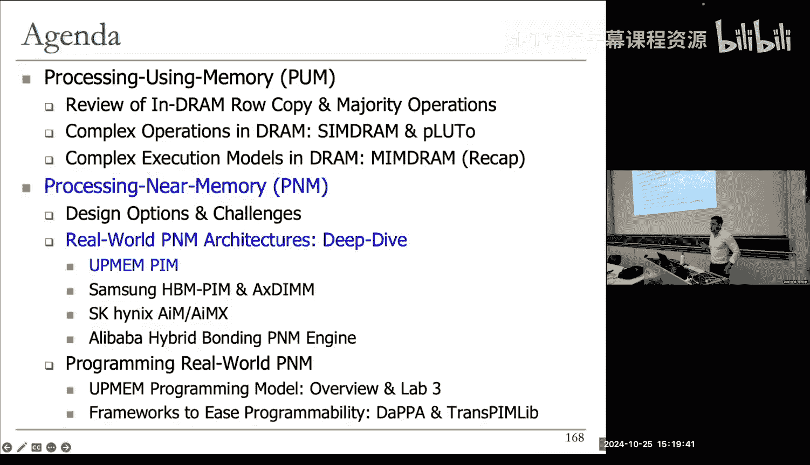

R your application those chips so is out there and like it's tangible you can actually buy you can actually buy those dims here and you can use them so this up mem as I mentioned is Ita from France they release this proposally proposed processing D engines is a D is a2 the base one so it's not really static memory that your regular dims and inside these dims you have some upm chips and inside this up mem chips you have both du banks and some simple in other core。

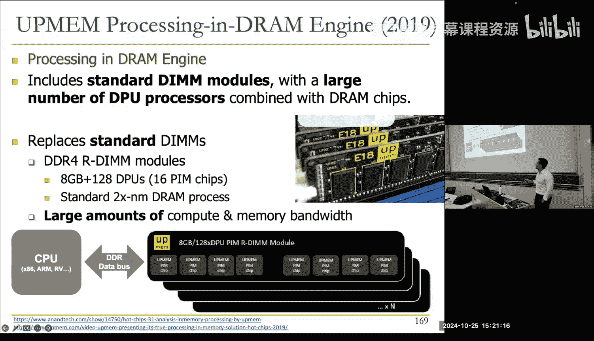

So I'm going to give some details on this architecture and this is going to be the baseline architecture that you're going to use on La3。

😊，So the upmem architecture follows accelerator model。

 so even though we could in theory but we could use this du dims for your main memory they are going to be there is not going to be the case at least for now because it simplifies the the system integration a lot if you thisjoin data space from the pin accelerator and the main memory for your host processor so they are going to do that they are going to follow accelerator model where the dims are going toz this exists with conventional dims used for memory for your host system so you're going to follow accelerator model and in particular what's called loosely cup accelerator so a loosely cup accelerator is any accelerator that requirespressle data movement from whatever host memory that you have and whatever memory data。

😊，So one good example of a loose cupacccelerator is GPPUs compared to that the alternative of having a looselyacccelerator is having a tightly cutacccelerator so tightly compacccelerator。

 the accelerator sits in the same address space as the processor itself a good example of a tightly coacccerator is vector processors that are in our CPUs they are just sitting there as a component of your CPU die。

 but in theory they are accelerators for initially they were called MMX mootmedia extensions I guess was the name and they were there to accelerate some Mootmedia Mootmedia applications that time to identify as a key application。

😊，So they are going to follow this upmm chip we' going to follow this lowili accelerator where we need to specifically move data between the main memory and the accelerator itself and we need to specifically launch the kernel that is going to as acute in the upmm chip itself again as I mentioned this guide resembles how we would program GPU。

😊，So this is from the initial patent that the upM founders wrote and published。

 I don't remember the year I think was16 maybe but don't quote me on that so describe these accelerator mode that I just mentioned here over the patent says the SOC loads the data into the DRA memory bank。

 then transfer the comments to the DM process， the data process by the DM process starts and when the computation is done。

 the SOC can access the output data from the memory bank。

So this is again this pictorial picture from their initial patent deployment。

 so here we have their SOC that is the master so is your regular host CPU with some your the regular DDR interface and then we are going to have the up chips here with some。

D our memory and some processor that's going to have some simple cores and also some scratch pad memory。

😊，So as I mentioned， the upm based systems organized as in a dim from factor。

 so it fits in the regular dims lot of your modelboard。

 so it does not require something fancy like silicon interposing like introduced tech chips that you are going to see later and it sits alongside the main memory of your system。

😊，The single upme dim contains8 or 16 pink chips， and this is going to depend on how many ranks are per per dim。

 So it is going to be either one or two ranks。And inside each D or each memory chip。

 you are going to have8，6，4 megabytes of Dur bank here called MR。

 so it's memory RA8 they call D D process units here。

 which are the cores that are going to be used for computations so you have 64 DPs per D bank because again。

 you have either8 or 16 D chips per one or two ranks。😊，And inside the GPU。

 we are going to also have some instruction RA that storess the instruction sequence that the core is going to execute and the working RA。

 which is some SRM memory that is going to store the the data that the pipeline is going to operate on top of so you can't operate directly on the data there on the DurM bank。

 you need to move the data from the DurM bank to the scratchpad memory and then from the sketchp memory to the registers of the CPU course。

😊，So this is a picture of one of the things that the people give you access to。

 so here we have a Mor board containing your A CPU So。

 the DM dims here that stores main memory and the pinion enabled memory here and the currently this given rank here rack。

 you have in total 2560 of those GPU processing engines across the rack。😊。

So we are going to use this vector addition example。

 especially later on to illustrate how you program this system， so let's say that you have to。😊。

You want to add two input vectors， A and B and generate a third input vector C。

 and for you to do that you are going to have to move the data from A and B to the to the MRM in the DPUs partition data across the different in the system。

 and then partition the data inside one DPU across the different software test。

 software threads called testlets that is acute temporal parallel inside a single DPU because I didn't mention but that processor inside the DPU is a most threaded processor。

So again， this resembles a lot how we would program at GPU and you're going to have more details on this later on in this lecture。

😊，So as I mentionedCCD is following a loosely copper accelerator model you need to manually transfer data between the CPUs and the DUs so to do that there are three different types of be transfer instructions that you are going to use during the labs the first one is called serial data transfer and this is going to move the data between the CPU and single DU so it moved later from the main memory to one of those CPUUs in one of those pin chips。

 the second one is a parallel transfer so here it can move big portions of data from the main memory to a set of GPUs in parallel and finally is a broadcast and this is only for CPU GPUs not DU CPUUs so it's only a single direction so here it can move a single a single buffer to multiple DPUs at the same time。

So we are going to see how you program those data transfers in more details later on。

So an important thing between the up pro S system is that there is no direct communication across the DPUs in a single D gym。

 so this means that if you need to move data from this pin chip here to this pin chip here。

 you need to go through the CPU copy the data to the main memory and then write back the data to the destination GPU。

😊，Yeah， so this is important for some communication patterns like merge personal inputs or distribute intermediatemediate results。

 all of these you require to move pinpoint the data back and forth， the CPU and the main memory。😊。

So I know that this is contraproductive compared to the go of processing memory， but yeah。

 this is the first realization of their architecture and having。😊。

Connections between these chips here， like NanOok， for example。

 would be quite costly to implement so but we know that it's in their roadmap。

So then i'm going to give more details on the micro architecture of this on the D。

 so again this is a picture from their pattern that they initially publish， so here we have the。😊。

As I mentioned the memory bank， so Dur bank， the MR， the processor which has the instruction catch。

 the scratchpad memory and the CPU pipeline and this is so this is the same chip in a little bit more details or the cartoonish version so we have some control interface and theDR4 interface to communicate to allow the CPU system to communicate the DU chip itself then we have those 64 megabytes of DurM bank of MRM which is stores the data so DMA engine is which is going to allow you to move the pipeline。

😊，To move the data between these duham banks to the scratch pad memory。

 then we have the 64 kilobyte work around scratch pad memory that the pipeline going through it the 24 kilobytes extraction ramp and for 14 stages in order much threaded pipeline inside this single DPU。

😊，So as I mentioned， this is an in order pipeline and this is one of the effects that I mentioned that is a direct effect of manufacturing logic together manufacturing logic with the D manufacturing process。

 the frequency of this process is quite low right this is 0 up to 425 megahertz for in order core。

 the process or your phone runs four times faster than this right question。😊。

It's from the dims very regulargu from the Des latia。😊，Able to support enough power。For the core。

 yes。Yeah， so they don't have a second power up or anything。

As I mentioned this is all a mood t processor and you can have up to 240 threads working at the same time I'm not going to show here but often it's not beneficial for you to have all of those 240 threads work at the same time because the pipeline this is a fine gray moodch threads so you just need as many hundred threads as pipeline stages and most as the number of pipeline stages so that the pipeline stages are fully occupied doing the execution so based on some micro benchmarkch we saw that actually 10 threads working at the same time is enough to fully utilize the pipeline lots and achieve a peak throughput。

😊，As I mentioned they have 14 pipeline stages， those are regular pipeline stages。

 not much different from what you saw in other processors， face dispatch， read。

 some operate formatting， operations and W room access and merging I stage。😊。

So this processor has its own ISA instruction， is a 32 bit ISA instruction that resembles a risk five like instruction set architecture。

 but it's not necessarily a risk five， but it is similar， or risk like sorry non risk five risk like。

😊，嗯。And the upman people extended the LLVM and the C compiler to allow you to write CI codes and generate the binary for this architecture。

😊。

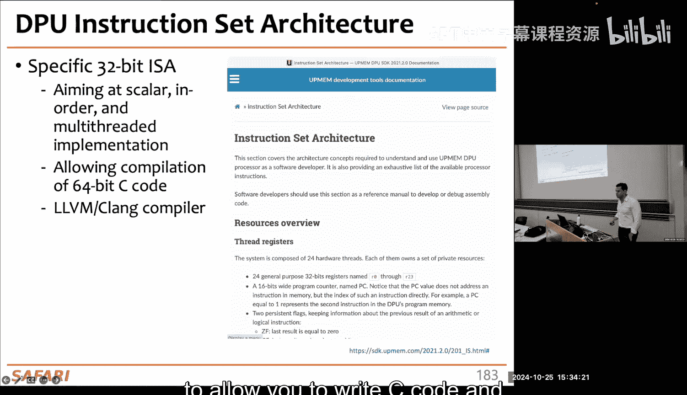

So here inside the this is again， the pipeline we are going to there's no much many more interesting thingses over here other how you program this。

 but we are going to see how to program this a little bit later in this lecture。😊。

So if you are interested in the micro architecture aspects of the upM and benchmark and understanding how different features play along with the up me architecture。

 I invite you to check Hoan's lecture on that and also we have put up this。😊。

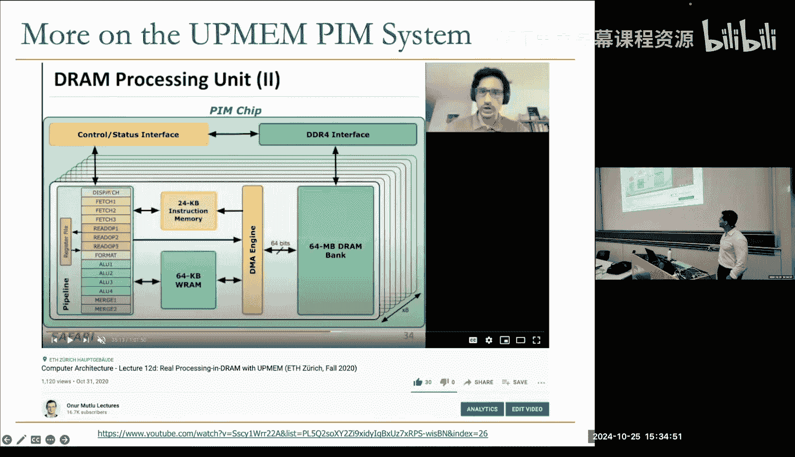

Alysis of this real chip where we test different components and see how they perform。Yeah。

 so Juan gave this also this talk a ta at some point and we also provide this benchmark to stress different components of theM system it's called prim and you can see the electron line。

😊。

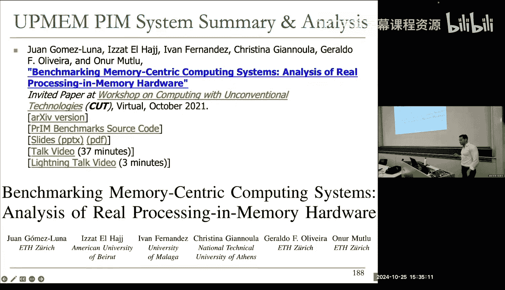

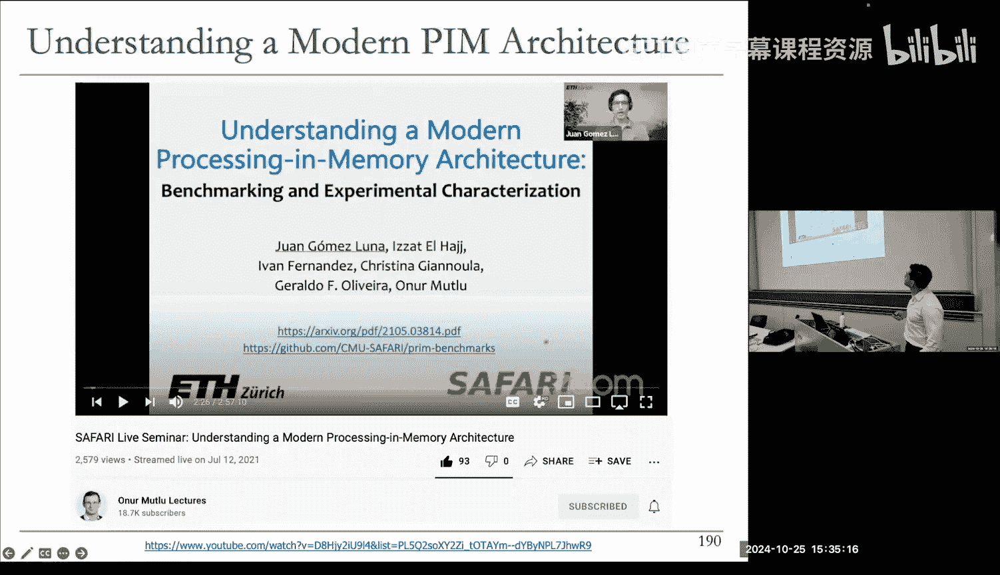

So yeah， there are many lectures on this topic and we got access to these upm servers and in Safari and we we've been using these upmm servers to accelerate different memory bound application so we start by benchmark mark the architecture。

 and then we start moving to more complex operations like classic machine learning training like wasing things like decision trees cameings or logistical regression over there。

 doing spa matrix multiplication， doing I'm going to talk a little bit more on these translational functions on these chips。

 sequence alignment on off encryption， reinforcement learning and recently for this paper impact where it does distributed。

😊，Outimization algorithms over there and also we have this upcoming paper in micro that shows how you accelerate graph neural networks for this upbing architecture。

😊，So yeah， so that was the up architecture I'm going to go back to is to do this when I get to the programming part we you are going to use in your lab so if you don't want fully understand everything。

 hopefully when I get to the programming part it's going to be a little bit more concrete。

 but I just want you to have an overview of the hardware design。

Hopefully is there any question related to the up？Okay。

 so now I'm going to accelerate a little bit because we are not going to use those architectures in。

In the labs but it's extremely important for you to know what is out there in the market as well as alternatives for AMm so right after in 2021 Samsung also came up with their own process memory architectures and here they are going to use 3D stack chips to design their processor memory architecture so they show this work in this ISSCC conference and keep publishing works and I'm going to mention as well keep improving on this architecture and then reporting in other conference so as I mentioned they are going to use 3D stack du to proposed in their process memory architecture and as a background 3D stack chip or HBM which are going to use here hybrid band memory is a memory chip that is stack du layers in。

😊。

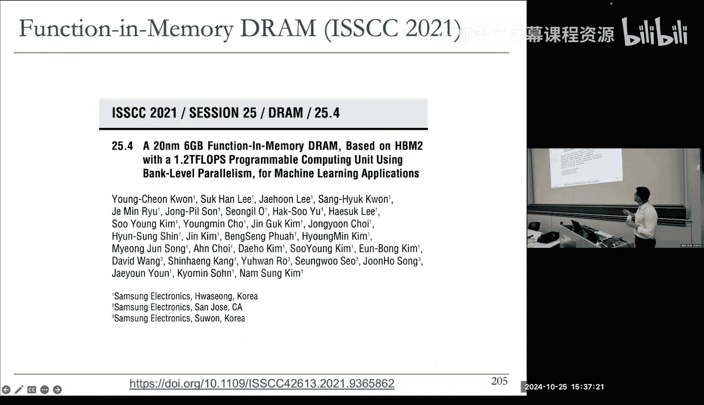

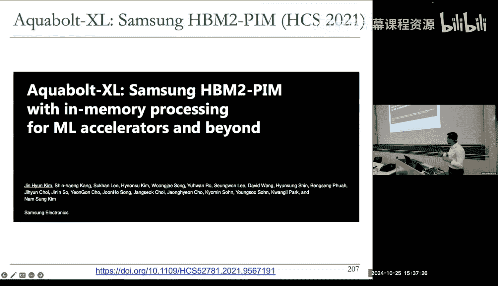

Bffer layer so in HMC time this was called logic layer in HBM times this is called buffer layer so the buffer layer contains some IO circuitry。

 some self testing and some test bug so is's not therefore for free is there because some of some of the components of that was usually part of the memory controller was moved to to this buffer layer to improve the connection between the chip and the memory itself。

😊，So they to connect the different du layers to the buffer layer。

 they use a technology called three silicon Vi or TSVs and this is a picture a picture of what you have so this is the。

😊，The SOC， the system in package and here we have the HBM chips here。

 these circle things are the TSV connections and this is the substrates and the connection between the host and the D chip is done with something called microbs that is is this thing here that connects the host and the die in the silicon interposer。

 so this is a little bit different from like dim film factor because this you cannot plug and then plug so you put you put the device in the package and once it's there is there you cannot remove it but this is why what you would buy for example would not buy because it is not as impossible to buy from anyV anything because everyone bought already but this is what you get from8 to1008100 NVD GPU chip that uses those HBM chips to provide high bandwidth for their high end GPUs。

😊，So as I mentioned， the buffer layer is connected to the host via a silicon interposer and in the HBM2 realization of this chip what we have is what is called pseudochans so some groups grouping of those TV which each one of them with four banks and this is a little bit fine negrularity than regular du where they transfer。

😊，This is wider because the Drm is 64 bits that the column transfer and here is 256 bits that is going to be used from a column read。

 but the raw size is a bit smaller so this is one kilobyte and D there are four is 8 kilo kilobytes so is a trade off because。

😊，呃。嗯。We want to have more drone banks so then you can operate them more in parallel。

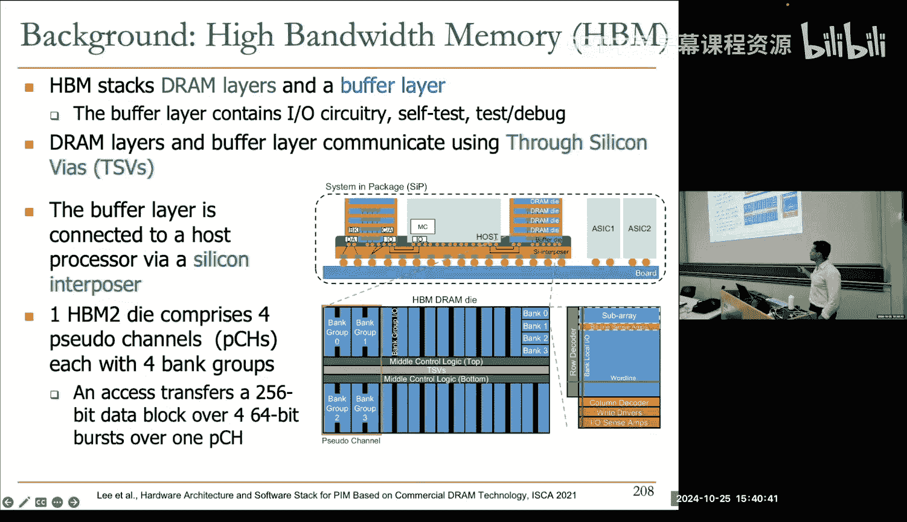

So this is in the original paper Samsung called this their P architecture Fm Dham now they keep changing their name I cannot keep up so it was initially called Fm Dm then it became HBM pm and now is aquabos and they keep up pending some XL something the ends of the design so I don't know how many X and how many Ls are there anymore but so but it's the same they are talking about the same thing different a little bit from what I mentioned from this HMC like design where we would put the competition。

 the logic die what Samsung does is a little bit different and I guess because the are minimum factor they can do that is that they take out some of the memory dies that are originally in HBM2 chips and they replace those memory dies with compute dies so basically what you have is some regular memory dies together is。

Memory dies in the same chip so this is nice because now you're not super limited by the area of the buffer die。

 but now your density of your D chip is reduced because I guess they go from 8 gigabyte。

To four now I' not remember if it's gigabytes or gigabits is one of them。It's it's soft basically。

 So this is that it's always this trade off， as I mentioned， right area， capacity， power and density。

So this is their cost of implementation that they have inside but it's not the much interesting for us orre non surface people what's interesting is these block diagrams so this is their organization of the Fm D architecture so this here we have the organization of the regular die for memory die for HBM2 and here we have their dye for Fm D architecture so what you're going to see that is different is that between every two D banks they have this PC blocks here which is basically the core thats going to do the computation and this core is going to be shared between neighboring durm banks over there so they have some design ghost that they want to maintain why you're designing this Fm D architecture so the first one is that this HBM chip is JD comp so that is a specification that defines the protocol to access this memory chip and they want to。

😊，Keep this protocol unchangeable they don't want to change the J change JDX is always a mess because it's basically a contract that you do between the memory manufacturer and the processor manufacturer that dictates how that memory is going to be operated so changing that protocol requires going to a lot of meetings and I want to do this I want to do that and then a bunch of back forces really complicated so they don't want to do all of those they want to keep the protocol as it is so this is and this is going to impact how this chip is going to be operated。

The second thing is that they want to minimally engineer or they redesign the Dur cell area so this area here inside the duurham chip is like where they make money off so this is really optimized to densities so they don't want to change that。

 they don't want to move things around so they are going to restrict themselves to adding computations to the peripherals the peripherals are they still don't want to do they don't nowadays they are more open but like they don't like to change many things but the peripherals are okay to change because regardless there are some decoders there。

 there are some logic or regardless there are some logic over there。

So they are going to restrict themselves to adding computations to the peripheral of a duambe。

As I mentioned so they are going to have one pin unit for each two D banks and those pin units are going to be fixed functional units so this is our not general proposed course they target application that they are having here to accelerate in these chips is gas neural network interference so basically what they are going to design is some Mac unit so that they can do Mac operations inside the D chip so this this fixed functional unit here is going to be sD f float point engine for again to do this 64 bit float point operation。

😊，So for this to operate as I mentioned， they don't want to change the protocol。

 so they are going to just reppropose the read and right command to trigger process D computation so basically they are going to have a sequence of the memory controller issues a sequence of the read request right request to some given memory address and based on that sequence you trigger you are in memory mode or you are in P mode basically and we'm going to talk a little bit more。

On those mode later on， as I mentioned， since this is in the IO of the bank。

 the data in from this float point engine is going to be as wide as the number of columns this the column size of the bank so it's 256 bytes so if you divide this by 16 these give 16 bits per FU because you have what you have 16 of those for 16 bits per FU in the peri of the bank。

😊。

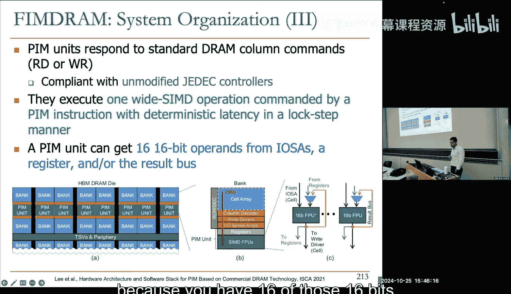

So as I mentioned， the way to trigger this computation is by issuing some sequence of activated andcharge command to some predefined or some fixed address locations in some banks。

 and this is going to allow you to trigger process using Durham operations。

 either in a single bank or across all of the Durham banks inside the Durham chip。😊，So yeah。

 so this is called ABP mode in theirorul， which is going to trigger computation across all of the du banks so that you can employ bank level parallelism。

😊，So this is the design of the FPU itself， so here I think they change there they keep changing the PCU now so basically you have the interface for the bank so even I guess not I guess as I mentioned this chip the hardware is shared between a neighboring bank so have an interface for the even bank and an interface for the odd bank you have the。

😊，The control， the instruction for the instructions that you are going to execute。

 some register file to store the data that you ledge from the banks and the S the engine here。

 either for multiplication or for addition again， what the target here to do multiply and accumulate。

😊，So this is another view of the same thing， so what we have。

 as I mentioned here is the command buffer， some pipeline decoder， some sequencer。

 and some register files。😊，So the instruction set is quite limited because again we are just targeting neural networking Mac operations。

 so they have only nine risk five risk like instructions and。😊。

Those instructions are basically addition multiplication， Mac multiply and add。

 what is one multiply and add multiply and accumulate and some data movement to move data across the global register file and the data path of the process of the processor and some simple jump some simple control and no op so this is not fancy at all as you can see this cannot do fancy brain soil jump to a particular fixed location。

 so is quite restrictive but again because they are targeting a single kernel from an important application。

😊，So this is a comparison table that they have in their original paper that they compare their architecture at the time Fm Dm with the upMm pin chip。

 some interesting things to look into the table is that they are using different different types of Dm of memus for Fm du using HBM2 this is some manufacturing process that is also interesting not so interesting the size of the chip is not half it 6 gigy per cube so yeah so6 gigabyte per cube while upM has 80aby per dim it's important to say that this cube is way more expensive that a dim because manufacturing through this stack is much harder than manufacturing to the logic 2D D since they are2D stack they have way more bandwidth per cube compared to the bandwidth inside a dim similar to what we saw before in upMM the clock frequency of the process。

So is not so high again， because manufacturing logic is using D manufacturing processes is complicated。

 even for a memoryized Samsung， but overall because of the available parallelism that they have。

 they achieve quite high peak throughput per cube， 1。2 terts per cube。And since they are targeting。

Ne network interference， they support float point operations in why are they MeM being cheap mostly support arithmetic integer operations。

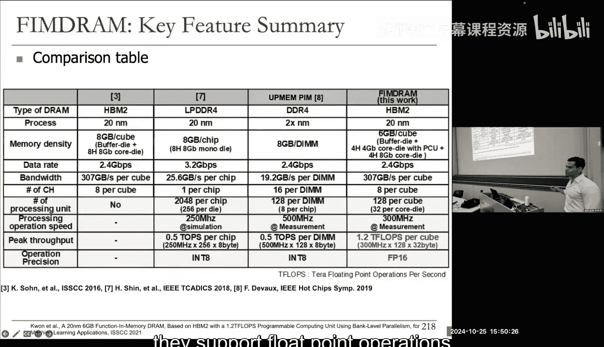

So if you are interested on this architecture， we have more lectures on those。

 so as I mentioned they keep publishing or they keep prototyping other architectures that build on top of this fera architecture。

 so in 2023 they came up with this other architecture targeting specifically transformers。

 so it's just their ploting the generative in transformers as memory bound and then they came up with this architecture that merge this HM thing architecture together with M GPUs and they showed that if they collaborative do the computation together with the GPU。

 this is much more beneficial then doing the computation you only using the GPU itself。😊。

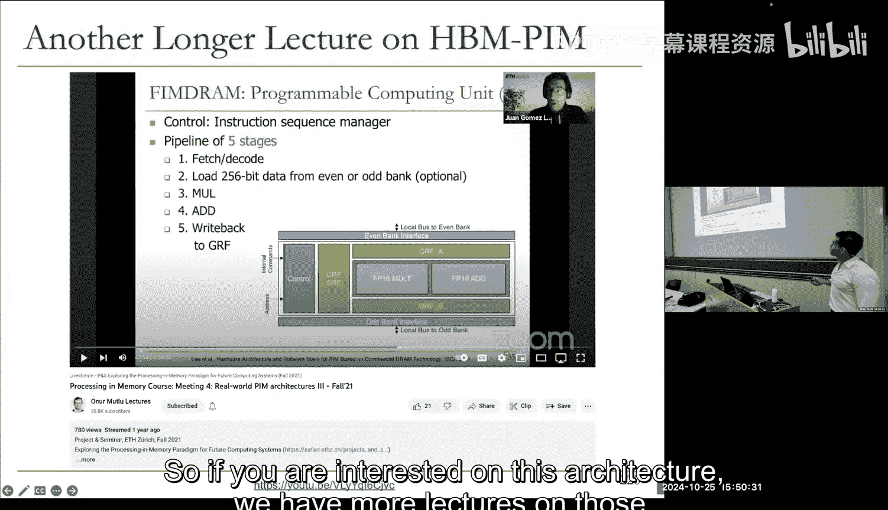

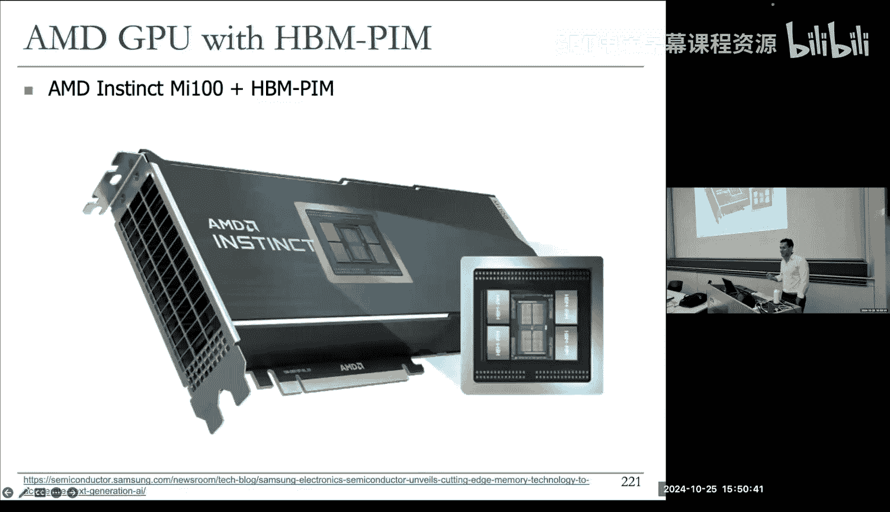

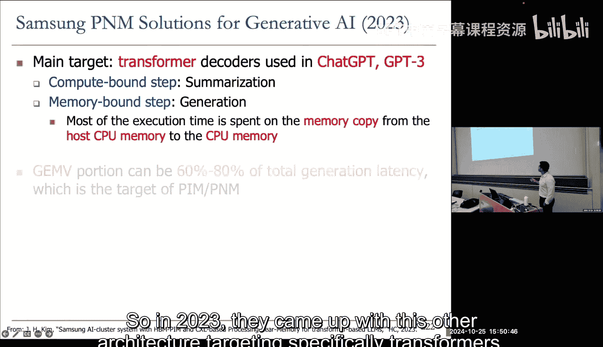

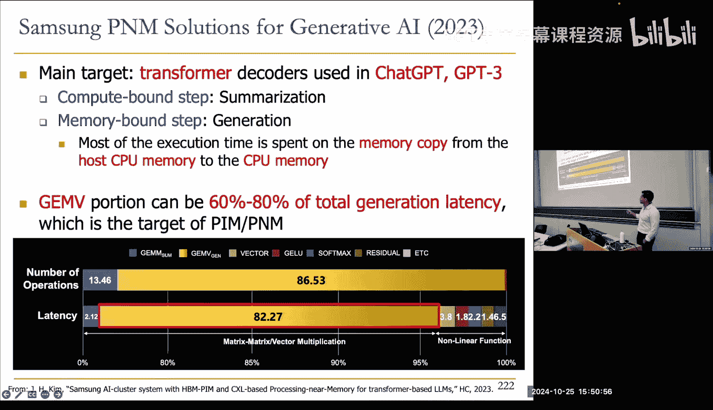

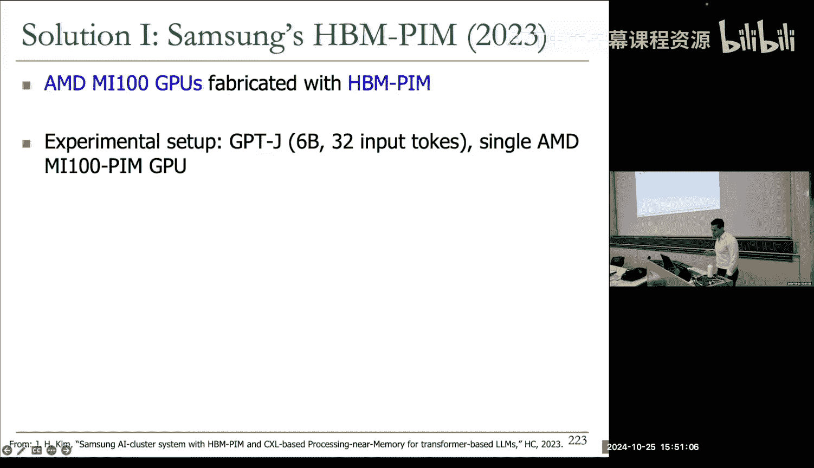

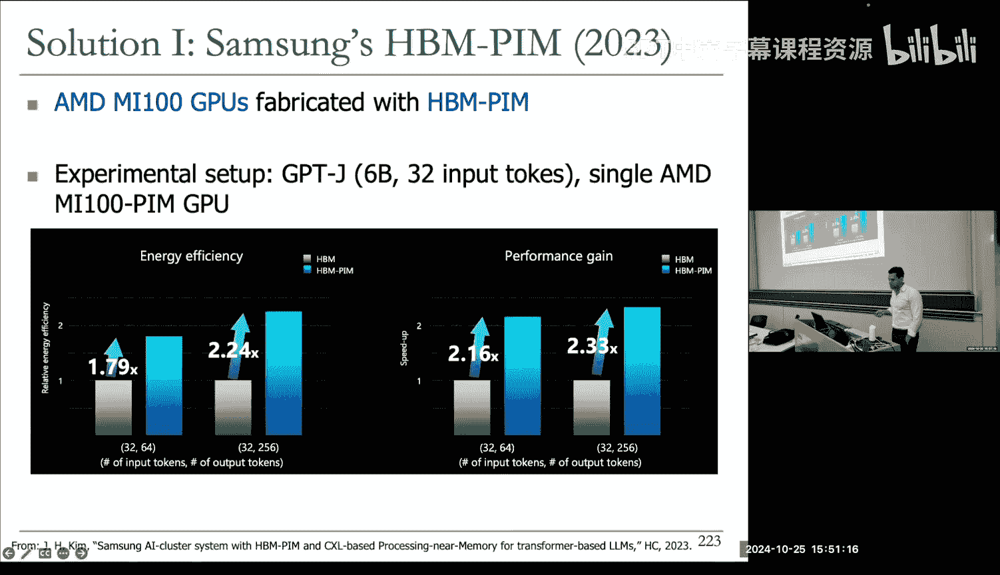

So they also have an implementation of similar architectures for mobile devices。

 generative AI on edge devices， and here they are not going to use the HBM chips anymore because you don't embed HBM chips on small factor resources like phone but they are going to use low part thex memory devices that target those architectures。

 so even though the memory technologies is different。

 the architecture of the P units is exactly the same so some control some float point multipplier and addition the P units share across the different different banks so they follow exactly the same organization just change the memory technology。

😊，And again， they show some performance and L gains compared to running the GP22 inference on their system。

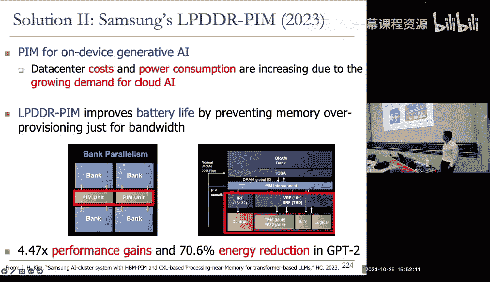

So they also have one solution for I skate out system。

 so if you want to if you have a models if wantna train a model that is really large you're going to have to have this memory expanders that is allows you to your SSC to extend the memory capacity of your system in in scalable way it is called a protocols called CXL and here they have two setups where they add this pin logic either in the controller of this memory expander or in the memory chip itself similar to what we just offer the HBM and thepoR itself for these ones they don't have a design itself just more conceptual but probably should be quite similar to。

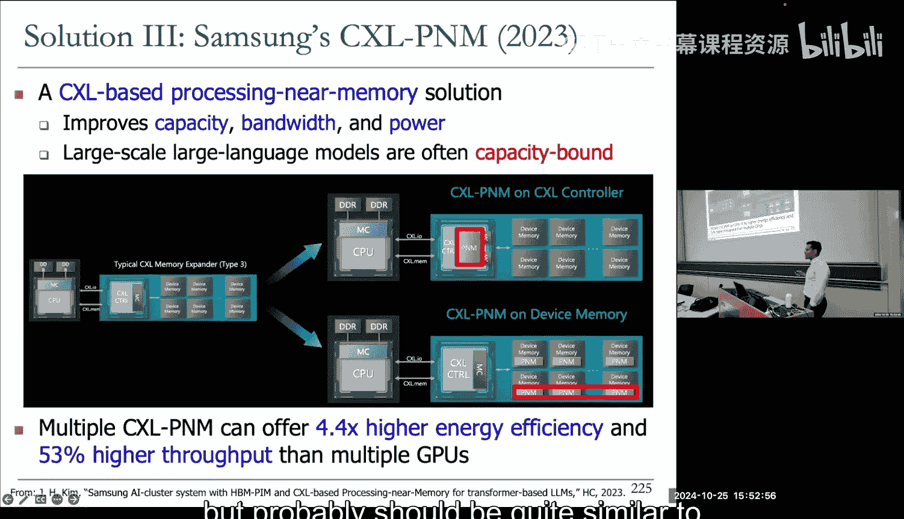

The other two that I just mentioned。So Samsung also have another。A mother。

Solution for recommendational systems and this is the IXG book that they published 2021 and someone asked them about LR gym so this is our gym actually so what they have is the gym in a LR gym you have this buffer here that is used as I mentioned for signal integrity for both data and for the column data so what they are going to do is that they are going to embed some simple computation to this buffer this buffer inside the gym itself so that they can do acceleration of accommodational systems。

😊，So I'm not in the interest of time I'm not going to cover in so much details on how this works。

 so basically they have this fPJ based framework which allow us allow them to this is the the itself and then inside the the this have this custom fabric here in this fPJ and they have two ranks and they are going to。

Use this FPJ to have some logic， implement some logic to accelerate recommendational systems and the key operation that they are going to accelerate in their recommendational systems is element toized summation for the target recommendation application。

 so I'm not going to explain in much details the design of this but what is important for you to know is that this is a custom fabric so you can actually implement whatever you want but they are interested in the recommendational systems what they implement is the important key components is this add array tree here which is a simply like processor as this elementized summation required doing the recommendation system processing。

😊，So yeah， so they also use this architecture to accelerate other things like spa La sum and also database operations and again if you're interested on this architecture I invite to check who wantss lecture on that。

😊。

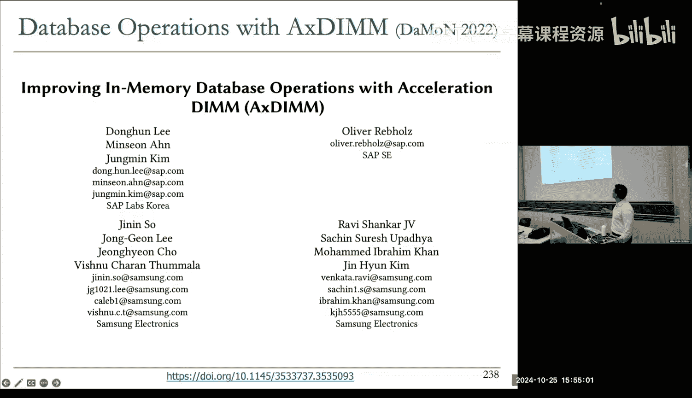

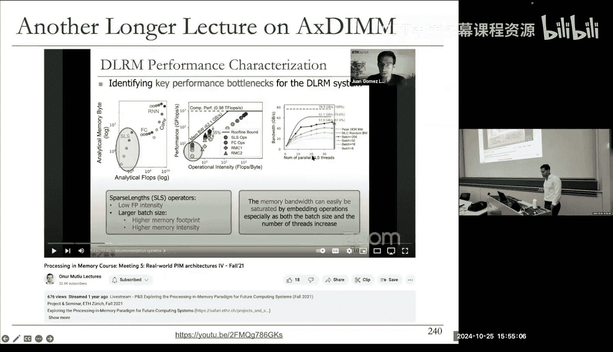

So another memory manufacturer， SK Hyinix also has its own P chip now is called aim and they also have a follow up called aimX they keep adding X on stuff here what changes again this is targeting neural network interference and again what is going to change that they are using a different type of memory GDPDDR six memories so those are usually highb memories to utilize for example in GPUs。

😊。

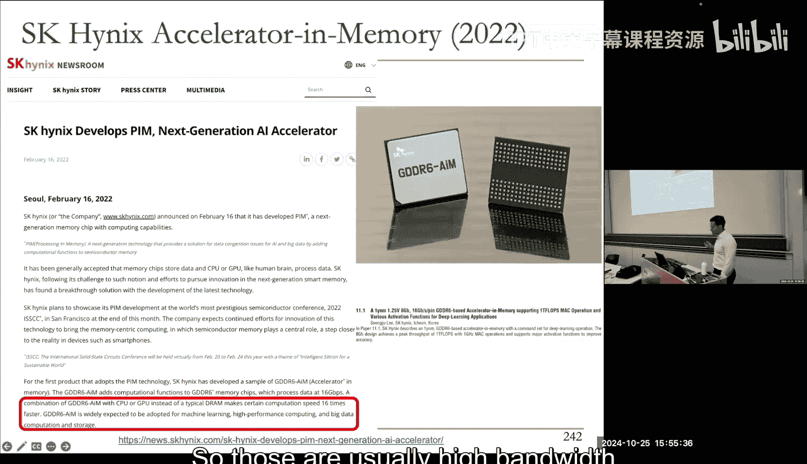

So this is the design of the chip it's a little bit similar to the design that I just mentioned from the Samsung walk。

 but here different from Samsung they have。😊，Two， one processing agent per bank。

 so it does not share across the banks， and they also have some supplementary buffer that allows them to move data in and out this Dr chip。

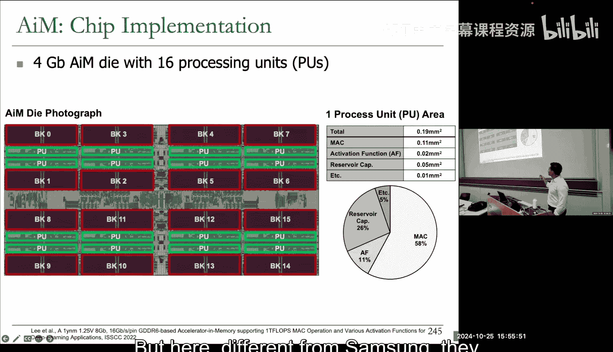

So I was going to go through the details on this comment set， but I think it's not so interesting。

 basically this is not what is important for you to understand is that this is not J that complianceli so they they go to the extent of creating new D common so that they can trigger the computations in this architecture as they want。

So yeah， so they have like these new activation instructions like activate four and Act eight。

 which activate either throws in four banks at the or 16 bags simultaneously。😊。

they have this processing unit here， again， which is uses some multipliers together with some other tree and some accumulation and activation function to accelerate gem and GenV operations in a neuralnaal kernel。

 so this is how the different ways of operating it， which if the input come from outside。

 if the inputs come from inside or accumulation are both basically。😊。

So what I want to show next is this comparison table again this is now they are comparing their design with the fidra architecture together with the upmem architecture and so what' is different between those three is that this is using theDR6 which is used Mo much is lower technology nodes their density is1 gig is4 gigabbits poor data process the engine that they have their tro less look the processing operation here。

 for some reason they manage to get to a much higher frequency than both upMM and Samsung they don't fully explain wide so good for them they reach1 gigahHz their throughputs of their system is1 teraflops per chip。

So 32 Giab flops in total if they have 32 chips in the system and they are targeting the blood flow precision for blood flow points for neural network interference and they have some supported from several different activation functions your neural network。

😊。

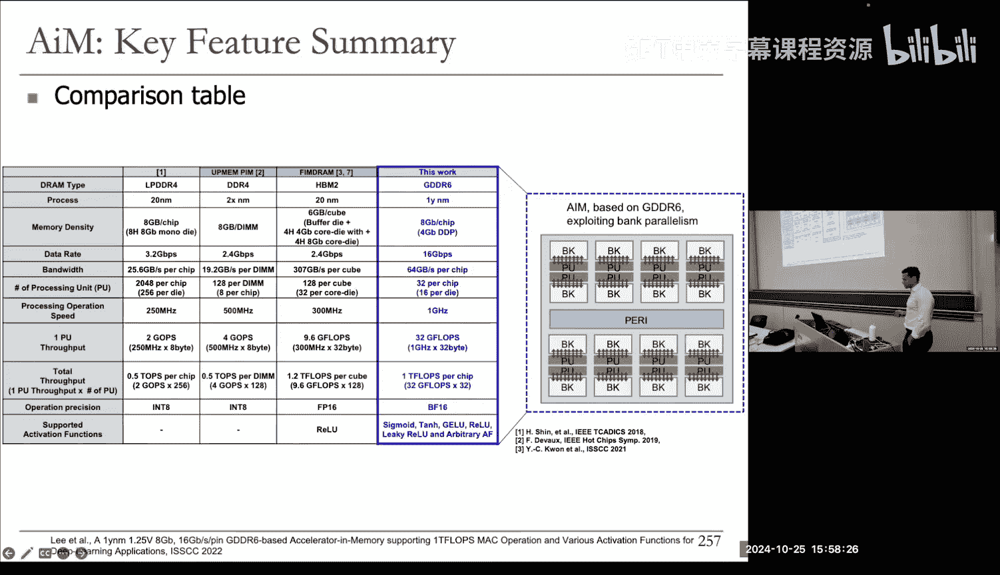

So yeah， so this is you can talk， they have entire stack computer system stack for these including SDKs and everything and then you can check their lecture online to learn more about that。

😊。

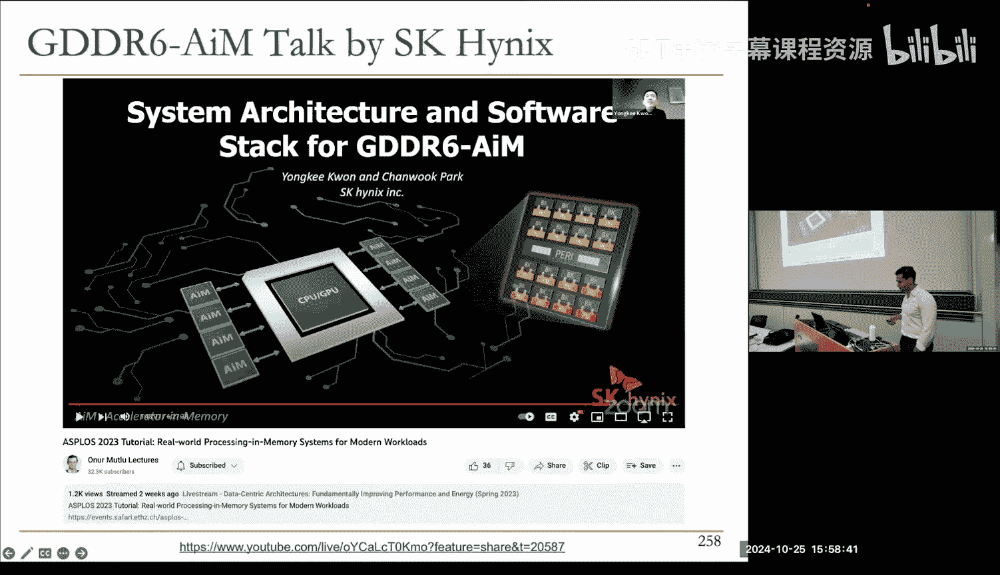

So finally I'm going to really briefly talk about the HBM p no the one from Alibaba so Alibaba is not memory manufacturer per se they are a server provider but they also came up with their own pin chip and here they are going to use hybrid bounding for for stacking P and memory at the completion logic at the same time so hybrid bounding is this process let me show here。

😊，Where here where you manufacture your D wafer and then you manufacture a logical wafer in their own manufacturing process and then you flip them and then they have this what's called wafer wafer to wafer connection where use。

Copper， I guess， to create connections from one wafer to another wafer here in this hybrid setup so this is a quite newish technology。

 so it's quite impressive to see that server manufacturer is already looking to this direction。😊。

So here you're not going to you cannot stack this right because it's face to face。

 so you take one way for and just glue them together。嗯。

So here they are targeting this architecture for。😊。

For'm sorry'm sorry I'm going to go a little bit out of time。 so if you have to go。

 please feel free to go。So they are targeted recommendation systems again。

 similar to the XD architecture， so again they have a comparison to the Fi D architecture and the upM and now they are using low part DR4 DM instead of HBM。

😊，They are manufacturing these in a little bit higher on technology nodes， density is 4。

5 gigabys per chip and then their frequencies again is a bit low again I don't know why so low actually because those are manufacturing different nodes but what is important is that they bend per capacity whatever this metric means is higher than the other ones they keep div things around and then to show that based on this metric something is better than the other but anyway but the energy is in right so the energy per bit is quite lower compared to the other two once because they are usually low part they are for so this is why。

So if you're interested on this， again， check Louan's lecture on that。😊。

So finally gets to what's important for lab3， so in lab3 you're going to use the upM SDK to program some kernels and measure some stuff and then you're going to report the things that you measure。

So overall， some programming recommendation that we learn over time。

 programming is a mapping system is that you want to if you take your application kernel。

 you have your input data and your test that you need to execute。

 you want to paralyze the tasks in a way that you。😊。

Can run those tasks in the parallel portions of this code in the DPU as long as possible so you fully utilize them。

 so you also want to find data dependent blocks which the optMs can operate independently because the moment that they become dependent that you are going to have to move data from one DPU to another and moving data like that requires you to go to the CPU and this is going to include extra latency。

😊，So you should work with as many DPUs as available in the system so you want to this is again a triputaryient processor and you want to use as much throughput as possible and as I mentioned you want to launch at least 11 softer tasks offer treads per DPU so you can fully utilize the pipelines slot of the DPU。

😊，So the way that you program this is by using a series of APIs that the SDK is providing and here I'm going to list the key ones that you're going to use during the lab tree so the first one is the DPU lock this allocates some given number of DPUs that you want and creates this DPU set that you can operate on so this is the syntax here so this is just for a search to see if something fails but basically you a lock the number of DPUs that you want and this gives you a DPU set which is what you're going to use that on to allocates the data。

😊，So you can allocate differentPs in the course of the program， so you can have this。

 for example in a loop and you can allocatecate and delocate as you go。😊。

And you allocate DPUs using the DPU free， which is equivalent to the equivalent of the DPU log and then you pass the DPU set。

😊。

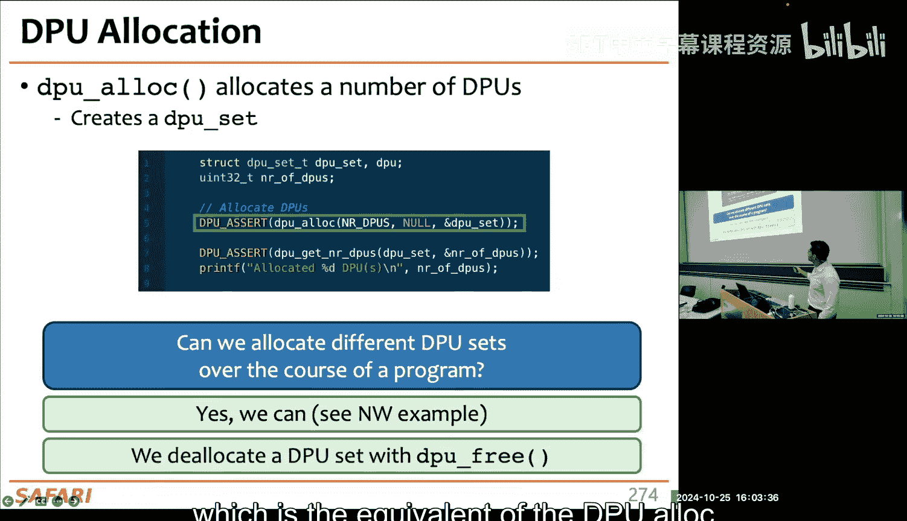

So once you allocate the DPU， then you need to load the binary of your application into the DPU itself。

 so you point to the binary that you're going to execute and then you load the DPU binary in the DPU set by passing that pointer itself。

So you can launch different kernels onto different interview during the execution of the application。

 for example， but you're not going to do that in the laboratory。😊。

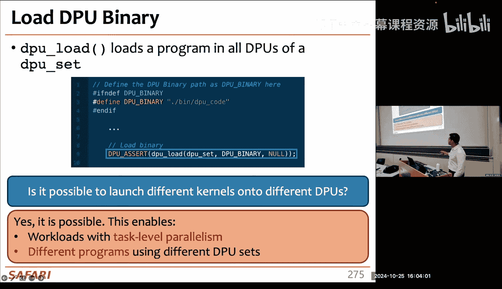

So the data transfer that I mentioned right so in the DPUs the presentation I mentioned that there are three different transfers。

 serial to COP data from to one single DPU parallel to COP chunks of data to many DPUs and CPU and broadcast which cops single piece of data to multiple DPUs as well。

😊，So for you to use the serial data transfers， the API that you're going to use is the GPU Co2 and DU copy from depending on the direction so DU from copy from the hostse to the to the GPU and DU set wrong two cops from the host to the CPUU to the DU and from cops from the GPU to the host so for you to transfer you needs the GPU set so here's the syntax again for each GPU in the DU set what you do is you do a data copy from that given GPU a pointer in the hip space of of the MM this is the DM that you have the offset on that you're going to point to the。

😊，To the MRM，er of the pointer of the data that you want to copy in the host memory and the size of the transfer that you're going to operate。

So here we are copying two arrays to buffers A and B， so this is a linear a space。

 so after you copy array A array B is going to start after the array A finishes and then you just past that offsets to the DPU copy2 function。

For the DPU data transfers we have a similar process but you have different APIs。

 we have the DPU X for to DPU or x or from but you need to prepare the data beforehand because this is going to be a DMA transfer basically so the idea is similar for each DPU in the DPU set you do a DPU transfer you prepare the data first to point the data pointing to the location that you want to copy it from in the host name memory and then you push by doing DPU prepare X no it's the other one DPU push X with the direction so here you're pushing to the DPU but you can also push from the DPU in the other direction。

😊，Again， you need to pass the offset inside the memory real against a linear space。

 so first copy the offset is zero， the next one is after that data。

 so after that data that you just copied the size of the data and this is always the default here don't need to worry about it。

😊，Finally， we have the broadcast and for that to use DU broadcast too。

 again you're going to copy this data， this buffer data here， the terms size。

 but you're going to copy to a set of DPUs in this case becauses broadcast。😊，As I mentioned。

 there is no communication across the DPU， so if you need to do that you need to go use those copies through the host and then you cop to another DPU set。

😊，So after that， you can launch the kernel to do that。

 you do DPU launch and the DPU sets and then the launch can be both synchronously or as synchronous depending on the parameter that you pass over here。

 but mostly you're going to use the synchronous one。😊。

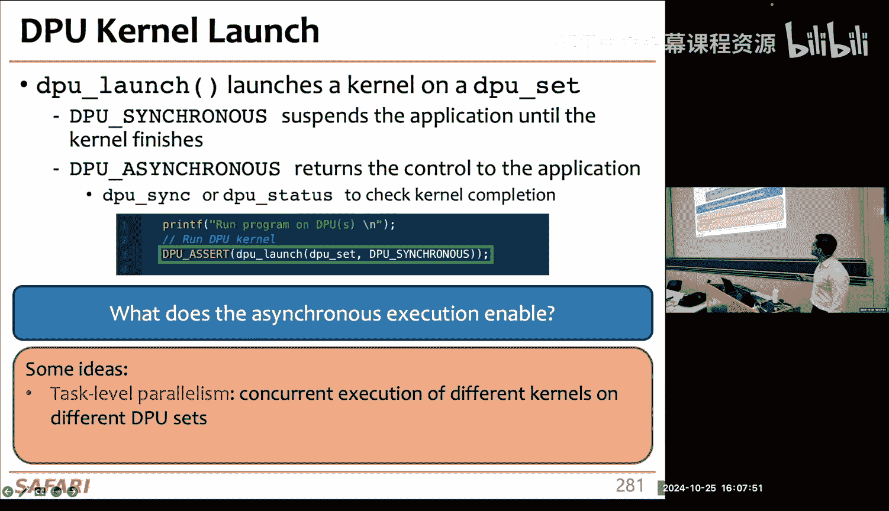

So you can also pass parameters to the DPU and then to do that you use again the DPU transfers。

 so here for example the copy2， and then you pass as an argument Istruct with the parameters that you want to pass to the DPU course。

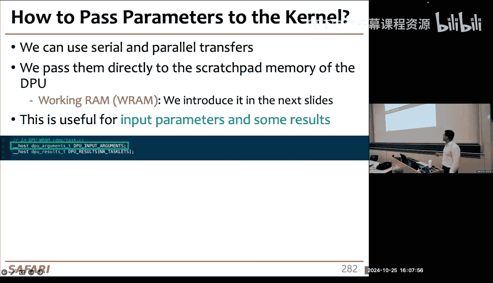

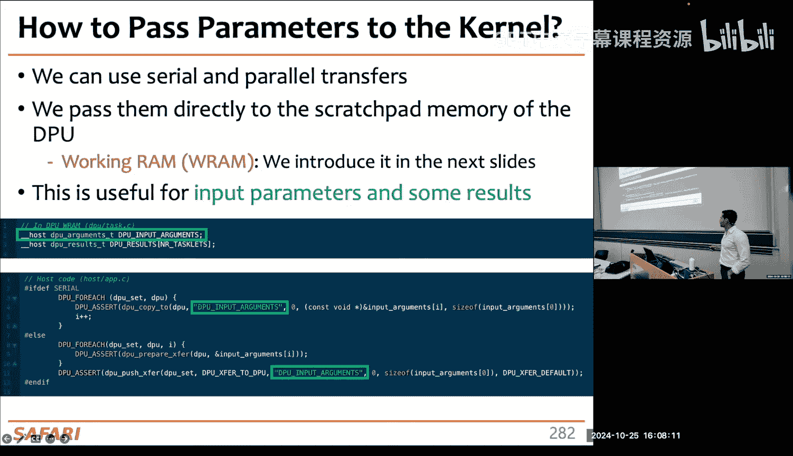

Going back to the vector addition， this is the code for vector edition。

 so here we have the testlet this is similar to KUa so you have a test ID for example。

 this is CAtlet ID for that given kernel， you tie the data to move it to to the DU。

 you do the allocations of the a workR and you have some data from the MR as well。

 you move the data from the MRM to the WM specifically use the EmRD operations here。

 and then finally you can launch the kernel and then you write back the data from the WR to the MR。😊。

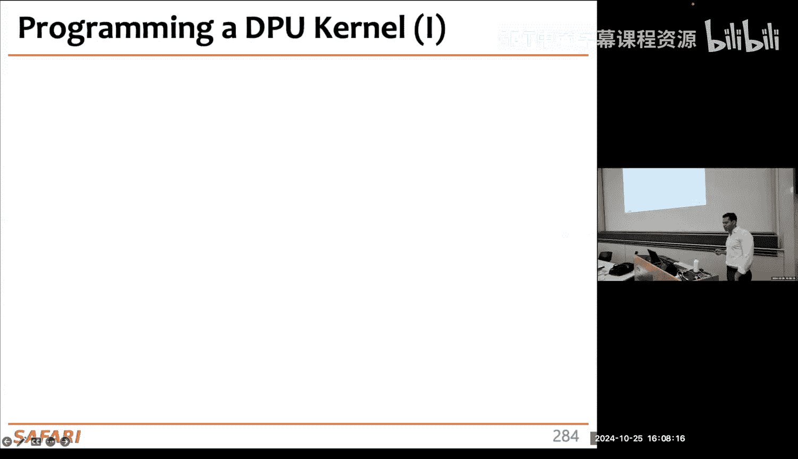

So this might sound quite hectic or complicated， but you can always follow this。

This is the same recipe to whatever course that you're going to implement in the lab so this is going to be available online so you can reference back over there。

😊。

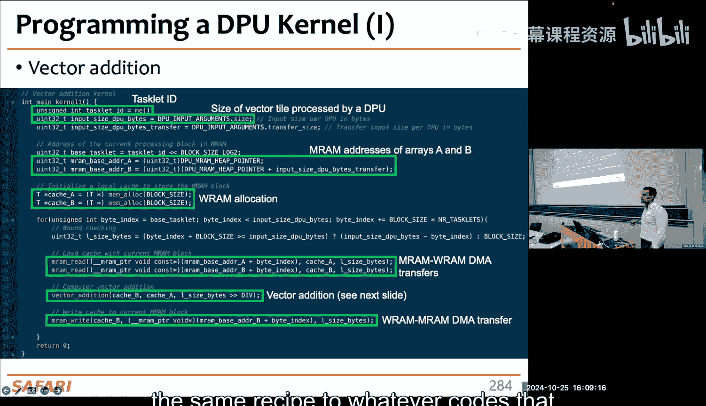

So finally， what is left for you to do is to launch the kernel， so vector addition here。

 and this is just a vector addition operation。😊，So also you can synchronize the different testlets using somechron synchronization routines that the SDK provides and those are some mut text some handshake barriers and same for and you need to use those synchronization barriers if you are implementing something like a parallel reduction where testlet are going to work together on a reduction operation so how you do that you define the data into different testlets you compute local sum but at one point you need to have one single DU computing the final local sum here so basically here you have accumulation variable and once this computation is done you move this accumulation variable and finalize the final sum in one given testlet here doing a。

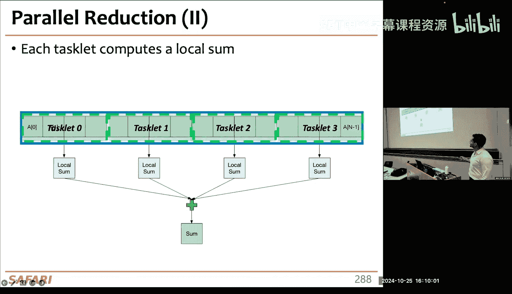

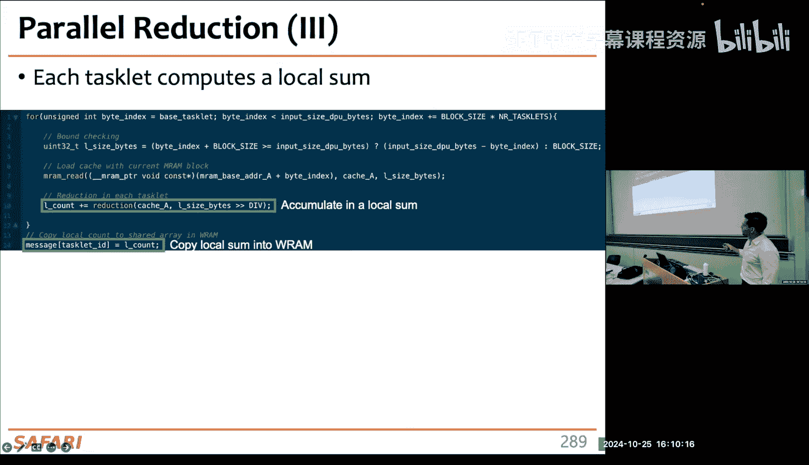

Doing a SQL accumulation。

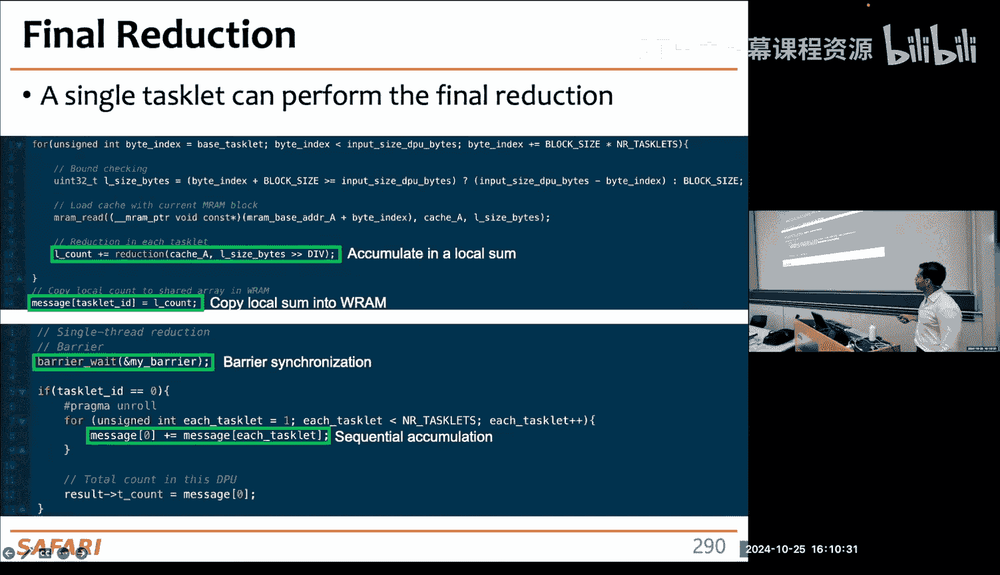

So that was extremely fast description of the APIs。

 but hopefully this was at least a guide for you to know which API routines you are going to use doing lab3 so in lab3 I'm going to post the handouts today we are not going to use the realM system because they are in a server and need to buy time over there but in the upM SDK they provide us some simulator of the upMP system and this is what we are going to use so the hangout the handout describes you how to install and use the SDK and the simulator but you also provide some Docker container which you can just launch and then everything's already install the simulator already works and you can just start including implementing your code。

😊。

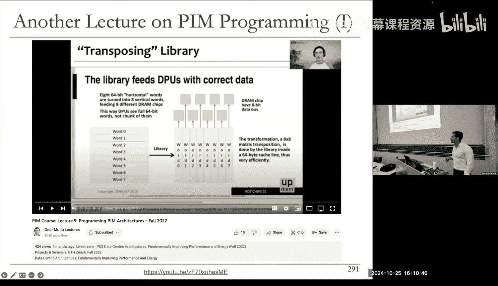

So you're going to find inside the handouts template files for test one and for test2。

 the test one here you're just going to play along with those data transfer serial parallel level and broadcast and they are going to measure performance using instruction count and then the second test you're going to implement simple kernel here which basically it performs y equals y plus x and then you're going to test you're going to check this kernel with different data format and then you're going to see that in the files there there is a makefio and the makefi is makes quite easy everything' parameterizable so you can just change the make fileo compile to those different data types and then measure the instruction count and then repeat that for each one of them。

Finally you're going to use the implement the vector reduction and for the vector reduction you're going to have to use this incorronization barrier then you have bonus portions of the lab as well that you have to implement RGB brightness kernel over there as well if you want to do the bonus。

😊，So。That is for La3， don't know if there is any question for lab3。

I test on my computer which is intel， but it shouldn't have if you just have Docker， you just run。

And we have a docker for Linux and for Windows as well， so you should walk on both。I a question。Okay。

 sorry。So this is Le three， I's going to propose today in the evening after I finish here and then the deadline is in two weeks。

 the soft deadline line。😊，So that was the main thing so as you saw programming these DU systems required you to do a bunch of stuff so you need to split the data across the different pin kernels you need to manually transfer the data within the DPUs and the host main memory you need to manually handle caches between the AM and the WM and you need to manually transfer output data from pin chips to main memory so in practice you as a programmer are going to have to do several attached to implement something so you need to align data because the data needs to be8 byte line to fit inside a single DU at a time you're going to have to collect input parameters and transfer those input parameters to the different DPUs using those data parallel or serial of data transfers you're going to have to launch the computation collect results from the DPUs。

Manage the scratch pads， so manage the data between the MR and the WR。

 and you're going to have to illustrate the computation and the communication finally。

And we know that all of this is quite cumbersome as part of the lab。

 but we have been working on trying to design frameworks that tries to age the programmability of the augmenting system。

 this is the DA framework which we cannot use for the lab because then we don't need to do anything but basically this framework uses this concept of data parallel patterns to abstract away。

😊，Those tasks that the programmer needs to do and basically we implement those five data parallel patterns here this is called skeleton based program so the user just defined how data is map between inputs and outputs and define a modifiable function and then basically you can combine those different parallel patterns to do some form of computation。

😊，So the way that this works is basically， we have this concept of a pipeline and this pipeline is going to allow you to do different transformation across different stages and each state is going to represent a different data parallel pattern。

😊，AndSince the data flows sequentially across different states。

 the framework automatically handles those data transfers。

 the data orchestration routines that are required in the implementinging system。😊，So yeah。

 so this framework that we implemented compiles and executes each stage of the pipelines automatically compared completely independent from the user so the way that it does so let's say that you want to do this targetgg computation here the only thing that you need to do is define the stages that you're going to be required for this computation so in this case a map and reduces stage and then there is the framework dynamic compiles this code down to upM pioneers and run the application in the upM system itself。

😊，So this is the D framework that different work that we designed to try to reduce the complexity of programming real pro memory systems。

 and owner also mentioned the simpleping architecture。

 which is an early implementation of the similar framework。😊。

So you also implemented this transring Lib， which is a library of coordinate of transal functions for the upming system because the upm Hader does not provide you harderer support for those transal functions themselves so basically we opt up to creative APIs that that。

😊，Appr presentational functions using either lookup tables or called the implementations of them。

 and we implement several key presentational functions over there and the API is available online。😊。

So this concludes my I think that was the last lecture memory study computing this semester。

 hopefully sorry for going over time but hopefully you enjoyed it again this is a great time to do pro memory research there is still a lot of things to be done across the memory stack we can do all of them one step of a time。

😊，And with this deployment of P in the field right now in real product more than ever we have a lot of great incentive to push for those memories and key architectures again next week I'm flying to micro and you're going to have pin tutorial over there we are going to have invited talks from other P researchers and it's going to be available online on YouTube so you are going to have。

😊，If you want to join feel free to join you're going to have other people talking about memories and computing so you're going to see that I'm not the only one inventing all of those things from my head because I want to have a PCD from Meha so it's good for you to to see other people talking about their own problems related pro memory and again we are currently working on the new version of pinbook chapter which I need to finish now which is going to be available soon so thank you so much for your attention sorry again for going over time and if you have any question related to a lab trip you can post some Modo and going to try to solve everything。

😊，Thank you everyone， I don't know if there is any boarding questions。Otherwise， we are done。

 Thanks so much。

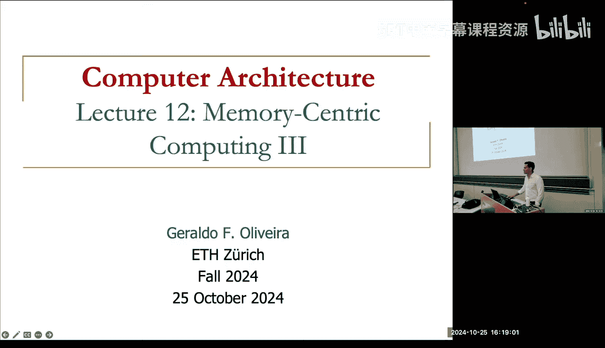