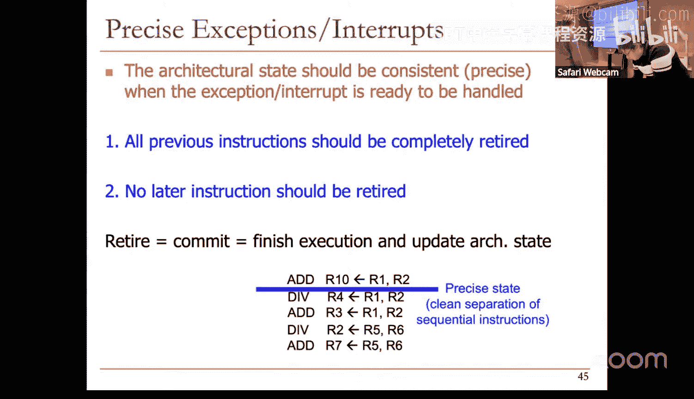
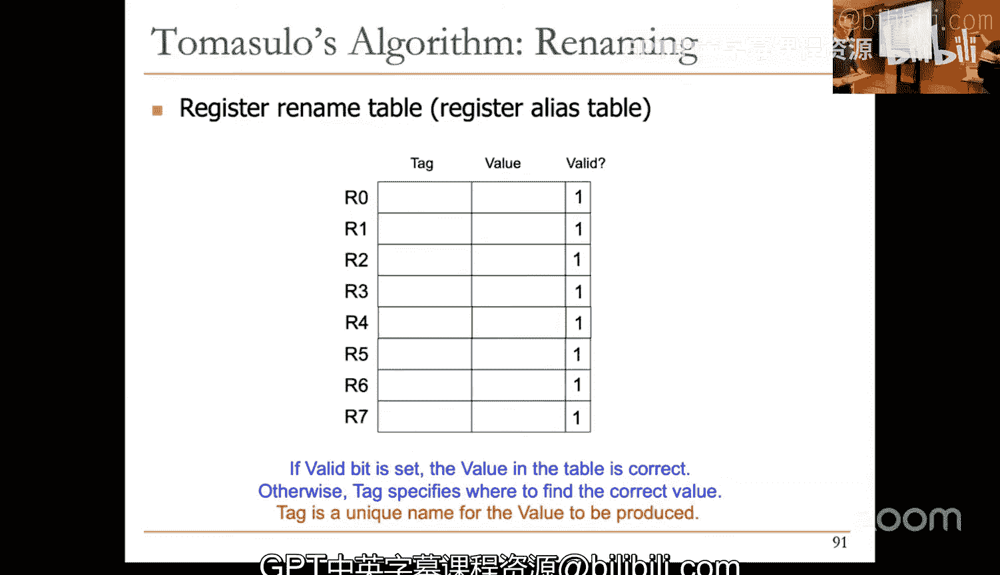

# 2：流水线与乱序微处理器设计 (Spring 2025)


## 概述
在本节课中，我们将深入学习流水线处理器的核心概念，探讨其理想模型与实际实现之间的差距。我们将重点分析导致流水线停顿（Stall）的各种原因，特别是数据依赖性问题，并介绍如何通过数据旁路（Bypassing）等技术来缓解这些问题。最后，我们将引入乱序执行（Out-of-Order Execution）的基本思想，作为提升处理器吞吐率、容忍长延迟操作的关键技术。

---

## 理想流水线与现实挑战
上一节我们介绍了多周期处理器和流水线的基本概念。理想流水线假设各阶段工作量均衡、操作相互独立。然而，现实中的指令流水线并非如此理想。

首先，不同流水线阶段的延迟可能不同。为了统一时钟控制，我们必须让所有阶段遵循最慢阶段的时钟周期，这导致了内部碎片化（Internal Fragmentation）。

其次，不同指令执行不同的操作，但被强制通过相同的流水线阶段。例如，不访问内存的指令仍需经过内存访问阶段，这造成了硬件资源的浪费，即外部碎片化（External Fragmentation）。

更重要的是，指令之间并非相互独立。它们之间存在依赖关系，流水线必须能够检测并解决这些依赖，以确保最终结果的正确性。

---

## 流水线停顿的原因
流水线停顿是指流水线停止流动的状态。理想情况下，流水线应持续流动。停顿主要由以下原因引起：

1.  **资源竞争（Resource Contention）**：当多个流水线阶段需要同时使用同一硬件资源时发生。
2.  **依赖关系（Dependencies）**：指令间的数据依赖或控制依赖导致后续指令无法继续执行。
3.  **长延迟操作（Long Latency Operations）**：某些操作（如访存）需要多个周期才能完成，会阻塞流水线。

依赖关系有时也被称为“冒险”（Hazards），它规定了指令间必须遵守的执行顺序。主要有两种基本类型：
*   **数据依赖（Data Dependence）**：一条指令需要使用另一条指令产生的结果。
*   **控制依赖（Control Dependence）**：一条指令是否执行取决于前一条分支指令的结果。

本节我们将主要关注数据依赖。

---

## 资源竞争的处理
资源竞争，有时也称为资源依赖，并非程序语义所固有，而是由硬件资源限制引起。

以下是处理资源竞争的两种基本方法：

*   **消除竞争根源**：例如，复制资源或提高资源吞吐率。一个典型例子是使用独立的指令缓存（I-Cache）和数据缓存（D-Cache），或者为内存提供多端口访问，以支持取指和加载/存储操作的并发进行。
*   **检测竞争并停顿**：如果无法增加资源，则需检测资源竞争，并停顿其中一个竞争阶段。通常，会停顿流水线中较晚的阶段（如取指阶段），以便让较早的、正在使用关键资源的指令（如处于内存访问阶段的加载指令）能够继续执行。

---

## 数据依赖的类型
数据依赖是影响流水线性能的关键因素。主要分为三类：

1.  **真数据依赖 / 流依赖（Flow Dependence, Read After Write - RAW）**
    *   **含义**：后续指令需要读取前导指令写入的结果。这是真正的生产者-消费者关系。
    *   **示例**：`指令I: ADD R1, R2, R3` 后跟 `指令J: SUB R4, R1, R5`。指令J依赖于指令I写入R1的结果。
    *   **公式表示**：如果指令 `I_j` 使用指令 `I_i` 写入的寄存器，且 `i < j`，则存在流依赖。

2.  **反依赖（Anti Dependence, Write After Read - WAR）**
    *   **含义**：后续指令要写入一个寄存器，而前导指令需要读取该寄存器的旧值。
    *   **示例**：`指令I: ADD R1, R2, R3` 后跟 `指令J: SUB R2, R4, R5`。指令J写入R2不能发生在指令I读取R2之前。
    *   **性质**：这是一种“假依赖”，源于架构寄存器数量有限。如果寄存器命名空间足够大，可以消除。

3.  **输出依赖（Output Dependence, Write After Write - WAW）**
    *   **含义**：两条指令都要写入同一个寄存器。
    *   **示例**：`指令I: ADD R1, R2, R3` 后跟 `指令J: SUB R1, R4, R5`。必须保证R1最终的值是指令J写入的结果。
    *   **性质**：同样是一种“假依赖”，源于寄存器名称冲突，可通过重命名消除。

**核心区别**：流依赖是**值**的依赖，必须严格遵守以保证程序正确性。反依赖和输出依赖是**名称**的依赖，由有限的架构寄存器引起，在硬件层面可以通过寄存器重命名技术消除。

---

## 处理流依赖的方法
处理流依赖有六种基本思路：

1.  **检测并停顿**：检测到依赖后，停顿流水线，直到所需值在寄存器文件中可用。这是性能最低的方案。
2.  **检测并旁路（Bypassing / Forwarding）**：检测到依赖，但不立即停顿。当生产者指令产生结果后，通过专用通路直接“旁路”给消费者指令，无需等待写回寄存器文件。
3.  **软件调度（编译时）**：编译器在生成代码时，了解底层流水线结构，通过重排指令顺序或插入空操作（NOP）来避免硬件停顿。
4.  **乱序执行**：检测到依赖后，将后续无法立即执行的指令移开，让独立的指令继续执行。这是本节后半部分的重点。
5.  **值预测（Value Prediction）**：预测所需的值并继续执行，待实际值产生后再验证预测是否正确。这增加了复杂性。
6.  **细粒度多线程（Fine-Grained Multithreading）**：每个周期从不同的线程取指，利用线程间的天然独立性来填充流水线。这种方法以牺牲单线程性能为代价，常见于GPU。

---

## 数据旁路（Bypassing/Forwarding）
数据旁路是减少流水线停顿的关键硬件技术。

**问题**：在基本流水线中，如果消费者指令需要等待生产者指令将结果写回寄存器文件后才能读取，将导致多个周期的停顿。

**解决方案**：增加额外的数据通路和检测逻辑，使得生产者指令的结果一旦在流水线中产生（例如在ALU执行阶段末或访存阶段），就可以直接转发给需要该结果的消费者指令的输入端口，而无需经过寄存器文件。



**旁路路径示例**（以经典5级流水线为例）：
*   **从EX/MEM寄存器旁路到ALU输入**：将刚计算出的结果直接用于下一条指令的运算。
*   **从MEM/WB寄存器旁路到ALU输入**：将刚从内存读取的数据或更早的计算结果用于当前指令的运算。
*   **寄存器文件内部转发**：在同一时钟周期内，前半段写回的结果在后半段可以被读取。


**旁路逻辑**：硬件需要比较消费者指令的源寄存器ID与流水线中所有后续指令的目的寄存器ID。如果匹配且该结果已产生（位于某个流水线寄存器中），则通过多路选择器（MUX）选择旁路数据作为输入。

**局限性**：并非所有依赖都能通过旁路解决。例如，加载指令（LOAD）的数据在访存阶段结束时才可用，无法直接旁路给当前周期正处于执行阶段的下一条指令的ALU，否则会延长关键路径。这种情况下，仍需插入一个停顿周期（气泡）。

---

## 精确异常（Precise Exceptions）
在支持乱序执行或长延迟操作之前，必须保证处理器的异常行为符合冯·诺依曼模型的顺序语义，即**精确异常**。

**为什么需要精确异常？**
1.  **维护ISA语义**：顺序执行是编程模型的基础。
2.  **便于调试**：当程序因异常（如除零错误）停止时，程序员希望看到的是异常指令之前的所有指令已生效，之后的指令都未生效的状态。否则调试将极其困难。
3.  **操作系统支持**：进程的上下文切换、中断处理和恢复都需要一个明确定义的、一致性的机器状态。

**精确状态的定义**：当异常发生时，硬件必须保证：
*   所有在异常指令**之前**的指令都已执行完毕并更新了架构状态（寄存器、内存）。
*   所有在异常指令**之后**的指令都像从未执行过一样，没有更新任何架构状态。

**多周期操作带来的挑战**：在流水线中，一条长延迟指令（如除法）可能还未完成，后续独立的短指令（如加法）可能已经执行完毕。如果允许加法指令直接写回寄存器文件，就破坏了顺序提交的语义。一旦除法指令发生异常，架构状态将处于不一致的中间状态。

---

## 重排序缓冲区（Reorder Buffer, ROB）
为了解决多周期操作和乱序执行下的精确异常问题，引入了**重排序缓冲区（ROB）**。

**核心思想**：允许指令在功能单元中乱序执行完成，但在更新架构状态（寄存器文件、内存）之前，先将结果按顺序写入一个缓冲区（ROB）。只有当一条指令在ROB中成为最旧的指令，且已确认执行无异常时，才将其结果提交（Commit/Retire）到架构状态。

**ROB的工作流程**：
1.  **分配（Allocate）**：指令译码后，按程序顺序在ROB中分配一个条目。
2.  **执行（Execute）**：指令在功能单元中乱序执行。完成后，将结果和目的寄存器ID写入其ROB条目。
3.  **提交（Commit/Retire）**：ROB头部指针指向最旧的指令。检查该指令：
    *   如果已完成且无异常，则将其结果从ROB写入架构寄存器文件或内存，然后释放该ROB条目。
    *   如果检测到异常，则清空流水线和ROB，跳转到异常处理程序，并将该指令的PC等状态提供给处理器。

**ROB的优势**：
*   以相对简单的方式实现了精确异常。
*   自然地消除了反依赖（WAR）和输出依赖（WAW），因为所有写操作都通过ROB顺序提交，寄存器重命名可以在此基础上进行。

**ROB的挑战**：
*   **数据获取**：一条指令需要操作数时，该操作数可能还在ROB中（未写回寄存器文件）。需要一种机制来从ROB中读取数据。
*   **实现复杂度**：ROB是一个循环队列，但根据寄存器ID查找值是一种内容寻址（CAM）操作，硬件开销较大。

**优化：寄存器重命名与ROB指针**
为了高效地从ROB读取数据，可以将**寄存器文件扩展**。每个架构寄存器对应一个条目，包含：
*   **有效位（Valid Bit）**：指示寄存器文件中的值是否是最新且可用的。
*   **值（Value）**：如果有效位为1，则为实际数据值。
*   **标签（Tag）**：如果有效位为0，则该标签指向**即将**产生该寄存器值的ROB条目ID。

当指令需要读取寄存器时：
1.  检查寄存器文件对应条目的有效位。
2.  如果有效位为1，直接使用该值。
3.  如果有效位为0，则使用存储的标签（ROB ID）去索引ROB（这是一个RAM操作，而非CAM操作），从中获取值或持续监听该ROB条目的完成广播。

这实质上是一种**寄存器重命名**：将架构寄存器（如R3）动态地映射到物理寄存器（一个ROB条目）。这消除了假依赖，并为后续的乱序执行奠定了基础。

---

## 乱序执行（Out-of-Order Execution）概念
在引入了ROB保证了顺序提交和精确异常后，我们可以进一步优化流水线前端的效率，这就是**乱序执行**。

**核心问题**：即使有旁路，在顺序发射（In-Order Issue）的流水线中，一条长延迟指令或数据未就绪的指令，会阻塞后续所有指令的发射，即使这些后续指令是独立的。

**核心思想**：借鉴**数据流（Data Flow）** 计算模型。在数据流机中，指令在其所有操作数就绪时立即“发射”（Fire）执行。我们将此思想引入到冯·诺依曼架构的内部。

**基本机制**：
1.  **顺序取指与译码**：指令按程序顺序从缓存中取出并译码。
2.  **寄存器重命名与分发**：译码后，进行寄存器重命名以消除假依赖。然后，指令被分发到**保留站（Reservation Stations）** 中。保留站是指令等待执行的地方。
3.  **乱序发射（调度）**：在保留站中，每条指令监控其所有源操作数是否就绪（来自寄存器文件或已完成的指令广播）。一旦某条指令的所有操作数就绪，它就被标记为“就绪”。
4.  **唤醒与选择**：每个功能单元从对应保留站的就绪指令中选择一条（根据优先级策略，如年龄）发射到执行单元。这就是**乱序发射**。
5.  **乱序完成与顺序提交**：指令在执行单元中乱序完成，将结果写回ROB，并通过**公共数据总线（Common Data Bus, CDB）** 广播结果及其标签（ROB ID）。所有正在等待该标签的保留站中的指令会捕获这个值。最后，指令在ROB中按程序顺序提交。

**类比**：将流水线比作高速公路。顺序发射时，一辆慢车（长延迟指令）会阻塞整条车道。乱序执行相当于为慢车设置了“休息区”（保留站），让它驶离主道，让其他快车（独立指令）先行通过。当慢车准备好后（操作数就绪），再从休息区驶入执行车道。

**乱序执行处理器的结构**：
```
     顺序前端                    乱序核心                          顺序提交
[取指 -> 译码 -> 重命名] -> [保留站（调度窗口） -> 功能单元] -> [重排序缓冲区（ROB） -> 提交]
       |                          |                                |
    寄存器文件                   结果广播(CDB)                   架构状态更新
       |__________________________|
                旁路/唤醒
```
*   **顺序前端**：保证控制流的正确性。
*   **乱序核心**：是一个基于数据流原理执行的引擎，负责挖掘指令级并行。
*   **顺序提交**：通过ROB保证最终结果的顺序语义和精确异常。

---

## 总结
本节课我们一起深入探讨了流水线处理器的核心挑战与进阶设计。

我们首先分析了理想流水线与现实之间的差距，重点讲解了导致流水线停顿的三大原因：资源竞争、数据依赖和长延迟操作。我们详细剖析了三种数据依赖（RAW、WAR、WAW），并指出只有RAW是真依赖。

接着，我们学习了处理依赖的多种方法，特别是**数据旁路**技术，它能有效减少RAW依赖引起的停顿。然后，我们探讨了实现**精确异常**的必要性，并引入了**重排序缓冲区（ROB）** 这一关键结构。ROB通过顺序提交机制，在支持乱序完成的同时，保证了处理器的状态始终满足顺序语义，便于调试和异常处理。

最后，我们引出了**乱序执行**的概念。通过将指令分发到保留站，并基于操作数就绪情况进行调度，乱序执行引擎允许独立的指令越过被阻塞的指令先执行，从而更好地容忍长延迟操作，挖掘程序中的指令级并行。ROB和寄存器重命名技术为乱序执行提供了坚实的基础。



下一节，我们将通过具体例子，深入观察乱序执行引擎的详细工作流程。