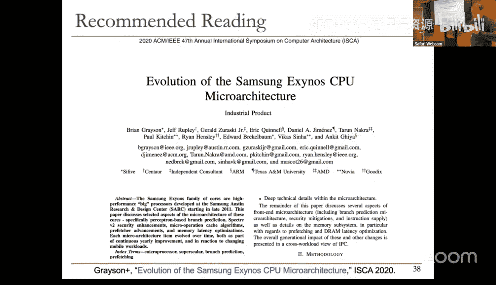
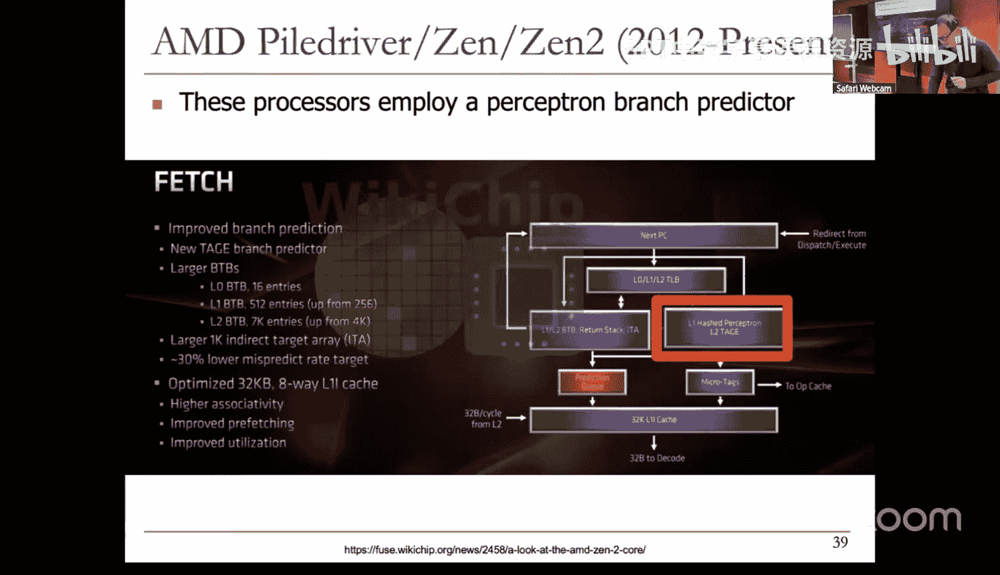
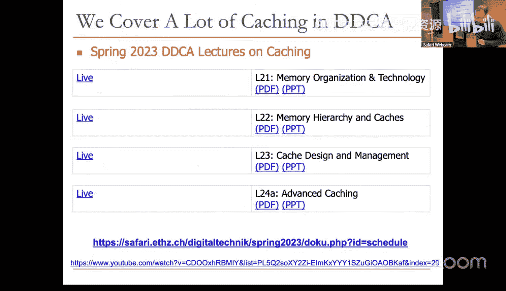
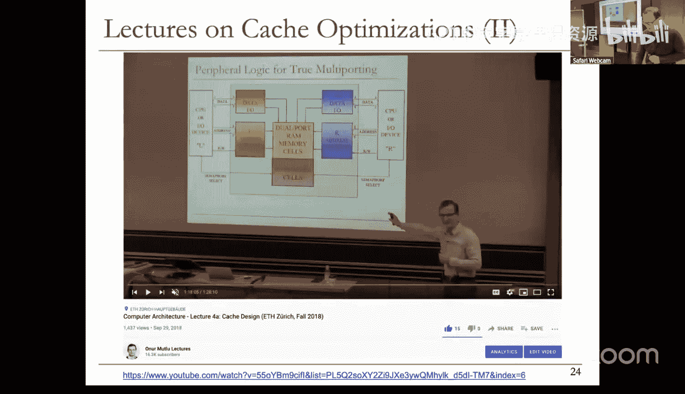
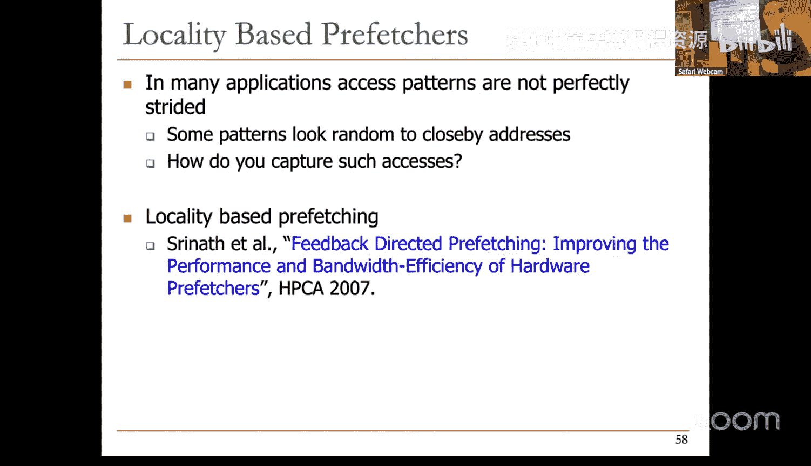

# 4：分支预测 II 与预取

在本节课中，我们将继续学习分支预测技术，并探讨如何通过预取来缓解内存延迟问题。我们将深入了解全局与局部历史预测、混合预测器、感知机预测器等高级概念，并介绍预取的基本原理、关键问题以及几种基础算法。

## 概述

上一节我们介绍了分支预测的基本概念和简单的两级计数器预测器。本节中，我们将深入探讨更高级的分支预测技术，包括利用分支间的全局相关性、同一分支的局部相关性，以及结合多种预测器的混合方法。随后，我们将转向另一个提升处理器性能的关键技术——预取，学习其核心思想、设计挑战和基础实现方法。

## 全局与局部历史预测

我们之前讨论了两级全局历史分支预测器（GAg）。它使用一个全局历史寄存器（GHR）记录最近N个分支的方向，并用此GHR值索引一个模式历史表（PHT，内含两比特计数器）来进行预测。其核心思想是：一个分支的结果可能与之前执行的其他分支结果相关。

然而，仅使用GHR会丢失“当前正在预测的是哪个分支”这一上下文信息。因此，McFarling提出了Gshare预测器，其改进在于将**程序计数器（PC）** 与**全局历史寄存器（GHR）** 进行哈希（例如异或操作）后，再用于索引PHT。公式表示为：
`索引 = PC XOR GHR`
这样做增加了上下文信息，提高了预测准确性，并更好地利用了PHT表项。

除了全局相关性，同一分支的结果也可能与其自身过去的结果相关，这称为局部相关性。例如，一个循环末尾的条件分支会呈现“1110”（取、取、取、不取）的固定模式。为了捕捉这种模式，我们可以使用局部历史预测器。

以下是局部历史预测器的关键组件：
*   **局部历史表（LHT）**：由PC索引，每个表项是一个记录该分支最近N次方向的历史寄存器。
*   **模式历史表（PHT）**：由局部历史值索引，每个表项是一个两比特（或更多）的饱和计数器，用于给出最终预测。

局部历史预测器能很好地预测具有固定模式的循环分支。

## 混合预测与感知机预测

不同的分支可能适合不同的预测策略。例如，循环分支适合局部历史预测，而存在条件依赖的分支可能适合全局历史预测。因此，**混合预测器**应运而生，它结合多种预测器，并通过一个元预测器（或选择器）动态选择当前最可能准确的预测结果。Alpha 21264处理器就采用了结合全局和局部历史预测器的混合方案。

另一种思路是使用简单的机器学习模型。**感知机预测器**将分支预测视为一个二分类问题。其核心操作是计算一个权重向量 **W** 与输入向量 **X**（由GHR的位构成，取值为+1或-1）的点积，并加上一个偏置权重 `w0`。如果结果大于0，则预测分支跳转。公式表示为：
`预测输出 = w0 + Σ (wi * xi)`
其中，`xi` 是GHR的第i位（+1表示跳转，-1表示不跳转），`wi` 是对应的权重。预测器会在线学习并更新这些权重，以捕捉分支结果与历史之间的复杂线性关系。

## 预取技术基础

分支预测旨在保持指令流水线充满，而**预取**则旨在在处理器真正需要数据之前，就将其从慢速内存提前加载到高速缓存中，从而隐藏内存访问延迟。

设计一个预取器需要回答四个关键问题：
1.  **预取什么（What）**：预测哪些内存地址将被访问。这依赖于对程序访存模式（如步长、流）的识别。
2.  **何时预取（When）**：发起预取的时机。过早可能导致数据在被使用前就被换出缓存（缓存污染），过晚则无法完全隐藏延迟。
3.  **存放在哪（Where）**：预取的数据放在何处。通常是直接放入缓存，但可能引发污染；也可以放入独立的预取缓冲区，但这增加了设计复杂性。
4.  **如何实现（How）**：由谁、以何种方式执行预取。可以是软件（编译器插入预取指令）、硬件（专用逻辑监控访存）或基于执行（例如，派发一个辅助线程进行预取）。

## 步长预取器

一种经典且常用的硬件预取器是**步长预取器**。它监控连续的访存地址，如果发现稳定的地址差值（步长），就预测后续访问将遵循这一模式并发起预取。

步长预取器主要有两种实现方式：
*   **基于指令（PC）的步长预取**：为每个加载/存储指令（通过PC标识）维护上一次访问的地址和观测到的步长。当同一指令再次执行且步长稳定时，则预取 `当前地址 + 步长`。这种方式能精确区分不同指令的访存模式。
*   **基于内存区域的步长预取**：将内存划分为区域，为每个区域记录访存步长。无论哪个指令访问该区域，都使用相同的步长进行预测。这种方式能捕捉由多个不同指令共同形成的步长访问模式。**流预取**是步长预取的一个特例，其步长为1（连续地址访问），在IBM Power等处理器中广泛应用。

预取器的性能通常用几个指标衡量：**准确性**（预取的数据中被实际使用的比例）、**覆盖率**（预取消除的缓存缺失占所有缺失的比例）和**及时性**（数据在需要时已存在于缓存中的比例）。设计时需要在侵略性（高覆盖率、高及时性）和保守性（高准确性、低缓存污染/带宽开销）之间取得平衡。

## 总结

本节课我们一起深入学习了高级分支预测技术。我们看到了如何利用全局和局部历史信息来提升预测精度，以及如何通过混合预测器和感知机等机器学习模型来应对不同类型的分支。随后，我们转向了预取技术，了解了其解决内存延迟问题的核心思想，探讨了设计预取器必须考虑的四个关键问题，并介绍了基础的步长预取器及其两种实现方式。这些技术是现代高性能处理器不可或缺的组成部分，对于充分挖掘硬件潜力至关重要。