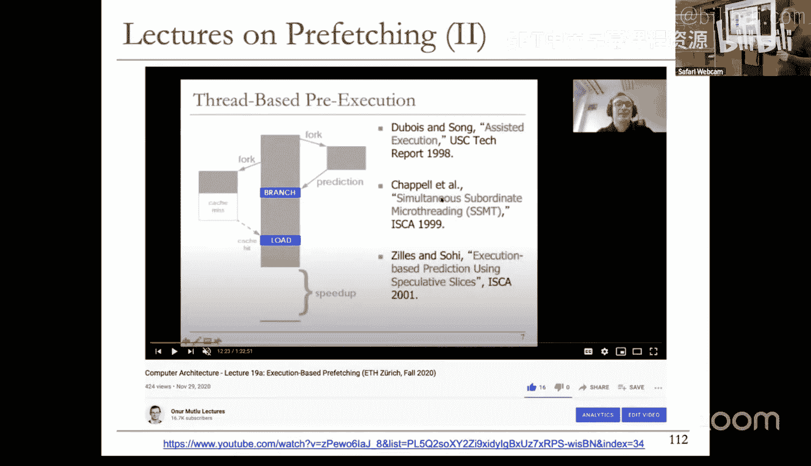

# 5：预取技术 II (Spring 2025)

## 概述
在本节课中，我们将继续探讨计算机架构中的一个基础且迷人的主题——预取技术。我们将深入硬件预取器的设计思路，并重点介绍一种强大的预取方法：基于执行的预取。课程将涵盖从简单的模式检测到复杂的、利用程序执行来预测未来内存访问的各种技术。

---

## 回顾：预取的基本问题与指标
上一节我们介绍了预取技术中的核心问题：预取什么、何时预取、预取到哪里以及如何预取。这些都是在内存层次结构中进行有效数据预取的关键考量。

在评估预取器性能时，我们主要关注三个辅助指标：
*   **准确率**：预取的数据被实际使用的比例。
*   **覆盖率**：预取器能够消除的缓存缺失的比例。
*   **及时性**：预取的数据在需要之前多久到达缓存。

此外，设计预取器时还需考虑**额外的带宽消耗**和可能引起的**缓存污染**，因为带宽是宝贵资源，而无效的预取会挤占有用的缓存行。

---

## 基于局部性的预取器
我们讨论过步长预取和流预取，它们能很好地处理规则的内存访问模式。然而，实际应用中并非所有访问都具有完美的步长。

一种更通用的方法是**基于局部性的预取**。其核心思想是监控特定内存区域内的访问模式，而非固定的步长。
1.  将内存地址空间划分为区域。
2.  当某个区域发生缓存缺失时，开始监控该区域附近的一系列访问。
3.  通过观察访问地址的变化方向（例如，持续增长），建立“方向”置信度。
4.  当置信度足够高时，预取器开始预取该方向上的多个地址，并以滑动窗口的方式持续监控和预取。

这种方法可以捕捉非步长的、但具有空间局部性的访问流，在现实处理器中非常有效。其攻击性（预取数量、窗口大小）可以通过参数调节，并可与步长检测结合以提高效率。

---

## 复杂模式与关联预取
实际工作负载可能展现出更复杂的模式，例如重复的“差值”序列。假设连续内存访问的地址差序列为 `+7, -6, +12, +6, -5, ...`，并且这个序列会重复出现。

**差值关联预取器** 旨在学习和预测这种模式：
*   记录历史差值序列作为“签名”。
*   当观察到特定签名时，预测接下来可能出现的差值。
*   例如，看到模式 `+7, -6, +12` 后，预测下一个差值是 `+6`。

这可以看作是更一般的**关联预取**的特例。最早的关联预取器基于内存地址本身进行关联。

**地址关联预取** 的基本概念是：
*   记录历史缓存块地址的访问序列（例如 A, B, C, D）。
*   构建一个概率模型（如马尔可夫模型），描述看到地址X后，地址Y出现的概率。
*   当再次遇到地址A时，根据历史记录预取与它关联的地址B、C、D。

**优势**：能够覆盖任意访问模式，包括不规则的数据结构遍历。
**挑战**：
*   若使用地址关联，存储开销巨大，因为需要为大量地址记录关联信息。
*   无法减少**强制性缺失**，因为必须见过该地址才能建立关联。
*   可能产生大量带宽消耗。

**差值关联** 通过操作地址差而非完整地址，显著降低了存储需求，并有可能预取从未见过地址的数据，从而减少强制性缺失。

---

## 面向指针的预取器
对于指针密集型应用（如链表遍历），一种创新的预取思路是**内容导向预取**。

核心思想：当缓存块被载入时，用硬件扫描块内的数据，识别出哪些值可能是**指针**（即内存地址），然后预取这些指针指向的数据。

如何动态识别指针？一个巧妙的方法是：
*   检查缓存块内所有指针大小（如8字节）的对齐值。
*   比较这些值的虚拟地址高位（例如前12位）是否与当前缓存块地址的高位匹配。
*   如果匹配，则该值很可能是一个指向同一虚拟地址空间区域的指针，进而对其发起预取。

**优势**：
*   无需记录历史信息，硬件开销相对较小。
*   可以预取从未访问过的指针数据，消除强制性缺失。
*   实现简单直接。

**劣势**：可能会盲目预取块内所有类似指针的值，不够精确，可能造成带宽浪费和缓存污染。

后续研究通过结合编译器或性能剖析信息，为硬件提供提示，指明哪些指针更可能被访问，从而提高了预取的精确性。

---

## 混合预取器与学习型预取器
单一预取器难以覆盖所有内存访问模式。因此，现代处理器通常采用**混合预取器**，集成多种预取策略（如步长预取、流预取、关联预取），类似于混合分支预测器。

**挑战**：
*   需要决策不同预取器之间的优先级。
*   多个预取器可能相互干扰，竞争缓存空间和内存带宽。
*   需要更复杂的机制来管理和节制总体预取行为。

更前沿的方向是引入**机器学习**来指导预取。例如，使用**强化学习**构建自优化预取器。
*   **智能体**：预取器本身。
*   **状态**：当前内存请求的特征（如程序计数器、历史地址差等）。
*   **动作**：选择预取的偏移量（例如，从当前地址A预取 `A+offset`）。
*   **奖励**：根据预取是否有用、是否及时以及系统带宽使用情况等因素给出正/负反馈。

预取器通过不断尝试，学习在特定状态下应选择哪个偏移量能获得最大长期奖励，从而自适应不同程序的行为。这类方法在复杂和非规则工作负载上展现出潜力。

---

## 基于执行的预取
前述预取器主要基于观察到的访问模式进行推断。而**基于执行的预取**采取了一种更直接的方法：通过提前执行一段程序代码来生成精确的预取请求。

基本理念：创建一个**推测执行线程**，其唯一目的是预取数据。
*   这个线程可以是主线程在遇到长延迟缓存缺失时，在空闲硬件上下文中发起的。
*   它“提前”执行程序中的代码，特别是那些会导致未来缓存缺失的指令链。
*   当主线程真正执行到那些代码时，数据已经被预取到缓存中。

### 前瞻执行
一种著名的基于执行的预取技术是 **“前瞻执行”**。
1.  当乱序执行窗口中最旧的指令是一个长延迟缓存缺失时，处理器对架构状态进行检查点保存。
2.  进入“前瞻模式”。在此模式下，处理器继续推测性地执行后续指令，但目的不是提交结果，而是**生成预取**。
3.  对于缺失数据的指令，将其标记为无效，使其不阻塞执行流水线，从而为后续独立指令让出空间，快速触及后续的缓存缺失。
4.  当最初引发前瞻的缓存缺失返回时，处理器回滚到之前保存的检查点，恢复正常执行。此时，后续缺失的数据很可能已在缓存中。

**优势**：
*   **高精度**：沿实际程序路径执行，预取准确率极高。
*   **覆盖复杂模式**：能处理指针追逐等不规则访问。
*   **硬件利用**：复用现有的乱序执行硬件，无需完全独立的硬件上下文。

**挑战**：
*   **执行额外指令**：可能执行许多最终无用的指令，消耗能量。
*   **受分支预测限制**：如果前瞻线程走在错误路径上，预取可能无效。
*   **前瞻距离有限**：受限于最初缓存缺失的解决时间。

前瞻执行及其变体已被证明能有效提升性能，其思想在工业界和学术界持续产生影响，后续研究致力于提高其效率、扩展其前瞻距离（如在内存控制器中实现连续前瞻），并探索其在向量化等场景下的应用。

---

## 总结
本节课我们一起深入探讨了硬件预取技术的多个高级主题：
1.  我们学习了如何通过**基于局部性的预取**来捕捉非步长的空间访问模式。
2.  我们分析了**关联预取器**如何通过记录和预测地址或差值序列来处理复杂、重复的访问模式。
3.  我们探讨了专为指针数据结构设计的**内容导向预取器**及其优化思路。
4.  我们了解到现代系统采用**混合预取器**以覆盖多样化的访问模式，并面临新的管理挑战。
5.  我们介绍了利用**强化学习**的自适应预取器这一前沿方向。
6.  最后，我们重点学习了**基于执行的预取**，特别是**前瞻执行**技术，它通过推测性地提前执行程序来生成高精度的预取，是处理不规则内存访问的强大工具。

预取技术仍然是计算机架构中一个活跃且基础的研究领域，在提升系统性能、降低内存延迟方面至关重要。随着工作负载和体系结构的不断演进，新的预取思想和技术将持续涌现。