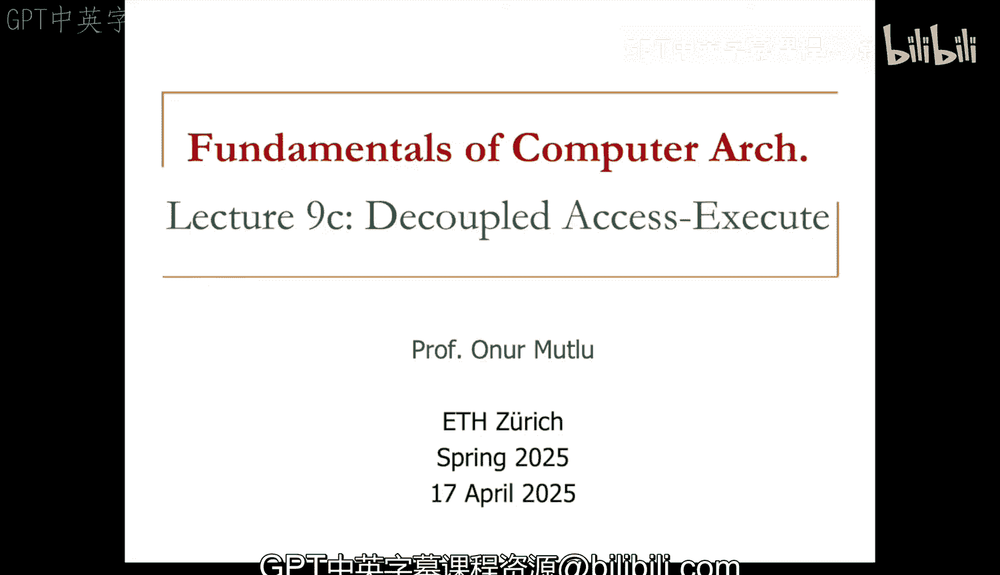
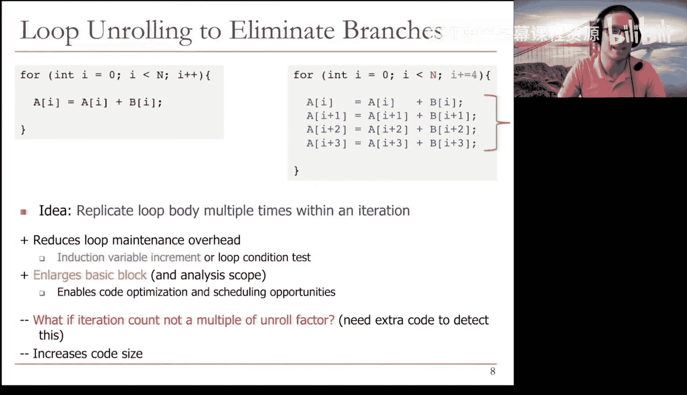
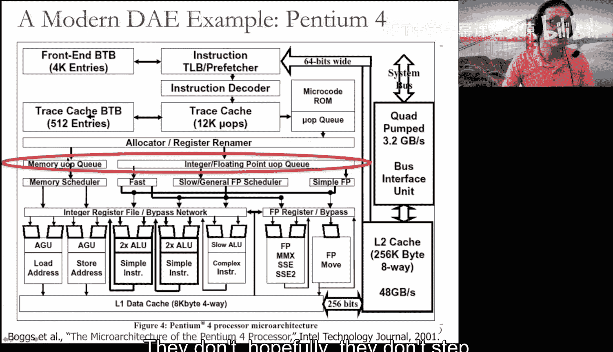
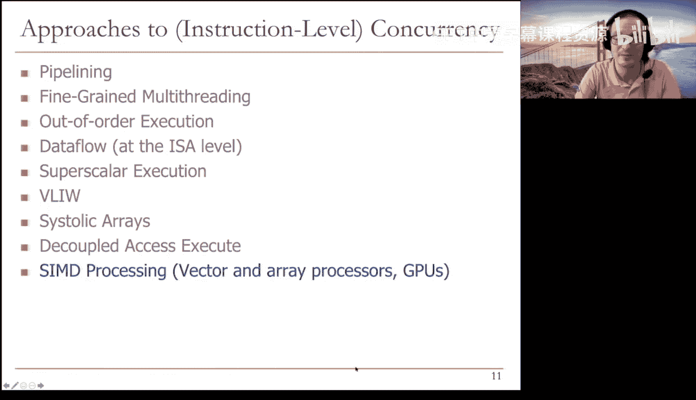
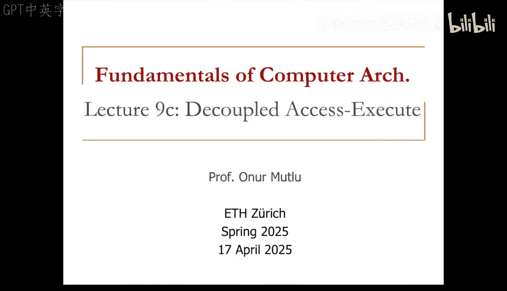

# 9c：解耦访存执行 (DAE) 🧠

在本节课中，我们将学习一种名为“解耦访存执行”的处理器设计范式。这种设计旨在通过分离内存访问和计算执行来提升性能，同时保持硬件设计的相对简单性。

## 概述与动机 🎯

上一节我们讨论了VLIW和脉动阵列。本节中，我们来看看解耦访存执行。其基本动机是，像Tomasulo算法这样的乱序执行机制在1980年代（奔腾Pro之前）被认为过于复杂，难以实现。人们希望系统不要如此复杂。VLIW也可以被置于类似的定位，因为它与乱序执行有着截然不同的设计哲学。

解耦访存执行拥有非常相似的设计哲学，但它没有在硬件上走到极致。我们将看到，它从根本上改变了硬件设计。

## 核心思想 💡

基本思想是将操作访问（即内存访问）与执行（即计算）解耦。我们有两个独立的指令流，它们通过指令集架构可见的队列进行通信。

以下是其系统架构的直观描述：
*   你有一个**访存处理器**和一个**执行处理器**。
*   访存处理器的任务仅仅是获取内存数据并供给执行处理器。
*   执行处理器的任务是将所需的内存地址提供给访存处理器。
*   它们通过队列进行通信。

这种设计的美妙之处在于，这是两种不同类型的任务。内存访问可能受限于内存带宽，而计算可能不受限。因此，你可以在等待内存的同时继续进行计算。反之亦然，有时你可能在等待长时间的计算，但可以继续进行内存访问。这样，无需实现完整的乱序执行，访存处理器和执行处理器之间也无需停顿。当内存操作进行时，你可以进行计算，反之亦然。这就是它的优势所在。

这个概念由Jim Smith在1982年的开创性论文中提出，其基本原理至今仍应用于计算系统中，尽管形式不完全相同。

## 架构细节与优势 ⚙️

首先，指令集架构需要改变，因为通信通过这些队列进行。这些是指令集架构可见的队列。因此，队列的长度决定了你能容忍的内存端和执行端的延迟量。

以下是队列的优势：
*   这些队列可以具有很高的可扩展性。它们不像重排序缓冲站或加载存储队列的标签匹配逻辑那样难以扩展。这里的队列是FIFO队列，易于扩展。
*   还有一个分支队列，用于保持两个处理器同步。

本质上，基本思想是将一个单一的指令流（例如著名的Livermore循环）分解为两个指令流：访存流和执行流。它们执行相同的功能，但内存访问操作在访存处理器中执行，计算和分支操作在执行处理器中执行。当需要将内存访问结果传递给执行处理器时，就将其放入“访存到执行”队列。执行引擎从该队列取出数据，并可能将结果放入“执行到访存”队列。通信通过这些队列进行。

**主要优势**在于，执行流可以领先于访存流运行，反之亦然。如果访存处理器在等待内存，执行处理器可以执行有用的工作。如果访存处理器命中缓存，无需等待内存，它就可以为落后的执行处理器提供数据。通常内存访问耗时更长，因此执行处理器通常可以在访存处理器等待时执行独立的指令。

**关键思想**是队列减少了对大量寄存器的需求。这些不是寄存器，你不需要像乱序执行引擎那样拥有数千个物理寄存器。通信通过这些FIFO队列进行。因此，你获得了有限的乱序执行能力，但没有唤醒和选择逻辑的复杂性，也无需庞大的物理寄存器文件。

## 面临的挑战与解决方案 🔧

当然，任何设计都有缺点。编译器的支持在这里至关重要，就像它对VLIW和Tomasulo算法一样。你需要编译器支持来划分程序和管理队列。这决定了你能获得多大的解耦程度。人们为此开发了许多有趣的编译技术。

另一个缺点是分支指令需要在访存处理器和执行处理器之间进行同步。因为你实际上是将一个指令流分离成两个，那么分支会怎样？它们在执行处理器中执行，但你需要通知访存处理器，以确保访存处理器不会永远走在错误的分支路径上。

此外，多指令流也是一个挑战。你需要生成两个指令流或为两个处理器编程，这可能很繁琐。但后来的研究表明，这可以通过单一指令流动态地分流到多个处理器来实现。例如，Astronautics Z1处理器就是这样做的：它有一个单一的取指单元，然后动态地分离成访存指令流水线和执行指令流水线。每个流水线内部都是顺序执行的，这非常重要。乱序执行的能力来自于一个流水线与另一个流水线的异步操作，直到它需要来自另一个流水线的数据。

以下是Astronautics Z1处理器的关键组件：
*   访存寄存器和执行寄存器。
*   用于在两个流之间通信的队列。
*   复制单元，用于将一个流水线的操作复制到另一个流水线。
*   重启堆栈单元，用于处理分支。

## 编译器技术：循环展开 🔄

分支处理是一个大问题。因此，许多编译器使用**循环展开**来消除分支。循环展开通过在一个迭代中复制循环体多次来工作。你可能已经了解过循环展开，它是一种非常基础的编译器技术，旨在尽可能消除分支，因为分支在VLIW、解耦访存执行以及脉动阵列中都会带来问题。

循环展开的思想是在一个迭代内多次复制循环体。当然，现在你在一个原始迭代中执行了四次迭代，因此需要确保正确地递增索引值，这会带来一些问题。但这样做之后，你执行的循环控制指令（如分支、条件测试）就减少了，从而降低了循环维护开销。基本块变大了，这为代码优化和调度创造了机会。

问题通常出现在迭代次数不是展开因子的倍数时。例如，展开因子是4，但n不是4的倍数，那么你就需要额外的代码来处理这种情况，这会增加最终代码的大小。但循环展开是一种非常简单的基于编译器的技术，有助于我们今天讨论的所有处理器，解耦访存执行是其中重要的一环。它在Astronautics Z1处理器中大量使用以提升性能。

## 实际应用与影响 🚀

现在，让我们看看解耦访存执行在实际处理器中的影响，然后结束本节。虽然描述的形式不完全相同，但解耦访存执行的原则被应用在我所知的一些旧处理器中。例如，在奔腾4处理器内部，在指令被重命名并分配到重排序缓冲区和寄存器之后，它们会经过一个内存部分和一个执行部分。你可以看到这就是解耦：处理器有一个专门处理内存操作的部分和一个专门处理执行操作的部分，它们彼此解耦。即使在像这样的乱序超标量执行处理器中，也解耦了访存和执行，这样你可以在不同组件上获得专业化，并且这些不同组件之间也能实现一定程度的乱序执行。

从更简化的视角看奔腾4，你可以看到内存和整数执行的解耦。这个概念甚至可以扩展到不同类型的执行，如浮点执行和整数执行。

## 总结与展望 📚

本节课我们一起学习了三种主要的设计思想：VLIW、脉动阵列和解耦访存执行。你可以思考一下未来它们可能在哪些领域发挥作用。

一个很好的问题是：解耦访存执行是否特别适合与VLIW结合？答案是肯定的。原则上，你可以将VLIW指令束的一部分作为内存束，另一部分作为执行束，从而在VLIW引擎中解耦访存和执行。这样，你既能摆脱VLIW的锁步执行限制，又能获得部分乱序执行的益处。这正是我喜欢将这些主题放在一起讲解的原因，因为解耦访存执行的原则可以应用于VLIW引擎，从而在不使硬件过于复杂的情况下，显著提升性能潜力。

希望你对这三种主要思想有所了解。我们下周将讨论另一个引人入胜且极具影响力的主题：向量处理器和GPU。届时再见。