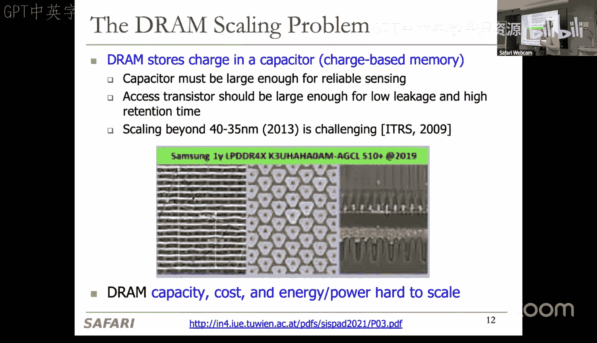
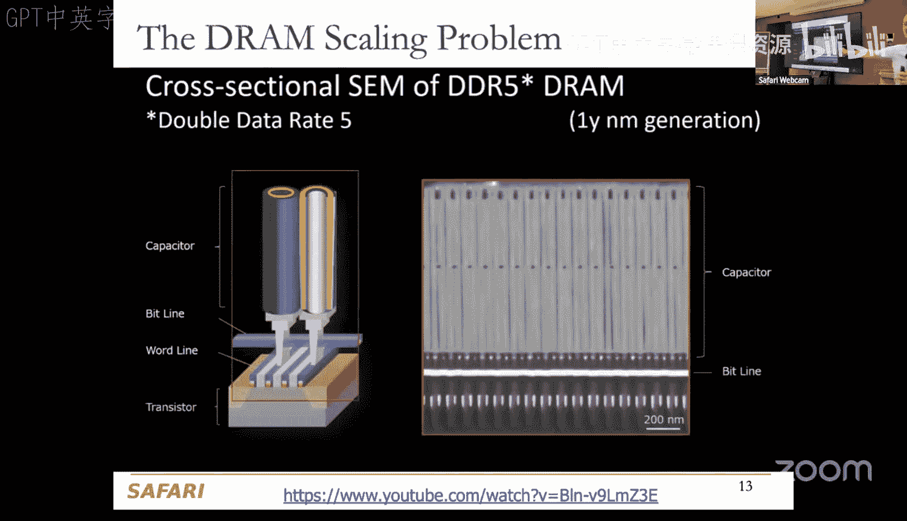
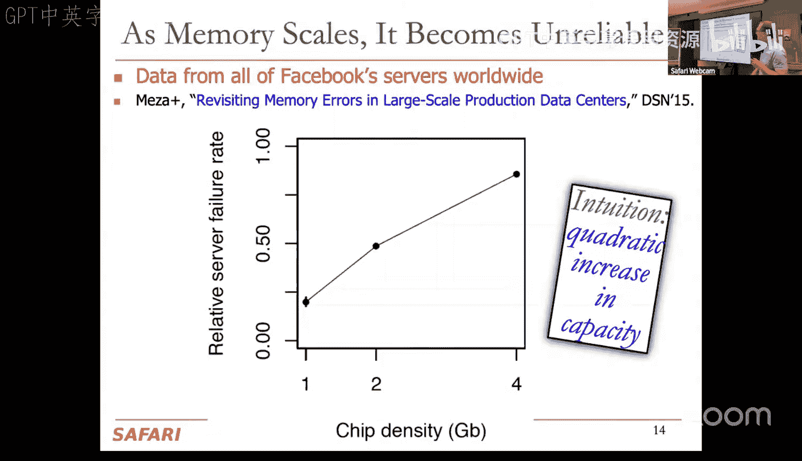
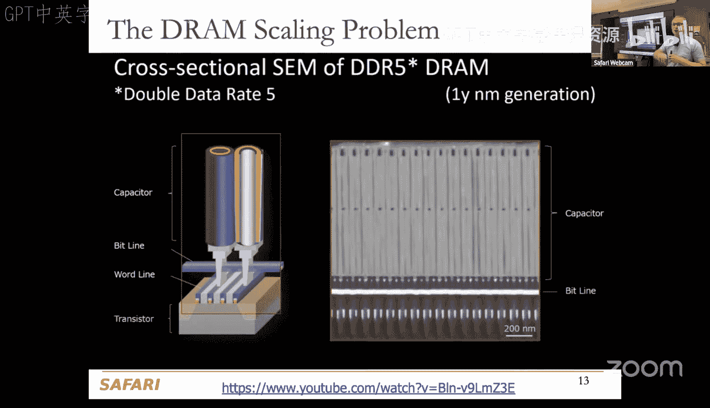
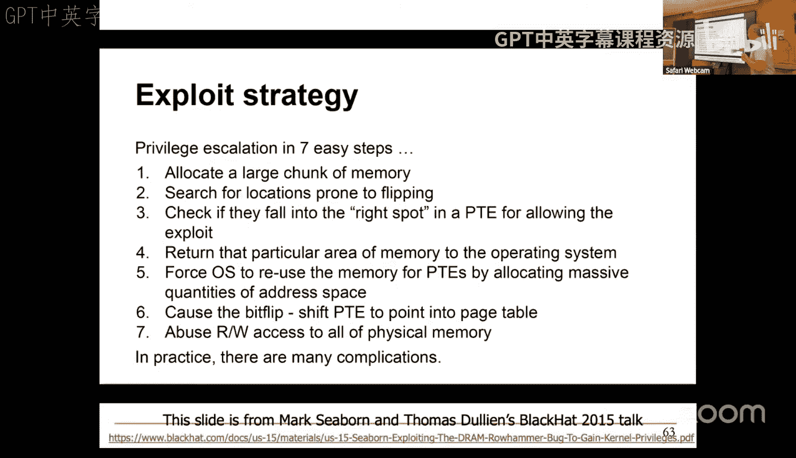
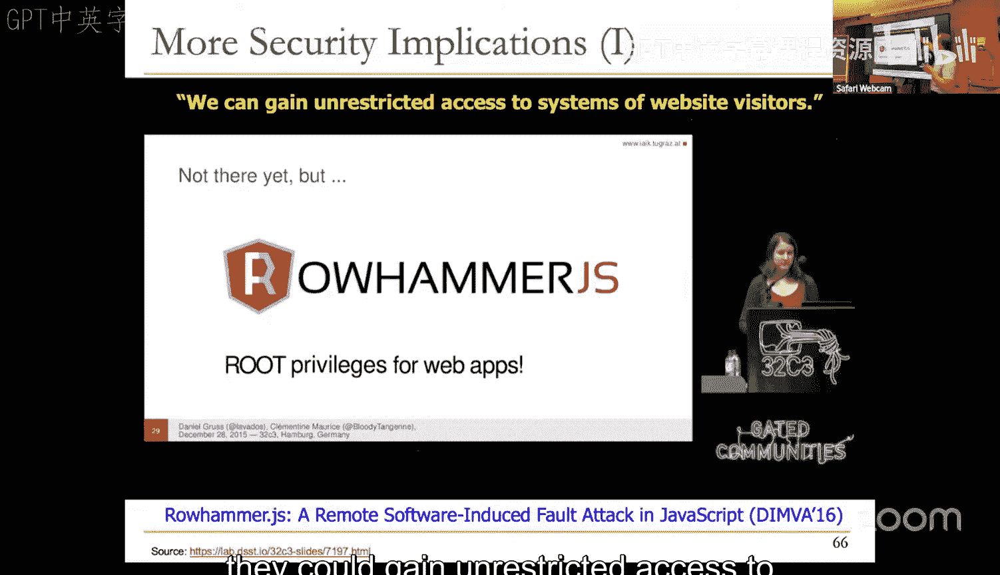
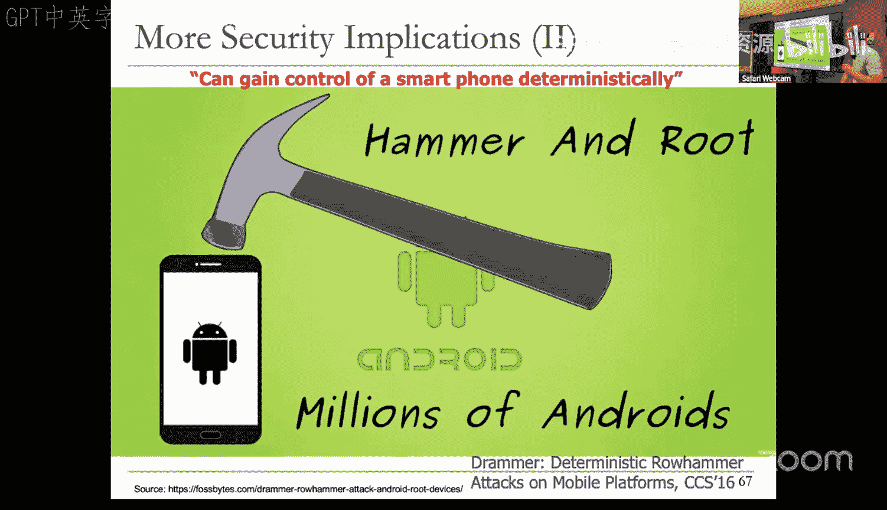
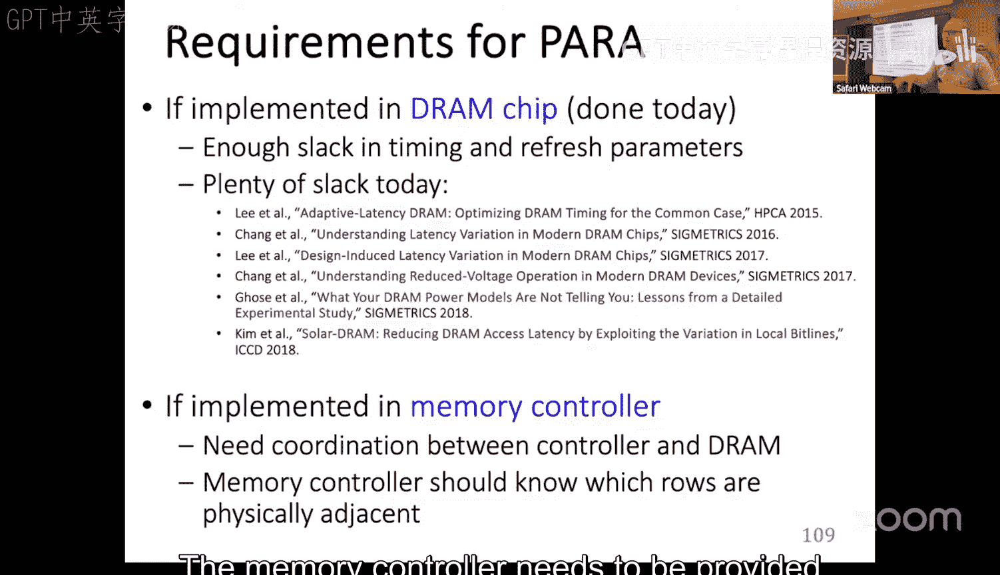
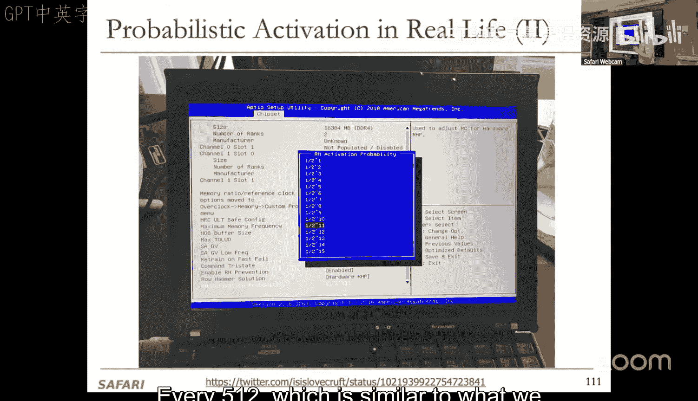
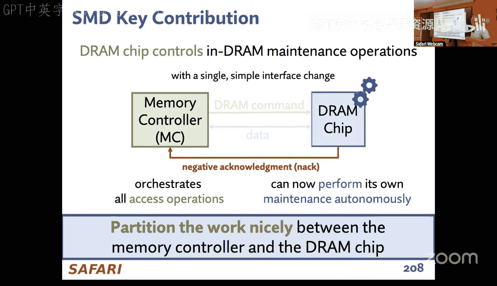

# 12：内存鲁棒性

在本节课中，我们将学习内存鲁棒性的核心概念，特别是由内存单元物理特性引发的比特翻转问题。我们将从基础的内存技术讲起，探讨其可靠性挑战，并深入分析一个著名的安全漏洞案例——Rowhammer。课程将涵盖该漏洞的原理、影响、利用方式以及业界提出的各种缓解方案。

## 概述：内存技术的可靠性挑战

现代计算机系统的主内存主要采用动态随机存取存储器技术。其基本存储单元由一个电容和一个访问晶体管构成。电容存储电荷，电荷的有无代表比特值“1”或“0”。为了追求更高的存储密度和能效，DRAM的制造工艺不断微缩，单元尺寸持续减小。

然而，技术微缩带来了显著的可靠性挑战。随着电容尺寸变小，其存储的电荷量减少，更容易受到噪声干扰，数据保持时间也缩短。这导致内存单元更容易发生非预期的比特翻转，即存储的值从0变为1或从1变为0。

## DRAM单元结构与微缩挑战

上一节我们介绍了DRAM的基本原理，本节中我们来看看其具体的物理结构以及微缩带来的问题。

DRAM单元的核心是一个用于存储电荷的电容器。访问晶体管则控制着电容与位线之间的连接，以便进行读写操作。为了可靠地感知电荷状态，电容器必须足够大，访问晶体管也必须足够大以确保低泄漏和较长的数据保持时间。

随着工艺节点进入10纳米级别，将电路特征尺寸缩小到35纳米以下变得极具挑战性。虽然业界通过垂直堆叠电容（类似建造摩天大楼）等创新技术实现了微缩，但代价是单元可靠性下降。电荷减少、保持时间缩短，单元更容易因噪声效应而受到干扰。

## 大规模研究：错误率与密度的关联

为了量化可靠性问题，我们与Facebook合作进行了一项大规模研究，分析了其所有数据中心中记录的内存错误。

研究发现，DRAM芯片的密度与其在服务器中观察到的错误率之间存在相关性。随着内存芯片变得更密集（即单元更小），故障率也随之上升。这项2015年的工作揭示了技术微缩对可靠性的直接影响，尽管如今芯片密度更高，但这一趋势依然存在。

## 深入研究：构建测试基础设施

为了更深入地理解这些技术缩放问题，我们构建了专门的FPGA测试基础设施。最初的目的是研究数据保持时间，因为我们预测随着单元变小，可保留的电子数量减少，数据保持将成为重大问题。

我们观察到，由于工艺差异，不同DRAM单元的数据保持时间存在很大差异。当时的标准是每64毫秒刷新所有单元。我们提出了一个想法：根据单元不同的保持时间，以不同的速率刷新它们。这被称为利用异构保持时间。

然而，实现这一想法非常困难，因为保持时间依赖于位置、存储的数据模式和时间。除非添加纠错码等机制，否则难以轻松实现。我们后续在DSN 2015上发表的AVATAR方案，结合了ECC和内存清理，可靠地解决了这个问题，并因此获得了Test of Time奖。

## 新问题的发现：Rowhammer漏洞

我们的测试基础设施不仅用于研究保持时间，还被用来探究其他类型的内存干扰错误。在闪存研究中，我们发现了“读干扰”现象，即访问一个单元会干扰其他单元。

这引出了一个关键问题：DRAM中是否也存在类似问题？我们确信可能存在，但不清楚在正常操作模式下是否会发生。于是，我们利用基础设施研究了在何种操作条件下会引发这种导致比特翻转的干扰。

这就是Rowhammer漏洞的发现过程。其原理是：反复激活（打开并关闭）DRAM中的一行（称为“攻击行”），会对物理上相邻的“受害行”中的脆弱单元产生电气干扰。这种干扰会导致受害单元中的电荷逐渐泄漏，经过足够次数的激活后，其存储的比特值就会发生翻转。

我们在2014年的ISCA论文中表明，通过对一个攻击行进行成千上万次的合法激活操作，可以预测性地诱发相邻行的比特翻转。更关键的是，我们证明了这可以在正常操作条件下，通过用户级程序实现。

## Rowhammer的原理与影响

上一节我们介绍了Rowhammer的发现，本节中我们来看看其具体工作原理和深远影响。

Rowhammer利用了DRAM的基础操作。激活一行会将其数据读入感应放大器，同时对该字线施加高电压。关闭（预充电）该行则施加低电压。反复进行“激活-预充电”操作是合法操作，但只要在单元被刷新之前进行足够多次，就会对相邻行的脆弱单元造成累积性电荷泄漏，最终导致比特翻转。

我们对来自三大主要DRAM制造商的129个模块进行了测试，发现2010年后制造的芯片中，超过80%存在此漏洞。这是一个随着技术微缩而恶化的问题：单元越小，越脆弱。

这个漏洞的深远意义在于，它首次展示了简单的硬件故障机制如何引发广泛的系统安全漏洞。安全研究人员随后展示了利用这些比特翻转可以进行各种强大的攻击。

## 用户级攻击与安全漏洞

我们开发了一个简单的用户级程序来演示Rowhammer攻击。该程序使用特定的汇编指令序列，确保两个地址X和Y映射到相同的DRAM存储区，并且不被缓存。通过反复访问（“锤击”）这些地址，可以在易受攻击的芯片上引发比特翻转。

更有效的是一种称为“双侧锤击”的技术，即用两个攻击行夹击一个受害行，干扰来自两侧，成功率更高。

谷歌的安全团队在看到我们的论文后，基于此开发了两种权限提升攻击。其中一种攻击通过Rowhammer诱发页表项中的比特翻转。攻击者通过“页表喷洒”技术，在物理内存中填充大量指向同一物理文件的页表项。如果Rowhammer恰好在某个PTE的关键位（如物理页号）上引发翻转，就可能使该PTE指向一个攻击者本无权限访问的物理页。如果这个被错误指向的页恰好是页表本身，攻击者就获得了读写页表的能力，从而完全控制系统。

此后，出现了更多利用Rowhammer的攻击，包括通过JavaScript进行远程攻击、利用Android内存分配模式的确定性攻击、甚至通过GPU或网络远程直接内存访问发起的攻击。

## 缓解方案与行业应对

发现漏洞后，需要立即和长期的解决方案。我们提出了多种缓解思路：

1.  **增加刷新率**：更频繁地刷新所有行，减少攻击窗口。这是最简单的方法，但会显著增加能耗、降低性能。
2.  **物理隔离**：隔离关键数据与普通数据。实施成本高，且难以保证安全。
3.  **纠错码**：ECC能有效防护随机比特翻转，但对Rowhammer这种可诱发多位翻转的定向攻击效果有限，强ECC成本高昂。
4.  **反应式刷新**：检测频繁激活的行（攻击行），并刷新其相邻行（受害行）。
5.  **主动式限制**：检测并限制对频繁激活行的访问速率。

在我们的ISCA论文中，我们提出的最佳方案是**概率性相邻行激活**。其思想是：内存控制器在关闭一行后，以很低的概率（例如0.5%）主动刷新其相邻行。这是一种低开销、低复杂性的统计性防护方案。英特尔曾在其内存控制器中实现了类似方案。

行业最初的应急响应是普遍增加内存刷新率（例如苹果公司）。随后，DRAM制造商试图通过“目标行刷新”（一种内部机制，可能包含用于跟踪频繁激活行的表）来解决问题，并声称已修复漏洞。

## 漏洞的持续演进与挑战

然而，后续研究表明问题远未解决，且更加严重。

我们的后续研究发现，新一代DRAM芯片对Rowhammer更加脆弱，比特翻转所需的激活次数（即“锤击计数”）大幅降低。例如，某些LPDDR4芯片在仅4800次双侧锤击后就会失效。模拟表明，随着锤击计数降低，许多缓解方案（包括PARA）的性能开销会变得不可接受。

我们与另一研究团队合作，通过“多面锤击”攻击成功绕过了DRAM制造商的内置防护机制。攻击原理是同时锤击大量行（例如19行），以溢出芯片内部用于跟踪攻击行的容量有限的计数器或表格。

更深入的研究揭示了Rowhammer特性的复杂性，它受温度、攻击行激活保持时间、单元物理位置等多种因素影响，且存在空间差异（少数单元极度脆弱）。这为设计更具针对性的防护机制提供了思路。

## 新的威胁：RowPress

除了Rowhammer，我们还发现了另一种干扰现象：**RowPress**。其原理不是高频激活，而是将一行保持开启状态很长时间。

研究表明，将一行激活并保持开启数十毫秒（这超出了标准但用于研究），仅需单次激活就能导致相邻行比特翻转。即使在标准允许的70.8微秒最大开启时间内，也能将引发比特翻转所需的激活次数降低一两个数量级。

这意味着一些正常的高局部性工作负载也可能无意中诱发比特翻转。防护RowPress需要调整现有方案，在更低的激活计数阈值下触发防护，从而可能带来更高的性能开销。

## 根本性解决方案：重新思考内存接口

现有的缓解方案大多是在现有内存架构上的修补。我们提出了一个更根本的解决方案：**Self-Managed DRAM**。

其核心思想是改变DRAM芯片与内存控制器之间的接口，允许DRAM芯片在需要时向控制器说“不”（即推迟命令），以便自主执行维护操作（如刷新、Rowhammer缓解、内存清理等）。

这样做的优势在于：
*   **解耦创新**：DRAM制造商可以在芯片内部实现更先进的维护和优化算法，无需等待漫长且复杂的内存接口标准更新。
*   **更优的防护**：芯片内部更了解自身的物理布局和脆弱性，可以实施更高效的防护。
*   **为存内计算铺路**：这种自主性也有利于未来在DRAM内实现处理功能。

这一设想旨在推动内存系统设计从“以处理器为中心”向更“以内存为中心”的架构演进。

## 总结

本节课中我们一起学习了内存鲁棒性的核心挑战。我们从DRAM技术微缩带来的可靠性问题出发，深入探讨了Rowhammer这一由物理干扰导致的安全漏洞。我们分析了其原理、利用方式以及对系统安全的严重威胁。随后，我们回顾了业界提出的各种缓解方案，从简单的增加刷新率到复杂的内部计数器机制，并指出了这些方案在面临越来越脆弱的芯片和RowPress等新威胁时的局限性。最后，我们探讨了通过改变内存接口（Self-Managed DRAM）来从根本上提高内存系统自主性和鲁棒性的未来方向。这一领域的研究跨越了器件、电路、架构、安全等多个学科，是系统设计中持续面临的重要挑战。