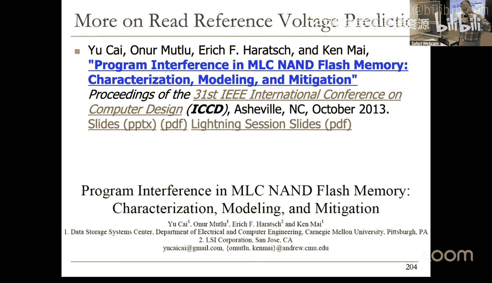

# 13：闪存与固态硬盘 🚀

在本节课中，我们将要学习闪存（Flash Memory）和固态硬盘（Solid-State Drives， SSD）的基本原理与现代架构。闪存作为一种非易失性存储技术，是当今智能手机、笔记本电脑和数据中心存储系统的核心。我们将从闪存单元的工作原理开始，逐步深入到复杂的SSD控制器架构、地址映射、垃圾回收等关键技术，并探讨如何通过先进的错误处理技术来提升闪存的可靠性与寿命。

---

## 闪存概述：从新兴技术到主流存储 💡

上一节我们介绍了计算机架构中存储系统的多样性。本节中，我们来看看一种成功从“新兴技术”转变为现代计算基石的存储介质——闪存。

闪存曾被认为是一种前景不明朗的电荷存储技术。经过数十年的研发与优化，它如今已无处不在。我们口袋里的智能手机就是闪存技术影响力的最佳例证。闪存属于电荷存储型内存，其核心是在浮栅（Floating Gate）中存储电荷。然而，随着存储单元尺寸的缩小，电荷的可靠感知变得困难。

为了解决电荷存储的局限性，业界探索了两种主要路径：
1.  **新型内存架构**：通过以内存为中心的系统设计、新颖的内存架构与接口，以及更好的损耗管理来克服内存短板。
2.  **新兴存储技术**：例如相变存储器（PCM），它通过改变材料相位来存储数据，并通过检测电阻来读取，被认为比DRAM更具可扩展性。

尽管新兴技术前景广阔，但它们也存在许多不足。相比之下，闪存通过持续的技术迭代和智能的控制器设计，成功解决了可靠性、性能和成本问题，成为了主流存储方案。

---

## 现代固态硬盘（SSD）架构 🏗️

上一节我们了解了闪存的技术背景。本节中，我们来看看如何将闪存颗粒组织成一个高性能、高可靠的存储设备，即固态硬盘。

现代SSD是一个复杂的系统，由多个核心硬件控制器、DRAM以及非易失性闪存封装组成。其核心是**SSD控制器**，它内部包含多个处理器核心、硬件闪存控制器以及用于缓存的DRAM。

以下是SSD处理写入请求时，数据流经的主要组件：

1.  **主机接口层（Host Interface Layer, HIL）**：负责与主机操作系统通信，接口可能是SATA或更高性能的NVMe。NVMe允许应用程序直接与SSD队列交互，无需操作系统深度介入，从而提升吞吐量。
2.  **闪存转换层（Flash Translation Layer, FTL）**：这是SSD固件的“大脑”，负责将主机看到的逻辑地址映射到闪存上的物理地址，并管理闪存的诸多特性。
    *   **写入缓冲区（Write Buffer）**：临时存放待写入数据，以便快速向主机返回确认，降低写入延迟。它还能实现灵活的I/O调度。缓冲区大小通常限制在几十MB，并依赖电容在突然断电时将脏数据写回闪存。
    *   **逻辑到物理地址映射（L2P Mapping）**：由于闪存采用“异地更新”（Out-of-Place Write）策略，更新数据时需写入新位置，并将旧位置标记为无效。因此，需要一个映射表来记录逻辑页地址（LPA）到物理页地址（PPA）的对应关系。此映射表通常占用SSD总容量的约0.1%。
    *   **元数据管理**：FTL还维护着用于垃圾回收、磨损均衡、数据刷新等功能的元数据。
3.  **闪存控制器（Flash Controller）**：负责与闪存颗粒进行物理通信。
    *   **随机化（Randomization）**：对数据进行加扰，避免特定数据模式加剧闪存错误。
    *   **纠错码（Error-Correcting Code, ECC）**：为数据添加冗余信息，以检测和纠正读取时产生的错误。例如，每1KB数据可能附加72位ECC。
    *   **发送闪存命令**：最终将数据和命令发送给具体的闪存封装。

当处理读取请求时，FTL会先检查写入缓冲区（可视为缓存）。若未命中，则查询L2P映射表找到数据物理位置，再通过闪存控制器读取。随着SSD老化，ECC解码可能失败，此时需要调整参考电压进行重读，这会导致读取性能下降。

---

## 闪存单元：工作原理与特性 ⚡

上一节我们介绍了SSD的整体架构。本节中，我们深入其核心存储单元——闪存细胞（Flash Cell），看看它是如何存储数据的。

闪存细胞本质上是一种特殊的晶体管。与普通MOSFET不同，它在控制栅（Control Gate）和沟道之间增加了一个**浮栅（Floating Gate）**，该浮栅被绝缘体包围，可以长期 trapped 电子。

其工作原理基于**阈值电压（Threshold Voltage, Vth）** 的改变：
*   **编程（Program）**：在控制栅施加高电压（如+20V），电子从衬底隧穿进入浮栅并被 trapped。浮栅带负电，使得细胞的阈值电压**升高**。
*   **擦除（Erase）**：在控制栅施加负高压（如-20V），将电子从浮栅推回衬底，阈值电压**降低**。
*   **读取（Read）**：在控制栅施加一个**参考电压（Vref）**。若Vref高于细胞当前Vth，晶体管导通，读为‘1’（对应擦除状态）；若Vref低于Vth，晶体管截止，读为‘0’（对应编程状态）。

**核心公式**：`数据状态 = (Vref > Vth) ? ‘1’ : ‘0’`

闪存的重要特性包括：
*   **多级单元（MLC/TLC/QLC）**：通过精确控制浮栅电荷量，使Vth落在多个不同区间，从而在一个细胞中存储多个比特（如2, 3, 4 bits）。这提升了密度，但牺牲了可靠性和性能。
*   **数据保持（Retention）**：浮栅中的电子会随时间缓慢泄漏，导致Vth漂移（通常左移），造成**保持错误**。即使不供电，数据也可能在数年后丢失。
*   **耐久性（Endurance）**：每次编程/擦除（P/E）循环都会对氧化层造成轻微损伤。经过一定次数的P/E循环后（如SLC 10万次，QLC仅1千次），细胞将无法可靠存储数据。

---

## NAND闪存阵列：组织与操作 🧱

上一节我们了解了单个闪存细胞。本节中，我们看看如何将海量细胞组织起来，并进行高效的读写操作。

多个闪存细胞以特定方式连接，形成可寻址的存储阵列：
*   **NAND串（NAND String）**：多个（如128个）细胞串联，类似一个NAND门。读取时，只有目标细胞施加参考电压，其他细胞施加更高的通过电压（Vpass）使其强制导通，这样整个串的电流仅由目标细胞的状态决定。
*   **页（Page）**：共享同一字线（Wordline）的所有细胞构成一个页，是**读写操作的基本单位**（通常为4KB-16KB）。对于MLC/TLC，一个字线对应多个逻辑页（如LSB页、MSB页）。
*   **块（Block）**：共享位线（Bitline）的一组NAND串构成一个块，是**擦除操作的基本单位**（通常包含数百个页）。擦除一个块会将其中所有细胞重置为‘1’状态。
*   **平面（Plane）**、**晶圆（Die）**、**封装（Package）**：多个块组成平面，多个平面组成晶圆，多个晶圆封装在一起形成闪存颗粒。不同平面可以并行操作以提升带宽。

**编程操作**采用**增量步进脉冲编程（ISPP）**：
1.  施加一个适中的编程电压脉冲。
2.  验证细胞的Vth是否达到目标。
3.  对已达到目标的细胞，通过拉高其位线电压来**抑制（Inhibit）** 进一步编程。
4.  略微提高编程电压，重复步骤1-3，直到所有待编程细胞达到目标Vth。
这种方法可以精确控制Vth分布，对于MLC/TLC至关重要。

**读取操作**对于SLC只需一次比较。对于MLC/TLC，则需要施加多个不同的参考电压进行多次感测，再通过解码逻辑确定存储的比特值。**比特编码方式会影响读取延迟**，例如，某种编码可能让MSB页的读取快于LSB页，这可以被FTL利用进行数据放置优化。

---

## 闪存转换层（FTL）：关键算法 🔄

上一节我们看到了闪存物理操作的限制。本节中，我们来看看SSD的“智能”核心——FTL，如何通过软件算法管理闪存，提供一个简单、高效的块设备接口。

FTL的核心任务之一是**地址映射**。由于闪存块必须在写入新数据前被擦除，且擦除粒度大、耗时长，“就地更新”效率极低。因此，SSD采用**异地更新**策略：将数据更新写入新的空闲位置，并将旧位置标记为**无效**。这就需要FTL维护一个动态的**逻辑到物理地址映射表**。

以下是一个简化的SSD初始状态与写入示例：
*   假设物理容量（5个块，每块4页）大于逻辑容量（16个逻辑页）。
*   收到对逻辑页`LPA 0`的写入，FTL将其写入`PPA (Block0, Page0)`，并更新映射表。
*   收到对`LPA 4-15`的连续写入，FTL会顺序填充当前打开的块（Block0），写满后再打开新块（Block1）继续写入。此时，`LPA 4`实际存储在`PPA 1`。
*   当对`LPA 4`进行更新时，FTL将其写入新的空闲位置（如`PPA 16`），并将原`PPA 1`标记为无效，同时更新映射表指向`PPA 16`。

持续的异地更新会产生大量无效页，耗尽空闲页。此时需要**垃圾回收（Garbage Collection, GC）**：
1.  **选择受害块（Victim Block）**：通常选择无效页比例最高的块，以最小化有效数据搬移开销。
2.  **搬移有效页**：读取受害块中所有仍有效的页，将其写入新的空闲位置，并更新映射表。
3.  **擦除受害块**：擦除整个块，使其变为空闲块可供后续写入。
GC会带来显著的性能开销（读、写、擦除）和写放大，因此FTL会在SSD空闲时在后台进行GC，或采用渐进式GC来降低尾延迟影响。**TRIM命令**允许操作系统通知SSD哪些数据已被删除，帮助FTL提前识别无效页，提升GC效率。

FTL的另一项重要任务是**磨损均衡（Wear Leveling）**，确保所有闪存块的P/E循环次数尽量平均，避免部分块过早报废。此外，还需定期进行**数据刷新（Refresh）**，在数据因电荷泄漏而出错前，读取、纠错并重写，以对抗保持错误。

---

## 闪存可靠性：错误表征与缓解 🛡️

上一节我们学习了FTL如何管理闪存。本节中，我们直面闪存的核心挑战——可靠性问题，并探讨如何通过表征错误和设计缓解技术来应对。

闪存本质上是一个**噪声信道**。其错误主要来源于：
1.  **操作错误**：编程干扰、读取干扰、擦除错误。
2.  **保持错误**：电荷随时间泄漏，是主导性错误源，占总错误99%以上。
随着P/E循环增加和工艺缩微，原始误码率（RBER）呈指数增长。

为了构建可靠的存储系统，需要结合多种技术：
*   **纠错码（ECC）**：必需，但能力有限且复杂度随纠错能力增强而提高。
*   **数据刷新**：周期性读取数据，利用ECC纠正已积累的保持错误，然后重写（异地或原位）。刷新频率可根据块已经历的P/E周期数自适应调整。
*   **读取参考电压优化**：闪存阈值电压分布会随P/E循环和干扰发生变化。通过建模预测分布漂移，并动态调整读取时使用的参考电压，可以显著降低读取错误率。

**研究成果示例**：通过实验表征，建立了闪存阈值电压分布的数学模型（如高斯模型、学生t分布模型）。基于此模型，可以预测编程干扰导致的电压漂移。通过每1K次P/E循环采样学习一次，并据此优化读取参考电压，能够在相同ECC强度下将闪存寿命延长**30%**，或者说在相同寿命要求下降低对ECC能力的要求。

---

## 总结 📚

本节课中，我们一起深入探讨了闪存与固态硬盘的技术全景。我们从闪存细胞的基本物理原理出发，了解了其编程、擦除、读取机制以及多级单元、数据保持、耐久性等关键特性。接着，我们剖析了现代SSD的复杂架构，包括主机接口、闪存转换层（FTL）和闪存控制器，并深入讲解了FTL的核心算法：异地更新、地址映射、垃圾回收、磨损均衡和数据刷新。最后，我们探讨了闪存面临的可靠性挑战，以及如何通过错误表征、数据刷新和动态电压优化等技术来有效缓解这些挑战，从而构建出高性能、高可靠、大容量的现代存储系统。闪存技术的发展是硬件架构与智能控制软件紧密结合、共同解决物理限制的典范。