# 15：并行性、异构性与瓶颈加速 (Spr 2025)

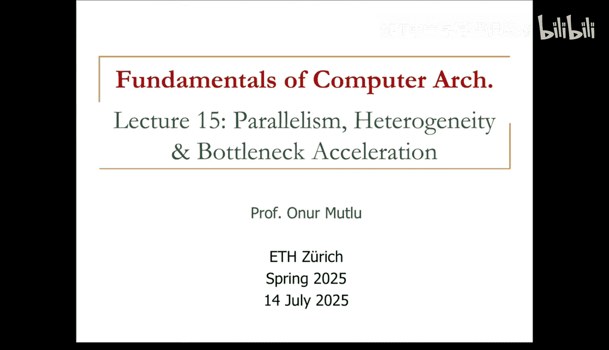

## 概述
在本节课中，我们将学习指令预取、异构计算系统设计以及如何通过识别和加速并行程序中的瓶颈来提升性能和可扩展性。我们将从指令预取的基本概念开始，然后深入探讨异构多核架构的原理、优势与挑战，最后介绍一系列通过软硬件协同来加速关键路径（如临界区、屏障等）的技术。

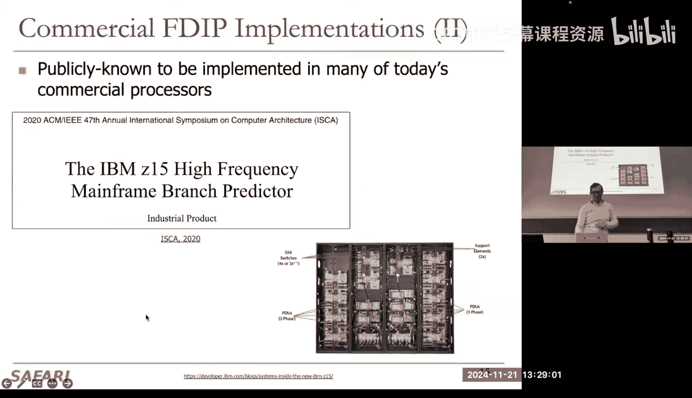

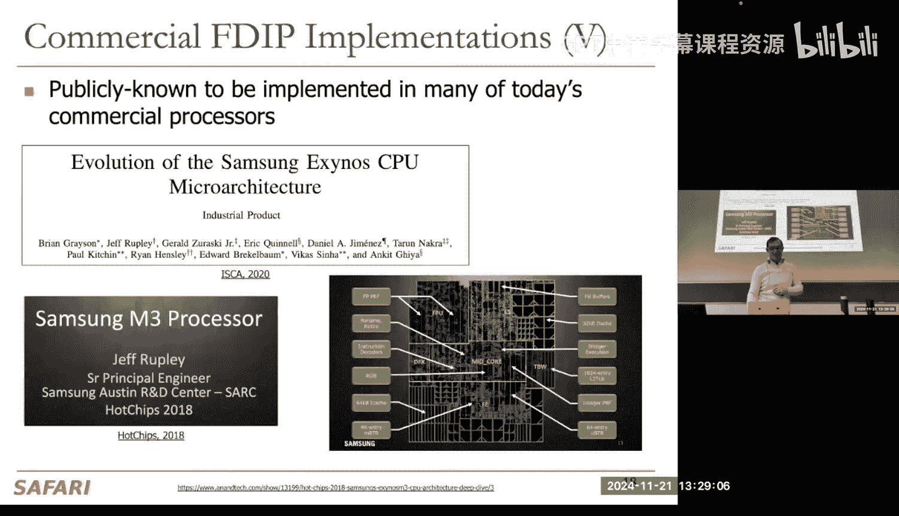

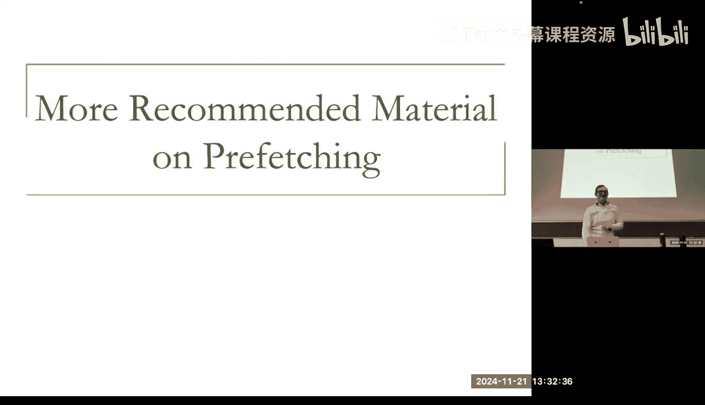

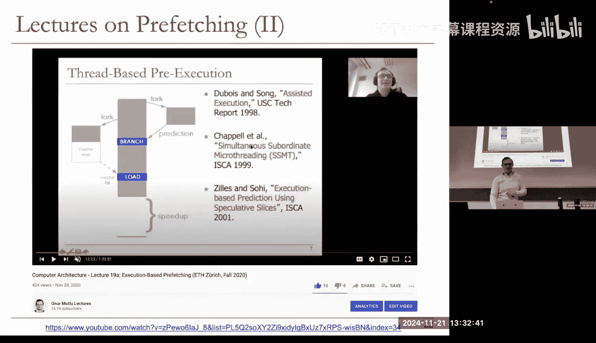

## 指令预取

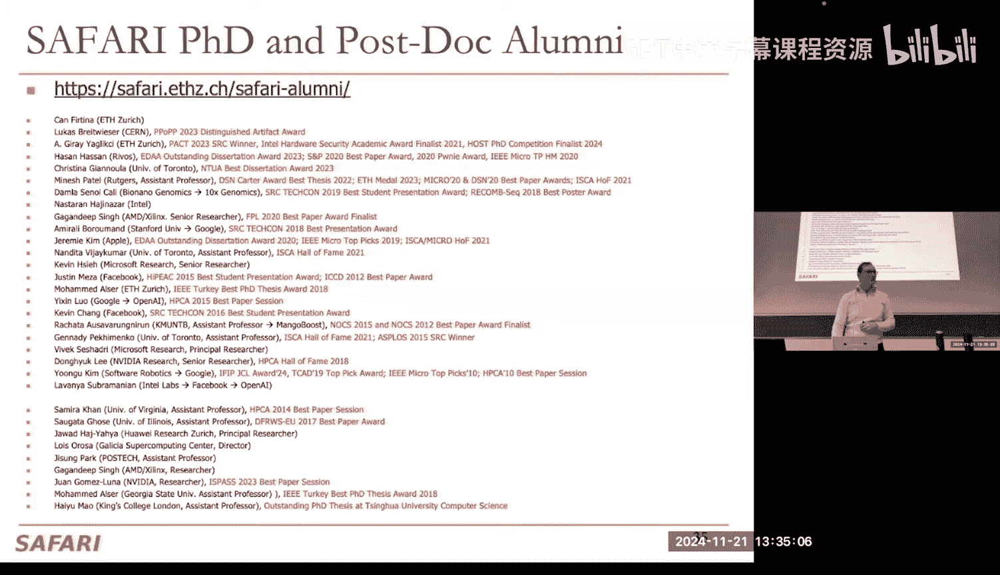

上一节我们详细讨论了数据预取。本节中，我们来看看指令预取。指令预取的核心思想与数据预取类似：预测程序即将需要的指令，并主动将它们取入缓存。两者的主要区别在于，指令访问通常是顺序的（遵循冯·诺依曼模型的顺序执行原则），而数据访问则不一定。

### 顺序指令预取
由于指令执行的顺序性，简单的顺序流预取通常非常有效。其基本方法是：在取出一条指令后，总是预取其后的 N 条指令。这种方法在程序顺序执行且没有分支时效果很好。

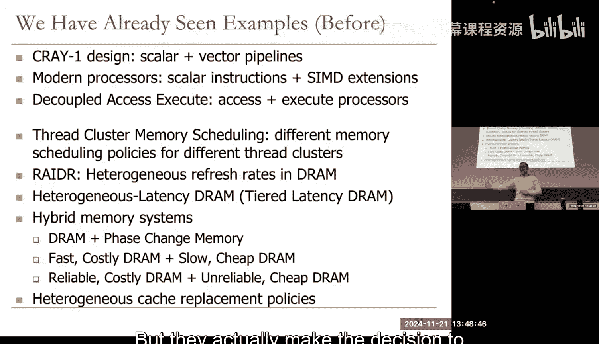

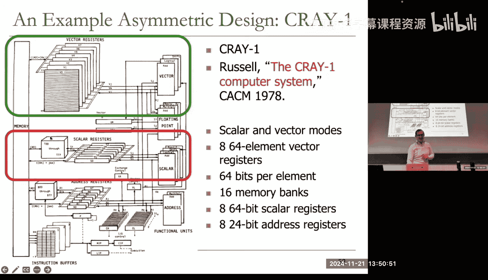

一个早期的例子是 IBM 360/91 处理器，它使用了指令取指缓冲区来实现预取。虽然现代处理器更为复杂，但这种顺序预取的思想至今仍然适用。

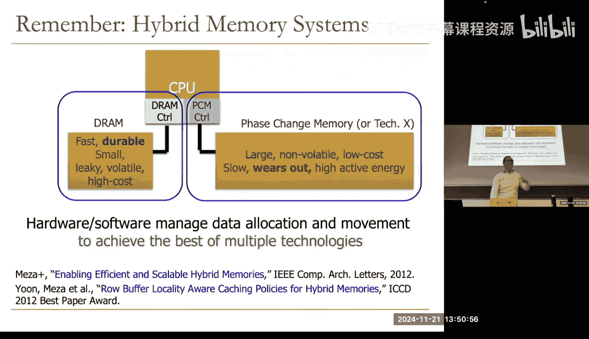

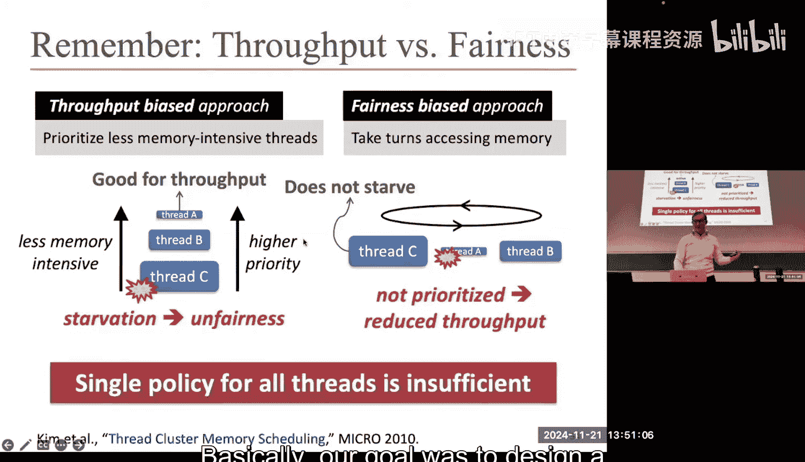

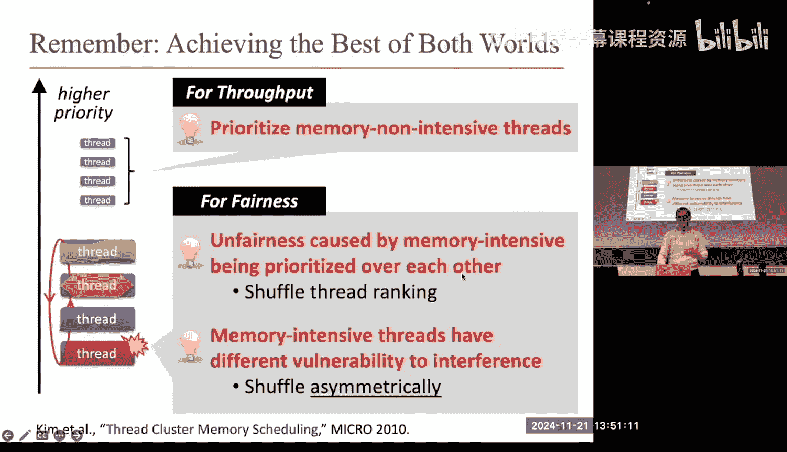

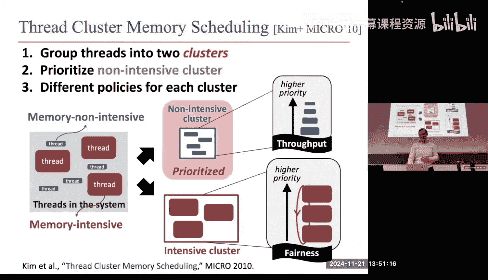

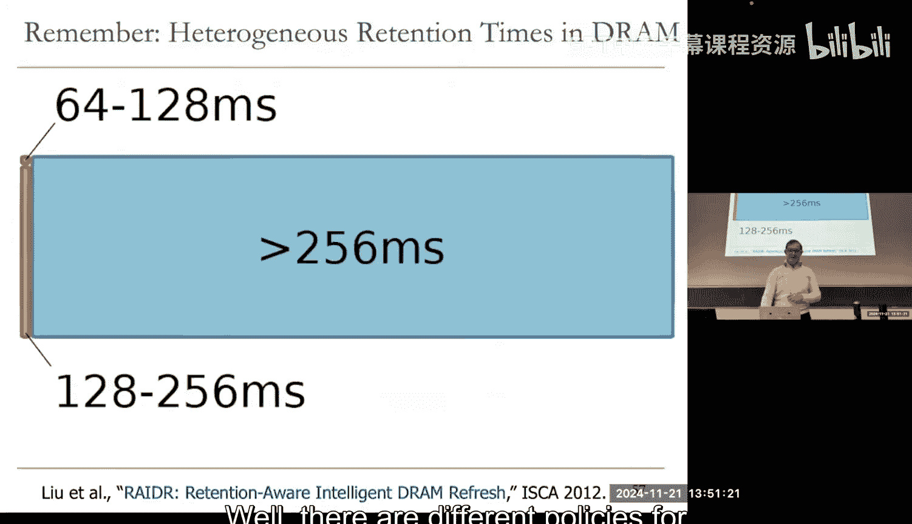

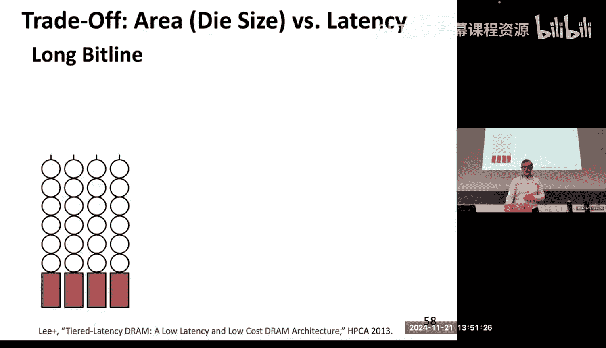

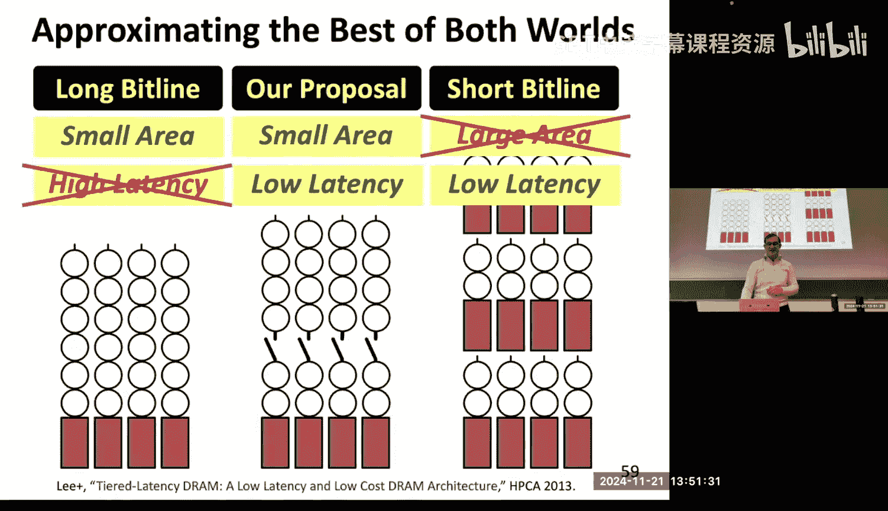

### 更高级的指令预取技术
以下是几种更高级的指令预取技术：

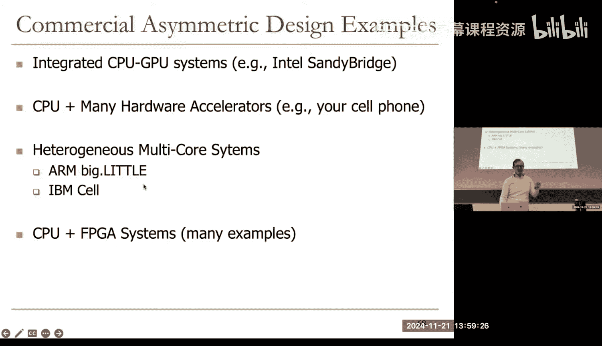

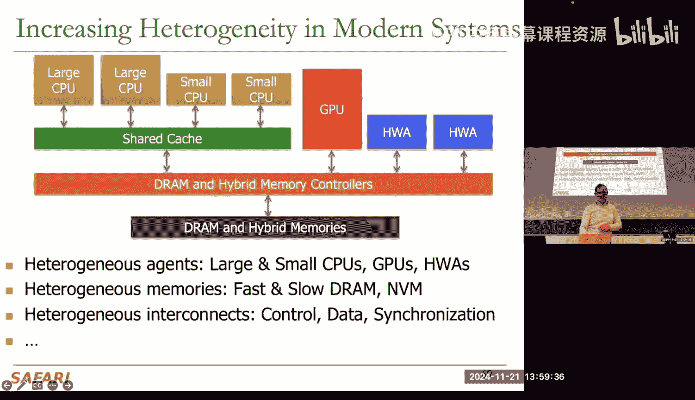

*   **基于使用历史的预取**：为缓存行添加一个“预取位”元数据，记录之前预取的指令块是否被实际使用过。根据历史信息，决定是否预取后续指令块，以提高预取准确性。
*   **关联预取**：识别指令缓存缺失地址，并将其与更早的、足够提前的指令访问相关联。当下次看到这个早期访问时，就提前启动对缺失地址的预取，以覆盖预取延迟。
*   **取指导向的指令预取**：利用处理器前端（取指/译码阶段）的信息，在处理器后端（执行阶段）因内存访问等原因停顿（stall）时，前端可以继续预测分支并预取指令，填充到一个指令缓冲区（如取指目标队列）中。这实际上将前端与后端解耦，允许前端“超前运行”，从而重叠后端停顿的延迟和指令缓存缺失的延迟。

研究表明，如果取指导向的预取与一个足够大的取指目标队列以及高精度的分支预测相结合，可能就不再需要其他复杂的指令预取器。

### 指令预取与数据预取的对比
指令缓存缺失的发生频率通常低于数据缓存缺失，因为代码的工作集通常更小、局部性更高。然而，在某些工作负载（如大型商业数据库）中，指令工作集可能很大，导致严重的指令缓存缺失。此外，指令缺失的后果可能更严重，因为它会直接导致流水线“断流”。

## 异构性与并行性瓶颈

现在，让我们转向一个更核心的话题：并行性、异构性和瓶颈加速。异构性（或称非对称性）是实现专业化的关键途径。

### 为什么需要异构性？
对称（同构）设计试图用单一类型的核心满足所有工作负载和设计指标，这非常困难。异构设计则通过提供多种不同类型的核心或硬件单元，使系统能够：

1.  **适应不同的工作负载行为**：不同应用，甚至同一应用的不同执行阶段，其行为（如局部性、分支可预测性、指令级并行度）可能差异巨大。
2.  **同时优化多个设计指标**：系统设计通常需要权衡性能、能效、公平性、复杂度等多个目标。单一设计难以在所有目标上都达到最优。

异构性的本质是在通用性和专用性之间架起桥梁：它不像通用设计那样“一刀切”，也不像专用设计那样为每个任务定制硬件，而是提供一组优化的子设计，并将它们组合在一起。

### 并行性的挑战：阿姆达尔定律
理想情况下，我们希望并行程序的加速比能随着核心数量线性增长。然而，阿姆达尔定律指出，程序的加速比受限于其**串行部分的比例**。

**公式**：`Speedup = 1 / (F + (1 - F) / N)`
其中，`F` 是串行部分的比例，`N` 是处理器数量。

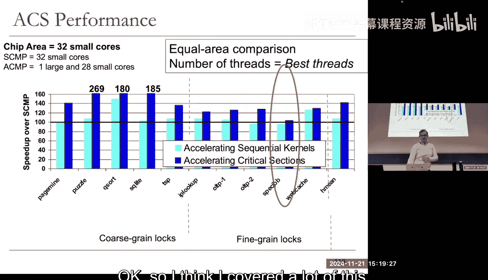

即使串行部分很小，它也会成为性能扩展的根本瓶颈。此外，并行部分本身也并非完美并行，会受限于：
*   **同步开销**：如锁、屏障。
*   **负载不均衡**：工作未能在各核心间均匀分配。
*   **资源争用**：核心在共享资源（如缓存、内存控制器）上的竞争。

### 异构多核：结合大核与小核
基于以上分析，我们可以得出一个直观的解决方案：
*   **串行代码段**：需要一个强大的**大核**来快速执行。
*   **可并行代码段**：可以使用多个能效高的**小核**来执行。

异构多核架构（Asymmetric Chip Multi-Processor, ACMP）正是结合了这两种核心。例如，在一个芯片上放置一个高性能大核和多个高能效小核。
*   串行部分和关键瓶颈（如高争用的临界区）被调度到大核上执行，以获得高性能。
*   可并行部分被调度到多个小核上执行，以获得高吞吐量。

这样，我们就能在串行性能上媲美“全大核”设计，在并行吞吐量上接近“全小核”设计，从而接近“两者兼得”的理想状态。

## 瓶颈加速技术

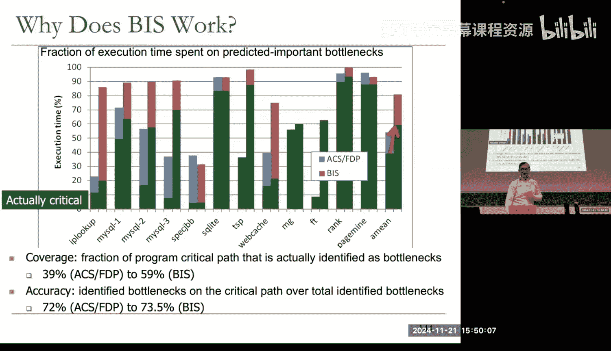

接下来，我们探讨几种具体的软硬件协同技术，用于动态识别和加速并行程序中的瓶颈。

### 1. 加速临界区
**核心思想**：将争用严重的临界区代码迁移到异构多核系统中的大核上执行。

**工作原理**：
1.  **ISA 扩展**：添加 `CRITICAL_SECTION_CALL` 和 `CRITICAL_SECTION_DONE` 指令。
2.  **执行流程**：
    *   当小核上的线程进入一个临界区时，它不直接执行，而是通过 `CRITICAL_SECTION_CALL` 指令，将临界区ID、入口程序计数器、栈指针等信息发送到**临界区请求缓冲区**。
    *   大核从缓冲区中取出请求，开始执行临界区代码。执行完毕后，通过 `CRITICAL_SECTION_DONE` 指令通知发起请求的小核。
    *   小核接收到完成信号后继续执行。
3.  **优势**：
    *   **更快执行**：大核更快地执行临界区。
    *   **更好的共享数据局部性**：锁和共享数据驻留在大核缓存中，避免了在多小核间“乒乓”移动，减少了缓存一致性开销。
4.  **挑战**：
    *   **虚假串行化**：独立的临界区可能被发送到同一个大核而被迫串行。可通过多线程或基于历史计数器进行限流来缓解。
    *   **私有数据通信开销**：临界区所需的输入数据（线程私有）需要从小核传输到大核。

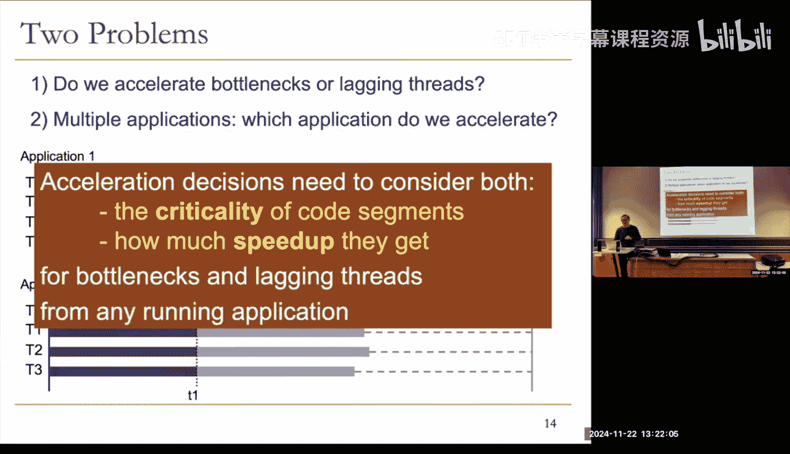

### 2. 瓶颈识别与调度
**核心思想**：将加速对象从“临界区”泛化到任何导致线程等待的“瓶颈”，包括临界区、屏障、流水线阶段等。

**工作原理**：
1.  **软件注解**：编译器或库在潜在的瓶颈代码段（如锁获取、屏障点）插入 `BNECK_CALL` 和 `BNECK_RETURN` 指令。在等待点插入 `BNECK_WEIGHT` 指令。
2.  **硬件监控**：硬件维护一个**瓶颈表**。当线程执行 `BNECK_WEIGHT` 时，硬件会计数该瓶颈导致的**线程等待周期数**。
3.  **动态决策**：小核在执行 `BNECK_CALL` 前，会查询瓶颈表。如果该瓶颈历史等待周期数高（表明是关键瓶颈），则将其迁移到大核执行；否则，就在本地小核执行。
4.  **优势**：更通用，能识别和加速多种类型的同步瓶颈，并根据其实际关键性动态决策。

### 3. 基于效用的瓶颈加速
**核心思想**：在瓶颈识别的基础上，引入更精细的“效用”模型来决定加速优先级，而不仅仅是等待周期数。

**效用公式**（概念性）：
`Utility(加速代码段C) ≈ LocalSpeedup(C) × Importance(C) × Criticality(C)`
其中：
*   `LocalSpeedup(C)`：该代码段在大核上相对于小核的本地加速比。
*   `Importance(C)`：该代码段在执行时间中所占的比例。
*   `Criticality(C)`：该代码段在全局范围内的关键程度。

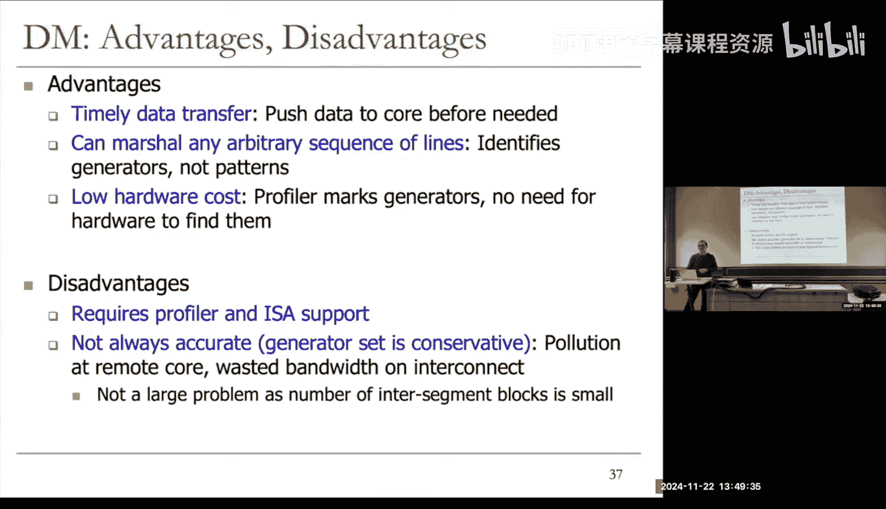

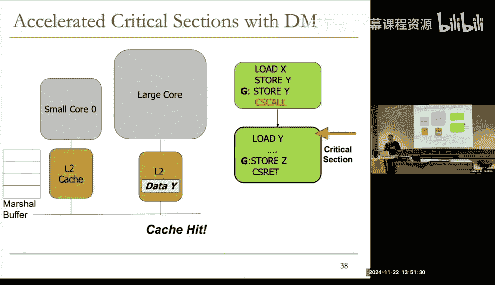

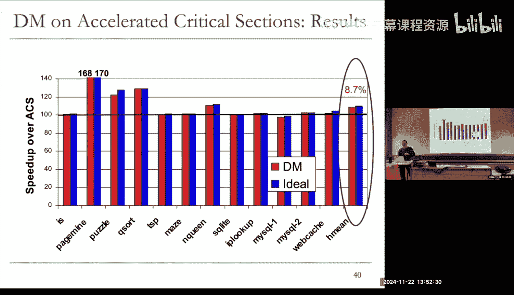

通过估计每个瓶颈的效用值，系统可以优先加速那些能带来最大整体性能提升的瓶颈，决策更加精准。

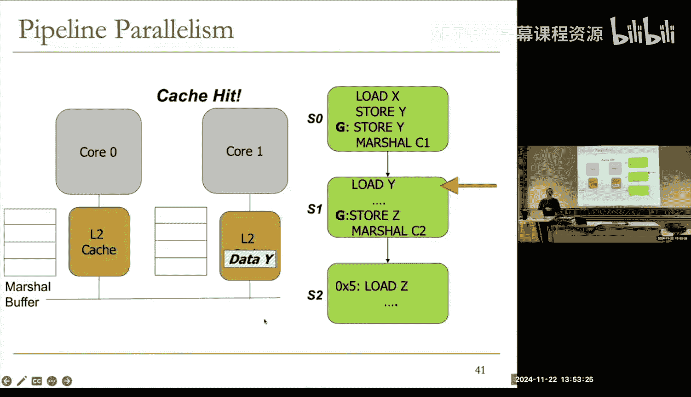

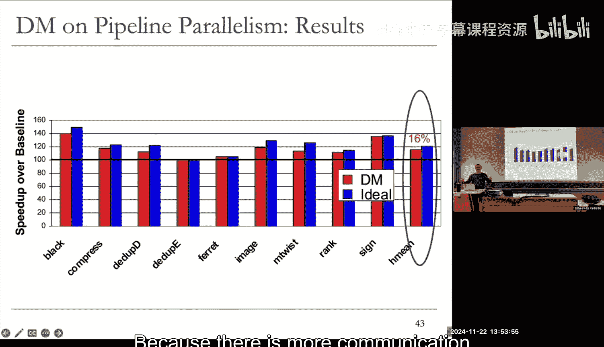

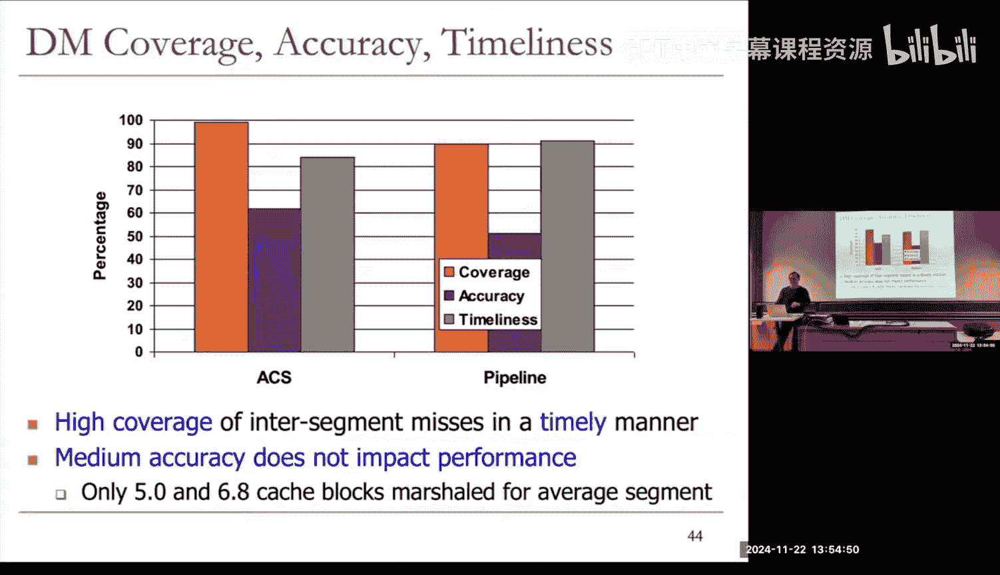

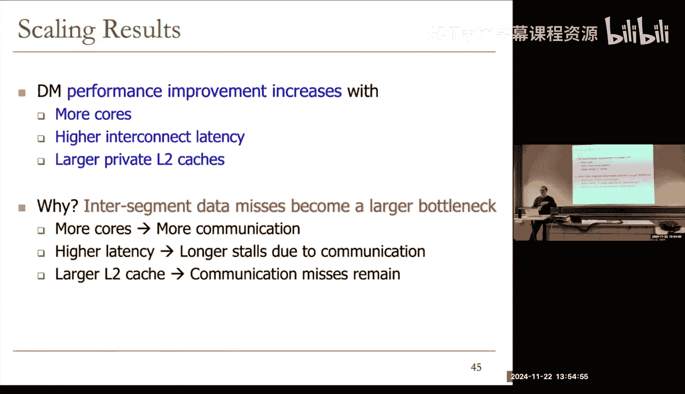

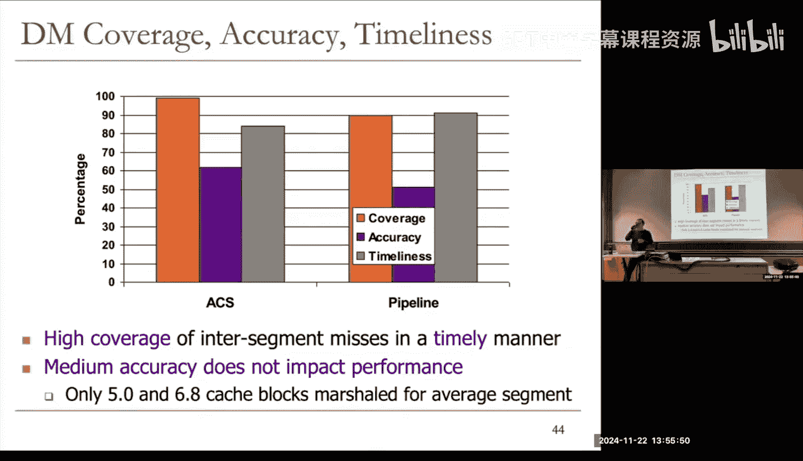

### 4. 数据编组：缓解通信开销
**核心思想**：在将代码段（如临界区）迁移到大核执行时，主动将其所需的“生产者”数据（由之前代码段生成）从源小核“推送”到大核的缓存，以避免迁移后的缓存缺失。

**工作原理**：
1.  **识别生成者指令**：通过离线剖析，编译器识别出在代码段中最后写入特定缓存块（这些块会被后续代码段读取）的指令，称为“生成者”指令。
2.  **插入编组指令**：在生成者指令后插入特殊的**编组指令**。
3.  **硬件支持**：小核配备**编组缓冲区**。当执行到生成者指令时，记录产生的地址。当执行到编组指令时，硬件主动从本地缓存读取这些地址的数据，并通过互连网络发送到大核的缓存中。
4.  **优势**：当大核开始执行迁移来的代码段并访问这些数据时，它们很可能已经在大核的缓存中，从而将“缓存缺失”转化为“缓存命中”，显著降低了代码迁移带来的通信延迟。

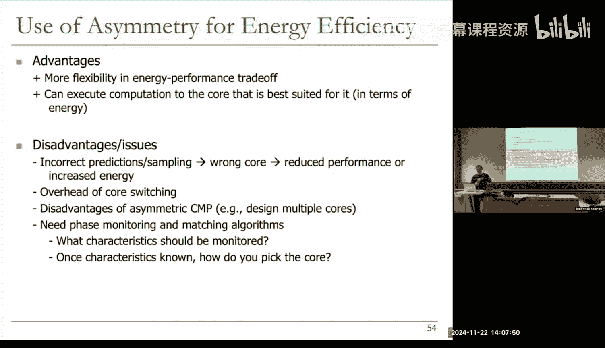

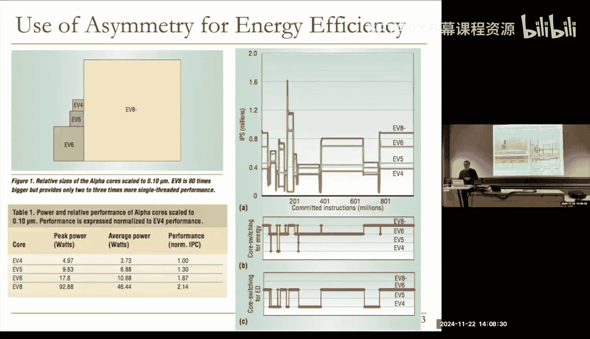

## 异构性的其他实现方式与总结

除了设计不同微架构的核心，还有其他方式实现异构性：
*   **动态电压频率缩放**：根据线程并行度，动态调整部分核心的电压和频率。在高单线程性能需求时，提升单个核心的频率；在高吞吐需求时，让多个核心以较低频率运行。
*   **核心融合/形态核心**：探索将多个小核动态组合成一个更强大核心的研究思路。

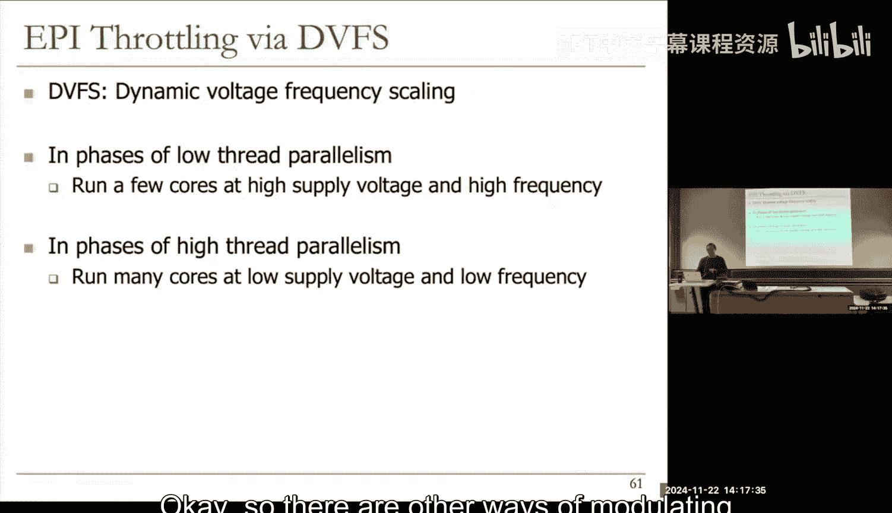

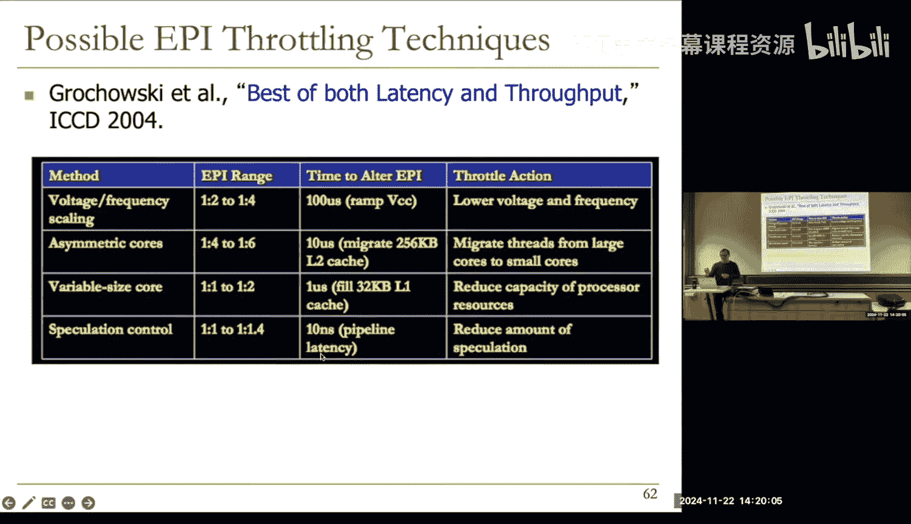

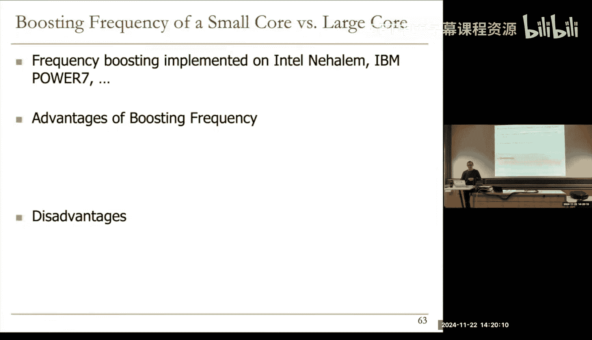

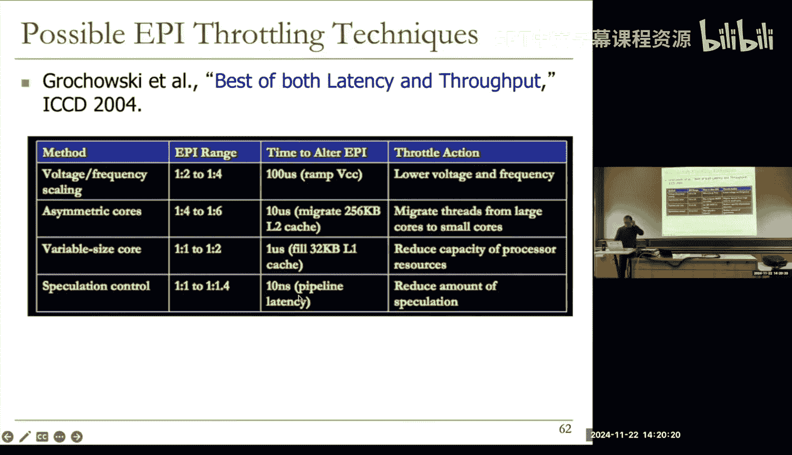

### 总结
本节课我们一起学习了：
1.  **指令预取**：利用指令的顺序性，通过顺序预取、关联预取、取指导向预取等技术来隐藏取指延迟。
2.  **异构计算**：通过结合高性能大核和高能效小核，异构多核架构旨在同时优化串行性能和并行吞吐量，应对阿姆达尔定律和并行开销的挑战。
3.  **瓶颈加速**：一系列软硬件协同技术（加速临界区、瓶颈识别与调度、基于效用的加速、数据编组）被用于动态识别并行程序中的关键路径（瓶颈），并将它们调度到更强大的硬件资源上执行，从而提升整体性能和可扩展性。这些技术的关键在于权衡**加速收益**与**迁移开销**、**共享数据局部性**与**私有数据通信成本**。

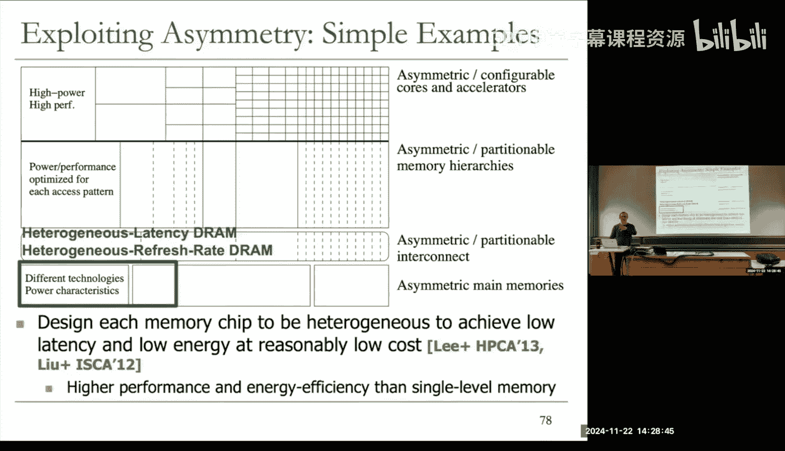

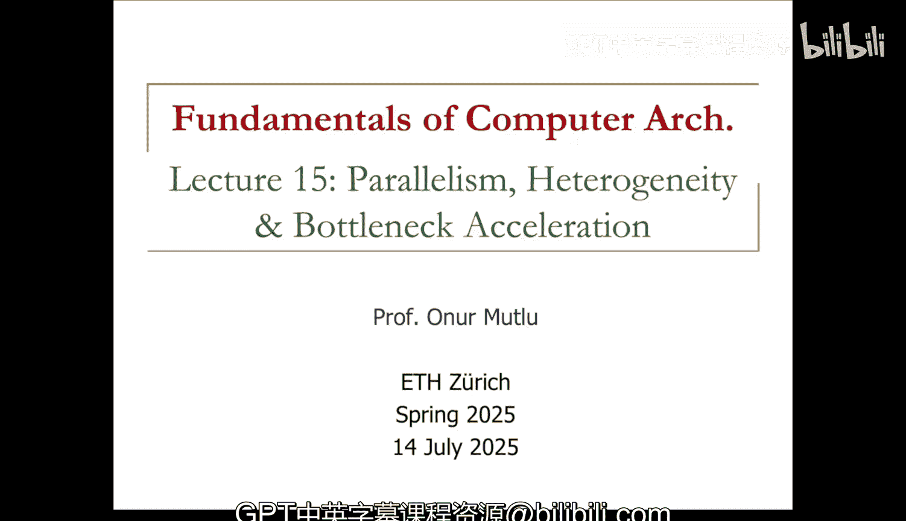

异构性和智能的瓶颈管理是应对现代及未来计算挑战，尤其是在“后摩尔定律”时代提升系统效率和性能的关键方向。