# 22：前沿内存鲁棒性研究 (Spring 2025) 🧠

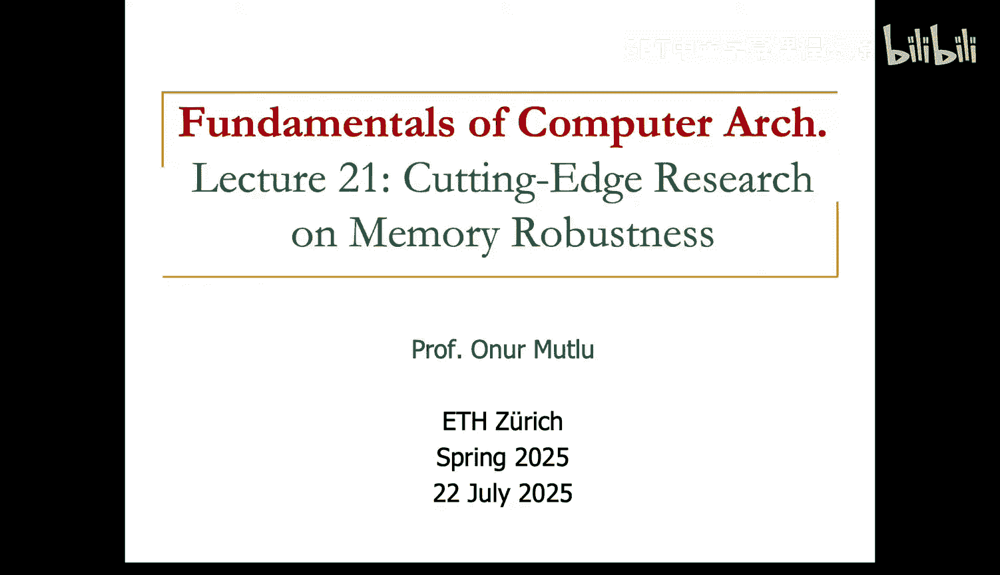

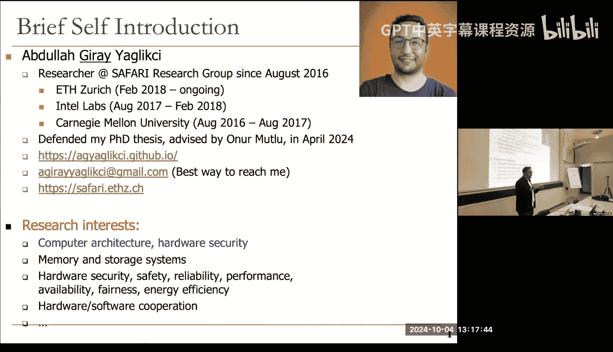

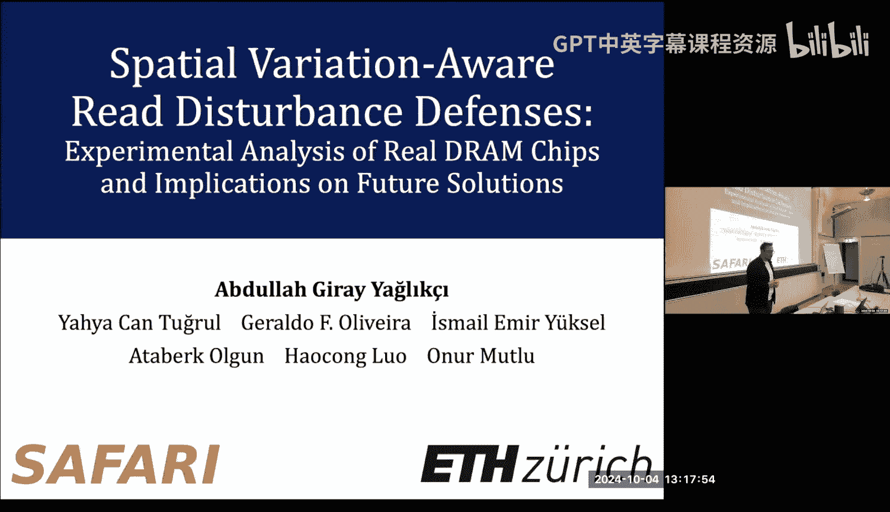

## 概述
在本节课中，我们将学习关于内存鲁棒性的前沿研究，特别是针对DRAM（动态随机存取存储器）中“行锤击”和“行压迫”等干扰现象的防御机制。我们将探讨几篇关键论文，它们从不同角度提出了高效、低开销的解决方案，以应对随着技术缩放而日益严重的内存干扰问题。

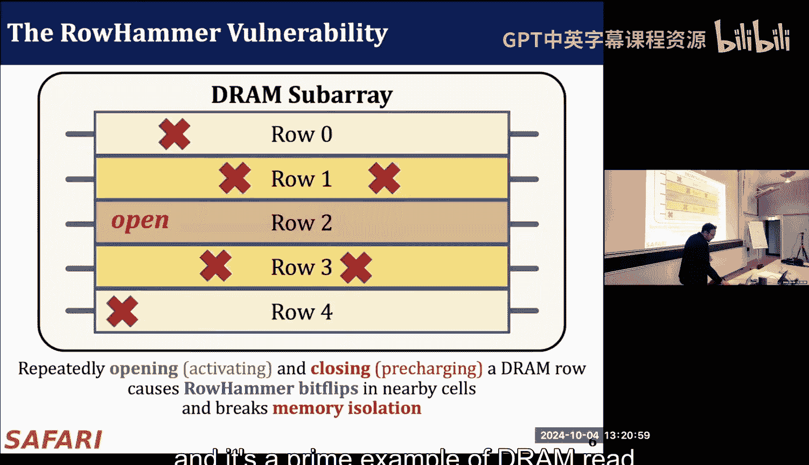

---

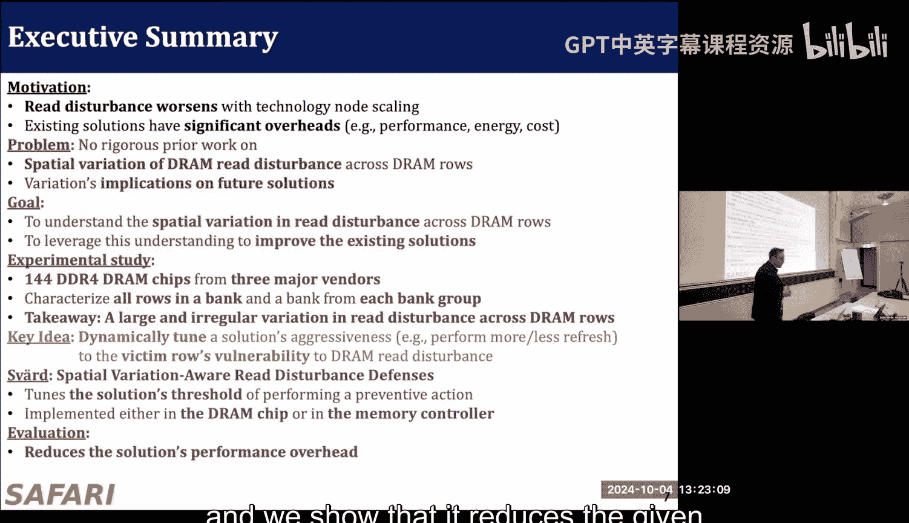

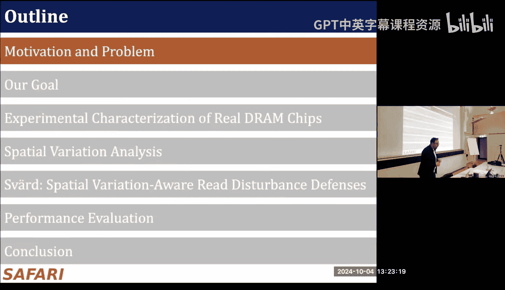

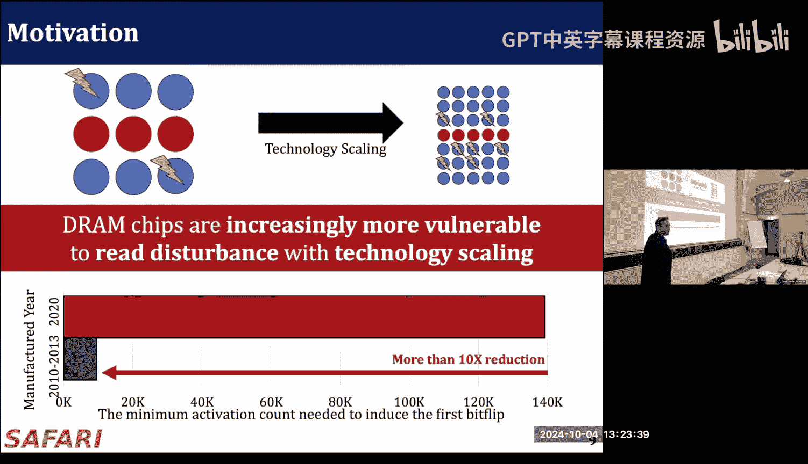

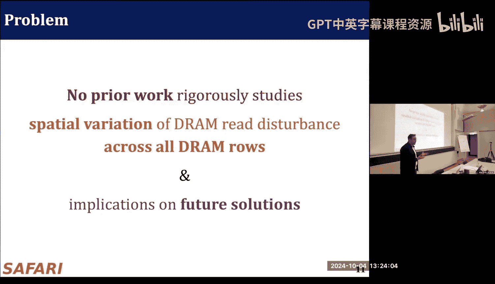

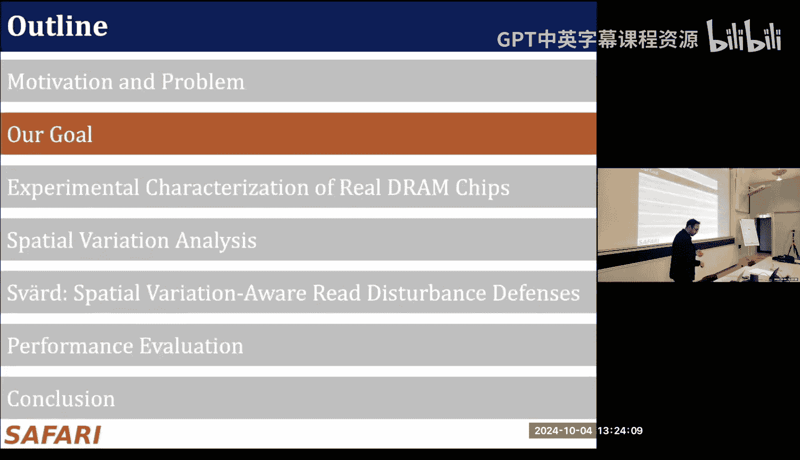

## 1. 空间变异感知的鲁棒性防御 🛡️

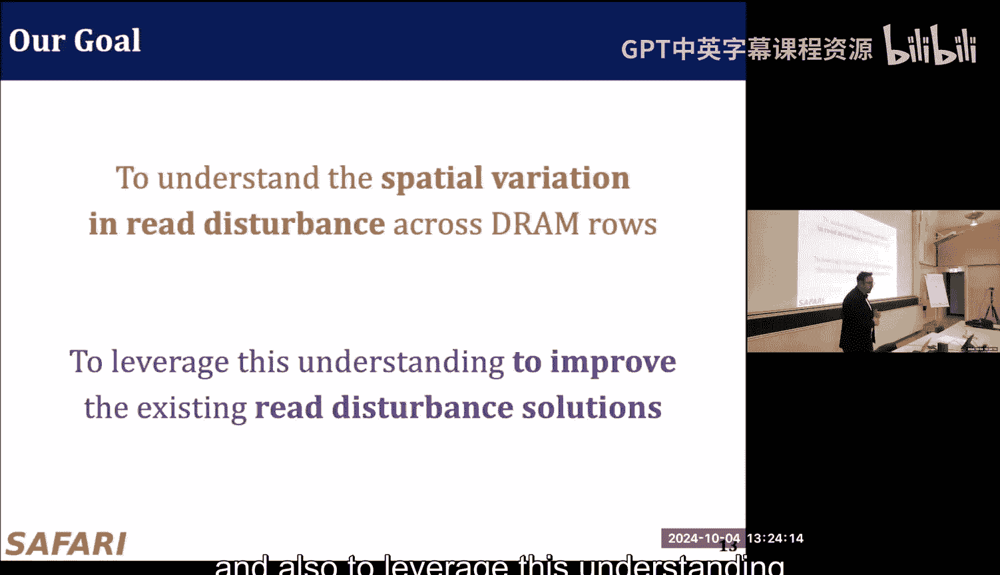

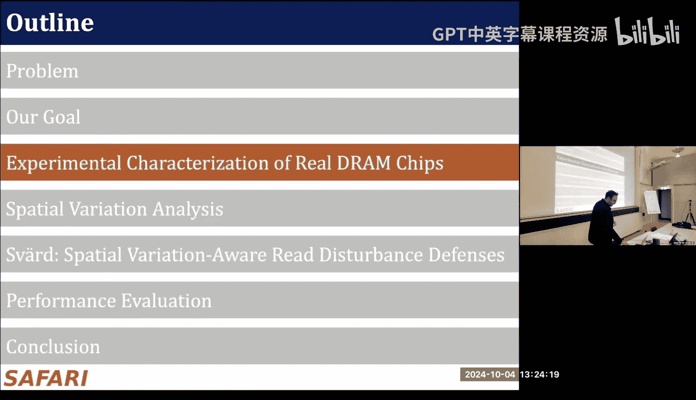

上一节我们介绍了内存干扰的基本问题。本节中，我们来看看如何利用DRAM行之间鲁棒性的空间变异来改进现有防御方案。

### 1.1 背景与动机
内存隔离是计算机系统中确保安全、隐私和可靠性的基本原则。它要求对一个内存地址的访问不应在其他地址上产生意外的副作用。然而，在现代DRAM芯片中，由于高密度和访问延迟等权衡，实现严格的内存隔离变得困难。

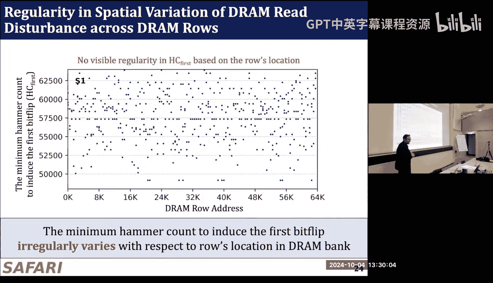

DRAM芯片的基本组织包括多个存储体（Bank），每个存储体内有多个子阵列（Sub-array），子阵列中的存储单元（Cell）以二维行列形式组织。访问数据需要先激活（Activate）一行，将其内容读取到行缓冲器（Row Buffer），然后进行列访问，最后预充电（Precharge）关闭该行。

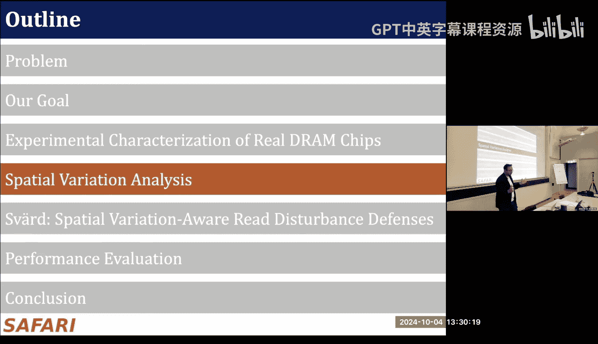

反复快速打开和关闭相邻的DRAM行会导致邻近存储单元发生比特翻转，这种现象被称为“行锤击”（Row Hammer）。它是DRAM干扰问题的一个典型例子。

随着技术缩放，新芯片的干扰脆弱性加剧，现有解决方案已带来显著的性能、能耗和成本开销。遗憾的是，此前没有严谨的工作研究不同DRAM行之间干扰鲁棒性的空间变异，以及这种变异对未来解决方案的影响。

### 1.2 研究目标与方法
本工作的目标是理解不同DRAM行之间干扰鲁棒性的空间变异，并利用这种理解来改进现有的防御方案。

我们测试了来自三大制造商的144个DDR4 DRAM芯片，表征了单个存储体内所有行以及芯片内多个存储体的特性。我们发现，不同DRAM行之间的行锤击阈值（即诱发首次比特翻转所需的最小激活次数）存在巨大且不规则的变异。

以下是关键发现：
*   **变异显著**：在同一存储体内，最脆弱的行和最坚固的行所需的锤击阈值可能相差数个数量级。
*   **缺乏规律**：行的脆弱性与其物理地址（如存储体地址、行地址、行间距等）之间没有明显的、可预测的规律性模式。

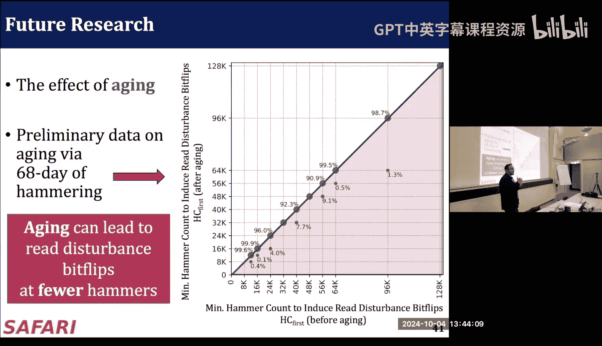

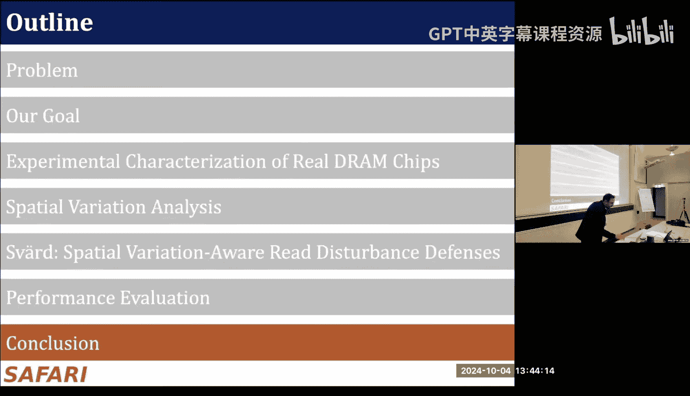

### 1.3 核心机制：Sword
基于上述观察，我们提出了一个关键思想：**根据受害者行的干扰脆弱性水平，动态调整现有防御方案的激进程度**。

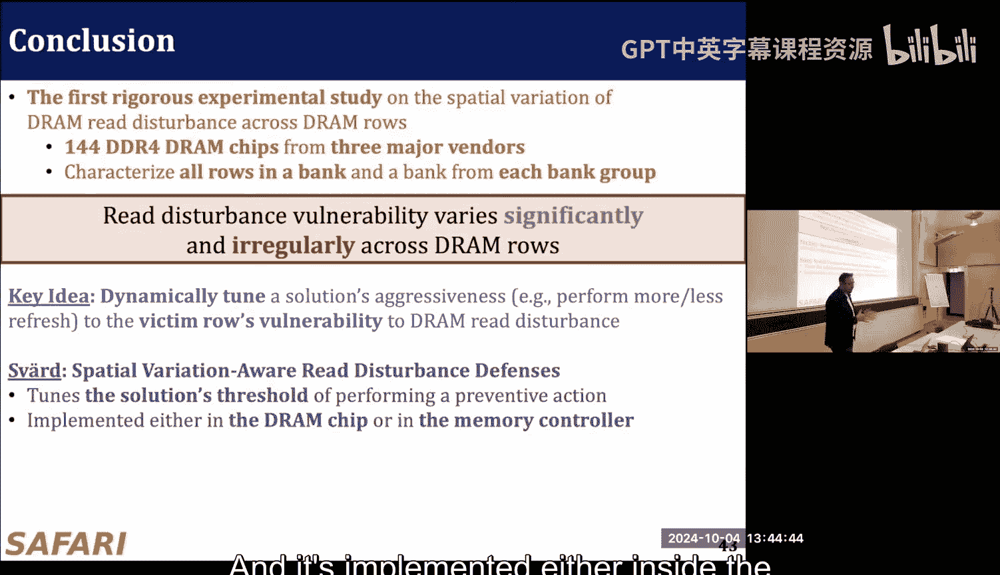

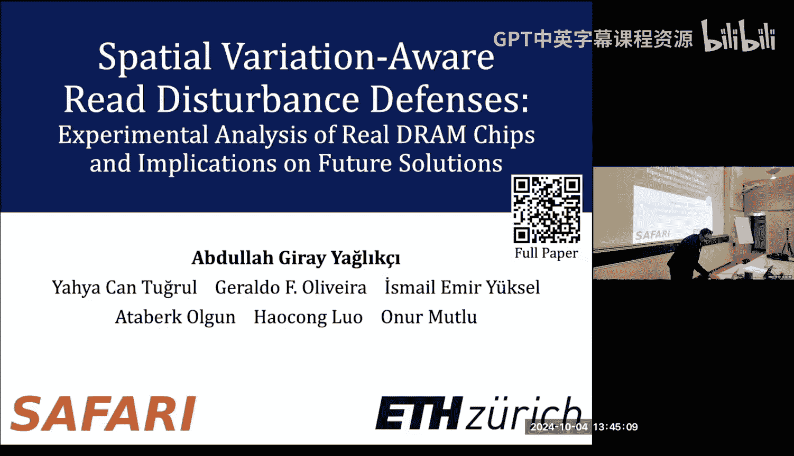

为此，我们提出了一种名为 **Sword**（Spatial-Variation-Aware Robustness Defenses）的新机制。Sword动态调整解决方案的阈值或参数，从而调整其预防性操作的频率。

**核心操作**：
1.  **行分类**：Sword将DRAM行按照其脆弱性划分为若干等级（例如16个等级），每个等级对应一个不同的防御阈值。
2.  **元数据存储**：每个DRAM行仅需存储少量比特（例如4比特）来标识其所属的脆弱性等级。这些元数据可以存储在内存控制器中（使用SRAM结构），也可以存储在DRAM芯片内部（利用ECC或空闲引脚）。
3.  **动态决策**：当内存访问发生时，防御机制（如Para、BlockHammer、Hydra）根据目标行对应的脆弱性等级，使用调整后的阈值来决定是否执行预防性刷新。对于更坚固的行，减少不必要的刷新操作。

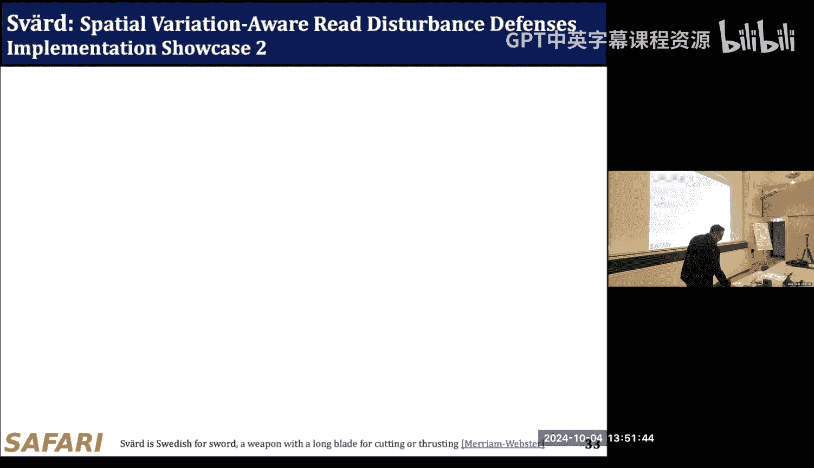

**公式描述**：
设原有防御机制的刷新阈值为 `T`，行为 `i` 的脆弱性等级为 `L_i`（`L_i` 值越高代表越脆弱）。Sword调整后的阈值 `T_i'` 可以表示为：
`T_i' = f(T, L_i)`
其中函数 `f` 根据具体防御机制和分级策略定义，通常使脆弱行的 `T_i'` 小于或等于 `T`，而坚固行的 `T_i'` 大于 `T`。

### 1.4 评估与总结
我们将Sword与五种先进的防御机制（Para, BlockHammer, Hydra等）集成，并使用Ramulator 2.0仿真框架在120个八核工作负载下进行评估。

**结果**：
*   **降低开销**：Sword显著降低了现有解决方案的性能开销。在极低的锤击阈值下，系统吞吐量下降幅度大幅减少。
*   **提升性能**：通过减少不必要的预防性刷新，系统整体性能得到提升。

**总结**：我们首次对DRAM芯片内部干扰鲁棒性的空间变异进行了严谨实验，揭示了其显著且不规则的特性。基于此，我们提出了Sword机制，它能动态调优现有方案的激进程度，显著降低其性能开销，为未来高脆弱性DRAM系统提供了高效的增强方案。

**遗留问题**：行的脆弱性特征可能随时间（老化效应）或数据模式变化，因此需要周期性地重新分析或设计在线分析机制来更新元数据，这是一个开放的研究方向。

---

## 2. 低成本、可扩展的行锤击缓解方案 ⚙️

上一节我们介绍了利用空间变异优化防御的思路。本节中，我们来看看两种旨在以低面积、低性能开销解决行锤击问题的新型机制。

### 2.1 问题与现有方案分类
随着DRAM芯片变得更脆弱，缓解行锤击的防御技术需要同时具备高效性和低开销。现有的行激活次数跟踪方案可分为三类：

1.  **每行计数器**：为每个DRAM行分配一个专用计数器。精度高、性能开销低，但面积成本极高。
2.  **每攻击行计数器**：利用“攻击者只能锤击少量行”的观察，减少计数器数量，但需使用标签（Tag）进行映射。在低锤击阈值下，所需计数器数量增加，面积成本依然较高。
3.  **少于每行计数器**：通过共享计数器或引入概率性刷新来进一步减少计数器数量。面积成本低，但在低锤击阈值下，由于预防性刷新频繁，性能和能耗开销很大。

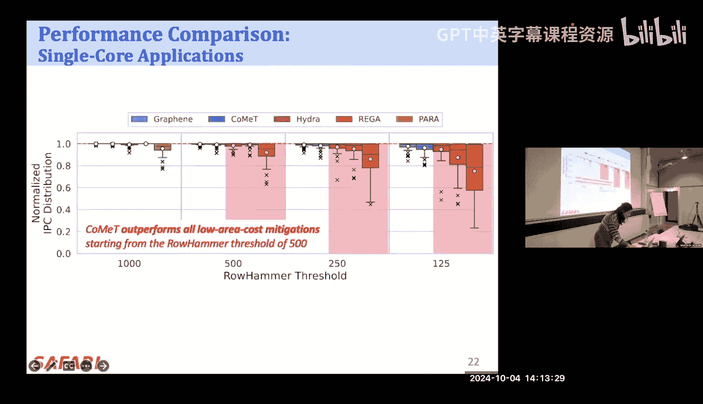

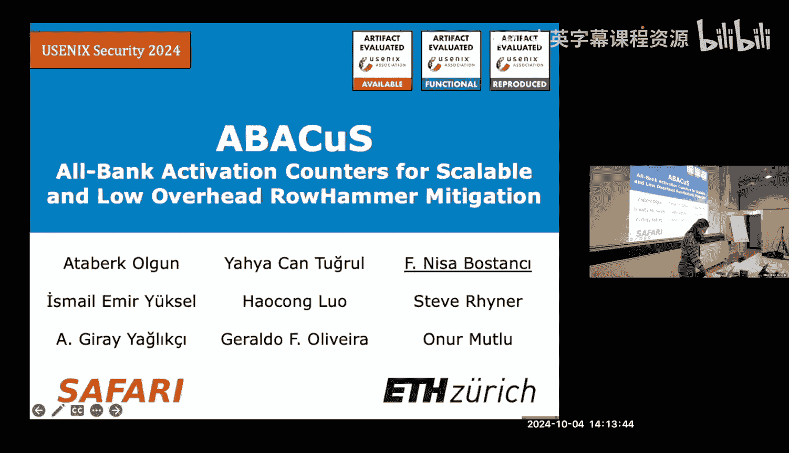

理想方案需要在面积、性能和能耗之间取得良好平衡，但现有方案难以同时满足。

### 2.2 机制一：Camel 🐫
Camel（Count-Min Sketch Based Row Hammer Mitigation）的目标是在高脆弱性DRAM系统中，以低面积、性能和能耗开销防止行锤击比特翻转。

**关键思想**：结合低成本的**基于哈希的计数器**和高精度的**基于标签的计数器**，取二者之长。

*   **计数器表（Counter Table）**：使用一种称为Count-Min Sketch的流式算法，将DRAM行映射到一组低成本的哈希计数器上。它尽可能唯一地映射各行，并在计数器组达到阈值时触发对受害者行的预防性刷新。这以低成本实现了大范围的激活跟踪。
*   **近期标签表（Recent-Tagger Table）**：为近期被频繁激活的少量DRAM行动态分配高精度的、每行专用的标签计数器。这提高了对“热行”的跟踪精度，从而减少误报和性能损失。

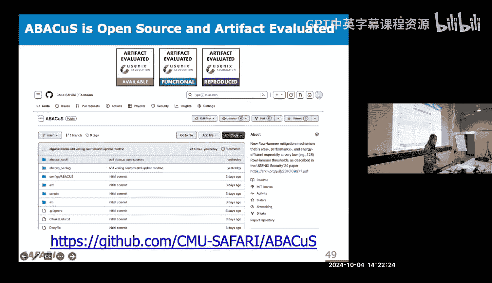

**操作流程**：
1.  当行A被激活时，Camel同时查询计数器表（得到估计值E_hash）和近期标签表（如果匹配，则得到精确值E_tag）。
2.  优先采用标签表提供的精确值（若存在）。
3.  将此激活次数估计值与预防性刷新阈值比较，若达到阈值，则刷新受害者行。

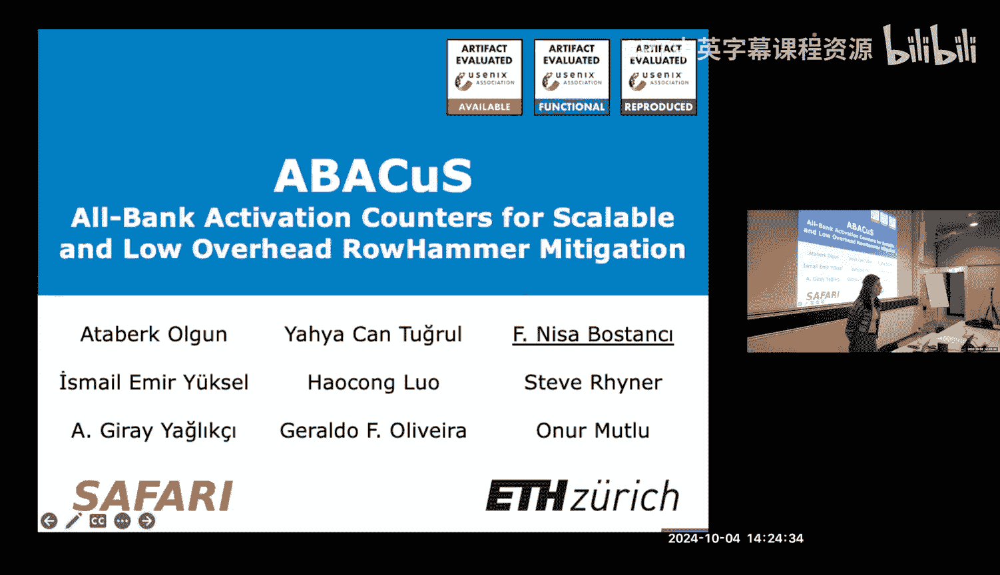

**评估结果**：
*   **面积**：Camel的面积开销显著低于Graphene，与Hydra相似。
*   **性能与能耗**：在低行锤击阈值下，Camel的性能和DRAM能耗开销很小，且优于其他低面积开销的解决方案（如Hydra）。

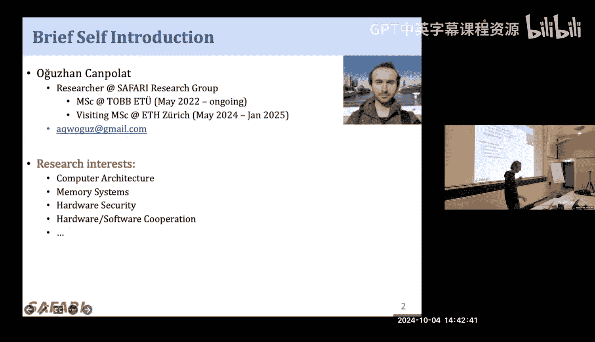

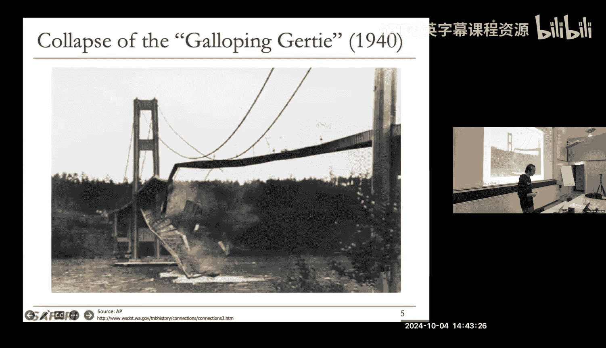

### 2.3 机制二：Abacus 🧮
Abacus（All-Bank Activation Counters for Scalable and Low-Overhead Row Hammer Mitigation）从工作负载与内存的交互模式中获得了关键观察。

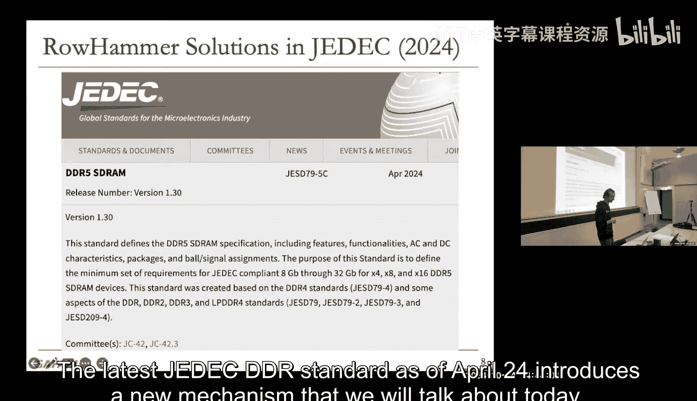

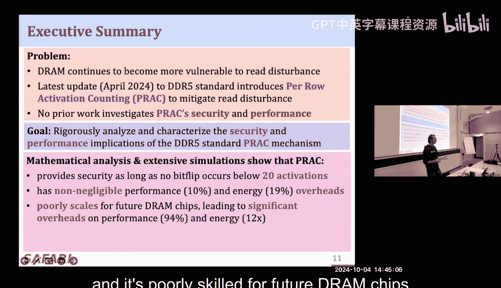

**关键观察**：许多工作负载倾向于在相近的时间点访问不同存储体中**相同行地址**的行（称为兄弟行）。这是由于：
1.  工作负载内存访问模式固有的空间局部性（如遍历数组）。
2.  现代物理地址到DRAM的映射策略，它将相邻的缓存行映射到不同存储体的同一行，以利用存储体级并行性。

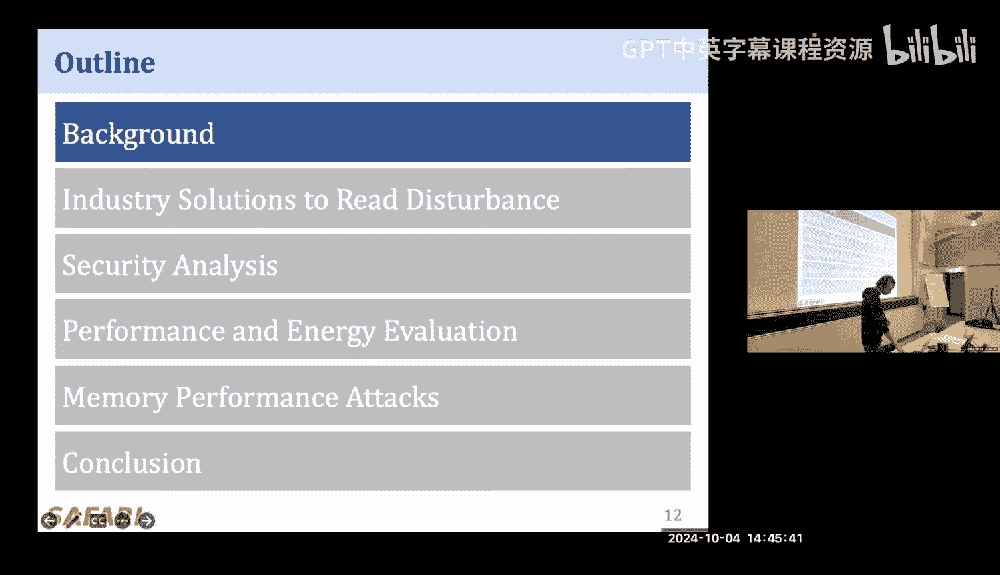

**关键思想**：使用**一个计数器来跟踪所有兄弟行（跨所有存储体）的最大激活次数**，从而将计数器数量减少为存储体数量的分之一。

**设计目标**：保持Abacus计数器的值始终等于所有兄弟行中的最大激活次数。若估计值小于真实最大值，则不安全；若大于，则会导致不必要的性能开销。

**实现**：Abacus借鉴了Graphene的激活计数机制，并进行了扩展以实现跨存储体的兄弟行跟踪。

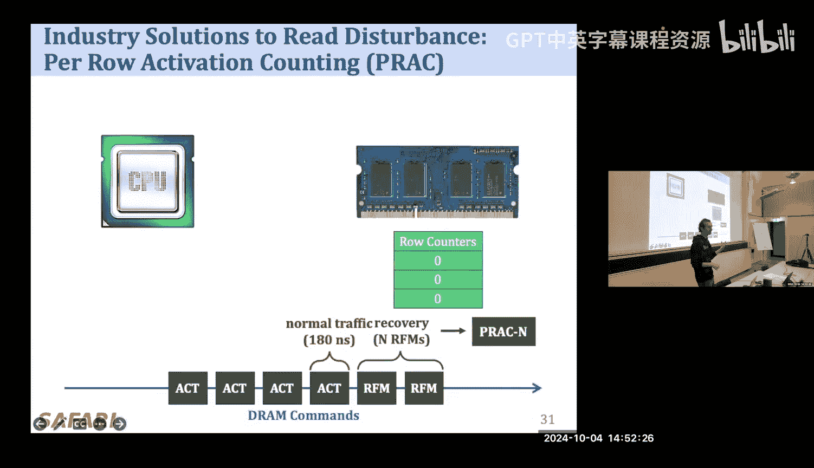

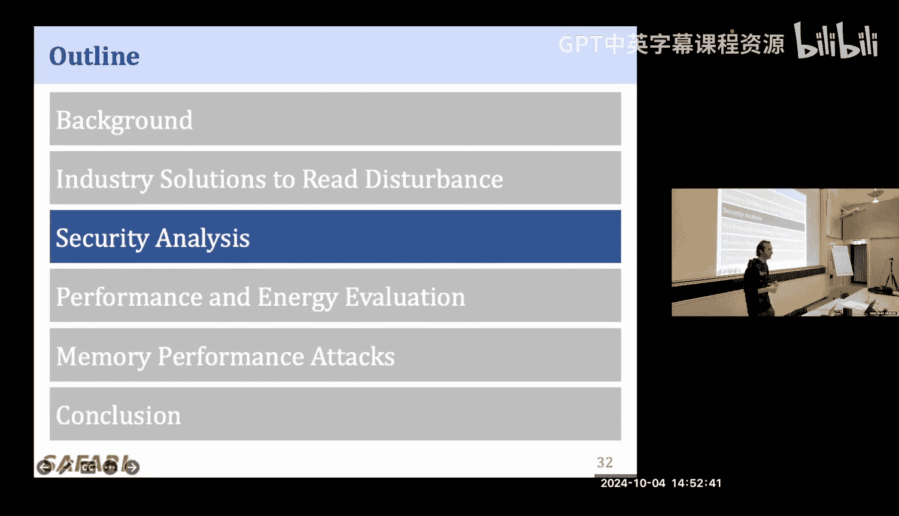

**评估结果**：
*   **性能与能耗**：Abacus在低行锤击阈值下引入了很小的性能和能耗开销，平均性能优于Hydra和Para，能耗低于它们，与Graphene相近。
*   **面积**：Abacus的面积开销显著低于Graphene，在极低阈值下略高于Hydra，但Hydra的性能开销更大。

**总结**：Camel和Abacus都通过创新的计数器组织方式，在低行锤击阈值下实现了面积、性能和能耗之间的良好权衡，为未来高密度、高脆弱性DRAM系统提供了可行的缓解方案。

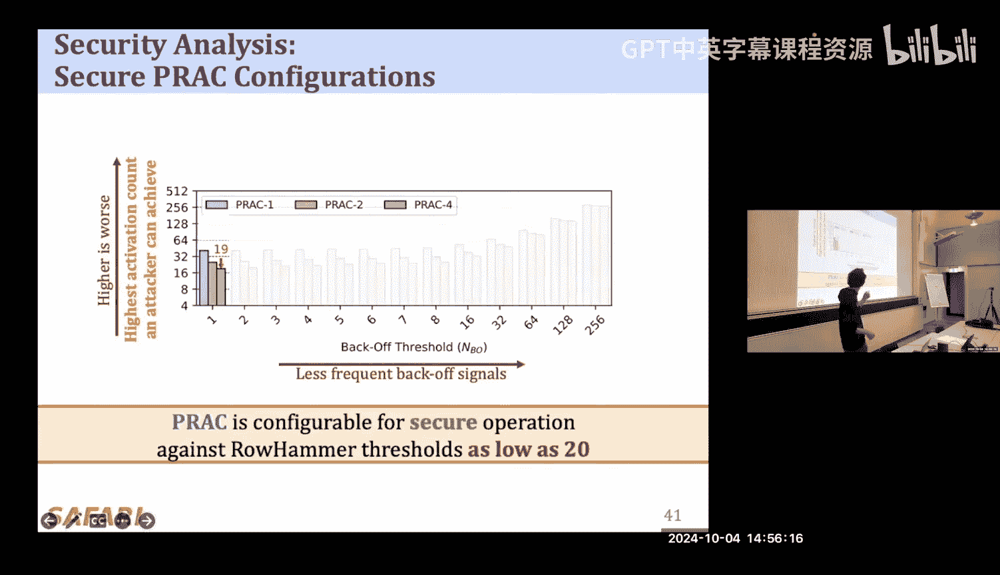

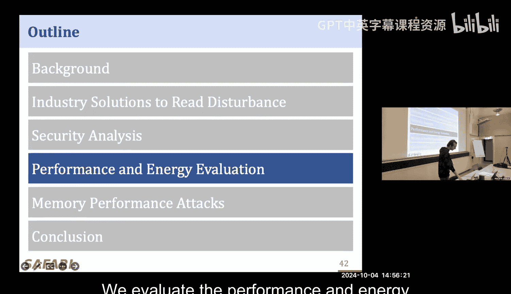

---

## 3. 工业界解决方案：DDR5标准中的缓解机制 🏭

前面我们探讨了学术界的解决方案。本节中，我们来看看工业界如何应对行干扰问题，特别是最新的DDR5标准中引入的机制。

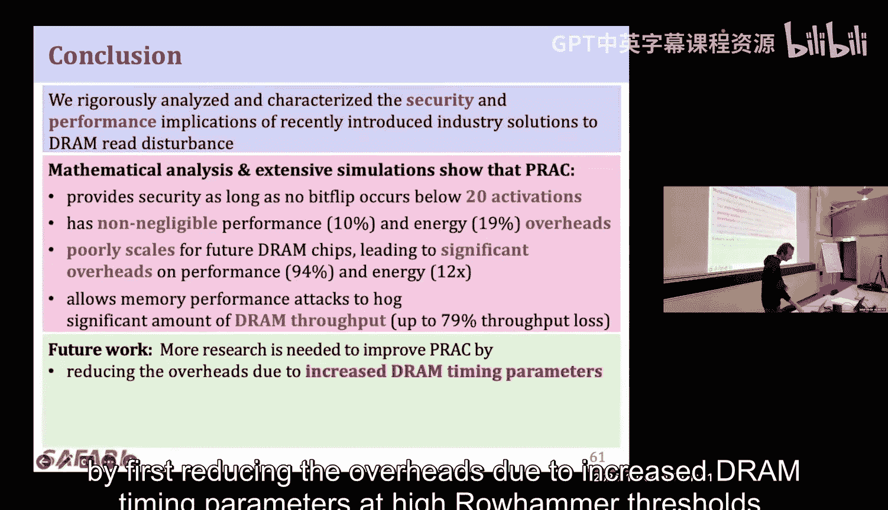

### 3.1 背景与演进
早期工业界解决方案（如某些DRAM的“目标行刷新”功能）曾依赖“安全通过隐匿”的原则，但被许多研究证明可被绕过。如今，行业标准组织JEDEC正更开放地更新规范以应对干扰。

最新的DDR5标准（截至2024年4月）引入了一种名为 **Per-Row Activation Counting (PRAC)** 的新机制。我们的目标是严格分析这些新机制的安全性和性能开销。

### 3.2 两种工业界方案
两种方案都基于一个关键命令：**RFM (Refresh Management)**。RFM命令允许内存控制器授予DRAM模块一段时间窗口，使其能够安全地执行预防性刷新操作，而不会被内存控制器的访问打断。

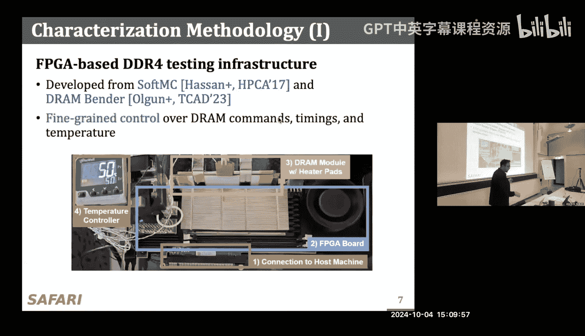

1.  **周期性RFM (Periodic RFM, PRFM)**：
    *   内存控制器为每个DRAM存储体维护一个激活计数器。
    *   当计数达到设定的RFM阈值时，控制器发送一个RFM命令给DRAM模块，并清零计数器。
    *   DRAM模块在RFM授予的时间内决定刷新哪个（些）行。
    *   **问题**：精度低，一个存储体内所有行共享一个计数器，导致大量不必要的刷新，开销大。

2.  **每行激活计数 (PRAC / “Track”)**：
    *   DRAM芯片内部为每个行维护一个激活计数器（但非精确并行更新，而是在行关闭时更新）。
    *   当某行的计数达到“备份阈值”时，DRAM芯片向内存控制器发送一个“备份”信号。
    *   控制器收到信号后，有一段“正常流量窗口”可继续调度请求，随后必须进入“恢复期”并发送一个或多个RFM命令。
    *   **问题**：启用PRAC会增加关键的DRAM时序参数（如tRP, tRC），从而增加访问延迟。

### 3.3 安全性与性能分析
我们通过最坏情况访问模式分析（如“波浪攻击”）来评估这些机制的安全性，并使用Ramulator 2.0进行性能和能耗仿真。

**安全性**：
*   **PRFM**：需要非常频繁地发送RFM命令（例如，每8次激活发一次）才能防御较低的行锤击阈值（如128），配置复杂。
*   **Track (PRAC)**：可配置为防御低至2次激活的行锤击阈值，但需要仔细配置以避免被波浪攻击绕过。

**性能与能耗**：
*   **PRFM**：由于频繁的RFM命令和大量预防性刷新，在低行锤击阈值下性能和能耗开销显著增加。
*   **Track (PRAC)**：由于时序参数增加，即使在没有触发预防性刷新时也有基础性能开销。在低阈值下，其性能优于Graphene和Hydra，但能耗较高。然而，其开销随着阈值降低而急剧增加，可扩展性不佳。
*   **攻击面**：攻击者可以故意触发大量“备份”信号，消耗高达79%的DRAM带宽，导致系统性能严重下降，这构成了新的内存性能攻击面。

**总结**：最新的工业界解决方案PRAC提供了可配置的安全性，但对当今的DRAM芯片已带来不可忽视的性能和能耗开销，且对未来更脆弱的芯片扩展性差。它还可能被用作性能攻击的载体。未来研究需要致力于降低其时序参数开销、解决波浪攻击下的性能恶化问题，并防止其预防性操作被利用。

---

## 4. 新型干扰现象：行压迫 (RowPress) 及其组合攻击 🔥

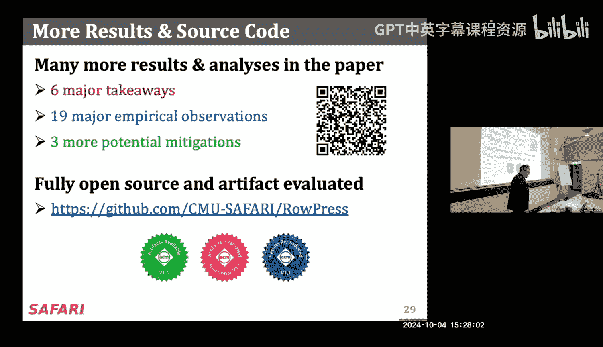

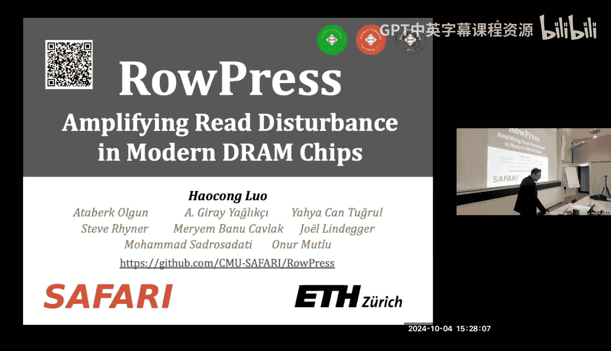

之前我们主要关注行锤击。本节中，我们将探讨一种新发现的、不同的DRAM干扰现象——“行压迫”，以及将其与行锤击结合的组合攻击。

### 4.1 行压迫的发现与表征
**行压迫**是指在锤击行的同时，**长时间保持该行处于打开（激活）状态**，这会对相邻行产生额外的干扰效应，导致比特翻转。

**关键特性**（基于对164个DDR4芯片的实验）：
1.  **放大干扰**：行压迫能显著减少诱发比特翻转所需的最小激活次数，降幅可达一至两个数量级。在极端情况下，仅一次激活（但保持长时间打开）就足以引发翻转。
2.  **温度敏感性**：温度升高，行压迫效应加剧。
3.  **与行锤击不同**：
    *   影响的存储单元集合有较大不同。
    *   比特翻转的方向性不同（行锤击主要是0->1，行压迫主要是1->0）。
    *   访问模式有效性不同：随着行打开时间增长，单侧攻击比双侧攻击更有效，这与行锤击相反。

### 4.2 系统级演示与缓解
我们在一台搭载易受攻击的Samsung DRAM模块的Intel i5系统上实现了概念验证攻击。通过精心设计的内存访问模式（反复访问同一行内的不同缓存块以诱使内存控制器保持该行打开），我们成功诱发了仅靠行锤击无法产生的比特翻转。

**缓解策略**：调整现有的行锤击缓解机制，将**行打开时间**纳入考虑。
*   **方法一（主动）**：在内存控制器中实施更积极的**行策略**，限制行的最大打开时间。
*   **方法二（被动）**：在行保持打开期间，即使没有新激活，也持续增加其激活计数，从而更快地触发现有防御机制的刷新阈值。
这两种方法都能在不增加额外性能开销的情况下防御行压迫。

### 4.3 组合攻击：行锤击 + 行压迫
一个自然的问题是：能否组合行锤击和行压迫来发动更强大的攻击？

**实验**：我们测试了84个DRAM芯片，采用一种混合攻击模式——反复“锤击”一个攻击行，同时长时间“压迫”另一个攻击行（两者位于受害者行两侧）。

**发现**：
*   **更快的攻击**：组合模式诱发首次比特翻转所需的总时间显著少于单纯的行锤击或行压迫。
*   **更少的激活**：组合模式所需的总激活次数也更少。
*   **假设**：从一侧进行的行压迫对受害者行的干扰效应比另一侧的行锤击更强，二者结合产生了协同效应。

**意义**：组合攻击进一步降低了攻击的难度和时间，对现有的、仅针对固定激活阈值的行锤击防御机制构成了严峻挑战。

### 4.4 电路级机理简介
干扰现象的根源在于DRAM单元的高密度布局。关键因素包括：
*   **存取晶体管沟道**：反复激活相邻字线会导致电荷在共享的活性区（Active Region）内迁移。
*   **电荷陷阱**：迁移的电子可能被氧化物层中的电荷陷阱捕获，改变晶体管的阈值电压，加剧电荷泄漏。
*   **字线耦合**：紧密排列的字线之间的电容耦合也会导致干扰。
行锤击主要与电荷在相邻单元间的快速往复迁移有关，而行压迫则与长时间打开一行导致的电荷持续注入和陷阱填充有关。对这些电路级机理的深入理解有助于设计更根本的缓解方案。

---

## 总结
本节课中，我们一起深入探讨了内存鲁棒性领域的前沿研究：
1.  **利用空间变异**：Sword机制通过感知并利用DRAM行之间干扰脆弱性的不规则差异，动态优化现有防御方案，显著降低性能开销。
2.  **创新计数器设计**：Camel和Abacus通过混合哈希/标签计数器或利用工作负载的访问模式（兄弟行），实现了低面积、低开销的行锤击缓解。
3.  **评估工业方案**：分析了DDR5标准中的PRAC等工业界解决方案，指出其在安全性、可扩展性和新攻击面方面面临的挑战。
4.  **揭示新现象与组合攻击**：介绍了“行压迫”这一新型干扰现象及其特性，并展示了将其与行锤击结合的组合攻击的更强威力。

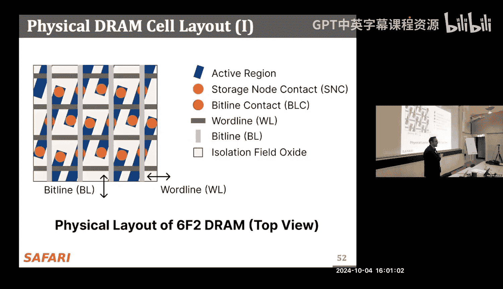

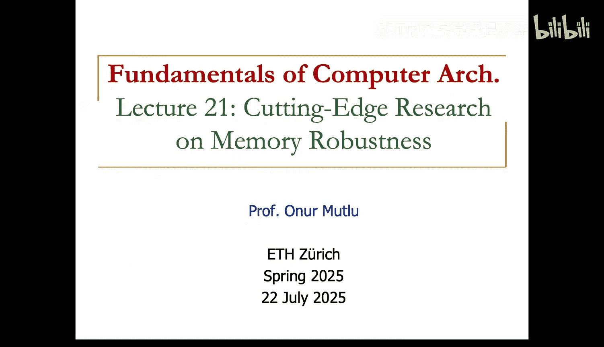

这些研究共同指向一个方向：随着DRAM技术缩放，内存干扰问题日益复杂，需要从电路特性、系统架构、安全策略等多个层面进行协同创新，才能设计出高效、安全、可扩展的未来内存系统。