# 23：推测执行（2025年春季）

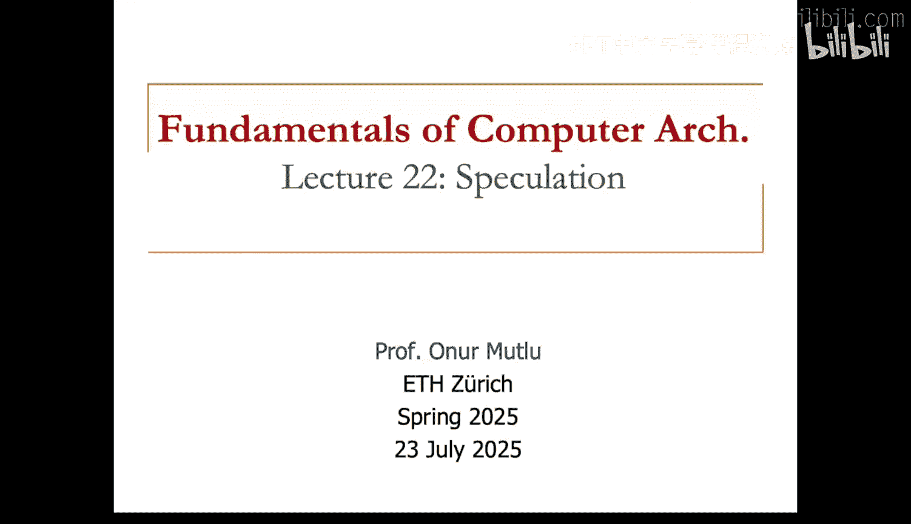

在本节课中，我们将要学习推测执行，特别是其在并行机器（如多核、多处理器或多线程机器）中的应用。这是一个吸引了众多研究者的迷人领域，许多相关研究已经展开。

以下是本课所需的阅读材料：
*   Sohi 等人的《多核推测》是一篇关于推测的奠基性论文。
*   Zilles 的《双核执行》工作，我们稍后会讨论。
推测执行有两个方面：一是提升单线程程序的性能，二是提升并行程序的性能。前两篇论文主要讨论如何利用推测来并行化单线程程序。后两篇论文则关注如何利用推测来提升并行应用程序的性能，包括如今已在一些系统中使用的**事务内存**，以及**推测锁消除**（本质上是在程序员无需或只需少量支持的情况下实现的事务内存）。

还有一些推荐的阅读材料，例如 Steffan 等人的《一种可扩展的线程级推测方法》，这是较早的线程级推测论文之一。此外还有 Hammond 和 Olukotun 的《动态多线程处理器》论文等。本课将讨论更多相关研究，希望你能阅读。

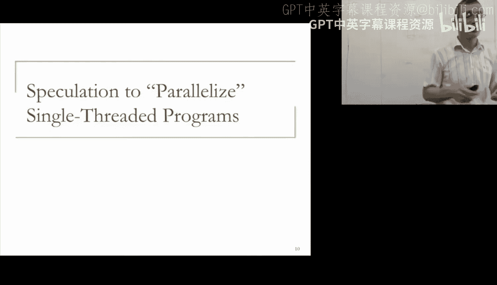

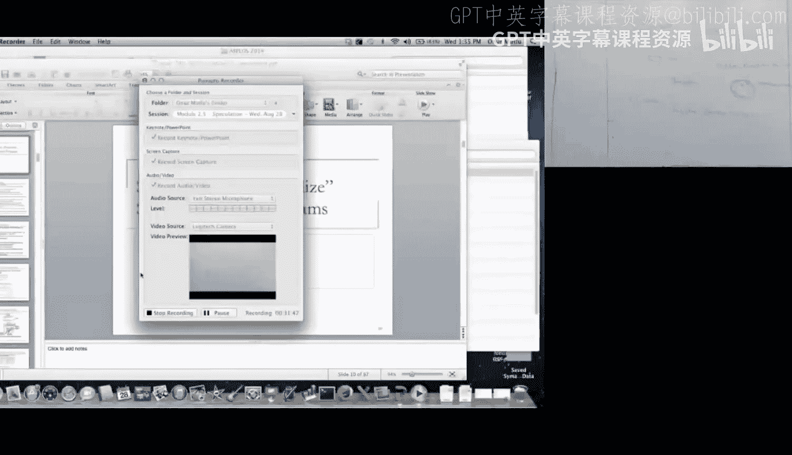

本课的重点是推测执行与并行机器。什么是推测？推测就是在知道某件事是否需要之前就去做。这是推测最普遍的形式。例如，在单线程机器中，为了保持流水线满载，在知道是否需要取指之前就进行取指。这主要用于提升单处理器环境下的性能。

你已经学习过许多技术，特别是如果你上过我的 447 计算机架构课程（其讲座可在网上找到）。例如，**分支预测**就是一种推测形式。在单处理器上下文中，你在知道是否应该取指之前就获取下一条指令，这是理想的分支预测，目的是保持流水线满载。**数据值预测**是另一个概念。当加载一个数据值时，可能需要一段时间，为什么不预测该值，以便推测性地处理依赖指令？这打破了指令间的数据依赖，实现了指令级并行。当然，你需要验证分支预测和数据值预测。如果分支预测错误，当分支实际解析时，你需要通过重定向取指到正确的分支目标来恢复。同样，如果数据值预测错误，所有依赖指令可能都已执行，你需要通过重新执行依赖指令或刷新流水线并重新开始来恢复，就像处理分支预测错误一样。**预取**是另一种推测形式。处理器在真正需要某个地址之前就请求它，可以根据当前发生的地址模式来推测。例如，如果程序生成的地址是可预测的，预取器可以开始预取这些块。这是一种推测，因为预取器只是猜测处理器将继续以流式或跨步方式访问内存。在这种情况下，可能不需要恢复，因为推测本身没有危害。而分支预测则不同，如果不纠正分支结果，会影响正确性。

以上是我们在单处理器上下文中讨论过的推测技术。今天我们的重点将是并行机器或多处理器系统。在多处理器上下文中，也有许多推测方法，如线程级推测、事务内存和辅助线程等。基本思想是推测性地并行化程序以提升多处理器系统的性能。

如果你想了解更多关于单处理器上下文的内容，我鼓励你去观看 447 课程中关于分支预测的讲座（大概是第 10 或 11 讲），它也在 YouTube 上。数据值预测和预取也在 447 课程的其他讲座中有所涉及，你同样可以在 YouTube 上找到，或者我也很乐意在答疑课上讨论。

让我们看看多处理器上下文。同样，这里有许多推测方法，如线程级推测、事务内存和辅助线程。基本思想是推测性地并行化程序以提升性能。为此，我们希望不安全地并行执行线程。“不安全”意味着我们不知道线程是否应该并行执行。线程可以来自顺序或并行应用程序。这是推测性并行化最普遍的形式。我们希望并行化一个单线程应用程序，或者从一个并行应用程序中挖掘更多并行性。

一旦你开始在不清楚是否可以并行的情况下并行执行线程，它们之间可能存在数据依赖。你需要以某种方式检查这些数据依赖。假设你生成了线程 0 并开始推测性地派生线程 1，同时继续执行线程 0。在开始执行线程 1 之前，你不知道线程 1 是否与线程 0 存在数据依赖。但线程 1 可能写入一个稍后被线程 0 读取的位置，这意味着它们至少不应该纯粹地并行执行。因此，硬件或软件需要监控这些数据依赖违规。一旦检测到数据依赖顺序被违反，违规的线程就会被**取消**并重新启动。

例如，这是一种数据依赖推测违规。可能的情况是，一个线程进行加载，而另一个逻辑上更早的线程应该进行存储，但存储发生得更晚。由于推测性并行化，加载发生得更早，从而得到了错误的数据值。硬件或软件检测到这种数据依赖顺序违规（加载本应在存储之后发生），并确定违规线程（本例中是线程 1，因为它在逻辑上更晚，但执行过早）。因此，该线程被取消并重启。这是一种监控和从数据依赖违规中恢复的方法。之所以需要这样做，是因为线程的执行是不安全的，我们在不确定其与程序其他部分是否存在跨依赖的情况下就过早地启动了它。

如果没有数据依赖，你派生了线程，结果证明它完全独立，那么线程就可以**提交**。例如，假设你有一个单线程程序正在执行，其中有一个函数调用。在单处理器上下文中，你通常会顺序执行。但你可以做的是，在另一个处理器上启动另一个线程（线程 1）来执行这个函数调用，而原线程（线程 0）则从函数返回点继续执行。如果这个函数与原线程完全独立，并且没有检测到数据依赖违规，那么你就可以提交这个线程的结果。你需要以某种方式将结果合并到架构状态中，但实际上可以提交。因为不存在依赖，所以推测性并行化在这种情况下是有效的。例如，如果是一个清理任务函数，原线程可能不需要其结果；或者如果是一个其结果在程序很晚才需要的函数，你可以提前并行执行它，这样当其他指令需要其结果时，该函数的结果已经可用。这是推测性并行化可以工作的一种情况。

例如，如果数据依赖未被违反，推测线程就提交。如果线程最初来自顺序顺序，并且你正在推测性地并行化一个单线程，那么需要保持该顺序，使得线程按顺序一个接一个地提交。

基本上，当线程推测执行时，需要进行线程间值通信。假设你决定在此处启动一个函数调用线程。那么这些线程需要通过寄存器或内存进行通信。让我简要讨论一下不同类型的通信，因为这将在不同种类的线程级推测机制中反复出现。如果线程需要通过寄存器通信，这需要处理器间的硬件支持。寄存器依赖和内存依赖之间的根本区别在于，线程间的寄存器依赖是编译器已知的。编译器在编译程序时就知道这些依赖。例如，假设你有一个顺序程序，其中一部分代码写入寄存器 R2，而另一部分（比如一个函数调用）从寄存器 R2 读取并对其进行操作。如果你将这个函数调用作为单独的线程执行，那么这个依赖需要被满足。这个 R2 现在在单独的线程上执行，因为函数与函数返回点之后的代码并行执行。当函数执行时，它读取 R2，而 R2 依赖于正在此处执行的原线程。编译器可以检测到这一点，这是寄存器与内存的根本区别。寄存器依赖可以被编译器分析和检测，因为它们是静态的。当然，它们在某种程度上是动态的，因为它们依赖于分支，但至少你知道可能存在或不存在依赖，只有分支决定该依赖。寄存器地址是静态已知的，依赖也是静态已知的。因此，当线程间发生寄存器通信时，可以由寄存器的生产者（原线程）或消费者（函数线程）发起，具体取决于哪个先执行。编译器可以说：“这个寄存器有依赖，你需要等待它的值”，或者“你需要发送这个寄存器的数据值，因为其他线程需要它”。编译器在分析后可以插入这些提示。

如果消费者先执行（假设是线程 1），并且它与前一个线程（线程 0）并行执行（如果你进行激进的并行化，可能会发生这种情况），那么如果寄存器中的值尚未就绪，消费者就会停顿。它知道需要等待，但值在寄存器文件中尚未就绪。当生产者执行时，它会转发值。你如何知道值是否就绪？基本上，你可以与寄存器文件通信，寄存器文件可以为每个寄存器设置就绪位。你可以为该特定线程在硬件中添加一个就绪位。如果值可用，就绪位被设置；如果值尚不可用（当该线程启动时 R2 的值尚未产生），则该 R2 的就绪位被初始化为零。只有当生产者执行时，它才能将该就绪位设置为一。这些就绪位也称为**满/空位**。这是在线程间进行细粒度同步所需的一种构造，用于指示寄存器的值是否已产生。生产者设置就绪位，消费者等待就绪位变为一。这基本上是线程间的数据流和满/空位同步。早期引入这一概念的是 Burton Smith 关于流水线共享资源 MIMD 计算机的奠基性论文。我鼓励你阅读那篇论文，其中很好地使用了满/空位。这是在 Burton Smith 当时设计的异构元素处理器中，发表于 ICPP 1978 年。这是在线程间通信寄存器的一个重要构造，你可以使用满/空位，内存也可以。这是一个重要的同步构造，使一个线程能够产生寄存器或内存值，另一个线程消费它，从而实现同步。这基本上是一个同步变量，可以在硬件中支持。如果你在进行线程级推测，你应该在寄存器中支持这一点。

你可以阅读这篇论文以了解满/空位的良好应用。另一方面，如果生产者先执行，生产者只需写入结果并发送就绪位。当消费者实际执行时，消费者读取该值。当然，生产者在设置就绪位后可以继续执行。我们将在多标量处理器中看到一个例子。多标量处理器实际上就是以这种方式在线程间通信。寄存器文件中有满/空位，当一个任务（他们称之为任务）产生一个需要发送到其他处理器的值时，编译器会分析任务以知道该值是否需要发送出去。然后，任务在产生该值时，通过寄存器文件环发送该值，而需要该值的另一个处理器在其寄存器文件中捕获它。我有点超前了，但这是你应该阅读的另一篇必读材料：Sohi 等人在 ISCA 1995 年发表的《多标量处理器》。这是线程级推测的一个奠基性例子，以硬件-软件协同的方式实现。

我已经说过，这可以通过寄存器中的满/空位来实现。另一方面，内存通信与寄存器通信非常不同。编译器通常不知道内存依赖，至少困难的动态内存依赖编译器不知道。为什么编译器不知道？因为编译器不知道操作的内存地址，而且由于指针和动态内存分配的使用，并非所有内容都是静态可分析的。你为指针分配内存，可以为指针分配任何值，因此这些依赖依赖于程序的动态输入以及程序基于这些输入的行为，编译器无法分析动态执行。因此，在推测性并行化中，满足不同线程间的内存通信通常更困难。

但如果你在推测性地并行化程序，你希望知道这里是否有一个存储，那里是否有一个加载。如果这个存储和加载在并行执行时实际重叠，你希望知道这个加载是否获得了正确的值，并且没有获得旧值。同样，这里可能有存储，那里可能有加载，你需要知道存储 A 是否与加载 B 重叠，因为如果它们重叠，你可能不希望存储 A 在加载 B 之前发生，因为加载 B 在逻辑上更晚。你需要保持依赖，遵守依赖。一般来说，在线程级推测方法中，线程推测性地执行加载，并从最近的前驱线程获取数据。它记录它已读取该数据。它在 L1 缓存或另一个结构中保持这个记录，我们将看到一些例子。另一方面，存储也是推测性地执行的。当线程执行存储时，它不等待。当线程执行加载时，通常也不等待。正如我之前所说，当线程执行存储时，它可能还不是机器中最老的线程。因此，在它尚未提交时，它缓冲更新，将更新放在写缓冲区或 L1 缓存中。当它执行存储时，它会检查后继线程是否有过早的读取。这意味着线程之间存在顺序。你有线程 0、1、2、3、4、5，它们都可以并行执行，但存在一个顺序，即顺序顺序。如果你正在并行化一个单线程程序并并行执行它们，在这种情况下，你正在获取本应顺序执行的代码块，并并行执行它们。线程 4、线程 5，检查它们是否在加载和存储上存在依赖，是否违反了任何加载-存储依赖。

因此，每个线程都可以推测性地执行加载。例如，假设加载实际上独立于任何存储。并记录它们已读取数据。例如，从地址 A 加载，并记录“我从地址 A 读取了数据”。这可以在 L1 缓存中通过设置一个位来完成，表示“我已读取数据”，比如设置一个推测读取位。后来，例如线程 0 执行一个到位置 A 的存储。在那一刻，它缓冲该存储。它还检查是否有后继线程已经读取了位置 A。如果后继线程进行了过早的读取，那么在这种情况下确实发生了，这个加载 A 发生在存储 A 之前，而它本不应该以那个顺序发生，因为它们是逻辑上顺序的线程。仅仅因为我们不安全地并行执行了它们，加载发生在了存储之前。因此，当存储实际执行时，我们需要检测到这种依赖。存储基本上以某种方式找出目标加载发生得更早，而它本不应该在存储完成之前发生。因此，如果后继线程在这种情况下进行了过早的读取，它需要被取消。取消意味着线程需要重新启动，也许其他所有线程也需要重新启动，因为现在有一个错误的数据值依赖，因为其他线程可能读取了由这个加载后来产生的其他数据值，并用错误的数据值执行了。通常，当你检测到这样的数据依赖违规，发现该线程推测读取了错误的值时，你会取消违规线程及其所有后继线程。当然，你可以做一些更聪明的事情，但复杂性会增加。你可以只找出那些获得错误值的依赖指令，并选择性地重新执行那些依赖指令。这是一个难题，很难有选择地找出哪些指令需要重新执行。人们已经研究过这个问题并找到了一些解决方案，但总的来说这是一件困难的事情。

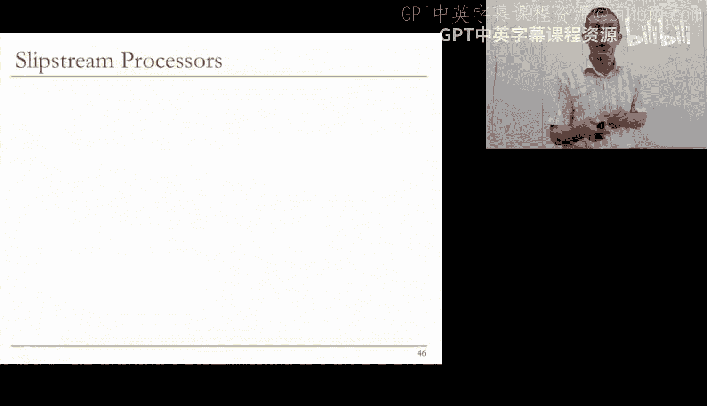

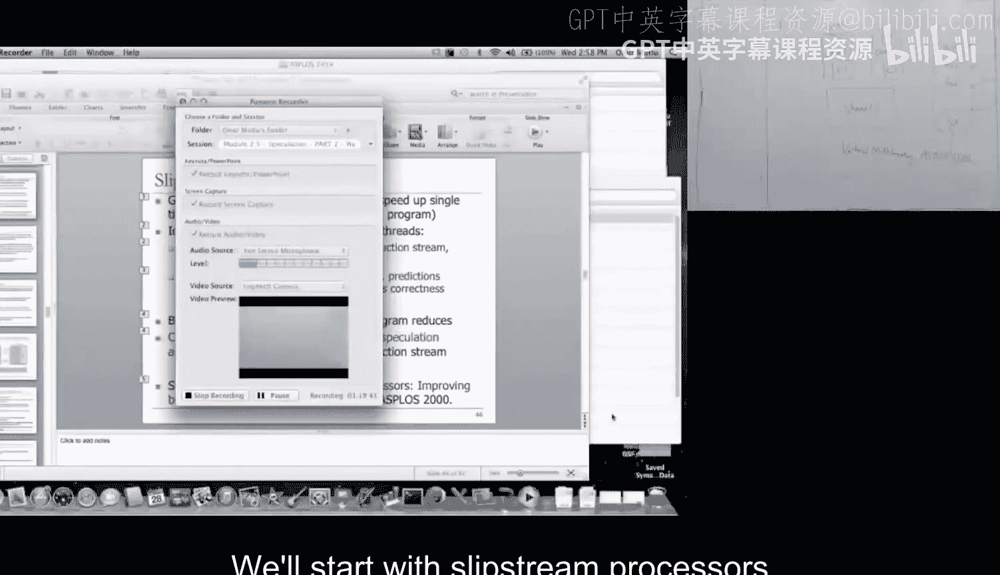

我已经给了你很多线程级推测的概念。基本上，当你获取一个单线程程序并不安全地并行化它时，你会遇到这些依赖问题，关键依赖问题是寄存器通信和内存通信，你需要满足这些，内存通信需要动态满足。这种通信也可以在这里发生，不一定只与最老的线程，这里是最老的线程和最年轻的线程。但它可能发生在线程 3 和线程 4 之间，线程 4 进行加载 A，后来线程 3 进行存储到加载 A，这需要被检测，线程 4 及其所有后继线程需要被刷新或取消。

依赖违规：只有真正的数据依赖违规才应该导致线程取消。存在不同类型的依赖违规。假设在这种情况下，我表示加载 A 和存储 A，这是较晚的线程。假设较早的线程进行加载 A，较晚的线程进行存储 A。在这种情况下，这实际上是一个**名依赖**，硬件应该能够处理，意味着这里没有真正的依赖，这是一个反依赖，而不是真依赖。基本上，假设你有线程 0 和线程 1，线程 0 进行加载 A，线程 1 进行存储 A，并且这个存储发生在这个加载之前。你绝对应该确保这个加载不会获得来自这个存储的值。你应该能够通过消除名依赖来做到这一点。你通过寄存器重命名来做到这一点，但这里不是寄存器，所以你可以进行内存重命名。我们将看到一个进行内存重命名的结构，无论何时你想消除非真依赖（在这种情况下是写后读依赖，或者读后读依赖）。你可以通过重命名这些位置来消除这种依赖，因为存储实际上是在该位置创建一个新值。你可以认为存储杀死了该位置的旧值并创建了一个新值，所以实际上没有依赖，它只是一个名依赖，因为我们没有足够的内存位置。或者，如果需要，你可以创建该内存位置的新版本。第二个是写后写依赖，如果一个线程存储到 A，下一个线程也存储到 A，硬件应确保存储按顺序出现。我们之前已经讨论过这个主题。当真依赖发生时，即较老的线程存储到内存位置，而较年轻的线程通过加载从该内存位置读取，在这种情况下，如果较年轻的线程在存储发生之前读取，那么这就是真依赖，需要被检测并导致取消，因为较年轻的线程读取了错误的值。

因此，一般来说，名依赖（前两种依赖）可以通过**版本控制**来解决。基本上，每次对内存位置的存储都可以创建一个新版本，正如我刚刚描述的，因为存储实际上是在使用该内存位置作为地址，它是在创建一个新值。一旦你有了不同的版本，例如，每当这个存储写入时，它创建版本 1，而这个加载是从版本 0 加载，所以这个加载可以获得正确的值，因为它实际上是在该线程执行时从版本 0 读取。当这个线程执行时，它创建该位置的版本 1。当下一个线程执行时，假设它不存储 A，它创建版本 2。这个线程创建所有版本，一旦这个线程创建版本 2，名依赖就被消除了。当然，这需要一些硬件成本来用不同的版本号标记内存位置。这方面的一个例子在 1998 年 HPCA 的《推测版本缓存》论文中描述，我鼓励你阅读那篇论文。这是处理非真依赖的名依赖的一种方法。

设计推测性并行化概念时的另一个问题是：**在哪里保存推测性内存状态？** 让我们看看。基本上，什么是推测性内存状态？每当一个线程推测性地执行存储指令时，你不知道该存储指令是否应该实际提交到架构状态，因为该线程可能还不是机器中逻辑顺序上最老的线程。这意味着你需要以某种方式缓冲该存储指令。有两种方法：你可以把它放在一个单独的缓冲区，例如一个在线程间共享的共享队列（存储队列）。想法是，当你执行存储时，你有一个缓冲区，线程将其版本号和线程 ID 放入该缓冲区。另一个线程后来检查该缓冲区，看是否有来自更老线程的存储到相同位置。这是存储缓冲区方法，即单独的存储缓冲区方法。这是一个额外的数据结构，但当然是可行的。这类似于我们将在多标量处理器中讨论的地址解析缓冲区，地址解析缓冲区是确保在多标量处理器中满足存储-加载依赖的一种方式。这也类似于我们在 447 课程中讨论过的提前运行缓存和提前运行执行。提前运行执行的基本思想是，你推测性地执行程序，当你推测性地执行程序时，一些存储指令实际上推测性地写入内存，你不想将它们暴露给架构状态，因为记住提前运行执行是纯粹推测性的，在提前运行模式下发生的模式指令从提前运行缓存获取数据值。如果你对此更感兴趣，可以阅读之前讨论过的提前运行论文。

另一方面，你可以不设这样的单独缓冲区，而是决定将推测性数据、推测性存储块放在 L1 缓存中。在这种情况下，你可以在标签存储中标记一个额外的位，称为推测位或推测修改位。当我们讨论线程级推测时，会看到这个例子。这个推测修改位基本上表示该缓存块被该线程推测性地写入。通常，这对其他线程不可见。当线程提交时，你需要使它们非推测性；当线程被取消时，你需要使它们无效。基本上，你正在做的是将存储缓冲区放入缓存并与缓存集成，但你需要确保缓存仍然正确运行。这修改了缓存，但如果你真的想保持推测性内存状态，也许你不需要额外的存储缓冲区。因此，在哪里保持推测性内存状态实际上存在有趣的权衡，我鼓励你思考这个问题，特别是当我们讨论多标量和不同类型的线程级推测方法时。

现在，我将深入探讨推测性并行化单线程程序，但在开始之前，我先休息一下，很快回来。

好的，我们继续。我们将讨论推测性并行化单线程程序，这是推测讲座的一部分，然后我们将重点讨论如何利用推测提升并行程序的性能。这是一个吸引了许多人的话题，有许多阅读材料可以推荐，这些都是参考阅读材料，其中一些是必读的。当然，你读得越多越好，阅读和理解这些思想并评估不同思想之间的权衡总是好的。这可以给你很多好的项目想法，也能让你进行出色的研究。因此，我实际上建议阅读所有这些论文，但其中一些将是必读的，正如我之前告诉你的，并且我们将发布在网站上。我会尽量涵盖其中一些，这些是参考阅读材料，但还有许多其他阅读材料我们可以讨论。

将单线程程序并行化到多个硬件上下文的基本思想称为**线程级推测**。这也称为推测性多线程，有许多例子。一个例子是动态多线程，我简要讨论过，这里给出这个参考，但那是它的一个例子。Hammond 和 Olukotun 在 MICRO 1998 年写了一篇关于动态多线程处理器的论文。这是推测的一个例子，我们不会详细讨论，但我把它写在这里是因为它也是一种有趣的方法。基本思想是，每当一个线程遇到函数调用时，在单独的硬件上下文上启动该函数调用。因此，核心 0 执行常规线程，核心 1 执行函数调用。此时，核心 0 并非无所事事，而是从函数调用的返回点继续执行。因此，考虑代码，你有一些代码在这里，有一个调用在这里，这个调用带你到某个函数块，该函数块在这里执行，而调用之后的下一条指令（假设是一个加法）在核心 0 上执行。这基本上是函数级推测。在那个函数处，你启动一个线程，如果里面还有另一个函数，你可以在另一个单独的硬件上下文上启动另一个线程，如果还有另一个函数，你再启动一个线程。这就是你如何在函数级别动态多线程化程序。他们在这里所做的是，如果某些值不可用（例如，被预测为由该函数产生），他们基本上预测这些值。实际上，他们预测函数的返回值，因为函数通常产生一个返回的寄存器值。如果是这种情况，那么该寄存器值被预测，并且该返回点用该预测值执行。在该函数结束时，该函数产生一些结果，它也产生寄存器值，将该寄存器值与这个预测值进行比较，如果预测正确，那么这里的执行就是正确的（假设所有由程序较早部分产生且必须在返回点之前执行的值都被正确产生）。因此，需要进行一些检查以确保那发生了，最终结果被合并，他们使用称为预结果缓冲区的东西合并结果。我不会详细讨论，这是机制中更复杂的部分，但他们能够以这种方式在函数级别并行化程序。这是另一个例子，该论文通过循环迭代并行化程序。例如，如果你有一个 for 循环，你可以做的是，当你到达迭代开始时，在另一个处理器上启动下一个迭代。因此，基本上你可以推测性地说，迭代 0 在这里（核心 0），迭代 1 在这里（核心 1），迭代 2 在这里（核心 2），迭代 3 在这里（核心 3），依此类推，有多少核心就用多少。这是推测性并行化的另一种形式。基本上，你甚至可以预测迭代的输入，即使迭代间存在依赖。当然，你需要做我之前说过的所有其他事情，你需要确保真正的数据依赖被正确满足，迭代正确执行。如果存在依赖违规，实际看到依赖违规的后续迭代被取消。这就是推测性多线程（线程级推测）的思想。人们特别研究了在遇到函数调用时的多线程，以及在循环中的多线程。在循环中，你可以尝试推测性地并行化循环的不同迭代，我们将在本讲座中反复讨论这些概念。

但基本思想我已经告诉你了：在编译时或运行时将单个指令流推测性地划分为多个线程。执行是推测性的。你可以在多个硬件上下文中执行推测线程，正如我在这里展示的。最终，你需要将结果合并到单个流中。例如，这个函数调用需要将其结果合并到单个流中，使得结果看起来像是你顺序执行了那个单指令流，这是关键思想。当然，硬件和软件有时需要协同检查在推测执行期间是否有任何真依赖被违反，并确保顺序语义，因为记住，我们在单线程程序中有顺序语义，我们需要确保该语义，只是在底层利用硬件中存在的多个硬件上下文并行化该单线程程序。

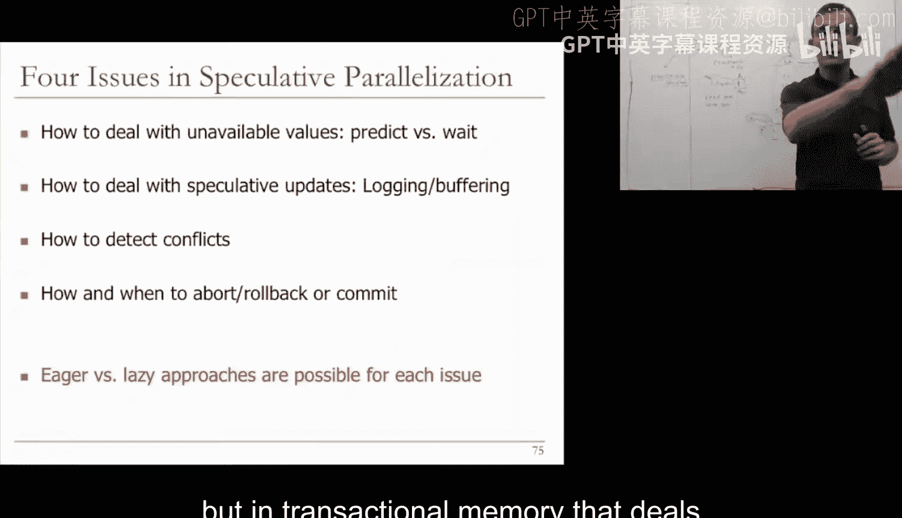

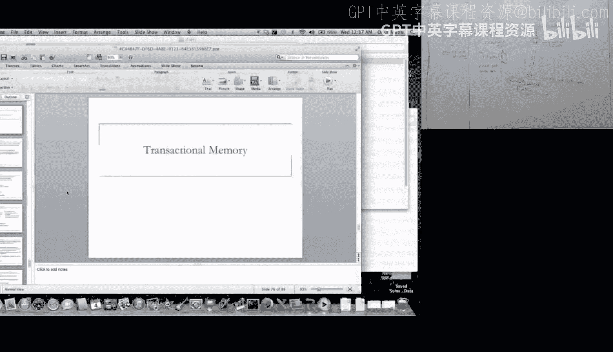

因此，一种可能的方法是假设线程是独立的。例如，这里函数调用执行另一个线程，函数的返回点执行另一个线程。假设它们是独立的。你实际上可以使用值预测和分支预测来打破线程间的依赖。在这种情况下，可以预测函数的返回值，使得返回点之后的代码可以假设其独立性而执行。你不需要等待那个数据值，等待那个数据值可能是另一种选择，但这会减少线程间的并行性。如果它是可预测的，预测该值可能更好，这样该线程可以继续执行。因此，基本上你可以使用值预测来打破线程间的依赖，同样也可以使用分支预测。当然，你最终需要验证这些预测，因为记住这是一个我们推测性并行化的单指令流，你可以通过以某种方式执行安全版本来验证这些预测，也许总是执行安全版本，并通过检查一些不变量来验证。我们将看到其中一种方法，你可以思考其他方法。

线程级推测的早期工作之一实际上是在卡内基梅隆大学完成的，这是 Greg Steffan 的论文《一种可扩展的线程级推测方法》，来自 Todd Mowry 的小组。这展示了一个例子，我将在幻灯片上讲解这个例子。这是一个难以并行化的循环。假设这个 while 循环执行多次，基本上你有两个数组，一个使用一个索引从哈希表加载，另一个以某种方式写入这个哈希表并产生一些值。如果你想并行化这个 while 循环，作为程序员，你不知道一个循环迭代（迭代 1）是否独立于另一个循环迭代。可能第一个迭代写入一个索引，而下一个迭代读取该索引，或者第一个迭代写入一个索引，而第 25 个迭代读取该索引。但你不知道，因为这些索引依赖于程序的输入数据值。因此，作为程序员，很难通过将循环迭代作为不同核心上的不同线程执行来并行化程序。但使用线程级推测，可能发生的情况是，基本思想是推测性地执行连续迭代和连续处理器。因此，处理器 1 在这里执行迭代 1（称为 E1），处理器 2 执行 E2（第二次迭代），处理器 3 开始执行 E3，处理器 4 开始执行 E4。它们都动态并行执行。基本上，这些依赖被跟踪。例如，处理器 1 从哈希索引 3 读取，这没问题，没有其他处理器写入索引 3。处理器 2 从 19 读取，处理器 3 从 33 读取，处理器 4 从 10 读取。因此，第四次迭代从索引值 10 读取，结果第一次迭代实际上写入索引值 10。因此，需要以某种方式检测到这种依赖，所以第四次迭代不能与第一次迭代真正并行执行，因为它们之间存在依赖。第四次迭代应该获得正确的值，而它可能执行并获得错误的值。因为在这里，如果你看时间，第四次迭代的哈希 10 读取执行得比第一次迭代的哈希 10 存储更早。因此，在这种情况下，需要检测到这种违规，因为在这个 while 循环的顺序执行中，第一次迭代应该在第四次迭代之前执行。这就是线程级推测的思想。你如何实际检测这种违规？想法是使用一致性协议来检测这种违规，我们会回到这一点，但假设没有违规，假设动态地这些值使得没有线程写入一个后来被其他线程读取的索引。在这种情况下，所有这些线程在迭代结束时尝试提交，这个尝试提交函数基本上检查是否有违规。如果完全没有违规（违规意味着该线程读取的数据值实际上是由其他线程写入的，并且该线程由于推测性过早执行而获得了错误的值），那么这些线程可以提交。这种提交需要按顺序进行，因为你需要保持程序的顺序语义，记住这又是一个串行程序。这些线程实际上按顺序提交，线程提交假设前一个线程已提交且没有违规。如果存在违规，需要被检测，并通过一致性协议检测到。当这个处理器实际读取哈希 10 时，它不知道其他人已经写入。但当这个处理器后来写入这个索引 10（内存地址索引 10）时，它基本上向这个处理器发送一个无效请求，而这个处理器如果已经读取（记住原则：当你进行推测读取时，你在缓存或某个位置标记表示“我实际上推测读取了这个值”），如果后来从更早的 E（更早的处理器）收到无效请求（因为处理器也可以执行更晚的迭代，而更早的 E 实际上写入了一个被更晚的 E 推测读取的位置），你可以通过一致性协议确定这一点。一致性消息协议向该地址发送无效消息，该缓存接收该无效消息，并检查该块是否实际上被推测读取。如果该块实际上被推测读取（在本例中就是这种情况），并且你收到来自更早 E 的无效请求，这意味着你推测性地读取了一个值，而其他人本应更早写入它，因此这是一个数据依赖违规，你读取了错误的值。一旦你读取了错误的值，现在你需要取消这个线程，这个 Epoch。这展示了实际发生的情况。因此，我将再次讲解这张幻灯片。基本上，这是处理器 1 和处理器 2，假设 E5 和 E6 正在执行，E6 是这里更早的 E（逻辑顺序上更早），E5 是更早的。E6 推测性执行，它基本上从这个内存位置加载。一旦它进行加载，它需要发送读取请求并在其缓存中获取数据缓存块。每个缓存块添加了两个位，表示该缓存块是否被推测加载，以及是否被推测修改，正如我们之前讨论存储和加载以及内存通信时所说的。当这个处理器进行加载时，这个推测加载位被设置为一。它被设置为一，后来，假设这个处理器继续用加载的值执行，它获得加载的值，但这是推测性的，可能不是正确的值。后来，E5 在处理器 1 上执行。它基本上进行存储到相同的位置（Q 和 P 相同，但这些都是指针，所以你无法静态知道位置，因此无法并行化这个程序）。它进行存储，将值从 1 改为 2（本例中加载的值被设置为 1）。它将推测修改位设置在其缓存中，但这在这里不重要，那是用于其他目的。因为它进行存储，它需要向所有其他拥有该位置的处理器发送无效消息。记住，这是一个缓存一致性的共享内存机器，当你对缓存进行存储时，这是一个基于无效的协议。它基本上向所有通过目录协议或侦听协议拥有该位置的其他处理器发送无效消息。这个无效消息到达执行 E6 的处理器的 L1 缓存。无效消息还包含关于哪个 E 正在使其无效的信息，因此它附加了这个 E5 标签。当缓存收到这个消息时，它检查：“哦，这个消息是发送给一个推测加载的块，该块设置了这位，并且它来自一个逻辑上比我所拥有的 Epoch 更早的 Epoch，这意味着我可能推测性地加载了不正确的值。” 在这种情况下，你检测到这是一个违规。一旦收到这个无效消息，你就知道你读取了错误的值，违规被检测到，因此违规信号在这里被设置为真。此时，你可以开始取消所有内容，但在这篇论文中，他们没有这样做。他们做的是等待这个尝试提交时间，这个尝试提交时间实际上检查缓存中的违规位是否被设置，如果违规位被设置，则开始恢复过程。但基本上，它刷新整个 Epoch 并取消所有后续的 Epoch。这就是你如何使用缓存一致性通过无效消息检测读后写依赖违规。如果这是一个基于更新的协议，你可以做同样的事情，甚至可以更聪明。如果是基于更新的协议，这个 E 会向该位置发送一个带有其 Epoch ID 和数据的更新请求。你仍然会知道这是推测加载的，并且你可以说，如果你加载的数据值与发送的数据值不匹配，那么你得到了错误的值，存在违规。如果数据值恰好匹配，那么你碰巧得到了正确的值，因为实际上有很多存储是静默的（这些称为静默存储）。Kevin Lepak 在 MICRO 2001 年有一篇关于静默存储的论文，我鼓励你阅读。这基本上意味着存储将相同的值存储到该位置（与该位置之前的值相同）。因此，基于更新的协议可以有这种优化，它可以检查数据值是否已更改，而不是只检查地址是否将被修改为某个未知值。这就是思想。这就是你如何通过利用底层的一致性协议来检测线程级推测中的冲突。

这篇论文实际上展示了一些结果，我简要介绍一下。我鼓励你阅读这篇论文，实际上有一些有希望的结果。这些是一些应用程序，这是在单芯片多处理器（四处理器单多核机器）上的结果。你可以看到加速比，并行区域在这里，你在并行区域获得的加速比，这只是并行覆盖率。因此，如果你看到并行区域的覆盖率不是很高，这意味着阿姆达尔定律从一开始就限制了加速比。但这些结果显示，例如，在一些应用程序中，使用四个处理器可以获得显著的性能收益，高达 46% 的性能收益，并且随着添加更多处理器，性能收益持续增加。记住，这纯粹是通过线程级推测完成的，它是一个在单线程应用程序上并行化的应用程序。例如，在 JPEG 压缩中，整个程序上收益较少（8%），但在并行区域上收益很高（94%）。你可以看到随着处理器数量增加的速度曲线，这是单线程版本，最多到 8 个处理器，这是程序并行区域的执行时间。你可以看到这个应用程序在并行区域实际上扩展了，但有些情况下，例如这里，性能增加到四个线程，但随着增加到六个和八个线程，性能开始下降，执行时间开始增加。事实上，八个线程的执行时间比一个线程更差。为什么会发生这种情况？这可能是由于多种原因，但在这种情况下，线程间存在大量依赖，因此有大量取消。这是一个原因。由于依赖，数据分布在私有缓存中，你得到大量无效，并且还会发生带宽争用。这些基本上是由于我们在并行区域瓶颈中讨论的问题，论文中实际上讨论了这些。但像这样的线程级推测方法相当有希望。缺点是，正如你所见，优点是你可以在并行区域获得显著的加速，缺点是有些加速实际上很低，并且系统中的复杂性可能很高。因此，我鼓励你思考优点和缺点。

让我们转到另一篇奠基性论文，这实际上是一篇更早的讨论线程级推测的论文，称为**多标量处理器**。关键思想是挖掘串行程序中的隐式线程级并行性，就像我们之前讨论的那样，但这里的方法不同。在这种情况下，编译器将程序划分为任务，任务可以定义不清，但我们会讨论。这些任务基本上是单线程程序的部分。如果你将单线程程序视为执行一系列由静态指令块组成的动态指令，这些任务就是这些块的任意子集。因此，假设这是你的程序，这些是一些指令块，你的任务基本上是程序中的块，任务 0、1、2、3、4，它们可以是循环迭代，也可以是函数。但关键点是，这里是顺序执行。任务被调度到独立的处理资源上，而不是在相同的处理资源上执行。线程 0 去一个处理器，线程 1 去另一个，线程 2 去另一个，等等，类似于之前。硬件处理任务间的寄存器依赖，因为这些来自同一个程序，可能存在寄存器依赖（这里写入寄存器 R2，那里读取寄存器 R2），可能有许多依赖。硬件处理寄存器依赖，但编译器指定哪些寄存器应在任务间通信，因为编译器知道这些信息。记住，寄存器依赖是编译器已知的。编译器在创建任务时，基本上会说：“这些是我需要的寄存器，这些是我可能产生或可以产生的寄存器。” 这些信息被传达给硬件，使得硬件可以在线程间通信，我们将看到一个例子。内存依赖通过内存推测处理，硬件检测并解决任务间的错误推测，并通过我们将讨论的称为地址解析缓冲区的东西实现。

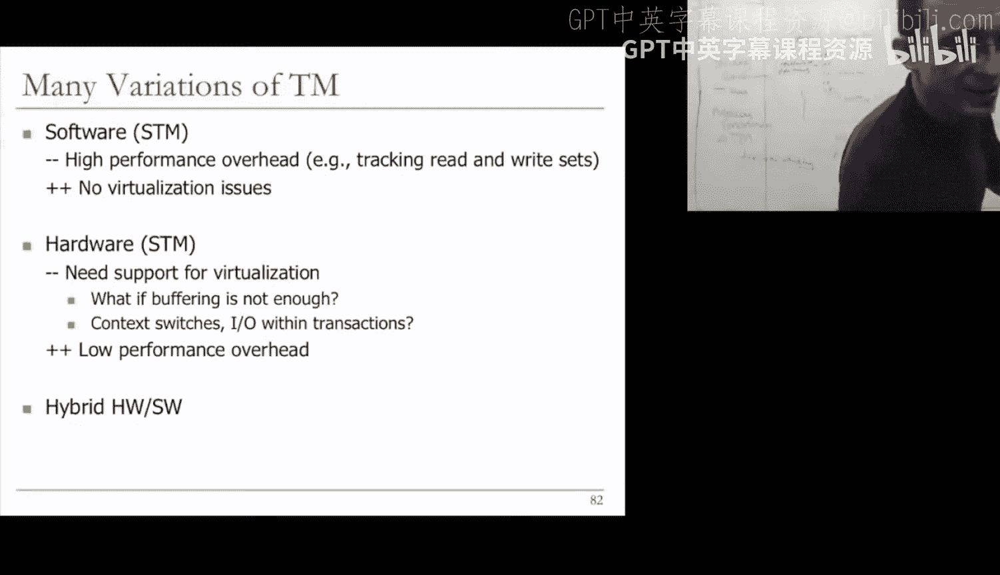

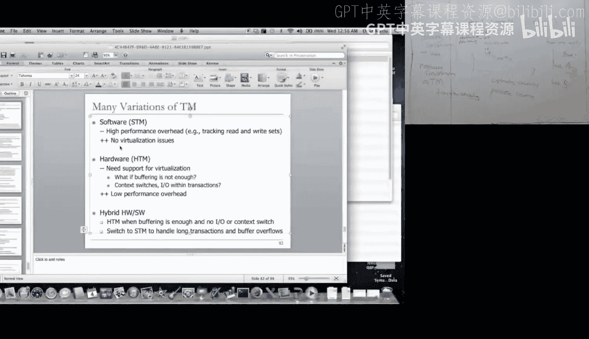

因此，我实际上推荐这里的这两篇论文，但必读论文是 Sohi 等人在 ISCA 1995 年发表的《多标量处理器》，这是一篇较早的论文。《用于挖掘细粒度隐式并行性的可扩展分割窗口范式》论文中的许多概念还不够成熟，但也发表在 ISCA 1992 年。当然，“多标量”这个名字更吸引人。“用于挖掘细粒度隐式并行性的可扩展分割窗口范式”听起来不那么吸引人，但当你说“多标量”时，它开始变得更吸引人。总之，这是个玩笑。但基本上，多标量论文中的这个图清楚地描述了它们试图做什么。

如果你想拥有一个单线程程序并想并行执行操作，你希望一个接一个地执行指令，并拥有一个大的窗口或执行范围来实际提升程序的性能，通过乱序执行提升程序的性能，通过查看大的指令窗口来提升程序的性能。我们已经讨论过为什么构建大窗口更困难，这导致了向多核发展以提升性能，因为通过构建大指令窗口来提升性能是困难的。现在，如果你有一个大的指令窗口，并且你想每个周期执行多条指令，其中一个限制是，例如，如果你想每个周期执行 100 条指令，你需要查看指令流中的许多指令，并且还需要每个周期 100 条指令的宽度，还需要一个支持每个周期执行 100 条指令的寄存器文件，这意味着你需要有 200 个端口（假设每条指令有两个输入值，两个源寄存器）。构建这种多端口寄存器文件是困难的，这是使单核单处理器不具吸引力的技术推动因素之一，类似的原因在 1992 年也出现了。基本上，200 端口的寄存器文件不可扩展。那么，为什么我们不将这个大的指令窗口分割成小块，并在不同的处理器中并行执行不同的部分呢？处理器 0 执行任务 0，处理器 1 执行任务 1，处理器 2 执行任务 2，处理器 3 执行任务 3。现在每个处理器查看一个较小的窗口，但你可以并行处理整个窗口，也许是类似大小的窗口。额外的好处是每个处理器有一个更简单的寄存器文件。为什么？因为现在为了获得相同的带宽，假设你想每个周期总共执行 100 条指令（我这里非常激进），现在你每个处理器只需要执行 25 条指令，这意味着你只需要 50 个端口。当然，如果你将其缩放到合理的值，假设你想总共执行 16 条指令，如果你有四个处理器，每个处理器只需要执行 4 条指令，这意味着每个寄存器文件只需要 8 个端口，这实际上更容易接受。这就是思想。基本上，现在我们有一个分布式寄存器文件，更小的窗口，你将大窗口分割成更小的窗口，通过多个硬件上下文提取并行性。你拥有这个分布式寄存器文件，但你需要以某种方式确保寄存器文件中的通信正确进行，我们将看看多标量是如何做到这一点的。我已经给了你基本思想。

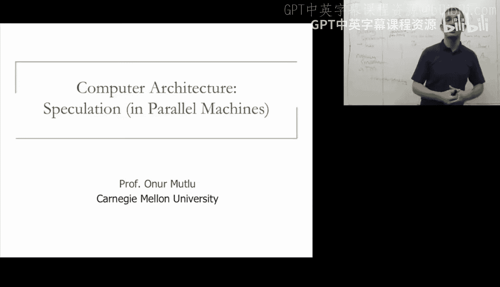

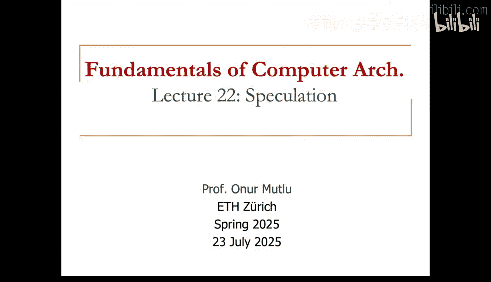

关键思想是通过将顺序指令