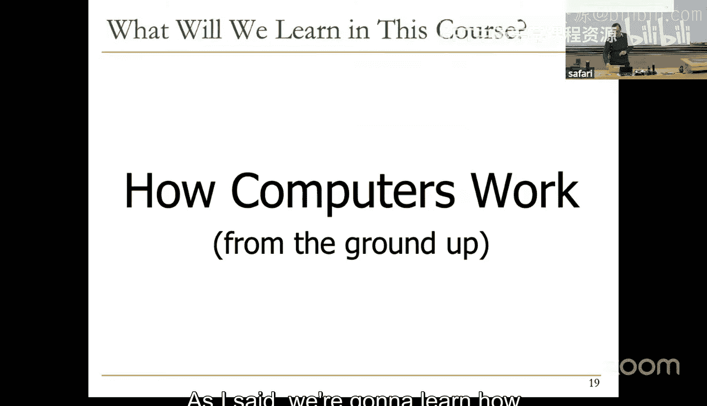
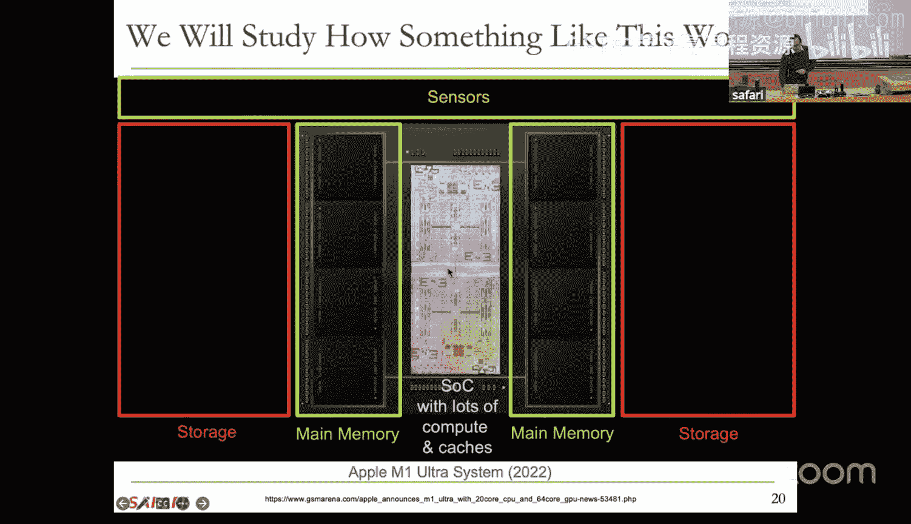
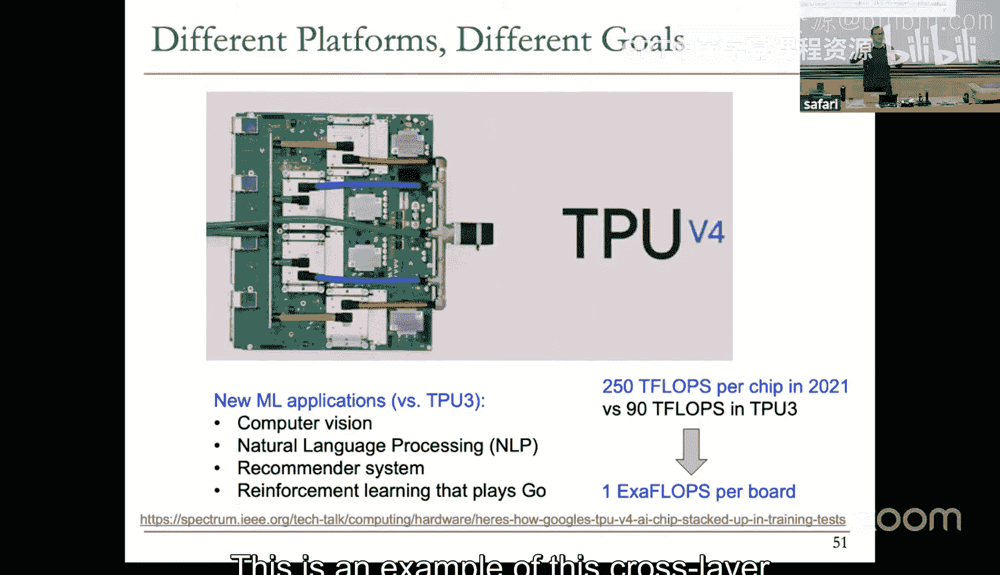
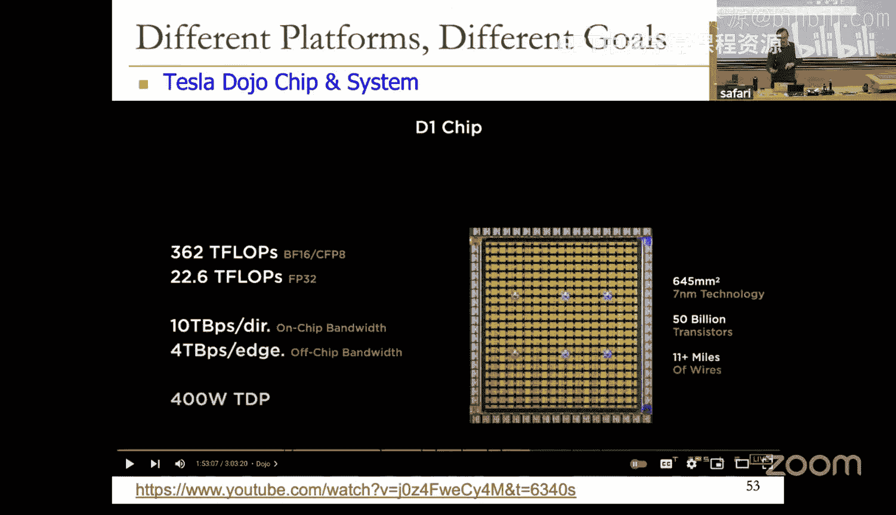
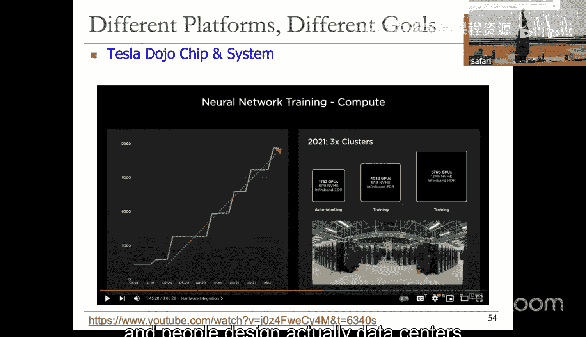
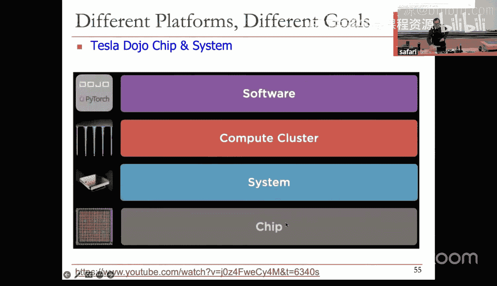
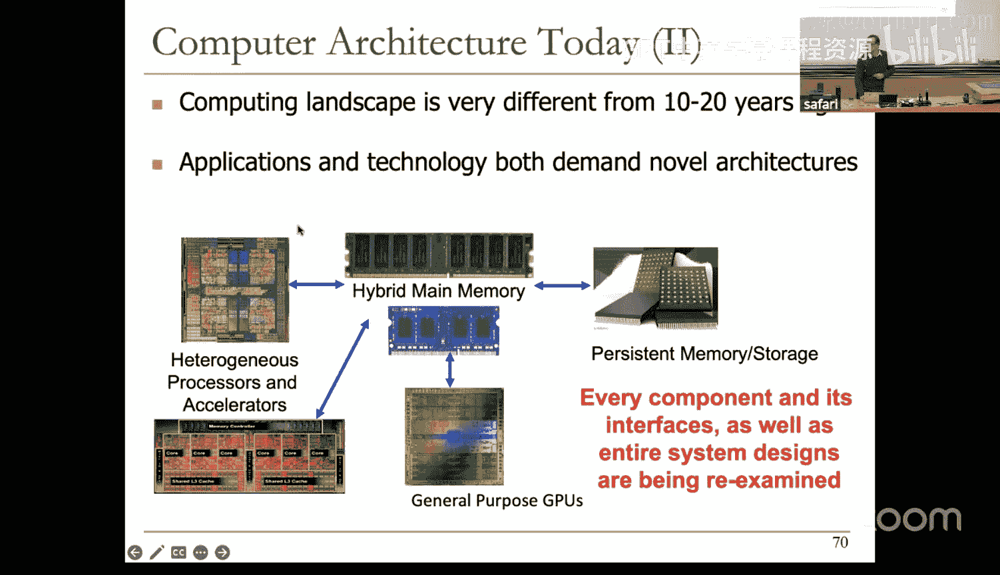
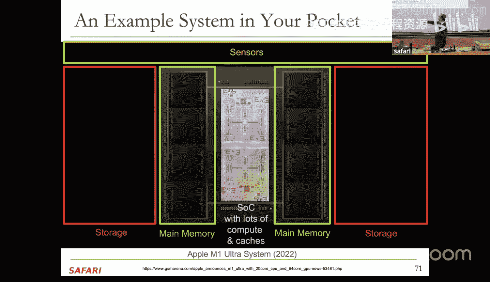
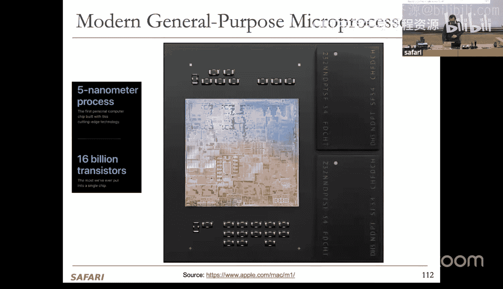
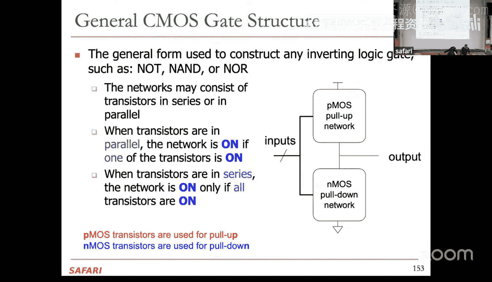

# 1：引言、基础、晶体管、逻辑门 (Spring 2025)

## 概述

在本节课中，我们将开始学习数字设计和计算机架构。我们将从最基础的概念出发，了解现代计算机是如何从底层构建起来的。课程将从晶体管作为抽象开关开始，逐步构建逻辑门、组合与时序逻辑，最终理解微处理器和现代计算系统的工作原理。

---

## 课程介绍与目标

欢迎来到数字设计和计算机架构的第一堂课。这门课程将探讨现代计算机的工作原理及其从零开始的构建过程。

我们将从晶体管作为抽象开关开始，然后在其基础上构建逻辑门。接着，我们将构建组合逻辑和时序逻辑、存储器，进而构建微处理器。之后，我们将讨论如何构建GPU、脉动阵列和机器学习加速器等当今的热门计算单元。

课程将涉及效率、性能、能耗以及如何构建更具可扩展性的微架构和系统等诸多议题。最终目标是利用这些知识，让世界变得更美好、更高效、更有效。

---

## 讲师与助教介绍

我是Onur Mutlu，是这里的教授。在加入苏黎世联邦理工学院之前，我曾任职于卡内基梅隆大学、微软研究院，并在谷歌、英特尔、AMD等公司有过工作经历。我的研究方向包括计算机架构、系统、硬件安全和生物信息学。

我的联合讲师是Mojtaba Sadeghi，他是我们团队的高级研究员和讲师。此外，我们的首席教学助理是Konstantina Mitropoulou，首席实验助理是Alibek Sailanbayev。他们以及许多学生助教将为大家提供课程支持。

---

## 研究背景与课程视角

我们的研究致力于从根本层面构建更好的计算机，提升其性能、效率、鲁棒性、安全性和可靠性。随着计算机在生活各个领域（包括安全关键领域）的应用日益深入，这一点变得至关重要。

本课程之所以重要，是因为它建立了计算机工作原理的基础。如果不打好基础，就无法在软件栈的更高层面进行改进，也无法改变底层可能存在的糟糕的安全或可靠性属性。

当前的计算系统构建了一个转换层次结构：从待解决的问题，到算法，再到编程语言、系统软件、硬件/软件接口（ISA）、微架构、逻辑电路，最终到基于物理原理（如电子）工作的器件。传统的计算机架构聚焦于硬件与软件之间的接口。

然而，今天要取得巨大收益变得越来越困难。更有效的方法是采用跨栈协同设计的扩展视角，即同时定制算法和底层硬件，使它们在中间相遇，从而获得更好的效率和性能。这种跨层设计方法在当今系统中已非常普遍，尤其是在机器学习等领域。

教学与研究是相辅相成的。教学推动研究，因为今天学到的知识可能在未来催生新的设计；研究也驱动教学，因为新的发现需要通过教学传播给社区。因此，本课程将同时强调基础知识和前沿研究。

---

## 课程内容与结构

本课程是计算机科学的基础课程。我们将学习计算机从底层向上的工作原理。课程结束时，我们将研究构成片上系统（SoC）的各种组件，包括通用核心、专用核心、存储器和存储基础。

课程重点在于基础、设计原则和先例。目标是让大家不仅了解现代计算机的工作原理，更能培养批判性思维，学会科学、系统地评估不同设计、不同想法之间的权衡利弊。

实验部分将引导大家设计并实现一个简单的微处理器，并使用FPGA进行实现和调试。通过动手实验，大家将掌握系统化调试复杂设计的能力。

无论你未来的方向如何，学习数字设计和计算机架构的原理都将非常有用。它可以帮助你设计更好的硬件、软件和系统，理解计算机复杂行为背后的原因，并培养并行思维和批判性思维。

---

## 课程组件与学习建议

课程组件包括讲座、阅读材料、作业、实验和考试。我们还会提供额外的加分作业。

学习建议是：专注于学习和理解，而不仅仅是获得分数。讲座时请专注于内容本身。作业旨在强化问题解决能力。历史上，本课程的通过率在80%-85%左右。我们会提供大量材料帮助大家备考，包括习题课、考试指导和往届试题。

学习是终身的，而考试终会结束。请选择最适合自己的学习方式，并利用好我们提供的各种资源。

---

## 计算机为何存在？如何工作？

我们拥有计算机是为了解决问题、进行计算、获取洞察，从而改善生活和未来。

在当今的主流技术中，我们通过操控电子来解决问题。由于无法直接“命令”电子去解决问题，我们构建了之前提到的转换层次结构：将问题转化为算法，用语言编程，通过系统软件在目标上运行，程序与系统软件被翻译成硬件/软件接口（ISA），ISA通过微架构结构实现，微架构由逻辑电路构建，逻辑电路又由晶体管等器件实现，器件则基于物理原理（电子）工作。

这就是计算机架构的狭义视图，也是本课程前期的重点，但我们也会关注扩展视图。

---

## 计算机架构的定义与目标

计算机架构是设计计算平台的科学与艺术。传统上，其核心焦点是ISA和微架构。但如今，它已扩展到系统软件和编程模型。

其目标是实现一系列设计目标，这些目标因系统而异。例如，可以是针对特定AI工作负载的极致性能，也可以是移动设备上的最长电池寿命，或者是通用计算机上最佳的平均性能与成本比。设计不同目标的系统需要不同的优化策略，但许多基本原理是相通的。

当今的计算机架构领域正处于一个范式转变时期，系统变得非常异构，包含多种计算单元、加速器和存储器。这为创新留下了巨大空间。

---

## 基础构建模块：晶体管

所有现代计算机都由大量微小且相对简单的结构——晶体管——构建而成。1971年，第一个通用微处理器仅包含约2300个MOS晶体管。如今，苹果M2 Max等芯片已包含超过670亿个晶体管。

在本课程中，我们将晶体管抽象为一个开关来理解其逻辑功能。这是我们将要讨论的最低抽象层级。

MOS晶体管由导体、金属、绝缘体、氧化物和半导体组合而成。它有一个源极、一个漏极和一个栅极。根据施加在栅极上的电压，源极和漏极之间可能导通（像导线）或断开（像开路）。

主要有两种类型的MOS晶体管：N型（NMOS）和P型（PMOS）。NMOS在栅极高电压时导通，低电压时断开。PMOS则相反，在栅极低电压时导通，高电压时断开。在数字设计中，我们将其简化为逻辑1（高电压）和逻辑0（低电压）。

---

## 从晶体管到逻辑门

了解了MOS晶体管的工作原理后，我们开始构建更高级的逻辑结构——逻辑门。逻辑门实现了简单的布尔函数。

现代计算机同时使用N型和P型晶体管，这称为CMOS（互补金属氧化物半导体）技术。让我们看看最简单的CMOS结构：反相器（NOT门）。

一个CMOS反相器由一个PMOS晶体管和一个NMOS晶体管组成。PMOS的源极接高电压（如3V），NMOS的源极接低电压（如0V）。两个晶体管的栅极连接在一起作为输入（A），漏极连接在一起作为输出（Y）。

其工作原理如下：
*   当输入 A=0（低电压）时，PMOS导通（视为导线），NMOS断开。输出 Y 被上拉至高电压（逻辑1）。
*   当输入 A=1（高电压）时，PMOS断开，NMOS导通。输出 Y 被下拉至低电压（逻辑0）。

因此，输出 Y 是输入 A 的逻辑反相，即 Y = ¬A。其真值表清晰地展示了这种关系。

---

## 构建更复杂的门电路：与非门（NAND）

现在，让我们构建一个更复杂的门电路：与非门（NAND）。它有两个输入A和B。

一个CMOS与非门由两个并联的PMOS晶体管（上拉网络）和两个串联的NMOS晶体管（下拉网络）构成。两个输入同时连接到两个PMOS和两个NMOS的栅极。

其工作原理是：
*   上拉网络（PMOS并联）：只要有一个PMOS导通（即对应输入为0），就能将输出上拉至高电压（逻辑1）。
*   下拉网络（NMOS串联）：只有两个NMOS都导通（即两个输入都为1），才能将输出下拉至低电压（逻辑0）。

因此，仅当A和B都为1时，输出为0；其他情况下，输出均为1。这正是与非门的逻辑：Y = ¬(A ∧ B)。

---

## 构建与门（AND）

那么如何构建与门（AND）呢？与门的逻辑是Y = A ∧ B，即仅当A和B都为1时输出为1。

最简单的方法是在一个与非门后面级联一个反相器。这样，与非门的输出（¬(A ∧ B)）经过反相，就得到了(A ∧ B)。

你可能会想，能否用更少的晶体管直接构建与门？答案是在标准CMOS技术中，很难高效地直接实现。因为PMOS晶体管擅长上拉电压，而NMOS晶体管擅长下拉电压。直接构建非反相门（如AND、OR）通常需要额外的反相级。

---

## CMOS门电路的一般结构

CMOS门电路的一般结构用于构建任何反相逻辑门（如NOT、NAND、NOR）。
*   它包含一个PMOS上拉网络，连接到高电压。
*   它包含一个NMOS下拉网络，连接到低电压。
*   两个网络共享同一个输出节点。
*   输入同时提供给两个网络。

上拉或下拉网络中的晶体管可以串联或并联：
*   晶体管并联：只要有一个晶体管导通，网络即导通。
*   晶体管串联：所有晶体管都必须导通，网络才导通。

PMOS晶体管用于上拉，NMOS晶体管用于下拉。利用这种互补结构，我们可以构建出各种复杂的逻辑功能。

---

## 总结

本节课我们一起学习了数字设计和计算机架构课程的总体介绍、目标与视角。我们探讨了计算机为何存在以及如何通过转换层次结构工作。我们深入了解了计算机架构的广义与狭义定义，并看到了当今异构计算系统的多样性。

在技术层面，我们从最基础的构建模块——晶体管开始，将其抽象为一个受电压控制的开关。我们学习了NMOS和PMOS晶体管的不同特性。在此基础上，我们构建了第一个逻辑门：CMOS反相器（NOT门），并分析了其工作原理。接着，我们构建了更复杂的与非门（NAND），并理解了其晶体管级结构。最后，我们了解了如何通过级联与非门和反相器来构建与门（AND），并认识了CMOS门电路的一般结构。

下节课，我们将继续学习布尔代数，并利用它来表征和优化组合逻辑电路。