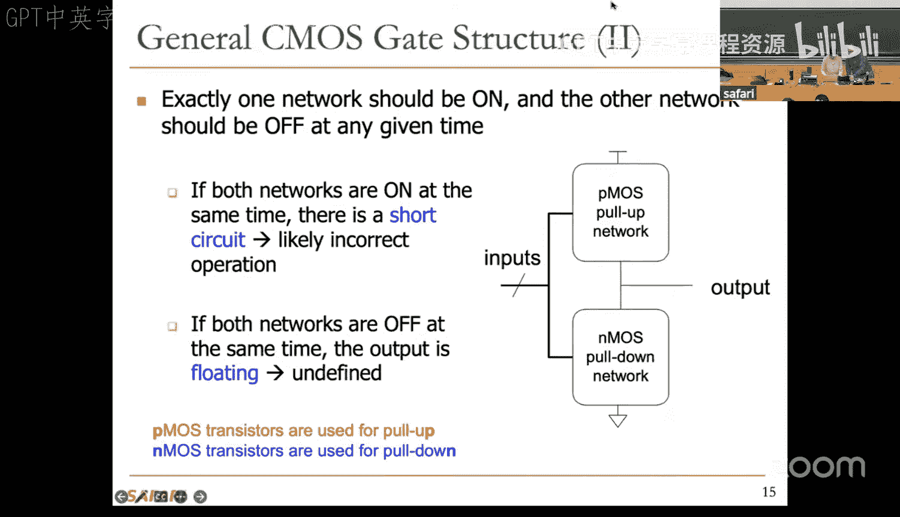
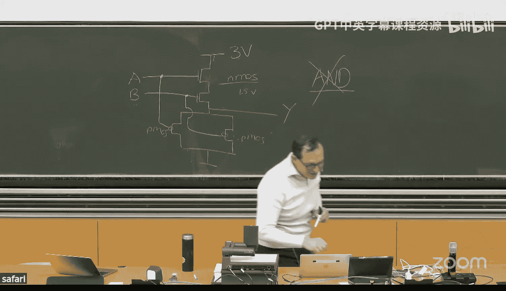
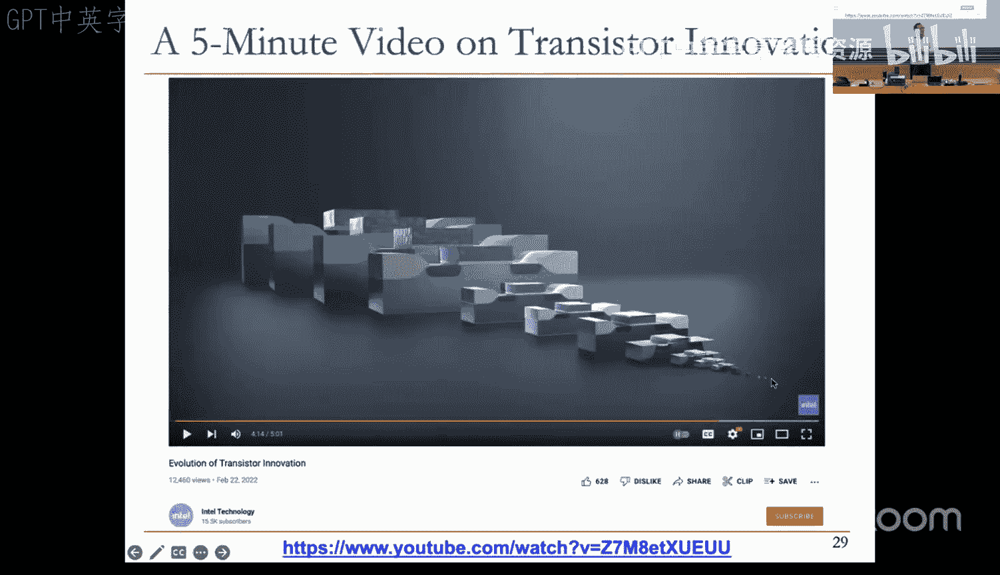
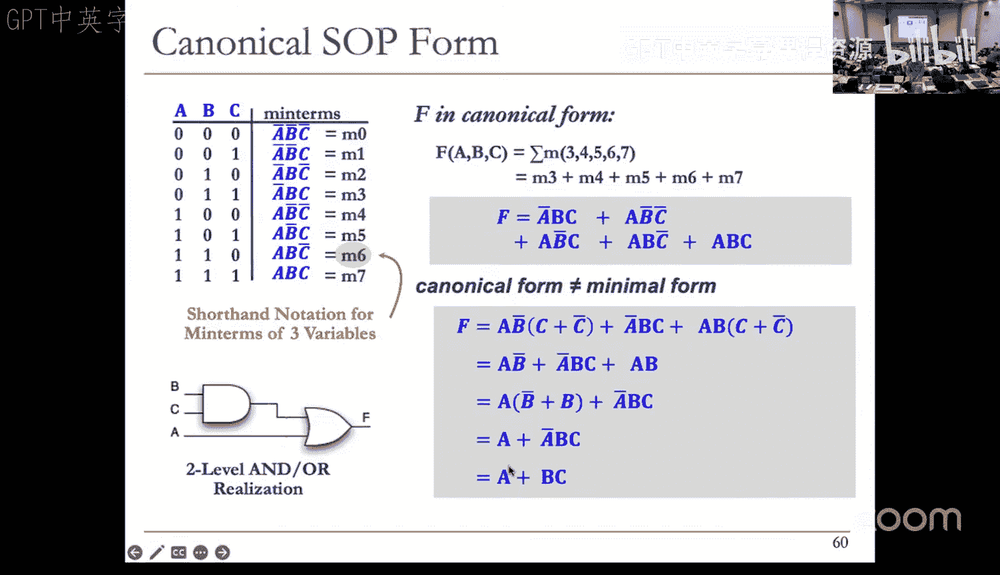
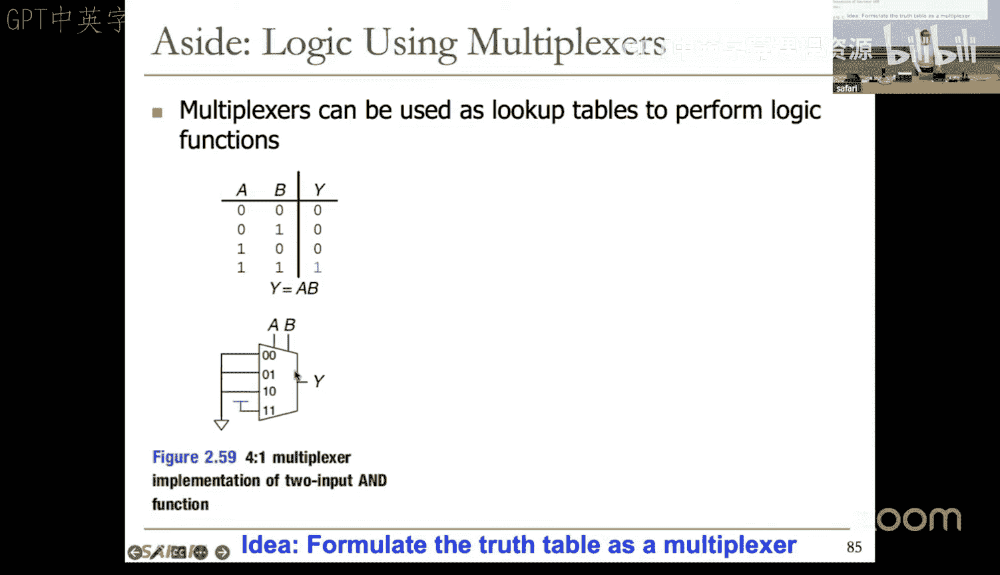
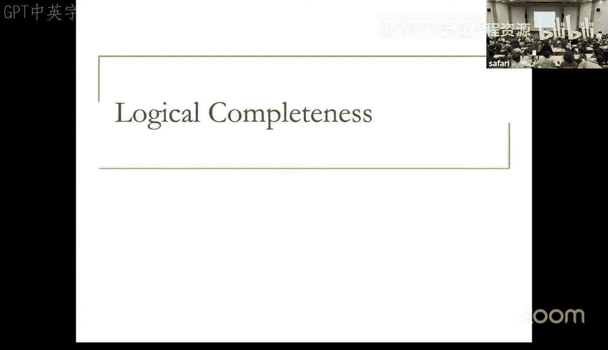

# 2：组合逻辑（2025年春季）🚀

## 概述
在本节课中，我们将学习组合逻辑电路的设计基础。我们将从回顾晶体管和逻辑门开始，深入探讨布尔代数，并学习如何利用它来设计和最小化电路。最后，我们将构建一些关键的组合逻辑模块，如解码器、多路复用器和加法器。

---

## 回顾：晶体管与逻辑门

上一节我们介绍了晶体管作为数字开关的基本概念。本节中，我们将快速回顾并构建更多逻辑门。

晶体管作为数字开关，其核心操作是导通或关断。我们主要关注两种类型：N型和P型。
*   **N型晶体管**：当栅极施加高电压（逻辑1）时导通，相当于闭合的导线；施加低电压（逻辑0）时关断，相当于断开的导线。
*   **P型晶体管**：其操作与N型互补。当栅极施加低电压（逻辑0）时导通；施加高电压（逻辑1）时关断。

基于此，我们构建了互补金属氧化物半导体（CMOS）结构。一个CMOS逻辑门由两个网络组成：
*   **上拉网络（P型）**：连接到高电压（VDD），负责将输出拉高至逻辑1。
*   **下拉网络（N型）**：连接到低电压（GND），负责将输出拉低至逻辑0。

在任何时刻，必须确保只有一个网络导通，另一个网络关断。如果两个网络同时导通，会造成短路；如果两个网络同时关断，输出将处于未定义的“浮空”状态。

以下是几种基本逻辑门的CMOS实现：
*   **反相器（NOT）**：`Y = NOT A`
*   **与非门（NAND）**：`Y = NOT (A AND B)`
*   **或非门（NOR）**：`Y = NOT (A OR B)`

一个重要的设计原则是：**P型晶体管擅长传递逻辑1（高电平），但不擅长传递逻辑0（低电平）；N型晶体管则相反，擅长传递逻辑0，但不擅长传递逻辑1**。因此，我们不能随意混合使用它们来构建任意门。例如，一个仅用4个晶体管构建的“与门”可能无法正常工作，因为N型晶体管无法有效地将输出上拉到稳定的高电平。这就是为什么一个CMOS“与门”通常由一个“与非门”后接一个“反相器”构成（共需6个晶体管）。

---

## 功耗与摩尔定律

在深入设计更复杂的电路之前，了解功耗和制造工艺的宏观趋势至关重要。

数字电路的功耗主要分为两部分：
*   **动态功耗**：当电路中的信号发生切换（0→1或1→0）时，对电容进行充放电所消耗的功率。其计算公式为：
    `P_dynamic = α * C * V^2 * f`
    其中，`C`是负载电容，`V`是电源电压，`f`是切换频率，`α`是活动因子。降低电压对减少动态功耗效果显著。
*   **静态功耗**：即使电路不进行任何切换，由于晶体管漏电流而持续消耗的功率。其计算公式为：
    `P_static = V * I_leakage`

**摩尔定律**预测了集成电路上可容纳的晶体管数量大约每两年翻一番，同时成本下降。这主要通过缩小晶体管尺寸来实现。然而，随着晶体管尺寸接近物理极限，维持这一定律面临着材料、制造精度和散热等方面的巨大挑战。持续的技术创新是计算能力得以指数级增长的基础。

---

## 布尔代数与电路优化

现在我们已经能够构建基本的逻辑门，下一步是如何用它们来构建实现特定功能的电路。布尔代数为我们提供了描述、分析和优化这些电路的数学工具。

布尔代数是在集合 {0, 1} 上定义的一套代数系统，主要操作包括与（AND，记作 `·` 或省略）、或（OR，记作 `+`）、非（NOT，记作 `¬` 或上划线 `¯`）。

以下是布尔代数的一些基本定律和定理，它们对于简化逻辑表达式至关重要：

**公理与基本定律**
*   同一律：`A + 0 = A`, `A · 1 = A`
*   零元律：`A + 1 = 1`, `A · 0 = 0`
*   重叠律：`A + A = A`, `A · A = A`
*   互补律：`A + ¬A = 1`, `A · ¬A = 0`
*   还原律：`¬(¬A) = A`

**运算定律**
*   交换律：`A + B = B + A`, `A · B = B · A`
*   结合律：`(A + B) + C = A + (B + C)`, `(A · B) · C = A · (B · C)`
*   分配律：`A · (B + C) = (A · B) + (A · C)`, `A + (B · C) = (A + B) · (A + C)`

**常用简化定理**
*   `A · B + A · ¬B = A`
*   `A + A · B = A` （吸收律）
*   `A + ¬A · B = A + B`

**德摩根定律**
这是进行逻辑转换的关键定理，它说明了“与”和“或”操作之间的对偶关系：
*   `¬(A · B) = ¬A + ¬B`
*   `¬(A + B) = ¬A · ¬B`

德摩根定律的一个直观应用是“气泡推演”：逻辑门上的一个“气泡”（表示取反）可以沿着信号线移动，并改变所经过的逻辑门类型（与门变或门，或门变与门）。这有助于将电路全部转换为仅使用一种类型门（如全部使用与非门或或非门）的实现。

---

## 组合逻辑电路规范

一个组合逻辑电路由输入、输出和功能规范定义。其特点是**无记忆性**：当前的输出值仅由当前的输入值组合决定，与过去的输入历史无关。

功能规范通常使用以下方式描述：
1.  **布尔表达式**：例如，`F = A · B + ¬A · C`。
2.  **真值表**：列出所有可能的输入组合及其对应的输出值。
3.  **逻辑图**：用逻辑门符号连接而成的电路图。

为了系统地设计和优化电路，我们引入两种规范形式：

**积之和形式**
积之和形式是表达布尔函数的一种标准（规范）方法。
*   **最小项**：是一个包含所有输入变量（或其反变量）的“与”项。对于一个n输入函数，有2^n个可能的最小项。
*   **SOP形式**：函数被表示为所有使输出为1的最小项的“或”运算。
    *例如，一个三输入函数F，当输入为011, 100, 101, 110, 111时输出为1，则其SOP形式为：*
    `F = ¬A·B·C + A·¬B·¬C + A·¬B·C + A·B·¬C + A·B·C`
*   可以使用简写记号：`F = Σm(3, 4, 5, 6, 7)`，表示函数F由最小项3,4,5,6,7组成。

**和之积形式**
和之积形式是另一种规范形式，与SOP对偶。
*   **最大项**：是一个包含所有输入变量（或其反变量）的“或”项。
*   **POS形式**：函数被表示为所有使输出为0的最大项的“与”运算。
    *对于同一个函数F，其POS形式为：*
    `F = (A+B+C) · (A+B+¬C) · (A+¬B+C)`
*   简写记号：`F = ΠM(0, 1, 2)`，表示函数F由最大项0,1,2组成。

从真值表出发，我们可以直接写出SOP或POS形式的规范表达式。然后，利用前面介绍的布尔代数定律对规范表达式进行化简，从而得到更简单、成本更低的电路实现。

---

## 基本组合逻辑模块

为了管理复杂数字系统的设计，我们将逻辑门组合成功能明确的、更大的构建模块。以下是一些关键模块。

### 解码器
解码器是一个输入模式检测器。
*   **功能**：具有n个输入，2^n个输出。对于每一个输入的二进制组合，有且仅有一个对应的输出被置为逻辑1，其余输出为0。
*   **应用**：地址解码（在内存中选择特定位置）、指令解码（处理器识别操作码）。
*   **示例（2-4解码器）**：
    *   输入：A1, A0
    *   输出：Y0, Y1, Y2, Y3
    *   功能：`Y0 = ¬A1·¬A0`, `Y1 = ¬A1·A0`, `Y2 = A1·¬A0`, `Y3 = A1·A0`

### 多路复用器
多路复用器是一个数据选择器。
*   **功能**：根据一组选择信号，从多个数据输入中选择一个连接到输出端。
*   **示例（2选1 MUX）**：
    *   数据输入：D0, D1
    *   选择信号：S
    *   输出：Y
    *   功能：`Y = S ? D1 : D0` （当S=0时，Y=D0；当S=1时，Y=D1）
*   **扩展**：可以用多个小MUX构建更大的MUX（如用3个2选1 MUX构建1个4选1 MUX）。

多路复用器的一个巧妙应用是**实现任意逻辑函数**。将函数的输入变量连接到MUX的选择端，将根据真值表确定的常量（0或1）连接到MUX的数据输入端，即可实现该函数。这种结构被称为**查找表**，是可编程逻辑器件（如FPGA）的核心组成部分。

### 加法器
加法器是执行二进制算术加法的基本组件。

**一位全加器**
*   **功能**：计算两个加数位（A, B）和一个来自低位的进位（Cin）的和，产生一个和位（S）以及一个向高位的进位（Cout）。
*   **真值表**：基于二进制加法规则。
*   **布尔表达式（经化简后）**：
    `S = A ⊕ B ⊕ Cin` （异或）
    `Cout = A·B + A·Cin + B·Cin` （多数函数）

**多位加法器**
*   **行波进位加法器**：将n个一位全加器串联，低位全加器的Cout连接到相邻高位全加器的Cin。结构简单，但进位信号需要从最低位“波动”传递到最高位，导致速度较慢，延迟与位数成正比。
*   **超前进位加法器**：通过额外的逻辑电路，提前计算出所有位的进位，从而大幅减少加法运算的总体延迟。这是通过将进位逻辑展开并并行计算来实现的。

---

## 可编程逻辑结构

最后，我们看看如何利用标准形式来实现灵活的可编程硬件。

**可编程逻辑阵列**
PLA直接实现SOP形式的二级逻辑结构。
*   **结构**：第一级是一个可编程的“与”阵列，用于生成所需的乘积项（不一定是全部最小项）；第二级是一个可编程的“或”阵列，用于对乘积项进行求和，产生最终输出。
*   **特点**：通过熔丝、反熔丝或晶体管开关来配置“与”阵列和“或”阵列中的连接，从而实现不同的逻辑函数。非常灵活，但规模较大时效率较低。

PLA体现了布尔代数和SOP形式在硬件实现中的直接应用。通过编程连接，同一块PLA硬件可以实现多种不同的逻辑功能，包括我们之前讨论的全加器。

---

## 总结
本节课中，我们一起学习了组合逻辑电路的核心知识。我们从晶体管和CMOS逻辑门的基础出发，理解了数字电路的基本构建块。然后，我们深入学习了布尔代数，掌握了描述、转换和简化逻辑表达式的数学工具，这是优化电路面积、功耗和性能的关键。接着，我们探讨了组合逻辑的规范表示方法——积之和与和之积形式。最后，我们利用这些知识构建并分析了几种重要的组合逻辑模块：解码器、多路复用器和加法器，并简要介绍了可编程逻辑阵列的概念。这些模块是构成复杂数字系统（如CPU）的基石，为后续学习时序逻辑和计算机体系结构打下了坚实的基础。