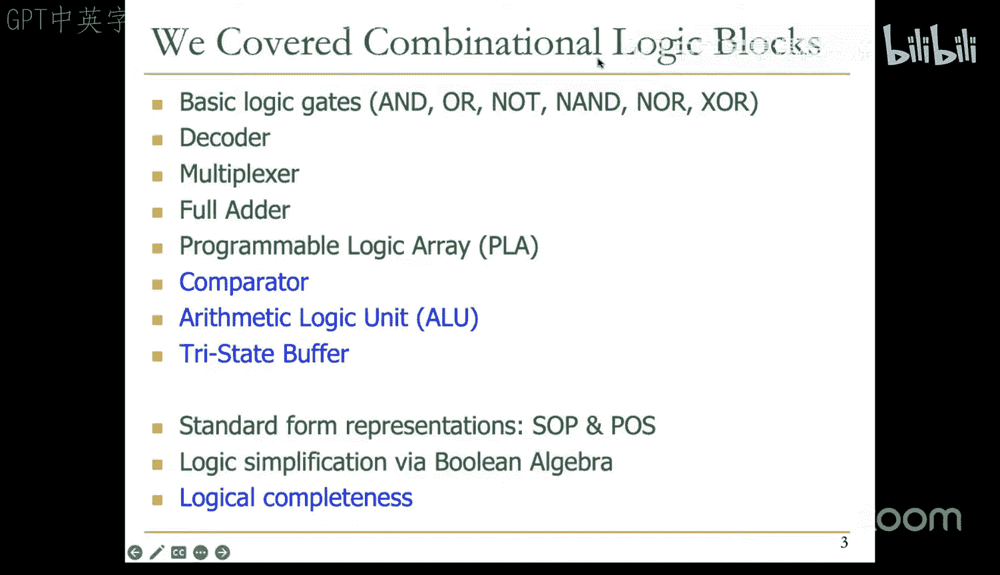
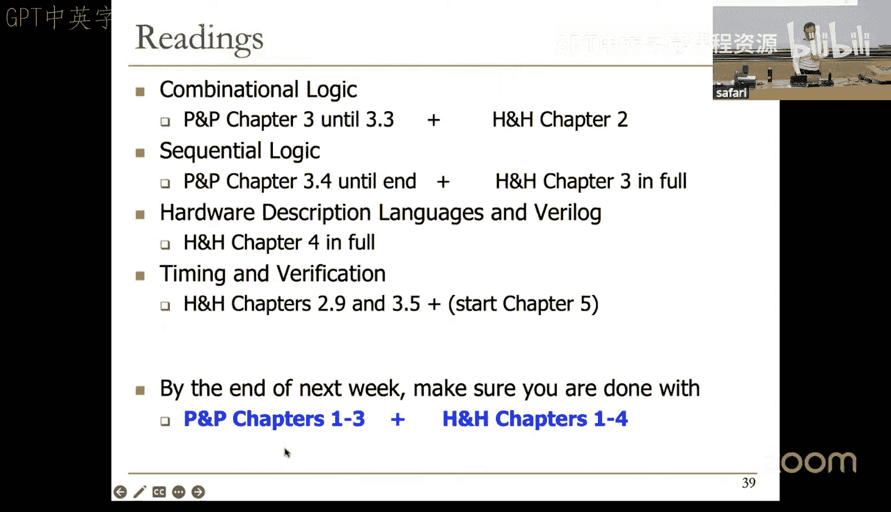
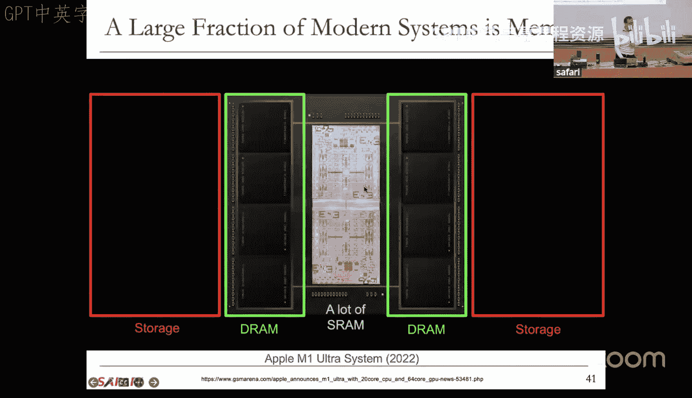

# 3：时序逻辑 (Spring 2025)

## 概述
在本节课中，我们将首先完成组合逻辑部分的学习，然后进入时序逻辑。我们将能够构建有意义的电路，基于我们已经开始学习的组件。我们将从晶体管开始，构建逻辑门，并在此基础上构建更复杂的逻辑模块。

## 组合逻辑回顾与扩展

上一节我们介绍了组合逻辑的基本模块，如解码器、多路复用器和全加器。本节中，我们来看看逻辑完备性和更多有用的组合逻辑模块。

### 逻辑完备性
任何我们想要实现的逻辑功能都可以通过可编程逻辑阵列（PLA）来完成。这是因为PLA实现了积之和形式，而积之和形式是任何真值表的规范表示。

以下是逻辑完备性的核心概念：
*   **与、或、非门集合**是逻辑完备的，因为我们可以构建任何电路来实现任何真值表的规范，而无需使用任何其他类型的门。
*   **与非门**本身也是逻辑完备的。仅使用与非门就可以构建任何电路，因为你可以用与非门来表示与、或、非门。或非门本身也是逻辑完备的。

### 更多组合逻辑模块
以下是更多可能在后续课程和实验中用到的组合逻辑模块。

#### 比较器
比较器用于比较两个值。让我们从构建一个检查两个值是否相等的电路开始。其思想是检查两个输入值是否在每一位上都完全相同。

对于一个4位比较器，其模块图如下所示。它有两个输入A和B，每个都是4位宽。如果A和B在每一位上都相等，则输出为1，否则为0。

以下是使用异或非门构建该电路的方法：
*   检查每一位是否相等：`a3 == b3`，`a2 == b2`，`a1 == b1`，`a0 == b0`。
*   每个异或非门在其两个输入相等时输出1。
*   一个最终的与门接收所有异或非门的输出。只有当所有位都相等时，这个与门才输出1。

#### 算术逻辑单元
算术逻辑单元（ALU）存在于所有处理器中，是核心执行单元。其基本思想是将各种算术和逻辑运算组合到一个单元中，但该单元一次只执行一个功能。

一个典型的ALU符号如下所示。它接收两个输入A和B（每个M位宽），一个输出（N位宽），以及一个功能输入F（例如3位）。功能输入指定要执行的操作，例如与、或、加法、减法等。

以下是ALU功能的一个例子：
*   如果功能编码`F[2:0]`为`010`，则输出`Y = A + B`（加法）。
*   如果功能编码`F[2:0]`为`110`，则输出`Y = A - B`（减法，通过二进制补码实现）。

### 三态缓冲器
三态缓冲器是一个有趣的组件，它允许将不同的信号选通到一根导线上。其真值表如下：
*   如果使能输入为0，输出为高阻态（浮空），A未连接到Y。
*   如果使能输入为1，A连接到Y，Y获得A的值。

浮空信号是指没有被任何电路驱动的信号。通过使用三态缓冲器，可以将多个组件连接到同一总线上，并通过控制逻辑确保在任何时候最多只有一个缓冲器被使能。

以下是三态缓冲器的应用场景：
*   **共享总线系统**：例如，CPU和内存可以连接到同一总线上。通过设计控制逻辑，确保在任何给定时间，只有CPU或内存中的一个可以将值放到总线上。
*   **实现多路复用器**：可以使用三态缓冲器构建多路复用器。例如，一个2选1多路复用器可以通过两个三态缓冲器实现，选择信号S控制哪个缓冲器使能。

## 时序逻辑简介

到目前为止，我们的电路有一个缺点：它们无法记住任何过去的信息。本节中，我们来看看能够存储信息的电路。

### 存储元件的基础：交叉耦合反相器
最基本的存储元件是交叉耦合反相器。它由两个反相器组成，其中一个的输出连接到另一个的输入，反之亦然。

这个电路有两个稳定状态：
*   如果Q为1，则Q非为0。
*   如果Q为0，则Q非为1。

然而，这个电路的问题是我们无法控制如何设置Q的值。它没有输入机制，因此不实用。

### 可控存储元件：RS锁存器
为了控制存储的值，我们引入了RS锁存器（复位/置位锁存器）。它由两个交叉耦合的与非门构成。

其操作如下：
*   **保持状态**：当S和R都为1时，Q保持其先前值。
*   **置位**：要设置Q为1，驱动S为0，同时保持R为1。
*   **复位**：要重置Q为0，驱动R为0，同时保持S为1。
*   **禁止状态**：S和R绝不应同时为0。这会导致Q和Q非都变为1，违反了布尔代数的基本假设，并可能导致亚稳态。

### 门控D锁存器
为了解决RS锁存器的问题，我们引入了门控D锁存器。它确保S和R不会同时为0。

其操作如下：
*   **写入使能为0**：Q保持不变。
*   **写入使能为1**：Q获取输入D的值。

门控D锁存器不违反任何逻辑原则，并且避免了亚稳态。

### 寄存器
要存储多位数据，可以将多个D锁存器并行放置。例如，一个4位寄存器由四个D锁存器组成，共享一个写入使能信号，以便同时写入一个4位值。

寄存器的模块级表示如下：它是一个具有数据输入、数据输出和写入使能信号的模块。

### 存储器阵列
存储器由多个可以写入或读取的位置组成。每个位置由唯一的地址索引。

让我们实现一个简单的存储器阵列：
*   **地址空间大小**：2个位置（需要1位地址）。
*   **地址位宽**：每个位置存储3位数据。
*   **组件**：两个3位寄存器（用于位置0和1）、一个地址解码器和一个多路复用器。
*   **读取操作**：地址解码器根据输入地址选择哪个寄存器的输出连接到数据输出。
*   **写入操作**：地址解码器和写入使能信号共同决定将输入数据写入哪个寄存器。

通过增加地址解码器和寄存器的数量，可以扩展存储器的大小和位宽。

### 有限状态机概念
有限状态机（FSM）是状态系统的离散时间模型。它由以下部分组成：
*   有限数量的状态。
*   有限数量的外部输入。
*   有限数量的外部输出。
*   所有状态转换的明确规范。
*   每个外部输出值确定方式的明确规范。

FSM的逻辑分为三部分：
1.  **下一状态逻辑**：根据当前状态和输入，确定下一个状态的值。
2.  **状态寄存器**：存储系统的当前状态。在时钟边沿，将下一状态的值锁存进来。
3.  **输出逻辑**：根据当前状态（和/或输入）确定输出值。

### 时钟与同步设计
现代计算机使用同步电路，其中状态转换由时钟信号控制。时钟是一个周期性振荡的信号，它将时间划分为固定的间隔（时钟周期）。

在同步设计中：
*   状态转换发生在时钟边沿（例如，上升沿）。
*   在一个时钟周期内，状态保持不变，组合逻辑进行计算。
*   在下一个时钟边沿，根据计算结果，状态可能转换到新状态或保持原状。

同步设计比异步设计更容易实现且更可靠，尽管它可能引入一些时钟开销。

### D触发器
D锁存器不能直接用作状态寄存器，因为它在时钟为高电平期间是透明的（输出会随输入变化）。我们需要一个元件，其输出仅在时钟边沿变化，并在整个时钟周期内保持稳定。

解决方案是D触发器。它由两个级联的D锁存器构成，时钟信号以互补的方式连接。

其操作如下：
*   当时钟为低电平时，第一个锁存器透明，将D值传递到第二个锁存器的输入，但第二个锁存器不透明，因此输出Q不变。
*   当时钟从低电平跳变到高电平（上升沿）时，第二个锁存器变得透明，将之前传递过来的D值锁存到输出Q。
*   因此，D触发器在时钟上升沿采样D输入，并在其他时间保持其先前值。

D触发器是边沿触发的状态元件，非常适合用作有限状态机中的状态寄存器。

## 总结
本节课中，我们一起学习了：
1.  **逻辑完备性**：与或非门集合以及与非门、或非门本身都是逻辑完备的。
2.  **更多组合模块**：包括比较器、算术逻辑单元（ALU）和三态缓冲器的原理与应用。
3.  **时序逻辑基础**：从交叉耦合反相器开始，介绍了RS锁存器、门控D锁存器、寄存器和简单存储器阵列的构建。
4.  **有限状态机概念**：了解了状态、状态转换以及FSM的基本组成部分。
5.  **同步设计与时钟**：介绍了时钟信号的作用以及同步设计的优势。
6.  **D触发器**：作为边沿触发的存储元件，它是构建可靠状态寄存器的关键。

通过这些知识，我们已经为设计和分析具有记忆功能的数字电路打下了坚实的基础。下一节课，我们将利用D触发器开始构建完整的有限状态机。