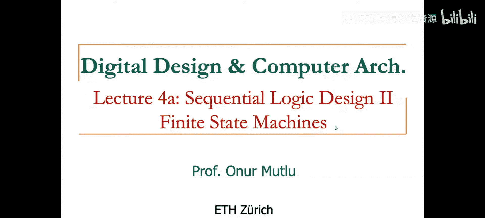

# 4：时序逻辑 II、实验与 Verilog

在本节课中，我们将学习时序逻辑电路中的**有限状态机**，了解课程实验的基本结构，并初步接触硬件描述语言 **Verilog**。我们将从理论概念过渡到实际应用，为后续的动手实验打下基础。

## 有限状态机（FSM）回顾

上一节我们介绍了时序逻辑的基本元件——锁存器和触发器。本节中，我们来看看如何用这些元件构建更复杂的时序系统：**有限状态机**。

有限状态机是描述系统行为的一种数学模型，它由一组**状态**、状态之间的**转移**以及伴随转移的**输出**组成。FSM 特别适合描述那些输出不仅取决于当前输入，还取决于过去输入序列的系统。

一个 FSM 通常包含以下核心部分：
*   **状态寄存器**：由触发器组成，用于存储当前状态。
*   **次态逻辑**：组合逻辑电路，根据**当前状态**和**当前输入**计算下一个状态。
*   **输出逻辑**：组合逻辑电路，根据**当前状态**（摩尔型）或**当前状态和当前输入**（米利型）产生输出。

其工作原理可以用以下流程描述：
1.  在时钟边沿，状态寄存器从 `D` 端采样并更新为次态逻辑计算出的值，这个值成为新的**当前状态**。
2.  输出逻辑根据新的当前状态（和可能的输入）立即产生输出。
3.  次态逻辑同时根据新的当前状态和外部输入，计算下一个时钟边沿将要进入的**下一个状态**。

## 课程实验介绍

理解了 FSM 的理论后，我们将把知识应用到实践中。本课程的实验环节将引导你使用硬件描述语言来设计和实现数字电路。

实验的核心目标是让你掌握从规范到实现的完整设计流程。你将学习如何编写代码来描述电路，如何进行仿真以验证功能，以及如何将设计综合到实际的可编程逻辑器件上。

以下是实验环节通常会涵盖的几个关键阶段：
*   **设计输入**：使用 Verilog 编写电路描述。
*   **功能仿真**：在软件环境中测试代码逻辑是否正确。
*   **综合与实现**：将高级描述转换为目标芯片（如 FPGA）上的实际电路网表。
*   **时序分析与下载**：验证电路时序性能，并将设计文件下载到硬件板卡上运行。


## Verilog 硬件描述语言简介

为了完成实验，我们需要一种工具来描述我们的电路设计。这就是硬件描述语言。本节中，我们来看看本课程将使用的 **Verilog HDL**。

Verilog 是一种用于描述、设计和仿真数字系统的语言。你可以把它想象成电路的“蓝图”或“代码”，它允许你以文本形式定义逻辑门、寄存器以及它们之间的连接。

对于初学者，掌握几个基本概念至关重要：
*   **模块**：Verilog 设计的基本构建块，代表一个电路单元。使用 `module` 关键字定义。
*   **端口**：模块与外部环境的接口，包括输入、输出和双向端口。使用 `input`, `output`, `inout` 声明。
*   **数据类型**：常用的有 `wire`（表示连线，用于组合逻辑信号）和 `reg`（表示寄存器，用于存储状态）。
*   **赋值**：使用 `assign` 关键字进行连续赋值（描述组合逻辑），或在 `always` 块中使用过程赋值（描述组合或时序逻辑）。

下面是一个简单的 Verilog 代码示例，它描述了一个 2 输入与门：



```verilog
module and_gate (
    input  a,    // 输入端口 a
    input  b,    // 输入端口 b
    output y     // 输出端口 y
);
    assign y = a & b; // 连续赋值，y 等于 a 和 b 的逻辑与
endmodule
```

在这段代码中，我们定义了一个名为 `and_gate` 的模块，它有两个输入 `a`、`b` 和一个输出 `y`。`assign y = a & b;` 这行代码描述了输出 `y` 始终等于输入 `a` 和 `b` 进行**位与**操作的结果，这正是一个与门的功能。

---

本节课中我们一起学习了时序逻辑的核心——**有限状态机**的构成与工作原理，了解了课程**实验**从设计到实现的基本流程，并初步认识了用于描述电路的 **Verilog** 语言及其基本语法。这些概念是将数字设计理论转化为实际项目的基础，在接下来的课程和实验中，我们将深入运用这些知识。