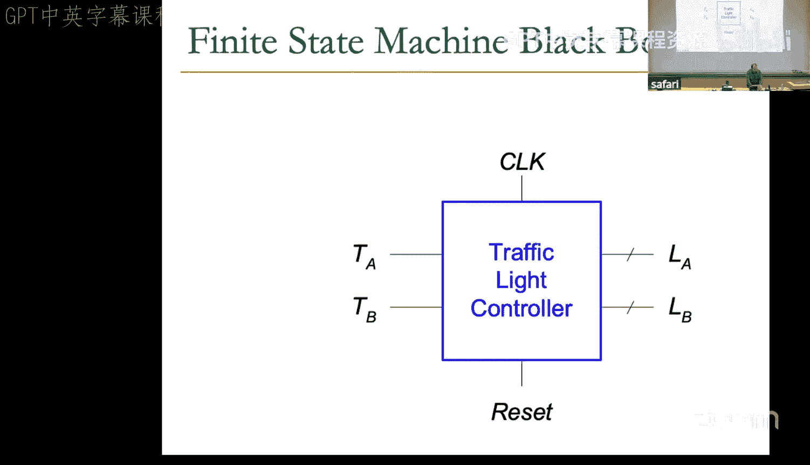
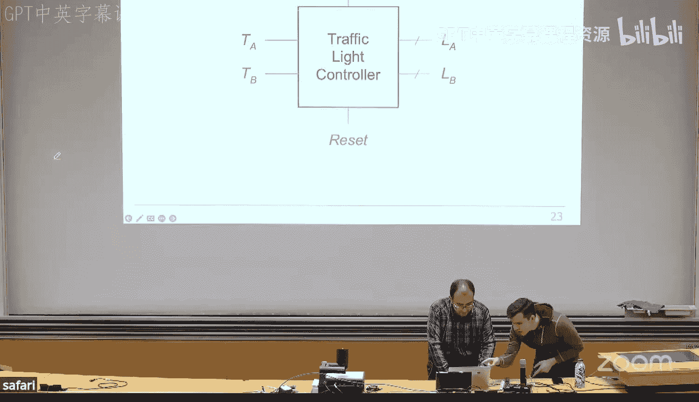
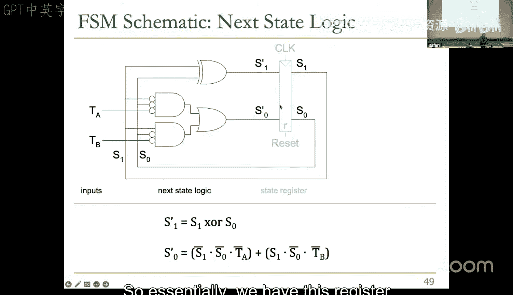
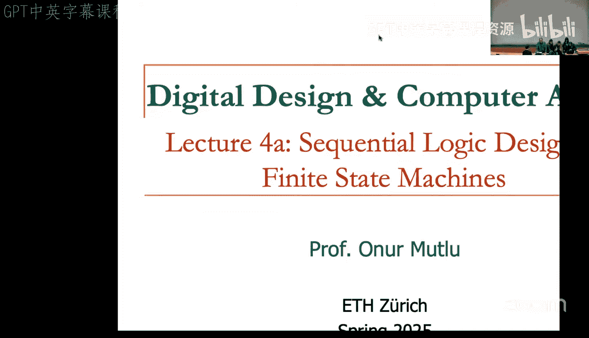
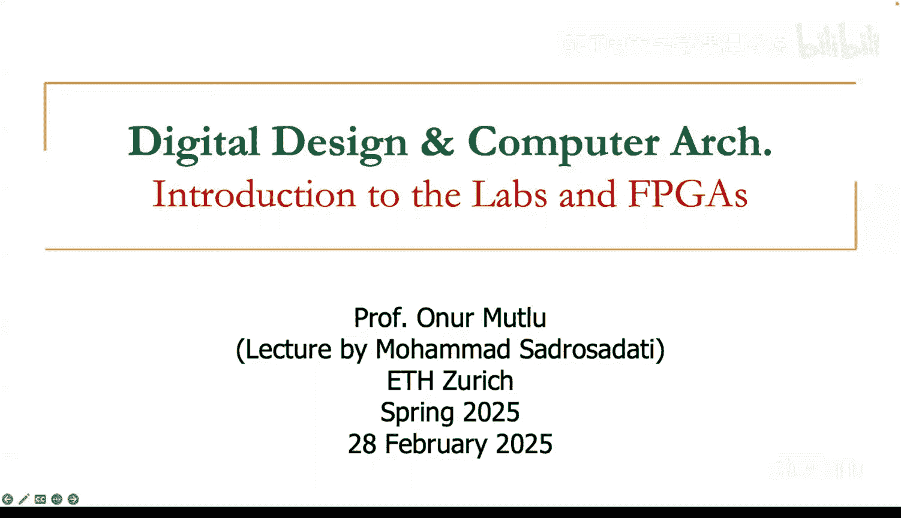
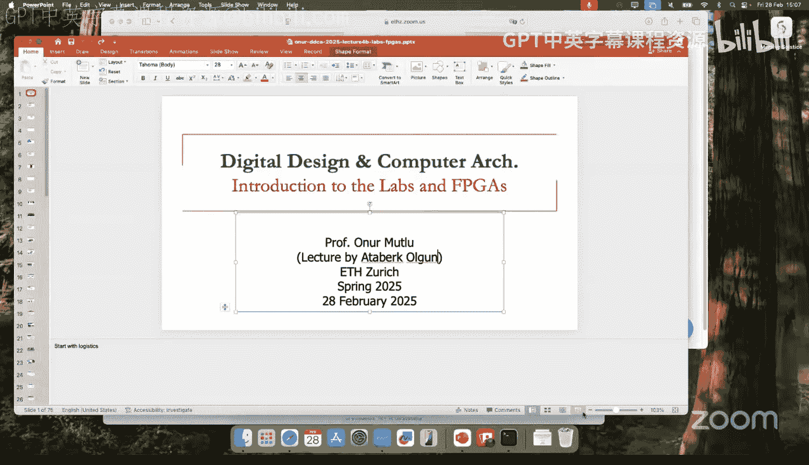
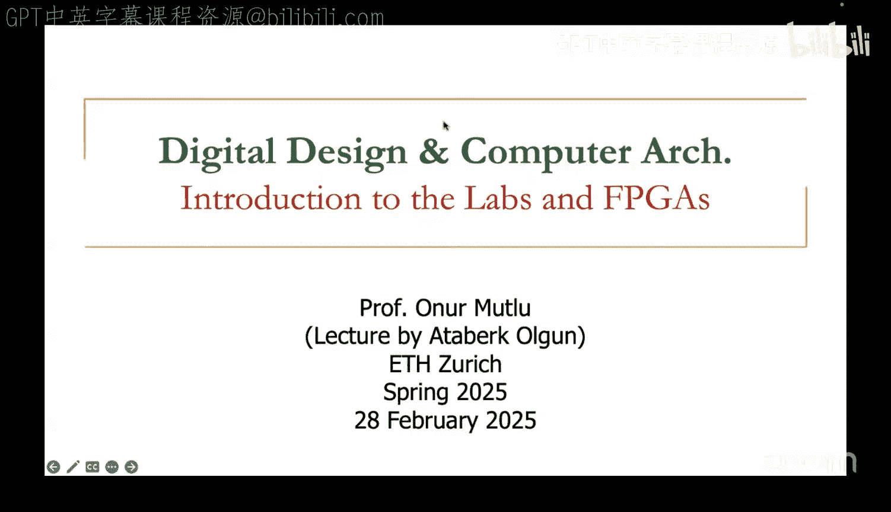
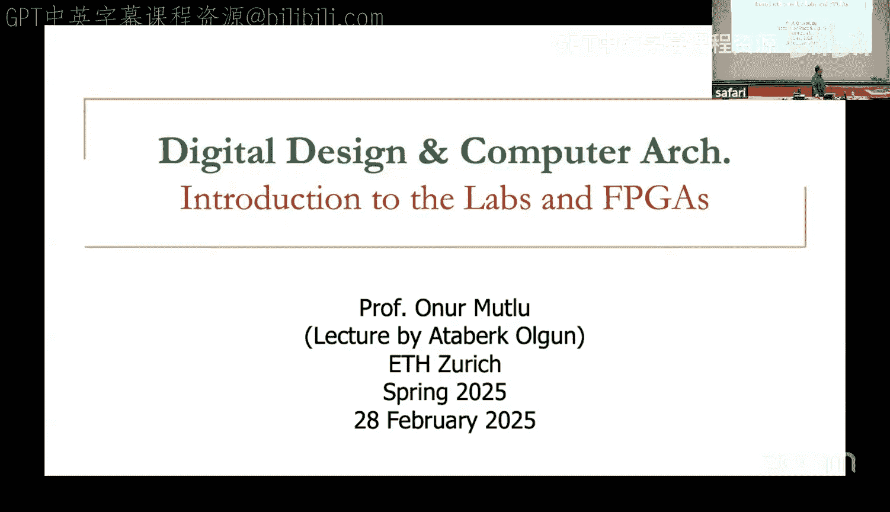
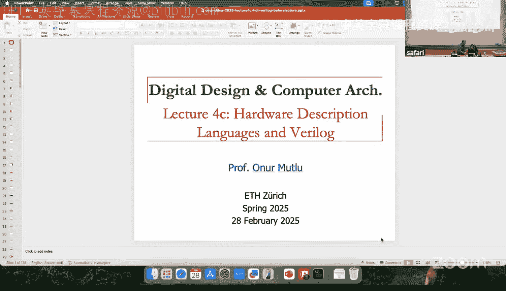
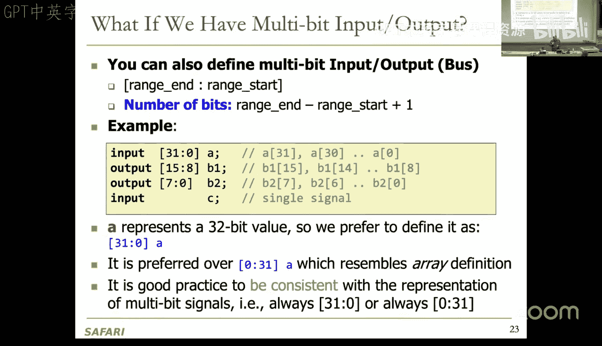

# 4：时序逻辑 II、实验与 Verilog (Spring 2025) 🧠






在本节课中，我们将学习如何设计一个交通灯控制器，深入探讨有限状态机（FSM）的硬件实现，并了解摩尔（Moore）型与米利（Mealy）型状态机的权衡。此外，我们还将介绍本课程的实验安排、FPGA平台以及硬件描述语言Verilog的基础知识。

---

## 交通灯控制器设计 🚦

上一节我们介绍了有限状态机的基本概念，本节中我们来看看如何为一个实际的交通灯系统设计控制器。

设计系统时必须确保服务质量和公平性。例如，如果一条道路（A路）一直有车，而控制器始终让其绿灯通行，那么另一条道路（B路）将永远无法通行，这会导致不公平。在内存控制器等调度技术中，服务质量和公平性同样至关重要。

交通灯控制器可以看作一个黑盒，输入为`TA`和`TB`（表示A路和B路是否有车），输出为`LA`和`LB`（表示A路和B路的灯色）。此外，还需要时钟输入`clk`和复位信号`reset`。复位信号用于将FSM置于初始状态。

### 摩尔型状态机设计

以下是该控制器的摩尔型状态机设计。我们定义四个状态：
*   **S0（初始状态）**：A路绿灯，B路红灯。只要A路有车（`TA=1`），就保持此状态。
*   **S1**：A路黄灯，B路红灯。当A路无车（`TA=0`）并持续5秒后，无条件进入此状态，然后再无条件进入S2。
*   **S2**：A路红灯，B路绿灯。只要B路有车（`TB=1`），就保持此状态。
*   **S3**：A路红灯，B路黄灯。当B路无车（`TB=0`）并持续5秒后，无条件进入此状态，然后再无条件回到S0。




这是一个摩尔型状态机，因为每个状态的输出（灯色）仅由当前状态决定。

### 状态转移表与电路实现

首先，我们需要根据状态图创建状态转移表。该表定义了基于当前状态和输入（`TA`, `TB`）的下一个状态。

以下是状态转移表示例（使用二进制编码`S1 S0`：`S0=00`, `S1=01`, `S2=10`, `S3=11`）：

| 当前状态 (S1 S0) | 输入 (TA TB) | 下一状态 (S1' S0') |
| :--------------- | :----------- | :----------------- |
| 00               | 1 X          | 00 (保持S0)        |
| 00               | 0 X          | 01 (转到S1)        |
| 01               | X X          | 10 (转到S2)        |
| 10               | X 1          | 10 (保持S2)        |
| 10               | X 0          | 11 (转到S3)        |
| 11               | X X          | 00 (转到S0)        |

> **注**：`X`表示“无关项”（don‘t care），在逻辑化简时可以利用。

根据此表，可以推导出下一状态逻辑的布尔方程。例如，对于`S1'`（下一状态的高位）：
```
S1' = (S1 ^ S0) + (S1 & ~S0 & ~TB) + (S1 & ~S0 & TB)
```
可以简化为：
```
S1' = S1 ^ S0
```
对于`S0'`（下一状态的低位）：
```
S0' = (~S1 & ~S0 & ~TA) + (S1 & S0)
```

接着，需要设计输出逻辑。由于是摩尔型状态机，输出仅取决于当前状态。我们需要对灯色进行编码，例如：`00`=绿，`01`=黄，`10`=红。然后为每个输出位（`LA1`, `LA0`, `LB1`, `LB0`）写出基于状态编码`S1 S0`的方程。例如：
```
LA1 = S1
LA0 = ~S1 & S0
```

最后，将状态寄存器（两个触发器）、下一状态组合逻辑电路和输出组合逻辑电路连接起来，就构成了完整的控制器硬件电路。

### 时序图分析

在时序图中，我们可以看到时钟`clk`、复位`reset`、输入`TA`/`TB`、状态位以及输出信号的变化。复位信号通常是异步的，一旦有效，会立即将状态寄存器清零，而不等待时钟边沿。其他信号的变化则与时钟边沿同步，并会经过一定的逻辑门延迟。

---

## 状态编码方案 🔢

状态编码方式会影响设计所需的触发器数量以及组合逻辑的复杂度。主要有三种常见方案：

1.  **二进制编码（完全编码）**：使用最少的比特数（`log2(状态数)`）对状态进行编码。这最小化了触发器数量，但下一状态和输出逻辑可能较复杂。
2.  **独热编码**：使用与状态数相同的比特数，每个状态对应一个比特位为“热”（1）。这简化了设计过程（尤其是下一状态逻辑），并通常使输出逻辑更简单，但需要更多的触发器。
3.  **输出编码**：仅适用于摩尔型状态机。将输出值直接编码到状态比特中，从而完全消除了输出逻辑。但这会限制状态编码的灵活性。

设计者需要根据面积、性能、功耗等约束，仔细选择编码方案以优化设计。









---





## 摩尔型与米利型状态机的权衡 ⚖️

我们通过一个“蜗牛微笑”的例子来对比两种模型：当蜗牛爬过的最后四位是`1101`时，它就会微笑。

*   **摩尔型FSM**：需要5个状态。检测到序列`1101`后，进入一个独立的状态（如`S4`），在该状态下输出`1`（微笑）。输出仅与状态有关。
*   **米利型FSM**：仅需4个状态。当处于已接收`110`序列的状态（`S3`）且当前输入为`1`时，直接在转移边上输出`1`。输出取决于状态和当前输入。

**权衡比较**：
*   **摩尔型**：通常状态数更多，但输出更稳定（由状态寄存器直接决定，不受输入毛刺影响）。组合逻辑路径更短（输入->下一状态， 状态->输出）。
*   **米利型**：通常状态数更少，可能节省触发器。但输出可能因输入毛刺而不稳定，且输入到输出的组合路径更长，在级联时可能产生长组合逻辑链。

在现代设计中，由于触发器成本相对降低，且对稳定性的要求，摩尔型FSM更常被使用，除非有明确的面积优化需求。

---

## FSM设计流程 📝

以下是设计有限状态机的一般步骤：
1.  **确定状态**：根据文本描述，确定系统所有可能的状态。
2.  **绘制状态转移图**：确定每个状态的输入和输出，以及状态之间的转移条件。
3.  **选择初始（复位）状态**：这是一个自然的起点。
4.  **构建状态转移表**。
5.  **选择状态编码方案**。
6.  **推导下一状态和输出逻辑方程**。
7.  **绘制电路原理图**。

设计FSM类似于编程，但它描述的是硬件的并发控制流。

---

## 课程实验与FPGA介绍 🛠️

本节我们将了解本课程的实验安排、所使用的FPGA平台以及硬件描述语言Verilog的入门知识。

### 实验安排概览

实验是本课程的重要组成部分（占总分30%）。我们将使用**Basys 3** FPGA开发板。以下是实验内容概览：

以下是各实验阶段的简要介绍：
*   **实验1**：绘制基本比较器电路原理图。
*   **实验2**：使用Verilog在FPGA上实现1位及4位全加器，并用开关和LED验证。
*   **实验3**：设计组合逻辑电路，将加法器结果驱动到七段数码管显示。
*   **实验4**：设计并实现一个FSM，控制LED按特定模式闪烁，并可调节闪烁速度。
*   **实验5**：设计并实现一个算术逻辑单元（ALU），支持加、减、乘、比较及逻辑运算。
*   **实验6**：学习使用测试平台（Testbench）对设计进行仿真和验证，掌握调试技巧。
*   **实验7**：为我们的微处理器编写MIPS汇编程序。
*   **实验8**：系统集成，完成一个完整的MIPS处理器设计，并运行程序（如贪吃蛇游戏）。
*   **实验9**：分析处理器性能，并通过添加乘法、移位等指令进行优化。

### 什么是FPGA？

FPGA（现场可编程门阵列）是一种软件可配置的硬件基板。其核心由大量可编程逻辑块（通常基于查找表LUT）和可编程互连网络构成。用户可以通过配置比特流，在FPGA上实现任意数字电路，只要资源足够。

**FPGA的优点**：高灵活性、可重构性、开发成本低于定制芯片（ASIC）、上市时间短。
**FPGA的缺点**：性能、功耗效率通常低于专用ASIC；可重构性带来了面积、延迟和可靠性的开销。

### FPGA设计流程与工具

手动配置FPGA资源是不现实的。我们使用**计算机辅助设计（CAD）工具**流程：
1.  **硬件描述**：使用Verilog等HDL描述电路功能。
2.  **逻辑综合**：将HDL代码转换为门级网表。
3.  **布局布线**：将网表中的逻辑元件映射到FPGA的具体资源（LUT、触发器），并配置互连。
4.  **比特流生成**：生成配置FPGA的二进制文件。
5.  **编程**：将比特流下载到FPGA中。

本课程将使用Xilinx的**Vivado**工具链完成整个流程。

---

## Verilog硬件描述语言入门 💻

面对包含数十亿晶体管的现代芯片，硬件描述语言（HDL）是管理复杂性的关键。Verilog和VHDL是最主要的两种HDL。本课程使用Verilog。

### 为什么需要专门的硬件描述语言？



HDL能够方便地描述硬件结构（如连线、门电路、寄存器、时钟边沿），并**天然支持并发性**（硬件中所有元件并行工作），而C/C++等顺序编程语言难以高效模拟这种并发行为。





### 模块：Verilog的基本构建块

Verilog采用层次化设计。**模块（module）** 是基本的构建单元。

一个模块的定义包括：
*   模块名称
*   端口列表（输入/输出）
*   功能描述

以下是一个简单模块的示例：
```verilog
module example (
    input a, b, c,
    output y
);
    assign y = a & b | c;
endmodule
```

### 多比特信号

可以使用范围来定义多比特的输入输出端口：
```verilog
module multi_bit (
    input [31:0] data_in, // 32位输入，从data_in[31]到data_in[0]
    output [15:8] data_high, // 8位输出，从data_high[15]到data_high[8]
    input clk // 单比特输入
);
    // ... 功能描述
endmodule
```
`[31:0]`表示一个32位的值，最高有效位为31，最低有效位为0。这是一种常见的表示法。

---

## 总结 🎯

本节课我们一起学习了：
1.  如何为一个交通灯系统设计摩尔型有限状态机，包括状态定义、转移表推导、逻辑方程化简以及电路实现。
2.  状态编码的三种主要方案（二进制、独热、输出编码）及其权衡。
3.  摩尔型与米利型状态机的区别与设计权衡，包括状态数、输出稳定性和逻辑复杂度。
4.  本课程实验的总体安排、FPGA平台的基本原理以及使用Vivado工具的设计流程。
5.  Verilog硬件描述语言的基础，包括模块定义和多比特信号的表示方法。



这些知识为后续动手实现数字电路和处理器奠定了重要基础。下一周我们将更深入地学习Verilog，并开始我们的第一个实验。