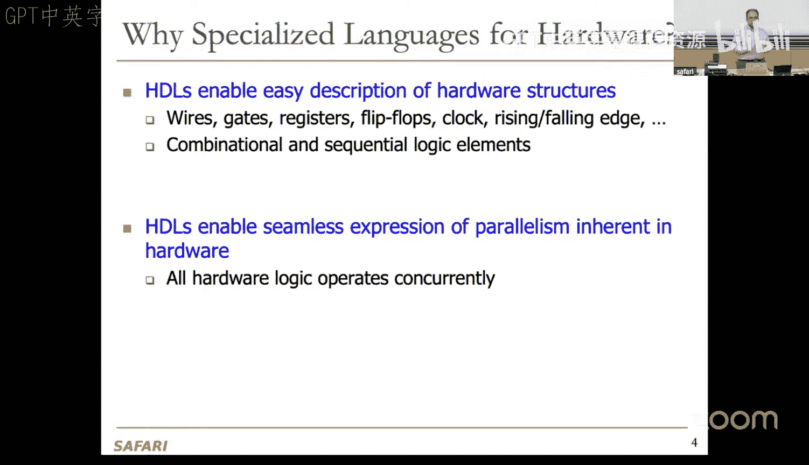
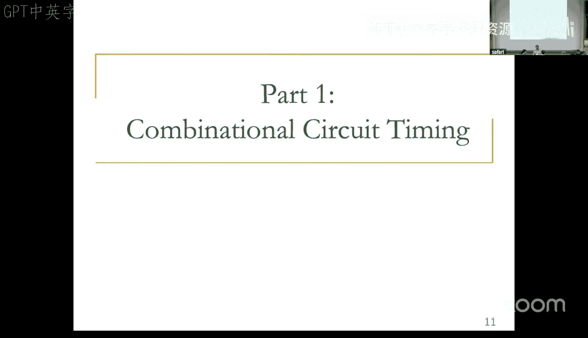

# 5：HDL、Verilog II、时序与验证


## 概述
在本节课中，我们将继续学习硬件描述语言（HDL）和 Verilog，并初步探讨数字电路设计中的时序与验证概念。我们将了解如何用 Verilog 描述时序逻辑，并理解确保电路正确工作的时序约束的重要性。

---




## 硬件描述语言回顾

上一节我们介绍了硬件描述语言的基本概念。本节中，我们来看看其核心设计原则。

硬件描述语言（HDL）使我们能够轻松描述硬件结构。硬件中包含导线、门电路、触发器、时钟等众多组件，以及上升沿/下降沿等时序规范。硬件还具有高度并发性，使用通用软件语言描述这些特性并不容易，因此人们开发了专门的硬件描述语言。

### 关键设计原则：层次化与设计方法学

我们讨论了系统设计中的关键原则：需要构建层次结构。

我们探讨了**自顶向下**的设计方法学：从一个顶层模块开始，将其分解为必要的子模块，子模块可以进一步分解为叶单元或其他子模块。叶单元是无法再分割的电路组件，可以是逻辑门或原始单元库中的元素。

我们也讨论了**自底向上**的设计方法学：从叶单元开始，构建更大的模块，最终组合成顶层模块。在实际设计中，我们通常结合这两种方法：构思时采用自顶向下的方法，而实现时则遵循自底向上的方法。

这种层次化方法对测试和验证至关重要。在组合成更高级模块之前，必须确保每个子模块都经过验证。否则，错误会累积，使得在高层调试变得极其困难。

### Verilog 模块定义

我们学习了如何在 Verilog 中定义模块：需要指定模块名、端口方向（输入/输出）以及端口名，然后描述模块的功能。

以下是模块定义的示例，包含三个输入 A、B、C 和一个输出 Y：
```verilog
module example_module (input A, input B, input C, output Y)
```
我们也可以使用向量来表示多位信号，例如 `[31:0] A` 表示一个 32 位值。我们通常使用 `[高位:低位]` 的格式，而不是 `[低位:高位]`。后者通常用于定义数组。

---

## Verilog 语法进阶

上一节回顾了模块定义，本节中我们来看看 Verilog 中一些重要的语法操作。

### 位操作

以下是 Verilog 中常用的位操作：

*   **位切片**：允许赋值总线的一部分。
    ```verilog
    short_bus = long_bus[2:5]; // 将 long_bus 的第 2 到第 5 位赋值给 short_bus
    ```
*   **拼接**：将多个信号连接成一个更大的信号。
    ```verilog
    y = {a2, a1, a0, a0}; // 将四个 1 位信号拼接成一个 4 位信号 y
    ```
*   **复制**：重复一个信号多次。
    ```verilog
    x = {4{a0}}; // 等价于 x = {a0, a0, a0, a0}
    ```

### 基本语法要点

*   Verilog 对大小写敏感。
*   名称不能以数字开头。
*   空格通常被忽略。
*   注释使用 `//`（单行）或 `/* ... */`（多行）。

### 两种主要的 HDL 实现风格

Verilog（以及其他 HDL）主要有两种实现风格：

1.  **结构式描述**：也称为门级描述。模块体包含电路的门级描述或模块实例化，描述模块之间如何互连。每个模块可以包含其他模块的实例以及它们之间的连接，从而形成一个层次化的模块结构。
2.  **行为式描述**：模块体包含电路的功能描述，使用逻辑和数学运算符。这种方式抽象层次更高，通常更易于编写，但可能带来一些开销和优化问题。

实际设计中通常结合使用这两种风格。

---

## 结构式 Verilog 示例

理解了设计风格后，我们来看一个结构式描述的具体例子。

假设我们有一个顶层模块 `top`，它包含两个子模块 `small` 的实例。连接关系如下图所示（此处为文字描述：输入 A 和 C 进入第一个 `small` 实例，其输出 `n1` 与输入 B 一起进入第二个 `small` 实例，最终产生输出 Y）。

以下是相应的 Verilog 代码：
```verilog
module top (input A, B, C, output Y)
    wire n1; // 定义内部连线

    // 实例化第一个 small 模块，命名为 first_inst
    small first_inst (.A(A), .B(C), .Y(n1));
    // 实例化第二个 small 模块，命名为 second_inst
    small second_inst (.A(n1), .B(B), .Y(Y));
endmodule

// 定义 small 模块（功能暂未定义）
module small (input A, B, output Y)
    // ... 模块功能描述 ...
endmodule
```
代码说明：
*   使用 `wire` 关键字声明内部连线 `n1`。
*   实例化模块时，使用 `模块名 实例名 (.端口名(连接线), ...)` 的语法进行显式端口映射，这提高了代码的可读性和可维护性。
*   也可以使用按顺序的端口映射（如 `small first_inst (A, C, n1)`），但不如显式映射可靠。

### 内置门级原语

Verilog 内置了基本逻辑门作为原语，如 `and`, `or`, `not`, `nand`, `nor`, `xor`, `xnor`。它们可以像模块一样被实例化，但无需额外定义。需要注意的是，这些原语的第一个端口是输出，其余是输入。

例如，一个 2 选 1 多路选择器的结构式描述如下：
```verilog
module mux2to1 (input D0, D1, S, output Y)
    wire NS, Y1, Y2;

    not (NS, S);          // 非门：输出 NS，输入 S
    and (Y1, D0, NS);     // 与门：输出 Y1，输入 D0, NS
    and (Y2, D1, S);      // 与门：输出 Y2，输入 D1, S
    or (Y, Y1, Y2);       // 或门：输出 Y，输入 Y1, Y2
endmodule
```

---

## 行为式 Verilog 示例

上一节展示了结构式描述，本节中我们来看看更抽象的行为式描述。

行为式描述使用 `assign` 语句和逻辑运算符来描述功能。例如：
```verilog
module example (input A, B, C, output Y)
    assign Y = (~A & ~B & ~C) | (A & B) | (B & C);
endmodule
```
综合工具会将此行为描述转换为具体的门级电路。现代综合工具会进行逻辑优化，但为了减少单个门的输入数量（大扇入门难以实现），优化可能会增加电路的逻辑深度，而不仅仅是追求两级最小化。

### 运算符与条件赋值

Verilog 支持丰富的运算符：

*   **按位运算符**：`&` (与), `|` (或), `^` (异或), `~` (非)。
*   **归约运算符**：对向量的所有位进行操作，如 `&A` 表示 A 中所有位的与。
*   **条件赋值**：使用三元运算符 `? :`，可以简洁地描述多路选择器。
    ```verilog
    assign Y = S ? D1 : D0; // 2选1 MUX
    // 4选1 MUX
    assign Y = S1 ? (S0 ? D3 : D2) : (S0 ? D1 : D0);
    ```
*   **`if-else` 语句**：必须在 `always` 块中使用，也可以用于描述组合逻辑。

### 数字表示

Verilog 中数字的表示格式为：`<位宽>'<基数><数值>`。
*   位宽：指定数字的二进制位数。
*   基数：`b` 或 `B`（二进制），`h` 或 `H`（十六进制），`d` 或 `D`（十进制），`o` 或 `O`（八进制）。
*   数值：对应的数字。可以用 `_` 提高可读性。`x` 表示未知值，`z` 表示高阻态。

示例：
```verilog
4'b1001     // 4位二进制数 1001
8'b0000_1001 // 8位二进制数 00001001，前导零自动补全
8'hF3       // 8位十六进制数 F3（即二进制 11110011）
```

### 三态缓冲器与线或逻辑

`z` 值用于表示高阻态，常用于三态缓冲器，以实现共享总线。例如，CPU 和内存通过三态门共享数据总线，同一时刻只能有一个驱动总线。

---

## HDL 代码的综合与仿真

编写完 HDL 代码后，主要进行两个步骤：

1.  **综合**：将 HDL 代码转换为门级网表，进而映射到晶体管并生成物理版图。现代综合工具可以根据面积、时序等约束进行优化，但无法保证绝对最优。
2.  **仿真**：在不实际制造电路的情况下，通过软件模拟电路的行为，以验证其功能。这是极其重要的步骤，可以分层验证，确保每个模块正确后再进行集成。随着电路规模增大， exhaustive testing 变得不可能，需要智能地选择测试用例，这使得验证成为一项挑战。

**重要提示**：最常见的错误是将 HDL 视为普通程序，而非硬件描述。如果不清楚代码会综合成什么硬件，结果可能不如预期。应该在编写代码前，在纸上画出组合逻辑块、寄存器和状态机的草图及其连接关系。

---

## 编码风格与参数化模块

为了写出可维护的代码，应遵循良好的编码风格：

*   使用一致的命名规范。
*   向量定义推荐使用 `[MSB:LSB]` 格式。
*   每个文件只定义一个模块，并使文件名与模块名一致。
*   时刻记住 Verilog 描述的是硬件。

### 参数化模块

为了使代码可重用，可以使用参数来定义可变的位宽等。
```verilog
module mux #(parameter WIDTH = 8) (input [WIDTH-1:0] D0, D1, input S, output [WIDTH-1:0] Y)
    assign Y = S ? D1 : D0;
endmodule

// 实例化时指定参数
mux #(12) my_mux (.D0(d0_bus), .D1(d1_bus), .S(sel), .Y(out_bus));
```

### 时序建模

可以在 Verilog 中添加延时信息，但这**仅用于仿真**（如功能仿真和后综合时序仿真），不能被综合。
```verilog
assign #5 Z1 = ~A; // Z1 的变化比 A 晚 5 个时间单位
```

---

## 时序逻辑的 Verilog 描述

之前我们主要关注组合逻辑。本节中我们来看看如何用 Verilog 描述时序逻辑。

时序电路由组合逻辑和存储元件（如触发器）构成。描述时序逻辑需要新的结构，因为纯组合逻辑的 `assign` 语句无法表达记忆功能。

### `always` 块

`always` 块是描述时序逻辑的关键。其语法为：
```verilog
always @(sensitivity_list) begin
    // 语句
end
```
当敏感列表中的事件发生时，块内的语句被执行。

### D 触发器示例

一个简单的 D 触发器描述如下：
```verilog
module dff (input clk, input [3:0] D, output reg [3:0] Q)
    always @(posedge clk) begin
        Q <= D; // 在时钟上升沿，将 D 的值赋给 Q
    end
endmodule
```
*   `posedge clk` 表示对时钟 `clk` 的上升沿敏感。
*   `<=` 是非阻塞赋值符，常用于时序逻辑。
*   在 `always` 块中被赋值的信号必须声明为 `reg` 类型（但这不意味着它一定会被综合成寄存器）。

### 复位信号

触发器通常需要复位功能。
*   **异步复位**：复位信号独立于时钟，立即生效。
    ```verilog
    always @(posedge clk or negedge reset_n) begin
        if (!reset_n) Q <= 4'b0;
        else Q <= D;
    end
    ```
*   **同步复位**：复位信号仅在时钟边沿生效。
    ```verilog
    always @(posedge clk) begin
        if (!reset_n) Q <= 4'b0;
        else Q <= D;
    end
    ```

### 锁存器示例

D 锁存器在时钟有效电平期间透明。
```verilog
module dlatch (input clk, input D, output reg Q)
    always @(clk or D) begin // 对 clk 和 D 的变化都敏感
        if (clk) Q <= D; // 如果 clk 为高，输出跟随输入
        // 否则 Q 保持原值（隐含的记忆行为）
    end
endmodule
```

### `always` 块用于组合逻辑

`always` 块也可用于描述组合逻辑，但必须确保：
1.  敏感列表包含所有右侧涉及的信号（或使用 `always @(*)`）。
2.  在所有可能的条件分支下，输出信号都被赋值。
否则，可能会无意中综合出锁存器。

### 阻塞赋值与非阻塞赋值

*   **非阻塞赋值 (`<=`)**：块内所有赋值语句同时计算，在块结束时同时更新。这更符合硬件并行执行的特性，**推荐在时序逻辑 `always` 块中使用**。
*   **阻塞赋值 (`=`)**：语句按顺序执行，立即更新。类似于软件编程，**可用于描述组合逻辑**。

**重要规则**：
*   不要在多个 `always` 块或连续赋值语句中对同一个信号进行赋值。
*   不要混合使用 `reg` 和 `wire` 类型来驱动同一个信号。

---

## 有限状态机 (FSM) 的 Verilog 实现

用 Verilog 描述 FSM 非常清晰。一个 FSM 通常分为三部分：
1.  **状态寄存器**：时序部分，通常用 `always @(posedge clk)` 描述。
2.  **次态逻辑**：组合部分，根据当前状态和输入计算下一个状态。
3.  **输出逻辑**：组合部分，根据当前状态（摩尔机）或当前状态和输入（米利机）产生输出。

### 三分频电路 FSM 示例

以下是一个将时钟频率除以 3 的 FSM 示例：
```verilog
module divide_by_3_fsm (input clk, reset_n, output reg Q)
    // 状态编码
    parameter S0 = 2'b00, S1 = 2'b01, S2 = 2'b10;
    reg [1:0] state, next_state;

    // 1. 状态寄存器
    always @(posedge clk or negedge reset_n) begin
        if (!reset_n) state <= S0;
        else state <= next_state;
    end

    // 2. 次态逻辑（组合）
    always @(*) begin
        case (state)
            S0: next_state = S1;
            S1: next_state = S2;
            S2: next_state = S0;
            default: next_state = S0; // 避免锁存器，确保安全
        endcase
    end

    // 3. 输出逻辑（摩尔型：仅依赖状态）
    always @(*) begin
        Q = (state == S0); // 仅在 S0 状态输出高电平
    end
endmodule
```

---

## 时序与验证导论

最后，我们简要引入数字电路设计中至关重要的主题：时序与验证。

### 设计权衡

数字设计需要在多个维度进行权衡：
*   **面积**：与芯片成本直接相关。
*   **速度与吞吐量**：高性能需求。
*   **功耗与能量**：对移动设备至关重要。
*   **设计时间**：时间就是市场，需要缩短上市时间。

### 时序的重要性

到目前为止，我们主要关注逻辑功能的正确性。但一个逻辑正确的设计，如果忽略时序特性，在实际硬件中可能无法工作。
*   **组合电路时序**：传播延时、污染延时、毛刺的产生与消除。
*   **时序电路时序**：建立时间、保持时间、时钟频率的确定。
*   电路能运行多快？如何让它更快？过快会导致什么问题？

这些问题的答案对于设计稳定可靠的数字系统至关重要。

### 验证

验证是确保设计符合规范的过程。随着电路规模增大， exhaustive testing 变得不可能，需要采用系统化的验证方法，如仿真、形式验证等，这是保证芯片功能正确的关键，也是设计流程中耗时最长的环节之一。

---

## 总结
本节课中我们一起学习了：
1.  Verilog 语言更高级的特性，包括位操作、参数化模块和编码风格。
2.  时序逻辑的 Verilog 描述方法，重点是 `always` 块、阻塞/非阻塞赋值以及复位策略。
3.  如何使用 Verilog 清晰地将有限状态机 (FSM) 分解为状态寄存器、次态逻辑和输出逻辑三部分进行实现。
4.  初步了解了数字电路设计中时序特性和验证的重要性，这是连接逻辑设计与物理实现的关键桥梁。



在下节课中，我们将深入探讨组合电路和时序电路的时序分析，以及相关的验证技术。