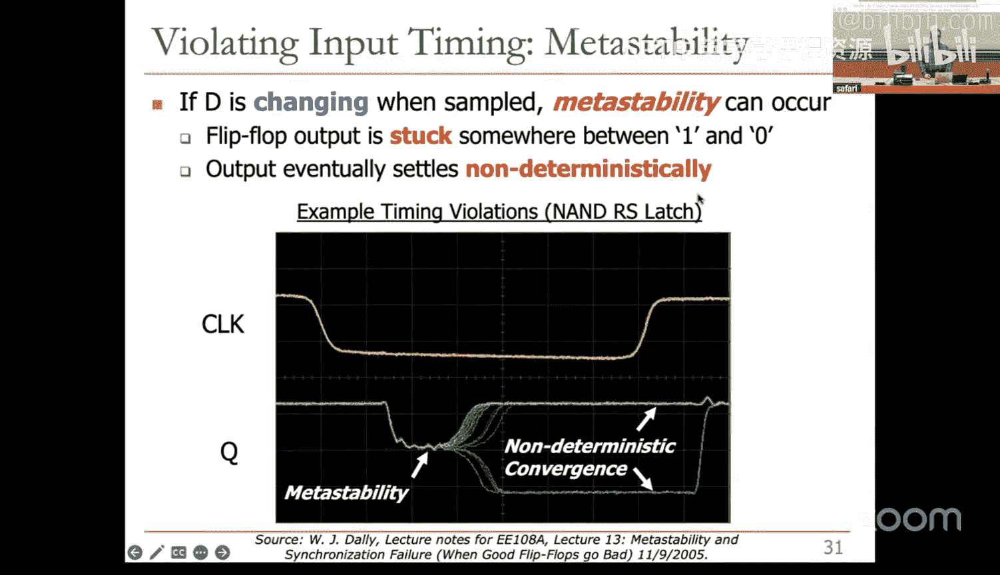
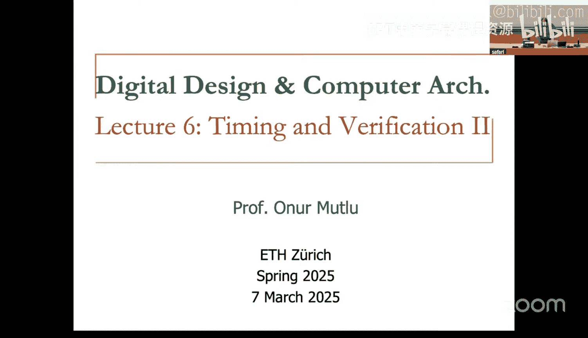

# 6：时序与验证 II (Spring 2025)


## 概述
在本节课中，我们将继续学习数字电路中的时序分析与验证。我们将深入探讨组合电路和时序电路的时序参数，理解如何确保电路在满足功能正确性的同时，也能满足严格的时序约束。此外，我们还将介绍电路验证的基本方法，包括如何编写测试平台来验证设计的逻辑功能。

---

## 组合电路时序

上一节我们介绍了逻辑功能，本节中我们来看看电路的时序特性，即电路的速度以及如何使其更快。

数字逻辑抽象非常方便，例如，我们假设输出能随输入立即改变。然而，现实并非如此，输出相对于输入存在延迟，因为晶体管切换需要有限的时间。

延迟从根本上是由电路中的电容和电阻引起的。任何影响这些物理量的因素都会改变延迟，例如：
*   不同的输入会导致不同的延迟。
*   环境变化（如温度或电源电压）会影响延迟。
*   电路老化也会增加延迟。

因此，设计者需要处理从输入到输出的一系列可能延迟。为了建立一个良好的简单抽象，我们定义了两个关键延迟参数：

*   **污染延迟 `t_cd`**：输出**开始**改变所需的时间。
*   **传播延迟 `t_pd`**：输出**完成**改变所需的时间。

在波形图中，交叉阴影线表示数值正在变化。

我们需要计算电路中的最长和最短延迟路径。最长路径（关键路径）决定了电路的最大延迟，而最短路径则与污染延迟相关。

以下是计算示例：
对于一个包含多个逻辑门的电路，其传播延迟是关键路径上所有门传播延迟之和。而其污染延迟则是最短路径上门污染延迟之和。

**核心概念公式**：
*   最长路径延迟 = Σ (路径上门单元的 `t_pd`)
*   最短路径延迟 = Σ (路径上门单元的 `t_cd`)

---

## 毛刺

毛刺是指一个输入转换导致输出发生多次转换的现象。这通常发生在驱动输出的路径有快慢之分时。

例如，考虑一个电路，其输入从 `(A,B,C) = (0,1,1)` 变为 `(0,0,1)`。由于信号通过不同路径到达输出门的时间不同，输出可能会短暂地从1跳变为0，然后再变回1。

毛刺的持续时间大约为 `t_pd - t_cd`。

我们并不总是需要消除毛刺，因为：
*   修复毛刺通常会增加芯片面积、功耗和设计工作量。
*   无论是否有毛刺，电路最终都会收敛到正确的值。
*   是否处理毛刺由设计者根据具体应用决定。

然而，毛刺会导致不必要的动态功耗。在时序电路设计中，摩尔型状态机通常比米利型更能避免毛刺传播，因为其输出仅取决于当前状态，而不直接受输入变化影响。

---

## 时序电路时序

现在，我们来看看更复杂的时序电路时序。首先回顾一下D触发器的关键特性：它在时钟有效边沿对数据D进行采样。



为确保可靠采样，数据必须在采样时刻保持稳定。这引出了两个关键参数：

*   **建立时间 `t_setup`**：时钟边沿**之前**，数据必须保持稳定的时间。
*   **保持时间 `t_hold`**：时钟边沿**之后**，数据必须继续保持稳定的时间。

两者之和称为**孔径时间**，即数据必须稳定的总时间窗口。如果违反这些时间要求，触发器可能进入亚稳态，其输出会停留在不确定的中间电压值，最终非确定性地稳定到0或1。

与组合电路类似，触发器本身也有延迟：

*   **时钟到Q的污染延迟 `t_ccq`**：时钟边沿后，Q**最早开始**改变的时间。
*   **时钟到Q的传播延迟 `t_pcq`**：时钟边沿后，Q**最晚完成**改变并保持稳定的时间。

---

## 时序约束分析

在典型的同步时序系统中，多个触发器通过组合逻辑连接，并由同一时钟驱动。我们必须确保每个触发器输入端的时序要求得到满足。

这意味着一对触发器之间的组合逻辑延迟既不能太长，也不能太短。

**建立时间约束**：
为了防止建立时间违规，组合逻辑的传播延迟不能太长。这决定了时钟周期的最小值。

**核心概念公式**：
`T_clk >= t_pcq + t_pd_comb + t_setup`

其中，`t_pd_comb` 是组合逻辑的传播延迟。`t_pcq` 和 `t_setup` 被称为**时序开销**。如果建立时间违规，一个简单的解决方法是降低时钟频率（增大 `T_clk`），但这会牺牲性能。

**保持时间约束**：
为了防止保持时间违规，组合逻辑的污染延迟不能太短。

**核心概念公式**：
`t_ccq + t_cd_comb > t_hold`

注意，此约束与时钟周期无关。因此，如果发生保持时间违规，无法通过调整时钟频率来修复，通常需要**增加逻辑延迟**（例如插入缓冲器）来增加 `t_cd_comb`。

---

## 时钟偏移

实际情况更复杂：时钟信号到达芯片不同部分的时间存在差异，这称为**时钟偏移 `t_skew`**。

时钟偏移会影响时序约束：
*   如果时钟较早到达后续寄存器，会**加剧建立时间约束**。
*   如果时钟较晚到达后续寄存器，会**加剧保持时间约束**。

因此，在有时钟偏移的情况下，有效的建立时间和保持时间约束变为：

**核心概念公式**：
*   建立时间：`T_clk >= t_pcq + t_pd_comb + t_setup + t_skew`
*   保持时间：`t_ccq + t_cd_comb > t_hold + t_skew`

时钟偏移增加了时序开销，减少了每个周期可用于有效计算的时间。设计者必须通过智能的时钟网络设计来尽量减小 `t_skew`。

---

## 电路验证：功能验证

如何知道一个电路能正常工作？我们不仅需要验证功能正确性，还要验证其是否满足所有时序约束。

对于大型数字设计，测试是最耗时的阶段。我们通常采用分层验证策略：
1.  在高级别（如C或HDL）进行功能验证，速度快，易于获得高覆盖率。
2.  在低级别（电路级）进行时序、功耗等验证，并确保其与高级别模型功能等价。

功能验证的目标是检查设计的逻辑正确性，通常忽略时序。主要方法有逻辑仿真和形式验证。本课程主要使用逻辑仿真。

**测试平台** 是专门为测试设计而创建的模块。被测设计称为 **DUT**。
测试平台的主要组成部分包括：
1.  **测试向量生成**：为DUT提供输入激励。
2.  **响应检查**：检查DUT的输出是否正确。

测试平台使用HDL编写，但**不可综合**，仅用于仿真。

常见的测试平台类型有以下三种：

**1. 简单测试平台**
输入生成和输出检查均为手动。
*   **优点**：易于创建，适合测试少量特定用例。
*   **缺点**：难以扩展，输出需在仿真波形中手动检查，类似`printf`调试。

**2. 自检查测试平台**
输入生成手动，但输出检查自动（在代码中与预期值比较）。
*   **优点**：仿真器会在出错时自动打印，无需手动检查波形。
*   **缺点**：仍难以扩展到海量测试用例，手动编写预期值容易出错。

可以结合测试向量文件来改进，从文件读取输入和预期输出。

**3. 自动测试平台**
输入生成和输出检查均自动进行。通常采用**黄金模型**策略。
*   **黄金模型**：代表理想电路行为的参考模型，通常更简单、更易于验证。
*   **工作原理**：将相同的输入同时施加给DUT和黄金模型，并自动比较两者的输出。

**核心概念代码**（比较逻辑）：
```verilog
if (dut_out !== golden_out) begin
    $display("Error at time %t: input=%b, dut_out=%b, golden_out=%b", $time, input_vector, dut_out, golden_out);
    error_count = error_count + 1;
end
```
*   **优点**：检查完全自动化，高度可扩展，职责分离清晰。
*   **缺点**：创建正确且完备的黄金模型和测试向量可能非常困难。

需要注意的是，对复杂电路进行穷举测试（如32位加法器的2^64种输入）是不可行的。因此，我们需要通过选择重要测试用例、随机测试等方法，在测试覆盖率和时间之间取得平衡。

---

## 电路验证：时序验证

时序验证确保设计满足建立时间和保持时间等约束。

**方法**：
1.  **高层次仿真**：在HDL中使用 `#延迟` 语句为门电路、触发器等添加时序标注，进行后综合仿真。
2.  **电路级仿真**：使用SPICE等工具进行晶体管级仿真，精度更高，但速度慢。

对于FPGA或ASIC设计流程，通常使用EDA工具（如Vivado、Synopsys工具链）来自动进行时序分析和优化。

**流程**：
1.  设计者提供时序约束（如时钟频率、时钟偏移）。
2.  综合、布局布线工具尽力满足这些约束。
3.  工具生成**时序报告**，指出关键路径、最大工作频率以及任何时序违规。

如果工具无法满足时序约束，设计者可能需要：
*   尝试不同的综合或布局布线选项。
*   手动优化报告中的违规路径（如简化逻辑、拆分长组合路径、插入流水线寄存器）。
*   对于保持时间违规，增加逻辑延迟。

---

## 设计原则

为了满足时序约束并获得高性能，应遵循以下设计原则：

*   **关键路径设计**：最小化最大逻辑延迟，以最大化性能。
*   **平衡设计**：平衡系统中不同部分之间的逻辑延迟，避免个别路径过长限制整体时钟频率。
*   **优化常见情况**：针对最可能发生的场景进行优化，同时确保非常见情况不会破坏设计。

---

## 总结
本节课中我们一起学习了：
1.  **组合电路时序**：污染延迟和传播延迟的定义与计算，以及毛刺的成因和处理。
2.  **时序电路时序**：建立时间、保持时间的概念，以及如何推导和满足建立时间、保持时间约束。
3.  **时钟偏移**：时钟偏移对时序约束的影响。
4.  **功能验证**：测试平台的作用、类型（简单、自检查、自动），以及黄金模型策略。
5.  **时序验证**：基本方法、EDA工具的作用以及修复时序违规的常用技术。
6.  **设计原则**：关键路径优化、平衡设计和优化常见情况。



时序分析和验证是确保数字电路在实际硬件中正确可靠工作的关键环节。从下周开始，我们将进入计算机架构部分，学习微处理器的基础知识。