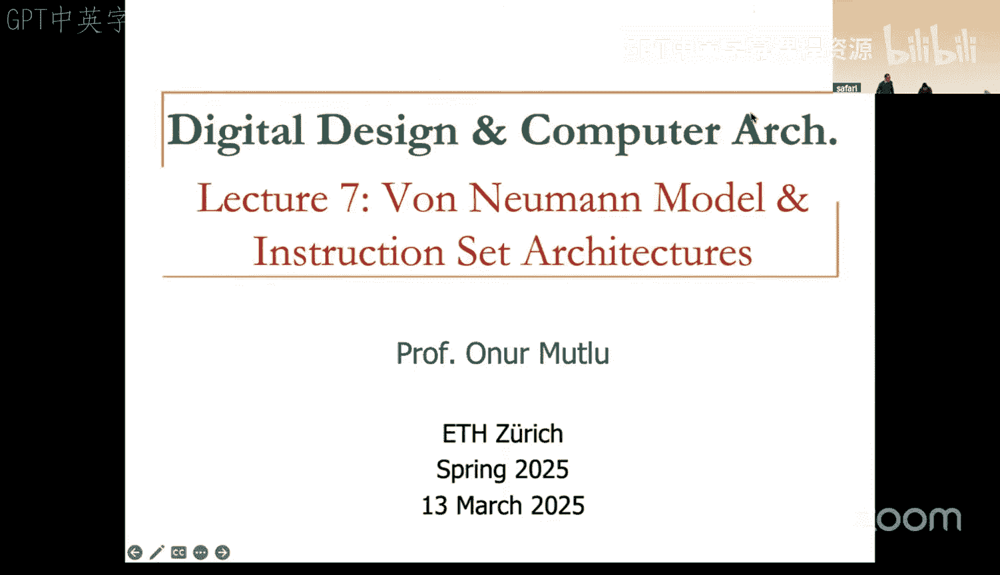
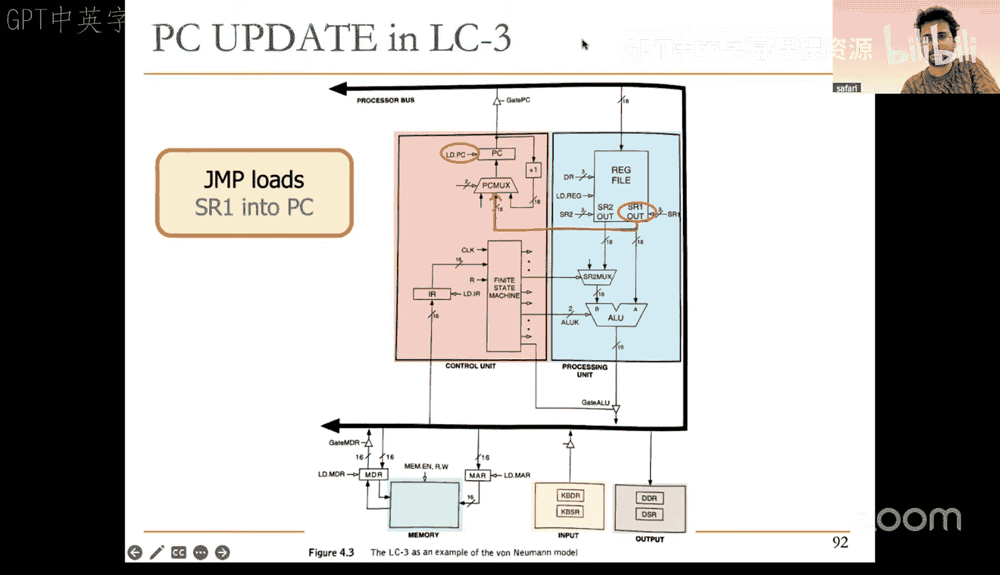

# 7：冯·诺依曼模型与指令集架构 (Spring 2025)

## 概述
在本节课中，我们将学习计算机架构的基础部分。我们将从数字设计层面向上提升，讨论**冯·诺依曼计算模型**，然后深入探讨**指令集架构**。我们将以LC3和MIPS这两种架构为例，理解计算机如何执行程序，并为后续学习微架构打下基础。

---

## 冯·诺依曼模型 🧠

上一节我们完成了数字设计部分的学习。本节中，我们将介绍一个更高层次的抽象——冯·诺依曼模型。这是现代通用计算机的基础模型。

冯·诺依曼模型由约翰·冯·诺依曼及其同事在1946年提出，包含五个核心组件：

1.  **内存**：存储程序和数据。
2.  **处理单元**：执行计算。
3.  **输入单元**：从外部接收信息。
4.  **输出单元**：向外部发送信息。
5.  **控制单元**：协调所有操作，控制指令执行顺序。

所有现代通用计算机都基于此模型。它有两个关键特性：
*   **存储程序**：指令和数据存储在同一个内存中，没有物理区分。
*   **顺序指令处理**：指令通常按顺序一条接一条地执行。

---

## 内存详解 💾

我们已经了解了冯·诺依曼模型的整体框架。现在，让我们深入看看其中的第一个核心组件：内存。

内存存储着计算机运行所需的一切——程序指令和待处理的数据。在硬件层面，它就是一个由存储单元组成的阵列。

以下是关于内存的几个核心概念：

*   **地址空间**：内存中可唯一寻址的位置总数。例如，LC3的地址空间是 `2^16`，MIPS是 `2^32`。
*   **可寻址性**：每个地址对应的存储单元能存储多少位数据。常见的是**字节可寻址**（每个地址存8位）或**字可寻址**（每个地址存一个字，如16位或32位）。
*   **字节序**：当内存是字节可寻址，但数据以多字节（如字）形式存储时，字节的排列顺序就很重要。
    *   **大端序**：最高有效字节存储在最低地址。
    *   **小端序**：最低有效字节存储在最低地址。

内存访问通过两个基本操作完成：
*   **读/加载**：从指定内存地址获取数据。
*   **写/存储**：将数据写入指定内存地址。

在硬件实现上，通常使用**内存地址寄存器** 和**内存数据寄存器** 来辅助完成这些操作。

---

## 处理单元与寄存器 ⚙️

上一节我们介绍了内存，它是数据的仓库。本节我们来看看处理单元，它是数据的加工厂。

处理单元的核心是**算术逻辑单元**，它执行如加法、逻辑与等运算。ALU处理的数据单位通常是**字**。

然而，如果ALU每次运算都要从较慢的主内存中读取数据，效率会极低。因此，处理单元内部包含一个**快速临时存储区**，即**寄存器文件**。

寄存器是少量、高速的存储单元，紧邻ALU，用于存放频繁使用的临时数据和中间计算结果。对寄存器的访问速度远快于对主内存的访问。

以下是两种架构的寄存器示例：
*   **LC3**：有8个通用寄存器（R0-R7），每个寄存器16位。
*   **MIPS**：有32个通用寄存器（R0-R31），每个寄存器32位。

指令可以直接对寄存器中的数据进行操作，这是编写高效程序的关键。

---

## 控制单元与指令处理周期 🎛️

我们已经了解了内存（存储）和处理单元（计算）。现在，我们需要一个“指挥家”来协调它们，这就是控制单元。

控制单元负责按顺序执行程序中的每一条指令。它通过两个关键寄存器来跟踪执行状态：
*   **程序计数器**：存放下一条要执行的指令的内存地址。
*   **指令寄存器**：存放当前正在执行的指令的编码。

指令的执行并非一蹴而就，而是分为一个循环的多个阶段，即**指令处理周期**。一个典型的周期包括以下阶段（并非所有指令都需全部阶段）：

1.  **取指**：根据PC从内存获取指令，放入IR，并更新PC。
2.  **译码**：解析IR中的指令，确定要执行的操作和所需的操作数。
3.  **地址计算**：（如果需要访问内存）计算要访问的内存地址。
4.  **取操作数**：从寄存器或内存中获取指令所需的源数据。
5.  **执行**：在ALU中执行指定的运算。
6.  **写回**：将执行结果写回寄存器或内存。

完成一个周期后，控制单元便启动下一个指令的取指阶段，如此循环。

---

## 指令集架构基础 📜

前面我们介绍了计算机执行指令的模型和流程。现在，我们来具体看看指令本身——即指令集架构。

**指令**是计算机能理解和执行的最小工作单元。**指令集架构** 是计算机支持的所有指令的集合，它定义了软件与硬件之间的契约。

一条指令通常由两部分组成：
*   **操作码**：指定指令要执行的操作（如加、减、加载）。
*   **操作数**：指定操作的对象（如寄存器编号、内存地址、立即数）。

指令在计算机中以**机器码**（二进制串）的形式存储。为了方便人类读写，我们使用**汇编语言**，它是机器码的助记符表示。

例如，一条LC3的加法指令在汇编中可能写作 `ADD R0, R1, R2`，其机器码编码可能是 `0001 000 001 000 010`（二进制），其中 `0001` 是ADD的操作码，后续位分别指定了目标寄存器R0和源寄存器R1、R2。

---

## 指令类型与编码示例 🔤

ISA中的指令主要分为三大类，我们将逐一了解。

### 1. 运算指令
这类指令指示ALU执行算术或逻辑运算，操作数通常来自寄存器。
*   **LC3示例**：`ADD R0, R1, R2` （R0 ← R1 + R2）
    *   操作码 `0001`，后跟寄存器编号字段。
*   **MIPS示例**：`add $s0, $s1, $s2`
    *   属于R型指令格式，操作码为 `000000`，具体操作由功能码字段指定。

### 2. 数据传送指令
这类指令用于在寄存器和内存之间移动数据。
*   **加载示例**：从内存读取数据到寄存器。
    *   **LC3**：`LDR R3, R0, #2` （计算地址 R0+2，从该内存地址加载数据到R3）
    *   **MIPS**：`lw $s3, 8($s0)` （计算地址 $s0+8，从该内存地址加载一个字到$s3。注意在字节可寻址的MIPS中，偏移量8对应第2个字）
*   **存储指令**与之相反，将寄存器数据写入内存。

### 3. 控制流指令
这类指令改变程序正常的顺序执行流程，通过修改**程序计数器**的值来实现跳转。
*   **无条件跳转**：
    *   **LC3**：`JMP R2` （PC ← R2）
    *   **MIPS**：`j target` （使用J型指令格式，跳转到目标地址）
*   **条件分支**：（后续会详细讨论）根据条件判断是否跳转，如 `BEQ`（相等则分支）。

不同的指令类型有不同的**指令格式**（编码方式），例如MIPS有R型（寄存器）、I型（立即数）、J型（跳转）等格式，以适应不同的操作数需求。

---

## 总结
本节课我们一起学习了计算机架构的核心基础。

我们首先探讨了**冯·诺依曼模型**，理解了其五大组件（内存、处理单元、输入、输出、控制单元）和两个关键特性（存储程序、顺序执行）。

接着，我们深入剖析了**内存**的寻址方式与字节序，**处理单元**中ALU与高速**寄存器**的作用，以及**控制单元**如何通过指令处理周期来协调工作。

最后，我们学习了**指令集架构**的概念，了解了指令的组成（操作码与操作数），并认识了三种主要的指令类型：**运算指令**、**数据传送指令**和**控制流指令**，还通过LC3和MIPS的例子看到了指令的具体编码格式。

这些知识构成了我们理解计算机如何运行程序的基石。在接下来的课程中，我们将以此为基础，学习如何用汇编语言编程，并最终探索如何在微架构层面实现这些ISA。