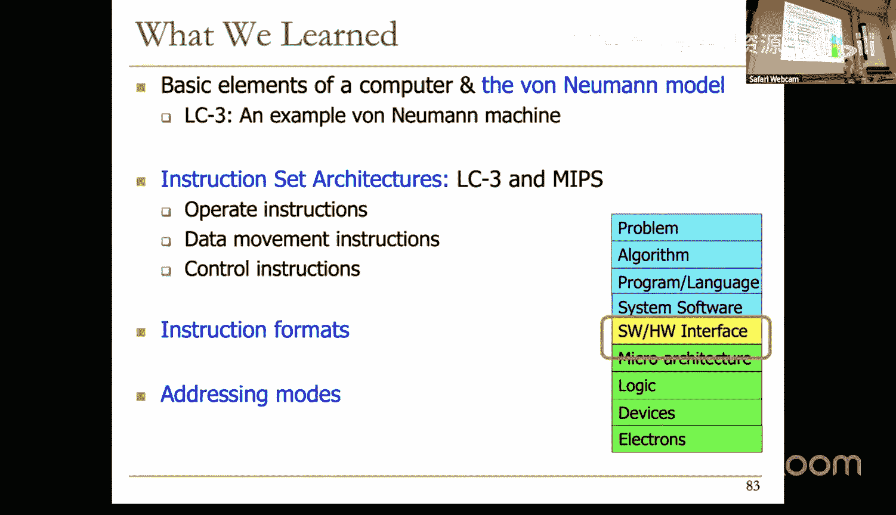
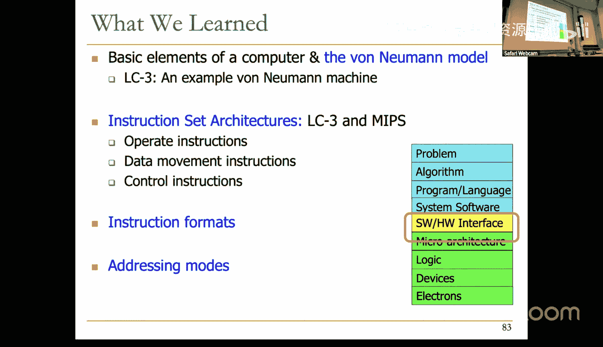
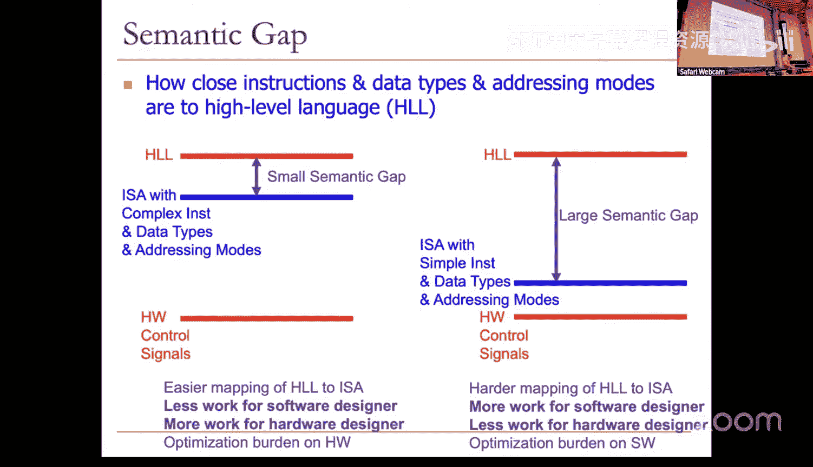

# 8：指令集架构 II (Spring 2025) 🧠


在本节课中，我们将继续深入学习指令集架构。我们将回顾指令处理周期，并详细探讨操作指令、数据移动指令和控制流指令。我们还将讨论数据寻址模式、数据类型以及指令集设计中的关键权衡。

---

## 指令处理周期回顾

上一节我们介绍了冯·诺依曼模型和指令处理的基本概念。本节中，我们来看看指令执行的具体周期。

指令执行遵循一个固定的处理周期，包含多个阶段：

1.  **取指**：从内存中读取下一条指令。
2.  **译码**：解析指令，确定其操作类型和操作数。
3.  **计算地址**：对于需要访问内存的指令，计算有效地址。
4.  **取操作数**：从寄存器或内存中获取操作数。
5.  **执行**：在ALU中执行指定的操作。
6.  **存储结果**：将结果写回寄存器或内存。

完成一个指令后，程序计数器更新，指向下一条指令，循环重新开始。这种顺序执行是冯·诺依曼机器的核心特征。

在取指阶段，从内存中读取的值被解释为**指令**。而在取操作数阶段，从内存中读取的值则被解释为**数据**。内存地址可能相同，但解释方式取决于处理周期所处的阶段。

---

## 无条件跳转指令

控制流指令可以改变指令执行的顺序。我们首先来看无条件跳转指令。

无条件跳转指令（如LC-3中的`JMP`）会直接将程序计数器的值更新为指定寄存器中的值。其语义可以表示为：
```
PC ← BaseRegister
```
在微架构层面，这需要一条从寄存器文件到程序计数器的数据通路。

---

## 指令集架构详解

指令集架构是软件程序与硬件微架构之间的接口。它具体规定了以下内容：

*   **内存组织**：地址空间和可寻址性（如按字或按字节寻址）。
*   **寄存器**：通用寄存器的数量（如LC-3有8个，MIPS有32个）。
*   **指令集**：由操作码、数据类型和寻址模式定义。
*   **指令格式**：指令的长度、格式和编码。

### 操作码

操作码的数量是ISA设计中的一个关键权衡。

*   **复杂指令集**：包含大量、功能强大的指令（如矩阵乘法）。这简化了编译器和编程，但增加了硬件设计的复杂性。
*   **精简指令集**：只包含少量、基本的指令（如加、与、移位）。这简化了硬件设计，但可能增加软件（编译器或程序员）的负担，需要将高级操作分解为多条基本指令。

LC-3和MIPS主要包含三类指令：**操作指令**、**数据移动指令**和**控制流指令**。

### 数据类型

数据类型定义了如何解释寄存器或内存中的数据。

*   **LC-3**：主要支持**二进制补码整数**。负数`-x`定义为`~x + 1`。
*   **MIPS**：支持二进制补码整数、无符号整数和浮点数。

支持更多数据类型可以更好地将高级语言结构映射到硬件，减少代码大小，但同样会增加硬件的复杂性。这个概念与**语义鸿沟**相关：指令和数据类型越接近高级语言，语义鸿沟越小。

### 寻址模式

寻址模式指定了操作数所在的位置。以下是常见的寻址模式：

*   **立即数寻址**：操作数直接编码在指令中。
*   **寄存器寻址**：操作数在通用寄存器中。
*   **PC相对寻址**：操作数地址是`PC + 偏移量`。
*   **间接寻址**：指令中的地址指向一个内存单元，该单元的内容才是最终的操作数地址。
*   **基址+偏移寻址**：操作数地址是`基址寄存器 + 偏移量`。

更多的寻址模式可以更灵活地表达数据访问（如数组索引、指针追踪），减少指令条数，但同样会使硬件数据通路和控制逻辑变得更复杂。

---

## 操作指令详解

操作指令对数据进行算术或逻辑运算。

### 寄存器模式操作

例如，LC-3中的`ADD`指令格式为：
```
ADD DR, SR1, SR2
```
其操作是`DR ← SR1 + SR2`。硬件上，这需要从寄存器文件读取两个源操作数，经ALU计算后，写回目的寄存器。

### 立即数模式操作

许多指令支持立即数版本。例如，LC-3中通过指令中的一位“导向位”来区分是使用第二个寄存器还是立即数。
```
ADD DR, SR1, #5 ; 使用立即数5
```
硬件需要一个多路选择器，根据导向位选择来自寄存器文件或来自指令经符号扩展后的立即数作为ALU的第二个输入。

MIPS有专门的I型指令格式用于立即数操作，如`ADDI`。

### 减法操作的实现

减法指令展示了指令复杂度的权衡。

*   **MIPS**：有专门的`SUB`指令，一条指令完成减法。
*   **LC-3**：没有`SUB`指令。减法需要通过取反加一来实现，即 `A - B = A + (~B + 1)`。这需要多条指令（`NOT`, `ADD`）。

复杂指令（如`SUB`）编码密度高，程序更紧凑。简单指令（`NOT`, `ADD`）硬件控制逻辑更简单，但程序需要更多指令。

---

## 数据移动指令详解

数据移动指令在寄存器和内存之间传输数据。

### PC相对寻址

例如LC-3中的`LD`（加载）指令：
```
LD DR, Label ; DR ← M[PC + offset]
```
地址计算为`PC + 符号扩展的9位偏移量`。这种模式只能访问指令附近有限范围（-256到+255）的内存地址。

### 间接寻址

例如LC-3中的`LDI`（间接加载）指令：
```
LDI DR, Label ; DR ← M[M[PC + offset]]
```
它进行两次内存访问：首先计算地址A1=`PC+offset`，读取M[A1]得到地址A2，然后读取M[A2]得到最终数据。这对于指针追踪非常有用，但硬件上需要多个状态来执行两次内存读操作。

### 基址+偏移寻址

例如LC-3中的`LDR`和MIPS中的`LW`：
```
LDR DR, BaseR, #6 ; DR ← M[BaseR + 6]
LW  Rt, 8(Rs)     ; Rt ← M[Rs + 8] (MIPS，字节寻址，偏移量需乘以4)
```
这种模式可以访问任意内存地址，只要将基地址加载到寄存器中即可。它是MIPS中主要的数据内存寻址模式。

### 加载有效地址

例如LC-3中的`LEA`指令：
```
LEA DR, Label ; DR ← PC + offset
```
它不访问内存，只是将计算出的地址（PC相对）直接加载到寄存器中，常用于初始化指针。

MIPS中使用`LUI`（加载高位立即数）和`ORI`指令组合来加载32位常数到寄存器。

---

## 控制流指令详解

控制流指令用于实现条件分支、循环和函数调用。

### 条件码

LC-3和x86等ISA使用**条件码**。每次写入通用寄存器时，会根据写入值的正负零设置三个1位的条件码寄存器（N, Z, P）。

条件分支指令（如`BRz`）检查特定的条件码：
```
BRz Label ; if (Z == 1) PC ← PC + offset
```
硬件上，需要根据指令中要测试的条件码位和当前条件码寄存器的值，生成一个“分支跳转”信号，以决定是否更新PC为目标地址。

### 寄存器比较分支

MIPS采用不同的方式。它使用像`BEQ`这样的指令，直接比较两个寄存器的值：
```
BEQ Rs, Rt, Label ; if (Rs == Rt) PC ← PC + offset
```
这需要硬件直接比较两个寄存器的值。虽然单条指令功能更强，但硬件上需要额外的比较电路。

实现相同的“如果寄存器相等则分支”功能，在LC-3中需要先用`NOT`和`ADD`指令计算差值并设置条件码，再用`BRz`指令，共需4条指令。这再次体现了复杂指令与简单指令之间的权衡。

---

## 总结

本节课我们一起深入探讨了指令集架构的多个核心方面。

我们回顾了指令处理周期，并详细学习了三类主要指令：**操作指令**（包括立即数模式）、**数据移动指令**（涵盖PC相对、间接、基址+偏移等多种寻址模式）以及**控制流指令**（包括条件码和寄存器比较两种分支实现方式）。




我们重点讨论了ISA设计中的关键权衡：**操作码的复杂度**、**支持的数据类型**和**寻址模式的数量**。这些选择直接影响**语义鸿沟**的大小，进而决定了硬件复杂度和软件复杂度之间的平衡。复杂指令集（CISC）倾向于更接近软件，简化编译但硬件复杂；精简指令集（RISC）倾向于更接近硬件，简化硬件设计但可能增加软件负担。






理解这些基本概念和权衡，是学习计算机架构中硬件-软件接口的关键。