# 9：ISA与微架构（Spring 2025）


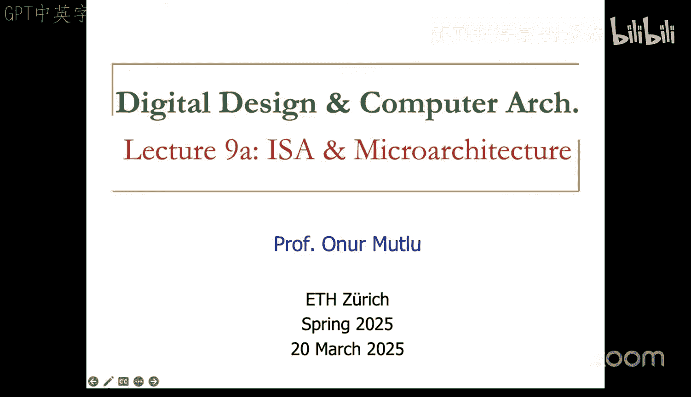


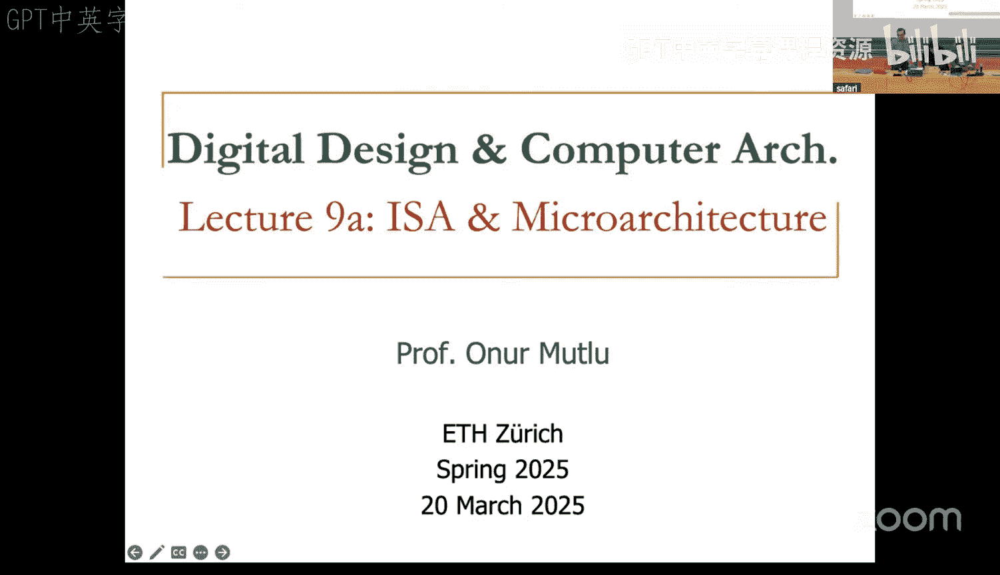


## 概述
在本节课中，我们将学习指令集架构与微架构的核心概念、它们之间的区别与联系，以及计算机设计中的关键权衡。我们将探讨冯·诺依曼模型、数据流执行模型，并开始了解如何从硬件层面实现指令集。

---

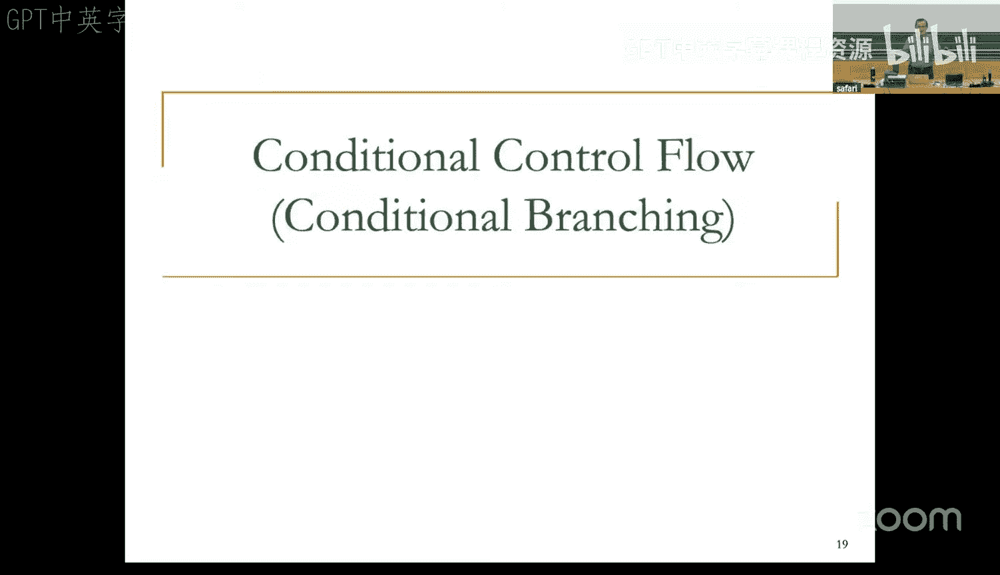


## ISA与微架构：核心概念与权衡

上一节我们介绍了指令集架构的基本元素。本节中，我们来看看ISA与微架构之间的根本区别。

指令集架构是软件与硬件之间约定的接口。它规定了程序员可见的状态和行为，包括指令、数据类型、寻址模式和寄存器等。ISA是抽象的规范，定义了计算机应如何运行程序。

微架构是ISA的具体硬件实现。它描述了底层硬件如何组织数据流、控制逻辑以及物理设计，以执行ISA定义的指令。微架构对软件程序员是不可见的。

### 关键权衡：指令复杂度
ISA设计中的一个核心权衡是**指令的复杂度**。

*   **复杂指令集**：指令功能强大，每条指令能完成较多工作（如矩阵乘法）。这缩小了高级语言与硬件之间的**语义鸿沟**，软件编程和编译更简单，但将优化负担转移给了硬件设计师。
*   **简单指令集**：指令是接近硬件门电路的低级原语（如与、或、非操作）。这扩大了语义鸿沟，软件（编译器）需要做更多工作将高级操作映射到简单指令，但为硬件设计提供了极大的优化空间。

**公式化描述**：语义鸿沟 `G = L_high - L_ISA`，其中 `L_high` 代表高级语言抽象级别，`L_ISA` 代表ISA抽象级别。`G` 越小，软件负担越轻，硬件负担越重。

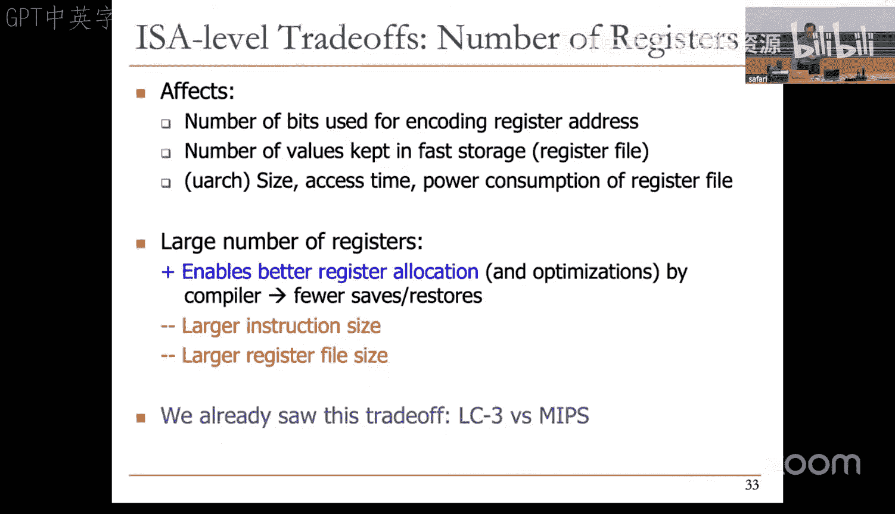

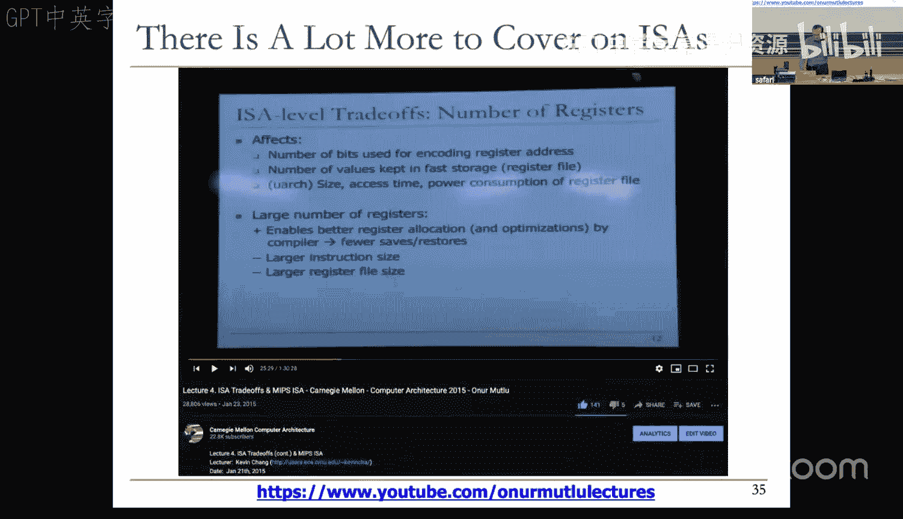

### 间接层级原则
任何计算机科学或软件工程中的问题，都可以通过增加一个**间接层级**来解决。

这个原则允许我们改变设计中的权衡。例如，可以设计一个硬件，它对外暴露一个复杂的ISA（如x86），但在内部，通过一个**硬件辅助的软件翻译器**，将复杂指令翻译成一套更简单的、内部的“微操作”来执行。这样，既保持了软件兼容性，又简化了硬件设计。Apple Silicon（M系列芯片）运行x86程序、以及历史上Transmeta公司的Crusoe处理器都采用了类似思想。

**代码示例（概念性）**：
```c
// 对外ISA：复杂指令
x86_instruction_t complex_instr = fetch_instruction();
// 内部翻译层
micro_op_t simple_ops[] = translate(complex_instr);
// 微架构执行简单微操作
for (op in simple_ops) {
    execute_micro_op(op);
}
```

---

## 超越冯·诺依曼：数据流执行模型

上一节我们固守了冯·诺依曼的**顺序控制流**模型。本节中，我们来看看一个完全不同的计算模型：**数据流模型**。

冯·诺依曼模型的核心是**顺序指令处理**和**程序计数器**。指令按控制流顺序（顺序或分支）获取和执行。

数据流模型则**没有程序计数器**。指令的执行顺序由**数据可用性**决定。一条指令在其所有输入操作数的数据都就绪（即收到“令牌”）时，才会被“触发”执行。执行结果作为新的数据令牌，传递给等待它的后续指令。

### 数据流示例：计算阶乘
考虑一个计算 `n!` 的数据流程序图。它由多个节点（指令）和弧（数据依赖）组成：
1.  **比较节点**：接收 `n`，判断 `n > 0`，输出布尔令牌。
2.  **条件分支节点**：根据布尔令牌，决定将 `n` 路由到乘法路径或终止路径。
3.  **乘法节点**：在 `n > 0` 时，计算 `accumulator * n`。
4.  **递减节点**：在 `n > 0` 时，计算 `n - 1` 并反馈回比较节点。
5.  当 `n <= 0` 时，布尔令牌为假，当前累积结果被路由到输出。

这个模型**天然支持并行**。当多个指令的输入数据同时就绪时，它们可以同时触发执行。

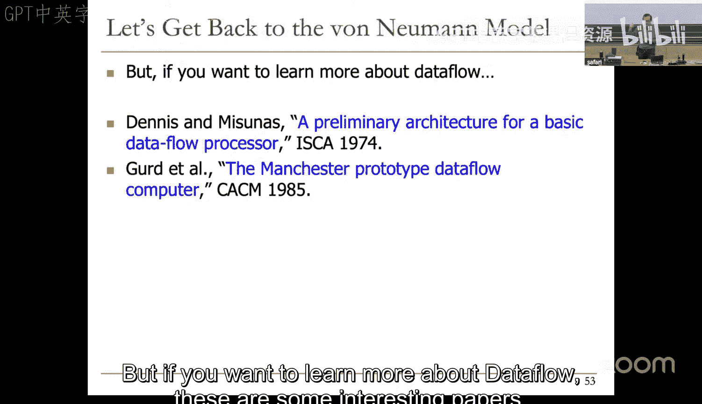

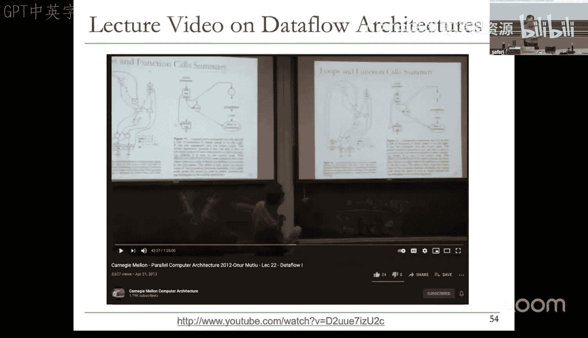

### 控制流 vs. 数据流：微架构视角
在ISA层面，现代通用计算机几乎都采用冯·诺依曼模型（控制流），因为它对程序员更友好。

然而，在**微架构层面**，几乎所有高性能处理器都**内部采用了类似数据流的执行方式**。它们通过**乱序执行**等机制，动态分析指令间的数据依赖关系，只要操作数就绪就立刻执行，而不严格遵循程序顺序，从而极大提升了性能。这再次体现了间接层级原则：ISA承诺顺序执行，微架构内部采用数据流并行。

---

## 微架构设计入门

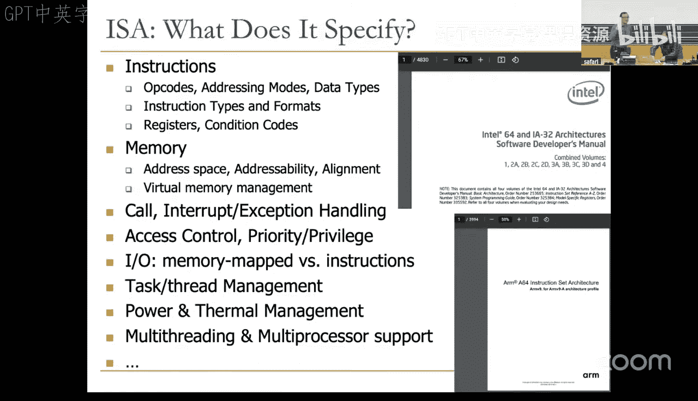

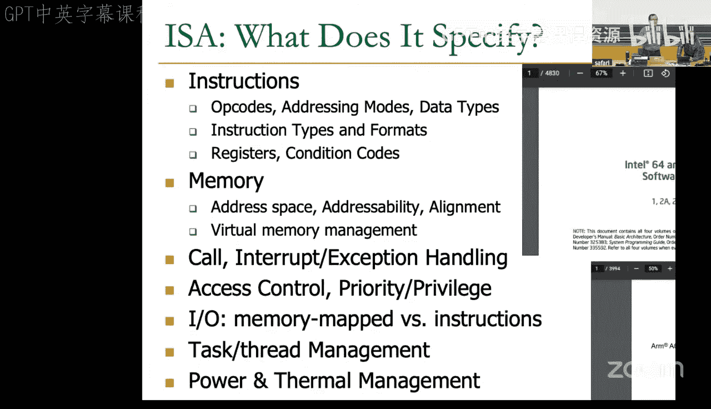


上一节我们比较了不同的执行模型。本节中，我们开始探讨如何具体实现一个ISA，即微架构设计。

微架构是在特定设计约束和目标下，对ISA的实现。设计约束可能包括性能、功耗、成本、上市时间等。

### ISA vs. 微架构：属性划分
以下是判断一个属性属于ISA还是微架构的简单方法：

*   **属于ISA**：程序员必须知道才能正确编写/调试程序的属性。
    *   指令操作码（如 `ADD`）
    *   通用寄存器数量（如32个）
    *   程序计数器（PC）
    *   内存寻址模式

*   **属于微架构**：不影响程序正确性，仅影响性能、功耗等的硬件实现细节。
    *   ALU中使用的加法器类型（如超前进位加法器）
    *   执行乘法指令所需的时钟周期数
    *   寄存器文件的读写端口数量
    *   是否采用流水线技术

### 单周期与多周期微架构
我们考虑两种最基本的实现方式：

1.  **单周期微架构**：
    *   **思想**：每条指令在一个时钟周期内完成。从读取程序员状态（AS）到生成新状态（AS‘）的组合逻辑路径必须在单个周期内走完。
    *   **关键路径公式**：`T_cycle >= T_clk-q + T_combinational_max + T_setup`
    *   **缺点**：时钟周期长度由**最复杂指令**（如乘法、除法）的组合逻辑延迟决定。为了执行一条慢指令，所有指令（包括简单的加法）都必须等待同样长的周期，效率极低。

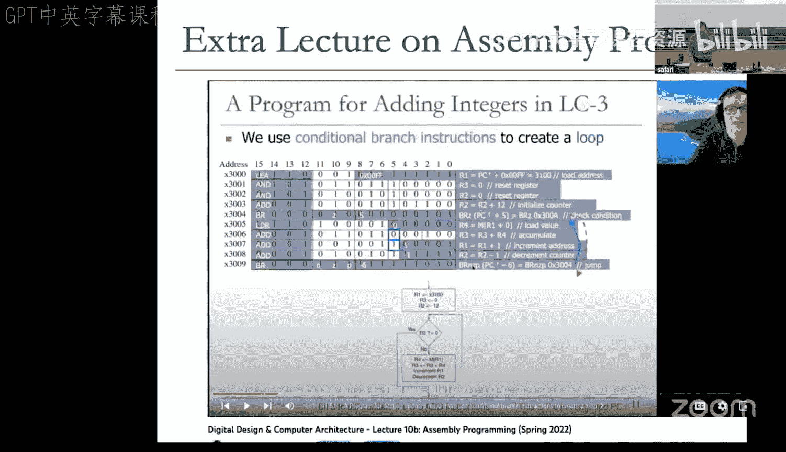


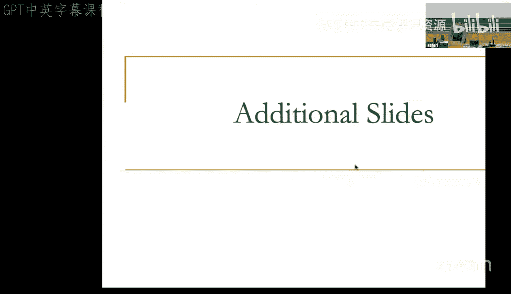


2.  **多周期微架构**：
    *   **思想**：将一条指令的执行分解为多个步骤（阶段），每个步骤在一个较短的时钟周期内完成。例如，经典的5阶段流水线：取指、译码、执行、访存、写回。
    *   **优点**：时钟周期由**最慢的阶段**决定，而不是最慢的指令。简单指令可以快速通过某些阶段，复杂指令则占用多个周期。硬件利用率更高。
    *   **核心原则**：在指令执行过程中，可以更新内部的、程序员不可见的微架构状态，但**程序员可见的架构状态（寄存器、内存）只在指令执行结束时才被更新**，以遵守ISA语义。

**代码示例（多周期概念）**：
```verilog
// 状态寄存器
reg [31:0] PC, RegFile[31:0];
// 内部临时寄存器（微架构状态）
reg [31:0] IR, ALUOut, MDR;

always @(posedge clk) begin
    case (state)
        FETCH:  begin IR <= Memory[PC]; state <= DECODE; end
        DECODE: begin A <= RegFile[rs]; B <= RegFile[rt]; state <= EXECUTE; end
        EXECUTE: begin ALUOut <= A + B; state <= (is_load_store) ? MEM : WB; end
        MEM:    begin MDR <= Memory[ALUOut]; state <= WB; end
        WB:     begin RegFile[rd] <= (is_load) ? MDR : ALUOut; PC <= PC + 4; state <= FETCH; end
    endcase
end
```

---

## 总结
本节课中我们一起学习了：
1.  **ISA与微架构**的根本区别：ISA是软件可见的契约，微架构是实现契约的硬件细节。
2.  关键的**设计权衡**，特别是指令复杂度带来的语义鸿沟问题，以及通过**间接层级**（如硬件翻译）来改变权衡。
3.  **数据流执行模型**作为一种替代冯·诺依曼顺序模型的计算范式，它基于数据可用性触发指令，具有天然并行性，并且是现代高性能处理器微架构（乱序执行）的内部指导思想。
4.  微架构设计的起点：**单周期**与**多周期**实现的基本思想及其优缺点。多周期设计通过将指令执行分阶段，避免了慢指令拖累所有指令，是更实用高效的设计起点。

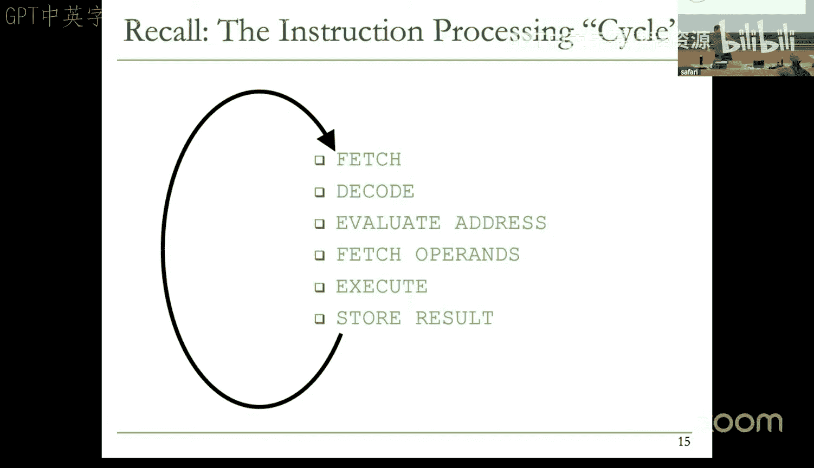

在接下来的课程中，我们将深入多周期微架构的设计，并逐步向流水线、乱序执行等更先进的微架构技术迈进。