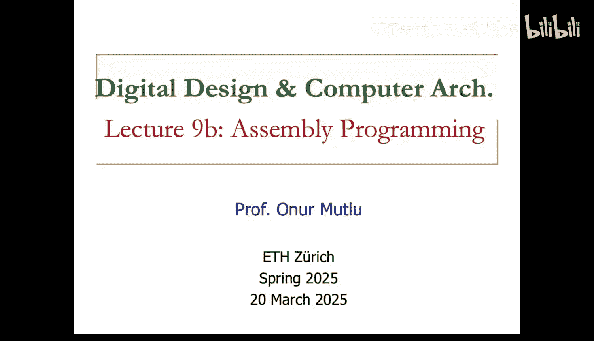
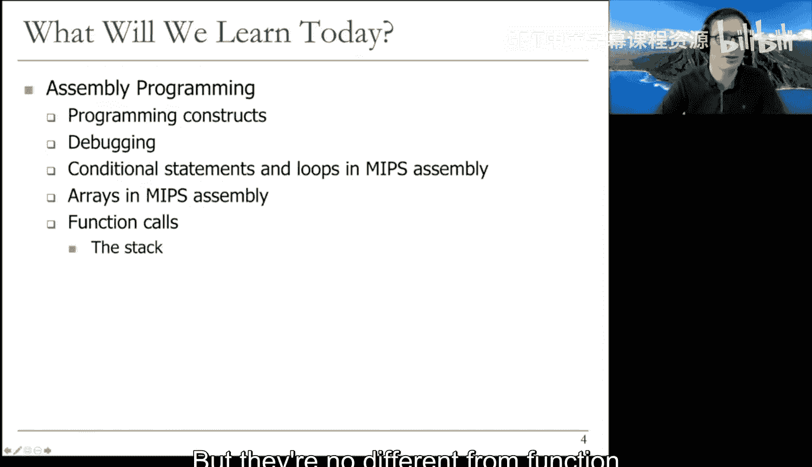
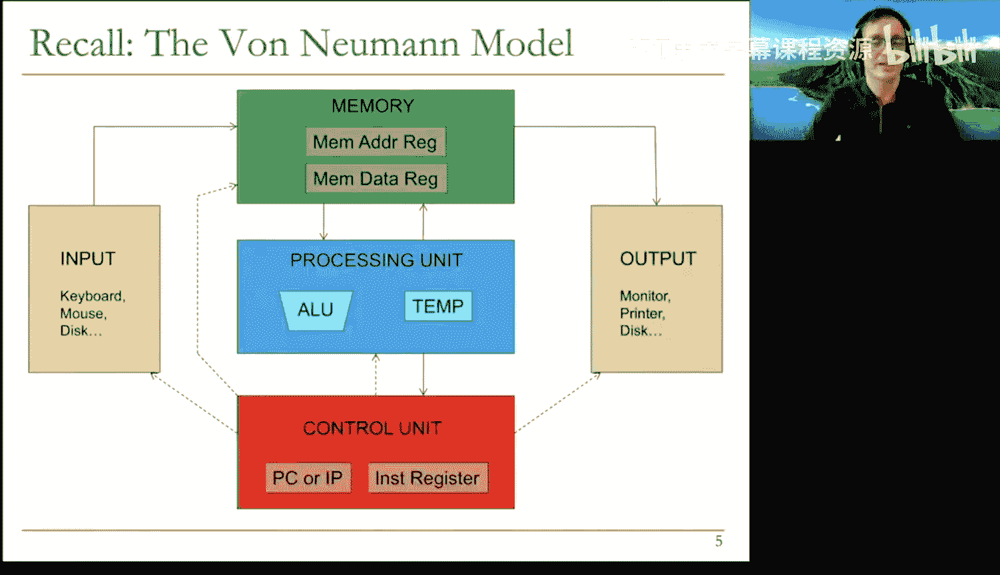
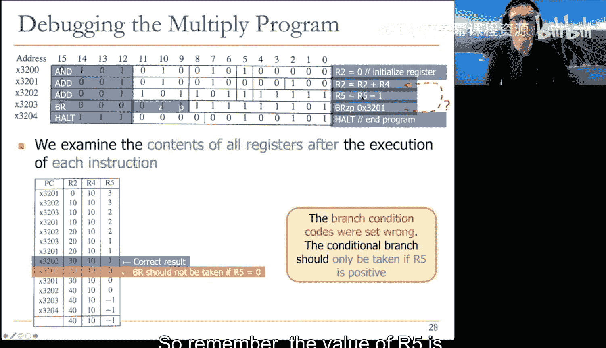
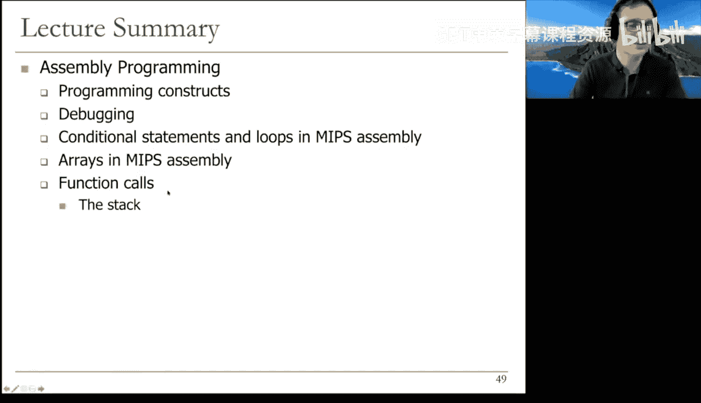
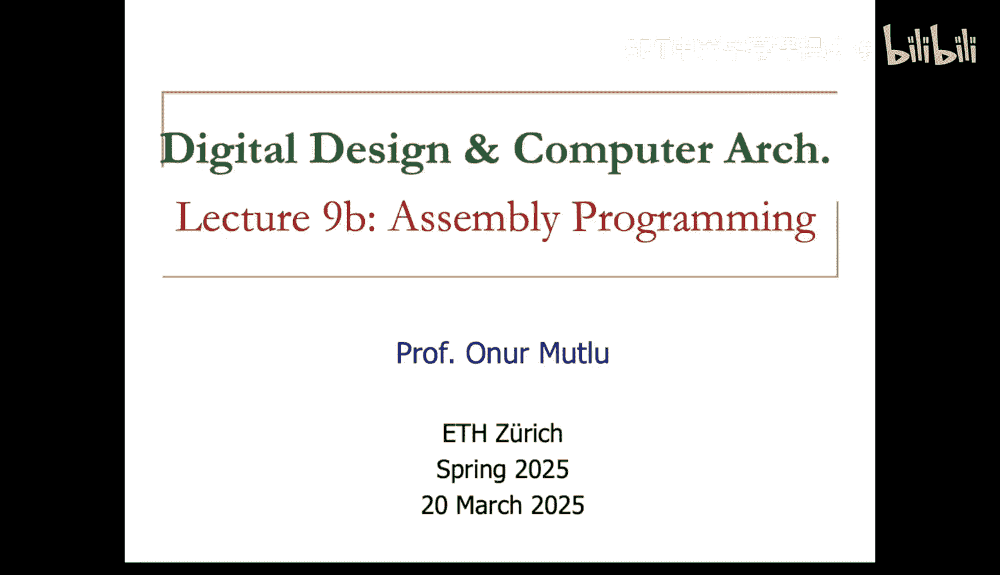

# 9b：汇编语言编程







在本节课中，我们将学习汇编语言编程的基础知识。我们将探讨如何使用LC3和MIPS汇编语言来实现基本的编程结构，如条件语句、循环和函数调用。课程将涵盖从算法流程图到实际机器指令的转换过程，并介绍调试程序的基本方法。

## 从算法到汇编指令

上一节我们介绍了计算机的基本架构和指令执行周期。本节中，我们来看看如何将一个具体的算法转化为可执行的汇编程序。

我们以一个简单的任务为例：将存储在内存地址 `0x3100` 到 `0x310B` 的12个整数相加。解决此类问题的第一步是将问题转化为算法。

以下是该算法的流程图，它已经是一个相当底层的描述，因为我们即将用汇编语言编程：


如图所示，我们甚至预先分配了寄存器：
*   **R1** 存储第一个整数的起始地址 (`0x3100`)。
*   **R2** 存储剩余待加整数的数量。
*   **R3** 存储累加的最终结果。

算法流程如下：
1.  **初始化**：设置起始地址、计数器（R2=12）和累加器（R3=0）。
2.  **条件检查**：检查 R2 是否等于 0（即是否还有整数要加）。
3.  **循环体**：如果 R2 不等于 0，则：
    *   根据 R1 中的地址加载一个整数到临时寄存器。
    *   将该整数值累加到 R3。
    *   将地址指针 R1 加 1，指向下一个整数。
    *   将计数器 R2 减 1。
4.  **循环**：无条件跳转回步骤2的条件检查处。
5.  **结束**：当 R2 等于 0 时，跳出循环，程序结束（例如，将结果输出到屏幕）。

## 翻译为 LC3 汇编程序

下一步是将流程图中的每一步翻译成目标指令集架构（ISA）中的具体指令。对于LC3，程序如下：


程序解释：
*   `LEA R1, #-7` 和 `LDW R1, R1, #0` 共同作用，将地址 `0x3100` 加载到 R1。
*   `AND R3, R3, #0` 和 `AND R2, R2, #0` 后跟 `ADD R2, R2, #12` 用于初始化 R3（累加器）和 R2（计数器）。
*   `BRz #4` 是条件分支指令，检查 R2 是否为零（Z标志）。如果为零，则跳过后续4条指令，直接到 `HALT`，结束循环。
*   循环体内，`LDB R0, R1, #0` 从 R1 指向的地址加载一个字节到 R0。
*   `ADD R3, R3, R0` 进行累加。
*   `ADD R1, R1, #1` 递增地址指针。
*   `ADD R2, R2, #-1` 递减计数器。
*   `BRnzp #-6` 是无条件分支指令，跳回 `BRz` 指令处，开始下一次循环检查。

程序的关键在于正确使用条件分支来实现循环控制。你需要确保分支跳转到正确的位置（这里是循环的入口检查点，而非循环体中间）。

## 编程的基本结构

现在，让我们提高抽象层次，讨论编程本身。编程的核心是将任务分解为更小的子任务，并用编程结构来代表这些子任务。

有三种基本的编程结构：
1.  **顺序结构**：子任务一个接一个顺序执行。
2.  **条件结构**：根据某个条件的真假，选择执行两个子任务中的一个（或不执行）。这用于实现 `if-else` 或 `switch-case` 语句。
3.  **迭代结构**：只要某个条件为真，就重复执行一个子任务。这用于实现循环，如 `for`、`while` 循环。



我们来看一个使用了所有三种结构的示例程序：统计一个文本文件中某个特定字符出现的次数。

程序概要：
*   **顺序结构**：初始化计数器、指针等。
*   **迭代结构**：循环读取文件中的每个字符，直到遇到表示文件结束的哨兵字符（EOT）。
*   **条件结构**：在循环内，检查读取的字符是否与目标字符匹配，如果匹配则增加计数器。

程序还会使用 **TRAP 指令** 与操作系统交互，例如从键盘获取输入（TRAP x23）或将结果输出到显示器（TRAP x21）。TRAP 指令的操作码是 `1111`，其后的陷阱向量（Trap Vector）指定了请求的操作系统服务类型。

## 调试汇编程序

调试是编程中不可或缺的一环，对于汇编语言尤其重要。调试是发现和修正程序中错误的过程，通常涉及跟踪指令执行序列和检查每条指令的结果。

有效的调试策略包括：
*   **模块化检查**：将程序分成模块，分别检查每个模块的结果。
*   **交互式调试操作**：
    *   **设置/检查寄存器和内存值**：在程序执行前或中断后，查看或修改状态。
    *   **单步执行**：一次执行一条指令，观察每条指令的影响。
    *   **设置断点**：在特定指令处暂停执行，以便检查此时的状态。
    *   **运行至暂停**：执行程序直到遇到 `HALT` 指令或断点。

考虑一个LC3中的乘法程序示例（因为LC3没有乘法指令）。假设一个程序意图计算 R4 * R5，初始值 R4=10，R5=3，但错误地输出了40。通过单步执行或设置断点，并记录每条指令执行后的寄存器状态，我们可以发现错误：循环的边界条件检查有误，导致多执行了一次迭代。正确的分支条件应该是检查 R5 是否为正（`BRp`），而不是检查是否为零（`BRz`）。此外，程序也未处理 R5 初始值为 0 的边界情况。

一个好的测试应涵盖各种边界情况（即程序员可能忽略的特殊值）。

## MIPS 汇编中的条件语句和循环

现在，我们快速了解MIPS汇编中如何实现条件语句和循环，这在后续实验中会用到。其原理与LC3类似，但语法不同。

**实现 `if` 语句**：
高级代码：`if (i == j) f = g + h;`
MIPS汇编的一种实现方式是使用 `bne`（Branch if Not Equal）指令来跳过 `if` 块：
```assembly
    bne $s3, $s4, L1   # 如果 i != j，跳转到 L1 标签
    add $s0, $s1, $s2 # f = g + h (if 块)
L1: ...
```

**实现 `if-else` 语句**：
需要结合条件分支和无条件跳转。条件分支跳过 `if` 块，执行 `else` 块；`if` 块末尾的无条件跳转则用于跳过 `else` 块。
```assembly
    bne $s3, $s4, Else  # 如果 i != j，跳转到 Else
    add $s0, $s1, $s2   # if 块: f = g + h
    j Exit              # 跳过 else 块
Else:
    sub $s0, $s0, $s3   # else 块: f = f - i
Exit: ...
```

**实现 `while` 循环**：
结构类似于LC3：在循环开始处检查条件，条件分支用于退出循环，循环体末尾的无条件分支用于跳回条件检查处。
```assembly
Loop:
    beq $s0, $t0, Exit  # 检查循环条件，不满足则退出
    ...                 # 循环体
    j Loop              # 跳回循环开始
Exit: ...
```
**实现 `for` 循环**：与 `while` 循环在本质上非常相似。

MIPS 还提供了 `slt`（Set Less Than）这样的指令，可以将比较结果（真/假）直接设置到通用寄存器中，而不是条件码寄存器，这为实现条件判断提供了另一种灵活的方式。

## 数组访问与函数调用

**数组访问**：
在MIPS中访问数组元素，需要先将数组基地址加载到一个寄存器中。由于MIPS指令中立即数位宽限制，加载32位地址通常需要两条指令：`lui`（Load Upper Immediate）和 `ori`（Or Immediate）。之后，通过基地址加偏移（偏移量 = 索引 * 每个元素占用的字节数）来计算元素地址，并使用 `lw`（Load Word）或 `sw`（Store Word）指令进行存取。

**函数调用**：
函数（或过程）是代码复用和模块化的关键。调用函数的程序称为**调用者**，被调用的函数称为**被调用者**。

为了使函数调用能正确、协作地工作，架构定义了调用约定：
*   **跳转与链接**：MIPS使用 `jal`（Jump and Link）指令调用函数。该指令不仅跳转到目标函数，还将下一条指令的地址（返回地址）保存在专用寄存器 `$ra` 中。
*   **参数传递**：前几个参数通常通过寄存器传递（例如MIPS的 `$a0` - `$a3`）。
*   **返回值**：返回值通常放在指定寄存器中（例如MIPS的 `$v0`）。
*   **返回**：被调用函数执行完毕后，使用 `jr $ra`（Jump Register）指令跳回调用者。

**栈的使用**：
当函数调用嵌套时，或者被调用函数需要使用调用者可能正在使用的寄存器时，就需要用**栈**来保存和恢复现场。栈是一种后进先出的内存区域。
*   **调用者保存**：如果调用者希望在函数调用后某些寄存器的值保持不变，它需要在调用前将这些值压入栈中，调用后再恢复。
*   **被调用者保存**：根据约定，某些寄存器（如MIPS的 `$s0` - `$s7`）是被调用者必须保存和恢复的。如果被调用者要使用它们，必须先将旧值压栈，并在返回前弹栈恢复。寄存器 `$ra` 也属于此类，如果一个函数内部还要调用其他函数，它必须保存自己的 `$ra`。
*   **栈指针**：寄存器 `$sp` 作为栈指针，指向栈顶。

通过遵守这些关于寄存器用途和栈管理的约定，不同程序员编写的代码才能无缝协作。

## 总结





本节课中我们一起学习了汇编语言编程的核心概念。我们从将一个简单的求和算法转化为LC3汇编程序开始，理解了顺序、条件和迭代这三种基本编程结构在汇编层面的实现。我们探讨了调试汇编程序的重要性和基本方法。接着，我们对比学习了在MIPS汇编中实现条件语句和循环的语法。最后，我们介绍了函数调用的机制，包括调用约定、`jal`/`jr` 指令的作用，以及栈在保存寄存器现场、支持嵌套函数调用中的关键角色。这些知识是理解高级语言如何与底层硬件交互，以及进行系统级编程的基础。