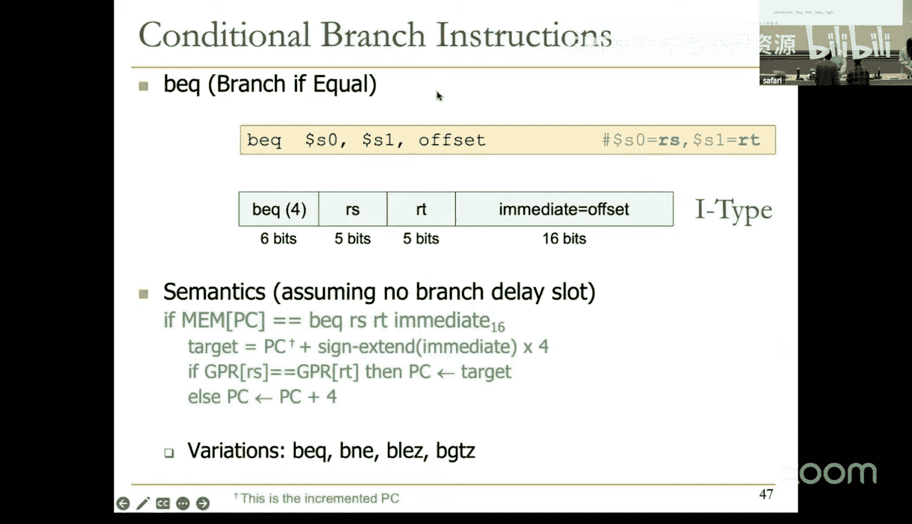
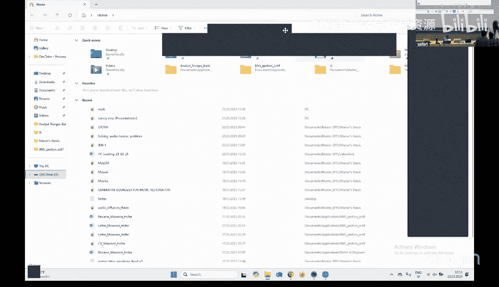

# 10：微架构基础与设计 II (Spring 2025) 🧠

在本节课中，我们将继续学习微架构设计。我们将从单周期处理器开始，逐步构建其数据通路和控制逻辑，分析其性能瓶颈，并最终引出多周期处理器的核心思想。

---

## 概述

上一节我们介绍了微架构的基本概念。本节中，我们将深入探讨如何为一个简化的MIPS ISA子集设计和实现一个单周期处理器。我们将构建其数据通路，设计控制逻辑，并分析其性能。最后，我们将看到单周期设计的局限性，并引入多周期处理器的概念。

---

## 单周期处理器设计原理

单周期处理器意味着每条指令在一个时钟周期内完成执行。指令执行本身仅使用组合逻辑实现，没有中间的程序状态更新。

*   **架构状态**：在每个时钟周期开始时，我们有一个架构状态（程序计数器PC、通用寄存器、内存）。
*   **指令处理**：在一个时钟周期内，我们处理一条指令。
*   **状态更新**：在周期结束时，我们得到更新后的架构状态，作为下一条指令的输入。

这种设计的时钟周期时间由处理给定指令的关键路径决定。**最慢的指令决定了整个处理器的时钟周期时间**，这通常会导致很长的周期时间，效率低下。

---

## 微架构的组成部分

一个指令处理引擎由两个主要部分组成：**数据通路**和**控制逻辑**。

### 数据通路

数据通路是处理数据信号的硬件元素集合。它包括：
*   **功能单元**：对数据进行操作的硬件，例如算术逻辑单元。
*   **存储单元**：存储数据的硬件，如寄存器文件、内存。
*   **连接元件**：实现数据流动的硬件，如导线、多路选择器、解码器、三态缓冲器等。

### 控制逻辑

控制逻辑生成控制信号，告诉数据通路中的各个元件如何处理数据。例如，控制信号决定多路选择器选择哪个输入，或者是否向寄存器文件写入数据。

在单周期机器中，控制信号的生成和数据路径的操作发生在同一个时钟周期内。而在多周期机器中，我们可以在当前周期生成下一个周期所需的控制信号，从而实现一定程度的并行。

---

## 构建单周期数据通路

我们将为MIPS ISA的一个子集逐步构建数据通路。以下是构建过程中使用的基本模块符号：

*   **程序计数器**：一个带写使能的寄存器，在每个时钟上升沿捕获输入值。
*   **寄存器文件**：一个多端口存储结构。在我们的设计中，它可以同时读取两个寄存器（使用5位寄存器ID），并写入一个寄存器（32位数据）。写操作在时钟上升沿发生，由`RegWrite`信号控制。
*   **内存**：我们假设有两种内存。
    *   **指令内存**：单端口，只读。输入32位地址，输出32位指令。
    *   **数据内存**：单端口，可读写。由`MemRead`和`MemWrite`信号控制。输入地址和待写入的数据（32位），输出读取的数据（32位）。

我们假设这些存储单元都是“单周期”的，即在一个时钟周期内完成读写操作。这是一个简化且不现实的假设，但有助于我们理解基本设计。

### 指令处理步骤

一条指令的处理通常包含以下步骤，在单周期机中这些步骤在一个周期内顺序（或并行）完成：
1.  **取指**：从程序计数器指向的地址获取指令。
2.  **译码**：解析指令，确定操作类型和所需的寄存器。
3.  **读寄存器**：从寄存器文件中读取操作数。
4.  **执行**：在ALU中执行操作（如算术运算、计算内存地址）。
5.  **访存**：如果需要，访问数据内存（加载或存储）。
6.  **写回**：将结果写回寄存器文件。

### 为R型算术/逻辑指令构建数据通路

以`add`指令为例：`add $rd, $rs, $rt`
*   **语义**：将寄存器`$rs`和`$rt`的值相加，结果存入寄存器`$rd`。同时，程序计数器PC增加4。
*   **数据通路需求**：
    1.  PC作为地址输入指令内存，取出指令。
    2.  指令中的`rs`和`rt`字段（位25-21和20-16）作为地址输入寄存器文件，读取两个操作数。
    3.  两个操作数送入ALU，ALU功能设置为“加”。
    4.  ALU结果送入寄存器文件的写数据端口。
    5.  指令中的`rd`字段（位15-11）作为目的寄存器地址。
    6.  设置`RegWrite = 1`，在周期结束时将结果写入`$rd`。
    7.  通过一个独立的加法器计算`PC + 4`，并在周期结束时更新PC。

### 为I型算术/逻辑指令扩展数据通路

以`addi`指令为例：`addi $rt, $rs, immediate`
*   **语义**：将寄存器`$rs`的值与符号扩展后的立即数相加，结果存入寄存器`$rt`。
*   **数据通路修改**：
    *   需要一个**符号扩展单元**，将16位立即数扩展为32位。
    *   需要一个**多路选择器**，在ALU的第二个输入端口选择来自寄存器文件的数据（用于R型）或符号扩展后的立即数（用于I型）。由控制信号`ALUSrc`控制。
    *   目的寄存器地址来自指令的`rt`字段（位20-16），而非`rd`字段。因此需要另一个**多路选择器**来选择目的寄存器地址是来自`rt`字段（I型）还是`rd`字段（R型）。由控制信号`RegDst`控制。

### 为加载/存储指令扩展数据通路

以`lw`（加载字）和`sw`（存储字）指令为例。
*   **地址计算**：`lw $rt, offset($rs)` 和 `sw $rt, offset($rs)`都需要计算内存地址：`地址 = $rs + SignExtend(offset)`。这可以利用I型指令的ALU通路完成（`ALUSrc`选择立即数，ALU做加法）。
*   **加载指令**：
    1.  计算出的地址送入数据内存的地址端口。
    2.  设置`MemRead = 1`，从内存读取数据。
    3.  读取的数据需要写回寄存器`$rt`。因此，在寄存器文件的写数据输入端前需要增加一个**多路选择器**，选择数据是来自ALU结果（用于算术指令）还是来自内存（用于加载指令）。由控制信号`MemtoReg`控制。
*   **存储指令**：
    1.  同样计算内存地址。
    2.  需要将寄存器`$rt`的值写入内存。因此，从寄存器文件读取的第二个操作数（对应`$rt`）需要连接到数据内存的写数据端口。
    3.  设置`MemWrite = 1`。
    4.  存储指令不写寄存器文件，因此`RegWrite = 0`。

### 为跳转指令扩展数据通路

以`j`（无条件跳转）指令为例。
*   **语义**：将PC更新为跳转目标地址。目标地址由当前`PC+4`的高4位与指令中的26位立即数（左移2位并补0）拼接而成。
*   **数据通路修改**：
    *   需要硬件来拼接跳转目标地址。
    *   PC的更新源不再仅仅是`PC+4`，还可能是跳转地址。因此，在PC的输入端需要一个**多路选择器**来选择是`PC+4`还是跳转目标地址。由控制信号`PCSrc`（或`Jump`）控制。
    *   执行跳转指令时，需确保对数据通路其他部分“无害”（不写寄存器，不读写内存）。

### 为条件分支指令扩展数据通路

以`beq`（相等则分支）指令为例：`beq $rs, $rt, offset`
*   **语义**：如果`$rs == $rt`，则`PC = PC+4 + SignExtend(offset)<<2`；否则`PC = PC+4`。
*   **数据通路修改**：
    *   **目标地址计算**：需要另一个加法器来计算分支目标地址：`PC+4 + (SignExtend(offset) << 2)`。
    *   **条件判断**：需要ALU比较`$rs`和`$rt`是否相等（例如，通过减法并检查结果是否为零）。这需要扩展ALU的功能或增加额外的比较电路。比较结果产生一个`Branch`信号。
    *   **PC选择**：PC输入端的多路选择器需要增加一个输入，即分支目标地址。最终的选择由`Branch`信号和条件判断结果共同决定（例如，使用一个与门：`PCSrc = Branch & Zero`，其中`Zero`来自ALU的比较结果）。

---

## 设计控制逻辑

在设计了数据通路之后，我们需要生成控制信号来驱动它。控制信号是**指令操作码**的函数。

以下是生成主要控制信号的方法：
*   `RegDst`：R型指令为1（选择`rd`），I型指令为0（选择`rt`）。
*   `ALUSrc`：需要立即数作为ALU输入的指令（如I型算术、加载/存储）为1，否则为0。
*   `MemtoReg`：加载指令为1（选择内存数据），其他写寄存器指令为0（选择ALU结果）。
*   `RegWrite`：需要写回寄存器的指令（如R型、I型算术、加载）为1，否则（如存储、分支、跳转）为0。
*   `MemRead`：仅加载指令为1。
*   `MemWrite`：仅存储指令为1。
*   `Branch`：条件分支指令为1。
*   `ALUOp`：这是一个多比特信号，指示ALU需要执行的操作（加、减、与、或等）。它由操作码和（对于R型指令）功能码共同决定。
*   `Jump`：无条件跳转指令为1。

控制逻辑可以设计为**硬连线**的组合逻辑电路（基于操作码的真值表），也可以使用**微码**（一个存储控制信号模式的内存）。单周期处理器通常使用硬连线控制。

---

## 单周期处理器性能分析

单周期处理器的性能由以下公式决定：
`执行时间 = 指令数 × CPI × 时钟周期时间`

在单周期设计中，`CPI = 1`。**时钟周期时间由最慢指令的执行时间决定**。

让我们基于一些乐观的假设来分析关键路径：
*   内存访问：200 ps
*   ALU/加法器操作：100 ps
*   寄存器文件读写：50 ps
*   其他逻辑（多路选择器等）：0 ps

不同指令的关键路径延迟：
*   **跳转指令**：仅需取指。延迟 = 200 ps。
*   **R型算术指令**：取指 + 读寄存器 + ALU操作 + 写寄存器。延迟 = 200 + 50 + 100 + 50 = 400 ps。
*   **加载指令**：取指 + 读寄存器 + ALU计算地址 + 读内存 + 写寄存器。延迟 = 200 + 50 + 100 + 200 + 50 = 600 ps。
*   **条件分支（成功）**：取指 + 读寄存器 + ALU比较 + 目标地址计算 + 多路选择。延迟 ≈ 200 + 50 + 100 + 100 = 450 ps。

因此，时钟周期必须至少为600 ps以适应最慢的加载指令。这意味着即使执行一条简单的跳转指令，也需要等待600 ps，效率极低。

---

## 单周期设计的缺点

1.  **性能低下**：时钟周期由最不常见的慢指令决定，无法优化常见指令的性能。
2.  **硬件利用率低**：必须为任何指令可能需要的最大资源量提供并行硬件。例如，因为加载指令需要两次内存访问，就需要两个独立的内存端口，而其他指令用不到。
3.  **不灵活**：难以实现复杂指令，也无法针对常见指令进行优化。
4.  **违反设计原则**：
    *   **关键路径设计**：无法通过分割长路径来缩短周期时间。
    *   **常见情况优先**：无法为高频指令优化性能。
    *   **平衡设计**：硬件资源因需满足最坏情况而可能不平衡。

---

## 引入多周期处理器

为了克服单周期设计的缺点，我们引入**多周期处理器**。

**核心思想**：让每条指令只占用它实际需要的时间。将指令执行分解为多个步骤（阶段），每个步骤在一个较短的时钟周期内完成。

**优势**：
*   **可定制的时钟周期**：时钟周期时间可以独立于任何指令的执行时间来设定。我们可以设定一个目标频率，然后设计数据通路来满足它。
*   **优化常见指令**：可以优化状态机，让常见指令用更少的周期完成。
*   **硬件资源共享**：同一个硬件资源（如ALU、内存端口）可以在指令执行的不同周期中被重复使用，减少了硬件开销。例如，单端口内存可以既用于取指又用于数据访问，只需在不同周期进行。

**代价**：
*   **需要额外的状态寄存器**：用于存储指令执行中间周期的结果。
*   **时序开销**：每个时钟周期都有寄存器建立/保持时间的开销，多条指令累积起来可能增加总延迟。
*   **并发性有限**：在任一时刻，只使用了处理器的一小部分硬件。

多周期处理器通常使用**有限状态机**来描述其控制逻辑，每个状态对应一个时钟周期内执行的操作。

---

## 总结

本节课中我们一起学习了单周期微架构的设计与实现。我们从零开始，为MIPS ISA的一个子集构建了数据通路和控制逻辑，并分析了其性能瓶颈。我们发现单周期设计因其僵化的时钟周期和低效的硬件使用而并不实用。最后，我们引入了多周期处理器的基本概念，它通过将指令执行分解为多个较短的周期，提供了优化时钟频率和硬件资源的机会。在下一讲中，我们将深入探讨多周期处理器的具体设计。