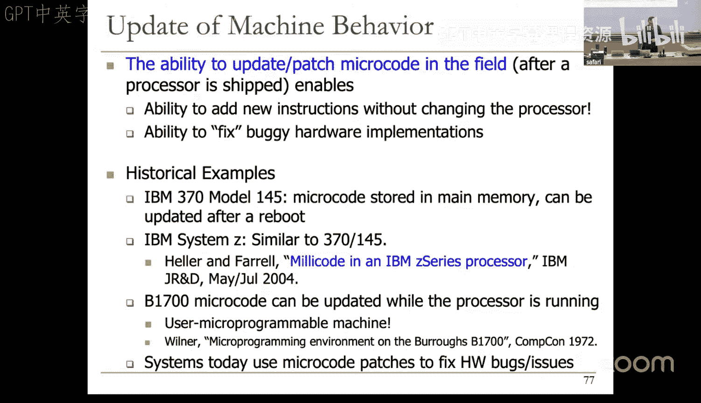
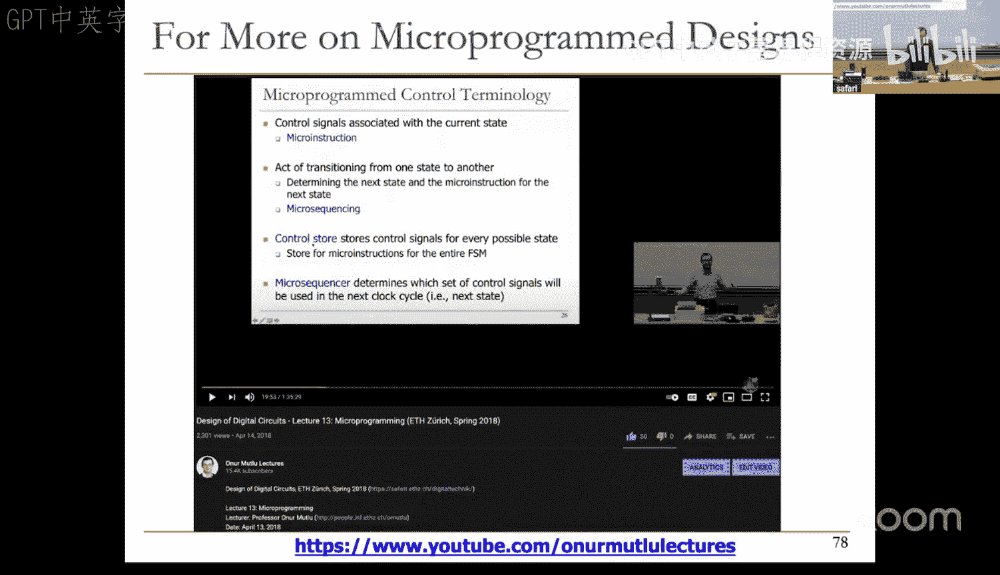
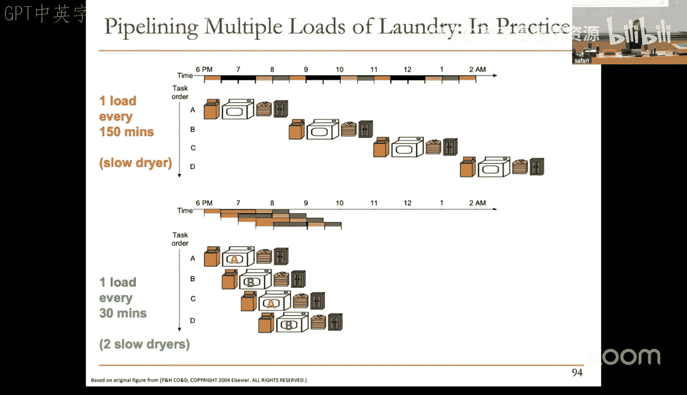
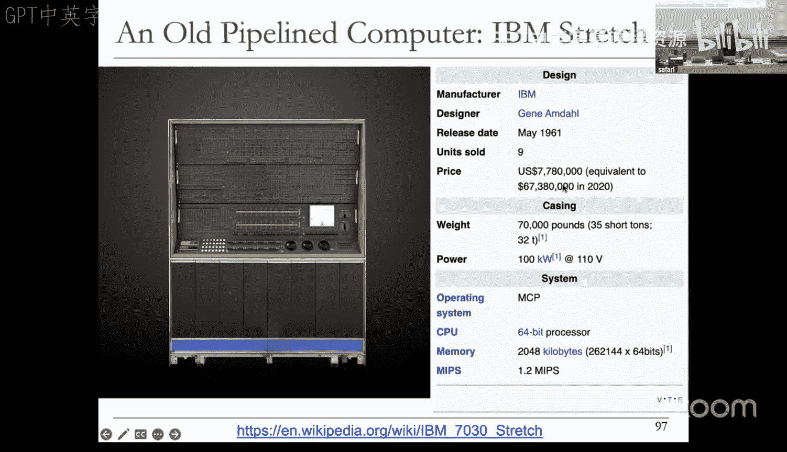
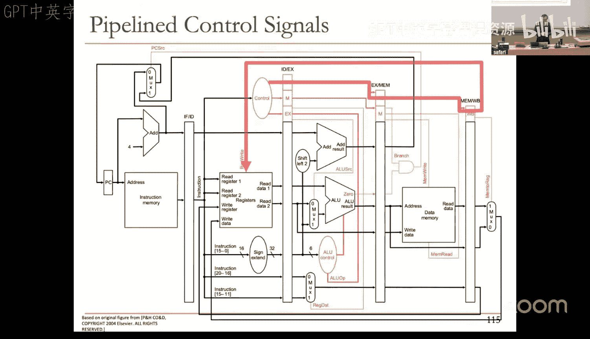

# 11：多周期与流水线处理器设计

## 概述
在本节课中，我们将继续学习微架构设计，重点是多周期处理器和流水线处理器的设计。我们将从回顾单周期设计的局限性开始，然后详细探讨如何构建一个多周期MIPS处理器，最后引入流水线设计的概念，分析其如何提高指令吞吐量。

---

## 多周期处理器设计回顾

上一节我们介绍了单周期处理器设计的局限性。本节中，我们来看看多周期处理器设计如何解决这些问题。

多周期微架构的核心目标是让每条指令只占用其真正需要的时间，而不是像单周期设计那样，由最坏情况的指令决定时钟周期时间。这可以通过构建一个状态机来实现，每个时钟周期执行指令处理的一个步骤，并在指令结束时更新架构状态。

### 多周期设计的优势与代价
以下是多周期设计的主要目标：
*   **更好的关键路径**：降低时钟周期时间。
*   **优化状态机**：针对最常见的指令和工作负载进行优化。
*   **平衡设计**：仅提供真正需要的功能。

然而，多周期设计也需要付出代价：
*   **硬件开销**：需要在每个时钟周期结束时存储中间结果。
*   **时序开销**：每个时钟周期都会浪费一部分时间（如寄存器建立/保持时间）。
*   **有限的并发性**：一次只能处理一条指令。

### 构建多周期数据通路
设计多周期微架构的步骤与单周期类似：设计数据通路，添加控制信号，然后设计控制逻辑。关键区别在于，我们需要将指令处理分解为多个时钟周期。

我们以MIPS的`lw`（加载字）指令为例，展示数据通路的构建思路：
1.  **取指阶段**：使用程序计数器从内存读取指令，存入指令寄存器，并同时递增PC。
2.  **寄存器读阶段**：从指令中解码出基址寄存器，并从寄存器文件中读取其值。
3.  **地址计算阶段**：将基址寄存器值与符号扩展后的立即数相加，计算出内存地址。
4.  **内存访问阶段**：使用计算出的地址访问内存，读取数据。
5.  **写回阶段**：将读取的内存数据写回目标寄存器。

多周期设计的优势之一是硬件复用。例如，我们可以使用同一个ALU来完成地址计算和PC递增，使用同一块内存进行指令取指和数据访问（在不同周期）。

### 多周期控制逻辑
数据通路构建完成后，我们需要设计控制逻辑，即一个有限状态机。每个状态由在该状态下断言的控制信号定义，并决定下一个状态。

控制信号在每个时钟周期控制两件事：
1.  数据通路应如何处理数据。
2.  如何为下一个时钟周期生成控制信号。

通过为每条指令类型定义状态序列，并设置每个状态下所有控制信号的值（包括“无操作”信号），我们就完成了多周期处理器的设计。

### 微程序控制
一种更结构化、更灵活的多周期设计方法是微程序控制。其核心思想是：
*   **微指令**：对应有限状态机的一个状态，包含该状态所需的所有控制信号。
*   **控制存储器**：存储所有微指令，类似于一个程序。
*   **微序列器**：决定下一条要执行的微指令。

这实际上是在**微架构层面进行编程**。微程序控制提供了显著的灵活性：
*   **可扩展性**：可以通过更新微程序来支持新的指令。
*   **复杂性管理**：可以将复杂指令实现为一串简单的微指令序列。
*   **现场修复**：可以发布微代码补丁来修复硬件bug或安全漏洞。

---

## 流水线处理器设计

多周期设计提高了时钟频率并优化了硬件使用，但并发性仍然有限。本节中，我们来看看流水线设计如何通过提高硬件资源利用率来进一步提升性能。

### 流水线的基本思想
流水线的核心思想是**重叠执行多条指令**。我们将指令处理过程划分为多个独立的阶段（如取指、译码、执行、访存、写回），并在每个阶段设置专门的硬件资源。这样，当一条指令在使用某个阶段的资源时，其他指令可以使用其他空闲阶段的资源。

类比：洗衣流程
*   **非流水线（多周期）**：洗完、烘干、折叠完一件衣服的所有步骤后，再开始处理下一件。
*   **流水线**：当第一件衣服在烘干时，第二件衣服可以开始清洗。

理想情况下，对于一个`k`级流水线，虽然单条指令的延迟（完成所需时间）没有减少，但处理器的**吞吐量**（单位时间完成的指令数）理论上可以提高`k`倍。

### 流水线的实现
要实现流水线，我们需要：
1.  **划分阶段**：将单周期数据通路划分为多个耗时大致相等的阶段。
2.  **插入流水线寄存器**：在阶段之间插入寄存器，用于保存前一阶段的结果，并将其作为下一阶段的输入。这确保了不同指令在不同阶段的数据是隔离的。
3.  **传播控制信号**：为每条指令生成的控制信号需要与其数据一起，在流水线寄存器中逐级传递，并在正确的阶段被使用。

一个经典的5级MIPS流水线阶段包括：
*   **IF**：取指
*   **ID**：译码与读寄存器
*   **EX**：执行/地址计算
*   **MEM**：内存访问
*   **WB**：写回寄存器

### 理想与现实中的流水线
理想流水线假设：
*   工作可以完美均匀地划分到各阶段。
*   各阶段没有资源冲突。
*   指令之间完全独立。

现实中，流水线面临诸多挑战，限制了其性能提升：
*   **流水线不平衡**：各阶段工作量不同，最慢的阶段成为瓶颈，决定了时钟周期时间。公式：`吞吐量 = 1 / (max(各阶段延迟) + 寄存器开销)`。
*   **硬件成本增加**：需要额外的流水线寄存器。过度细分流水线会导致寄存器开销占比过大，收益递减。
*   **指令间相关**：下一条指令可能依赖于上一条指令的结果，导致其无法立即进入流水线，产生“流水线停顿”。

### 流水线控制
流水线处理器的控制逻辑与单周期处理器相似。一种常见策略是：
在ID阶段，根据操作码生成该指令后续所需的所有控制信号。
将这些控制信号与指令数据一起，沿流水线向下传播。
每个阶段使用其对应的控制信号来控制本阶段的硬件操作。

---

## 总结
本节课中我们一起学习了：
1.  **多周期处理器设计**：通过有限状态机将指令执行分解为多个周期，优化了时钟频率和硬件复用，但牺牲了部分并发性。
2.  **微程序控制**：一种灵活的多周期实现方式，将控制信号“编程化”，便于扩展和修复。
3.  **流水线处理器设计**：通过重叠执行多条指令来大幅提高吞吐量。其核心是在处理阶段之间插入寄存器，并妥善管理控制信号与数据流。
4.  **流水线的挑战**：我们认识到理想流水线的假设在实践中难以满足，阶段不平衡、资源冲突和指令相关性问题都会影响流水线效率。

在接下来的课程中，我们将深入探讨流水线面临的主要挑战——**数据相关与控制相关**，并学习如转发、停顿、分支预测等技术来解决这些问题，以逼近流水线的理想性能。