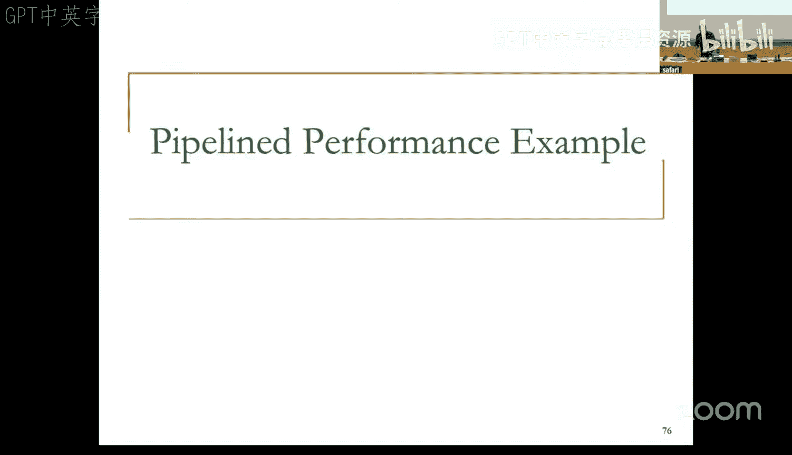

# 12：流水线处理器设计 II (Spring 2025)


## 概述
在本节课中，我们将完成流水线处理器设计的基础知识学习。我们将重点探讨流水线中数据依赖和控制依赖的处理方法，理解如何检测依赖关系，以及如何通过暂停（Stall）和数据转发（Forwarding）等技术来保证流水线的正确执行。

---

## 流水线设计回顾
上一节我们介绍了多周期微架构，并开始构建流水线处理器。本节中，我们来看看流水线设计中的一些核心问题。

### 从单周期到流水线
流水线设计的起点通常是单周期微架构的数据通路。其设计过程与单周期和多周期处理器类似：首先设计数据通路，然后设计控制逻辑。

**流水线数据通路设计** 的本质是：
1.  从单周期数据通路开始。
2.  将其划分为多个阶段（例如，五级流水线：取指、译码、执行、访存、写回）。
3.  添加流水线寄存器以分隔各个阶段。
4.  确保数据和控制信号能正确传播到所需的流水线阶段。

流水线寄存器的作用是在每个时钟周期结束时，锁存当前阶段的结果，并将其作为下一个阶段的输入。这样，不同的指令可以同时处于不同的执行阶段。

### 流水线控制逻辑
控制信号本质上与单周期处理器相同。关键区别在于，控制信号需要被延迟到正确的流水线阶段才生效。

例如，写寄存器文件的控制信号 `RegWrite` 应该在指令处于写回阶段时生效，而不是在译码阶段。因此，在译码阶段生成的控制信号需要存储在流水线寄存器中，并随着指令一起向下传播，直到在正确的阶段被使用。

---

## 流水线中的问题
我们构建的流水线在理想条件下（指令相互独立，访存单周期完成）可以正确工作。然而，现实中的程序会引入依赖关系，导致流水线无法持续流动。

以下是导致流水线暂停（Stall）的三个主要原因：
1.  **资源冲突**：两条指令同时需要同一个硬件资源。
2.  **数据依赖**：后续指令需要前序指令的计算结果。
3.  **控制依赖**：需要根据分支指令的结果来决定下一条要取指的指令。

### 资源冲突的处理
资源冲突发生在两条处于不同流水线阶段的指令需要同一资源时。

以下是两种主要的处理方法：
*   **消除冲突根源**：复制资源（例如，使用独立的指令和数据存储器）或增加资源吞吐能力（例如，使用多端口存储器）。
*   **检测并暂停**：如果无法复制资源，则检测到冲突时，暂停其中一个冲突阶段。通常优先让更“年长”（更早进入流水线）的指令继续执行。

一个常见的技巧是精心设计寄存器文件，使其能在同一个时钟周期的前半段进行写操作，在后半段进行读操作。这样，写回阶段的指令和译码阶段的指令可以“同时”访问寄存器文件，避免了冲突。

### 数据依赖的类型
数据依赖分为三种类型：
1.  **真数据依赖（写后读，RAW）**：指令A写入寄存器，指令B读取该寄存器。这是真正的数据流依赖，必须保证指令B读到的是指令A写入的值。
    *   **公式表示**：`InstrA: Rd = f(Rs1, Rs2)`；`InstrB: ... = g(Rd, ...)`
2.  **反依赖（读后写，WAR）**：指令A读取寄存器，指令B写入同一寄存器。这是一种“假”依赖，源于寄存器名称的复用。
3.  **输出依赖（写后写，WAW）**：指令A和指令B都写入同一寄存器。这也是一种“假”依赖。

反依赖和输出依赖之所以是“假”依赖，是因为如果架构有足够多的寄存器，编译器可以为这些指令分配不同的寄存器，从而消除依赖。它们的存在是由于架构寄存器数量有限。

在顺序流水线中，通过确保所有写操作都在流水线最后阶段（写回）按程序顺序完成，可以相对容易地处理反依赖和输出依赖。真数据依赖的处理则更具挑战性。

---

## 处理真数据依赖
处理真数据依赖有几种基本方法，我们将重点讨论硬件检测与暂停，以及数据转发。

### 检测依赖（互锁）
首先，硬件需要检测指令间的依赖关系，这个过程称为互锁（Interlocking）。

以下是两种硬件检测方法：
*   **记分牌**：为每个寄存器设置一个有效位。当一条指令在译码阶段确定要写某个寄存器时，将该寄存器的有效位置为“无效”。后续指令在译码时，如果发现其源操作数寄存器无效，则暂停。当写操作在写回阶段完成后，再将有效位置为“有效”。这种方法简单，但会对所有类型的依赖（包括假依赖）都产生暂停。
*   **组合逻辑依赖检查**：在译码阶段，用组合逻辑电路比较当前指令的源寄存器编号，与流水线中所有后续阶段指令的目的寄存器编号。如果发现匹配，且后续指令确实会进行写操作，则说明存在真数据依赖，需要暂停当前指令。这种方法更精确，只针对真依赖，但随着流水线加深和超标量设计，逻辑会变得复杂。

### 暂停流水线
一旦检测到无法立即解决的数据依赖（例如，加载指令后紧跟一条依赖其结果的指令），就需要暂停流水线。

**暂停的含义是**：让依赖指令等待，直到其所需的数据值可用。
*   暂停所有上游阶段（即该指令之前的所有更“年轻”的指令），包括停止更新PC和取指。
*   让所有下游阶段（即该指令之后的所有更“年老”的指令）继续执行并流出流水线。
*   在被暂停的阶段插入“气泡”（Bubble），即相当于一个空操作（NOP）指令，以防止错误执行。

### 数据转发（旁路）
单纯的暂停会降低性能。观察发现，产生数据的指令在其执行阶段或访存阶段结束后，结果就已经计算出来并锁存在流水线寄存器中，而无需等到写回阶段才可用。

**数据转发** 的思想是：将数据生产者指令的结果，直接通过额外的路径（旁路）传递给正在执行阶段的数据消费者指令，而不是等待结果写回寄存器文件后再读取。

以下是在五级流水线中需要添加的转发路径：
1.  从执行阶段末尾的流水线寄存器转发到执行阶段的ALU输入。
2.  从访存阶段末尾的流水线寄存器转发到执行阶段的ALU输入。
3.  利用寄存器文件的内部设计，实现写回阶段前半周期写，译码阶段后半周期读的“隐式”转发。

为了实现转发，需要在ALU输入前添加多路选择器，其选择信号由转发控制逻辑产生。该逻辑根据源寄存器编号与后续阶段目的寄存器编号的匹配情况，以及后续指令是否确实会写寄存器，来决定选择哪个数据源（来自寄存器文件、来自EX/MEM寄存器还是来自MEM/WB寄存器）。如果多个后续阶段都有匹配，则优先选择更“年轻”的指令（即离消费者更近的生产者）的结果。

### 必须暂停的情况：加载-使用冒险
数据转发并非万能。有一种特殊情况必须暂停：当一条加载指令（LW）后面紧跟着一条依赖该加载结果的指令时。

```
LW   R1, 0(R2)  # 在MEM阶段结束时得到数据
ADD  R4, R1, R3 # 在EX阶段开始时需要R1的数据
```
问题在于：`ADD`指令在时钟周期4开始时就需要`R1`的数据，而`LW`指令在周期4结束时才能从内存中读出数据。即使添加从访存阶段到执行阶段的转发路径，这条路径也包含了内存访问时间，会显著延长关键路径，违反流水线阶段均衡的设计原则。因此，对于这种“加载-使用”依赖，硬件必须插入一个周期的暂停。

---

## 控制依赖的处理
控制依赖是指下一条要取指的指令地址依赖于当前指令（主要是分支指令）的执行结果。

### 问题所在
在流水线中，我们在取指阶段就需要知道下一条指令的地址。但对于分支指令（如BEQ），其条件是否成立、目标地址是多少，需要到执行阶段（甚至更晚）才能计算出来。在此期间，处理器已经按照“分支不跳转”的预测取入了后续的指令（即分支延迟槽指令）。如果最终分支判断为跳转，那么这些已取入的指令就是无效的，必须作废。

### 分支预测与冲刷
最简单的策略是**总是预测不跳转**。即，假设所有分支都不执行跳转，继续顺序取指。
*   如果预测正确（分支确实不跳转），流水线正常执行。
*   如果预测错误（分支跳转），则在分支指令的执行结果出来后：
    1.  将正确的目标地址载入程序计数器（PC）。
    2.  **冲刷**（Flush）流水线中在分支指令之后取入的所有错误指令。冲刷意味着清空这些指令所在流水线寄存器的内容，将其变为“气泡”。

预测错误的代价是**分支误预测惩罚**，即被冲刷的指令数量所对应的时钟周期数。

### 减少惩罚：尽早解析分支
为了减少惩罚，可以尝试在流水线的更早阶段解析分支。例如，将分支地址计算和条件判断（比较两个寄存器是否相等）移到译码阶段。
*   **优点**：误预测时只需冲刷一条指令（译码阶段的那条），惩罚减小。
*   **缺点**：增加了译码阶段的硬件复杂度（需要额外的加法器和比较器），可能延长关键路径，从而降低时钟频率。同时，如果分支依赖的寄存器值尚未就绪（存在数据依赖），还需要为这些值添加转发路径，进一步增加复杂性。

### 更智能的预测
“总是预测不跳转”是一种静态预测策略。我们可以采用更智能的**动态分支预测**策略来提升准确率，例如：
*   **基于方向预测**：对于向后跳转的分支（通常是循环结尾），预测为“跳转”，因为循环通常会执行多次。
*   **基于历史预测**：使用一个分支历史表记录每个分支指令最近几次的执行结果（跳转/不跳转），并基于此历史进行预测。

更准确的分支预测可以降低误预测率，从而减少因冲刷指令带来的性能损失。现代处理器采用了非常复杂的动态分支预测器。

---

## 总结
本节课中，我们一起学习了流水线处理器设计中的关键挑战和解决方案：
1.  **流水线基础**：理解了如何通过划分阶段和添加流水线寄存器来构建流水线数据通路和控制逻辑。
2.  **数据依赖**：区分了真数据依赖和假依赖。学习了通过硬件互锁检测依赖，并通过**暂停**和**数据转发**技术来解决真数据依赖，以在保证正确性的前提下尽可能提升性能。
3.  **控制依赖**：认识到分支指令带来的控制依赖会导致流水线取指错误。学习了通过**分支预测**（如总是预测不跳转）和**指令冲刷**来处理分支误预测。了解了尽早解析分支和采用更智能预测策略以降低性能损失的思想。



我们目前构建的流水线仍假设内存访问是单周期的。下一周，我们将继续探讨流水线的其他问题，包括多周期操作的处理，并逐步向乱序执行的概念迈进。