# 13：精确异常处理 (Spring 2025)


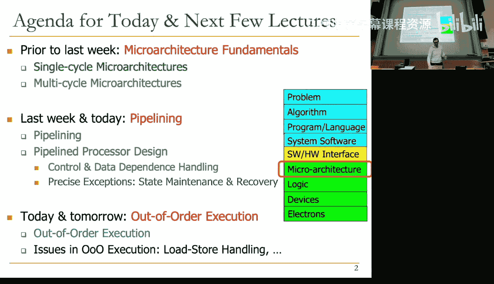

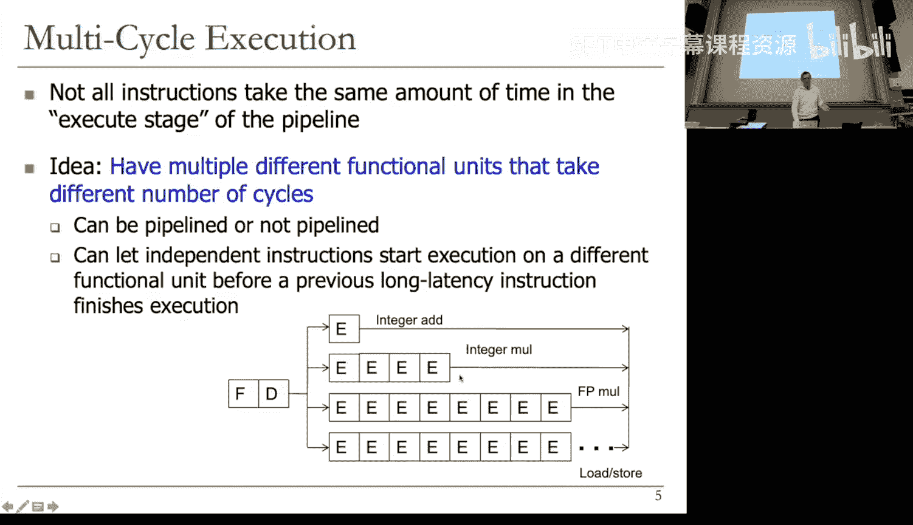


## 概述
在本节课中，我们将学习处理器设计中的一个核心概念：**精确异常处理**。我们将探讨为什么在流水线处理器，特别是当指令执行时间不同或乱序完成时，保持冯·诺依曼模型的顺序语义至关重要。我们将重点介绍一种关键的微架构技术——**重排序缓冲区**，它如何帮助我们在提升性能的同时，确保异常和中断能够被精确地处理。

---

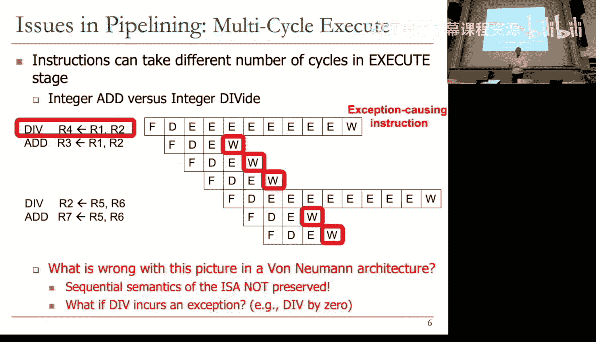


## 异常与中断的区别
上一节我们介绍了流水线处理器中的各种挑战。本节中，我们来看看当程序执行过程中出现意外事件时会发生什么。这些事件主要分为两类：**异常**和**中断**。

*   **异常**：由正在执行的程序**内部**触发的事件。例如：
    *   **除零错误**：例如执行 `DIV R1, R0`（假设R0为0）。
    *   **算术溢出**：运算结果超出了寄存器能表示的位数范围。
    *   **未定义操作码**：处理器取到并尝试解码一个无效的指令编码。
    *   **页错误/保护异常**：程序试图访问没有权限或不在物理内存中的地址（将在虚拟内存章节详述）。

*   **中断**：由**外部**硬件设备触发的事件，与当前运行的程序无关。例如：
    *   **I/O设备请求**：如键盘输入、网络数据包到达。
    *   **定时器中断**：操作系统用于任务调度的周期性信号。
    *   **电源故障**：电池电量即将耗尽。

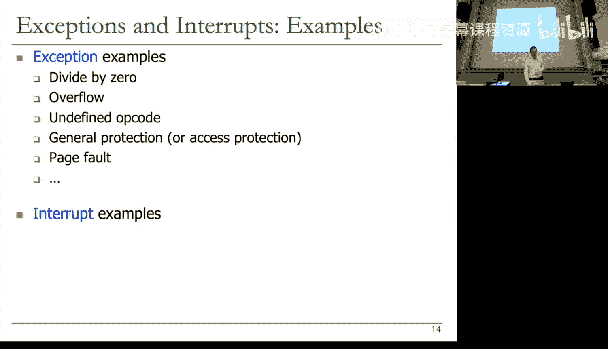


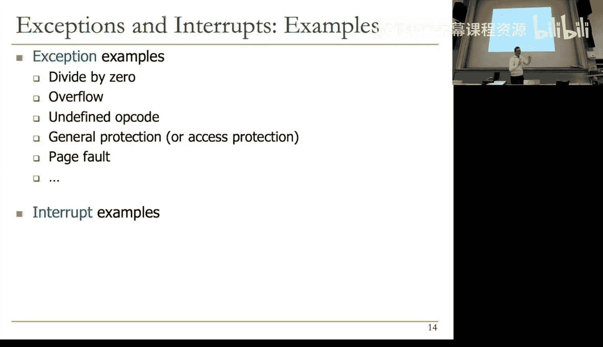


**核心区别**：异常与程序本身相关，通常需要**立即**处理；中断是外部事件，可以根据优先级和系统状态**延迟**处理。然而，在现代冯·诺依曼架构中，它们的处理机制非常相似。

---

## 什么是精确异常？
我们为什么需要关心指令完成的顺序？关键在于维护**精确异常**。

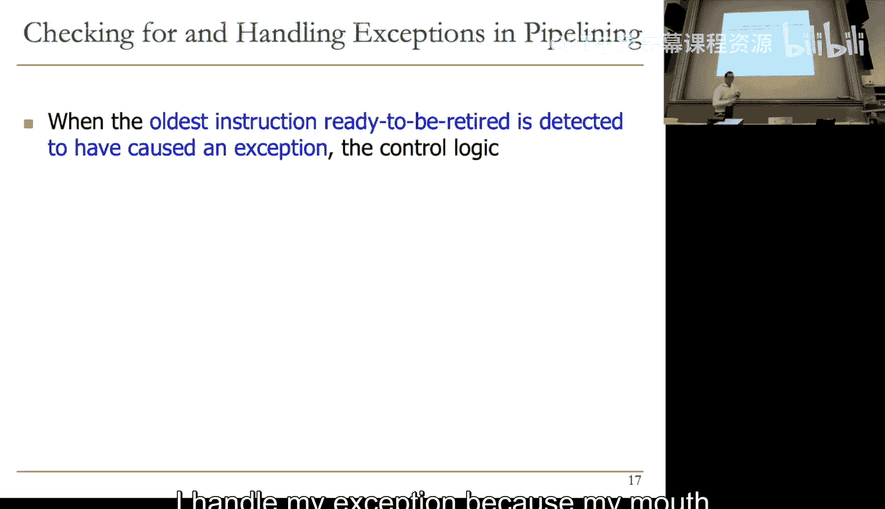


**定义**：当异常（或中断）准备被处理时，处理器的**架构状态**（包括程序计数器PC、寄存器和内存）必须处于一个**精确的、一致的状态**。

这意味着：
1.  **所有在异常指令之前（按程序顺序）的指令**必须已经**完成（退休/提交）**。即，它们已经完整地更新了架构状态。
2.  **所有在异常指令之后的指令**必须表现得**如同从未执行过**。即，它们不能更新任何架构状态。

**公式化描述**：
设异常发生在指令 `I_k`。则精确状态要求：
*   `∀ I_i (i < k)`：`I_i.state == COMMITTED`
*   `∀ I_j (j > k)`：`I_j.state == NOT_EXECUTED` (从架构状态视角看)

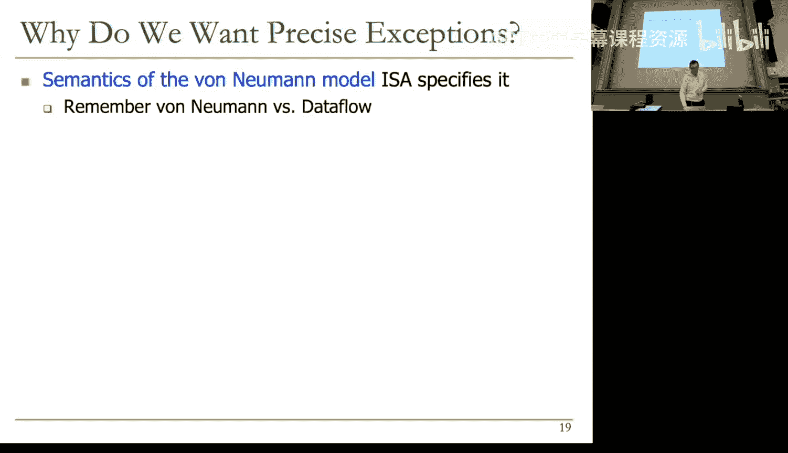


**为什么这很重要？**
*   **软件调试**：程序员可以准确知道异常发生时，哪些指令已生效，哪些没有，从而定位问题。
*   **易于恢复**：操作系统或异常处理程序可以安全地保存现场，并在问题解决后从精确的断点重启程序。
*   **实现复杂指令**：可以通过异常机制，用软件模拟器来处理硬件未实现的复杂指令（如某些浮点运算）。

---

## 多周期处理器中的异常处理
在单周期机器中，指令边界与时钟周期对齐，不存在顺序问题。在多周期处理器中，我们需要修改控制逻辑来支持异常。

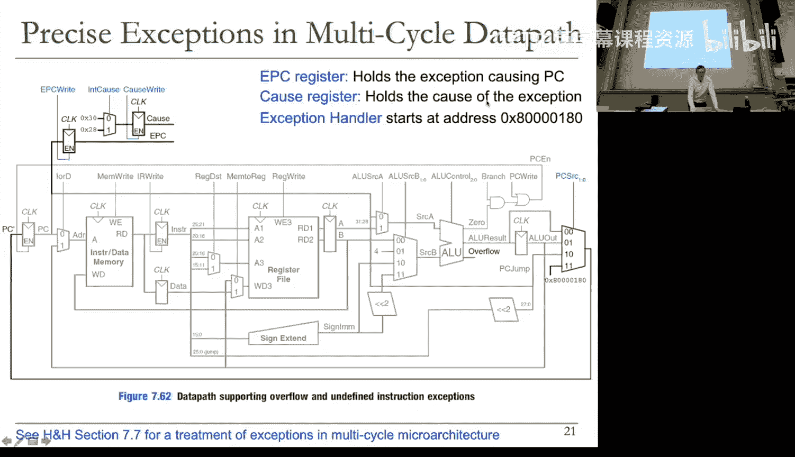


基本思路是：在一条指令执行完毕后、取下条指令前，检查是否发生了异常或中断。如果发生，则转入特殊的处理状态。

以下是MIPS多周期数据通路为支持异常所做的修改示例：

```verilog
// 新增的寄存器
EPC;    // 异常程序计数器，保存导致异常的指令地址
Cause;  // 原因寄存器，记录异常类型（如 0=溢出，1=未定义指令）
```

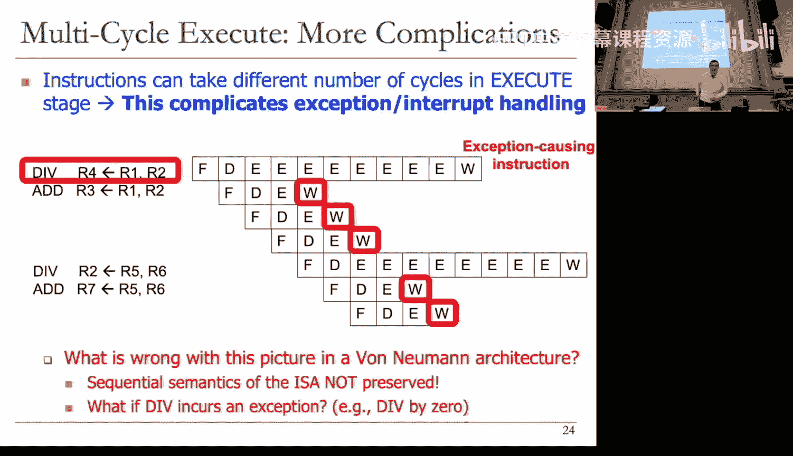


控制单元的状态机需要增加新的状态（例如“溢出处理”和“未定义指令处理”状态）。在这些状态中，硬件会：
1.  将当前PC保存到EPC。
2.  将异常类型编码写入Cause寄存器。
3.  将PC设置为一个固定的异常处理程序入口地址（例如 `0x80000180`）。
4.  跳转到该地址开始执行系统级的异常处理代码。

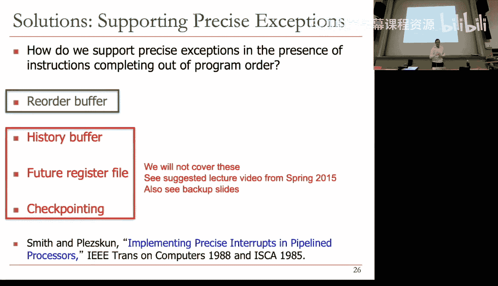


异常处理程序可以通过特殊的指令（如MIPS的`mfc0`）读取Cause寄存器，判断异常类型并做出相应处理。

---

## 乱序完成带来的挑战
当处理器采用更深的流水线，并且不同功能单元的执行周期数不同时（例如，加法需1周期，乘法需4周期，除法需40周期），问题变得复杂。

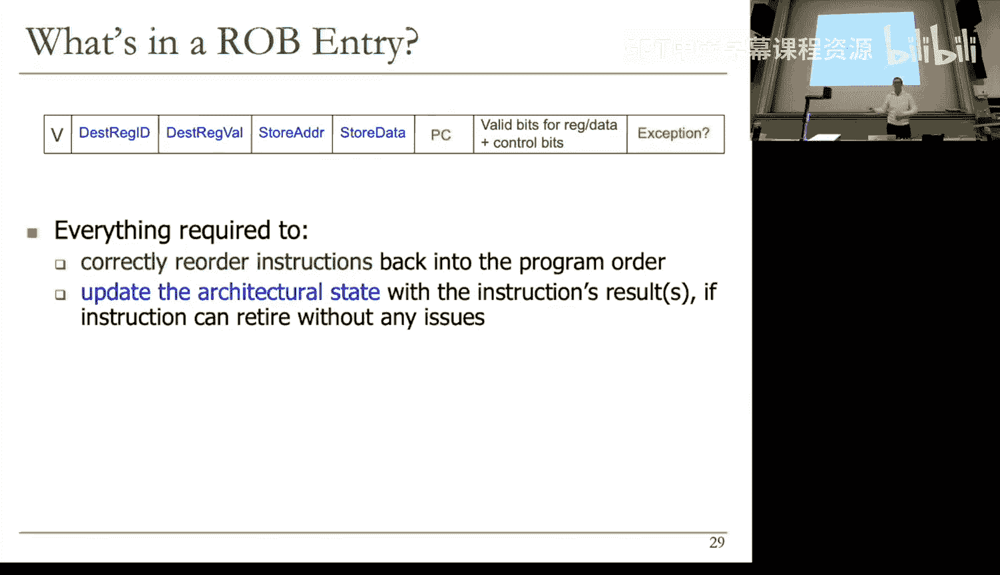


考虑以下指令序列，假设它们之间**没有数据依赖**：
```
1: DIV R3, R1, R2  // 长延迟指令，假设需8周期
2: ADD R4, R5, R6  // 短延迟指令，1周期
3: ADD R7, R8, R9  // 短延迟指令，1周期
```
在简单的流水线中，指令2和3可能**先于**指令1完成执行并写回寄存器文件。这就**违反了顺序语义**。如果指令1随后发生异常（如除零），那么架构状态（R4， R7）已经被后续指令修改，导致无法进行精确的异常处理和恢复。

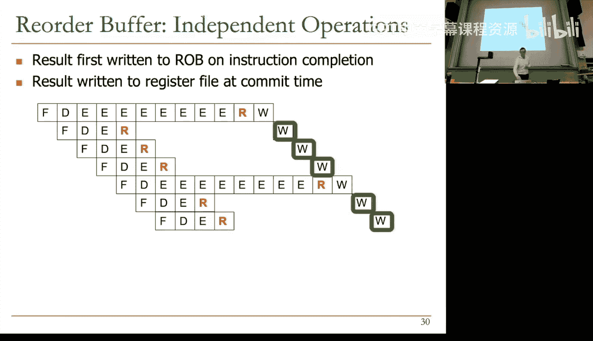


**核心问题**：如何支持指令的**乱序完成**以提升性能，同时又能保证**按序提交**以维持精确异常？

---

## 解决方案：重排序缓冲区
一种广泛使用的解决方案是引入一个称为**重排序缓冲区**的硬件结构。其核心思想是：**允许指令乱序完成执行，但强制它们按程序顺序更新架构状态**。

### ROB工作原理
ROB是一个在微架构层面实现的环形队列，跟踪所有已解码但尚未退休的指令。

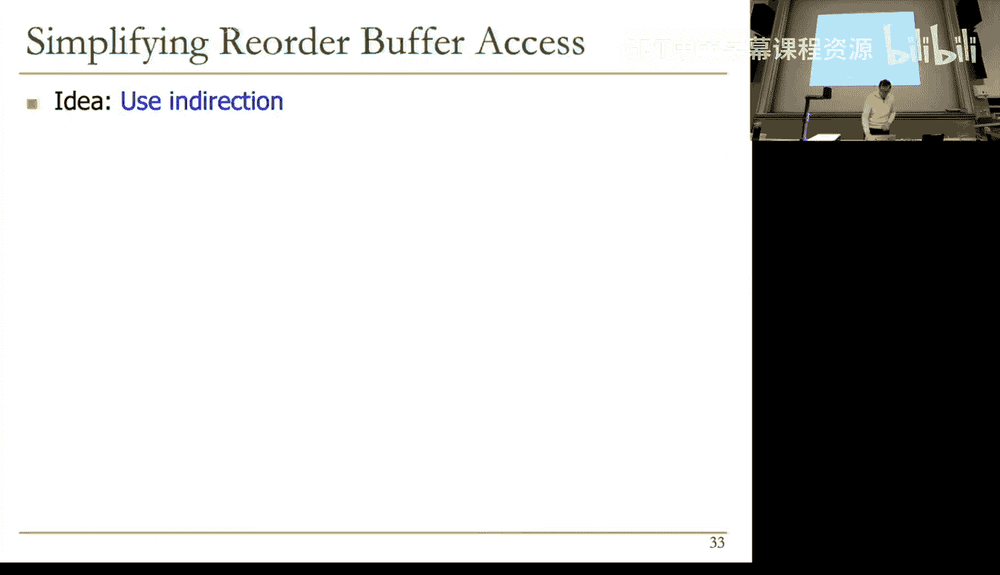

**ROB基本条目结构**：
```c
struct ROB_Entry {
    bool valid;          // 该条目是否有效
    int dest_reg_id;     // 目标寄存器编号
    int dest_reg_value;  // 计算结果值
    bool value_ready;    // 结果值是否已就绪
    int pc;              // 该指令的PC（用于异常处理）
    bool exception;      // 该指令是否导致异常
    // ... 可能还有其他字段，如存储地址/数据
};
```
**ROB工作流程**：
1.  **分配**：当指令被解码时，按程序顺序在ROB尾部分配一个条目。记录其目标寄存器等信息，并标记该寄存器“未就绪”。
2.  **执行与写回**：指令在功能单元中乱序执行。完成后，将结果写回**它自己在ROB中的条目**，并标记`value_ready = true`。此时**不更新**架构寄存器文件。
3.  **提交/退休**：一个独立的控制器持续检查ROB头部（最旧的指令）。如果头部指令的`value_ready = true`且`exception = false`，则将其结果从ROB中取出，**写入架构寄存器文件或内存**。然后释放该ROB条目。
4.  **异常处理**：如果头部指令的`exception = true`，则触发异常处理流程：清空流水线及ROB中所有后续指令，利用该指令条目中保存的PC等信息，跳转到异常处理程序。

通过这种方式，架构状态的更新永远是按程序顺序进行的，从而保证了精确异常。

### 数据转发与寄存器重命名
ROB还有一个重要作用：**消除假数据依赖**，并为**乱序执行**奠定基础。

**问题**：后续指令需要依赖前面尚未写回寄存器文件的结果怎么办？
**方案**：通过ROB进行数据转发。但直接在ROB中按寄存器号查找最新值需要复杂的**内容可寻址存储器**，成本高。

**更优方案**：**寄存器重命名**。
*   在解码阶段，当一条指令要写目标寄存器（如R3）时，我们不仅为它在ROB中分配条目，还将**架构寄存器R3映射到该ROB条目**。
*   后续需要读R3的指令，会被告知“R3的最新值将在ROB条目X中产生”，然后它们直接监视那个特定的ROB条目。
*   这样，多条指令写同一个架构寄存器（如R3）在微架构层面被重命名为写不同的物理位置（ROB条目），消除了**写后写**和**读后写**这类假依赖。真正的数据流依赖（**写后读**）通过ROB条目的生产者-消费者链来维护。

这实质上为程序提供了比ISA所定义的更多的“物理寄存器”，是现代乱序执行处理器的基石。

---

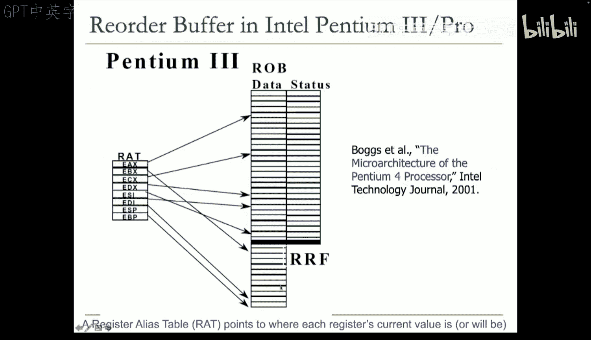

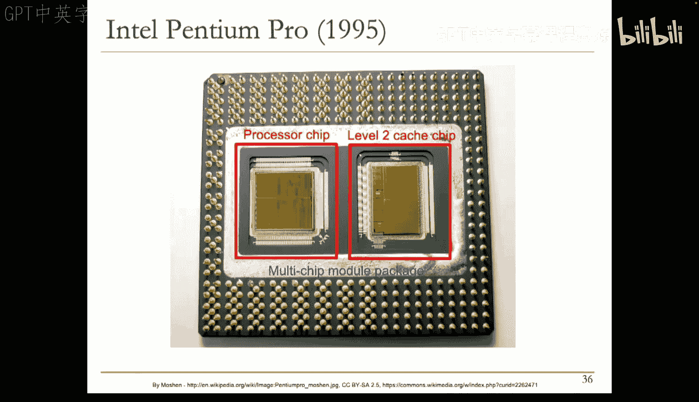

## 总结
本节课我们一起学习了处理器设计中的关键机制——精确异常处理。

1.  **核心目标**：维护冯·诺依曼顺序语义，确保异常/中断发生时架构状态精确，便于调试和恢复。
2.  **主要挑战**：在追求高性能的流水线，特别是允许指令乱序完成的设计中，如何保证按序提交。
3.  **关键机制**：**重排序缓冲区**。它作为指令乱序完成与按序提交之间的缓冲，是实现精确异常的核心硬件结构。
4.  **额外收益**：ROB结合寄存器重命名，可以消除指令间的假数据依赖，为后续要深入学习的**动态乱序执行**提供了基础。

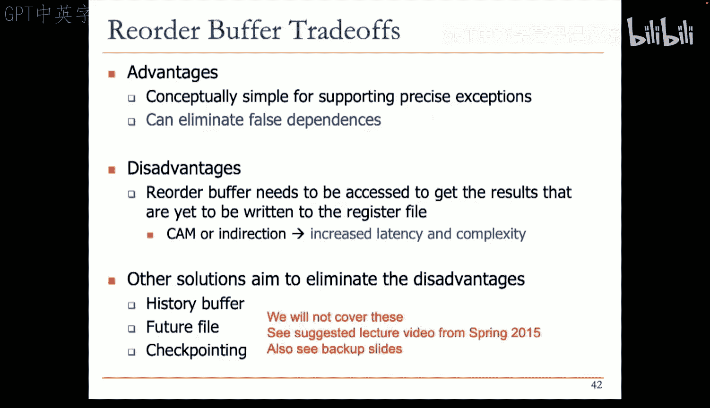

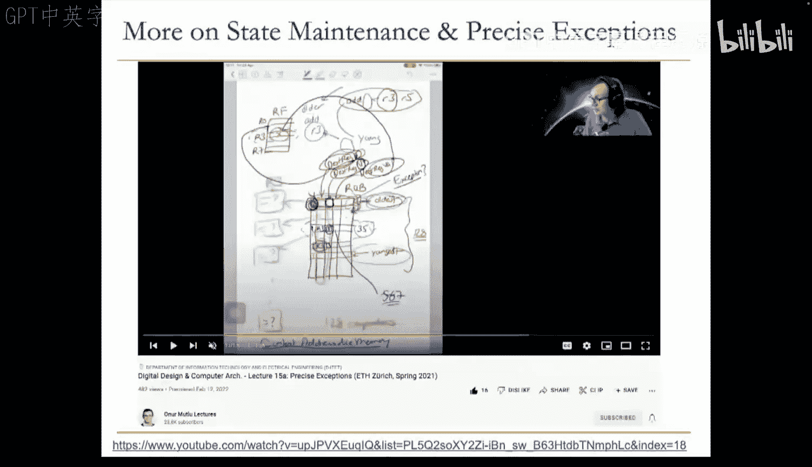


通过ROB，我们能够在微架构层面灵活调度指令以提升性能，同时向软件层呈现出一个简洁、顺序执行的抽象模型，完美体现了计算机架构中硬件-软件协同设计的精髓。