# 14：乱序执行 (Spring 2025)


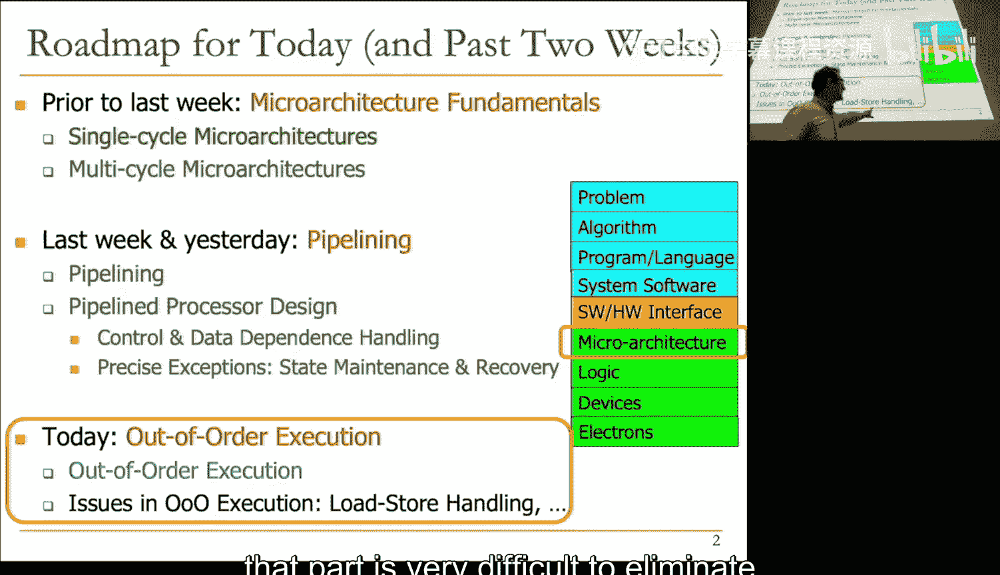

在本节课中，我们将要学习计算机架构中一个非常核心且激动人心的主题：乱序执行。这是一种不按照程序原始顺序执行指令的方法，旨在通过动态调度指令来挖掘指令级并行性，从而提升处理器性能。我们将从基本原理出发，逐步构建一个支持乱序执行的处理器模型。

## 回顾：顺序执行与寄存器重命名


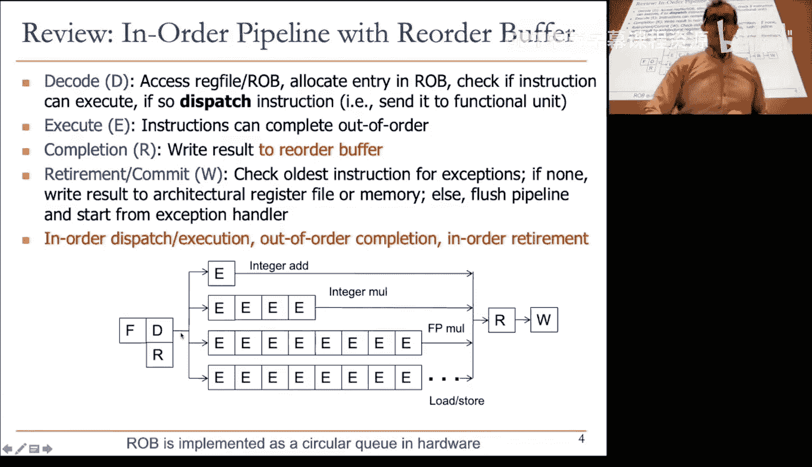


上一节我们介绍了支持精确异常的顺序执行流水线，并引入了重排序缓冲区（ROB）和寄存器重命名的概念。本节中，我们来看看如何在此基础上实现乱序执行。

寄存器重命名通过将架构寄存器（如 `R1`）映射到微架构命名空间（如重排序缓冲区条目或物理寄存器），消除了由寄存器数量有限引起的假依赖（写后读和写后写依赖）。真正的依赖是流依赖（读后写），我们需要确保消费者指令能正确连接到生产者指令。

**核心概念**：寄存器重命名将架构寄存器ID映射到一个更大的物理命名空间。例如，指令 `ADD R3, R1, R2` 在执行时，`R3` 可能被重命名为一个物理寄存器编号 `P100`。

## 乱序执行的核心思想与动机

顺序执行流水线面临的一个主要问题是：当一条指令因为其源操作数未就绪（例如，依赖一个长延迟操作，如乘法或未命中的加载）而无法派发时，后续所有指令都会被阻塞，即使它们是独立的。

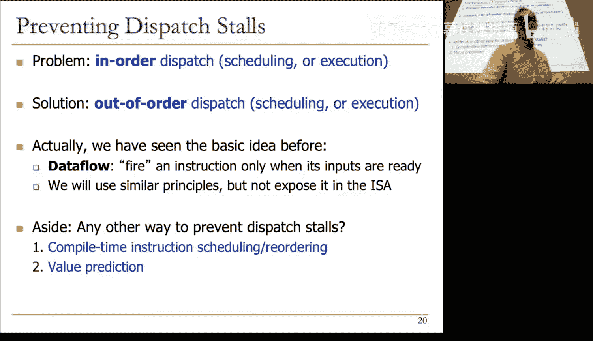

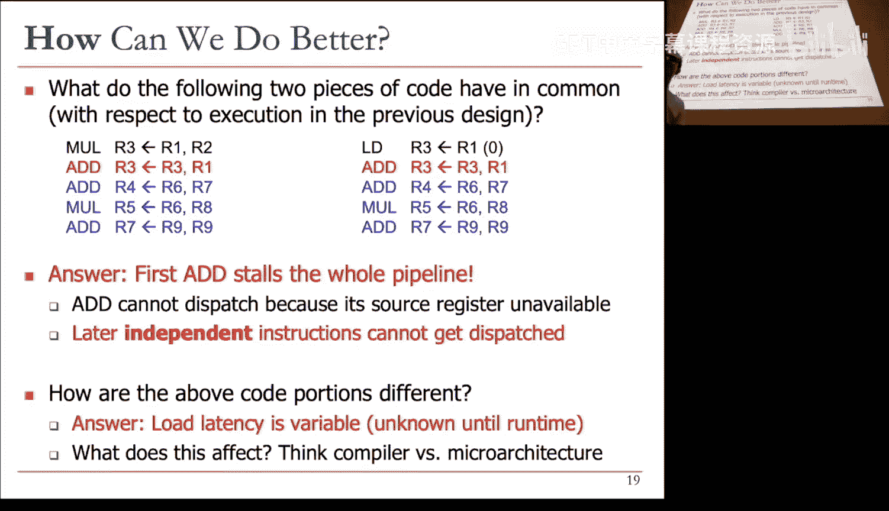

乱序执行旨在解决这个问题。其核心思想是：**将未就绪的指令移开，为独立的指令让路**。这类似于高速公路上的休息区——需要停下的车辆驶入休息区等待，而不阻塞主路。

为了实现这一点，我们需要：
1.  **连接消费者与生产者**：通过寄存器重命名实现。
2.  **缓冲指令直至就绪**：需要一个硬件缓冲区来存放指令。
3.  **跟踪源操作数就绪状态**：指令需要知道其源操作数何时可用。
4.  **在指令就绪时派发**：当指令的所有源操作数都就绪时，将其发送到功能单元执行。

以下是实现乱序执行所需的四个关键组件：

*   **寄存器重命名**：消除假依赖，为每个数据值关联一个唯一的标签（Tag）。
*   **保留站**：作为指令的“休息区”，存放已重命名但未就绪的指令。
*   **唤醒与选择逻辑**：当生产者指令完成并广播其标签和值时，等待该值的消费者指令被“唤醒”（标记为就绪）。当多个指令就绪时，需要仲裁逻辑选择派发哪一个。
*   **公共数据总线**：用于广播已完成的指令所产生的标签和值，使得等待这些值的指令能够捕获数据。

## Tomasulo 算法：一个经典的乱序执行实现

我们将通过一个经典的 Tomasulo 算法示例来具体理解乱序执行。该算法最初用于 IBM 360/91 浮点单元，是现代乱序执行处理器的基础。

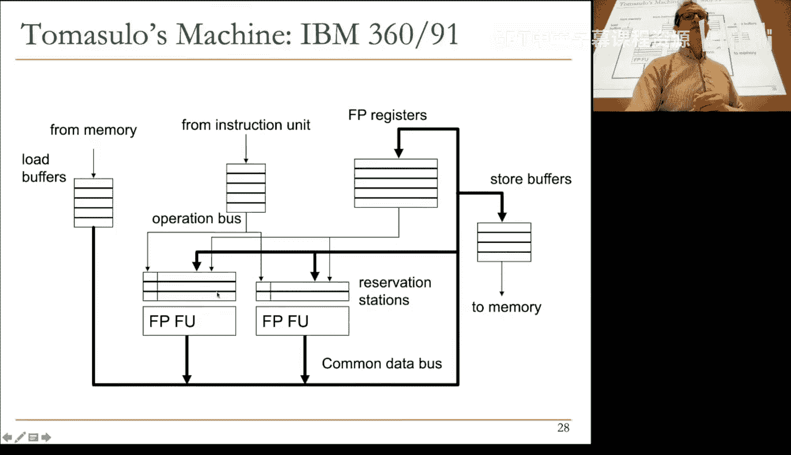

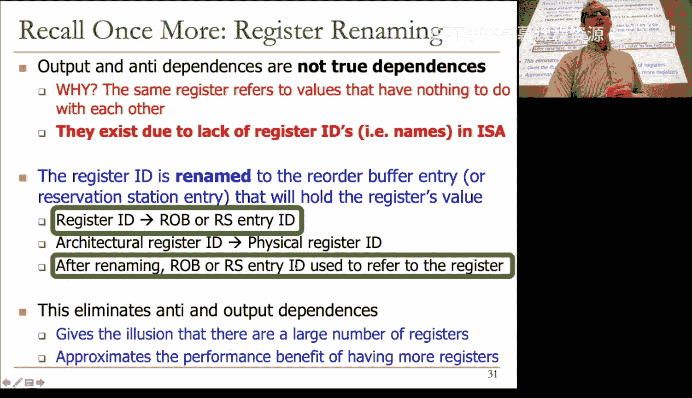

我们假设一个简单的执行环境：一个加法器（延迟4周期）和一个乘法器（延迟6周期），它们都是流水化的。我们有以下代码片段需要执行：

```
MUL R3, R1, R2   # R3 = R1 * R2 (长延迟)
ADD R5, R3, R4   # R5 = R3 + R4 (依赖 MUL)
ADD R7, R2, R6   # R7 = R2 + R6 (独立)
ADD R10, R8, R9  # R10 = R8 + R9 (独立)
MUL R11, R7, R10 # R11 = R7 * R10 (依赖前两个 ADD)
ADD R5, R5, R11  # R5 = R5 + R11 (依赖第一个 ADD 和第二个 MUL)
```

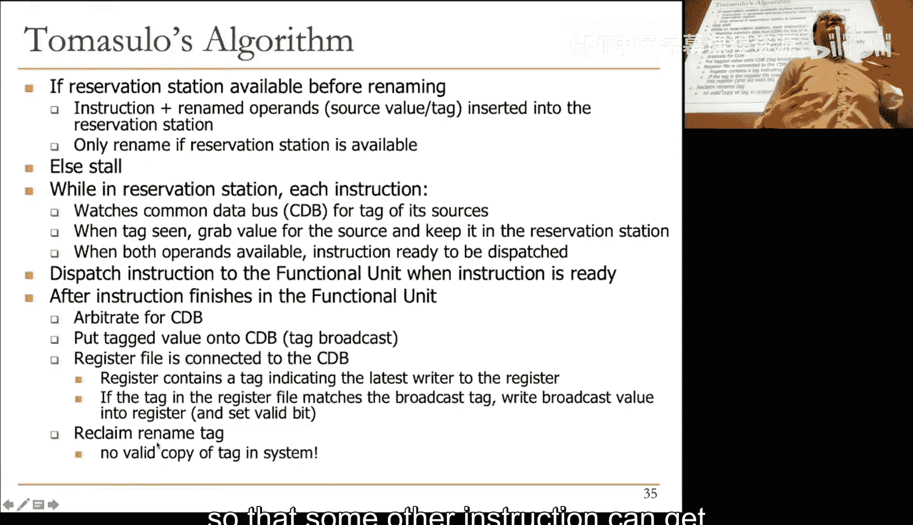

### 模拟执行步骤

我们将一步步模拟 Tomasulo 算法的执行过程。关键数据结构包括：
*   **寄存器别名表**：记录每个架构寄存器当前有效的值在哪里（在寄存器文件中，还是由某个保留站条目即将产生）。
*   **保留站**：每个功能单元（加法、乘法）关联一组保留站条目，每个条目存储指令的操作码、源操作数标签/值、目的操作数标签等。

**初始状态**：所有寄存器值有效，保留站为空。

**周期 1-2：解码 MUL 指令**
1.  取指并解码 `MUL R3, R1, R2`。
2.  分配一个乘法保留站条目（例如 `RSX`）。
3.  读取 RAT：`R1` 和 `R2` 的值都有效（假设为1和2）。将值和“有效”位复制到 `RSX` 的源操作数槽。
4.  重命名目的寄存器 `R3`：将 RAT 中 `R3` 的条目标记为“无效”，并将其标签指向 `RSX`。这意味着 `R3` 的新值将由保留站 `RSX` 产生。
5.  由于 `RSX` 的两个源操作数都已就绪，唤醒逻辑将其标记为可派发。

**周期 3：派发并执行 MUL**
*   `RSX` 中的乘法指令被派发到乘法器开始执行（需6周期）。
*   同时，解码下一条指令 `ADD R5, R3, R4`。

**周期 3（续）：解码 ADD 指令**
1.  分配一个加法保留站条目（例如 `RSA`）。
2.  读取 RAT：`R3` 无效，其标签指向 `RSX`。因此，`RSA` 的第一个源操作数标记为“未就绪”，标签=`RSX`。`R4` 有效，值被复制。
3.  重命名目的寄存器 `R5`：将 RAT 中 `R5` 的条目标记为“无效”，标签指向 `RSA`。
4.  由于 `RSA` 的一个源操作数未就绪，它必须在保留站中等待。

**关键观察**：此时，即使第一条乘法指令需要长时间执行，且第二条加法指令依赖它，流水线并未完全阻塞。我们可以继续解码后续指令。

**周期 4-6：继续解码与执行**
*   我们继续解码 `ADD R7, R2, R6` 和 `ADD R10, R8, R9`。这两条指令的源操作数都立即可用，因此它们被分配到保留站（如 `RSB` 和 `RSC`）后，很快就被标记为就绪并派发到加法器执行。
*   它们**先于**前面那条等待 `R3` 的 `ADD` 指令开始执行，这就是“乱序”的体现。

**周期 8：乘法完成与广播**
*   乘法器完成计算 `R1*R2=2`。
*   它通过**公共数据总线**广播一个消息：`标签=RSX, 值=2`。
*   所有正在监听总线的部件（其他保留站、寄存器别名表）检查自己的源操作数标签。
*   `RSA`（等待 `RSX` 的加法指令）发现匹配，于是捕获值 `2`，并将其第一个源操作数标记为就绪。
*   RAT 中 `R3` 的条目也更新为有效，值=2。

**周期 9：依赖链恢复执行**
*   现在 `RSA` 的两个源操作数都已就绪（值2和 `R4` 的值），它被唤醒并派发到加法器执行。
*   与此同时，之前乱序执行的 `ADD R7, R2, R6` 可能已经完成，并广播其标签和值，进而唤醒依赖它的后续指令（如 `MUL R11, R7, R10`）。

**后续周期**：这个过程持续进行。每条指令完成后都广播其标签和值，唤醒依赖它的指令。指令在其所有操作数就绪后立即被派发，完全基于数据流依赖关系，而非程序顺序。

**最终效果**：独立指令无需等待长延迟指令，从而显著减少了总执行时间。在这个例子中，乱序执行将周期数从顺序执行的约25周期减少到约20周期。

## 支持精确异常的乱序执行

我们之前讨论的 Tomasulo 算法最初不支持精确异常，这在现代通用处理器中是不可接受的。为了支持精确异常，我们需要结合上一讲的概念：**重排序缓冲区**。

**修改后的设计**包含两个关键部分：
1.  **前端寄存器文件**：用于重命名和乱序执行。指令完成时立即更新它，并广播结果。
2.  **架构寄存器文件**：代表程序的精确架构状态。只有当一条指令是重排序缓冲区中最旧的指令，且没有引发异常时，才将其结果从 ROB 提交到架构寄存器文件。

**工作流程**：
*   **重命名/派发**：指令被解码后，其目的寄存器被重命名到一个物理寄存器（或 ROB 条目），并存入保留站。
*   **乱序执行**：指令在操作数就绪后乱序执行，结果写入物理寄存器文件，并广播标签。
*   **顺序提交**：已完成的指令在 ROB 中按程序顺序排队。当一条指令到达 ROB 头部且状态为“完成无异常”时，将其结果从物理寄存器文件复制到架构寄存器文件，从而**按程序顺序更新架构状态**。
*   **异常处理**：如果任何指令发生异常，处理器清空流水线（刷新所有推测状态），并将架构寄存器文件的内容复制回前端寄存器文件，从而恢复到最后一个精确的架构状态。

这种设计分离了“推测执行状态”和“精确架构状态”，使得乱序执行和精确异常得以共存。

## 现代处理器优化：物理寄存器文件

在基本设计中，数据值被多次复制：保留站、ROB、前端寄存器文件都可能存有副本，这浪费了面积和功耗。

现代处理器采用**物理寄存器文件**来优化：
*   创建一个统一的、大型的物理寄存器文件来存储所有数据值。
*   寄存器别名表、保留站、ROB 中不再存储实际数据值，而是存储指向物理寄存器文件的**指针**（即物理寄存器编号）。
*   指令完成后，将结果写入其分配的物理寄存器，并广播该物理寄存器的编号（标签）。
*   依赖指令根据捕获的标签，在派发执行前，从物理寄存器文件中读取相应的源操作数值。

**优点**：
*   消除了数据值的冗余存储，节省芯片面积。
*   广播的内容从宽数据总线（如64位值）变为窄标签总线（如10-12位物理寄存器编号），大幅降低了广播网络的功耗和复杂度。

## 总结与展望

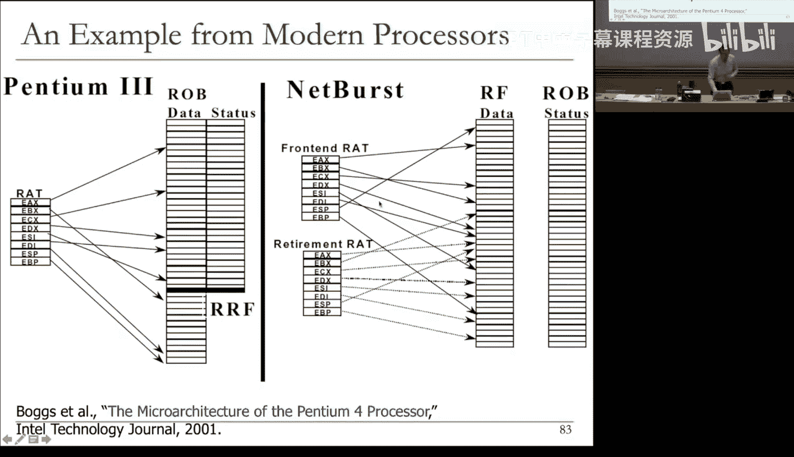

本节课中我们一起学习了乱序执行的基本原理和实现方法。

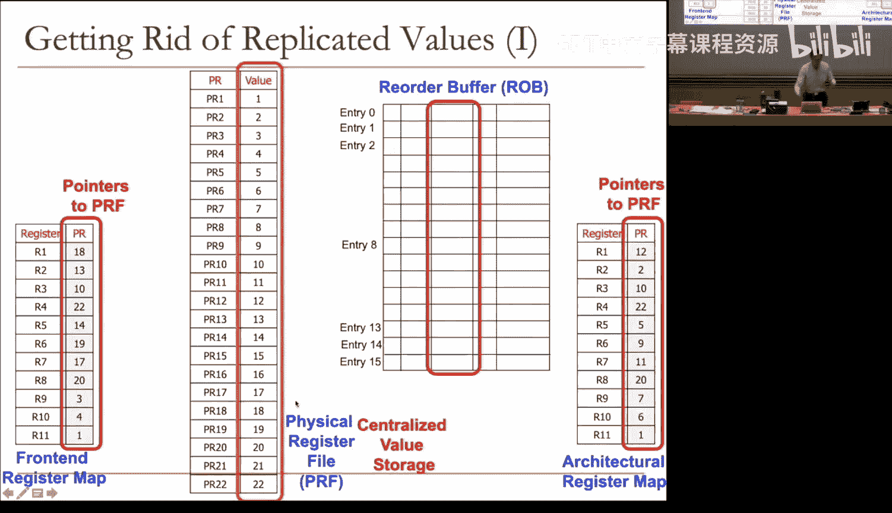

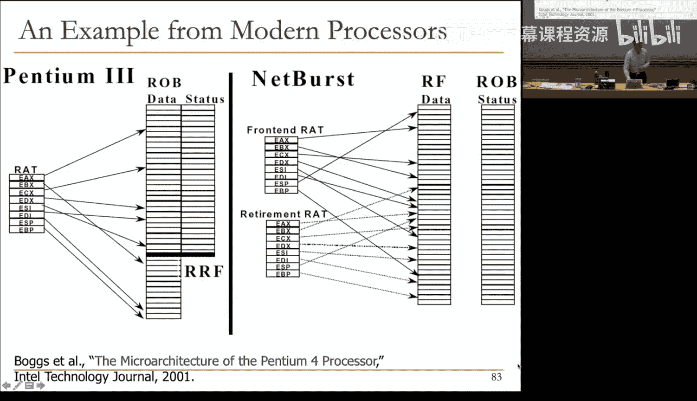

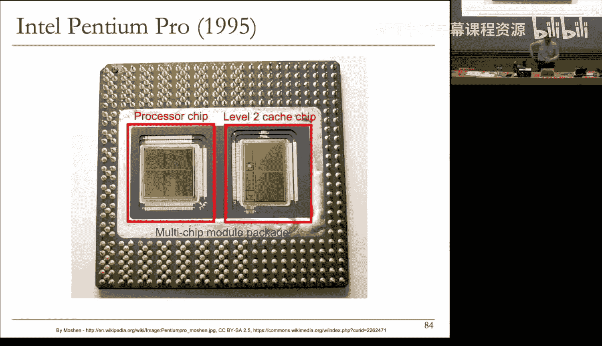

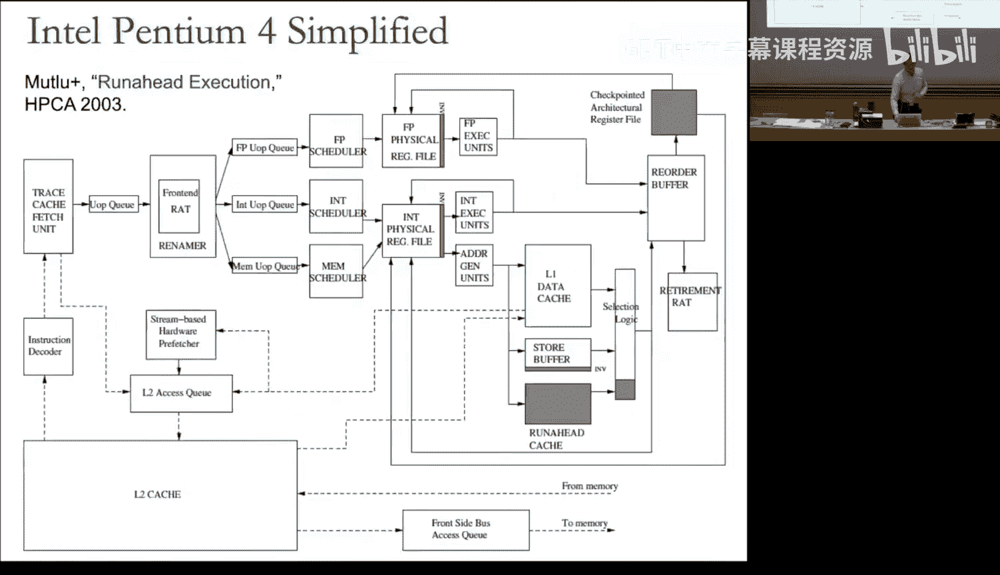

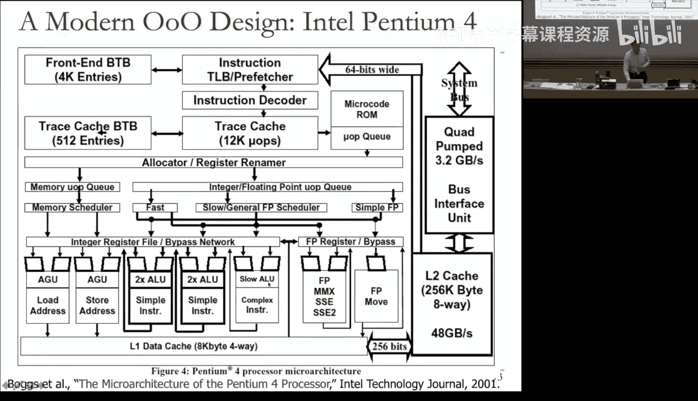

*   **核心思想**：通过动态调度，让指令在其操作数就绪后立即执行，而非死板遵循程序顺序，从而容忍长延迟操作，挖掘指令级并行。
*   **关键技术**：
    *   **寄存器重命名**：消除假依赖，建立生产者-消费者之间的标签化连接。
    *   **保留站**：作为指令等待操作数就绪的缓冲区。
    *   **基于广播的唤醒机制**：指令完成时广播标签，唤醒所有等待该结果的指令。
    *   **重排序缓冲区**：与乱序执行结合，确保指令结果按程序顺序提交，支持精确异常。
*   **现代实现**：通常采用物理寄存器文件来集中管理数据值，以提高能效和面积效率。

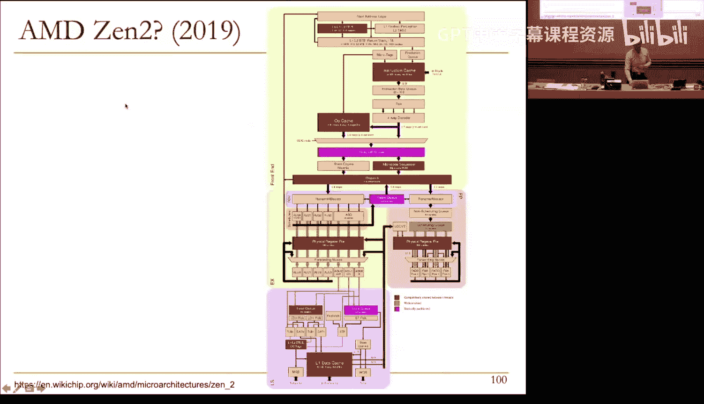

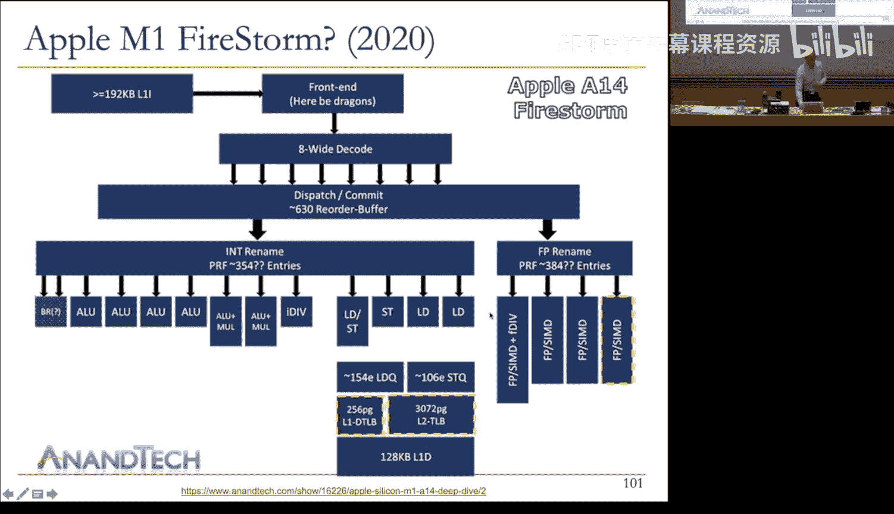

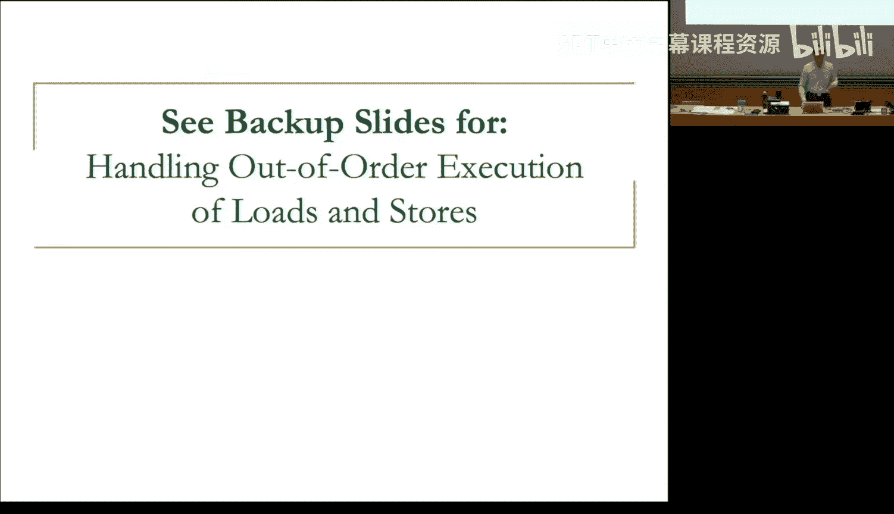


乱序执行是现代高性能处理器的基石。虽然其硬件复杂度显著增加（大量的比较器、广播总线、仲裁逻辑），但它为提升单线程性能带来了巨大收益。在接下来的课程中，我们将探讨另一个关键性能技术：分支预测，它旨在解决另一个导致流水线停滞的主要问题——控制依赖。