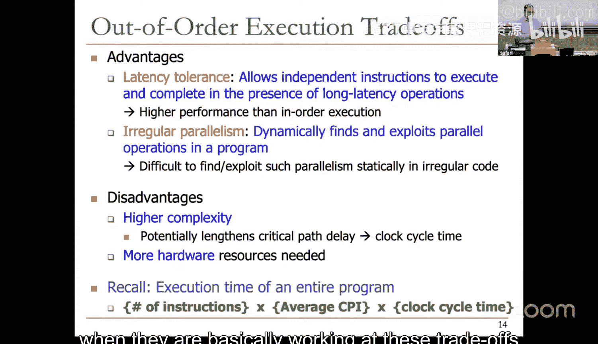
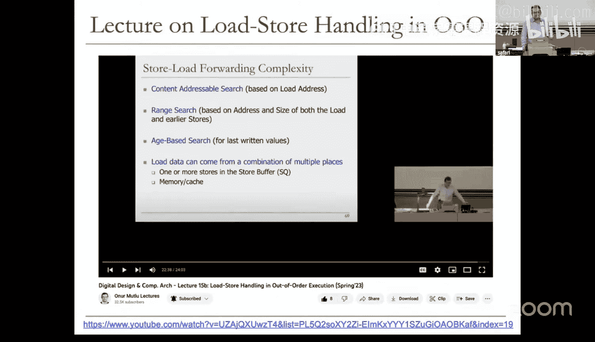
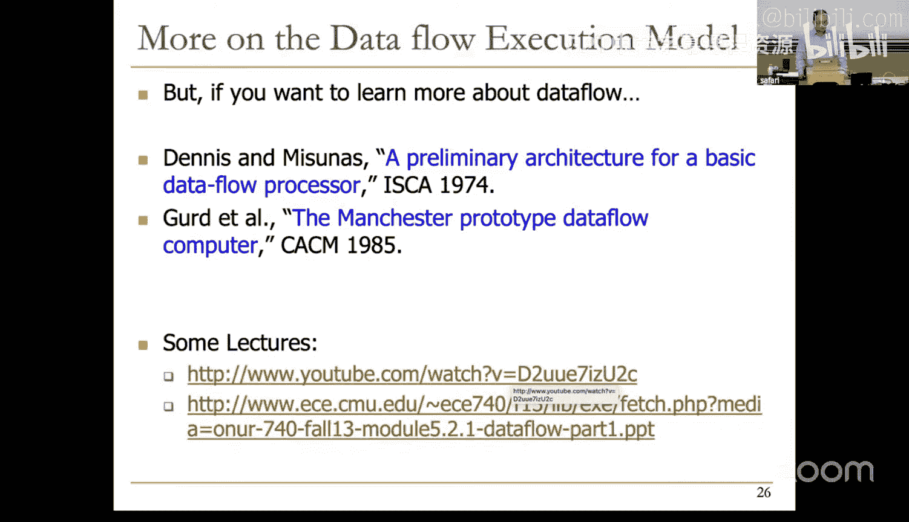
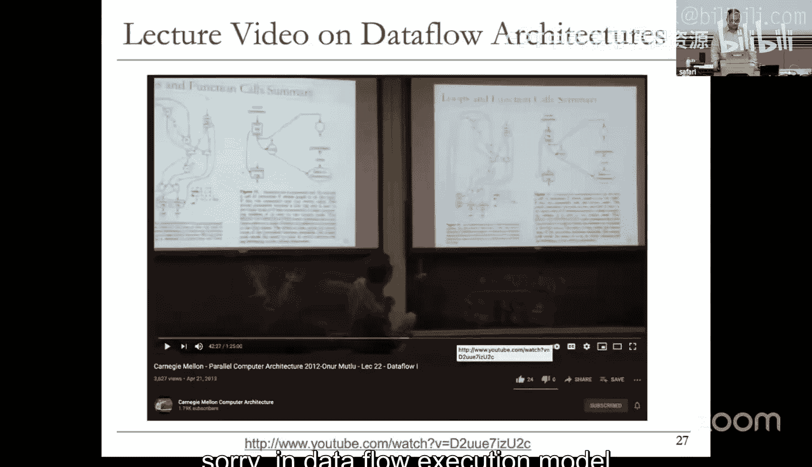
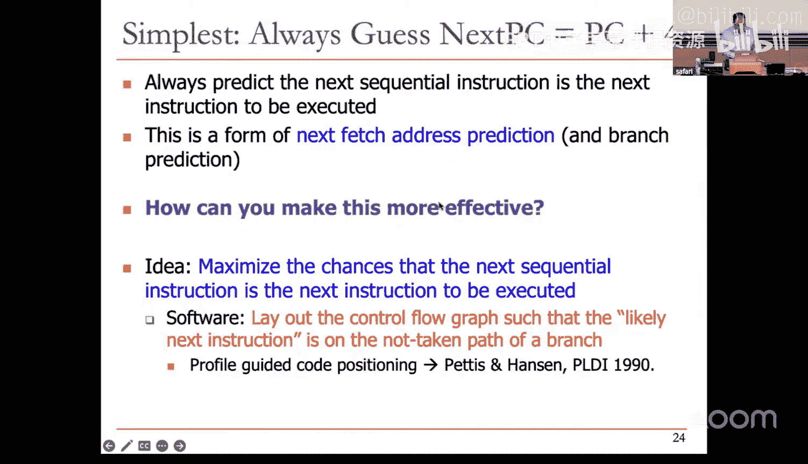
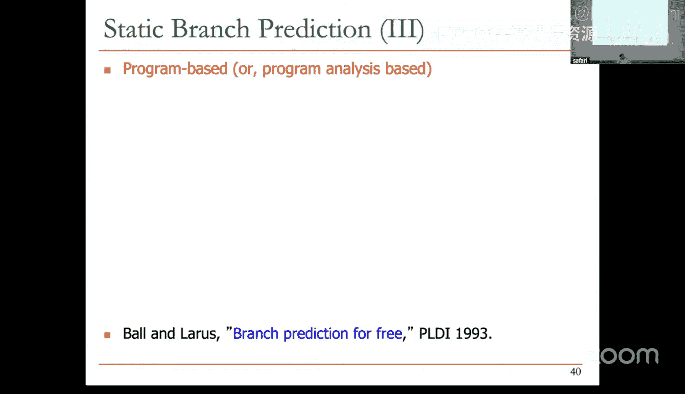

# 15：数据流、超标量执行与分支预测 (S25)


## 概述
在本节课中，我们将要学习数据流执行模型、超标量处理器架构以及分支预测技术。我们将首先回顾乱序执行的核心概念，然后探讨数据流与超标量执行，最后深入讲解分支预测的重要性及其实现方法。

## 乱序执行回顾与总结
上一节我们介绍了乱序执行的基本原理。本节中，我们来总结其核心机制与权衡。

为了实现乱序执行，处理器需要具备以下四个关键能力：
1.  **链接生产者与消费者**：将指令结果（生产者）与依赖该结果的后续指令（消费者）关联起来。
2.  **缓冲指令**：将指令暂存起来，直到其操作数准备就绪。
3.  **跟踪操作数就绪状态**：监控每条指令源操作数的就绪情况。
4.  **调度与分派**：当指令操作数全部就绪时，将其分派到相应的功能单元执行。

以下是实现这些能力的关键技术：
*   **寄存器重命名**：消除假数据依赖，实现生产者到消费者的链接。
*   **保留站**：提供指令缓冲。
*   **标签与值广播**：跟踪操作数就绪状态。
*   **唤醒与选择逻辑**：实现指令调度与分派。

乱序执行可以被视为一种**受限的数据流**执行。它在一个有限的指令窗口内动态地构建数据流图，并基于数据就绪性来调度指令执行，从而在保持顺序编程模型语义的同时，挖掘指令级并行性。





乱序执行的主要优势在于**延迟容忍**和**发掘不规则并行性**。它通过执行独立指令来掩盖长延迟操作（如内存访问）的等待时间，并能动态发现程序中隐藏的并行性。

然而，乱序执行也带来了一些挑战：
*   **更高的硬件复杂度**：依赖检查、重命名、调度等控制逻辑非常复杂。
*   **可能延长关键路径**：复杂的控制逻辑可能导致时钟周期变长。
*   **更多的硬件资源**：增加了芯片面积和成本。

性能权衡的核心公式是：
`程序执行时间 = 指令数 × 平均CPI × 时钟周期时间`
乱序执行旨在降低平均CPI，但可能增加时钟周期时间。设计者必须仔细权衡，以在提升性能的同时控制能耗和复杂度。

## 数据流执行模型
上一节我们提到乱序执行是受限的数据流。本节中，我们来看看数据流执行模型的核心理念。





在数据流模型中，**数据的可用性决定了指令的执行顺序**。一个数据流节点（指令）在其所有源操作数就绪时“触发”执行。程序被表示为节点之间的数据流图。

在**指令集架构（ISA）层面**，数据流模型并未取得广泛成功，主要原因是：
*   **编程与调试困难**：对程序员不友好，难以调试。
*   **缺乏精确的状态语义**：中断和异常处理复杂。

然而，在**微架构层面**，通过保持顺序编程语义来实现数据流（即乱序执行）则非常成功，现代高性能处理器普遍采用此技术。

此外，将数据流图映射到**可重构硬件（如FPGA）** 上也取得了成功，常用于加速机器学习等计算密集型应用。

数据流与顺序控制流在ISA层面的权衡涉及多个方面：
*   **易编程性**：顺序编程对程序员更友好。
*   **易编译性**：两者各有特点。
*   **并行性发掘**：数据流模型能显式表达并行性，更易于硬件利用。
*   **硬件复杂度**：数据流硬件可能因标签匹配等操作而更复杂。

## 超标量执行
我们了解了通过乱序执行挖掘指令级并行性。本节中，我们来看看另一种提升吞吐量的方法：超标量执行。

**超标量执行**的核心思想是**每个周期取指、译码、执行和退休多条指令**。例如，一个2路超标量处理器理想情况下每个周期能处理2条指令（IPC=2）。


超标量与乱序是**正交的概念**。处理器可以组合形成不同的设计：
*   顺序标量
*   顺序超标量
*   乱序标量（不常见）
*   乱序超标量（现代高性能处理器常见）

为了实现超标量执行，需要复制流水线前段资源（如取指、译码带宽）和后端资源（如多功能单元、多端口寄存器堆和数据缓存）。同时，硬件必须**检查同时被取指指令之间的依赖关系**。

以下是一个顺序超标量处理器的数据通路示意图，展示了资源复用的情况：
```
[取指单元] -> [指令内存] (双端口取指)
         -> [寄存器堆] (双读口、双写口、双写使能)
         -> [功能单元1] [功能单元2]
         -> [数据内存] (双端口)
         -> [写回选择器] (双路)
```

依赖关系会限制性能提升。例如，如果连续两条指令存在数据依赖，第二条指令必须等待，导致资源无法充分利用。编译器可以通过**指令重排**来缓解这个问题，将独立指令放在一起以提高并行度。

超标量执行的优势在于**更高的指令吞吐量**。但其劣势也很明显：
*   **更复杂的依赖检查**：需要检查同一周期内多指令间的依赖。
*   **更复杂的寄存器重命名逻辑**：在乱序超标量中，重命名逻辑可能成为关键路径。
*   **可能增加时钟周期**：复杂的逻辑可能降低时钟频率。
*   **更多的硬件资源**：增加了成本。

现代处理器（如Intel、AMD、Apple的芯片）都是深度流水线、多路发射的乱序超标量设计，以同时挖掘指令级并行性和线程级并行性。

## 分支预测导论
前面我们讨论了通过超标量设计提升并行度。然而，控制依赖（尤其是分支指令）会严重阻碍流水线效率。本节中，我们开始学习解决此问题的关键技术：分支预测。

分支预测的目标是**在取指阶段就猜测下一条指令的地址**，以保持流水线充满。处理控制依赖的潜在方法有：
1.  **停顿流水线**：直到知道确切地址。这会导致性能严重下降。
2.  **预测地址**：即分支预测。
3.  **延迟分支**：编译器在分支后填充独立指令（如MIPS）。效果有限。
4.  **细粒度多线程**：在等待一个线程的分支结果时，执行其他线程的指令。用于GPU。
5.  **谓词执行**：将条件分支转换为条件数据依赖，消除分支。
6.  **多路径执行**：同时推测执行两个分支路径，事后丢弃错误路径。

**细粒度多线程** 通过在每个周期从不同线程取指来隐藏延迟。它需要为每个线程保存独立的上下文（PC、寄存器组）。优点是无须复杂的依赖检查和分支预测，提高了系统吞吐量；缺点是单线程性能下降，需要更多硬件资源存储上下文，且当线程数不足时效率会降低。

分支指令非常频繁（约占指令的15-25%）。在深度流水线超标量处理器中，一次分支预测失败会导致大量指令槽被浪费。**分支预测的准确性至关重要**。

举例说明：假设一个20级流水线、5路超标量处理器，每5条指令有一条分支。如果分支预测100%准确，IPC可达5。如果准确率降为99%，IPC降至约4。如果准确率仅为90%，IPC会骤降至约1.6。因此，即使预测准确率看似很高，微小的下降也会对性能产生巨大影响。

## 静态分支预测
我们看到了分支预测准确性的重要性。本节中，我们先从最简单的静态预测方法开始。




最简单的预测是**总是预测不跳转**，即下一条指令地址总是 `PC + 4`。软件（编译器）可以通过**剖析引导的代码布局**来优化：将更可能执行的路径（通常是“不跳转”路径）安排在分支指令的顺序后继位置，从而提高这种简单预测的准确率。


另一种方法是**尽量减少或消除分支**，例如通过**谓词合并**将多个条件判断合并，或将控制依赖转换为数据依赖。

总是预测不跳转的实现简单，但准确率低（约30-40%）。**总是预测跳转**的准确率通常更高，因为循环中的向后分支经常被跳转。更进一步的启发式方法是**向后跳转则预测跳转，向前跳转则预测不跳转**。

编译器可以进行**基于剖析的静态预测**。通过使用剖析数据，编译器可以判断每个分支在运行时的常见方向，并将此“提示”编码在分支指令中（需要ISA支持）。这种方法的准确率取决于剖析输入集的代表性，如果实际运行模式与剖析阶段不同，预测效果会变差。

当预测失败时，处理器必须**清空**在错误路径上已取指和部分执行的指令，并从正确地址重新开始取指，这会带来性能惩罚。

## 总结
本节课中我们一起学习了：
1.  **乱序执行**的总结：其通过寄存器重命名、保留站等机制实现受限数据流，以容忍延迟和发掘并行性，但增加了硬件复杂度。
2.  **数据流模型**：其以数据就绪性驱动执行，在微架构层面通过乱序执行实现很成功，但在ISA层面因编程调试困难而未普及。
3.  **超标量执行**：通过每周期处理多条指令提升吞吐量，需要硬件复制和依赖检查，常与乱序执行结合。
4.  **分支预测的重要性**：极小的预测准确率下降都会导致性能大幅降低，是保持流水线高效的关键。
5.  **静态分支预测**：包括总是预测不跳转/跳转、基于方向的启发式方法以及编译器辅助的剖析预测，这些方法实现简单但准确率有限。



下节课我们将继续深入更复杂、更准确的动态分支预测技术。