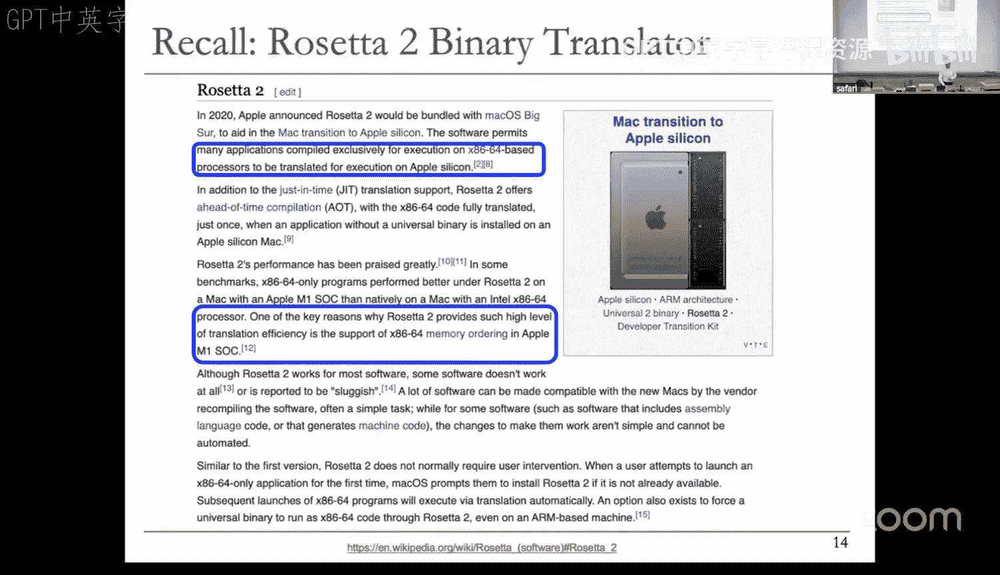
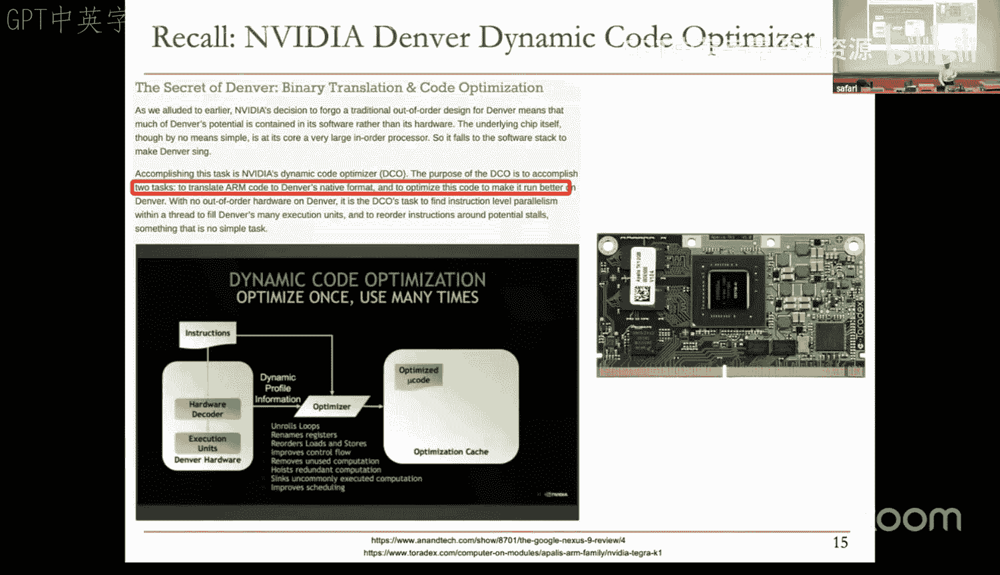
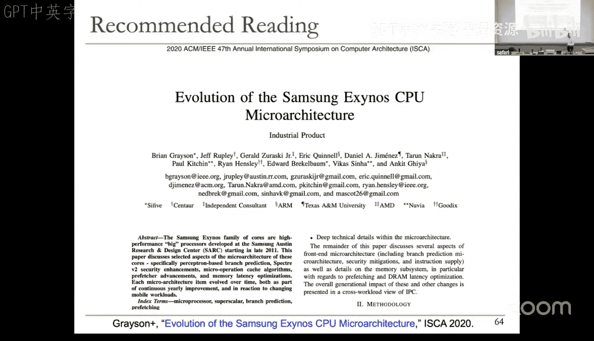
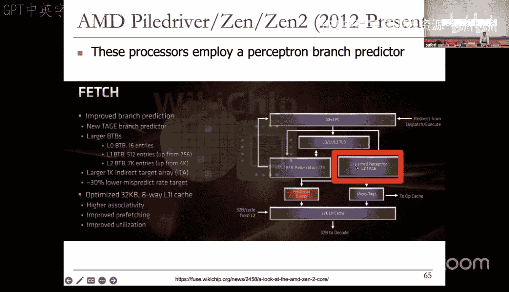
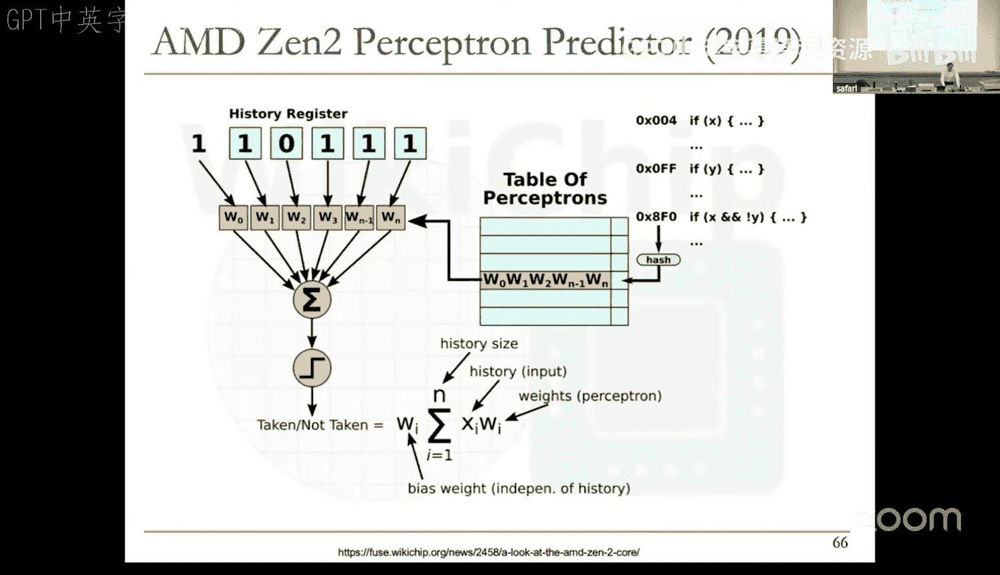
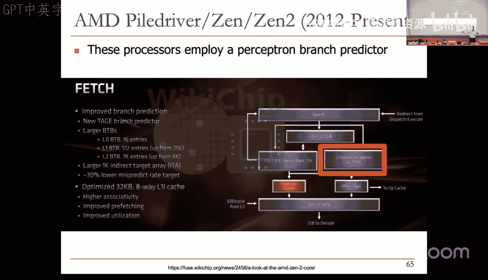
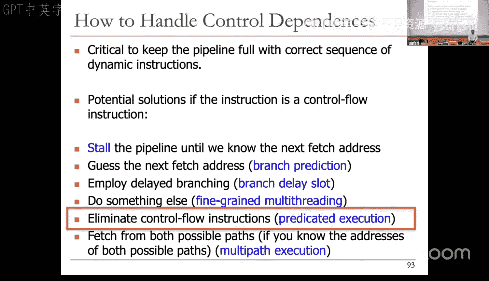

# 16：高级分支预测 (Spring 2025)


## 概述
在本节课中，我们将深入学习高级分支预测技术。我们将从回顾静态预测方法开始，然后深入探讨动态运行时预测，包括单级预测器、两级预测器、混合预测器，以及现代处理器中使用的更复杂的算法，如感知器和几何历史长度预测器。目标是理解如何通过硬件机制动态地、高精度地预测分支方向，以保持流水线满载，从而提升处理器性能。

---

## 静态分支预测回顾
上一节我们介绍了分支预测的基本概念和重要性。本节中，我们来看看几种不需要复杂硬件的静态预测方法。这些方法在编译时或由程序员确定分支方向。

以下是几种常见的静态分支预测策略：
*   **总是预测不跳转**：始终预测分支不跳转，取指 `PC + 4`。这种方法简单，但准确率通常只有30-40%，因为大多数条件分支（尤其是循环）是跳转的。
*   **总是预测跳转**：始终预测分支跳转。这需要目标地址预测。准确率比“总是预测不跳转”高，但通常也只有60%左右。
*   **向后跳转则预测跳转**：如果分支目标地址在代码中位于分支指令之前（即向后跳转），则预测跳转（这通常是循环分支）；否则预测不跳转。这种方法比前两种稍好。

另一种静态方法是基于剖析的预测。编译器使用一组输入数据对程序进行剖析，根据运行结果决定每个分支的“可能方向”，并将这一位提示信息编码在指令中。硬件在执行时使用这个提示位进行预测。

基于剖析的预测的优点是**每个分支可以独立设置预测方向**。但其准确性严重依赖于剖析时使用的输入数据集是否能代表程序的实际运行情况。如果实际输入与剖析输入差异很大，预测准确率会显著下降。

程序员也可以通过编程语言中的编译指示（Pragma）来提供分支预测提示，例如在C语言中使用 `if likely(x)` 或 `if unlikely(error)`。但这增加了程序员的负担，且需要编程语言、编译器和指令集架构的共同支持。

所有静态预测技术都有一个共同的缺点：**它们无法适应分支行为的动态变化**。分支在执行过程中其行为可能改变，而静态方法编码的单一方向无法应对这种变化。

---

## 动态（运行时）分支预测简介
由于静态预测的局限性，我们需要能够适应分支行为变化的动态预测技术。动态预测器利用硬件在运行时收集的信息进行预测。

动态预测的主要优势是：
*   可以基于分支的执行历史进行预测。
*   可以适应分支行为的动态变化。
*   无需静态剖析，避免了输入集代表性的问题。





当然，其代价是**需要额外的硬件来实现预测逻辑**，并且追求高精度会使硬件变得非常复杂。

我们将从最简单的动态预测器开始构建。

---

## 单级预测器：上次结果预测器
最基本的动态预测器是“上次结果预测器”。其核心思想是：**预测分支本次的方向与它上一次执行时的方向相同**。

实现上，我们需要为每个分支（通过程序计数器PC标识）记录一个位（bit），来存储它上次执行的结果（跳转Taken=1，不跳转Not Taken=0）。当再次取到该分支指令时，检查这个位，并按其指示进行预测。

对于一个循环分支，假设循环执行N次（前N-1次跳转，最后一次不跳转），使用上次结果预测器会在**退出循环时和重新进入循环时**各产生一次预测错误。因此，对于N次迭代的循环，预测准确率为 `(N-2)/N`。当N很大时，准确率接近100%；但当N很小时（例如N=2），准确率会降到0%。

这种预测器的问题在于它**改变主意太快了**。只要遇到一次相反的结果，它就会立刻改变预测。这类似于空调在温度刚好超过设定值时就立刻启动制冷，导致在阈值附近频繁开关。

---

## 改进：双位饱和计数器预测器
为了解决“改变主意太快”的问题，我们引入**滞后（Hysteresis）** 机制。最简单的方法是为每个分支使用一个**两位饱和计数器**，而不是单个位。

两位计数器有四种状态：
*   **强跳转（Strongly Taken, 11）**：强烈认为分支会跳转。
*   **弱跳转（Weakly Taken, 10）**：倾向于认为分支会跳转，但信心不强。
*   **弱不跳转（Weakly Not Taken, 01）**：倾向于认为分支不跳转，但信心不强。
*   **强不跳转（Strongly Not Taken, 00）**：强烈认为分支不会跳转。

预测规则是：当计数器处于“强跳转”或“弱跳转”状态时，预测跳转；处于“弱不跳转”或“强不跳转”状态时，预测不跳转。

状态转换规则是：
*   如果预测正确（例如，预测跳转且实际跳转），则**增加**计数器（向“强跳转”方向饱和）。
*   如果预测错误，则**减少**计数器（向相反方向移动）。

这样，**一次相反的结果不会立即导致预测翻转**（例如从“强跳转”到“弱跳转”），需要连续两次相反结果才能从“强跳转”变为“弱不跳转”并改变预测。这提供了所需的滞后效果。

对于之前N次迭代的循环，两位计数器预测器通常能减少一次预测错误（例如，从上次结果预测器的2次错误减少到1次），从而在小循环中提升准确率。

在20世纪80年代，这种预测器能达到85-90%的准确率。但随着现代工作负载越来越复杂，仅靠这种简单的历史信息已不足以满足高性能流水线的需求。

---

## 两级预测器：利用相关历史
人们发现，一个分支的结果不仅与它自身上次的结果相关，还可能与其他分支的结果或自身更早的历史相关。这引出了**两级预测器**的概念。

### 全局分支相关性
**全局分支相关性**是指当前分支的结果与之前执行的其他一系列分支的结果存在关联。

例如，考虑以下代码片段：
```c
if (x < 1) { ... } // 分支B1
if (x > 1) { ... } // 分支B2
```
如果B1跳转（`x<1`为真），那么B2一定不跳转（`x>1`为假）。因此，知道B1的结果有助于预测B2。

为了利用这种全局相关性，我们引入一个**全局历史寄存器（GHR）**。GHR是一个位向量，例如16位，记录最近执行的16个分支的方向（跳转=1，不跳转=0）。每次执行一个分支后，将其结果移入GHR。

预测时，我们**使用GHR的值作为索引**，去查一张**模式历史表（PHT）**。PHT的每个表项可以是一个简单的位，也可以是一个两位计数器。该表项记录了**上一次遇到相同的全局历史模式时，当前分支的结果**。我们根据这个记录来预测当前分支。

这种预测器被称为**两级全局历史分支预测器**。它首次成功应用于Intel的Pentium Pro处理器，显著提升了预测精度。

### Gshare预测器：结合PC与全局历史
一个改进版本是**Gshare预测器**。它不仅仅使用GHR，而是将**分支的PC（程序计数器）的一部分与GHR进行异或（XOR）**，然后用结果作为索引去查找PHT。

这样做的优点是：
1.  **增加了预测上下文**：结合了“哪个分支”和“全局发生了什么”两方面的信息。
2.  **更好地分散了索引**：异或操作有助于将访问更均匀地分布到PHT的不同表项上，提高了硬件资源的利用率。

公式表示为：`Index = (PC[bits] XOR GHR) mod (PHT_Size)`

### 局部分支相关性
**局部分支相关性**是指当前分支的结果与其自身过去多次执行的结果序列存在关联，典型的例子是循环。

例如，一个循环结束分支的执行模式可能是 `... 1 1 1 0 1 1 1 0 ...`（1表示跳转循环，0表示退出）。如果我们能记住该分支最近几次（例如4次）的执行结果（`1 1 1 0`），那么当再次看到这个模式时，我们就可以预测下一次执行将是跳转（`1`），从而完美预测循环结束。

为了实现局部历史预测，我们需要：
1.  **局部历史寄存器表（LHRT）**：以分支PC索引，每个表项记录该分支最近N次执行的历史（一个位向量）。
2.  **模式历史表（PHT）**：以从LHRT中取出的局部历史值作为索引，查找该历史模式对应的预测位（或计数器）。

这构成了**两级局部历史分支预测器**。它对于具有规律模式的循环分支非常有效。

---

## 混合与选择预测器
我们观察到，不同的分支具有不同的可预测性特征：
*   有些分支用简单的两位计数器就能预测得很好。
*   有些分支需要利用全局相关性（Gshare）。
*   有些分支则依赖于自身的局部历史模式。

因此，**没有一种“万能”的分支预测算法能适用于所有分支**。

**混合预测器** 的设计思想是：**同时实现多种类型（异构）的预测器，并动态地为每个分支选择（或组合）最佳的预测结果**。这需要一个额外的**元预测器（或选择器）** 来决定在特定时刻对当前分支使用哪个子预测器的输出。

例如，Alpha 21264处理器实现了一个著名的混合预测器，它包含：
*   一个基于12位全局历史的预测器。
*   一个基于10位局部历史的预测器。
*   一个“选择预测器”，它根据全局历史来决策当前分支更信任哪个子预测器的结果。

混合预测器的优点是能获得更高的整体准确率，并能缓解长历史预测器“预热”慢的问题（在预热期使用简单的预测器）。缺点是硬件更复杂、延迟更高、功耗更大。

---

## 现代高级预测技术
随着对预测精度要求的不断提高，研究者引入了更复杂的机器学习方法。

### 感知器预测器
**感知器预测器**将分支预测视为一个二分类问题（跳转/不跳转）。其核心是一个单层神经网络（感知器）。

**工作原理**：
1.  **输入向量（X）**：全局历史寄存器（GHR）的位，但用 `+1`（跳转）和 `-1`（不跳转）表示。
2.  **权重向量（W）**：每个输入位对应一个权重，表示该历史位与分支结果的相关性。权重在训练中更新。
3.  **预测计算**：计算输出 `y = W0 + Σ (Wi * Xi)`。`W0`是偏置项。如果 `y >= 0`，预测跳转；否则预测不跳转。
4.  **训练**：根据预测是否正确，按照特定规则更新权重向量。

**优势**：
*   可以学习不同历史位与分支结果之间复杂的线性关系。
*   支持很长的历史长度，因为其存储开销与历史长度成线性关系，而非指数关系（不像用历史直接索引的PHT）。
*   在实践中被证明非常有效，已在AMD等公司的处理器中实现。

**劣势**：
*   需要硬件实现乘加运算，增加了复杂性和延迟。
*   作为线性模型，无法学习非线性可分函数。

### 几何历史长度预测器
另一个观察是：**不同的分支需要不同长度的历史才能达到最佳预测**。







**几何历史长度（TAGE）预测器** 的核心思想是：**并行使用多个预测表，每个表使用不同长度的全局历史进行索引**。这些历史长度通常按几何级数增长（例如，0， 2， 4， 8， 16， ...），因此得名。



**工作流程**：
1.  对于一个分支，同时用其PC和不同长度的GHR哈希后，查询多个预测表。
2.  每个表返回一个预测结果和一个“有用性”标签。
3.  选择器优先选择**使用最长历史且其标签匹配的那个表**的预测结果。这基于一个启发式：更长且匹配的历史通常提供更准确的上下文。
4.  有一套复杂的机制来分配表项、更新预测和评估“有用性”。

TAGE预测器能够高效地为不同分支提供“恰到好处”的历史长度，是当前高性能处理器中主流的预测器架构之一，常与感知器等预测器结合形成多级预测结构。

---

## 其他重要概念
### 分支置信度估计
除了预测方向，还可以估计**本次预测的置信度**（即预测正确的可能性）。置信度估计器通常基于分支近期的预测正确/错误模式来判断。

**置信度信息非常有用**，可以用于：
*   **指导混合预测器的选择**。
*   **流水线门控**：当连续取到多个低置信度分支时，暂停取指以节省功耗，因为继续推测执行的收益很可能很低。
*   触发更复杂的恢复或预测机制。

### 间接分支预测
我们讨论的主要是条件分支的方向预测。对于**间接分支**（如跳转到寄存器指定的地址），其方向总是跳转，但**目标地址是变化的**。现代处理器也有专门的**间接目标预测器**，通常基于分支历史来预测下一次跳转的目标地址。

---



## 总结
本节课我们一起深入探讨了高级分支预测技术。我们从简单的静态预测和上次结果预测器出发，逐步构建了更复杂的机制：通过引入滞后（两位计数器）来稳定预测；通过利用全局和局部历史相关性（两级预测器、Gshare）来捕捉更丰富的模式；通过混合多种预测器来应对分支行为的异构性；最后，我们看到了机器学习方法（感知器）和精细化的历史长度管理（TAGE）如何将预测精度推向新的高度。现代处理器的分支预测单元已经成为一个极其复杂且关键的子系统，它融合了数十年来众多创新的思想，是维持高性能流水线效率的核心技术之一。尽管挑战依然存在，尤其是在新兴的复杂工作负载下，但分支预测领域持续的创新确保了处理器性能的不断提升。