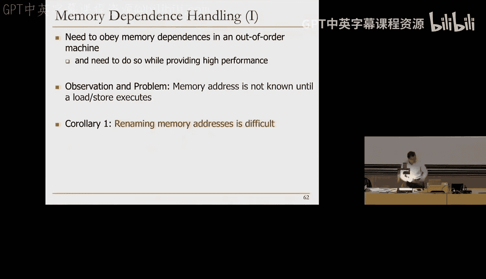
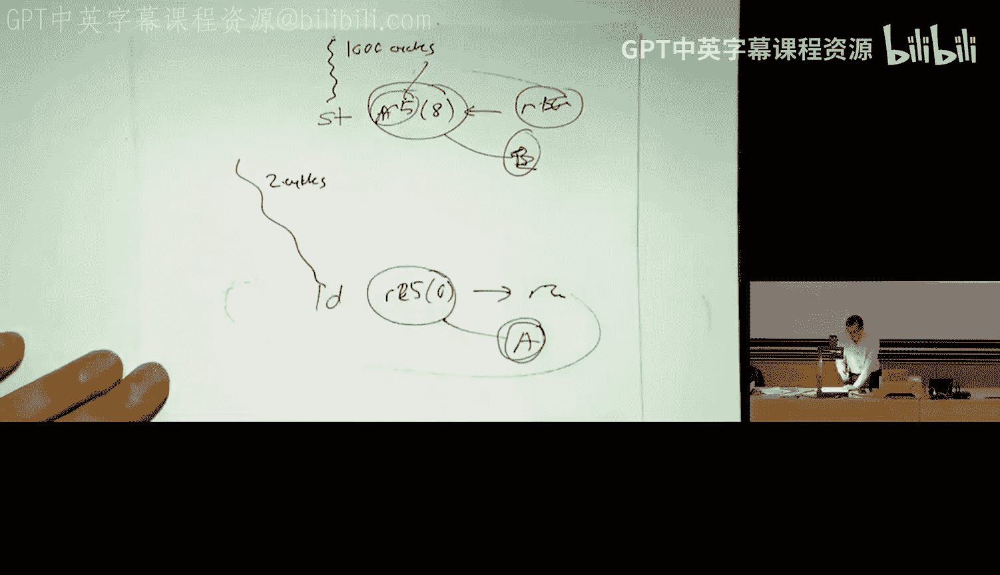
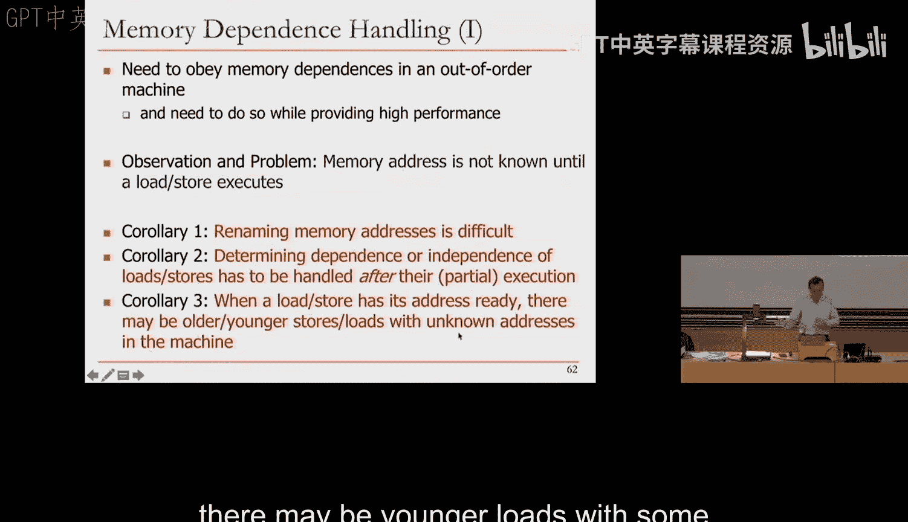
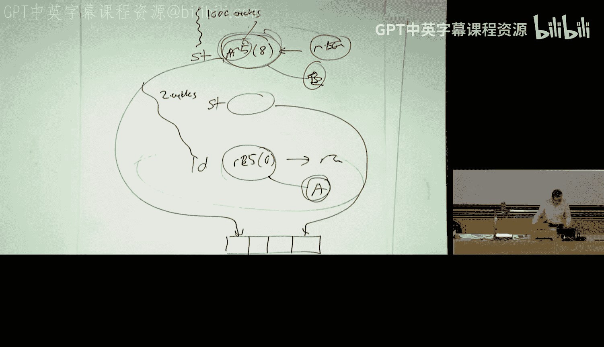
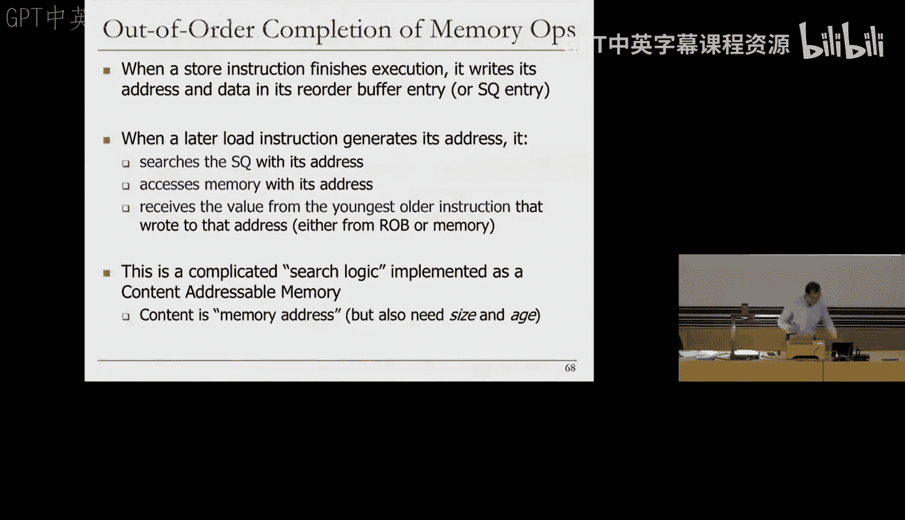
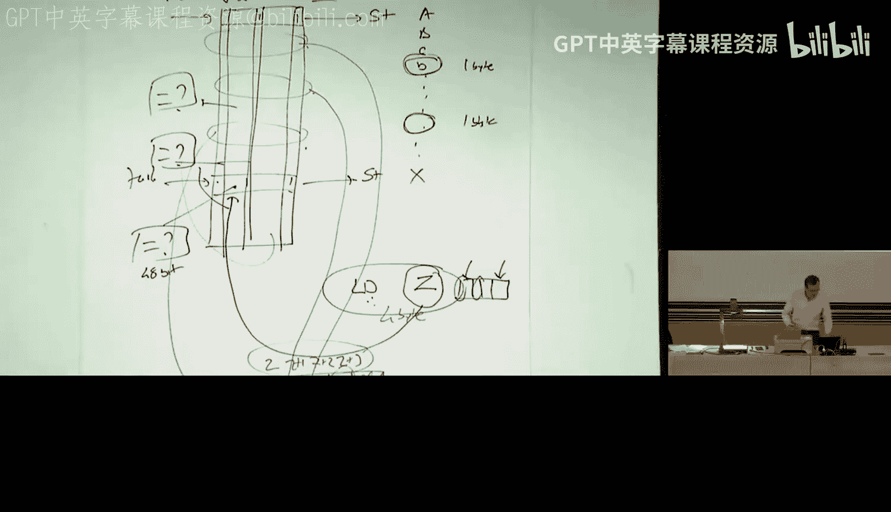
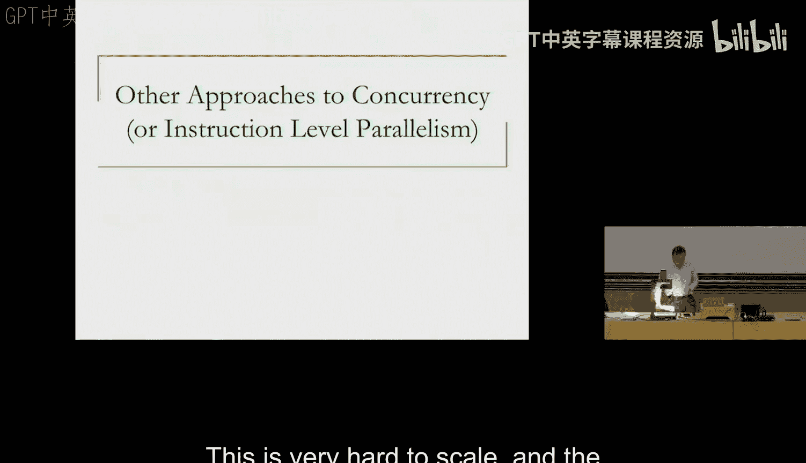

# 15c：乱序执行中的加载-存储处理 (Spring 2025) 🧠

在本节课中，我们将要学习乱序执行引擎中最复杂、最棘手的部分：加载和存储指令的处理。我们将探讨内存操作与寄存器操作的根本区别，理解由此带来的“内存地址未知”问题，并介绍几种处理加载-存储依赖关系的基本方法。

## 概述：内存与寄存器的根本区别

上一节我们介绍了寄存器重命名和乱序执行的基本机制。本节中我们来看看内存操作带来的独特挑战。处理寄存器已经为系统增加了许多复杂性，但这实际上是相对容易的部分。我们将寄存器视为处理器状态的一部分。那么内存呢？内存与寄存器之间存在多个根本性的差异。

第一个差异非常有趣，因为它将导致设计中的大量复杂性和难题。寄存器依赖是**静态**的，意味着你查看一条指令时，它引用了寄存器R3，你就知道它的源和目的。在指令解码后，你可以在流水线前端轻松地进行重命名。

但内存操作则不同。你需要执行指令的一部分，才能获取到内存地址。因此，在流水线开始的解码阶段，你并不知道一条指令的内存地址。这正是我们将要面对的所有难题的根源。

除此之外，内存地址空间很大，而寄存器状态很小。我们通常处理32或64个寄存器，但内存状态是巨大的，地址范围非常广。这进一步加剧了问题的复杂性。

寄存器状态的另一个特点是，在多线程程序中，不同线程通常不共享寄存器，因此无需担心它们。但在当今主流的共享内存多处理器中，内存状态是在不同线程和处理器之间共享的。如果以乱序方式更新内存状态，可能会引发问题，不过我们本来就不希望乱序更新内存状态。我们不会深入探讨这个问题，但这是内存与寄存器的另一个区别。

前两个问题将导致乱序执行中的难题，最后一个问题或许可以处理，但需要学习高级架构课程才能深入理解，那些同样是非常棘手的问题。

## 核心问题：内存地址未知与依赖关系

那么，具体有哪些问题呢？基本上，在一个乱序执行的机器中，你乱序执行指令，不仅需要遵守寄存器依赖，还需要确保内存依赖关系被正确遵守。这意味着一个加载指令可能依赖于一个存储指令，你需要确保加载指令从正确的存储指令获取到正确的值。

我们通过寄存器重命名很好地处理了寄存器依赖。但内存地址不是寄存器地址。寄存器地址在流水线开始时就知道，所以我们可以轻松地重命名到另一个命名空间。而内存地址，直到我们执行指令时才知道。

我们需要在提供高性能的同时做到这一点。这就是问题的核心。**关键观察和核心问题是：加载或存储指令的内存地址直到该指令执行时才知道。**

第一个推论是：因此，内存重命名很困难。你无法在解码阶段进行重命名。如果你真想重命名，必须在指令执行后进行，但这太晚了，因为指令已经乱序执行了。重命名的美妙之处在于，当你进行重命名时，指令是按序的，因此我可以正确地将生产者与消费者联系起来。而对于内存，情况则是一团糟。

让我们通过一个例子来快速说明。假设我们有一段程序，有一条存储指令，它基于寄存器R5和某个偏移量计算出一个地址A，然后将R10的值写入该地址。接着有一条加载指令，基于寄存器R25计算其地址B，并将结果写入某个寄存器。

关键问题是：当加载指令执行时，它生成地址B；当存储指令执行时，它生成地址A。地址A和B是否相同？如果你知道地址A和B，那很好，你可以比较它们。但如果由于乱序执行，加载指令先执行了呢？因为存储指令可能依赖于某个需要1000个周期才能完成的操作，而加载指令可能只依赖于一个需要2个周期的操作。所以加载指令准备就绪，生成了它的地址B。而存储指令还在等待它的源寄存器（例如R5），你根本不知道存储指令的地址是什么，但你又想执行这个加载指令。

这就产生了问题。因为如果地址最终是相同的，你希望加载指令能从存储指令获取值。那么你该怎么办？这就是关键问题。

## 问题的推论与复杂性

本质上，我们刚才展示的情况引出了第二个推论：**确定加载和存储指令之间的依赖或独立性，必须在它们部分执行之后才能处理。** 我说“部分执行”，是因为加载指令需要生成地址，然后从该地址加载值到寄存器。地址生成只是它执行的一部分。下一步是访问内存获取该位置的值。但如果你不知道是否有存储指令要写入那个地址，那么你可能应该等待。

还有第三个推论，这也是我讨论过的：当一条加载指令的地址就绪时，机器中可能存在地址未知的更早的存储指令。反之亦然，当一条存储指令的地址就绪时，机器中可能存在地址未知的更晚的加载指令。当然，第一种情况更为严重。

让我们看看这个例子。基本上，这就是我展示的情况：当这条加载指令的地址已经就绪时，它不知道存储指令是否要写入。更糟糕的是，可能还有另一个存储指令，其地址也未就绪。而且这条加载指令可能读取，比如说，4个字节，其中1个字节来自这里，1个字节来自那里。所以实际情况可能比你最初想象的还要混乱。可能有很多存储指令写入这些位置。因此，你需要正确获取值。

我们不会解决整个问题。我将向你展示问题的复杂性以及一些处理方法。请相信，这是乱序执行引擎中最混乱的部分，也是可扩展性最差的部分。如果你曾认为标签广播逻辑是瓶颈，那你就错了，真正限制可扩展性的是这个逻辑。

## 关键挑战：何时调度加载指令？

那么，关键问题是：**在乱序执行引擎中，何时调度一条加载指令？** 正如所说，问题在于一条更晚的加载指令可能在其前面更早的存储指令地址未知之前，就已经地址就绪了。这也被称为**内存歧义消除问题**或**未知地址问题**。我喜欢“未知地址问题”这个说法，因为它更直观。

处理这个问题有几种方法：
*   **保守方法**：通常对性能非常不利。
*   **激进方法**：与保守方法完全相反。
*   **智能方法**：几乎所有现有机器都采用，本质上更智能。

以下是每种方法的简要介绍：

**保守方法**非常不利于性能。你阻塞加载指令，直到所有前面的存储指令都完成了地址计算。你可以这样做。在这个例子中，有一堆比这条加载指令更早的存储指令，你基本上等待直到它们都计算完地址。无论这需要1000个还是5000个周期，你只是等待。当它们都计算完地址后，现在你就知道了（当然，还需要做一些操作来确定依赖关系）。如果你更保守，甚至可以等到所有存储指令都离开机器（即都已提交并更新了内存）。但这需要更长时间。所以保守方法对性能非常不利。

**激进方法**则完全相反。它基本上是说：我是一条加载指令，我知道我的地址。我假设我独立于任何前面的存储指令。我立即调度这条加载指令。这是一种预测，希望加载指令不依赖于任何存储指令。当然，如果你这样做，之后需要检查预测是否正确。这是机器中预测的一个例子。这种方法通常比保守方法好，但也不是非常完美，并且需要额外的机制来检查。如果你预测错了，就需要重新执行这条加载指令以获取正确的值。如果错了，基本上需要刷新流水线。

**智能方法**是更智能的预测。正如所说，你使用更复杂的预测器来预测加载指令是否依赖于任何地址未知的存储指令。让我们更详细地看看这些方法。

## 处理加载-存储依赖的选项

正如所述，一条加载指令的依赖状态，直到所有前面存储指令的地址都可用时才知道。这里有两个问题：
1.  如何检测一条加载指令对前面存储指令的依赖？
2.  如何根据前面的存储指令来对待加载指令的调度？

对于第一个问题（检测依赖），有两种选择：
*   **选项A**：你等待，直到所有前面的存储指令都提交。在这种情况下，无需检查地址匹配。逻辑简单。
*   **选项B**：你在一个存储缓冲区（也称为存储队列）中保留一个待处理存储指令的列表，并检查加载地址是否与前面存储指令的地址匹配。

对于第二个问题（调度策略），有三种选择：
*   **选项1**：假设加载指令依赖于所有前面的存储指令。
*   **选项2**：假设加载指令独立于所有前面的存储指令。
*   **选项3**：预测依赖关系。

让我们逐一分析调度策略：

**选项1（假设依赖）** 的优点是无需添加任何逻辑，你只需等待所有前面的存储指令完成。但这是真正的保守方法，因为它会不必要地延迟独立的加载指令。在这个例子中，如果这些存储指令需要1000个周期，而这条加载指令已就绪且是独立的，你基本上延迟了它1000个周期。

**选项2（假设独立）** 可能很简单，并且是常见情况。对独立的加载指令没有延迟。但是，如果预测错误，我们需要为恢复付出代价。首先，你需要发现你错了。所以需要一些额外的逻辑来检查：当你发送并执行了这条加载指令后，如果错了，需要某种检查机制。当存储指令计算地址时，它需要检查是否有一条加载指令曾假设独立于它。这很混乱。基本上，它需要恢复并重新执行加载指令。现有的机器在出错时通常会刷新流水线。

**选项3（智能预测）** 是智能选项。你基本上预测一条加载指令是否依赖于一个未完成的存储指令。我不告诉你具体如何做，但有相应的机制。实际上，这曾是一所大学（我不点名）和一些公司之间一场非常著名的法律诉讼的主题，该大学声称他们为这项工作申请了专利。这显然更准确，因为加载-存储依赖关系实际上会随时间持续存在。人们发现，如果一条存储指令写入一个位置，而一条加载指令要读取该位置，例如，当你在循环中回到相同的加载和存储时，这种情况会一次又一次地发生，因此你可以从过去的执行中学习。当然，如果你错了，仍然需要恢复和重新执行。有一些非常有趣的论文，例如关于Alpha 21264的（可选阅读材料），你会看到每当它执行一条加载指令时，最初假设它是独立的。然后判断对错。如果错了，下一次它就说：我不再假设它是独立的，我假设它是依赖的。所以它基本上会随时间学习。

这张图非常快速地展示了保守方法（无推测）、激进方法和理想方法的性能对比。Y轴是指令每周期数，X轴是20世纪90年代人们使用的一些工作负载。如你所见，保守方法确实很差，激进方法稍好一些，但理想方法有巨大的差距。这就是为什么你希望很好地处理这个问题。简单的预测器实际上可以实现大部分潜在性能。

## 加载-存储数据转发与存储队列

我们不会讨论如何进行预测，你可以留待想象。但让我们也谈谈加载和存储之间的数据转发。如果我们不能以乱序更新内存（显然我们甚至不能乱序更新寄存器，因为这会违反顺序语义），这意味着你需要缓冲所有存储和加载指令在指令窗口中。我们知道可以使用重排序缓冲区来实现。

现在，我暂时搁置地址未知的问题。假设我们知道所有前面存储指令的地址，问题仍然复杂。当我们生成加载指令的地址时，仍然有两个问题：
1.  我们如何检查它是否依赖于一个存储指令？（假设你希望调度加载指令，而不想采用保守方法）
2.  如果它依赖于一个存储指令，我们如何将数据转发给加载指令？

为此，你需要一个特殊的数据结构。这些特殊结构通常解耦为**加载队列**和**存储队列**。也可以合并，例如英特尔的Pentium Pro有一个称为内存排序缓冲区的结构。所以，每当你想生成加载指令的地址时，你需要搜索存储队列，以检查是否有你依赖的存储指令，以便决定是否可以调度加载指令。而一条存储指令，当它完成执行（计算其地址）时，会搜索加载队列，看看是否有加载指令依赖于它。第二种情况是预测机制所需要的：如果你预测这条加载指令是独立的并执行了它，但后来存储指令的地址变得可用，那么存储指令需要检查是否有任何加载指令因为被预测为独立于它而获取了错误的值。

即使你不做预测，第一种情况也是需要的，你只是想能够判断这条加载指令是否依赖于某个存储指令，即使假设你知道所有前面存储指令的地址。

所以，当一条存储指令完成执行时，它将地址和数据写入其重排序缓冲区条目或存储队列条目。当一条更晚的加载指令生成其地址时，它基本上用其地址搜索存储队列。我们来看看这个搜索有多糟糕。它用地址访问（搜索）存储队列，并（希望）从写入该地址的最晚的、更早的指令那里接收一个值。

为了做到这一点，你需要复杂的搜索逻辑。还记得我在上一讲中介绍的内容可寻址存储器吗？这是你必须为乱序执行加载和存储而启用的最糟糕的内容可寻址存储器。内容是内存地址，但你还需要其他信息，如大小、年龄等。

## 存储到加载转发逻辑的复杂性

这被称为**存储到加载转发逻辑**。基本上，存储队列是一个按序排列的、机器中所有存储指令的列表。它是一个硬件队列，有头、有尾。每个条目需要包含：有效位、存储地址（可能是64位）、存储的数据值（如果可用，也可能是64位）、数据有效位。当然，你还需要有效位来指示存储地址是否有效、存储数据是否有效。这变得非常有趣和复杂，因为存储指令执行时，如果它还没有计算地址，其地址无效，但数据可能已经就绪（在乱序引擎中）。

假设存储队列中有一些条目，地址分别为A、B、C、D、X。我们有一条加载指令，计算其地址为C。关键问题是：这条加载指令应该从哪里获取值？它需要做的是将地址C与队列中所有地址进行比较。基本上，对于每个条目，你都需要一个比较器。这听起来已经很糟糕了，而且会变得更糟。这是一个64位比较器（假设地址是64位）。实际上我夸大了，普通机器不使用整个64位地址空间，假设是48位，更现实一些。所以是48位地址比较器。

但这还不够。我之前给过一个例子，一个存储写入这里的一个字节，另一个存储写入那里的另一个字节，而这条加载指令读取这两个字节。所以你可能在多个位置匹配。这是第一个观察结果：**这不是单一匹配**。你确实需要在多个位置匹配，并且需要获取写入这些位置的最新存储指令。此外，更复杂的是，你需要确保大小也匹配。基本上，这是一个基于加载地址和大小、以及更早存储指令地址和大小的**范围搜索**，因为你可能与地址部分重叠。这条加载指令可能访问字节8到12，而存储指令可能写入字节11到12。这是一个基于年龄的搜索，你想获取最后写入的值。

除此之外，数据可能来自多个存储指令。假设你加载地址Z、Z+1、Z+2、Z+3（一个4字节加载）。你需要确保找到写入每个位置的所有最新存储指令。你可能找到一个写入这里的，另一个写入那里的，第三个写入那里的。三个存储指令写入了这里，那第四个字节从哪里来？现在你需要从内存访问那个字节，因为没有存储指令写入它。所以，为了获取数据值，你需要搜索存储队列，**同时还需要访问内存**。这就是它成为最复杂部分之一的原因。当然，搜索时可能没有匹配，那么你当然需要访问内存来获取所有数据。因为可能没有任何存储指令写入你正在读取的位置。此时，你需要访问内存。所以这个搜索可能是无用的，但你需要进行搜索以确保为加载指令获取正确的值。

是的，所以存储队列不仅用于检查是否存在风险，也用于数据转发。它有两个功能：判断是否可以调度这条加载指令；以及如果加载指令确实依赖于某个存储指令，则提供值用于数据转发。

## 总结与扩展性限制

我已经讲过了，这是我给出的最后一个例子。有任何问题吗？清楚这个复杂性了吗？我不会在存储到加载转发逻辑上考你们，但你们应该知道，这确实是困难的部分。人们曾尝试扩展指令窗口的大小，他们可以扩展保留站，但扩展这个逻辑非常困难，规模更大、更复杂。我相信现有的处理器可能有一个24项的存储缓冲区，即使指令窗口大小可能是256左右。与其他部分相比，它非常小。你通常受限于可以在机器中放入多少存储指令，正是因为这个原因。所以，如果你在机器中放入大量存储指令，你可能会破坏机器的性能。因此，尽量不在你的机器中存储太多数据。原因基本上就是这个逻辑非常难以扩展，机器不能容纳很多存储指令。

本节课中我们一起学习了乱序执行中加载和存储处理的复杂性。我们了解了内存地址未知带来的核心挑战，探讨了保守、激进和智能三种处理加载-存储依赖的基本方法，并深入分析了实现数据转发所需的存储队列及其复杂的搜索逻辑。理解这部分内容是掌握现代高性能处理器设计关键瓶颈的基础。