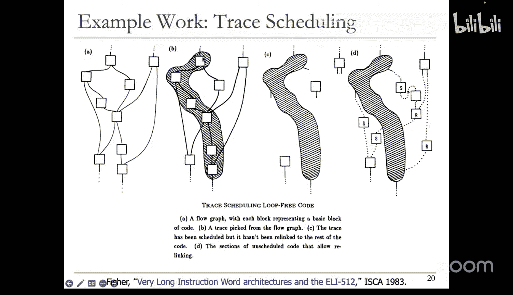
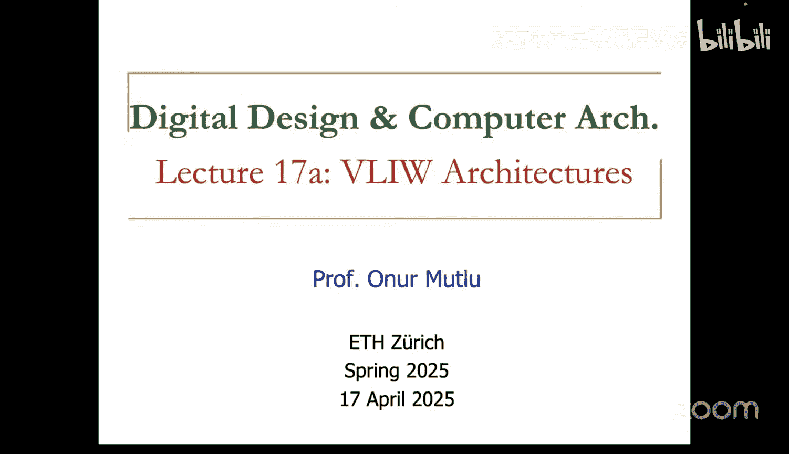
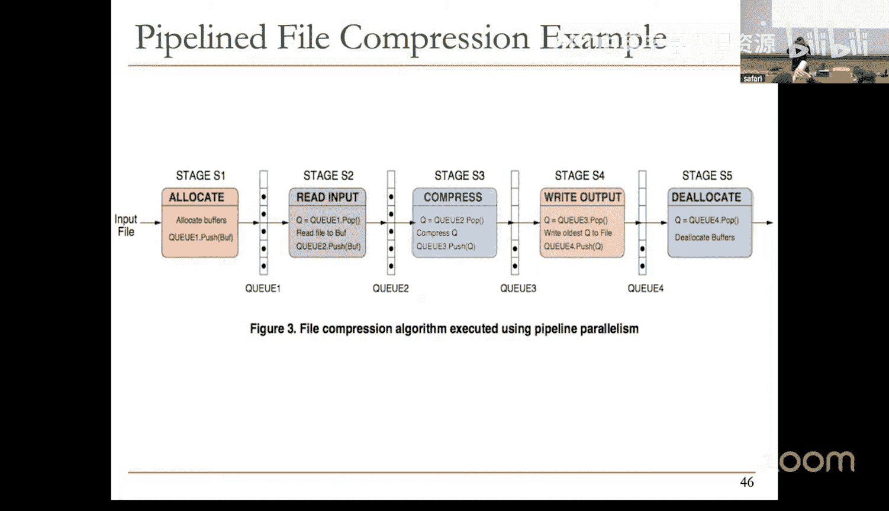

# 17：VLIW与脉动阵列架构 (Spring 2025)

## 概述

在本节课中，我们将学习两种在现代计算机中实际使用的重要架构范式。第一种是超长指令字架构，这是一种通过让软件承担复杂性、硬件保持简单的原则性设计方法。第二种是脉动阵列架构，它是当今许多机器学习加速器的基础。我们将对比这两种范式，理解它们的设计哲学、优势与挑战。

---

## VLIW架构：软件复杂，硬件简单

上一节我们回顾了超标量执行，这是一种硬件密集型的并行方法。本节中，我们来看看一种截然不同的方法：超长指令字架构。

VLIW的核心思想是将寻找指令级并行性的负担从硬件转移到软件。编译器负责分析代码，将多个相互独立的指令打包成一个“超长指令字”捆绑在一起。硬件则简单地获取这个长指令字，并直接将其中的指令分发给对应的功能单元并发执行，无需进行复杂的依赖检查。

以下是VLIW的关键特征：
*   **编译器主导调度**：编译器负责静态地分析指令间的依赖关系，并将独立的指令安排到同一个VLIW指令束中。
*   **硬件简单**：硬件无需进行动态依赖检查、乱序调度或寄存器重命名，从而简化了设计。
*   **指令束锁步执行**：VLIW指令束中的所有指令被视为一个整体。如果其中任何一条指令（例如一个长延迟的访存操作）发生停顿，整个指令束都必须等待。

### VLIW的优势与劣势

VLIW架构的优势主要源于其简单的硬件设计：
*   **硬件复杂度低**：无需动态调度硬件，易于设计、验证，通常功耗更低，可能达到更高频率。
*   **无依赖检查开销**：指令束内的独立性由编译器保证，硬件无需相关电路。
*   **指令直接分发**：编译器知道硬件功能单元的位置，可将指令静态对齐，无需复杂的指令分发网络。

然而，VLIW也面临显著的挑战：
*   **编译器负担重**：需要极其智能的编译器来发掘足够的指令级并行性。
*   **代码膨胀**：当编译器无法找到足够的独立指令填满指令束时，必须插入空操作，导致代码体积增大。
*   **对延迟变化敏感**：编译器难以静态预测可变延迟操作（尤其是可能发生缓存缺失的加载指令）的确切耗时。一旦长延迟操作发生停顿，整个指令束都会停滞，严重限制性能。
*   **软硬件紧耦合**：编译出的代码与特定微架构（如功能单元数量、指令延迟）深度绑定。微架构的改动可能需要重新编译代码才能获得最佳性能。

### VLIW的影响与现状

尽管VLIW在通用计算领域未能成为主流（主要受限于其对可变延迟操作的处理能力），但其思想产生了深远影响：
*   **编译器优化**：为VLIW开发的许多编译器优化技术（如踪迹调度、超块调度）已被现代编译器广泛采用，用于提升超标量处理器的代码性能。
*   **专用领域成功**：在数字信号处理、嵌入式系统和早期的图形处理器中，由于代码行为相对可预测，VLIW取得了成功。
*   **二进制翻译**：Transmeta等公司曾尝试通过软件将x86等复杂指令集动态翻译成VLIW指令，在硬件上执行，以实现简单硬件与复杂软件的平衡。

---

## 脉动阵列架构：数据流驱动的专用计算

上一节我们探讨了VLIW这种通用但软硬件分工特殊的范式。本节中，我们转向一个更专用化的领域：脉动阵列架构。

脉动阵列的设计灵感来源于血液在心脏推动下流经全身的循环系统。其核心思想是构建一个由简单处理单元构成的规则阵列，数据像血液一样，在节奏性的“脉动”中从一个处理单元流向下一个，在流动过程中被逐步处理，最后写回存储器。

### 脉动阵列的基本原理

脉动阵列旨在解决传统处理器中计算与I/O带宽不平衡的问题。在传统模型中，处理器频繁从内存加载数据，处理后再存回，大量时间花在数据搬运上。脉动阵列通过让数据在处理单元间流动并接受多次处理，提高了每次内存访问所完成的计算量。

一个经典的例子是使用一维脉动阵列进行卷积运算。每个处理单元预存一个权重，执行乘加操作。输入数据 `x` 从阵列一端流入，部分结果 `y` 从垂直方向流动。通过精心安排数据输入的时间，当数据流经整个阵列后，就能完成完整的卷积计算。

对于更复杂的操作如矩阵乘法，可以使用二维脉动阵列。例如，在3x3的阵列中，一个矩阵的行从左向右流动，另一个矩阵的列从上向下流动。每个处理单元累加其接收到的两个元素的乘积。当数据流编排正确时，阵列最终会在每个处理单元中生成结果矩阵的一个元素。

### 脉动阵列的优势与适用场景

脉动阵列架构的优势非常突出：
*   **高计算密度与能效**：消除了取指、译码等通用开销，将绝大部分资源和能量用于实际的数据计算。
*   **高效利用内存带宽**：数据在被“重用”于多个处理单元后才返回内存，显著提升了内存带宽的有效利用率。
*   **规则化设计**：由大量相同的处理单元规则连接，设计简单，易于扩展。

其劣势同样明显：
*   **专用性强**：阵列结构和处理单元的功能是针对特定计算模式（如卷积、矩阵乘法）设计的，缺乏通用性。
*   **编程与映射复杂**：需要将算法精心映射到阵列的数据流模式上，对编程和编译器提出了高要求。

### 脉动阵列的现代应用

尽管是几十年前提出的概念，脉动阵列在当今的机器学习时代焕发了新生。谷歌的TPU等机器学习加速器核心就采用了二维脉动阵列来高效执行大规模的矩阵乘法和卷积运算，这正是深度神经网络中最耗时的操作。

此外，脉动计算的思想可以推广为一种“流水线并行”的编程模型。将一个算法划分为多个阶段，每个阶段映射到一个处理单元（可以是一个通用核心），数据像流水一样依次通过各个阶段进行处理。这种模型在视频编码、流处理等应用中非常有效。

---

## 总结

本节课我们一起学习了两种重要的计算机架构范式。VLIW架构尝试通过复杂的编译器和简单的硬件来挖掘指令级并行性，其思想深刻影响了现代编译器技术，并在某些专用领域取得成功。脉动阵列架构则采用了一种数据流驱动的专用硬件设计，通过规则的处理单元阵列和精心编排的数据流动，在保持高能效的同时实现极高的计算吞吐量，已成为现代机器学习加速器的基石。这两种范式展示了计算机架构设计中“权衡”的艺术：在通用性与效率、硬件复杂度与软件复杂度之间寻找不同的平衡点。