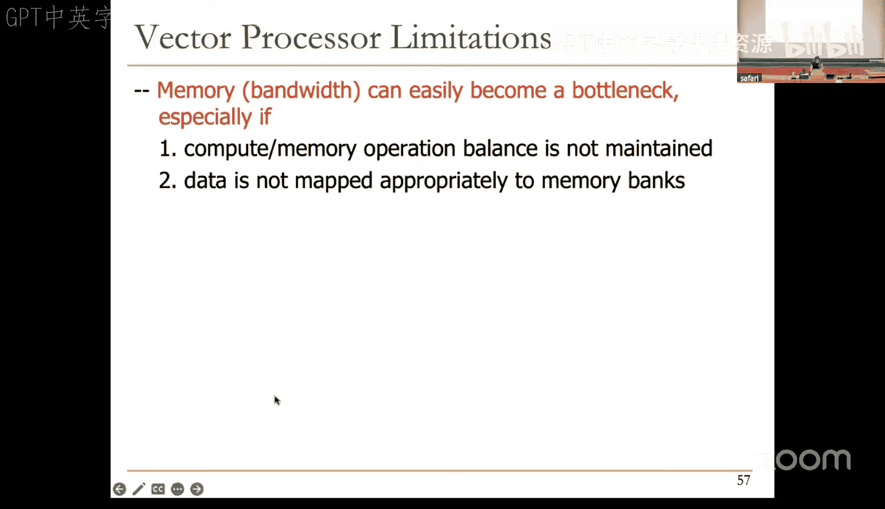
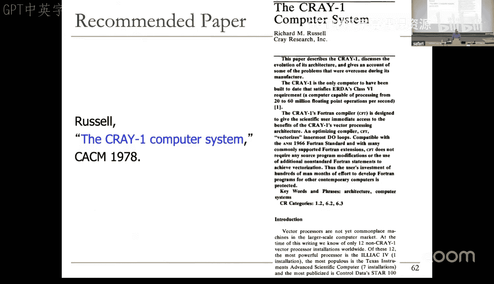
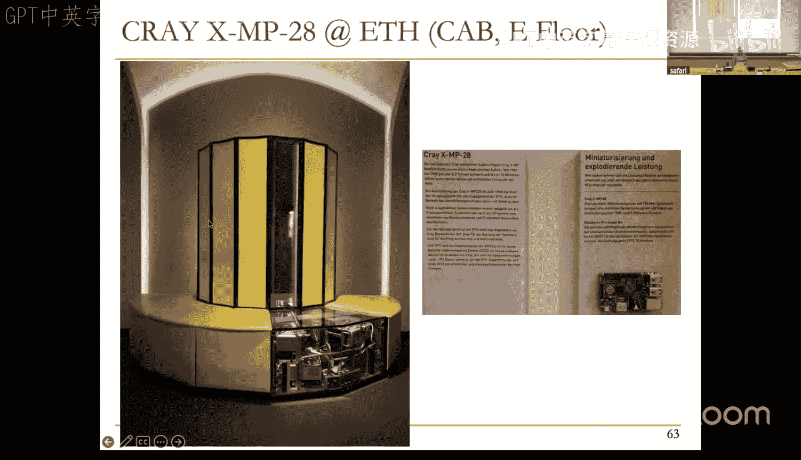
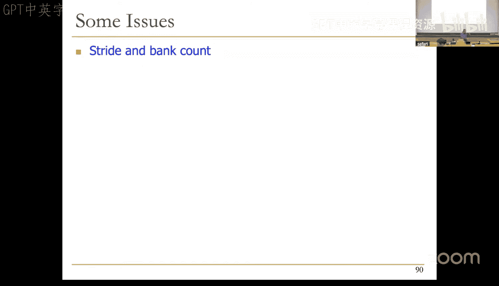

# 18：SIMD架构 (Spring 2025)


## 概述

在本节课中，我们将要学习**单指令多数据**架构。这是计算机体系结构中一个非常基础且重要的主题。当今许多重要的架构，例如作为机器学习应用执行基石的**GPU**，实际上都在实现SIMD范式。我们将探讨SIMD的基本概念、其实现方式（如阵列处理器和向量处理器），并分析其优势与挑战。

---

## 回顾脉动阵列

上一节我们介绍了用于实现加速器的脉动阵列架构。我们以矩阵乘法为例，探讨了数据如何以预定的、有节奏的方式流经功能单元进行计算。

以下是脉动阵列架构的一些**优点**和**缺点**：

**优点**：
*   高能效：作为专用空间架构，能提供很高的效率。
*   数据复用率高：每个数据项被多次使用，减少了对内存带宽的需求，更好地利用了内存带宽。
*   高并发性和规整设计：便于实现。

**缺点**：
*   不擅长利用不规则并行性。
*   专用性强：需要软件和编程支持才能变得更通用。
*   如果问题不匹配，编程会变得困难。

现代实例包括Google的**张量处理单元**，它使用脉动阵列进行矩阵乘法。然而，研究表明，在运行大型机器学习模型时，超过90%的系统能耗花费在片外互连和DRAM上，这凸显了改进内存系统的重要性，并引出了**以数据为中心的计算**范式，即在整个系统的各个部分（如传感器、存储、内存）就近执行计算，以实现更平衡的设计。

---

## SIMD架构：利用数据并行性

现在，让我们转向**SIMD**架构，它专注于开发数据并行性。SIMD代表**单指令多数据**。在深入之前，我们先了解Flynn对计算机的分类法，该分类法基于指令流和数据流的数量：

*   **SISD**：单指令流单数据流。类似于我们见过的标量处理器。
*   **SIMD**：单指令流多数据流。本节课的重点，阵列处理器和向量处理器是典型例子。
*   **MISD**：多指令流单数据流。最接近的形式是脉动阵列处理器。
*   **MIMD**：多指令流多数据流。例如多处理器和多线程处理器。

当今的片上系统通常结合了所有这些范式。

SIMD利用的是**数据并行性**，即对不同的数据片段执行相同的操作，例如向量加法。这与**控制并行性**（执行不同的控制线程）和**数据流并行性**（以数据驱动的方式执行不同操作）形成对比。SIMD也可以被视为一种**指令级并行**。

SIMD的处理范式是：单条指令操作多个数据元素。这可以通过**时间**或**空间**来实现：
*   **阵列处理器**：指令在**同一时间**，使用**不同的空间**（多个处理单元）操作多个数据元素。
*   **向量处理器**：指令在**连续的时间步**，使用**相同的空间**（流水化的功能单元）操作多个数据元素。

为了支持向量操作，我们需要**向量数据寄存器**，每个寄存器可以容纳N个M位的值。此外，还需要**向量长度寄存器**和**向量步长寄存器**来控制操作。

以下是阵列处理器与向量处理器执行一段向量代码的对比示例：
*   **代码**：加载向量 -> 向量加1 -> 向量乘2 -> 存储结果。
*   **阵列处理器**：假设有4个处理单元，每个都能执行所有操作。可以在同一周期并行加载4个元素，下一周期并行执行加法，以此类推。
*   **向量处理器**：假设功能单元是流水化的。第一周期加载元素0，第二周期加载元素1并对元素0执行加法，以此类推。在稳态下，也能达到高吞吐量。

向量处理器通常更易于实现，因此在早期硬件资源有限时更受青睐。而随着集成度提高，阵列处理器也变得流行。现代的GPU则巧妙地结合了这两种范式。

---

## SIMD与VLIW的比较

SIMD阵列处理与**超长指令字**架构有相似之处，但也有关键区别：

*   **VLIW**：在一条长指令中打包多个**独立的**操作，编译器确保它们无依赖，然后发送到不同的处理单元。
*   **SIMD**：单条**相同的**操作应用于多个不同的数据元素。




在SIMD中，只需取指和译码一条指令，其开销可以分摊到众多数据元素上，因此效率更高。VLIW虽然更通用，但其并行性在编译时难以充分利用。对于向量运算等规则并行性应用，SIMD处理非常有效，这也是其如今成功的原因之一。


---

## 深入向量处理器

向量是一维的数字数组。向量处理器是其指令操作于向量而非标量值的处理器。基本要求包括：
*   加载和存储向量 -> 需要**向量寄存器**。
*   操作不同长度的向量 -> 需要**向量长度寄存器**。
*   支持非连续内存访问 -> 需要**向量步长寄存器**。

**步长**是指向量中连续元素在内存地址上的间隔。例如，在行主序存储的矩阵中，访问一行元素步长为1，访问一列元素步长则为列数。硬件需要支持不同的步长。



向量指令在连续周期内对每个元素执行操作。向量功能单元是流水化的。向量指令允许更深的流水线，因为**向量内部没有数据依赖**，也**没有控制流**，并且内存访问模式高度规则，便于地址计算。



---

## 向量处理器的性能与内存瓶颈

让我们通过一个具体的循环例子来比较标量实现和向量实现的性能。

**标量代码**（循环50次）：
```
for (i=0; i<50; i++) {
    C[i] = (A[i] + B[i]) / 2;
}
```
在顺序标量处理器上执行，假设内存访问延迟为11周期，总共需要约1504个周期。

**向量化代码**：
```
VL = 50        // 设置向量长度
VS = 1         // 设置步长
V0 = load(A)   // 向量加载
V1 = load(B)   // 向量加载
V2 = add(V0, V1) // 向量加
V3 = shr(V2, 1)  // 向量右移1位（除以2）
store(V3, C)   // 向量存储
```
动态指令数从标量的304条减少到向量的7条。在向量处理器上执行，假设无链接、单内存端口、16个存储体，执行时间减少到285个周期。

性能可以通过**向量链接**（类似数据前推）进一步提升。如果还假设有多个内存端口，执行时间可降至79个周期，相比标量代码有约19倍的性能提升。

然而，**内存带宽很容易成为SIMD架构的瓶颈**。一个向量加载指令可能请求海量数据，内存系统必须能提供足够的带宽来供给处理流水线，否则处理单元就会空闲等待。这凸显了平衡计算与内存操作的重要性。

为了维持每个周期一个元素的吞吐量，需要采用**存储体交错**的内存设计。将内存划分为多个可以独立访问的**存储体**，共享地址和数据总线。如果连续访问的元素分布在不同的存储体上，就可以实现并发访问。条件是：**存储体数量 > 存储体访问延迟**。否则会发生存储体冲突，降低效率。现代GPU的高带宽内存就采用了高度存储体化的设计。

---

## 处理复杂情况

在实际应用中，向量处理会遇到一些复杂情况：

1.  **向量长度 > 寄存器长度**：采用**条带挖掘**技术。将循环分解，每次迭代处理一个向量寄存器长度的数据，最后一次迭代调整向量长度。

2.  **非连续内存访问（间接寻址）**：使用**聚集**和**散播**操作。
    *   **聚集**：根据索引向量，从内存的非连续位置收集数据到向量寄存器。
    *   **散播**：将向量寄存器中的数据根据索引向量，散播到内存的非连续位置。
    这对于处理稀疏矩阵非常有用。

3.  **条件执行**：使用**向量掩码**实现谓词执行。
    *   方法一：执行所有操作，但根据掩码值决定是否写回结果。实现简单，但可能浪费计算。
    *   方法二：先扫描掩码，只对掩码非零的元素执行操作。当掩码中零值较多时更高效。
    向量掩码寄存器用于控制哪些向量元素参与操作。

---

## 总结



本节课我们一起学习了**SIMD架构**的核心内容。我们了解到SIMD通过单条指令操作多个数据元素来开发数据并行性，主要有**阵列处理器**（空间并行）和**向量处理器**（时间并行/流水线）两种实现方式。我们探讨了向量处理器所需的硬件支持（如向量寄存器、长度/步长寄存器），并通过实例分析了其性能优势及内存带宽带来的挑战。我们还学习了如何处理向量长度溢出、不规则访问和条件执行等复杂情况。SIMD范式因其高效性，已成为现代许多高性能计算架构（如GPU）的基石。理解SIMD的原理，有助于我们更好地理解当今复杂的计算系统。