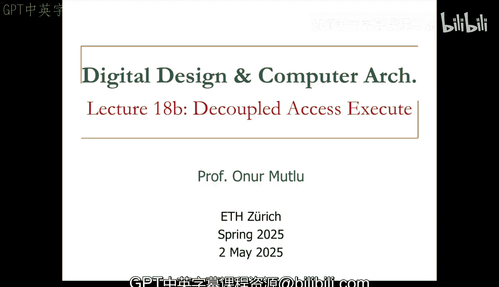
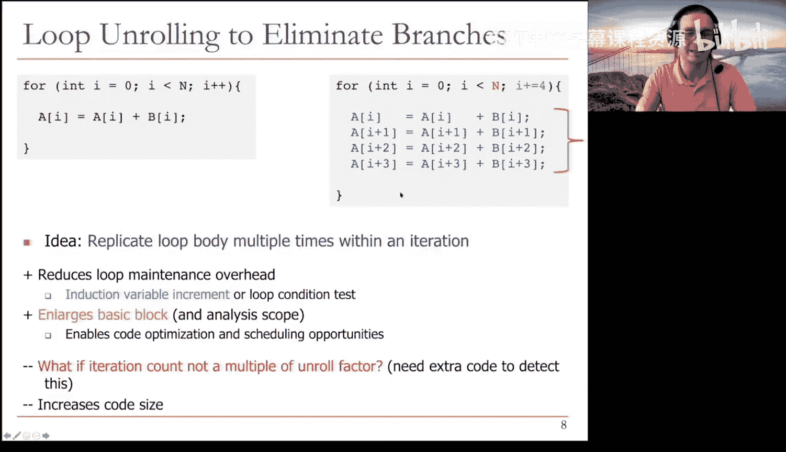
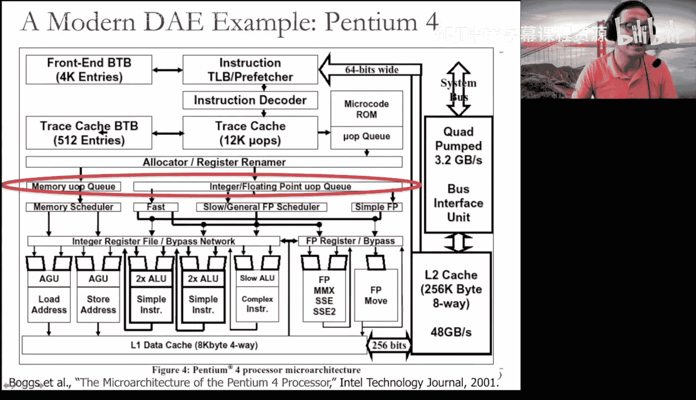
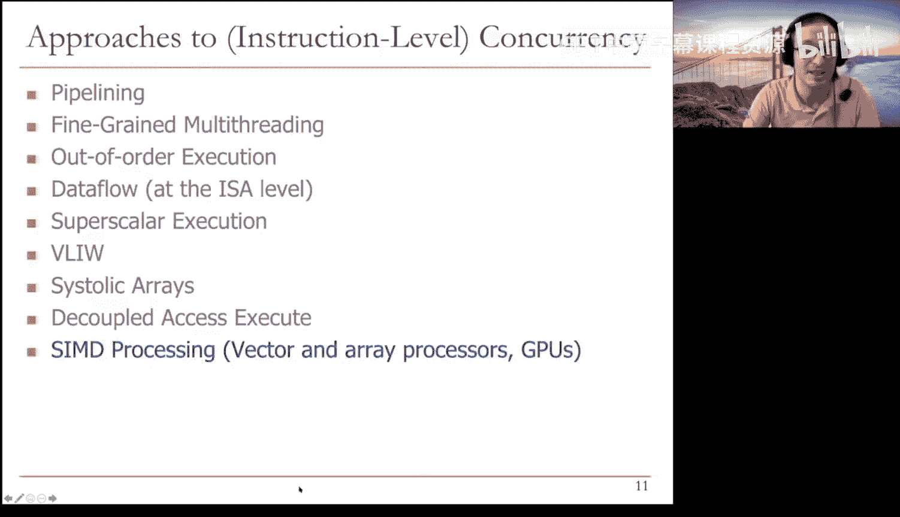
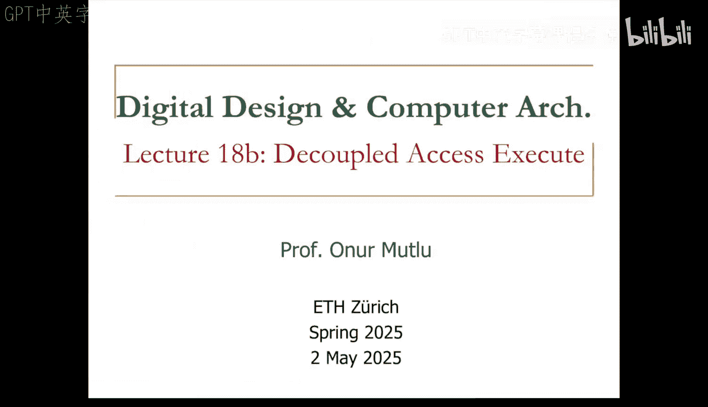

# 18b：解耦访存-执行架构 (Spring 2025) 🧠

在本节课中，我们将要学习一种名为“解耦访存-执行”的处理器设计范式。这种架构旨在通过分离内存访问和计算执行来提升性能，同时避免传统乱序执行带来的硬件复杂性。

## 概述 📋

解耦访存-执行架构的基本思想非常简单。其核心是将单一指令流拆分为两个独立的指令流：一个负责内存访问，另一个负责计算执行。这两个处理器通过指令集架构可见的队列进行通信。这种设计允许访存单元和计算单元异步工作，从而隐藏内存访问延迟，提高整体效率。

## 基本思想与动机 💡

上一节我们概述了DAE架构。本节中，我们来看看其具体思想和设计动机。

其动机源于Tomasulo算法过于复杂，难以在早期（如1980年代奔腾Pro之前）实现。人们希望系统不要如此复杂。VLIW架构也面临类似情况，其设计哲学与乱序执行截然不同。DAE架构拥有与VLIW相似的设计哲学，但并未在硬件上走到极致。

DAE架构的硬件改动相对简单。其核心思想是**解耦操作访问（或内存访问）与执行（计算）**。我们拥有两个独立的指令流，它们通过ISA可见的队列进行通信，这就是基本思想。

一个解耦的访存-执行系统看起来是这样的：你有一个访存处理器和一个执行处理器。访存处理器的任务仅仅是获取内存数据并供给执行处理器。执行处理器的任务则是将其所需的内存地址提供给访存处理器。它们基本上通过这些队列进行通信。

这在某种意义上非常巧妙，因为这是两种不同类型的任务。内存访问可能受限于内存带宽，而计算可能不会成为瓶颈。因此，你可以在等待内存的同时继续进行计算。反之亦然，有时你可能在等待长时间的计算，但可以继续进行内存访问。这样，无需实现完整的乱序执行，你就能在访存操作进行时，访存与执行处理器之间无需停顿，可以继续执行计算，反之亦然。这正是其美妙之处。

该架构由Jim Smith在1982年的开创性论文中提出，其基本原理至今仍应用于计算系统中，尽管形式不完全相同。

## 架构详解与优势 ⚙️

理解了基本思想后，我们深入探讨其具体实现和带来的好处。

首先，你可以看到ISA需要在此改变，因为通信通过这些队列进行。这些是FIFO队列，它们是指令集架构可见的。因此，队列的长度决定了你能容忍的内存端和执行端的延迟量。这些队列的好处在于它们具有很高的可扩展性，不像重排序缓冲区的标签匹配逻辑或保留站那样难以扩展。负载存储队列也难以扩展，而这里的队列是可扩展的，因为它们是FIFO队列。还有一个分支队列，因为你需要保持这些流的同步，但基本上所有这些都是FIFO队列。

本质上，基本思想是：与其拥有一个像这样的单一指令流（这是一个非常著名的循环，Livermore循环，用于科学计算），你基本上拥有两个指令流：访存流和执行流。它本质上在做同样的事情，但每当需要进行内存访问时，你在访存流中进行；每当需要进行操作执行和分支时，你在执行流中进行；每当需要将内存访问结果传递给执行处理器时，你需要将其放入“访存到执行”队列。你可以看到这些内存访问进入该队列，而执行引擎从该队列取出数据，并可能将结果放入“执行到访存”队列。通信就是通过这些队列进行的。

以下是DAE架构的主要优势：

*   **异步执行**：执行流可以领先于访存流运行，反之亦然。如果访存处理器在等待内存，执行处理器可以执行有用的工作。如果访存处理器（例如）缓存命中且无需等待内存，它可以为落后的执行处理器提供数据。通常内存访问耗时更长，因此执行单元通常可以在访存处理器等待时，独立执行有用的指令。
*   **简化硬件**：关键思想是队列减少了对大量寄存器的需求。这些不是寄存器，你不需要像乱序执行引擎那样拥有数千个寄存器或内部物理寄存器文件。通信通过这些FIFO队列进行。因此，你基本上获得了有限的乱序执行能力，但没有唤醒和选择逻辑的复杂性，也无需庞大的物理寄存器文件。

## 面临的挑战与编译器的角色 🔧

当然，任何设计都有其缺点。现在，编译器在这里变得非常重要。编译器对VLIW很重要，对Tomasulo算法很重要，对解耦访存-执行架构也很重要。

你需要编译器支持来划分程序和管理队列。这决定了你能获得多大程度的解耦。人们为此开发了许多有趣的编译技术，虽然不如VLIW那么多，也不如如今在脉动阵列上的工作那么多，但编译器仍然很重要。

另一个缺点是分支指令需要在访存处理器和执行处理器之间进行同步。因为你实际上是将一个单一指令流分离成两个指令流，那么分支会怎样？它们会在执行处理器中执行，但你需要通知访存处理器，以确保访存处理器不会永远走在错误的路径上，对吗？

还有一个缺点是多重指令流。基本上，你需要生成或编写两个指令流，这可能很繁琐。但后来的研究表明，这可以通过动态地将单一指令流分流到多个处理器来实现。

## 实例分析：Alewife处理器 🖥️

这是一个具体的例子。这是Alewife处理器，他们所做的是：拥有一个单一的指令取指单元，然后动态地将其分离成一个访存处理器（访存指令流水线）和一个执行处理器（执行指令流水线）。每个流水线都是顺序执行的，这一点非常重要。每个流水线内部都是简单的顺序执行，没有乱序执行。乱序执行的能力来自于一个指令流水线异步于另一个指令流水线工作，直到它需要来自那个流水线的数据。你可以看到有访存寄存器和执行寄存器，以及需要在两个流之间通信的队列。你还可以看到有多个指令流，还有一个复制单元，可以将操作从一个流水线复制到另一个流水线。他们添加了一些有趣的通信机制。存储和加载操作一如既往地存在问题，我不打算深入细节。但如果你真的感兴趣，这些论文实际上对解耦访存-执行范式提供了非常易懂且精彩的描述。你还可以看到一个重启/停止单元，用于处理分支。

## 循环展开：一项关键的编译技术 🔄

分支处理是一个大问题。因此，许多编译器使用循环展开来消除分支。循环展开在一个迭代内多次复制循环体。你可能已经学过循环展开，我不得不提一下，因为它是一项非常基本的编译器技术，旨在尽可能消除分支，因为分支在VLIW、解耦访存-执行以及脉动阵列中总是带来问题。你希望尽可能减少真正的分支。

循环展开的思想是在一个迭代内多次复制循环体，正如你在这里看到的。当然，现在你在一个原始迭代内做了四次迭代的工作，所以你需要确保正确地递增数值，这实际上会成为一个问题。但如果你这样做，你现在就不需要执行那么多分支，不需要执行那么多循环控制指令等等，从而减少了循环维护的开销。归纳变量的递增或循环条件测试会消失或减少（在这个例子中减少了四分之三）。

你扩大了基本块。现在我们这里有一个更大的基本块，而不是这里单一的指令集。这为代码优化和调度创造了机会。问题通常发生在迭代次数不是展开因子的倍数时。在这个例子中，展开因子是4，你将四次迭代放入一个原始迭代中。但如果n不是4的倍数，你就会遇到问题，需要额外的代码来检测和处理这种情况，这最终会增加代码大小。但循环展开是一项非常简单的基于编译器的技术，有助于我们今天讨论的所有处理器，解耦访存-执行是其中重要的一员。他们在讨论解耦访存-执行时也大量谈及循环展开，它提高了Alewife处理器的性能。对于未来，尤其是如果你对编译和硬件等主题感兴趣，思考这一点很重要，因为这是一项非常基本的编译机制。

## 现实影响与现代应用实例 🚀

现在，让我为你展示解耦访存-执行在真实处理器中的影响，然后我们就结束。基本上，正如所描述的，它并不完全以原样应用于现有处理器，但原则上，解耦访存-执行的思想在我所知的一些旧处理器中得到了应用。

例如，这是奔腾4处理器的内部结构。我不会详细讲解这里的所有内容，但我会指出这一部分：在指令被重命名并分配到重排序缓冲区（例如和寄存器）之后，它们会经过一个内存部分和一个执行部分。你可以看到这就是解耦。你有一个处理器的内存部分和一个执行部分，它们彼此解耦，使得内存部分专为内存操作定制，执行部分专为执行操作定制。即使是在像这样的乱序处理器中（这是一个乱序执行超标量处理器），你也能看到它解耦了访存和执行。这样，你可以在不同组件之间获得专业化，并且基本上在这些不同组件之间获得不同的乱序执行能力，它们不会相互干扰。

如果你想看奔腾4的简化视图，这实际上是另一种看待它的方式。你可以看到内存和整数执行的解耦。这来自我的论文，是对奔腾4中解耦访存-执行的一个更简单的看法。你实际上可以将这个概念扩展到不同类型的执行，例如浮点执行和整数执行。

## 总结与展望 🎯

本节课中，我们一起学习了三种主要的设计思想：VLIW、脉动阵列和解耦访存-执行。解耦访存-执行架构通过分离访存和计算流，利用队列进行通信，在简化硬件复杂性的同时，有效地隐藏了内存延迟。它需要编译器的重要支持，并面临分支同步等挑战。其思想在现代处理器（如奔腾4）的设计中仍有体现。思考这些架构在未来可能的应用场景也很有价值。

关于是否可以将DAE与VLIW结合使用，这是一个极好的问题。我的高层回答是：是的。基本上，如果你能结合VLIW的思想（当然需要放弃一些基本的VLIW原则），你可以将VLIW指令束的一部分作为内存束，另一部分作为执行束，绝对可以在VLIW指令的不同部分之间解耦访存和执行。这样，你摆脱了锁步执行，同时在VLIW引擎中也获得了部分乱序执行的好处。这正是我喜欢将这些主题放在一起讲解的原因，因为VLIW的一些缺点可以通过应用解耦访存-执行的原则来缓解。这样，你不会使硬件过于复杂（虽然需要稍微复杂一点，需要稍微偏离VLIW原则），但能获得显著更高的性能潜力。

希望你们喜欢我们讨论的这三种主要思想。下周我们将讨论另一个迷人且极具影响力的主题：向量处理器和GPU。届时再见，保重，注意安全。