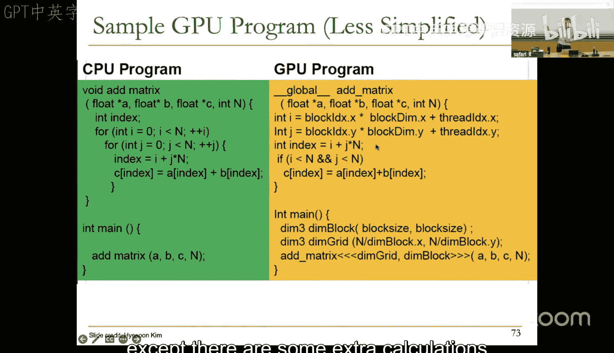
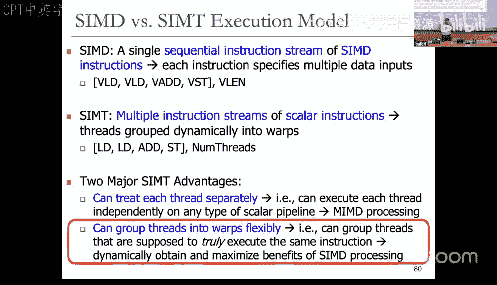

# 19：GPU架构（2025春季）🎮

## 概述
在本节课中，我们将学习GPU架构。我们将从回顾单指令多数据（SIMD）处理开始，探讨其与内存系统的交互，然后深入探讨现代GPU如何将SIMD执行模型与单程序多数据（SPMD）编程模型相结合，以实现大规模并行计算。

---

## 回顾SIMD处理

上一节我们介绍了多种执行范式。本节中，我们来看看SIMD处理，它专注于利用规则的数据并行性。

SIMD的核心思想是：一条指令同时对多个数据元素执行相同的操作。我们之前讨论过两种主要的SIMD处理器类型：阵列处理器和向量处理器。

*   **阵列处理器**：在同一时间、不同的处理单元上，对不同的数据元素执行相同的操作。其优势是并行度高。
*   **向量处理器**：在同一空间（功能单元）、不同的时间点上，对数据元素执行相同的操作。其优势是硬件设计更节省。

现代GPU实际上是这两种范式的结合体。

### 内存系统的重要性

为了实现SIMD处理的高吞吐量，内存系统至关重要。无论是阵列处理器（同时发起多个内存访问）还是向量处理器（每个周期发起一个访问），都需要内存能够支持并发访问。

**内存分体**是解决这个问题的关键技术。通过将内存划分为多个可以独立访问的“体”，我们可以同时或流水线式地服务多个内存请求。

**核心概念**：为了维持每个周期一个数据元素的吞吐量，程序访问数据的**步长**和内存的**体数量**最好是互质的。否则，可能会发生**体冲突**，导致访问延迟增加。

**示例**：假设有16个体，步长为16。如果数据布局使得每第16个元素都映射到同一个体，那么所有访问都会冲突，无法实现高吞吐量。

以下是减少体冲突的一些方法：
*   增加体的数量。
*   改进数据布局以匹配访问模式。
*   使用更优的地址到体的映射函数（例如，使用哈希或随机化）。

---

## 结合阵列与向量处理

现代SIMD处理器通常结合了阵列和向量处理的优点，在空间和时间两个维度上同时开发并行性。

考虑一个向量加法 `C = A + B`。假设我们有4个功能单元（即4个“通道”），向量长度为32。

**执行过程**：
1.  第一个周期，通道0-3分别计算元素0、1、2、3。
2.  第二个周期，通道0-3分别计算元素4、5、6、7。
3.  以此类推。

这样，我们在空间上（4个通道并行）和时间上（8个周期流水）都实现了并行。为了支持这种架构，向量寄存器文件通常被分区，每个通道只能访问分配给它的那部分寄存器元素。

---

## SIMD在现代指令集架构中的应用

SIMD思想也被应用到了通用处理器中，通常以**SIMD指令集扩展**的形式出现，例如x86的MMX、SSE、AVX等。

这些指令允许将单个寄存器视为包含多个较小数据元素的“打包”寄存器，并对它们同时执行操作。

**核心概念**：例如，一条32位的打包加法指令，可以将寄存器视为4个8位整数，并同时完成4次加法。这非常适合于图像处理、多媒体等规则并行计算。

**示例 - 图像合成**：假设要将一幅人像（背景为蓝色）与另一幅花朵背景图像合并。使用SIMD指令可以高效地完成：
1.  用打包比较指令，一次性比较多个像素是否等于蓝色，生成掩码。
2.  用打包与指令，根据掩码从花朵图像中提取需要替换的像素。
3.  用打包与非指令，从人像中提取需要保留的像素。
4.  用打包或指令，将两部分像素合并。

这个过程可以一次性处理多个像素（例如8个），显著提升性能。GPU的思想就是将这种并行性扩展到极致。

---

## GPU架构：SIMD与SPMD的结合

GPU是SIMD处理最成功的案例之一。但其独特之处在于，它将SIMD硬件执行模型与SPMD编程模型相结合。

### 编程模型 vs. 执行模型

首先，区分两个概念：
*   **编程模型**：程序员如何表达代码（如顺序、多线程、数据并行）。
*   **执行模型**：硬件如何执行代码（如乱序执行、向量处理）。

GPU的编程模型是**单程序多数据（SPMD）**。程序员编写一个内核函数，并指定启动成千上万个线程，每个线程处理不同的数据。硬件执行模型则是**SIMD**。

### 线程、线程块与线程束

GPU的编程层次：
1.  **线程**：最基本的执行单元。
2.  **线程块**：一组线程，可以协作（通过共享内存）。
3.  **网格**：由多个线程块组成。

硬件执行的关键是**线程束**。线程束是一组（例如32个）执行相同指令的线程，由硬件动态分组。一个线程块会被划分为多个线程束。

**核心概念**：GPU的着色器核心本质上是一个SIMD流水线。它从就绪的线程束池中选择一个线程束，取指、译码（只需一次，因为指令相同），然后将该指令分发到多个通道（SIMD单元）上执行，每个通道处理一个线程的数据。这实现了**单指令多线程（SIMT）** 的执行。

### 细粒度多线程与延迟隐藏

GPU使用**细粒度多线程**来隐藏访存等长延迟操作。
*   当一个线程束因缓存未命中而停顿等待数据时，调度器会立即切换到另一个就绪的线程束执行。
*   由于有大量线程束可供切换，计算单元得以保持忙碌，从而容忍了高访存延迟。

这使得GPU无需复杂的乱序执行或分支预测机制，就能实现高吞吐量。

### 与传统SIMD的对比

| 特性 | 传统SIMD | GPU (Warp-based SIMD) |
| :--- | :--- | :--- |
| **线程模型** | 单线程 | 多标量线程 |
| **执行方式** | 锁步执行 | 线程可独立处理（如分支） |
| **编程模型** | 显式SIMD指令 | SPMD（标量线程） |
| **向量长度** | 软件需知晓/设置 | 无此概念，只有线程数 |
| **指令集** | 包含SIMD指令 | 标量指令集，SIMD由硬件动态形成 |

GPU模型的优势在于**编程更简单**。程序员只需思考如何将问题分解为大量并行线程，而无需关心底层硬件的SIMD宽度。硬件负责动态地将标量线程聚合成SIMD操作（线程束）来执行。

---

## 总结

本节课中我们一起学习了：
1.  **SIMD处理的核心原理**：通过单指令操作多数据来开发规则并行性，包括阵列与向量处理的区别与结合。
2.  **内存系统对SIMD的关键性**：体冲突问题及其缓解方法。
3.  **SIMD在通用处理器中的体现**：SIMD指令集扩展及其应用。
4.  **GPU架构的精髓**：将**SPMD编程模型**（易于编程）与**SIMD硬件执行模型**（高效执行）相结合。通过**线程束**和**细粒度多线程**，GPU能够动态组织大量线程，在简单的流水线上实现极高的吞吐量和延迟容忍度。

GPU的成功表明，通过巧妙的软硬件协同设计，将合适的编程模型映射到高效的计算范式上，可以极大地推动计算性能的发展。下一节，我们将继续探讨GPU中更复杂的部分，例如线程束如何处理分支。