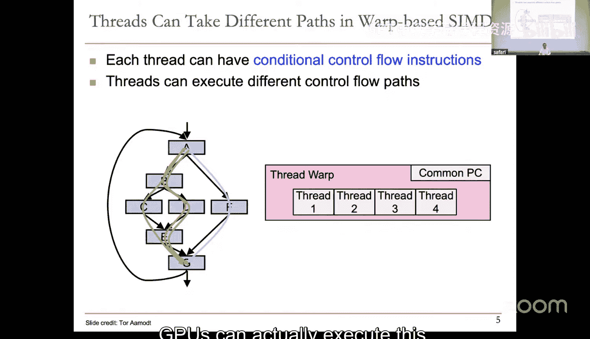

# 20：GPU架构II与内存概述及技术


## 概述
在本节课中，我们将完成对GPU架构的讨论，并开始学习计算机系统中至关重要的内存部分。我们将首先探讨GPU如何高效执行具有分支的程序，然后理解为什么内存是现代计算系统中最主要的性能瓶颈。

## GPU架构回顾与分支执行

上一节我们介绍了GPU的SPMD编程模型及其SIMD硬件执行方式。本节中，我们来看看当程序中出现条件分支时，GPU是如何处理的。

GPU将多个执行相同程序的线程（称为“线程束”或“warp”）分组，并一次性对它们执行相同的指令。然而，如果线程束中的线程在运行时遇到分支并走向不同的控制流路径，就会发生“线程发散”。

### 线程发散与执行
当线程束中的线程执行到分支指令时，可能出现三种情况：
1.  所有线程都选择相同的路径（例如，都执行`if`块或都执行`else`块）。这是最理想的情况，硬件可以继续高效地执行整个线程束。
2.  部分线程选择一条路径，另一部分线程选择另一条路径。此时，GPU硬件会**串行化**执行这些路径。
    *   硬件首先为选择第一条路径的线程启用执行，同时让选择另一条路径的线程**空闲等待**。
    *   当第一条路径执行完毕后，硬件再切换为选择第二条路径的线程执行。
    *   这会导致硬件利用率下降，因为部分执行单元在等待期间是闲置的。
3.  线程束中的线程走向多个不同的路径。这种情况效率最低，通常需要更复杂的调度或导致显著的性能损失。

### 核心概念示例
考虑一个简单的分支代码：
```c
if (thread_id % 2 == 0) {
    // 路径 A：偶数线程执行
    result = data[thread_id] * 2;
} else {
    // 路径 B：奇数线程执行
    result = data[thread_id] + 10;
}
```
在一个包含偶数与奇数线程的线程束中，硬件会先执行所有偶数线程的`路径A`，然后执行所有奇数线程的`路径B`。

## 内存的重要性与瓶颈

现在，让我们从GPU的计算核心转向另一个关键组件：内存。理解内存至关重要，因为它是现代计算系统中**最主要的性能瓶颈**。

### 为什么内存是瓶颈？
处理器（CPU或GPU）的运算速度在过去几十年里飞速提升，但内存速度的提升却相对缓慢。这导致了“内存墙”问题：处理器经常需要停下来等待数据从内存中读取或写入，其等待时间可能远远超过执行计算本身所需的时间。

性能公式可以简化为：
**程序执行时间 = 计算时间 + 数据访问延迟**

在许多现代应用中，尤其是数据密集型的科学计算、图形处理和机器学习中，**数据访问延迟**占据了总执行时间的主导部分。

### 内存技术概述
为了缓解内存瓶颈，计算机系统采用了复杂的分层内存结构。以下是一些关键的内存技术层级：

1.  **寄存器**：位于处理器内部，速度最快，容量最小，用于存储当前正在计算的临时数据。
2.  **高速缓存**：分为多级（L1， L2， L3），速度接近处理器，用于存储处理器近期或即将用到的数据和指令。
3.  **主内存**：通常指动态随机存取存储器，容量大，但速度比缓存慢得多。它是程序运行时数据的主要存放地。
4.  **存储设备**：如固态硬盘和机械硬盘，用于永久存储数据和程序，速度最慢，但容量最大。

这个层次结构的目标是，以合理的成本，为处理器提供尽可能接近其速度的大容量数据存储。



## 总结
本节课中我们一起学习了两个核心内容。首先，我们深入了解了GPU执行包含分支的SPMD程序时的机制，特别是线程发散对执行效率的影响。其次，我们开始了对内存系统的学习，明确了内存访问延迟是当前计算系统最主要的性能瓶颈，并简要介绍了分层内存结构的基本概念。在接下来的课程中，我们将更详细地探讨各种内存技术及其工作原理。