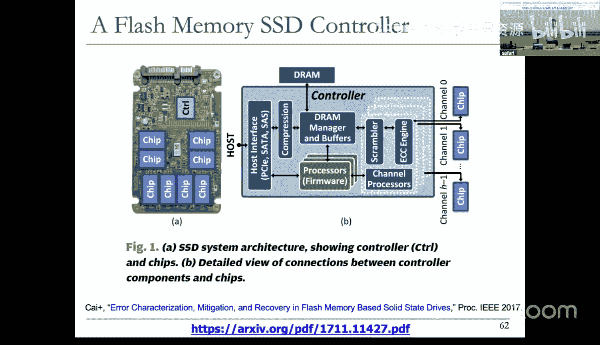
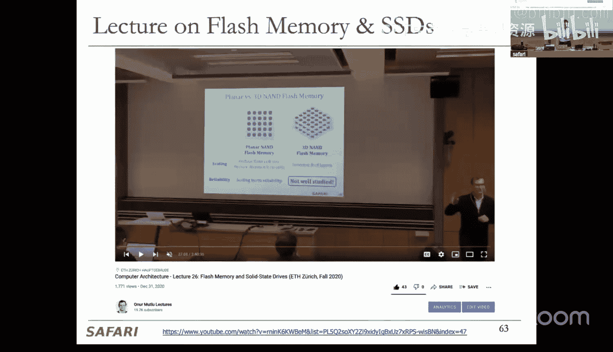
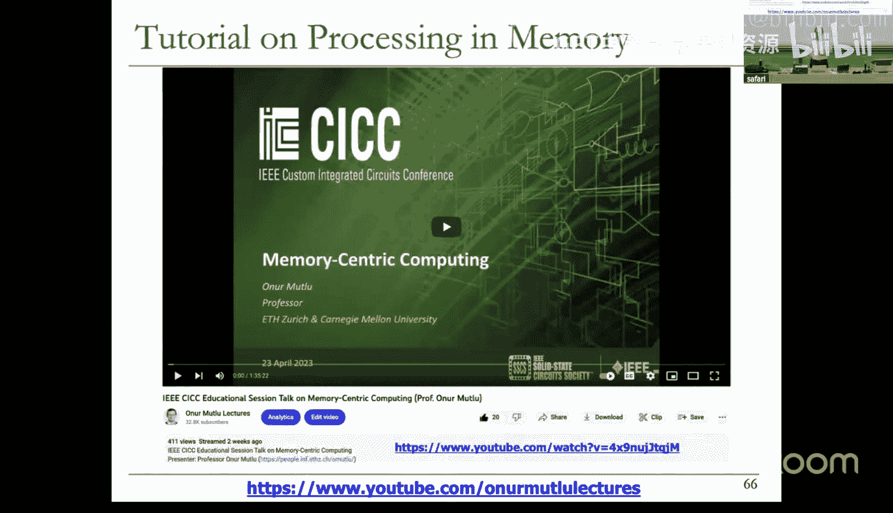
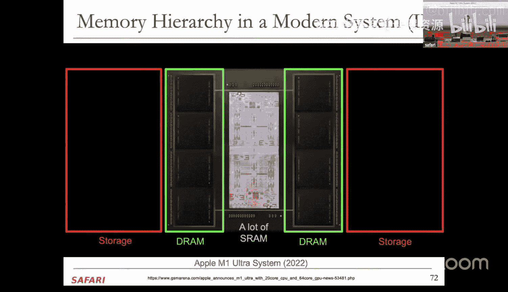
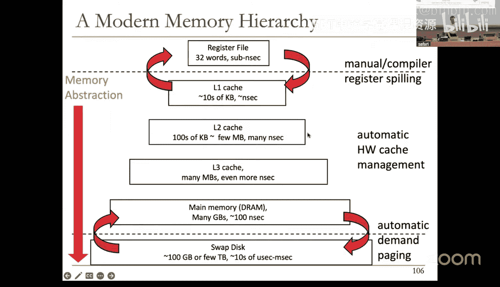

# 21：内存组织、技术、层次结构与缓存（Spring 2025）

## 概述
在本节课中，我们将深入学习内存系统。我们将从内存的组织结构和技术细节开始，探讨动态随机存取存储器（DRAM）和静态随机存取存储器（SRAM）的工作原理。接着，我们将引入内存层次结构的概念，解释为什么现代计算机系统需要多级缓存，并详细讲解缓存的基本原理，包括如何利用时间局部性和空间局部性来提升性能。课程内容旨在让初学者能够理解内存系统的核心工作机制。

---

## 内存组织回顾
上一讲我们介绍了内存是计算系统的关键组件，并讨论了影响内存设计的多种指标。我们探讨了内存的基本原理、组织方式和技术。本节中，我们将快速回顾这些内容，为深入理解打下基础。

内存控制器通过总线通道连接到多个内存模块。每个模块包含内存芯片，每个芯片内部有多个称为“存储体”的阵列。每个存储体由一个二维的存储单元阵列构成。

从自上而下的视角看，一个双列直插内存模块（DIMM）包含多个“列”。每个列是一组芯片的集合。这些列共享地址、命令总线和数据总线，因此一次只能访问一个列。物理地址的一部分用于选择特定的列。

每个列由多个芯片组成。例如，一个64位数据总线可能由8个芯片提供，每个芯片提供8位数据。这种设计降低了单个芯片的引脚成本和复杂度，同时通过并发访问所有芯片来获得高带宽。

每个芯片内部包含多个存储体。将存储阵列划分为多个存储体可以降低延迟，并允许在不同存储体上并行发起访问，从而利用并行性。

每个存储体内部是一个二维存储单元阵列。访问时，首先将整行数据读取到“行缓冲区”（由灵敏放大器构成）中，然后通过列地址选择特定的字节输出。这类似于一种缓存机制。

---

## DRAM 内部操作详解
上一节我们回顾了内存的宏观组织结构。本节中，我们将深入DRAM芯片内部，了解其具体的工作原理。

### 基本操作步骤
内存控制器要访问一个存储体，需要提供行地址和列地址。

1.  **激活行**：控制器发送行地址。行解码器解码后，激活对应的字线。该行所有存储单元通过存取晶体管连接到各自的位线上。
2.  **数据感知与放大**：灵敏放大器（即行缓冲区）感知位线上的微小电压变化，并将其放大为逻辑高电平（VDD）或低电平（0）。这个过程会将整行数据（例如2KB）暂存到行缓冲区中。
3.  **列选择与输出**：控制器发送列地址。一个大型多路复用器根据列地址，从行缓冲区中选择出特定的字节（或字），并通过总线发送给处理器。

### 行缓冲区命中与冲突
*   **行缓冲区命中**：如果处理器接下来要访问同一行中的不同列，数据已经在行缓冲区中。控制器只需发送新的列地址即可快速获取数据，无需再次激活行。这显著降低了访问延迟。
*   **行缓冲区冲突**：如果处理器要访问不同行的数据，则当前打开的行必须被关闭。这需要三个步骤：
    1.  **预充电**：将当前行缓冲区中的数据写回存储阵列（如果需要），并将灵敏放大器复位到参考电压（如 VDD/2）。
    2.  **激活新行**：发送新行地址，激活新行，并将其数据读取到行缓冲区。
    3.  **列访问**：发送列地址，选择并输出数据。
    行缓冲区冲突的延迟远高于命中。例如，一次命中可能需25纳秒，而一次冲突可能需75纳秒。在5GHz的处理器中，75纳秒相当于375个处理器周期，凸显了内存延迟对性能的巨大影响。

### 子阵列结构
实际上，一个巨大的存储体在物理上会进一步划分为更小的**子阵列**。每个子阵列有自己的局部行缓冲器和更短的位线，这降低了互联延迟，提高了访问速度和可靠性。访问时，只激活目标子阵列中的行，数据被读取到局部行缓冲区，然后再通过更宽的内部互联输出。

---

## 内存技术：DRAM vs. SRAM vs. 新兴技术
我们了解了DRAM的组织和操作。现在，我们来比较不同的内存技术及其权衡。

### DRAM（动态随机存取存储器）
*   **存储原理**：利用电容存储电荷。充电状态代表1，放电状态代表0。
*   **单元结构**：1个晶体管 + 1个电容（1T1C）。
*   **关键特性**：
    *   **高密度，低成本/位**：单元结构简单，面积小。
    *   **需要刷新**：电容会漏电，必须定期（例如每64毫秒）读取并重写数据以保持电荷。
    *   **破坏性读取**：读取操作会消耗电容电荷，读取后必须立即恢复（由灵敏放大器完成）。
    *   **制造工艺特殊**：需要制造电容，与标准逻辑CMOS工艺不兼容。

### SRAM（静态随机存取存储器）
*   **存储原理**：利用交叉耦合的反相器（锁存器）存储状态。
*   **单元结构**：通常为6个晶体管（6T）。
*   **关键特性**：
    *   **速度快**：无需电容充放电，访问延迟低。
    *   **无需刷新**：只要供电，数据就能保持。
    *   **低密度，高成本/位**：晶体管数量多，单元面积大。
    *   **制造工艺兼容**：使用标准逻辑CMOS工艺，易于集成在处理器芯片上。**所有片上缓存（Cache）均由SRAM构建。**

### 技术对比总结
| 特性 | DRAM | SRAM |
| :--- | :--- | :--- |
| **速度** | 较慢（纳秒级） | **快**（亚纳秒级） |
| **密度/成本** | **高密度，低成本/位** | 低密度，高成本/位 |
| **刷新** | 需要 | **不需要** |
| **易集成性** | 困难（特殊工艺） | **容易**（标准CMOS） |
| **主要用途** | 主内存（容量大） | 处理器高速缓存（速度快） |

### 新兴内存技术（简介）
除了DRAM和SRAM，还存在其他有潜力的内存技术，例如相变存储器（PCM）。
*   **原理**：利用硫族化合物玻璃在晶态（低阻）和非晶态（高阻）之间的相变来存储数据。
*   **潜在优势**：非易失性（断电不丢数据）、高密度、无需刷新。
*   **挑战**：写入速度较慢（需要加热/冷却）、存在写耐久度限制、制造工艺不成熟。
这些技术可能在未来改变内存层次结构，例如作为更高速的非易失性存储层。

---

## 缓存线访问与数据映射
理解了芯片内部操作后，我们来看处理器如何访问一块数据（缓存线）。

一个典型的缓存线大小为64字节。这64字节数据被映射到单个内存通道的单个列（Rank）中。
*   该列由8个芯片组成，每个芯片提供8位数据。
*   要获取64字节，需要**连续进行8次访问**，每次访问所有芯片并发工作，提供8字节（64位）数据。
*   在每次访问中，内存控制器向所有芯片发送相同的行地址和列地址。每个芯片从其内部阵列中读取对应位置的一个字节，共同组成一个8字节的数据块。
*   如果这64字节数据位于DRAM的同一行内，那么除了第一次访问需要激活行外，后续7次访问都是行缓冲区命中，可以快速完成。

这种访问模式充分利用了空间局部性：当处理器请求一个字节时，内存系统会将该字节所在的整个缓存线（及其相邻数据）取回，期望处理器很快就会访问这些相邻数据。

---

## 内存层次结构与缓存原理
单一类型的内存无法同时满足大容量、高速度和低成本的要求。因此，现代计算机系统采用**内存层次结构**。

### 理想内存 vs. 现实权衡
理想内存应具备：零访问时间、无限容量、零成本、无限带宽、零能耗。这显然无法实现。
现实中的根本矛盾是：**容量越大，速度越慢；速度越快，成本越高**。

### 层次结构解决方案
内存层次结构通过组合多种不同特性的存储设备来近似理想内存：
1.  **靠近处理器**：使用**容量小、速度快、成本高**的存储（如SRAM缓存、寄存器）。
2.  **远离处理器**：使用**容量大、速度慢、成本低**的存储（如DRAM主存、SSD、硬盘）。
3.  **关键思想**：将处理器**最常访问的数据**保存在速度最快的层次中。通过利用程序的**访问局部性**，使得在大多数情况下，处理器都能从快速缓存中获取数据，从而获得接近最快存储的速度和接近最慢存储的容量。

一个典型的层次结构示例如下：
*   **寄存器**：在CPU内部，速度最快，容量最小（KB级），由编译器或指令显式管理。
*   **L1缓存**：在CPU核心内，速度极快（1-4周期），容量较小（KB级）。
*   **L2缓存**：可能在核心内或核心间共享，速度较快（10-20周期），容量较大（MB级）。
*   **L3缓存**：在芯片上共享，速度较慢（30-50周期），容量更大（MB级）。
*   **主内存（DRAM）**：在芯片外，速度慢（100-300周期），容量大（GB级）。
*   **固态硬盘/机械硬盘**：持久化存储，速度非常慢（微秒到毫秒级），容量极大（TB级）。

### 局部性原理
层次结构有效性的基础是程序的**局部性原理**。
1.  **时间局部性**：如果一个内存位置被访问，那么它很可能在不久的将来被再次访问。
    *   **例子**：循环中的计数器变量会被反复读写。
2.  **空间局部性**：如果一个内存位置被访问，那么它附近的内存位置很可能在不久的将来被访问。
    *   **例子**：顺序执行的指令、遍历数组或矩阵元素。

缓存通过以下方式利用局部性：
*   **利用时间局部性**：将最近访问过的数据块保留在缓存中。
*   **利用空间局部性**：当处理器访问某个地址时，不仅读取该地址的数据，还将包含该地址的整个**缓存块**（例如64字节）取回缓存。期望处理器接下来会访问该块内的其他数据。

### 缓存管理：自动 vs. 手动
*   **自动管理（硬件缓存）**：硬件自动决定数据的存放和替换，对程序员透明。这是现代通用CPU的标准方式，简化了编程。
*   **手动管理（暂存存储器）**：程序员或编译器显式控制数据在快速存储中的移动。这在一些GPU和专用加速器（如AI芯片）中常见，可以提供更确定性的性能，但增加了编程复杂度。

### 历史视角：从磁芯内存到DRAM
早期计算机使用磁芯内存，它体积大、密度低、制造困难。20世纪70年代，半导体DRAM（如Intel 1103）的出现，以其更低的成本和更高的密度，迅速取代了磁芯内存，奠定了现代内存技术的基础。

---

## 总结
本节课我们一起深入学习了内存系统的核心知识。

我们首先回顾并深入剖析了DRAM的内存组织，从模块、列、芯片、存储体一直深入到子阵列和存储单元，详细解释了行缓冲区、命中与冲突的操作机制及其对性能的影响。

接着，我们比较了DRAM和SRAM这两种主要内存技术的原理、特性和权衡，并简要介绍了相变存储器等新兴技术。

然后，我们探讨了处理器如何访问一个缓存线，以及数据在内存系统中的映射方式。

最后，我们引入了内存层次结构这一核心概念，解释了为什么需要缓存，并详细阐述了缓存工作的理论基础——时间局部性和空间局部性原理。我们还区分了硬件自动管理的缓存和程序员手动管理的暂存存储器。

理解内存层次结构和缓存原理对于理解现代计算机如何克服“内存墙”问题至关重要。在接下来的课程中，我们将进一步学习缓存的具体组织结构和工作原理。