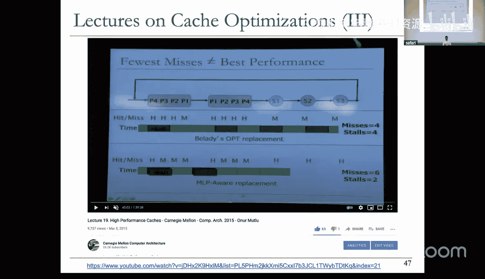

# 23：缓存 II 与预取 (Spring 2025)


## 概述

在本节课中，我们将继续学习缓存设计，探讨影响缓存性能的关键参数，并介绍一种重要的性能优化技术——预取。我们将了解如何通过硬件和软件手段减少内存访问延迟，提升程序执行效率。

---

## 缓存性能参数分析

上一节我们介绍了缓存的基本概念和必要性。本节中，我们来看看影响缓存性能的几个关键设计参数，包括缓存大小、块大小和关联度。

### 缓存大小的影响

缓存性能的一个关键指标是命中率。缓存大小直接影响命中率。

下图展示了缓存大小与命中率的一般关系。随着缓存容量增加，命中率起初会显著提升。但当缓存容量达到或超过工作集大小时，命中率的提升会变得非常有限，甚至不再增长。

**工作集** 是指程序在特定时间段内访问的数据集合。理想情况下，我们希望缓存大小能够容纳工作集，这是性能的“甜点区”。如果缓存太小，无法有效利用时间局部性和空间局部性，有用数据会被频繁替换。如果缓存太大，虽然命中率可能更高，但访问延迟和成本也会增加，得不偿失。

工作集大小因程序而异，不存在一个“放之四海而皆准”的最佳缓存大小。下图展示了不同工作负载下，缓存关联度（可视为缓存容量的一种体现）与每千条指令缺失数的关系。有些工作负载即使缓存容量大幅增加，缺失率也几乎不变；而另一些工作负载则在缓存容量增加到一定程度后，缺失率迅速降至接近零。

### 缓存块大小的影响

缓存块大小是缓存与内存之间数据传输的最小粒度，它直接影响对空间局部性的利用。

*   **块大小过小**：无法有效利用空间局部性。例如，如果程序顺序访问数组，每次只取一个元素（如4字节），那么每次访问都可能引发缓存缺失，即使相邻数据很快就会被用到。同时，较小的块意味着相对更大的标签开销。
*   **块大小适中**：能有效预取相邻数据，利用空间局部性。例如，一次取64字节，如果程序访问了其中某个数据，很可能也会访问同一块内的其他数据，从而减少后续访问的缺失。
*   **块大小过大**：如果程序的空间局部性不强，过大的块会导致传输无用数据，浪费内存带宽、缓存空间和能量。例如，一个2MB的块被取入缓存，但程序只访问其中很少一部分数据，这会造成严重的资源浪费。

因此，选择块大小需要在利用空间局部性和避免资源浪费之间取得平衡。

### 缓存关联度的影响

关联度决定了缓存中每个索引位置可以存放的块数。

*   **高关联度**：减少冲突缺失，因为同一个索引位置可以容纳更多地址不同的块。但高关联度意味着需要更多的比较电路，可能增加访问延迟、功耗和设计复杂度。
*   **低关联度**：访问速度快，电路简单，但冲突缺失会增加。

一个常见的问题是：**关联度必须是2的幂次吗？**

答案是否定的。关联度并不需要是2的幂次。缓存索引通常使用地址的一部分，而关联度决定每个索引对应的“路”数，这两者是独立的。例如，一个四路组相联缓存，如果去掉一路的比较逻辑，就可以变成三路组相联。实际上，一些现代商业处理器（如Intel的Lime Cove微架构）就使用了非2的幂次（如12路）的关联度设计。

---

## 缓存缺失的类型与优化

理解缓存缺失的类型有助于我们针对性地进行优化。缓存缺失主要分为三类：

1.  **强制性缺失**：程序第一次访问某个缓存块时必然发生的缺失。除非采用预测技术提前获取数据，否则无法避免。
2.  **容量缺失**：由于缓存总容量不足，无法容纳所有活跃的工作集数据而导致的缺失。即使使用全相联和最优替换策略，只要缓存容量小于工作集，这种缺失依然会发生。
3.  **冲突缺失**：在组相联或直接映射缓存中，由于多个内存块映射到同一个缓存组，导致有用数据被替换出去而引发的缺失。这是关联度有限导致的。

以下是针对不同类型缺失的优化思路：

*   **减少强制性缺失**：主要依靠**预取**技术。通过预测程序未来的访问模式，提前将数据取入缓存。
*   **减少冲突缺失**：增加缓存关联度是最直接的方法。其他技术还包括使用受害者缓存、随机化索引等。
*   **减少容量缺失**：增加缓存容量，或者通过优化程序数据布局和访问模式来更高效地利用有限的缓存空间。

缓存性能优化的三个基本目标是：
1.  降低缺失率。
2.  降低缺失代价（解决一次缺失所需的时间）。
3.  降低命中延迟（缓存命中的数据访问时间）。

然而，这些目标之间往往存在权衡。例如，增大缓存可以降低缺失率，但可能增加命中延迟；激进的预取可能降低缺失延迟，但会消耗更多带宽并可能造成缓存污染。

---

## 通过编程优化缓存性能

作为程序员，了解底层缓存机制可以帮助我们编写出对缓存更友好的高效代码。以下是几种常见的技术：

### 1. 重构数据访问模式（循环交换）

考虑一个按列主序存储的二维矩阵（同一列中相邻行的元素在内存中相邻）。如果我们按行优先遍历（先遍历行，再遍历列），内层循环访问的是内存中相距很远的元素，无法利用空间局部性。


**优化前（行优先，缓存不友好）**：
```c
for (i = 0; i < N; i++) {
    for (j = 0; j < M; j++) {
        sum += matrix[i][j];
    }
}
```




**优化后（列优先，缓存友好）**：
```c
for (j = 0; j < M; j++) {
    for (i = 0; i < N; i++) {
        sum += matrix[i][j];
    }
}
```
通过交换循环顺序，使内层循环访问内存中连续的数据，可以显著提高缓存命中率。

### 2. 分块

当处理的数据集大于缓存容量时，可以将计算分解成若干小块（Tile），使得每个小块的数据能放入缓存中。先完整处理一个小块，充分利用该块内的数据局部性，然后再处理下一个块。

这在矩阵乘法等计算密集型任务中非常有效。传统的矩阵乘法会按行或列访问整个大矩阵，导致缓存效率低下。分块矩阵乘法则将大矩阵分成小方块，每次只将参与计算的两个源矩阵块和目标矩阵块保留在缓存中，进行局部乘加运算，从而大幅提升缓存利用率。

### 3. 重构数据结构布局（结构体拆分）

考虑一个链表节点结构体，包含键值、下一个节点指针以及一些不常访问的辅助信息（如姓名、学校）。
```c
struct Node {
    int key;
    struct Node* next;
    char name[256];
    char school[256];
};
```
遍历链表查找特定键值时，`key`和`next`被频繁访问，而`name`和`school`只在找到匹配项后才被访问。如果将它们打包在一起，每次遍历节点时，不常访问的大字段也会被加载到缓存行中，浪费缓存空间和带宽。

**优化后**：将频繁访问字段和不常访问字段拆分成两个结构体。
```c
struct Node {
    int key;
    struct Node* next;
    struct NodeData* data; // 指向包含name和school的结构体
};

struct NodeData {
    char name[256];
    char school[256];
};
```
这样，链表本身变得紧凑，遍历时缓存效率更高。只有在找到匹配节点后，才通过指针访问辅助数据。

---

## 内存级并行性与缓存策略

传统的缓存优化策略（如LRU）隐含假设减少缺失次数总能提升性能。然而，在现代支持乱序执行的处理器中，**内存级并行性**（MLP）的存在改变了这一假设。

MLP是指处理器能够同时发出多个内存访问请求的能力。如果多个缺失请求可以并行处理，那么它们对处理器造成的总停顿时间可能小于其各自延迟之和。

考虑一个例子：程序依次产生内存访问序列 `P1, P2, P3, P4`（可并行），然后是 `S1, S2, S3`（必须串行）。最优替换策略（Belady）可能会为了容纳串行访问的S系列数据，而替换掉即将被并行访问的P系列数据，导致P系列访问发生缺失。虽然总缺失次数较少，但这些缺失是串行暴露给处理器的，造成显著停顿。

而一个MLP感知的替换策略会倾向于保护那些会暴露给处理器、造成串行停顿的缓存行（如S系列），即使这意味着要牺牲一些可以并行处理的缺失（如P系列）。虽然总缺失次数可能增加，但由于许多缺失可以重叠处理，处理器实际经历的停顿周期反而更少。

这个例子表明，在设计缓存替换策略时，需要考虑缺失请求之间的并行性，而不仅仅是追求最低的缺失率。

另一种利用并行性隐藏延迟的技术是**推测性内存访问**。例如，如果硬件能够预测某个L1缓存访问将会一直缺失到主存，它可以在查询L2缓存的同时，就提前发起对主存的访问。这样，内存访问的延迟部分被后续缓存的查询过程所覆盖，从而减少了处理器感知到的停顿时间。

---

## 预取技术概述

强制性缺失是缓存无法避免的。**预取**技术通过预测程序未来的内存访问地址，提前将数据取入缓存或更靠近处理器的地方，从而隐藏内存访问延迟，甚至消除强制性缺失。

预取的核心思想是：**在程序实际需求发生之前，提前获取数据**。成功的预取需要满足两个条件：**准确性**（预测对）和**及时性**（在需要时数据已到位）。

预取不影响程序正确性。如果预测错误，最坏情况是浪费了带宽、缓存空间或能量，但不会导致程序执行错误。这使得我们可以设计更激进的预取器。

预取可以在多个层面实现：
*   **软件预取**：编译器或程序员在代码中插入特殊的预取指令（如x86的`PREFETCH`系列指令）。
*   **硬件预取**：处理器硬件自动监测访问模式，并透明地发起预取。
*   **基于执行的预取**：使用一个辅助线程（“侦察兵”线程）提前执行程序代码或简化版本，为主线程生成预取请求。

设计一个预取器需要回答四个关键问题：
1.  **预取什么**：预测下一个或未来几个需要的内存地址。这需要模式识别算法，如检测顺序流、固定步长、复杂历史模式等。
2.  **何时预取**：预取时机至关重要。过早预取，数据可能在用到前就被替换；过晚预取，无法完全隐藏延迟。需要平衡“及时性”。
3.  **预取到哪里**：
    *   将数据放在缓存层次结构的哪一级？（L1, L2, LLC？）
    *   放在缓存内还是专用的预取缓冲区？
    *   不同的选择在污染、一致性、效率方面有不同权衡。
4.  **如何预取**：采用何种机制实现预取（软件、硬件、基于执行）。

### 硬件预取器示例

1.  **流预取器**：检测顺序访问模式。例如，IBM Power4处理器采用多级流预取，L1预取器看到访问块N后，会预取块N+1到L1；L2预取器看到块N+1被预取到L2后，会预取后续多个块（如N+5到N+8）到L2；以此类推，在内存访问路径上形成一个“预取前沿”，保持数据提前就位。
2.  **步长预取器**：检测固定步长的访问模式（如A, A+s, A+2s...）。硬件记录特定加载指令（通过程序计数器PC识别）的历史访问地址，计算连续地址之间的差值（步长）。当检测到稳定的步长模式且置信度足够高时，就根据当前地址和步长预取未来的地址。为了提高及时性，可以预取多个步长 ahead 的地址。

对于更复杂的访问模式（如重复的 delta 序列），可以使用**关联预取器**或**基于机器学习的预取器**。它们能够学习更长的历史访问模式，并进行更复杂的预测。

预取器的性能通常用以下指标衡量：
*   **准确率**：被使用的预取请求数 / 发出的预取请求总数。
*   **覆盖率**：被预取覆盖的缓存缺失数 / 总的缓存缺失数。
*   **及时性**：在需要时已就绪的预取数 / 被使用的预取总数。
此外，还需关注**带宽消耗**和**缓存污染**等副作用。

---

## 总结

本节课我们一起深入探讨了缓存设计的性能权衡，包括缓存大小、块大小和关联度的影响。我们分析了三种主要的缓存缺失类型及其优化思路。作为程序员，可以通过重构数据访问模式、分块和优化数据结构布局来显著提升缓存利用率。

我们引入了内存级并行性的概念，指出传统的以缺失率为中心的缓存策略需要结合MLP进行优化。最后，我们重点介绍了预取技术，这是一种通过预测来隐藏内存延迟、减少强制性缺失的强大方法。我们了解了预取的基本原理、设计考量以及几种经典的硬件预取器设计。


理解这些底层机制，无论是对于硬件架构师设计高效的内存子系统，还是对于软件开发者编写高性能代码，都具有至关重要的意义。