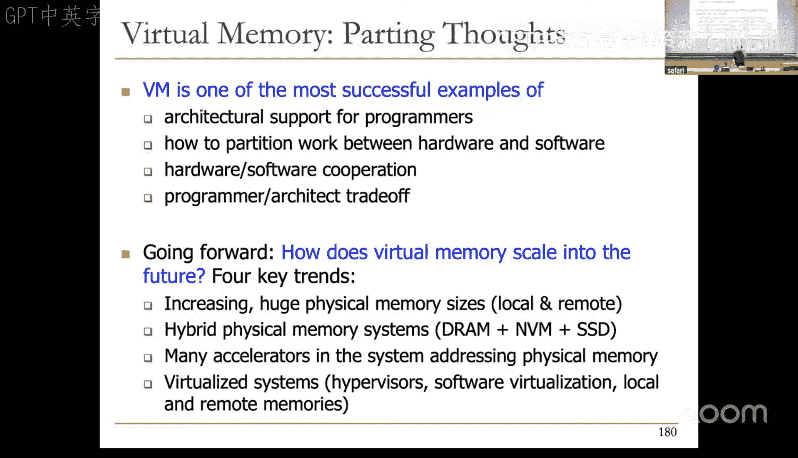
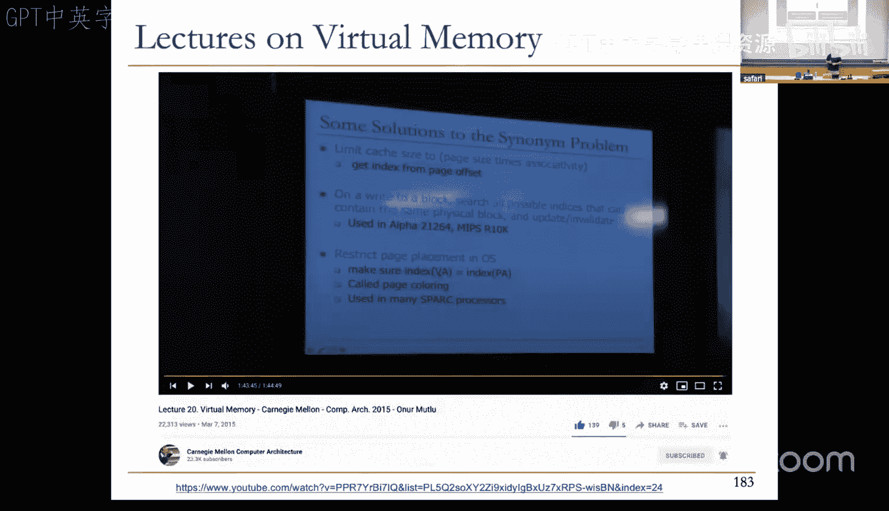
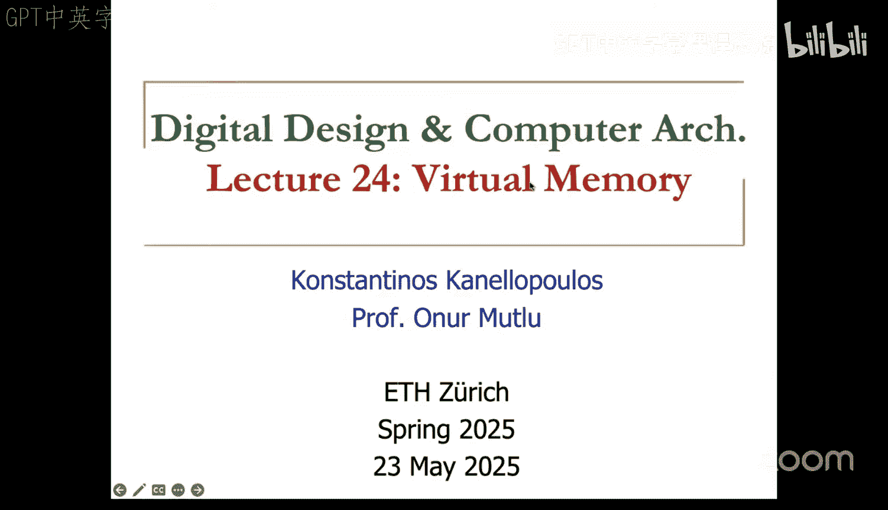

# 24：虚拟内存 (Spring 2025) 🧠

在本节课中，我们将要学习虚拟内存的核心概念。虚拟内存是现代计算机系统中的一个关键抽象，它为程序员提供了巨大的、看似无限的地址空间，同时由硬件和操作系统自动管理有限的物理内存资源。我们将探讨其工作原理、优势、面临的挑战以及现代系统中的实现方式。

## 概述 📋

虚拟内存是计算机架构中一个至关重要的抽象层。它允许每个程序拥有自己独立的、庞大的地址空间（虚拟地址空间），而无需关心物理内存的实际大小和布局。操作系统和硬件（特别是内存管理单元，MMU）协同工作，将程序使用的虚拟地址动态映射到物理内存中的实际地址。这种机制不仅简化了编程，还提供了内存保护、进程隔离和高效共享等关键功能。

上一节我们介绍了内存层次结构和缓存的基本原理，本节中我们来看看如何将类似的“缓存”思想应用于整个主存和磁盘之间，从而构建出虚拟内存系统。

## 为什么需要虚拟内存？🤔

在直接使用物理地址的系统中，程序员面临诸多困难：

1.  **物理内存容量有限**：程序可能需要比物理内存更大的空间。
2.  **多程序协调困难**：多个程序需要协调使用物理内存，避免冲突。
3.  **缺乏保护和隔离**：一个程序可能无意或恶意地访问或修改另一个程序的数据。
4.  **代码和数据难以重定位**：程序中的地址是硬编码的，难以在内存中移动。
5.  **共享代码和数据复杂**：需要在程序间显式协商共享内存区域。

虚拟内存通过引入一个间接层——**地址转换**——来解决这些问题。程序员在虚拟地址空间中工作，系统负责将虚拟地址映射到物理地址。

## 虚拟内存的基本概念 🧩

### 虚拟地址与物理地址
*   **虚拟地址 (Virtual Address)**：程序直接使用的地址。它属于一个巨大的、线性的地址空间（例如，在64位系统中可达16EB）。
*   **物理地址 (Physical Address)**：数据在物理内存（RAM）中的实际位置。
*   **地址转换 (Address Translation)**：将虚拟地址映射到物理地址的过程。这是由**内存管理单元 (MMU)** 在硬件支持下完成的。

### 页与页框
为了高效管理，虚拟地址空间和物理地址空间都被划分为固定大小的块。
*   **页 (Page)**：虚拟地址空间中的块。
*   **页框 (Frame)**：物理地址空间中的块。
*   **页大小 (Page Size)**：常见的尺寸有4KB、2MB、1GB等。页大小是系统设计的一个关键参数。

**映射关系**：一个虚拟页可以映射到一个物理页框（如果该页当前在物理内存中），也可以映射到磁盘上的一个位置（如果该页被“换出”）。

### 页表：虚拟到物理的映射字典
系统需要一个数据结构来记录所有虚拟页到物理页框（或磁盘位置）的映射关系，这个数据结构就是**页表 (Page Table)**。你可以将其想象成一个巨大的字典或查找表。

每个**页表项 (Page Table Entry, PTE)** 包含：
*   **有效位 (Valid Bit)**：指示该虚拟页是否在物理内存中。
*   **物理页框号 (Physical Frame Number)**：如果有效位为1，则指向对应的物理页框。
*   **保护位 (Protection Bits)**：指示该页的访问权限（如可读、可写、可执行）。
*   **其他状态位**：如脏位（Dirty Bit，指示页是否被修改过）、访问位（Accessed Bit）等，用于页面替换算法。

**地址转换过程示例**：
假设虚拟地址为 `0x5F20`，页大小为4KB（`0x1000`）。
1.  计算虚拟页号 (VPN)：`0x5F20 >> 12 = 0x5`。
2.  计算页内偏移 (Offset)：`0x5F20 & 0xFFF = 0xF20`。
3.  以VPN为索引查找页表，找到对应的PTE。
4.  从PTE中取出物理页框号 (PFN)，例如 `0x1`。
5.  组合成物理地址：`(PFN << 12) | Offset = (0x1 << 12) | 0xF20 = 0x1F20`。

## 虚拟内存的关键机制与挑战 ⚙️

### 1. 页错误处理
当程序访问一个有效位为0的虚拟页（即该页不在物理内存中）时，会触发一个**页错误 (Page Fault)** 异常。操作系统接管处理：
*   **次要页错误 (Minor Fault)**：页已在内存中（例如在文件缓存里），只需建立页表映射。处理较快。
*   **主要页错误 (Major Fault)**：页确实在磁盘上（如交换空间或文件），需要启动I/O操作，将页从磁盘读入一个空闲的物理页框，然后更新页表。处理很慢。

操作系统使用**页面置换算法**来选择被换出的页，为新的页腾出空间。常见的算法有最近最少使用（LRU）及其近似算法（如时钟算法）。

### 2. 页表过大问题与多级页表
对于64位地址空间，如果使用单级页表，页表本身就会大得无法装入内存。解决方案是使用**多级页表 (Multi-level Page Table)**。

**工作原理**：
将虚拟地址分成多个部分，每一级页表负责解析一部分。例如，一个四级页表：
*   虚拟地址被划分为：L4索引 | L3索引 | L2索引 | L1索引 | 页内偏移。
*   CR3寄存器指向顶级页表（L4）的基址。
*   通过逐级查表，最终找到叶子级的PTE，获得物理页框号。

**优势**：
*   **节省空间**：只为实际使用的虚拟地址区域分配页表子结构。未使用的地址区域对应的上级页表项标记为无效，其下级页表就无需分配。
*   **公式描述**：假设虚拟地址 `VA` 被划分为 `(a, b, c, d, offset)`，则物理地址 `PA = PageTable[PageTable[PageTable[PageTable[CR3 + a] + b] + c] + d] + offset`（概念示意）。

### 3. 加速地址转换：TLB
如果每次内存访问都需要多次访问内存来查询多级页表，性能将无法接受。因此，现代CPU使用**转址旁路缓存 (Translation Lookaside Buffer, TLB)** 来缓存最近使用过的虚拟页到物理页框的映射。

*   **TLB命中**：直接在TLB中找到翻译结果，速度极快（通常1-2个周期）。
*   **TLB未命中**：需要启动**页表遍历 (Page Table Walk)**。现代系统通常在硬件中实现一个**页表遍历器**，自动完成多级页表的查找，并将结果填入TLB。

### 4. 内存保护
页表项中的保护位使得操作系统可以为每个页设置访问权限。这实现了：
*   **进程隔离**：一个进程不能访问另一个进程的页（除非显式共享）。
*   **代码保护**：可以将代码页设置为只读/可执行，数据页设置为可读/写，防止代码被恶意修改或数据被当作代码执行（防范缓冲区溢出攻击）。

## 虚拟内存的性能开销与研究方向 🔬

尽管虚拟内存带来了巨大好处，但它也引入了性能开销：

1.  **地址翻译开销**：对于具有巨大、不规则数据访问模式的工作负载（如图计算、稀疏机器学习），TLB未命中率很高，页表遍历成为主要性能瓶颈。
2.  **内存分配开销**：对于短生命周期、频繁创建销毁的工作负载（如Serverless函数、LLM推理请求），在操作系统内核中分配和初始化内存页表结构的时间可能占其总执行时间的很大比例。

当前的研究方向包括：
*   设计更高效的TLB结构和替换算法。
*   探索大页（如1GB页）的使用以减少TLB压力。
*   研究异构内存系统（如DRAM+NVM）下的虚拟内存管理。
*   针对特定加速器（GPU、NPU）优化虚拟内存支持。
*   重新思考虚拟内存抽象，以应对新兴负载的需求。

## 总结 🎯

本节课中我们一起学习了虚拟内存的核心原理。我们了解到：

*   虚拟内存通过**地址转换**为程序员提供了巨大且独立的地址空间抽象。
*   **页表**是存储虚拟页到物理页框映射的核心数据结构，**多级页表**解决了其空间占用过大的问题。
*   **TLB**作为页表的高速缓存，极大地加速了地址转换过程。
*   虚拟内存机制天然提供了**内存保护**和**进程隔离**。
*   页错误处理实现了**按需调页**，使得物理内存可以作为磁盘的高速缓存。
*   尽管是成功的抽象，虚拟内存仍面临**地址翻译**和**内存分配**方面的性能挑战，是计算机架构持续研究的重要领域。

虚拟内存是硬件/软件协同设计的典范，它深刻体现了通过复杂的系统底层支持来简化上层编程接口的设计哲学。理解虚拟内存是理解现代操作系统和计算机体系结构运行机制的关键。