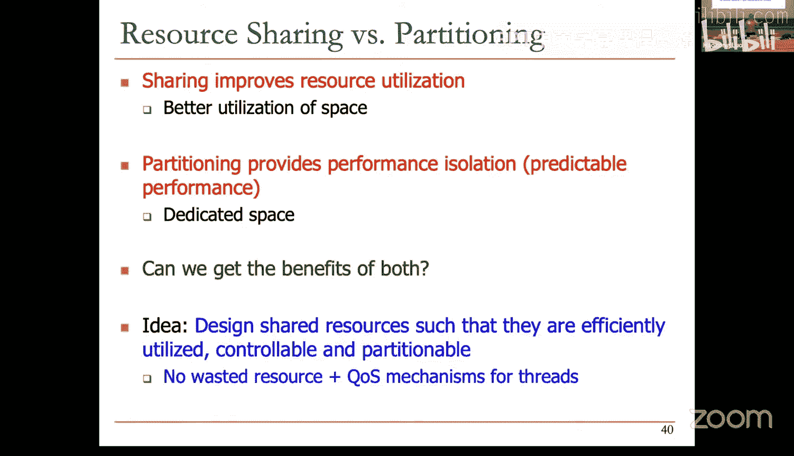
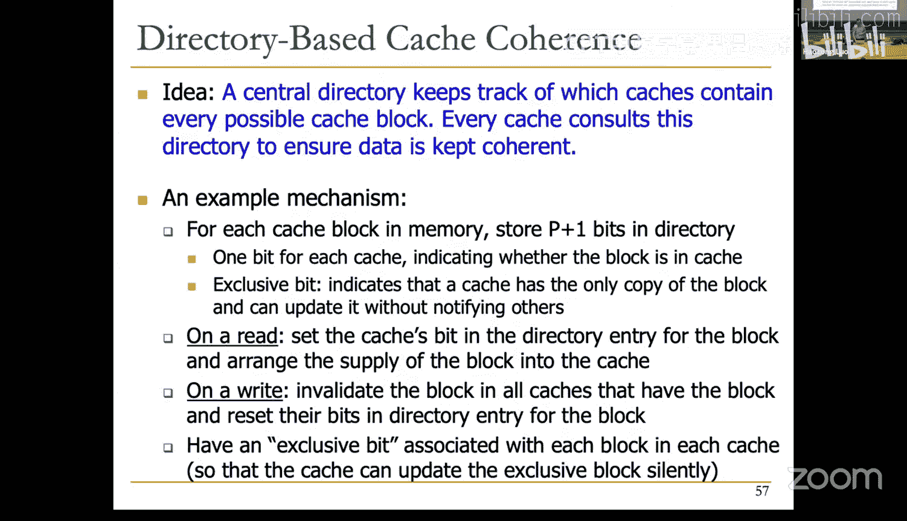
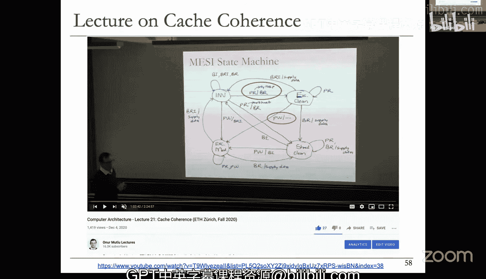

# 23b：多核系统中的缓存问题 🧠

在本节课中，我们将要学习多核处理器系统中的缓存设计所面临的一系列独特挑战。我们将探讨缓存应设计为私有还是共享，分析资源共享的利弊，并初步了解确保多核间数据一致性的缓存一致性协议。

## 多核缓存概述

上一节我们介绍了缓存的基本原理。本节中我们来看看当系统拥有多个处理器核心时，缓存设计会变得多么复杂。正如我们所讨论的，现代系统都是多核的。例如，在这个系统中，L1缓存通常是私有的，L2缓存也可能是私有的，而L3缓存则可能在所有处理器核心之间共享。这本身就是一项关键的设计决策：决定哪些缓存由哪些核心共享，以及是否设计更高级别的共享缓存等。

你已经熟悉了这些架构图。这里我想特别提一下这个缓存，因为它非常有趣。这是一个位于不同芯片上的共享缓存。

基本上，设计者决定在处理器芯片之上额外封装了其他芯片。这些额外芯片的唯一目的就是提供缓存。这其中涉及许多有趣的技术问题，例如如何对齐两个芯片间的互连以实现高效通信。虽然我们现在认为这些是理所当然的，但这里存在许多制造和可靠性问题。这是两个堆叠封装在一起的不同芯片，第二个芯片的唯一功能就是为另一个芯片中的所有核心提供缓存。

## 多核系统中的缓存效率挑战

在多核或多线程系统中，缓存效率变得至关重要。如果只有一个线程访问缓存，管理起来很简单。但当有10个、20个甚至100个不同的线程访问同一个缓存时，你就需要追求更高的效率。内存带宽问题同样如此，甚至可能更为重要。

因此，针对多核系统的缓存研究非常多。内存带宽是稀缺资源，我们应尽量避免访问主存，理想情况是命中缓存。不幸的是，这并不总能实现。同时，缓存空间也是跨核心和线程的有限资源。因此，空间和带宽都成了问题。

那么，问题就变成了：我们如何设计多核系统中的缓存？这里实际上有许多有趣的设计决策。

以下是多核缓存设计面临的核心问题：
*   **共享与私有**：缓存应该在核心或线程间共享还是私有？
*   **系统性能最大化**：如何最大化整个系统的性能，而不仅仅是单个线程的性能？
*   **服务质量**：如何为不同线程提供服务质量？如何提供可预测的性能？
*   **缓存管理算法**：缓存管理算法是否需要感知访问它的不同线程？
*   **空间分配**：在共享缓存中，应如何为不同线程分配空间？
*   **数据压缩**：如果带宽和空间稀缺，是否应该压缩缓存中的数据？
*   **重用预测与管理**：如何实现更好的缓存数据重用预测和管理？

可能还有其他问题，但让我们先关注其中一个维度：缓存应该是私有的还是在核心间共享。

## 私有缓存 vs. 共享缓存

一个私有缓存只属于一个核心，这意味着一个共享的数据块可能存在于多个缓存中。而一个共享缓存则由多个核心共用，正如你所见，这里的L2缓存由多个核心共享。如果一个数据块在这些不同核心间共享，它本质上不需要在不同缓存间复制。共享缓存的一个直接优势就是减少了不同私有缓存间的数据复制。

我们昨天讨论过，L1缓存与核心紧密耦合，因此设计上通常是私有的。而L2缓存是片外缓存，可能私有也可能共享。但L3缓存今天几乎总是共享的。这引出了资源共享的概念。

以下是资源共享的实例：
*   **私有缓存**：将缓存资源专用于某个核心。
*   **共享缓存**：允许多个硬件上下文（如核心或线程）共同使用同一硬件资源。
*   **功能单元与流水线**：在细粒度多线程中，流水线和功能单元在不同线程间共享。
*   **总线、内存互连和存储**：这些资源因复制成本过高，通常在不同线程间共享。

## 资源共享的利弊

为什么我们要共享资源？因为它能提高利用率和效率，从而带来更高的吞吐量和性能。当一个线程闲置某项资源时，另一个线程可以使用它。同时，也无需复制共享数据。

让我举个例子。假设有两个核心，核心1和核心2。如果它们各有64KB的私有缓存，一个核心可能只使用自己缓存的1KB，而另一个核心可能需要127KB。如果你静态地将64KB分区分配给每个核心，那么需要127KB的核心会不满意，而只需要1KB的核心则会浪费其缓存空间。如果为两者共享一个128KB的缓存，两个核心都会满意，不会浪费空间，并且在相同资源下不会增加执行时间。这就是资源共享的优势：它提高了利用率和效率，并有望最终提升性能。同时，也无需复制共享数据，这一点我们将在讨论缓存一致性时进一步探讨。

资源共享还有其他好处。它**降低了通信延迟**。多线程间共享的数据可以保存在同一个缓存中。例如，在共享缓存中，你不需要去其他缓存获取共享数据。这也**与共享内存编程模型兼容**。在共享内存模型中，不同线程通过读写指令进行通信：一个线程向某个地址写入，另一个线程从该地址读取。共享缓存与这个模型非常契合，因为该模型假设存在一个单一的内存空间，任何人都可以读写。而私有缓存本质上是在处理器本地复制了部分内存，从原理上讲，与这个模型并不完全兼容，当然，从软件角度看，这一切对程序员是透明的，他们仍然遵循共享内存模型。

然而，不幸的是，资源共享也有缺点。一个主要缺点是它会导致**对共享资源的争用**。当资源被一个线程占用时，另一个线程无法使用它。这适用于任何类型的资源：缓存空间、总线带宽、内存空间或存储空间。这会导致性能下降，可能降低每个线程或某些线程的性能。通常，线程的性能可能比它单独运行时更差。

另一个与性能下降不同的问题是，如果不加控制，资源共享会**消除性能隔离**。你获得的缓存空间量可能取决于在共享缓存中与你同时运行的其他程序。你可能在不同时间与不同的应用程序一起运行。你精心优化了你的程序，使其完美适配L2缓存。当你与应用程序A一起运行时，你获得了预期的缓存空间，性能很好。但当你与应用程序B一起运行时，该程序访问模式非常激进，会逐出你需要的所有缓存块，导致你的程序性能极差。这就消除了性能隔离。程序员在优化程序时假设会获得一定量的缓存，但由于资源在不同线程间共享且程序无法控制，导致所有优化都可能失效。因此，性能隔离非常重要，它能确保你在硬件上获得假定的资源，从而在不同运行中获得可预测的性能。

这也关系到**服务质量**。如果不控制这种共享，可能会导致不公平或饥饿现象。某些线程可能霸占资源，而其他线程可能被无限期延迟。我们可能在后面的课程中看到这样的例子。基本上，如果你要进行资源共享，就需要有机制来高效、公平地利用共享资源，以提供所需的服务质量和性能隔离。事实上，一些现代处理器已经集成了服务质量机制。例如，英特尔提供了在不同应用程序间划分缓存的方法，并对内存带宽划分提供了一定控制。

## 私有与共享缓存分析

现在，让我们从资源共享的角度分析私有缓存和共享缓存。如前所述，私有缓存属于一个核心，共享缓存由多个核心共享。

共享缓存的优势在于：
*   **高有效容量**：任何人都可以利用大缓存，这很好。
*   **无碎片化**：动态划分可用缓存空间，避免了静态分区可能产生的碎片。
*   **易于维护一致性**：一个缓存块只存在于一个位置，这意味着如果一个处理器更新了它，每个人都能看到这个更新，因为它是共享的。

共享缓存的劣势在于：
*   **无法针对单个处理器定制**：私有缓存可以紧密耦合核心，实现高吞吐量；而共享缓存需要某种网络在核心与缓存之间通信，最终导致访问速度变慢。
*   **核心间干扰**：核心可能通过逐出彼此的缓存块而导致缺失。一些核心的访问模式可能会破坏其他核心的命中率。
*   **难以保证最低服务或公平性**：由于共享，为每个核心提供多少空间和带宽变得难以确定。

让我举个例子。假设有两个核心。线程1运行在一个核心上，当它单独运行时，几乎需要整个L2缓存。线程2运行在另一个核心上，单独运行时只需要部分缓存。当它们一起运行时，线程1可能因其密集的访问模式而占据了大部分缓存，结果线程2得到的缓存远少于其获得高性能所需，甚至可能几乎得不到任何缓存。因为T1可能在相同时间内生成10个甚至100个内存请求，而T2只生成1个。因此，T2的性能可能因这种不公平的缓存共享而显著降低。这是现有系统中的真实问题，因此在设计共享资源时，需要在获得共享好处的同时，防止这种情况发生。

我可以继续讲下去，但遗憾的是我们无法深入探讨如何解决。基本上，资源共享和分区是相互矛盾的。共享提高了资源利用率，例如更好地利用空间；而分区则提供了性能隔离或可预测的性能，因为它将空间专用于单个线程或核心。关键问题是：我们能否同时获得两者的好处？思路是：在资源中设计共享，但在这些共享资源中设计机制，使其能够高效利用、可控且可分区。你需要有机制来实现受控的共享。这样做的希望是，既没有专用空间分区可能造成的资源浪费问题，又通过增加服务质量机制避免了纯共享可能带来的问题。当然，你无法获得两者的全部好处，但如果这样做，你将获得两者的大部分益处。

同样，我们没有时间深入讨论这些更高级的主题，但你可以查看未来的幻灯片或选修相关课程。

实际上，这里还有更多内容，我没有时间涵盖，但这些问题确实存在。只要你有共享资源，在现代系统中，核心内的资源在线程间共享，核心外的资源在某个节点之后的所有资源都被许多线程共享。想象一下，你有成千上万个线程，它们真正共享着有限的内存带宽，这就是我们今天在多核系统、GPU或机器学习加速器中看到的情况。因此，今天存在许多这样的问题。

## 缓存一致性简介

现在，让我介绍另一个维度：缓存一致性。有多少人学过缓存一致性？让我问同样的问题。有多少人没学过缓存一致性？有多少人可能学过但不记得了？没关系。让我们来学习缓存一致性，因为这很重要。

基本上，我们有共享内存编程模型。正如我们所讨论的，线程和并行程序通过共享内存进行通信。线程0向一个地址写入，线程1从该地址读取。这意味着两者之间存在某种通信。这是线程间（以及进程间）通信的一种方式。这是一个例子：这个线程运行在处理器0上，它向内存位置A写入；这个线程运行在处理器1上，它从内存位置A读取。正如你在这里看到的，它们之间需要进行一些通信。

如果这是模型，那么每次读取操作都应该接收到由任何处理器最后写入的值，否则程序就会出现不一致。线程之间需要进行适当的同步（这是一个更高层次的问题，程序员需要使用锁、屏障等来同步线程，这里我们不深入讨论）。我们将关注与缓存相关的问题。

基本上，如果内存位置A被任一处理器缓存，我们就会遇到问题。因为除非你做一些特殊处理（即所谓的缓存一致性），否则处理器可能看不到其他处理器的更新。

所以基本问题是：如果多个处理器缓存了同一个缓存块，它们如何确保对该缓存块都看到一致的状态？假设我们有两个处理器，处理器1和处理器2，它们有私有缓存Cache1和Cache2，并通过某个网络与主存通信。我们来看这个特定的缓存块X，其初始值为1000。

让我们看看这些处理器做了什么。假设处理器2将X加载到某个寄存器中，它加载的值是1000，这很好。X被缓存了。假设处理器1做了同样的事情，它将X加载到自己的寄存器R2中，这个位置也被缓存了。然后处理器1做了其他事情：它更新了位置X。这个更新反映在它的缓存中（假设是写回缓存）。现在你有了不一致：主存没有更新，而这个缓存（处理器2的缓存）也没有更新。那么问题是：当这个处理器（处理器2）加载X时，它应该加载什么值？它应该加载1000吗？直观的答案是不应该加载1000。你应该获得最新的值（假设程序以特定方式进行了同步）。这是直观的答案。还有一个更复杂的答案，需要你真正理解内存一致性模型，但这属于高级课程的内容。

基本思路是：你如何确保这个处理器不会加载错误的值？第一个想法是：每当这个处理器执行写操作时，它广播它将写入该缓存块。每个在其缓存中拥有该块的处理器都使该块失效。这是一个非常基本的缓存一致性协议，一个基于广播的协议。在确保每个人都已使该块失效之前，你不应该写入这个块。另一个答案是：当你写入该块时，你也更新所有其他缓存中的该块。基本上，你广播你正在写入的事实以及你正在写入的数据。

这就是基于广播的协议的思想：处理器或缓存将其对缓存块的写入或更新广播给所有其他处理器。另一个拥有该块的处理器或缓存要么使其本地副本失效，要么更新它。那么问题就变成了：是使其失效还是更新？我们不会深入讨论，这是一个更高级的问题。但如果使其失效，基本上就足够了。如果你确保没有竞态条件（即在写操作实际发生之前，没有其他人读取该块的旧值），那么这应该是可行的。这个想法很好，如果处理器通过一种媒介（本质上是一根导线，在这里是总线）连接，使得广播能立即被所有其他缓存看到，那么它工作得很好。但这通常限制了这些协议的可扩展性。

让我给你一个非常简单的缓存一致性方案，我不会深入细节。因为它实现了我所说的：每当一个处理器写入一个缓存块时，它会发送一条广播消息，说明它正在写入该缓存块，而其他所有拥有该块的缓存都使其失效。因此，所有缓存都以某种方式观察彼此的读写操作。如果一个处理器写入一个块，所有其他处理器使该块失效。

一个具有某些假设的简单协议（你可以自己研究）是：本地处理器可以对缓存块进行读或写，基于这些操作，总线读和总线写被广播到总线上。协议看起来是这样的，它有两个状态（因为它是直写缓存，没有脏位）。这是最简单的协议。基本上，你有一个有效状态或无效状态。如果一个处理器写入该缓存块，它必须（希望如此）发送一个总线写信号。每当处理器在其有效状态下看到对给定块的总线写操作时，它会使该块失效。这是一个你现在应该很熟悉的非常简单状态机。基本思想就是这样，在这些假设下，这是一个可行的一致性协议。你实际上并没有增加有效位中的位数。通常在一致性协议中，你可能需要增加位数来跟踪修改、独占等状态，但我们没有时间讨论所有这些。

有道理，对吧？让我再介绍另一种一致性协议，我们不会深入细节，但我必须涵盖它，因为现代协议是两者的结合：它们既基于广播，也基于目录。

目录协议的思想是有一个中间人来仲裁对缓存块的更新或请求，这个中间人称为目录。这个中间人在逻辑上是集中的，但当然，如果你想扩展系统，你不需要集中式组件，所以这个中间人通常在物理上是分布在不同内存中的。我们不会讨论这个。想象一个中央目录，它跟踪每个可能的缓存块位于哪些缓存中。每个缓存在对缓存块执行任何操作之前，都会咨询这个目录并请求许可。

基本上，处理器1想写入缓存块X。它可以这样做吗？它去目录（在这个例子中目录位于主存旁边，但目录也可以被缓存在缓存旁边，这非常有趣，你可以缓存提供缓存一致性的目录，缓存是如此强大）。每当你想写入X时，处理器1说我想写入X，目录请给我许可。目录说好的，让我看看还有谁有X，因为它有一个位向量来跟踪系统中哪些其他缓存实际拥有X。这意味着你需要为系统中的每个缓存块设置一个位向量或某种数据结构，来跟踪谁在其缓存中拥有该缓存块。假设你有这个数据结构，目录说，哦，我知道缓存2实际上有这个缓存块，我将发送一条消息给缓存2，要求缓存2使该缓存块失效。在它收到所有拥有该缓存块的缓存的响应（说它们已使缓存块失效）后，目录告诉缓存1或处理器1，继续，你可以写入它，你拥有唯一的许可或唯一的副本。

有道理吧？所以这基本上是一个中间人。这个中间人成本很高，因为你要经过一个中间人，存在间接性，因此这种方案的一致性延迟比我们之前讨论的广播方案要长得多。在广播方案中，一个处理器广播，每个人都看到，你不需要经过任何中间人，所以延迟要低得多。但广播方案不可扩展，因为如果你想连接20万个处理器到一个单一总线上，祝你好运。即使超过16个也不容易。不幸的是，今天我们有数以万计的多处理器相互连接，这就是为什么（假设你需要缓存一致性）我们有这样的连接方式。

我不会深入细节，但我描述的内容适用于一个示例机制，看起来像这样：对于每个缓存块，内存使用目录存储 P+1 位（P是处理器数量）。这成本很高。现在想象一下计算这个：如果你有数十TB的内存，缓存块大小为64字节，将10TB除以64字节再乘以P+1，这就是目录中的位数。这实际上比你的缓存大得多。但假设你以某种方式拥有了它。你为每个缓存设置一个位，指示该块是否在该缓存中。本地缓存或本地处理器（在这种情况下，处理器和缓存可以互换使用，因为我们假设一个处理器有私有缓存）还有一个独占位，表示其位被设置的缓存拥有该块的唯一副本，并且可以在不通知他人的情况下更新它。

因此，可以进行很多有趣的优化。基本上，目录可以授予请求更新缓存块的缓存许可，说：好的，你拥有这个缓存块，你可以更新它，直到我通知你为止。你不需要在更新时通知我，因为我保证没有其他缓存拥有这个块。所以，使用目录可以进行很多有趣的优化。

在读取时，缓存向目录发送消息，目录设置该块目录条目中的缓存位，并安排将块提供给缓存。例如，如果它被其他处理器更新过，它会从该处理器获取数据块并交给正在读取的处理器。

在写入时，目录确保使所有拥有该块的缓存中的该块失效，并重置该块目录条目中那些缓存的位，因为它将把缓存块交给某人，以便某人可以更新它。

我们在本地缓存中为每个缓存块设置了一个独占位，这样缓存就可以知道在更新独占块时无需通知目录。如果它从目录获得了对这个缓存块的许可，它会在标签存储中设置一个称为独占位的位。这意味着，我现在知道我是系统中唯一拥有该副本的缓存，我可以在不经过目录的情况下静默更新它，或者也可以在不经过目录的情况下读取它。

有道理吗？所以现在你知道了两种基本的一致性方法。我认为了解这些很重要。如果你想了解优化，你必须选修未来的课程。例如，这是在Pentium Pro中实现的每个缓存块的状态机，称为MESI协议。我之前展示给你的协议是有效/无效的。

实际上，对于目录，我们看了一个独占位。MESI协议有四个状态：无效、独占、共享和已修改。基本上，独占意味着我拥有缓存块的唯一副本，所以我可以写入它。

## 总结

本节课中我们一起学习了多核处理器系统中缓存设计的关键问题。我们探讨了私有缓存与共享缓存的权衡，分析了资源共享在提升利用率的同时带来的争用和性能隔离挑战。我们还初步了解了确保数据一致性的两种基本协议：基于广播的协议和基于目录的协议。理解这些概念是设计高效、可扩展多核系统的基础。