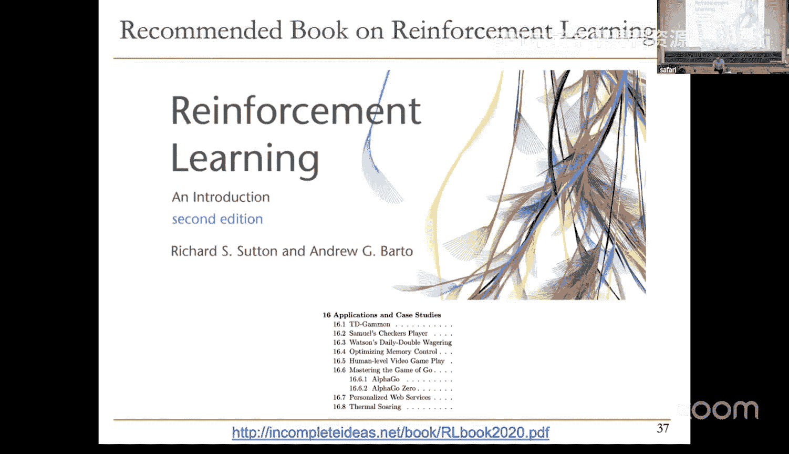
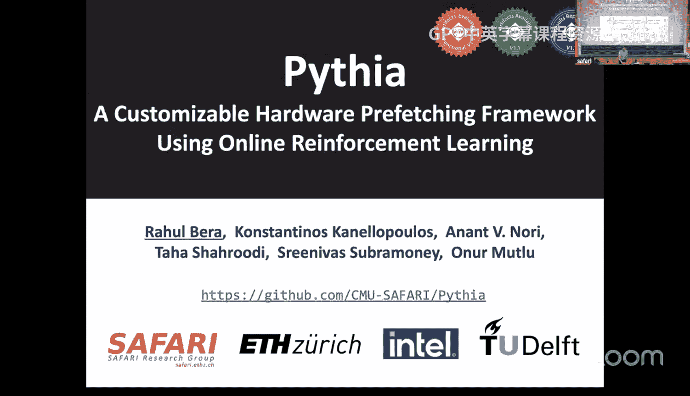
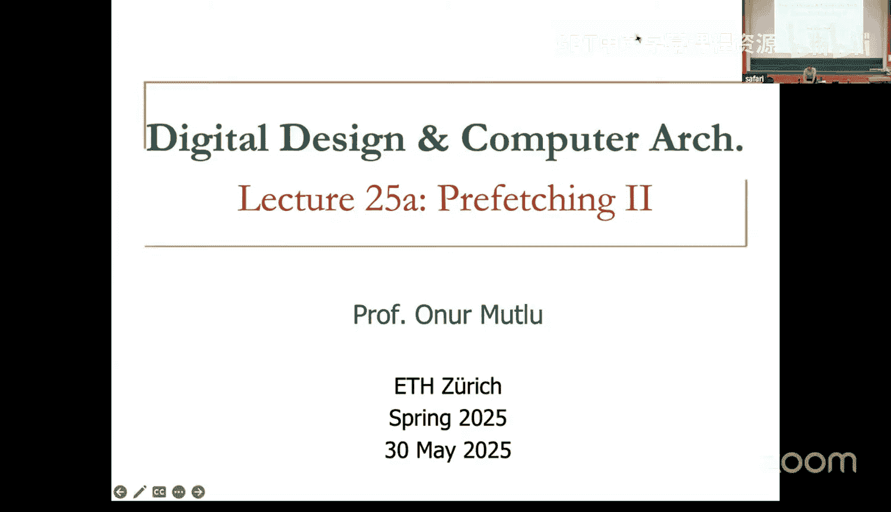
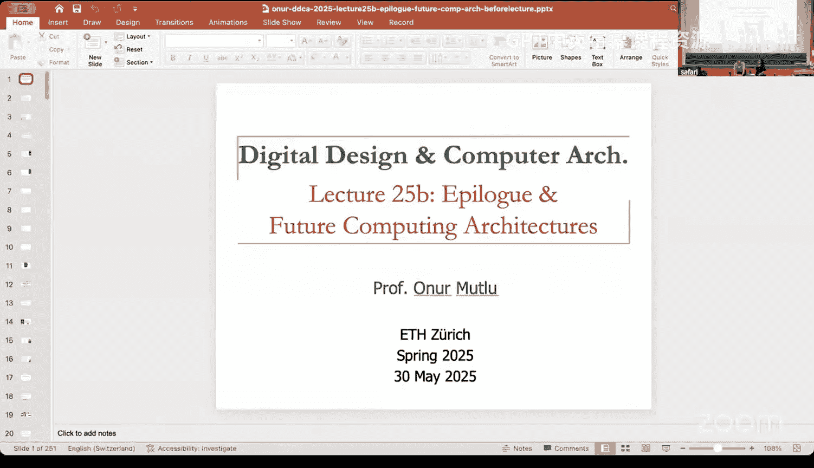
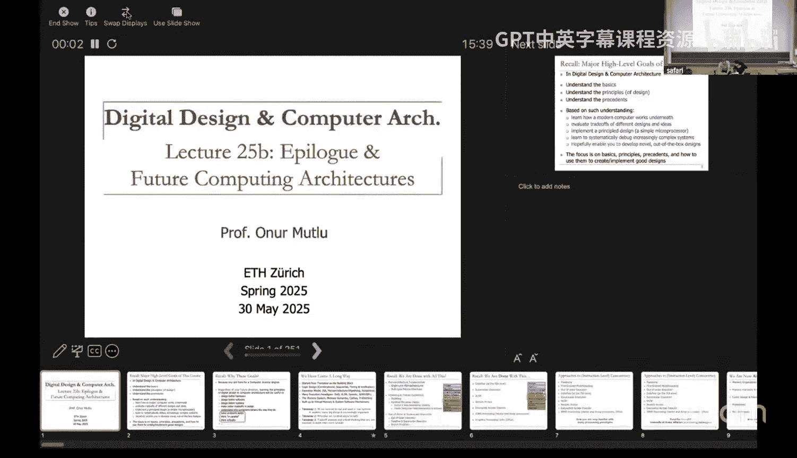
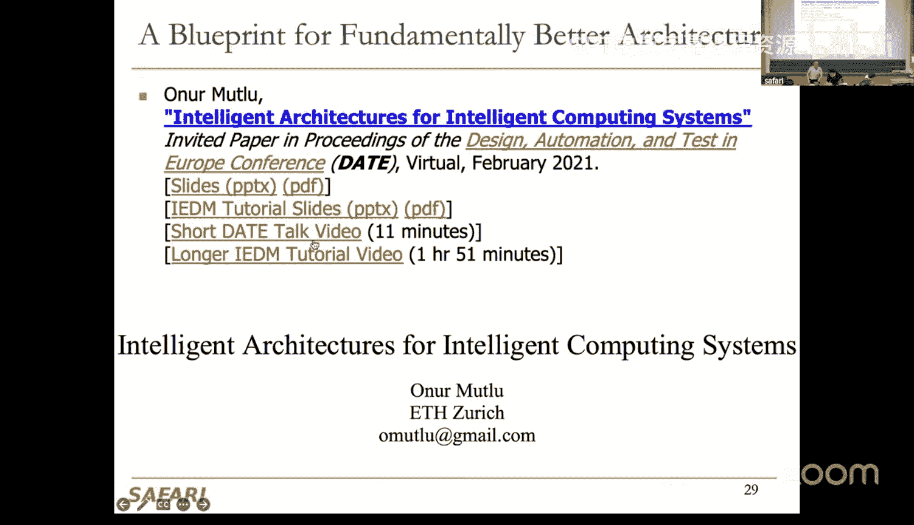

# 25：预取 II、内存内处理与课程总结 (Spr 2025) 🎓

## 概述
在本节课中，我们将继续探讨高级预取技术，包括基于强化学习的自适应预取器，以及一种名为“前瞻执行”的基于执行的预取方法。最后，我们将回顾整个课程的核心内容，并对计算机架构的未来进行展望。

---

## 基于强化学习的预取器 🤖

上一节我们介绍了预取的基本概念和挑战。本节中，我们将探讨一种更智能、更灵活的预取器设计方法——基于强化学习的预取器。

### 强化学习简介
强化学习是一种机器学习范式，其核心思想是：智能体在与环境交互的过程中，通过尝试不同的动作并根据获得的奖励（或惩罚）来学习在特定状态下应采取的最佳动作，以最大化长期累积奖励。

### 将预取问题形式化为强化学习问题
我们可以将预取器设计为一个强化学习智能体，其环境是处理器和内存子系统。其目标是学习何时、预取何地址的数据。

*   **状态**：由一系列特征构成，例如：
    *   生成当前内存请求的指令的程序计数器。
    *   最近访问的地址之间的差值。
    *   最近观察到的多个差值序列。
*   **动作**：选择一个偏移量进行预取。例如，对于当前地址 `A`，动作可以是预取 `A + offset`，其中 `offset` 可以是 -63 到 +63 之间的一个值，包括 0（表示不预取）。
*   **奖励**：根据预取的效果给予智能体反馈。奖励函数需要精心设计，以平衡多个目标：
    *   **准确性**：预取的数据是否被实际使用。
    *   **及时性**：预取是否在处理器需要数据之前完成。
    *   **系统影响**：预取对内存带宽的占用是否过高。

### 自优化预取器 Pythia 的实现
Pythia 是一个基于 Q-Learning 的预取器。其核心组件是一个 Q 值表，存储了每个“状态-动作”对的预期质量值。

以下是其工作流程的简化描述：
1.  **观察与决策**：当出现一个内存请求（地址 `A`）时，预取器提取当前状态特征 `S`。
2.  **查询 Q 表**：根据状态 `S`，查找 Q 表中所有可能动作（偏移量）对应的 Q 值。
3.  **选择动作**：选择 Q 值最高的动作（偏移量 `O`）。
4.  **执行预取**：生成预取请求 `A + O` 并发送至内存层次结构。
5.  **评估与学习**：将此次“状态-动作”对记录在评估队列中。随后，监控处理器是否实际请求了该预取数据，以及请求的时机。根据这些观察结果计算奖励 `R`。
6.  **更新 Q 表**：使用奖励 `R` 更新 Q 表中对应的 `(S, O)` 值，公式遵循 Q-Learning 的更新规则（例如：`Q(S,O) = Q(S,O) + α * [R + γ * max_a Q(S_next, a) - Q(S,O)]`，其中 `α` 是学习率，`γ` 是折扣因子）。

这种设计的优势在于其**自适应性**和**可配置性**。预取器可以在线学习，适应不同的工作负载和动态的系统条件（如变化的带宽）。通过调整奖励函数，甚至可以在不修改硬件的情况下改变预取器的策略（例如，从激进变为保守）。

---

## 基于执行的预取：前瞻执行 🏃

除了基于历史模式预测的预取器，还有另一类思路：直接提前执行一小段程序代码，专门用于发现和预取数据。这就是基于执行的预取，其中“前瞻执行”是一个代表性技术。

### 动机与核心思想
现代乱序执行处理器依靠大的指令窗口来容忍内存访问延迟。然而，构建非常大的指令窗口会导致设计复杂、功耗高、周期时间长。

前瞻执行提出了一个不同的思路：当遇到一个导致长时间停滞的缓存缺失（例如 L2 缓存缺失）时，处理器保存当前的架构状态（检查点），然后进入一种特殊的**前瞻模式**。在这个模式下，处理器继续推测性地执行后续指令，但**目的不是提交结果**，而是为了：
1.  **发现后续的缓存缺失**：提前执行到可能发生缓存缺失的加载指令。
2.  **发起预取**：为这些发现的缺失地址提前发起内存请求。
3.  **避免因长延迟指令而阻塞**：在前瞻模式中，遇到依赖未返回数据的指令（标记为无效）时，会跳过它们，从而为窗口中其他不依赖该数据的指令腾出空间，继续向前推进。

当最初导致进入前瞻模式的那个缓存缺失返回数据时，处理器**恢复检查点**，刷新流水线，并回到正常执行模式。此时，由于前瞻执行已经预取了一些数据，后续的缓存缺失可能已经部分或全部被解决，从而显著减少了处理器的停滞时间。

### 工作示例
假设程序顺序如下：
1.  `LOAD X` （导致 L2 缓存缺失，长延迟）
2.  `COMPUTE ...`
3.  `LOAD Y` （也可能导致缓存缺失）
4.  `COMPUTE ...`

**没有前瞻执行**：`LOAD X` 缺失，处理器在指令窗口满后停滞，等待 `X` 返回。`LOAD Y` 的缺失只能在其被正常执行时才开始，两个缺失串行处理。
**有前瞻执行**：`LOAD X` 缺失后，进入前瞻模式。推测性地执行后续 `COMPUTE` 和 `LOAD Y`。`LOAD Y` 的缺失被提前发现并发出请求。当 `X` 的数据返回，恢复检查点后重新执行 `LOAD X`（此时命中），不久后执行到 `LOAD Y` 时，其数据可能也已返回或即将返回。两个缺失的处理时间实现了重叠。

### 优势与挑战
**优势**：
*   **高准确性**：因为是真实执行程序，预取准确性极高（可达95%以上），尤其擅长处理不规则访问模式（如指针追逐）。
*   **实现相对简单**：相比构建超大型指令窗口，对现有流水线改动较小。
*   **无额外硬件上下文**：复用主线程资源。

**挑战**：
*   **额外指令执行**：执行了可能无用的推测指令。
*   **受分支预测精度限制**：在前瞻模式下分支预测错误会导致走错路径。
*   **无法预取依赖的缺失**：如果 `LOAD Y` 的地址依赖于 `LOAD X` 返回的数据，在前瞻模式下无法计算 `Y` 的地址。解决此问题需要**值预测**等更高级的技术。
*   **预取距离有限**：前瞻执行的有效时间受最初那个缓存缺失的延迟限制。

前瞻执行的思想已被多家厂商（如 Sun/Oracle、IBM、NVIDIA）以不同形式采纳和实现，证明了其在实际系统中的价值。

---

## 课程总结与展望 🌟

本节课我们一起学习了两种高级的预取技术，并对整个《数字设计与计算机架构》课程进行了回顾。

### 核心要点回顾
1.  **从晶体管到完整系统**：我们从最底层的晶体管开始，逐步构建了组合/时序逻辑、处理器数据通路与控制单元、流水线、内存层次结构（缓存、虚拟内存），直至系统软件交互。
2.  **理解设计权衡**：贯穿课程的核心是**权衡分析**。无论是性能与面积、延迟与吞吐量、硬件复杂度与灵活性，还是缓存命中率与污染，都没有完美的设计，只有针对特定场景的合适选择。
3.  **多样的执行范式**：我们探讨了多种处理器执行模型，包括：
    *   单周期/多周期
    *   流水线
    *   乱序执行与超标量
    *   VLIW（超长指令字）
    *   SIMD/向量处理
    *   GPU 架构
    *   前瞻执行等
    每种范式都有其适用的场景和固有的权衡。
4.  **内存系统是关键**：我们深入研究了计算机系统中最重要的性能瓶颈——内存墙。了解了缓存原理、优化技术、虚拟内存机制以及像预取这样的高级 latency tolerance 技术。

### 未竟议题与未来方向
计算机架构领域依然充满活力与挑战，本课程未及深入探讨的众多方向正是未来的研究热点：
*   **内存内处理**：为了从根本上缓解数据移动的能耗与延迟问题，将计算单元嵌入内存内部（如 DRAM 芯片内）是一个重要趋势。这需要跨器件、电路、架构、系统的协同创新。
*   **硬件安全**：诸如 Meltdown、Spectre、Rowhammer 等漏洞表明，现代处理器复杂的推测执行和共享资源机制引入了新的安全攻击面。设计安全、可靠、可信的架构至关重要。
*   **领域专用架构**：随着摩尔定律放缓，针对特定领域（如机器学习、图形处理、生物信息学）定制高效能、高能效的加速器变得愈发重要。
*   **智能化架构**：如本节课所见，利用机器学习（如强化学习）来优化架构组件（预取器、内存控制器、分支预测器等）的设计和运行时管理，是一个富有前景的方向。
*   **协同设计**：未来的突破更依赖于硬件、软件、算法、甚至应用需求的紧密协同设计。

### 最后的思考
本课程的目标不仅是传授计算机如何工作的“事实”，更重要的是培养**批判性思维**和**权衡分析**的能力。正如爱因斯坦所言：“教育的价值不在于学习大量事实，而在于训练大脑思考。” 在技术飞速变化的时代，这种能够分析问题、评估方案、并创造性解决问题的能力，将是你们最持久的财富。

希望大家能将课程中学到的原理和思维方法，应用于未来更广阔的学习、研究和工程实践中，去设计和创造更好的计算系统。

**课程至此结束，祝大家考试顺利，未来在计算的世界里继续探索前行！**