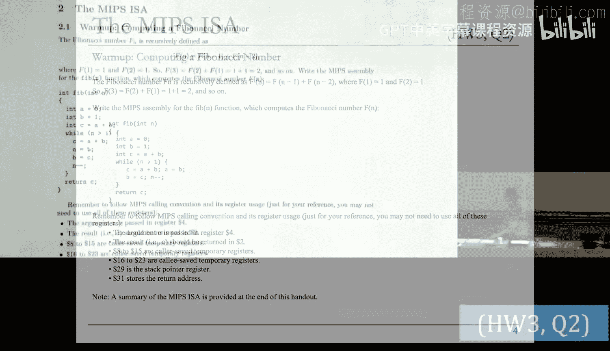
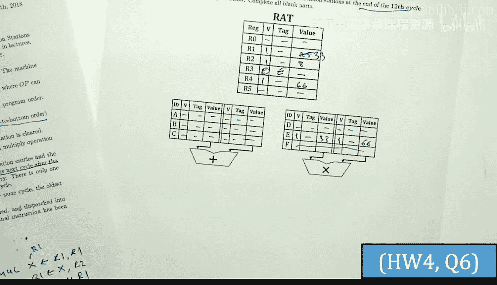
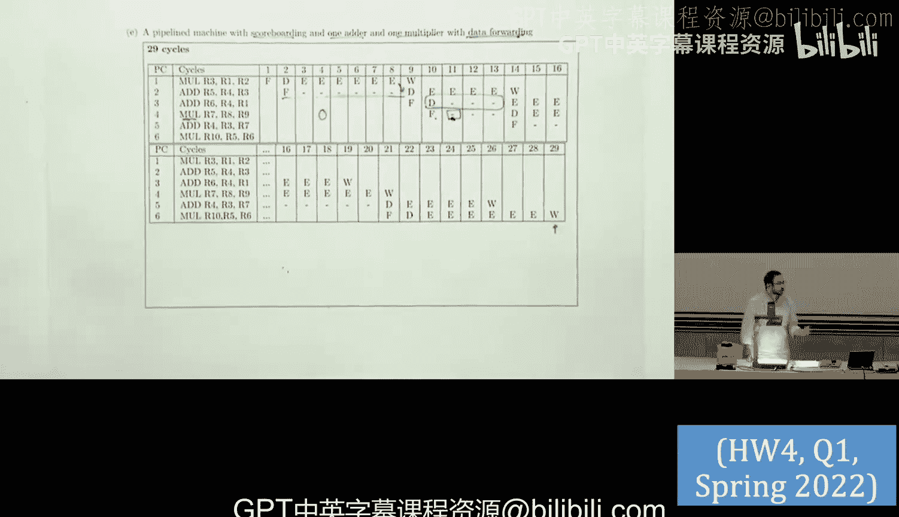

# 26：问题解决 I (Spring 2025)


在本节课中，我们将学习如何解决关于有限状态机、MIPS汇编代码、流水线设计和数据流机器的一系列问题。我们将从分析一个FSM的状态编码开始，然后编写和优化MIPS代码，接着探讨不同流水线配置下的性能，最后设计一个计算斐波那契数列的数据流引擎。

---

## 有限状态机分析

上一节我们介绍了课程概述，本节中我们来看看第一个问题：分析一个给定的有限状态机。

### 问题1：识别缺失组件

观察给定的FSM图，发现缺少一个关键组件：**复位信号**。复位信号用于确保FSM在启动时处于确定的初始状态，从而实现确定性的行为。

### 问题2：确定FSM类型

该FSM的输出仅取决于当前状态，而不依赖于输入。根据定义，这属于**摩尔型**状态机。




### 问题3：不同状态编码的优势

以下是三种常见状态编码方式的主要优势：

*   **独热编码**：目标是减少**次态逻辑**的复杂度。每个状态由单个比特位表示，理想情况下可以简化组合逻辑。
*   **二进制编码**：目标是使用最少的触发器来表示状态，从而**减少所需的触发器数量**。
*   **输出编码**：目标是使用最少的逻辑单元来编码输出，从而**最小化输出逻辑电路**。

### 问题4：构建真值表与逻辑方程

首先，我们根据状态转移图构建一个高级别的真值表，其中状态用符号表示。

| 当前状态 | TA | TB | 输出 (O1, O0) | 次态 |
| :--- | :--- | :--- | :--- | :--- |
| A | X | 0 | 1, 0 | B |
| A | X | 1 | 1, 0 | C |
| B | 0 | X | 1, 1 | C |
| B | 1 | X | 1, 1 | A |
| C | X | X | 0, 1 | D |
| D | X | 0 | 0, 0 | B |
| D | X | 1 | 0, 0 | D |

接下来，我们将使用此表作为参考，推导不同编码下的逻辑方程。

#### 4.1 独热编码

在独热编码中，我们用单个比特位表示每个状态。假设编码为：A=`0001`, B=`0010`, C=`0100`, D=`1000`。


将编码代入真值表后，可以推导出次态和输出的逻辑方程。例如，次态位 `N3` 在特定条件下为1，这些条件由当前状态位和输入决定。

以下是推导出的逻辑方程示例（具体方程取决于完整的真值表推导）：
*   `N3 = C2 + ...`
*   `O1 = C0 + C1`
*   `O0 = C1 + C2`

#### 4.2 二进制编码

在二进制编码中，我们使用最少的比特位数表示状态。对于4个状态，需要2位。假设编码为：A=`00`, B=`01`, C=`10`, D=`11`。


同样代入真值表，推导逻辑方程。例如：
*   `N0 = (C1 & ~C0 & TB) | (C1 & C0) | ...`
*   `O1` 和 `O0` 的逻辑方程也会相应变化。

#### 4.3 输出编码


输出编码旨在最小化输出逻辑。我们尝试将输出位直接映射到状态编码的某些位上。例如，设计状态编码使得 `O1` 仅由状态位 `C1` 决定，`O0` 仅由 `C0` 决定。

通过精心分配状态编码（例如 A=`10`, B=`11`, C=`01`, D=`00`），可以实现这一点，从而简化输出逻辑为：
*   `O1 = C1`
*   `O0 = C0`

次态逻辑需要根据新的编码重新推导。

### 问题5：选择最小化方案


通过比较三种编码方案所需的逻辑门数量（考虑次态逻辑和输出逻辑）以及触发器数量，可以得出结论：在本例中，**输出编码**在最小化整体FSM面积方面表现更优，因为它直接优化了输出逻辑，同时保持了合理的次态逻辑复杂度。

---

## MIPS汇编编程

上一节我们分析了FSM的设计，本节中我们来看看如何用MIPS汇编实现具体算法。

### 问题1：斐波那契数列计算

我们需要将计算第n个斐波那契数的C代码转换为MIPS汇编。C代码如下：
```c
a = 0; b = 1; c = a + b;
while (n > 1) {
    c = a + b;
    a = b;
    b = c;
    n--;
}
```
假设参数 `n` 存储在 `$a0` (`$4`) 中，结果 `c` 存储在 `$v0` (`$2`) 中。



以下是MIPS汇编实现的核心思路：
1.  **函数序言**：保存调用者保存的寄存器（如 `$s0`, `$s1`, `$s2`）到栈中。
2.  **初始化**：将 `$a0` 复制到临时寄存器作为计数器，初始化 `a=0`, `b=1`。
3.  **循环条件**：检查计数器是否大于1。
4.  **循环体**：计算 `c = a + b`，然后更新 `a = b`, `b = c`，递减计数器。
5.  **函数尾声**：恢复保存的寄存器，返回结果。

### 问题2：实现 `rep movsb` 指令

`rep movsb` 是x86指令，用于将指定数量的字节从源数组复制到目标数组。我们需要用MIPS指令模拟它。

假设：`ECX`（计数）在 `$1`，`ESI`（源指针）在 `$2`，`EDI`（目标指针）在 `$3`。

MIPS实现思路：
1.  检查 `$1`（计数）是否为0，若为0则结束。
2.  循环体：从 `$2` 指向的地址加载一个字节，存储到 `$3` 指向的地址。
3.  递增 `$2` 和 `$3`，递减 `$1`。
4.  跳回步骤1。

**代码大小比较**：这条MIPS循环大约需要7条指令，每条4字节，共28字节。而原始的x86 `rep movsb` 指令只有2字节。

**执行指令数分析**：
*   若 `ECX = 25`，则循环体执行25次。每次循环执行6条指令，加上首次的条件判断指令，总执行指令数为 `6*25 + 1 = 151` 条。
*   若 `ECX = 0`，则仅执行1条条件分支指令，不进入循环。

---


## 流水线机器性能分析

上一节我们编写了MIPS汇编，本节中我们来看看不同流水线配置对程序性能的影响。

我们有一段包含加载、存储、加法和分支指令的MIPS代码循环。需要分析在不同机器配置下执行所需的周期数。

### 机器配置
*   **机器1**：无互锁，依赖编译器调度指令或插入空操作，寄存器文件内部转发，预测分支总是成功。
*   **机器2**：硬件实现数据前递（对于加载指令，只能从回写级前递；对于其他指令，可从访存或回写级前递），寄存器文件内部转发，预测分支总是成功。


### 分析步骤
1.  **识别依赖**：分析指令间的数据依赖（RAW）。
2.  **绘制流水线时空图**：根据机器配置（是否有前递、功能单元数量），确定每条指令每个阶段开始的周期。
3.  **计算总周期数**：统计所有指令执行完毕所需的周期数，考虑循环迭代次数和最后的排空周期。

**结论**：通过对比发现，在给定的代码和配置下，尽管机器2具有硬件前递，但由于加载指令前递延迟的限制，其最终执行总周期数与经过编译器优化调度的机器1可能相同或相近。这凸显了编译器优化与硬件支持之间需要权衡。

---

## 数据流机器设计

最后，我们探讨如何为斐波那契函数设计一个数据流引擎。数据流机器基于令牌传递和节点触发执行。

### 可用节点
*   `ADD`：加法
*   `GT`：比较（大于）
*   `COPY`：复制数据
*   `BRANCH`：条件分支（根据布尔输入选择输出路径）
*   常量输入（如 `0`, `1`, `-1`）

### 设计思路
数据流图需要实现斐波那契数列的迭代计算：`F(0)=0`, `F(1)=1`, `F(n)=F(n-1)+F(n-2)` (n>1)。

1.  **基础框架**：
    *   输入令牌 `n`。
    *   首先用 `GT` 节点比较 `n > 0`，结果控制后续流程。
2.  **处理特殊情况 `n=0`**：
    *   若 `n>0` 为假，通过 `BRANCH` 节点将常量 `0` 路由到输出。
3.  **处理 `n>=1` 的情况**：
    *   若 `n>0` 为真，通过一个 `BRANCH` 节点将 `n` 路由到 `ADD` 节点与 `-1` 相加，得到 `n-1`，用于后续迭代。
    *   同时，初始化两个流：`F(n-2)`（初始为0）和 `F(n-1)`（初始为1）。它们作为加法器的输入。
4.  **循环迭代**：
    *   加法器计算 `F(n) = F(n-1) + F(n-2)`。
    *   使用 `COPY` 和 `BRANCH` 节点将本次的结果反馈回去，更新 `F(n-2)` 和 `F(n-1)` 为下一次迭代做准备。
    *   每迭代一次，`n-1` 减1。当 `(n-1) > 0` 不再为真时，触发另一个 `BRANCH` 节点，将当前计算出的 `F(n)` 值路由到输出。


### 关键点
*   令牌流动驱动计算，节点在所有输入令牌就绪时触发。
*   `BRANCH` 节点根据布尔输入选择将数据令牌发送到“真”或“假”输出路径，从而控制数据流向。
*   通过巧妙地连接节点、复制令牌和使用常量流，可以构建出实现迭代算法的数据流网络。

---

## 总结


本节课中我们一起学习了多个核心主题：
1.  **有限状态机**：分析了状态编码（独热、二进制、输出编码）的特点、优势，并实践了从状态图到逻辑方程的推导。
2.  **MIPS汇编**：实现了斐波那契数列计算和复杂x86指令的模拟，理解了汇编编程、函数调用约定以及指令级效率的差异。
3.  **流水线性能分析**：通过绘制流水线时空图，深入分析了数据依赖、前递技术和资源冲突对程序执行周期的影响，比较了不同硬件配置的性能。
4.  **数据流计算**：初步接触了数据流计算模型，设计了实现斐波那契函数的数据流引擎，理解了基于令牌触发的异步计算模式。




这些练习涵盖了数字系统设计与计算机架构中从底层逻辑设计到高层架构权衡的关键技能。