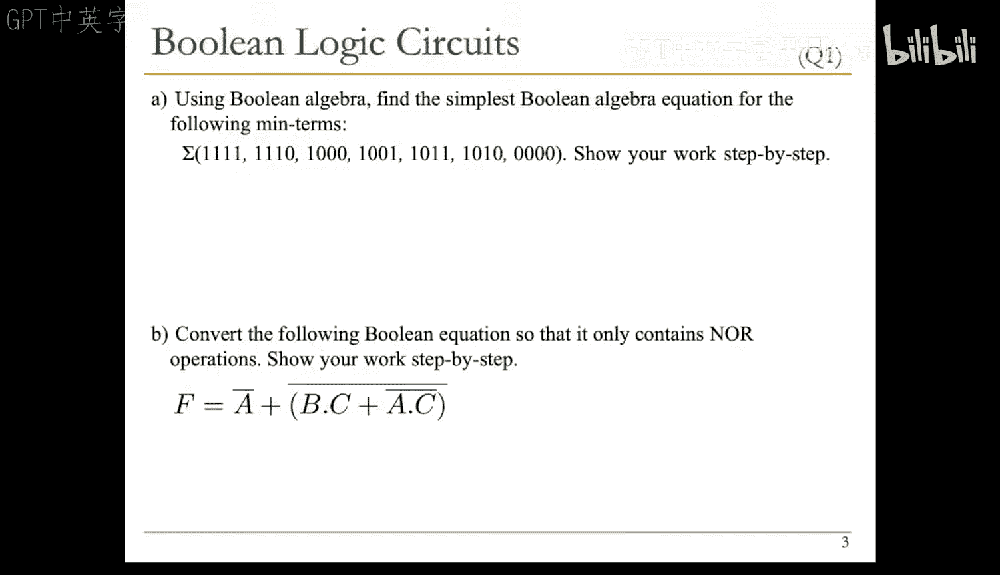
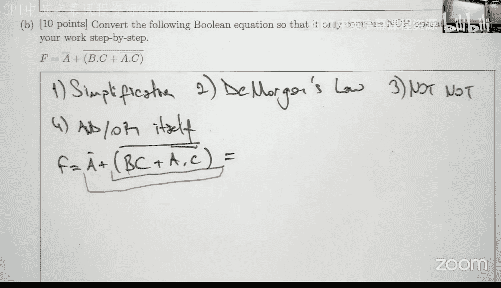
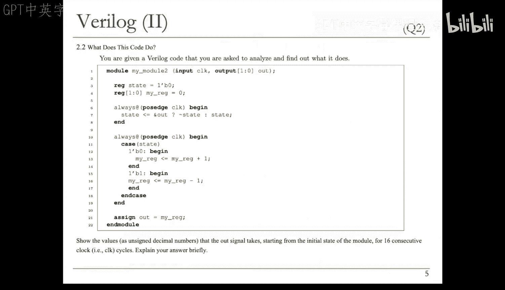
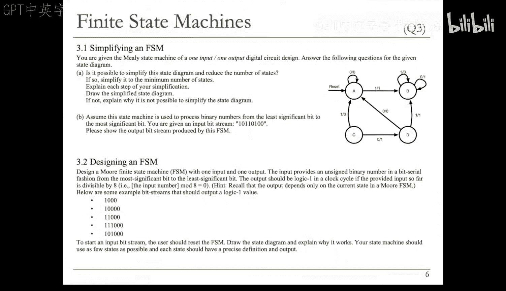
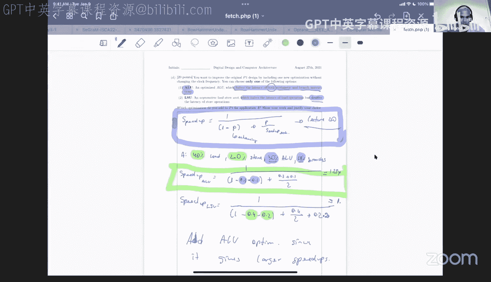
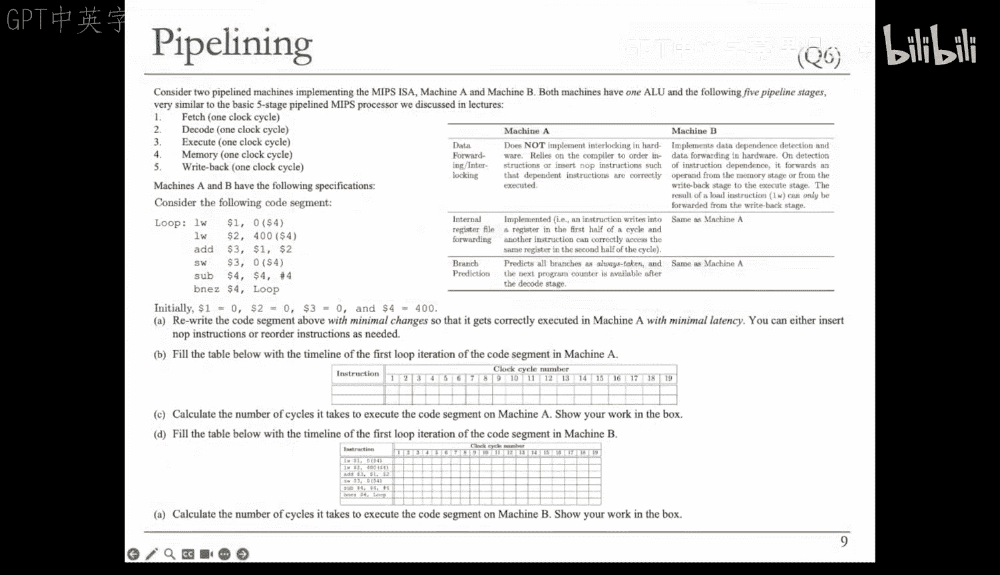
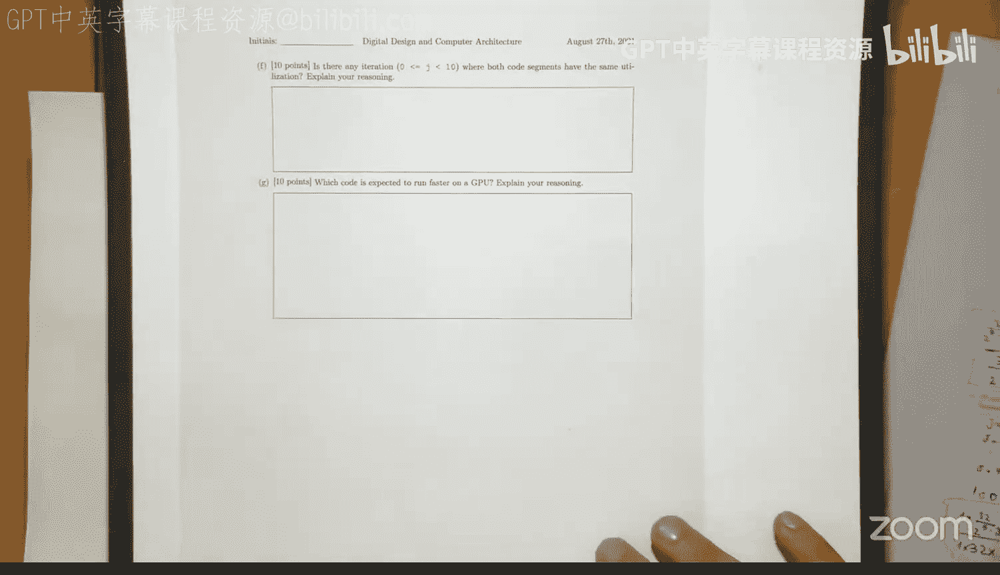
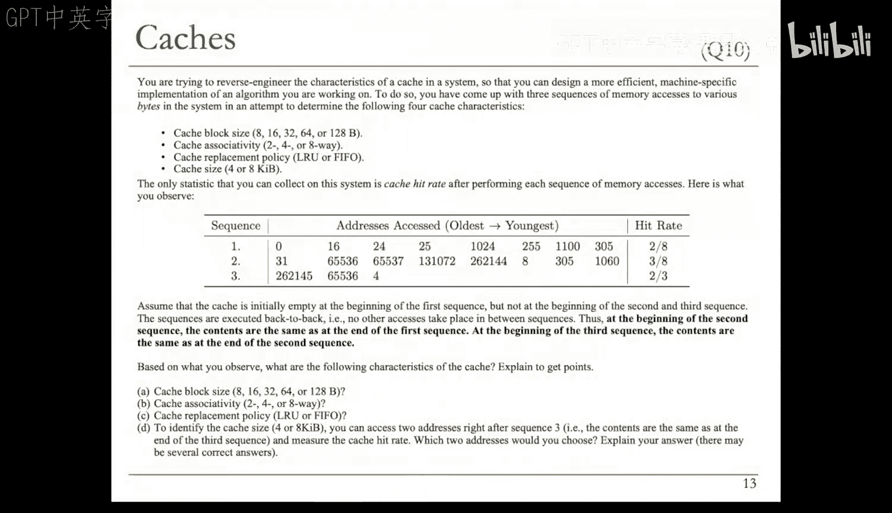
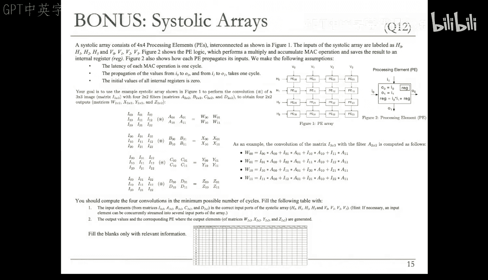

# 29：问题解决 IV (Spring 2025)



## 概述
在本节课中，我们将一起解决去年考试中的12道题目。我们将按照它们在去年考试中出现的顺序进行讲解，涵盖布尔逻辑电路、Verilog代码、有限状态机、性能评估、流水线、Tomasulo算法、GPU/CUDA、分支预测、缓存逆向工程、前瞻执行和脉动阵列等多个核心主题。

---

## 问题 1：布尔逻辑电路



### 1.1 从最小项推导布尔表达式
我们被给定了一些四输入的最小项，需要写出并简化其布尔表达式。我们将使用变量 `A`（最高有效位）到 `D`（最低有效位）。

根据给定的最小项，布尔表达式如下：
```
F = A B C D + A B C D' + A B' C' D + A' B C D + A' B C' D' + A' B' C' D'
```

### 1.2 简化布尔表达式
我们可以通过观察或使用卡诺图来简化表达式。通过寻找公共项，我们可以进行如下简化：



首先，观察到 `BD` 项与 `A` 或 `A'` 组合出现。其次，`AC` 项也频繁出现。通过提取公因子，表达式可以简化为：
```
F = B' C' D' + A C + A B'
```
这可以进一步简化为：
```
F = B' C' D' + A (C + B')
```

**核心概念**：布尔表达式的简化可以通过代数运算或卡诺图完成。公式 `F = Σ m(...)` 表示最小项之和。

### 1.3 转换为仅使用“或非”门的电路
给定一个布尔表达式，我们需要将其转换为仅使用“或非”门的形式。转换步骤通常包括：简化、应用德摩根定律、添加双重否定，或与自身进行“与”/“或”操作以方便转换。

给定表达式：`(B C)' + (A C')'`，我们目标是消除所有“与”和“或”操作，只保留“或非”操作。

**转换过程**：
1.  观察到 `(B C)'` 和 `(A C')'` 已经是“或非”形式（即 `B NOR C` 和 `A NOR (NOT C)`），但 `C'` 需要处理。
2.  处理 `A C'`：可以应用德摩根定律：`A C' = (A' + C)'`，但这不是“或非”。我们选择添加双重否定：`A C' = ( (A C')' )'`。`(A C')'` 已经是 `A NOR C'`。
3.  现在需要实现 `C'`。`C' = C NOR C`。
4.  类似地，`B C = (B' + C')'`（德摩根），而 `B' = B NOR B`，`C' = C NOR C`。
5.  将所有这些部分用“或非”门连接起来，最终得到一个仅由“或非”门组成的电路。

**核心概念**：任何布尔函数都可以仅用“或非”门实现。代码表示：`NOR(A, B) = (A + B)'`。

---

## 问题 2：Verilog 代码补全

### 概述
本题涉及一个Verilog模块，其中有五个空白需要填写，以使其功能正确。

### 代码分析与填空
模块有两个 `always` 块：一个组合逻辑块计算 `n_val`，一个时序逻辑块在时钟沿更新 `out_data`。




1.  **第一个空（`out_data` 声明）**：`out_data` 在第二个 `always` 块中被赋值，且必须保持其值，因此它必须是一个寄存器类型的输出。正确选择是 `output reg [31:0] out_data`。
2.  **第二个空（`n_val` 声明）**：`n_val` 在第一个 `always` 块中被赋值，并在第二个块中使用，因此它必须是一个寄存器。正确选择是 `reg [31:0] n_val`。
3.  **第三个空（`case` 语句的 `default`）**：`case` 语句列出了 `op` 的可能值 `2'b00`， `2'b01`， `2'b10`。对于未列出的值（如 `2'b11`），应使用 `default` 分支。其他选项的语法或数值表示是错误的。
4.  **第四和第五个空（非阻塞赋值）**：在时钟触发的 `always` 块中，为了正确建模时序逻辑，应使用非阻塞赋值 `<=`，而不是阻塞赋值 `=` 或 `==`（比较操作）。因此，两个空都应填入 `<=`。

**核心概念**：在Verilog中，`reg` 用于在 `always` 块中存储值，`output reg` 声明输出寄存器。时序逻辑块应使用非阻塞赋值 `<=`。

---

## 问题 3：Verilog 代码功能分析

### 概述
我们需要分析一段Verilog代码，并计算在16个连续时钟周期内输出 `out` 的值。

### 代码执行分析
该设计包含两个时钟触发的 `always` 块和一个 `assign` 语句。
-   第一个块：根据 `out` 信号（`&out` 表示 `out` 的所有位相与）来切换 `state`。
-   第二个块：根据 `state` 递增或递减 `my_reg`。
-   输出 `out` 直接连接到 `my_reg`。

通过逐步模拟时钟周期，我们得到 `out` 的值序列（十进制）：0, 1, 2, 3, 0, 3, 2, 3, 0, 3, 2, 3, ... 这是一个在0, 2, 3之间循环的模式，其中0和3交替出现，中间穿插着2。

**核心概念**：Verilog的 `always @(posedge clk)` 块描述时序逻辑。非阻塞赋值 `<=` 确保在时钟沿后同时更新。

---

## 问题 4：有限状态机

### 4.1 简化FSM
给定的有限状态机包含不可达状态。状态C没有进入边，因此不可达，可以移除。移除C后，状态D也变得不可达，接着状态E也不可达。移除这些状态后，剩下的状态A和B由于在输入0时输出不同（A输出0，B输出1），因此不能再合并。简化后的FSM只包含状态A和B及其之间的转移。

### 4.2 执行FSM
给定输入比特流（从最低有效位到最高有效位）：`00110101`。从状态A开始：
-   前三个0：保持在A，输出0。
-   遇到第一个1：转移到B，输出1。
-   后续位：在B状态下，输出是输入的取反。
因此，输出序列为：`0 0 0 1 1 0 1 0`。

### 4.3 设计摩尔型FSM
需要设计一个摩尔机，当输入的无符号二进制数（从最高有效位到最低有效位读取）能被8整除时输出1。能被8整除意味着最后三位必须为0。

**状态设计**：
-   `S0`：当前读取的序列能被8整除（输出1）。接收0则保持，接收1则转到 `S1`（输出0）。
-   `S1`：序列以1结尾（输出0）。根据输入转移到 `S2`（以10结尾）或保持。
-   `S2`：序列以10结尾（输出0）。根据输入转移到 `S3`（以100结尾）或回到 `S1`。
-   `S3`：序列以100结尾（输出0）。接收0则回到 `S0`（输出1），接收1则回到 `S1`（输出0）。

**核心概念**：摩尔机的输出仅依赖于当前状态。FSM设计的关键是定义足够的状态来记忆相关的输入历史。





---

## 问题 5：性能评估

### 5.1 计算CPI
处理器P1的指令延迟：Load: 6 cycles, Store: 6 cycles, ALU: 2 cycles, Branch: 2 cycles。
应用A的指令混合比：Load: 40%, Store: 20%, ALU: 30%, Branch: 10%。
平均CPI = (0.4*6) + (0.2*6) + (0.3*2) + (0.1*2) = 4.4

### 5.2 新处理器P2的CPI
P2时钟频率加倍，但所有指令延迟增加4个周期。指令混合比不变。
新CPI = (0.4*(6+4)) + (0.2*(6+4)) + (0.3*(2+4)) + (0.1*(2+4)) = 8.4

### 5.3 比较性能
执行时间公式：`Time = (Instructions * CPI) / Clock Frequency`。
设P1的频率为f，P2的频率为2f，指令数相同。
P1时间 ∝ 4.4 / f
P2时间 ∝ 8.4 / (2f) = 4.2 / f
因此，P2更快，速度是P1的 4.4 / 4.2 ≈ 1.048 倍。

### 5.4 选择优化方案
有两种优化方案：1) IU优化，将ALU和分支指令延迟减半；2) LSU优化，将Load延迟减半，但Store延迟加倍。
使用阿姆达尔定律计算加速比：
-   IU优化：可加速部分比例 = 0.3 + 0.1 = 0.4，加速倍数 = 2。
  加速比 = 1 / ((1-0.4) + 0.4/2) = 1 / (0.6 + 0.2) = 1.25
-   LSU优化：可加速部分比例 = 0.4 + 0.2 = 0.6，但Load加速2倍，Store减速2倍（即加速比0.5）。需要计算整体加速比。
  加速比 = 1 / ((1-0.6) + (0.4/2 + 0.2/0.5)) = 1 / (0.4 + (0.2 + 0.4)) = 1 / 1.0 = 1.0
因此，应选择IU优化。

**核心概念**：CPI是平均每条指令的周期数。阿姆达尔定律：`Speedup = 1 / ((1 - p) + p/s)`，其中p是可优化部分比例，s是该部分的加速比。

---

## 问题 6：流水线

### 概述
分析在两种不同流水线机器（A和B）上运行一段循环代码的性能。机器A需要编译器插入空操作来处理数据冒险，机器B有硬件互锁和转发。

### 6.1 为机器A重排代码
机器A无硬件互锁，需编译器插入 `nop`。分析原始代码的数据依赖：
-   `add` 依赖前两条 `lw` 的结果。`lw` 结果在WB阶段才可用，因此 `add` 需要至少两个 `nop`。
-   `sw` 依赖 `add` 的结果，同样需要两个 `nop`。
-   `sub` 无依赖。
-   `bne` 依赖 `sub` 的结果，需要两个 `nop`。
此外，由于分支预测为“总是采取”，且下一条PC在Decode阶段后可用，因此每条分支指令后实际上需要一个气泡（相当于一个 `nop`）。
重排后的代码需要在关键指令间插入 `nop`。

### 6.2 机器A的时间线
绘制第一个循环迭代的时间线，考虑上述 `nop` 插入点，可以计算出一次迭代需要13个周期。

### 6.3 机器A的总周期数
循环执行100次。总周期数 = 100 * 13 + 排空流水线的3个周期 = 1303 cycles。

### 6.4 机器B的时间线与总周期数
机器B有硬件互锁和转发。`lw` 结果只能从WB阶段转发。
-   `add` 需要等待第二个 `lw` 的WB阶段，因此停顿1周期。
-   `sw` 能直接从 `add` 的MEM阶段获得转发，无停顿。
-   `bne` 依赖 `sub`，需等待其WB阶段，停顿1周期。
分析表明，一次迭代需要8个周期。
总周期数 = 100 * 8 + 3 = 803 cycles。

**核心概念**：数据冒险可通过转发或停顿解决。加载-使用冒险需要至少一个周期的停顿。分支误预测会导致性能损失。

---

## 问题 7：Tomasulo算法

### 概述
给定一个Tomasulo算法的状态快照（保留站和寄存器别名表），我们需要推导出已取指指令的数据流图及其程序顺序。

### 7.1 构建数据流图
从初始RAT和保留站快照反向推导：
1.  保留站中，有些条目操作数就绪（如值82和1），对应初始寄存器R1和R2。它们产生结果，用于更新某个寄存器（如R8）。
2.  其他条目有依赖标签（如标签F），表明它们等待之前指令的结果。
通过追踪这些依赖关系，可以构建出一个数据流图，节点表示操作（加法/乘法），边表示数据流，边上标有目标寄存器名和保留站标签。

### 7.2 推断指令序列
根据数据流图中的依赖关系，可以推断出五条指令的程序顺序。例如：
1.  `add R3, R4, R7`  // 产生用于后续乘法的值
2.  `add R8, R1, R2`  // 独立的加法
3.  `mul R5, R3, R2`  // 使用第一条指令的结果
4.  `mul R4, R5, R4`  // 使用第三条指令的结果
5.  `mul R9, R6, R3`  // 使用第一条指令的结果
顺序可能不唯一，但需满足数据依赖。

**核心概念**：Tomasulo算法使用保留站实现乱序执行。寄存器别名表跟踪寄存器值的生产者（保留站）。

---

## 问题 8：GPU/CUDA

### 概述
本题涉及GPU的线程束调度和SIMD利用率计算。分析两段代码在给定GPU配置下的行为。

### 8.1 计算线程束数量
代码有1024次迭代，每个迭代分配给一个线程。GPU线程束大小为32。
所需线程束数 = 1024 / 32 = 32 warps。



### 8.2 代码段1的SIMD利用率（第一次内循环）
对于代码段1，当 `j=0` 时，`S=1`。条件 `(i % (2*S)) == 0` 即检查 `i` 是否为偶数。
-   在线程束中，一半线程（偶数ID）执行if块（4条指令），另一半（奇数ID）跳过if块（执行3条指令）。
-   有效指令比例 = (16*4 + 16*3) / (32*4) = 7/8 = 87.5%。

### 8.3 代码段2的SIMD利用率（第一次内循环）
对于代码段2，当 `j=0` 时，`S=512`。条件 `i < S`。
-   前16个线程束（线程ID 0-511）的所有线程都满足条件，执行4条指令。
-   后16个线程束的所有线程都不满足条件，执行3条指令。
-   没有线程束内部出现分歧，因此SIMD利用率为100%。

### 8.4/8.5 通用SIMD利用率公式
对于代码段1，`S = 2^(j+1)`。当 `j<5`（`S<=32`）时，每个线程束内都有活跃和非活跃线程。利用率公式为 `[4/(2^(j+1)) + 3*(1 - 1/(2^(j+1)))] / 4`。当 `j>=5` 时，有些线程束完全活跃，有些完全非活跃，有些则混合，公式更复杂。
对于代码段2，`S = 512 / 2^j`。当 `j<=4`（`S>=32`）时，利用率100%。当 `j>4` 时，利用率开始下降，公式类似但模式不同。

### 8.6 相同利用率的迭代
当 `j=9` 时，对于两段代码，`S` 都变为1（代码段1）或1（代码段2），条件本质相同，因此SIMD利用率相同。

### 8.7 性能比较
通常，SIMD利用率更高的代码段运行更快，因为它更有效地使用了硬件资源。代码段2在大多数迭代中利用率更高，因此预计更快。

**核心概念**：SIMD利用率衡量硬件计算单元的活跃比例。线程束内分支分歧会降低利用率。

---

## 问题 9：分支预测

### 概述
分析三段代码在三种不同分支预测器下的误预测率。

### 9.1 机器A（总是采取）
-   B1（循环条件）：1000次采取，最后1次不采取 → 1次误预测。
-   B2（偶数判断）：1000次执行，50%采取 → 500次误预测。
-   B3（i<250）：前250次采取，后750次不采取。预测总是采取，因此后750次误预测。
-   B4（i<500）和B5（i>=500）：各500次误预测。
总误预测数 = 1 + 500 + 750 + 500 + 500 = 2251。总分支数 = 1000*5 + 1 = 5001。误预测率 = 2251/5001 ≈ 0.45。

### 9.2 机器B（全局2位饱和计数器）
预测器初始为“弱采取”。需要模拟分支历史对全局状态的影响。
-   分析不同 `i` 值范围（如0-249， 250-499， 500-999）下，B1-B5的交互如何改变全局预测器状态。
-   由于全局历史，误预测模式复杂。通过详细模拟可计算出总误预测数约为1875，误预测率约为0.375。



### 9.3 机器C（局部每分支2位饱和计数器）
每个分支有自己的预测器，初始为“弱不采取”。
-   B1：除最后一次外都采取，很快变为“强采取”，最后1次误预测。
-   B2：在“采取”与“不采取”间振荡，导致大量误预测（约1000次）。
-   B3：前250次采取，之后不采取。预测器从“强采取”逐渐变为“强不采取”，期间有误预测（约2次状态转换）。
-   B4和B5：模式类似B3，各有约2次状态转换误预测。
总误预测数 ≈ 1 + 1000 + 2 + 2 + 2 = 1007。误预测率 ≈ 1007/5001 ≈ 0.201。

**核心概念**：分支预测器试图猜测分支方向。局部预测器跟踪单个分支的历史，全局预测器使用所有分支的历史。饱和计数器用于记录预测强度。

---


## 问题 10：缓存逆向工程

### 概述
通过设计内存访问序列并观察命中率，推断未知缓存的参数：块大小、相联度、替换策略和总容量。

### 10.1 确定块大小
给定访问序列1：0， 16， 24， 25， 1024， 255， 1100， 305。命中率观测为2/8。
-   假设块大小为16字节：地址0和16属于不同块，24和25与16在同一块（命中），其他地址均首次访问（未命中）。命中数=2，符合。
-   块大小为8字节：只有25命中（1次），不符合。
-   块大小为32字节或更大：命中数会更多（>=3），不符合。
因此，块大小为16字节。

### 10.2 确定相联度与替换策略
已知块大小16B。需测试相联度（2，4，8路）和容量（4KB，8KB）以及替换策略（LRU， FIFO）。
-   使用序列1，2，3的观测命中率进行检验。
-   通过模拟发现：
    -   8路不符合任何容量/策略组合下的观测命中率。
    -   4路在特定组合下可能符合序列1和2，但不符合序列3的命中率。
    -   2路相联，配合FIFO替换策略，且缓存容量为4KB时，能完全符合三个序列的观测命中率（2/8， 3/8， 2/3）。
因此，相联度为2路，替换策略为FIFO，缓存大小为4KB。

### 10.3 确定缓存大小（4KB vs 8KB）
在已知其他参数（2路，16B块，FIFO）后，需设计两个额外的访问地址来区分4KB和8KB缓存。
-   思路：选择一个在4KB缓存中会映射到Set 0并导致冲突替换，但在8KB缓存中会映射到其他组的地址。
-   例如，选择地址 `2048`。在4KB缓存中，它映射到Set 0，根据FIFO会替换掉Set 0中的一个旧块。在8KB缓存中，它可能映射到Set 1。
-   紧接着访问被替换块的地址（如地址 `0`）。
-   在4KB缓存中，对 `0` 的访问将未命中（因为它被替换了）。在8KB缓存中，对 `0` 的访问可能命中（如果它仍在缓存中）。
通过观察这两个访问的命中/未命中情况，即可确定缓存大小。

**核心概念**：缓存参数（大小、相联度、块大小、替换策略）决定了访问模式下的命中率。通过精心设计的访问序列可以逆向推导这些参数。

---

## 问题 11：前瞻执行

### 概述
分析一个存在bug的前瞻执行处理器：在前瞻模式下，每隔一条指令就被丢弃。判断其对程序执行的影响。

### 问题分析
1.  **Buggy处理器能正确且更快地完成程序吗？** 可能。即使丢弃一半指令，如果丢弃的不是关键路径上的指令，或者错误地提前发现了更多可并行的内存操作，buggy处理器可能偶然地比正确的前瞻处理器更快找到提交点。
2.  **Buggy处理器能正确但更慢地完成程序吗？** 可能。如果丢弃的指令包含很多本可用于发现依赖内存操作的机会，那么buggy处理器的前瞻效率会降低，导致更慢完成。
3.  **Buggy处理器会导致不正确执行吗？** 不会。前瞻执行的关键原则是，在前瞻模式下执行的所有操作都是试探性的，在确认正确之前不会提交（写回架构状态）。因此，即使硬件有bug，只要提交阶段逻辑正确，程序的最终结果仍然是正确的。

**核心概念**：前瞻执行是一种推测性优化，其操作结果在确认正确前不会永久化（不提交）。这提供了容错性。

---

## 问题 12：脉动阵列

### 概述
将卷积操作映射到4x4的脉动阵列上。卷积在输入矩阵I与四个不同的权重矩阵（A， B， C， D）之间进行。



### 操作映射
脉动阵列的每个处理单元执行乘累加操作。数据（输入I和权重）从顶部和左侧流入，结果在内部累加，并沿对角线方向传播。
-   **权重**：可以将四个不同的权重矩阵（A， B， C， D）的值预先加载到阵列的不同行或列，或者在时间上多路复用。
-   **输入**：输入矩阵I的元素以滑动窗口的方式从顶部流入阵列。
-   **计算**：每个PE计算其接收到的I元素和权重元素的乘积，并累加到部分和中。经过多个时钟周期，完整的卷积结果将从阵列底部或右侧输出。

**具体步骤**：
1.  在第一个周期，将 `I[0][0]` 和 `A[0][0]` 送入左上角的PE，计算乘积。
2.  下一个周期，`I[0][0]` 向下传播，`A[0][0]` 向右传播。同时，新的元素 `I[0][1]` 和 `A[0][1]`（或 `I[1][0]`）被送入相应PE。
3.  通过精心调度输入和权重数据的流入节奏，可以在阵列中同时计算多个卷积窗口。最终，每个PE会输出卷积结果矩阵中的一个元素。

**核心概念**：脉动阵列是一种规则的处理单元网络，数据在单元间以流水线方式同步流动，非常适合计算密集型、规则的操作如卷积。数据复用和流水线是高效的关键。

---

## 总结
本节课我们一起系统地解决了去年考试中涵盖数字设计和计算机架构广泛主题的12个问题。我们从基本的布尔逻辑和Verilog开始，逐步深入到流水线冒险、动态调度（Tomasulo）、GPU并行计算、分支预测、缓存体系结构以及前瞻执行等高级概念。希望这次练习能帮助你巩固理解，并为应对考试做好准备。