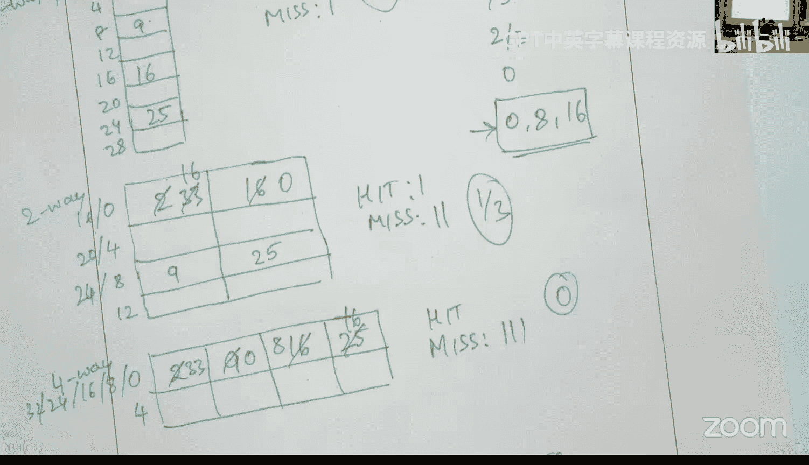
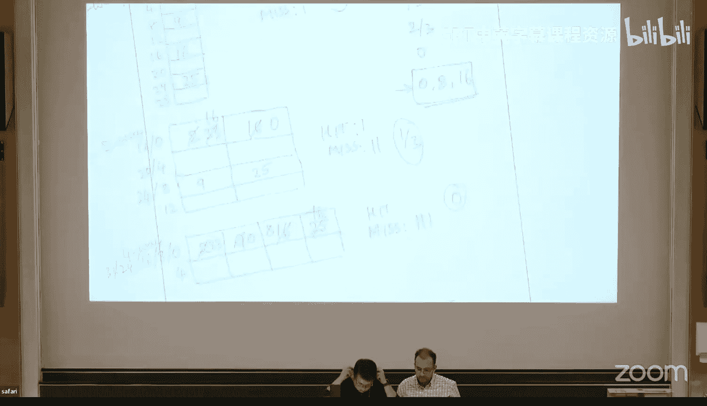
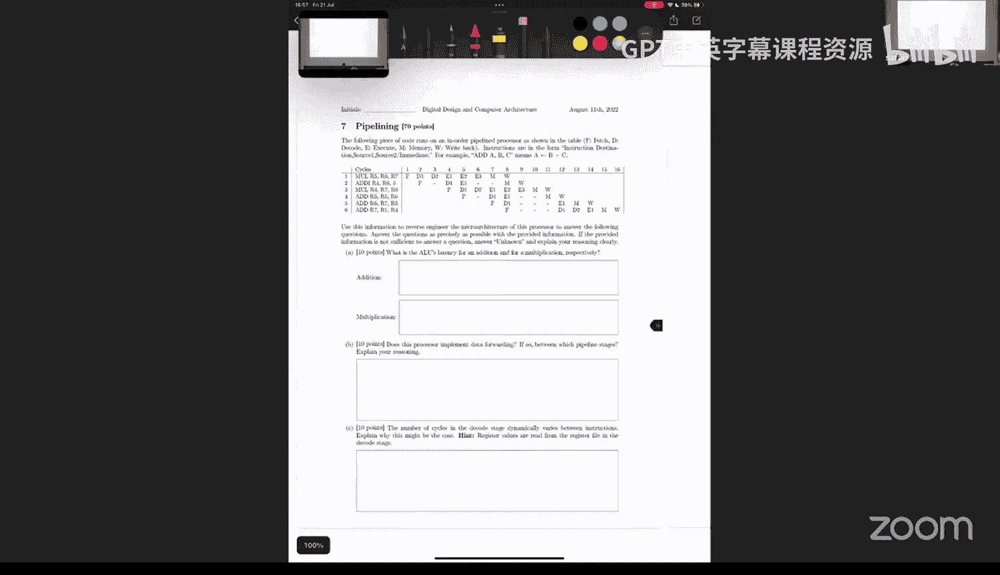

# 31：问题解决 VI (Spring 2025) 🧠

在本节课中，我们将一起解决去年考试中的一系列问题，涵盖布尔代数、有限状态机、微架构概念、Verilog代码分析、内存系统、性能评估、Tomasulo算法、GPU计算、分支预测、预取器和缓存逆向工程等多个核心主题。我们将逐一拆解每个问题，确保初学者也能理解其背后的原理和解题步骤。

---

## 布尔代数与逻辑简化 🔢

首先，我们来看第一个关于布尔代数和真值表的问题。题目要求我们根据描述完成一个真值表，然后对输出表达式进行简化。

### 真值表构建

问题描述了一个4位输入的系统，有两个输出：`factorial` 和 `d4`。
*   **factorial输出**：仅当输入数字是所有小于等于该输入的正整数的乘积（即阶乘数）时为1。根据定义，只有输入0、1、2满足条件。
*   **d4输出**：仅当输入的4位数能被4整除时为1。即输入为0、4、8、12时输出为1。

基于此，我们可以构建出真值表。

### 表达式简化

接下来，我们需要根据真值表写出`d4`输出的积之和表达式，并进行简化。

1.  **写出积之和表达式**：找出所有使`d4`输出为1的输入组合，每一项对应一个最小项。
    `d4 = A'B'C'D' + A'B'C'D + A'BC'D' + ABC'D'`

2.  **应用布尔代数简化**：合并具有最多公共项的乘积项。
    *   合并前两项：`A'B'C'D' + A'B'C'D = A'B'C'(D' + D) = A'B'C'`
    *   合并后两项：`A'BC'D' + ABC'D' = C'D'(A'B + AB) = C'D'B` (因为 `A'B + AB = B`)
    *   因此，`d4 = A'B'C' + BC'D'`
    *   进一步观察，`A'B'C' = C'(A'B')`，而`BC'D' = C'(BD')`。可以提取公因子`C'`，但`A'B'`和`BD'`无法直接合并为1。检查卡诺图或继续使用代数法：
        `d4 = C'(A'B' + BD')`。注意`B`可以再次提取：`d4 = C'[B(A' + D') + A'B']`？更简单的方法是直接观察原始四项，或者使用卡诺图，可以得到最简形式：`d4 = C'D'`。因为从真值表可知，只要`C=0`且`D=0`（即输入的低两位为00），`d4`就为1，这与能被4整除的条件一致（二进制低两位为00）。

**核心公式**：
`d4 = C'D'`

### 仅用或非门实现

最后，问题要求仅使用或非门来实现`factorial`输出。我们首先简化`factorial`表达式。

1.  **简化`factorial`表达式**：
    `factorial = A'B'C'D' + A'B'C'D + A'B'CD'`
    合并前两项：`A'B'C'(D' + D) = A'B'C'`
    所以 `factorial = A'B'C' + A'B'CD' = A'B'(C' + CD')`
    根据布尔代数定理 `X' + XY = X' + Y`，这里 `C' + CD' = C' + D'`。
    因此，`factorial = A'B'(C' + D')`

2.  **转换为仅用或非门**：
    利用双重否定和德摩根定律将表达式转换为或非形式。
    `F = A'B'(C' + D')`
    双重否定：`F = [ (A'B'(C' + D'))' ]'`
    应用德摩根定律到内层：`F = [ (A'B')' + (C' + D')' ]'`
    再次应用德摩根定律：`F = [ (A + B) + (C D) ]'`
    现在，整个表达式是一个大的或非门：`F = NOR( (A+B), (C D) )`
    但是`(A+B)`和`(C D)`还不是基本输入。我们需要用或非门来构建它们：
    *   `(A+B) = (A' B')' = NOR(A', B')`。而`A' = NOR(A, A)`，`B' = NOR(B, B)`。
    *   `(C D) = (C' + D')' = NOR(C', D')`。而`C' = NOR(C, C)`，`D' = NOR(D, D)`。

    因此，最终的电路由多个或非门构成，其核心思想是利用`NOR(X, X)`来获得`X'`，并组合实现所需的与、或逻辑。

**本节总结**：我们学习了如何根据功能描述构建真值表，使用布尔代数或卡诺图简化逻辑表达式，以及如何利用双重否定和德摩根定律将任意逻辑电路转换为仅由或非门（或与非门）构成的形式。

---

## 有限状态机设计 🚂

上一节我们处理了组合逻辑问题，本节中我们来看看时序逻辑，具体是一个有限状态机的设计问题。题目要求为一个双门摆渡车系统设计控制器。

### 摩尔型FSM

问题首先要求绘制一个摩尔型FSM。摩尔型FSM的输出仅与当前状态有关。

1.  **确定状态**：根据问题描述，状态已经给出：`Idle0`, `Idle1`, `Transit`, `Unload2`, `Unload1`, `Emergency`。状态中的数字通常代表车内的乘客数量。
2.  **确定输出**：门A和门B的控制信号。根据描述：
    *   `Idle`状态：门A打开(`A=1`)，门B关闭(`B=0`)。
    *   `Transit`状态：两门都关闭(`A=0, B=0`)。
    *   `Unload`状态：门A关闭(`A=0`)，门B打开(`B=1`)。
    *   `Emergency`状态：两门都打开(`A=1, B=1`)。
3.  **确定状态转移**：根据输入信号（乘客进入、离开、到站）进行转移。
    *   输入格式：`[enter, leave]`。`10`表示进入，`01`表示离开，`11`表示到站，`00`表示无事发生。
    *   关键规则：乘客数达到2时从`Idle`进入`Transit`；在`Transit`中收到`11`（到站）进入`Unload2`；在`Unload`状态，乘客离开(`01`)减少乘客数；乘客数超过2（例如在`Transit`中有人进入）则进入`Emergency`；`Emergency`为吸收态。
4.  **绘制状态图**：需要画出所有状态节点，标明每个状态的输出`(A,B)`，并根据规则用带输入标签的箭头连接状态。未明确指出的转移可视为自循环。

### 米利型FSM

第二部分要求基于之前的FSM，设计一个米利型FSM来控制铃铛。铃铛在门打开或关闭时响起，在紧急状态下常响。

1.  **理解差异**：米利型FSM的输出与当前状态**和**当前输入有关，体现在转移边上。
2.  **复用状态逻辑**：可以保留完全相同的状态和转移边。
3.  **确定边上的输出**：遍历每条转移边，判断该转移是否引起门状态变化（对比源状态和目标状态的输出）。如果有变化，则该边输出`Bell=1`。此外，在`Emergency`状态下，所有转移边（包括自循环）输出都应为`Bell=1`。

**本节总结**：我们实践了摩尔型和米利型有限状态机的设计，理解了它们输出方式的不同（状态 vs. 转移边），并学会了如何根据自然语言规范来定义状态、输出和转移条件。

---

## 指令集架构与微架构 🏗️

现在，我们来区分计算机系统中的指令集架构和微架构概念。

以下是问题列表及判断：
1.  **两级全局分支预测器**：微架构。这是实现细节，对程序员不可见。
2.  **`add`指令中目标寄存器标识位的位置**：ISA。指令格式是ISA的一部分。
3.  **每个周期取指的指令数**：微架构。涉及流水线宽度等实现。
4.  **浮点与整数通用寄存器的数量比例**：ISA。寄存器数量是编程模型的一部分，比例可由此算出。
5.  **整数算术逻辑单元的数量**：微架构。执行资源的具体数量。
6.  **处理器的指令发射宽度**：微架构。流水线微架构特性。
7.  **`cmov`指令的支持**：ISA。这是一条具体的指令。
8.  **L3缓存替换策略**：微架构。通常对软件透明。
9.  **到内存的数据总线宽度**：微架构。硬件互连细节。
10. **程序可寻址内存的大小**：ISA。由地址总线位数等决定，影响编程。
11. **执行一条`add`指令所需的周期数**：微架构。取决于具体实现和流水线。
12. **通过操作系统内核选择特定缓存替换策略的能力**：ISA。因为这提供了一个可编程的接口。
13. **物理寄存器文件的读端口数量**：微架构。寄存器重命名实现细节。
14. **程序员可编程预取器配置寄存器中每个位的功能**：ISA。因为是可编程的。
15. **L3缓存体的数量**：微架构。硬件组织结构。

**本节总结**：我们明确了指令集架构是软件与硬件之间的契约，定义了编程模型；而微架构是硬件实现的具体方式，旨在高效地执行ISA定义的指令。

---

## Verilog代码分析 ⚙️

本节我们将分析一段Verilog代码，理解其行为并完成相关题目。

### 代码行为分析

给定一个模块，有时钟`clk`、使能`enable`、输入`in1`和`in2`，以及输出`out`。内部有一个寄存器变量`var1`。
`in1`是16位十六进制常数`0x648c`，`in2`是8位常数`8'b10011010`。
我们需要根据波形图（一系列时钟沿）确定`out`信号的值。

**解题步骤**：
1.  **理解代码逻辑**：
    *   `always @(posedge clk)` 块在时钟上升沿执行。
    *   如果`enable`为0，`out`保持不变。
    *   如果`enable`为1，且`var1`等于某个值，则检查`in2`的某一位（由`var1`索引）。如果该位为1，则`out`加上`in1`的一个8位片段；如果为0，则`out`减去该片段。
    *   `in1[var1*8 +: 8]` 是位选择语法，表示从索引`var1*8`开始，选择宽度为8位的向量。
    *   每个周期，`var1`递增。
2.  **逐步仿真**：
    *   从初始状态（`out=0`, `var1=0`）开始，根据每个时钟沿的`enable`和`in2`的对应位，计算`out`的新值。
    *   注意`var1`是3位，当从7递增到8时会回绕到0。
    *   按照波形图依次计算即可得到`out`在每个时钟沿后的值。

### 语法填空

第二部分是一个Verilog模块的代码填空，需要根据上下文选择正确的语法。

**解题技巧**：
1.  **根据用法推断类型**：例如，一个信号在`always`块中被赋值，它应该是`reg`型；如果在`assign`语句中被赋值，它应该是`wire`型。
2.  **理解常数的表示**：`2'b11`表示2位二进制数3，`'d3`表示十进制数3。需要注意位宽匹配。
3.  **识别归约运算符**：`&data`表示对`data`的所有位进行与操作，结果是一位布尔值。`|data`表示或归约。
4.  **区分按位运算符和逻辑运算符**：`!`是逻辑非，`~`是按位取反。`|`是按位或，`||`是逻辑或。

通过仔细阅读代码上下文和每个选项的含义，可以选出正确的填空内容。

**本节总结**：我们练习了阅读和分析Verilog时序逻辑代码的能力，并通过仿真理解了其行为。同时，我们也复习了Verilog的基本语法元素，包括数据类型、常数表示和运算符。

---

## 内存系统判断题 🧠

这一节我们通过判断题来回顾内存系统的关键概念。

以下是问题列表及判断：
1.  **主存访问通常比寄存器文件访问消耗更少能量**：**错误**。寄存器文件更小、更靠近处理器，访问能耗低得多。
2.  **通过增加字线和位线长度来构建更大的内存阵列会增加成本，但不会增加DRAM访问时间**：**错误**。更长的导线会增加RC延迟，从而增加访问时间。
3.  **激活DRAM单元会暂时破坏其中存储的值**：**正确**。激活时电荷共享，之后通过读出放大器恢复。
4.  **DRAM每比特成本远高于SRAM**：**错误**。DRAM结构更简单，密度更高，每比特成本更低。
5.  **典型计算机系统的内存层次结构包含不同的内存技术**：**正确**。例如，缓存用SRAM，主存用DRAM，存储用Flash/SSD。
6.  **最近访问的数据应保存在内存层次结构的底层**：**错误**。应保存在顶层（如缓存）以实现快速访问。
7.  **无分支的程序在其指令内存引用中具有很高的时间局部性**：**错误**。顺序执行且无分支的指令流只会访问新的指令地址，不会重复访问旧地址，因此没有时间局部性。
8.  **块大小等于内存访问指令字大小的缓存无法利用空间局部性**：**正确**。因为每次只取回一个字，相邻字不在同一个缓存块中。
9.  **内存体技术允许并发访问内存结构**：**正确**。可以同时激活不同体中的行，重叠操作。
10. **在DRAM中，访问同一体中的不同行比访问同一行更快**：**错误**。访问同一行是行命中，直接从行缓冲器读取，速度很快。访问不同行需要先预充电，再激活新行，延迟高。
11. **PCM是非易失性的**：**正确**。相变存储器断电后能保持数据。
12. **如果一个假设系统不受芯片面积、内存成本、能耗限制，DRAM将是该系统的最佳内存技术**：**错误**。此时应追求性能，SRAM更快，或使用其他更快的技术。
13. **整个页表通常存储在物理内存中**：**错误**。多级页表允许部分页表项仅在需要时才驻留内存。
14. **虚拟到物理地址转换位于内存访问的关键路径上**：**正确**。必须先完成地址转换，才能访问物理内存。
15. **虚拟内存使程序员和架构师的任务都更容易**：**错误**。虚拟内存简化了程序员的内存管理，但增加了架构师设计地址翻译硬件（如TLB）的复杂性。

**本节总结**：我们回顾了内存层次结构中关于不同内存技术特性、缓存原理、DRAM操作和虚拟内存的重要概念，澄清了一些常见的误解。

---

## 系统性能评估 📊

本节我们学习如何计算和解释计算机系统的性能指标。

我们评估两个系统：基线系统和一个名为`AwesomeMem`的优化系统。我们运行了单线程和双核多程序测试，并收集了数据。

### 计算IPC

首先，计算每个应用在基线系统上单独运行时的IPC。
**公式**：`IPC = 执行指令数 / 执行周期数`
根据表格中的数据直接计算即可。

### 计算共享IPC

接着，计算应用在混合负载下并发执行时的IPC（`IPC_shared`）。
方法相同：`IPC_shared = 应用在混合负载下的指令数 / 应用在混合负载下的周期数`。
需要从表格的“多程序”部分查找对应应用在特定配置和混合负载下的数据。

### 计算加权加速比

然后，计算每个混合负载的加权加速比。该指标衡量系统吞吐量。
**公式**：`Weighted Speedup = Σ (IPC_shared_i / IPC_alone_i)`，其中`i`遍历混合负载中的所有应用。
**关键点**：必须先分别计算每个应用的`IPC_shared / IPC_alone`比值，然后再求和。不能先对IPC求和再计算比值。

### 推断优化技术

最后，基于性能数据表格，推断`AwesomeMem`系统可能采用了哪种优化技术。
*   **技术A：增加L1缓存容量**：查看L1缓存失效率，如果`AwesomeMem`的失效率显著低于基线，则可能。
*   **技术B：内存请求重映射以减少DRAM体冲突**：查看DRAM体冲突次数，如果`AwesomeMem`的冲突次数减少，则可能。
*   **技术C：采用完美分支预测器**：查看分支误预测率，如果`AwesomeMem`的误预测率没有降至0%，则不可能（完美预测器误预测率为0%）。
*   **技术D：采用高效硬件预取器**：查看L1缓存失效率，如果失效率降低，则可能。

通过对比表格中`AwesomeMem`和基线在各项指标上的差异，可以判断哪些技术是可能的，哪一项不可能。

**本节总结**：我们掌握了IPC、加权加速比等关键性能指标的计算方法，并学会了如何通过分析性能计数器数据来推断系统所采用的微架构优化技术。

---

## Tomasulo算法与数据流图 🌀

现在，我们探讨一个关于Tomasulo算法和乱序执行的问题。题目给出了一个快照，包括保留站和寄存器别名表的状态，要求我们推断出正在执行的指令序列及其数据流图。

### 解题步骤

1.  **理解快照信息**：
    *   保留站中有四个条目（标签Z, X, Y, T），代表四个正在执行的操作。
    *   寄存器别名表显示了每个寄存器的状态：是就绪（有值）还是未就绪（依赖于某个标签）。
2.  **从简单依赖开始**：
    *   找出目的寄存器已知且源操作数都已就绪的指令。例如，标签Z对应目的寄存器R8，且它的两个源操作数值（28和1）都已就绪（对应R1和R2）。因此，第一条可确定的指令是`ADD R8, R1, R2`。
3.  **逐步回溯**：
    *   对于依赖其他标签的指令，需要找出产生该标签的指令。例如，寄存器R5依赖于标签X，且一个源操作数值为1（R2）。另一个源操作数是标签X对应的值？不，看保留站：标签X的操作是乘法，它的两个源：一个是寄存器值50，一个是寄存器值1（R2）。所以，产生标签X的指令是`MUL R5, Rx, R2`。但Rx的值50从哪里来？查看寄存器表，R3的值为50，且是就绪的。但初始时R3=3，所以必须有一条指令计算了`R3 = ... = 50`。通过观察，可能是`ADD R3, R4, R7`（因为4+46=50？需要看初始值）。根据初始寄存器值推断出正确的源寄存器。
    *   以此类推，分析标签Y和T的依赖关系。
4.  **考虑已完成的指令**：
    *   快照中只有4个在执行的指令，但题目说有5条指令。因此，最早的一条指令已经执行完毕并写回，其目的寄存器（例如R3）的值现在已就绪，并且被后续指令使用。
5.  **绘制数据流图**：
    *   将每条指令表示为一个节点，节点内标明操作（ADD/MUL）和目的寄存器。
    *   用有向边表示数据流，从源寄存器节点指向使用该寄存器作为源的指令节点。
6.  **确定程序顺序**：
    *   根据数据依赖关系，确定指令被取指、译码的顺序。虽然执行是乱序的，但程序顺序是固定的。依赖关系决定了顺序约束。

**本节总结**：我们深入理解了Tomasulo算法如何通过保留站和寄存器别名表实现乱序执行。通过分析硬件状态的快照，我们学会了如何逆向推导出正在执行的指令序列以及它们之间的数据依赖关系，这是调试和优化高性能处理器的关键技能。

---

## GPU计算与SIMD利用率 🎮

本节我们研究GPU上线程的执行效率，特别是计算核心的利用率。

给定一个GPU内核代码，其循环次数为1024，每个线程处理一次迭代。warp大小为32线程。

### 计算Warp数量

总线程数 / warp大小 = 1024 / 32 = 32个warps。

### 计算条件块大小以达成特定利用率

问题给定了条件判断`(i % 16 == 0)`，并问条件块内的指令数`K`为多少时，核心利用率是11/32。

1.  **分析warp执行**：
    *   在一个warp中，只有线程ID满足`i % 16 == 0`的线程（即ID为0和16的线程）会执行条件块内的`K`条指令和其后的3条指令。
    *   其他30个线程会跳过条件块，只执行其后的3条指令（条件判断指令、`c=...`指令等）。
2.  **建立利用率方程**：
    *   核心利用率 = 实际活跃的线程周期数 / 理想情况下的线程周期数。
    *   理想情况：所有32个线程都执行`(K+3)`条指令。
    *   实际情况：2个线程执行`(K+3)`条，30个线程执行3条。
    *   因此，方程如下：
        `[2*(K+3) + 30*3] / [32*(K+3)] = 11/32`
3.  **求解K**：
    *   交叉相乘并求解方程即可得到`K`的值。

### 更复杂的条件判断

当条件变为`(i % 16 == 0) && (i < 512)`时，需要更仔细地分析。

1.  **分析warp分组**：
    *   线程ID `i >= 512` 的warps（即后16个warps），所有线程都不满足条件（因为`i < 512`为假），因此所有线程都只执行3条指令，利用率理论上是100%执行这些指令，但计算整体利用率时需考虑。
    *   线程ID `i < 512` 的warps（即前16个warps），每个warp中仍有2个线程（ID 0和16）满足条件，执行`(K+3)`条指令；其余30个线程执行3条指令。
2.  **建立整体利用率方程**：
    *   总线程周期数（实际） = 前16warps * [2*(K+3) + 30*3] + 后16warps * [32 * 3]
    *   总线程周期数（理想） = 32warps * [32 * (K+3)]？这里需要注意，理想情况是假设所有线程在所有warps中都执行`(K+3)`条指令。但题目中“理想情况”通常指所有线程都执行**当前条件下可能的最大指令数**？对于后16个warps，其条件决定了它们最多只能执行3条指令。因此，更合理的“理想”基线可能是：**每个线程都执行其在该条件下实际需要执行的全部指令，但硬件资源被完全占满**。然而，题目给定的利用率定义是“活跃线程的比例”，通常基于**所有线程都执行完整指令流（包含条件块）** 的理想情况来计算。所以理想周期数仍然是 `32*32*(K+3)`。
    *   将实际周期数和理想周期数代入利用率公式，并令其等于给定值，即可求解`K`。

**本节总结**：我们学习了如何分析GPU上包含条件分支的代码的执行模式，理解了warp内线程发散对核心利用率的影响，并掌握了通过建立和求解方程来计算或优化利用率的方法。

---

## 分支预测器分析 🔮

本节我们分析一个流水线处理器，并通过其执行周期数来推断流水线结构和分支预测行为。

### 确定流水线深度和分支停顿周期

给定一个简单的循环代码，对于不同的初始R1值，测量得到不同的执行周期数。

1.  **建立模型**：
    *   设流水线深度为`D`（阶段数）。
    *   设分支指令导致的停顿周期为`P`。
    *   程序执行的动态指令数为`I`。
    *   分支指令数为`B`。
    *   总周期数公式：`Cycles = D + (I - 1) + B * P`。其中`D`是第一条指令充满流水线的时间，`(I-1)`是后续指令每周期完成一条的理想时间，`B*P`是所有分支造成的额外停顿。
2.  **代入数据**：
    *   对于`R1=2`和`R1=4`，从题目中可以得到对应的`I`、`B`和测量到的`Cycles`。
    *   建立两个方程，求解未知数`D`和`P`。

### 评估不同的分支预测器

在已知新的分支预测器设计下，对于`R1=4`的输入，程序执行了77个周期（而原始无预测或静态预测下是83个周期）。

1.  **分析结果**：
    *   周期减少了6个。
    *   对于`R1=4`，循环执行4次，共有4个条件分支指令。
    *   周期减少6个，意味着避免了`6/P`个分支的停顿。如果`P=10`（从上一步求出），那么意味着有`6/10`个分支被正确预测？这不对，因为避免的停顿应该是`P`的整数倍。更合理的解释是：**新的预测器正确预测了其中1个分支，从而避免了1次长度为`P`的停顿**。因为`83 - 77 = 6 = P`？需要检查之前求出的`P`值。
    *   假设`P=6`，那么意味着新的预测器正确预测了1个分支（避免了6周期停顿），错误预测了3个分支（各停顿6周期）。
2.  **判断预测器可能性**：
    *   **静态“总是不采纳”预测器**：对于这个循环（前三次分支采纳，最后一次不采纳），该预测器会正确预测最后一次分支，错误预测前三次。符合“1正确，3错误”的模式。**可能**。
    *   **上一次结果预测器**：根据上一次分支的结果来预测当前分支。需要模拟其行为。从第一次分支开始（假设初始状态未知或默认值），看是否能产生“1正确，3错误”的模式。通常很难刚好产生这个精确结果。**不可能**。
    *   **后向采纳、前向不采纳预测器**：对于后向跳转（循环）预测为采纳，前向跳转预测为不采纳。这个循环是后向跳转，因此预测为采纳。这样会正确预测前三次采纳的分支，错误预测最后一次不采纳的分支。结果是“3正确，1错误”，不符合。**不可能**（除非初始状态或特定模式导致不同结果，但标准解释不符）。
    *   **后向不采纳、前向采纳预测器**：预测结果与上一个相反。对于这个循环，会预测为不采纳。这样会错误预测前三次，正确预测最后一次。符合“1正确，3错误”。**可能**。

**本节总结**：我们学会了如何通过程序的执行时间反推处理器的微架构参数（如流水线深度、分支惩罚）。同时，我们也掌握了如何根据分支结果序列来评估不同分支预测策略的有效性。

---

## 预取器设计与评估 🚀

本节我们研究数据预取器，并计算其覆盖率和带宽开销。

给定一个固定的内存访问模式：`A, A+1, A+9, A+10, A+17, A+18, ...`，即 stride-1 和 stride-8 交替。

### 基于历史记录的预取器

一个预取器观察最近3次访问的地址，并尝试检测固定的步长。

*   **分析**：给定的访问模式中，连续地址之间的步长在1和8之间交替变化，不是固定的。因此，该预取器无法检测到稳定步长，不会发出任何预取请求。
*   **覆盖率**：预取请求数 / 未预取时的内存访问数 = 0。

### 邻接预取器

对于每次内存访问地址`X`，预取接下来的`N`个缓存行，即`X+1, X+2, ..., X+N`。

*   **当N=2时**：
    *   **覆盖率**：模拟访问模式。访问`A`时，预取`A+1`(有用)和`A+2`(无用)。访问`A+1`时，预取`A+2`(重复，无用)和`A+3`(无用)。访问`A+9`时，预取`A+10`(有用)和`A+11`(无用)…… 统计所有有用的预取访问（即后续真正被访问的地址）占总访问地址（原始访问+预取访问）的比例。注意，如果预取命中，则避免了实际的内存访问，但计算覆盖率时，通常用“有用的预取数 / 总内存访问数（无预取）”来衡量。需要仔细计算。
    *   **带宽开销**：`(内存访问次数（有预取）) / (内存访问次数（无预取）)`。注意，重复的地址只算一次访问。

### 实现100%覆盖率的邻接预取器

要预取到所有将来访问的地址，需要设置足够大的`N`，使得一次访问的预取范围能覆盖到下一个“stride-8”跳跃的目标。
*   例如，在访问`A`时，需要预取到`A+9`。因为`A+9`是下一个会被访问的地址（在`A+1`之后）。因此，`N`至少需要为9。
*   **带宽开销**：当`N=9`时，每次内存访问都会产生9个预取请求。但很多预取地址是重复的。需要模拟计算总的唯一内存访问次数与原始访问次数的比值。

**本节总结**：我们评估了不同预取策略（基于步长检测、邻接预取）在特定访问模式下的效果，学会了计算覆盖率和带宽开销这两个关键指标，并理解了预取器 aggressiveness（如`N`的大小）与收益/开销之间的权衡。

---

## 缓存逆向工程 🕵️♂️

最后，我们通过一个有趣的缓存逆向工程问题来结束本节课。我们已知缓存总块数、块大小和替换策略（FIFO），但不知道其关联度。通过精心设计的内存访问序列和观察命中率，我们可以推断出关联度。

### 设计探测访问序列

初始访问序列：`2, 9, 16, 25, 33`。
缓存有8个块，块大小4字节。所以地址映射到块的方式是：地址除以4（取整）得到块地址。初始序列对应的块地址是：`0, 2, 4, 6, 8`（因为`33/4=8`余1）。
我们需要设计接下来的3个地址访问，使得在不同关联度下，这3次访问的命中率不同，从而唯一确定关联度。

**解题思路**：
1.  **分析初始序列后的缓存状态**：对于不同的关联度（1-way, 2-way, 4-way, 8-way），由于FIFO替换，初始序列会留下不同的缓存内容。我们需要推导出每种关联度下的缓存内容。
2.  **寻找“特征”访问序列**：我们希望找到3个地址，使得：
    *   在1-way下，产生某种命中率（例如2次命中）。
    *   在2-way下，产生另一种命中率（例如1次命中）。
    *   在4-way下，产生又一种命中率（例如0次命中）。
    *   在8-way下，产生第三种命中率（例如3次命中，因为所有地址都在缓存中）。
3.  **通过试错或推理确定地址**：通常选择那些在某种关联度下肯定在缓存中，而在另一种关联度下肯定被替换出去的地址。例如，选择地址`0`, `8`, `16`（对应的块地址为0, 2, 4）。然后模拟在不同关联度下，访问这三个地址的命中/未命中情况。
4.  **验证唯一性**：确保这组地址产生的命中率模式能唯一对应一种关联度。

### 根据命中率判断关联度

如果使用上面设计的地址`{0, 8, 16}`进行探测：
*   在8-way中，所有地址都在缓存，命中率=3/3=100%。
*   在4-way中，可能所有地址都不在（因为FIFO替换），命中率=0/3。
*   在2-way中，可能只有1个地址在，命中率=1/3。
*   在1-way中，可能只有2个地址在，命中率=2/3。
这样，通过观察到的命中率就能反推关联度。

### 在已知关联度下判断缺失

如果探测访问得到了100%命中率，那么关联度一定是8-way（全相联）。在此基础上，再给出一组新的访问地址，我们可以根据8-way缓存当前的内容（由之前所有访问决定）来判断哪些访问会命中，哪些会缺失。

**本节总结**：我们学习了如何利用缓存的行为特性（如块大小、替换策略）来设计特定的内存访问模式，从而像侦探一样推断出缓存的隐藏参数（如关联度）。这是一种重要的性能分析和逆向工程技能。

---

**本节课总结**：在本节课中，我们一起学习了计算机架构中多个核心领域的综合问题解决方法。我们从布尔代数和FSM的基础开始，逐步深入到ISA/微架构区分、Verilog分析、内存系统、性能评估、乱序执行、GPU计算、分支预测、预取器和缓存逆向工程等高级主题。通过解决这些来自真实考试的问题，我们不仅巩固了理论知识，也锻炼了将理论应用于实际问题解决的能力。希望这份教程能帮助你更好地准备考试，并加深对计算机系统工作原理的理解。