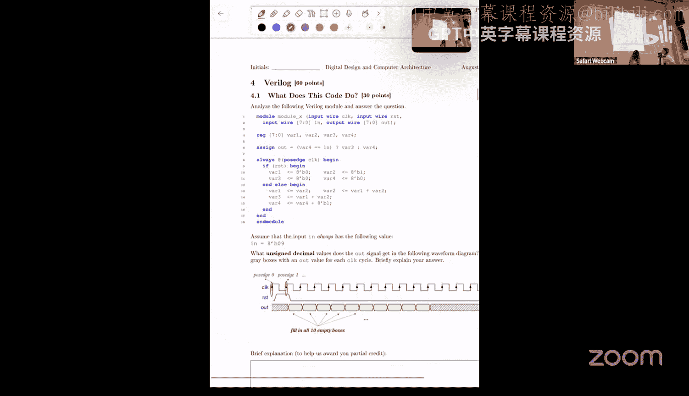

# 27：问题解决 II (Spring 2025) 🧠

在本节课中，我们将一起解决来自2023年春季课程的一系列问题，涵盖指令集架构与微架构、流水线、内存特性、有限状态机、向量处理、布尔逻辑电路、性能评估、脉动阵列、超长指令字和缓存等多个核心概念。

---

## 指令集架构与微架构 🏗️

本节我们将区分指令集架构和微架构的概念。指令集架构定义了软件可见的接口，而微架构则是这些接口的具体硬件实现。

以下是15个陈述，请判断每个陈述描述的是ISA还是微架构：

1.  **add指令中立即数的宽度**：由ISA定义。✅ **ISA**
2.  **ALU执行乘法所用的算法**：是硬件实现细节。✅ **微架构**
3.  **store指令中索引源寄存器所需的位数**：由ISA定义。✅ **ISA**
4.  **ALU缓存中的条目数**：是硬件设计选择。✅ **微架构**
5.  **数据缓存的组织方式**：是硬件设计选择。✅ **微架构**
6.  **编译器通过预取提示向硬件提供支持**：这涉及指令集对编译器的支持。✅ **ISA**
7.  **算术和逻辑运算可用的数据类型**：由ISA定义。✅ **ISA**
8.  **多核处理器中的缓存一致性协议**：是硬件实现细节。✅ **微架构**
9.  **处理器与主内存之间的数据宽度**：是硬件互连设计。✅ **微架构**
10. **内存控制器的内存请求调度算法**：是硬件实现细节。✅ **微架构**
11. **数据、控制流和分支指令的指令编码**：由ISA定义。✅ **ISA**
12. **寄存器重命名逻辑的设计**：是硬件设计选择。✅ **微架构**
13. **超标量处理器中每个周期解码的指令数**：是微架构特性。✅ **微架构**
14. **L2缓存缺失延迟**：取决于硬件实现。✅ **微架构**
15. **程序计数器的宽度**：由ISA定义。✅ **ISA**

---

## 流水线逆向工程 🔄

上一节我们介绍了ISA与微架构的区别，本节中我们来看看如何通过执行时间线来逆向工程处理器的流水线微架构。

我们有一段汇编代码及其在特定时钟周期下的流水线阶段执行时间线。目标是利用这些信息回答关于处理器架构的问题。

### 数据前推路径

首先，我们需要列出流水线阶段之间的数据前推路径。数据前推允许在指令结果写回寄存器文件之前，就将其值传递给后续依赖的指令。

以下是识别出的关键数据依赖和前推路径：

*   **从执行阶段3到执行阶段1**：当指令需要前一条指令在`E3`阶段刚计算出的`R1`值时发生。
*   **从访存阶段到执行阶段1**：当指令需要前一条指令在`M`阶段刚计算出的`R1`值时发生。
*   **从执行阶段3到条件寄存器**：用于解决条件分支指令对前一条指令计算结果的依赖。

**核心概念**：数据前推路径的通用形式可描述为：`Result_Stage_X -> Operand_Stage_Y`，其中X是产生结果的阶段，Y是使用该结果的阶段。

### 硬件互锁与软件互锁

接下来，判断该机器使用的是硬件互锁还是软件互锁。观察时间线，我们没有看到因数据依赖而插入的“气泡”或停顿。这表明微架构自身能检测数据依赖并暂停相关流水线阶段。

**结论**：该机器使用**硬件互锁**。

### 循环迭代与周期计算

现在，假设代码中`x=4`, `y=2`，且分支预测总是正确。在某个时钟周期`T`，处理器正在取指动态指令 `mul r4, r1, r1`，且此时`R1`的值为1024。我们需要计算`T`。

1.  **理解代码**：这是一个循环，`R1`初始为4，每次迭代乘以`R2`（值为2），直到`R1`达到2048。
2.  **计算迭代次数**：`R1`值序列：4, 8, 16, 32, 64, 128, 256, 512, 1024, 2048。当`R1=1024`时，是第9次迭代的开始（从第0次迭代计数）。
3.  **结合时间线计算T**：分析时间线，考虑初始化、第一次迭代（因流水线填充不同）和后续迭代的周期数。计算可得 `T = 2 + 9 + 8*10 = 91` 周期。
4.  **计算动态指令数n**：`n`是到该取指时刻为止执行的动态指令总数。考虑初始化指令和循环体内的指令数，可计算出 `n = 2 + 8*6 + 1 = 51`。

### 总执行时间

最后，计算整个汇编代码执行完成所需的总时钟周期数。循环需要执行直到`R1=2048`，即总共10次迭代。

结合时间线模型，总执行时间 = 初始化周期 + 第一次迭代周期 + 剩余9次迭代周期。计算可得总周期数。

**总结**：本节我们通过分析流水线时间线，逆向推导了处理器的数据前推机制、互锁策略，并练习了在给定条件下计算特定周期状态和总执行时间的方法。

---

## 内存组织与技术 ✅❌

上一节我们处理了流水线问题，本节我们来探讨关于内存组织和技术的一些陈述判断。

请判断以下关于内存组织和技术的陈述是正确还是错误：

1.  **主存访问通常比寄存器文件访问具有更大的延迟**：正确。主存远离核心且访问路径长。
2.  **SRAM通常用作现代计算机的主存**：错误。主存通常使用DRAM。
3.  **DRAM单元比SRAM单元需要更大的面积来存储数据**：错误。SRAM单元因使用更多晶体管，静态面积通常更大。
4.  **DRAM中读操作比写操作快**：错误。DRAM的读写速度通常相似。
5.  **相变存储器中读操作比写操作快**：正确。读操作测量电阻，写操作需要改变相态，耗时更长。
6.  **DRAM阵列中的位线将所有DRAM单元连接到行解码器电路**：错误。位线连接同一列的所有单元到灵敏放大器。
7.  **使用虚拟内存会降低内存访问延迟**：错误。虚拟内存的主要目的不是降低延迟，且地址转换可能增加延迟。
8.  **相变存储器是非易失性的**：正确。断电后数据不丢失，无需刷新。
9.  **如果一个假设的服务系统不受芯片面积、内存成本和能耗限制，PCM将是该系统中最好的内存技术**：错误。PCM存在写入耐久度限制。
10. **具有流式内存访问模式的程序会在最后一级缓存中产生很高的局部性**：错误。流式访问模式缺乏时间局部性。
11. **访问同一存储体中的不同行比访问不同存储体中的不同行更快**：错误。利用存储体并行性，访问不同存储体可能更快。
12. **TLB是一种专用的指令缓存**：错误。TLB缓存的是地址转换条目。
13. **虚拟内存简化了软件设计**：正确。程序员无需直接管理物理地址。
14. **当TLB不包含指令所需的条目时会发生页错误**：错误。页错误发生在页表中没有有效转换条目时。
15. **一个全相联L1 TLB，仅存储4KB虚拟到物理映射，有1024个条目，最多可覆盖4MB内存**：正确。`4KB * 1024 = 4MB`。

---

## 有限状态机 🔄

上一节我们讨论了内存特性，本节我们转向有限状态机的简化和设计。

### FSM简化

给定一个具有四个状态（A, B, C, D）的摩尔型FSM状态图。我们的目标是简化状态数。

**步骤**：
1.  构建状态转移表，列出每个状态在不同输入下的次态和输出。
2.  观察发现状态A、B、D具有完全相同的输入/输出行为（输出是输入的反码）。
3.  因此，状态A、B、D是等价的，可以合并为一个新状态（例如X）。
4.  简化后的FSM只有两个状态：C和X。状态X在输入0或1时都保持为X，并输出输入的反码。状态C在输入0或1时都转移到X。

**简化结果**：状态数从4个减少到2个。

### FSM设计

现在，设计一个摩尔型FSM，检测输入信号中从“重复0”到“重复1”的稳定转换。具体来说，仅当观察到输入序列“00, 11”时，输出才为1。

**设计过程**：
1.  **定义状态**：我们需要状态来记忆序列。
    *   `S_reset`：复位状态，假设输入已长时间为高（1）。
    *   `S_1`：最近看到单个1。
    *   `S_0`：最近看到单个0。
    *   `S_00`：已看到两个连续的0。
    *   `S_001`：已看到序列“00, 1”。
    *   `S_0011`：已检测到目标序列“00, 11”，输出1。
2.  **状态转移**：
    *   从`S_reset`开始，根据输入转移到`S_1`或`S_0`。
    *   在`S_1`，输入1则保持，输入0则转到`S_0`。
    *   在`S_0`，输入0则转到`S_00`，输入1则转到`S_1`。
    *   在`S_00`，输入1则转到`S_001`，输入0则保持（仍为两个0）。
    *   在`S_001`，输入1则转到`S_0011`（输出1），输入0则转到`S_0`（序列中断）。
    *   在`S_0011`，无论输入如何，都转到`S_1`（重新开始检测）。
3.  **输出**：仅在`S_0011`状态时输出为1，其他状态输出为0。

这个FSM以最少的必要状态（6个）实现了所需功能。

**总结**：本节我们学习了如何通过识别等价状态来简化FSM，并从头设计了一个满足特定序列检测要求的摩尔型有限状态机。

---

## 向量处理 ⚡

上一节我们设计了FSM，本节我们进入向量处理领域，解决关于存储体、汇编编程和性能计算的问题。

### 存储体数量与步长

一个向量处理器有N个存储体。向量加载指令`VLD`和存储指令`VSD`的延迟为：行缓冲区命中50周期，缺失100周期。所有存储体初始时行都是关闭的。连续地址的元素交错存放在不同存储体中。

**问题**：为避免停顿，执行`VLD`和`VSD`指令所需的最少存储体数量是多少？答案取决于访问步长。

**分析**：关键是要隐藏长延迟（100周期）。为了在每个周期都能发出新的内存请求（无停顿），我们需要足够的存储体，使得在同一个存储体准备好接受新请求之前，可以去访问其他存储体。

*   **奇数步长**：访问模式会依次遍历所有存储体。需要至少100个存储体，以便在第100个周期可以重新访问第一个存储体。
*   **偶数步长**：访问模式可能跳过某些存储体。需要至少101个存储体，以确保在100周期延迟内总有未被占用的存储体可用。

**结论**：最小存储体数 = `100`（奇数步长）或 `101`（偶数步长）。

### 向量汇编编程

将以下C语言循环转换为向量汇编代码，以在所述向量机器上以最少的周期数执行。

```c
for (i=0; i<46; i++) {
    if (a[i] == 0)
        c[i] = b[i];
    else
        c[i] = (a[i] * b[i]) + (a[i] >> 1);
}
```

假设向量指令集包括：`SET`（设置步长/长度）、`VLD`/`VSD`（向量加载/存储）、`VCMP`（比较）、`LDM`（加载掩码）、`VNOT`（按位非）、`VMUL`、`VADD`、`VSHR`（右移）。

**汇编代码思路**：
1.  `SET` 步长为1，向量长度为46。
2.  `VLD` 向量`a`到寄存器`V1`，`VLD` 向量`b`到`V2`。
3.  `VCMP` `V1`与0，结果存`V3`（`a[i]==0`的位置为1）。
4.  `LDM` `V3` 设置掩码，在掩码下`VSD`将`V2`存储到`c`（处理if部分）。
5.  `VNOT` `V3`得到`V3`的反码（`a[i]!=0`的掩码）。
6.  `LDM` `V3` 设置新掩码。
7.  在掩码下执行：
    *   `VSHR` `V1`右移1位，结果存`V4`。
    *   `VMUL` `V1`和`V2`，结果存`V5`。
    *   `VADD` `V4`和`V5`，结果存`V6`。
    *   `VSD` 将`V6`存储到`c`（处理else部分）。

### 执行周期计算

基于上一问的汇编代码，假设`a`和`b`位于不同的内存行，机器有8个存储体，计算总执行周期。

**分析**：
1.  **内存访问延迟**：每个存储体的行缓冲区大小为64位（2个元素）。访问46个元素，由于跨行访问，会产生多次行缺失。计算可得，一次完整的向量加载或存储需要约455个周期（包括初始延迟和流水线发射时间）。
2.  **指令时间线**：
    *   `SET`指令很快（1周期）。
    *   第一个`VLD`开始后，需要455周期完成，期间不能向内存单元发出其他请求。
    *   第二个`VLD`必须等待第一个`VLD`的内存访问端口空闲。
    *   算术指令（`VCMP`, `VNOT`, `VSHR`, `VMUL`, `VADD`）可以与其他指令重叠执行，只要操作数就绪且功能单元空闲。
    *   存储指令`VSD`必须等待其源数据计算完成，并且内存端口可用。
3.  **关键路径**：通常是内存访问链。总周期数大致为：`2*SET + 2*VLD + 2*VSD`的周期，加上必要的同步等待。经过详细调度分析，总执行时间约为 `2 + 2*455 + 2*455 = 1822` 周期。

**总结**：本节我们探讨了向量处理器中存储体数量与访问步长的关系，将标量循环转换为向量汇编，并估算了在特定硬件假设下向量代码的执行时间。

---

## 布尔逻辑电路 🔌

上一节我们处理了向量计算，本节我们回到组合逻辑电路的设计与优化。

### 真值表与逻辑表达式

设计一个组合电路，4位输入ABCD（A为最高位），两个1位输出`Fb`和`G3`。
*   `Fb=1` 当输入数字是斐波那契数（0,1,2,3,5,8,13）。
*   `G3=1` 当输入数字大于3。

**步骤**：
1.  填充真值表（0-15），根据定义标记`Fb`和`G3`的输出值。
2.  根据真值表，写出`Fb`的积之和表达式，列出所有使`Fb=1`的最小项。

### 布尔最小化

使用布尔代数规则简化`Fb`的表达式。

**简化过程**：
1.  提取公共因子。
2.  利用互补律（如 `C'D' + C'D + CD' + CD = 1`）。
3.  合并项后，得到简化表达式：`Fb = A'B' + A'BC'D + AB'C'D' + ABC'D`。

### 使用与非门实现

为输出`G3`寻找仅使用两输入与非门的简化表示。

**步骤**：
1.  首先，写出`G3`的积之和表达式（有12个最小项）。
2.  通过卡诺图或布尔代数简化，发现`G3`可简化为 `A + B`（因为当A或B为1时，数字至少为4）。
3.  将 `A + B` 转换为仅使用两输入与非门的形式：
    *   `A + B = ( (A NAND A) NAND (B NAND B) ) NAND ( (A NAND A) NAND (B NAND B) )` 的一种等价变形。实际上，`A+B = (A' B')'`，而 `A' = (A NAND A)`，`B' = (B NAND B)`。因此，`G3 = ( (A NAND A) NAND (B NAND B) )`。这需要3个两输入与非门。

**总结**：本节我们根据功能描述构建了真值表，推导并简化了逻辑表达式，最后实现了仅使用与非门的特定逻辑功能。

---

## 性能评估 ⏱️

上一节我们设计了逻辑电路，本节我们来评估不同处理器设计的性能。

### 计算CPI

处理器P1的指令周期数：加载6，存储6，算术2，分支2。
程序A的指令混合比：加载40%，存储20%，算术30%，分支10%。

**P1的CPI**：
`CPI_P1 = 0.4*6 + 0.2*6 + 0.3*2 + 0.1*2 = 4.4`

处理器P2将时钟频率加倍，但所有指令延迟增加4个周期（加载10，存储10，算术6，分支6）。指令混合比不变。

**P2的CPI**：
`CPI_P2 = 0.4*10 + 0.2*10 + 0.3*6 + 0.1*6 = 8.4`

### 速度比较

比较P1和P2的速度。

**执行时间**：
`Time = CPI * Instruction_Count * Clock_Period`
设P1的时钟周期为`T`，则P2的时钟周期为`T/2`。
`Time_P1 = 4.4 * N * T`
`Time_P2 = 8.4 * N * (T/2) = 4.2 * N * T`

**加速比**：
`Speedup = Time_P1 / Time_P2 = (4.4NT) / (4.2NT) ≈ 1.048`
P2比P1快大约4.8%。

### 优化选择

在P1基础上，只能选择一种优化：
*   **优化ALU**：将算术和分支指令的延迟减半（变为1周期）。
*   **优化LSU**：将加载延迟减半（3周期），存储延迟加倍（12周期）。

计算两种优化后的CPI：
*   **优化ALU后CPI**：`0.4*6 + 0.2*6 + 0.3*1 + 0.1*1 = 4.0`
*   **优化LSU后CPI**：`0.4*3 + 0.2*12 + 0.3*2 + 0.1*2 = 4.4`

**结论**：应选择**优化ALU**，因为它能获得更低的CPI（4.0 < 4.4）。

**总结**：本节我们学习了如何根据指令混合比和延迟计算CPI，比较不同处理器设计的性能，并基于CPI评估优化方案的有效性。

---

## 脉动阵列 🧮

上一节我们进行了性能评估，本节我们研究用于矩阵乘法的脉动阵列。

### 2x2矩阵乘法

我们有一个2x2的处理单元阵列，每个PE执行乘累加操作：`reg = reg + i1 * i2`，并将输入`i0`和`i1`直接传递到输出。

目标是用最少周期数计算2x2矩阵乘法 `C = A x B`。

**方法**：通过精心安排输入`a_{ij}`和`b_{ij}`进入阵列的时机，使每个PE在正确的时间收到正确的操作数对，从而计算出对应的`c_{ij}`。

**输入调度表示例**：
| 周期 | H0 (输入) | H1 (输入) | V0 (输入) | V1 (输入) | 输出 (生成) |
| :--- | :--- | :--- | :--- | :--- | :--- |
| 1 | a00 | - | b00 | - | - |
| 2 | a01 | a10 | b10 | b01 | - |
| 3 | a11 | - | b11 | - | c00 |
| 4 | - | - | - | - | c01, c10 |
| 5 | - | - | - | - | c11 |

### 扩展到4x4矩阵

使用相同的2x2脉动阵列计算4x4矩阵乘法所需的最少周期数。

**分析**：
*   **输入数量**：4x4矩阵有32个输入元素，是2x2情况（8个输入）的4倍。
*   **计算模式**：每个输出元素`c_{ij}`现在需要8次乘累加（而不是4次）。
*   **缩放估算**：输入阶段可能需要约 `3 * 4 = 12` 周期。计算阶段，第一个输出可能在 `2*2 + 1 = 5` 周期后产生（因为计算深度加倍）。所有输出产生可能需要额外周期。

**结论**：经过详细推演，完成4x4矩阵乘法总共需要 **19个周期**。

**总结**：本节我们学习了如何为脉动阵列调度数据以高效计算矩阵乘法，并理解了问题规模扩大时执行周期的估算方法。

---

## 超长指令字 📜

上一节我们探讨了脉动阵列，本节我们研究超长指令字处理器的指令调度。

### VLIW指令调度

给定一个具有多个功能单元（3加载、1存储、1加法、1乘法、1分支）的VLIW处理器，以及一段汇编代码。目标是将这些汇编操作静态调度到VLIW指令中，填满一个时隙表。

**调度策略**：
1.  无依赖的指令可以放在同一VLIW指令中。
2.  有真实数据依赖的指令必须被安排在不同的周期。
3.  使用`nop`填充空闲时隙。

**调度结果示例**：
| 周期 | 加载单元1 | 加载单元2 | 加载单元3 | 存储单元 | 加法单元 | 乘法单元 | 分支单元 |
| :--- | :--- | :--- | :--- | :--- | :--- | :--- | :--- |
| 1 | load ... | load ... | load ... | nop | nop | nop | nop |
| 2 | nop | nop | nop | nop | nop | mul ... | nop |
| 3 | nop | nop | nop | nop | add ... | nop | nop |
| 4 | nop | nop | nop | store ... | nop | nop | nop |
| 5 | nop | nop | nop | nop | nop | nop | branch ... |

### 利用率与执行时间

*   **有用操作比例**：有用操作数（非nop）除以VLIW指令总数。本例中为 `7个操作 / 5条指令 = 1.4`。
*   **循环执行时间**：每个循环体调度后占5个周期。对于循环执行n次，总执行时间为 `5 * n` 个周期。

**总结**：本节我们实践了VLIW架构下的静态指令调度，计算了指令包的利用率，并推导了循环程序的执行时间公式。

---

## 缓存逆向工程 🕵️

上一节我们处理了VLIW调度，本节我们尝试通过巧妙的访问模式来逆向工程缓存的配置。

### 确定缓存结构

有一个4块、基于LRU的L1数据缓存，块大小1B。初始为空，然后依次访问地址0, 2, 4。
现在，恶意程序员只能再进行两次访问，通过观察这两次访问的命中率来确定缓存的组数和路数。

**策略**：我们需要选择两个地址（x, y），使得在不同的缓存配置（直接映射、2路组相联、4路全相联）下，访问序列 `0, 2, 4, x, y` 会产生不同的命中率模式。

**解决方案**：选择 `x=0`, `y=2`。
*   **直接映射（4组1路）**：访问序列为 (0, 2, 4, 0, 2)。命中率 = 50%。
*   **2路组相联（2组2路）**：访问序列为 (0, 2, 4, 0, 2)。命中率 = 0%。
*   **4路全相联（1组4路）**：访问序列为 (0, 2, 4, 0, 2)。命中率 = 100%。

通过观察到的命中率，可以唯一确定缓存配置。

### 替换策略的影响

如果缓存使用MRU（最近最多使用）替换策略，而非LRU，是否还能用两次访问确定结构？

**答案**：不能。在MRU策略下，对于某些访问序列，不同的缓存配置可能表现出相同的命中行为，导致无法区分。例如，访问`0`后，在直接映射和2路组相联中，被替换的块可能相同，使得后续访问模式无法提供区分信息。

**总结**：本节我们学习了如何通过设计特定的内存访问序列，并根据命中率差异来推断缓存的相联度和组数。同时，我们也了解到替换策略（如MRU）可能会使这种逆向工程变得困难。

---




## 预取器识别 🤖

最后，我们通过分析覆盖率（Coverage）和准确率（Accuracy）指标，来识别机器使用的是哪种预取器。

有两种程序（A和B）在两台机器（M1和M2）上运行。预取器可能是：步长预取器、下一行预取器（步幅1）、下四行预取器（步幅4）。给出了每种程序在每台机器上的覆盖率和准确率。

**分析关键**：
*   **准确率**：M2的准确率是499/500，而M1是499/501。步长预取器需要观察两次连续访问才能建立模式，因此它发出的预取请求总数会比其他两种“总是预取”的预取器少一次。这正好与M2的准确率分母500（比其他少1）相符。
*   **覆盖率**：结合程序B的访问模式（主要访问偶数地址），下一行预取器（总是预取a+1）的准确率会极低，因为预取的都是不会被访问的奇数地址。这与M1的高准确率矛盾，因此M1不是下一行预取器。

**结论**：
*   **机器M1** 使用的是**下四行预取器**。
*   **机器M2** 使用的是**步长预取器**。

**总结**：本节我们通过分析预取器的覆盖率与准确率这两个关键指标，并结合程序的内存访问模式特征，成功推断出了两台机器所使用的预取器类型。

---


本节课中我们一起学习了计算机架构中多个核心主题的问题解决方法，包括ISA/微架构区分、流水线分析、内存系统、有限状态机、向量处理、逻辑设计、性能计算、脉动阵列、VLIW调度、缓存逆向工程和预取器识别。希望这些练习能帮助你巩固对数字设计和计算机架构的理解。