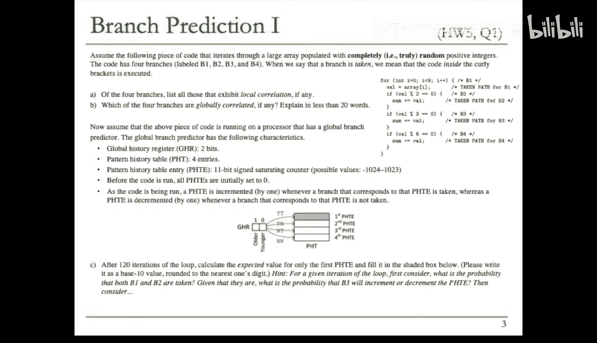
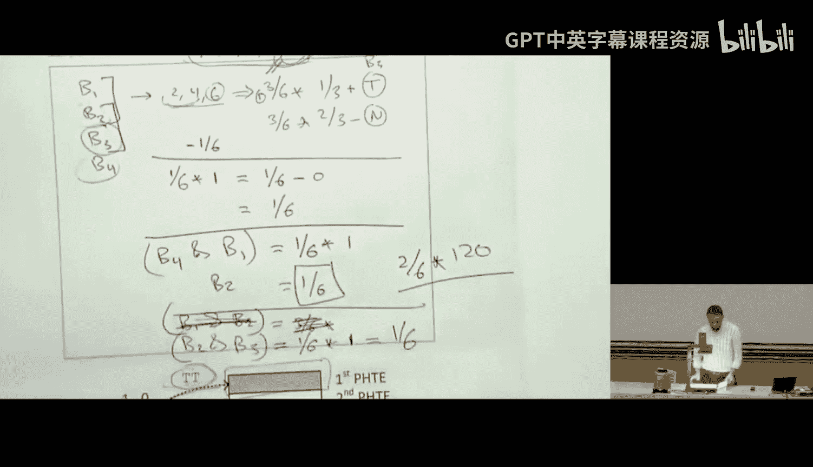
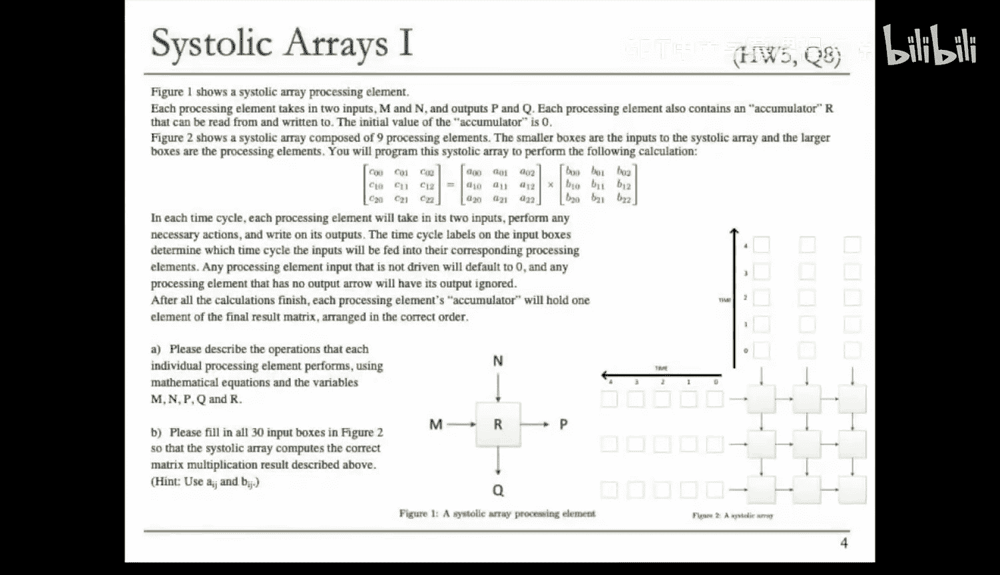
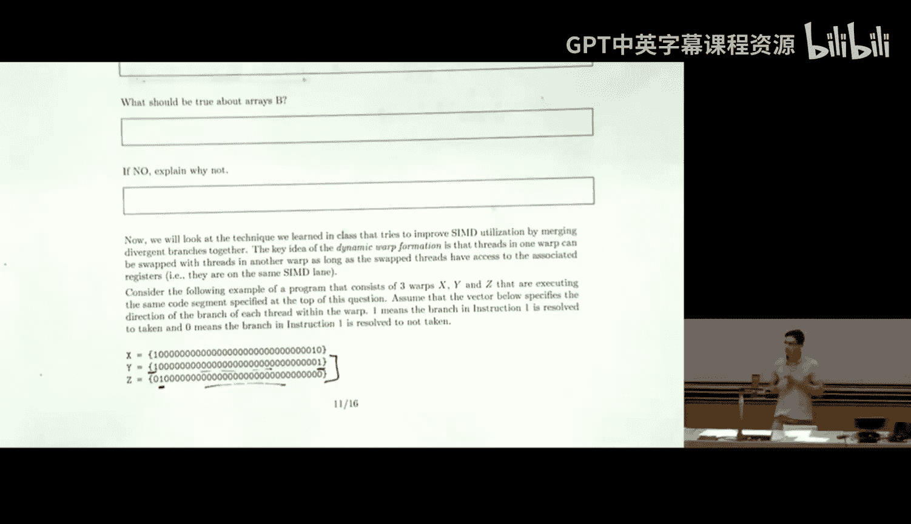
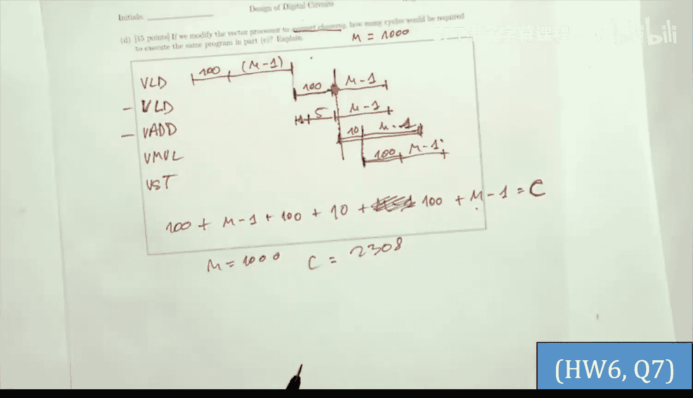
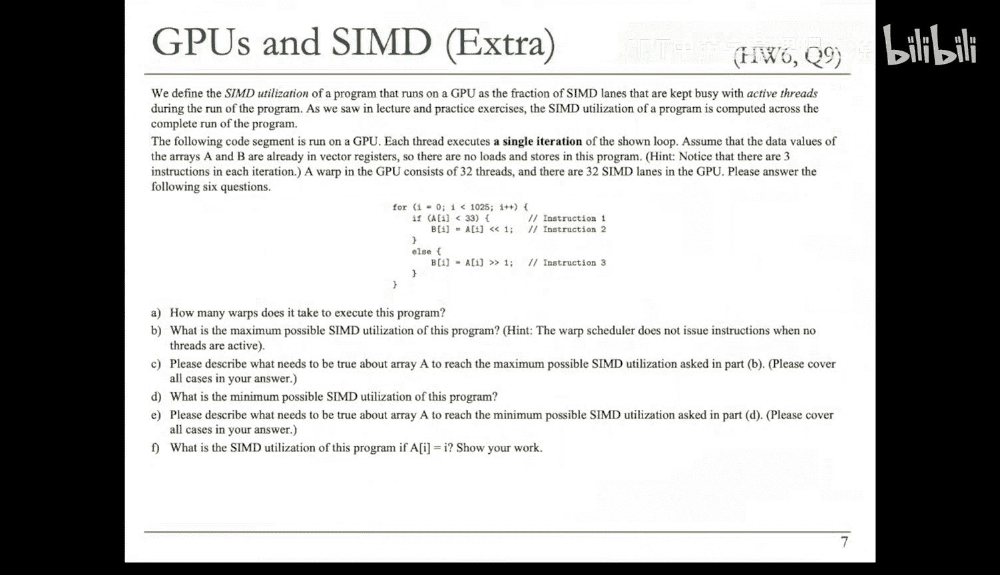
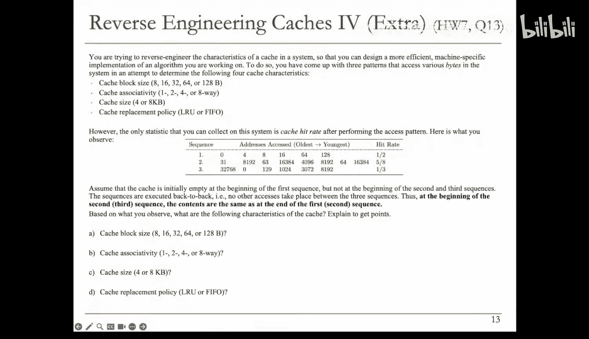

# 28：问题解决 III (Spring 2025)

## 概述
在本节课中，我们将学习如何分析和解决计算机架构中的几个核心问题，包括分支预测、脉动阵列、GPU执行效率、向量处理器、缓存层次结构以及预取机制。我们将通过具体的代码示例和实验数据，深入理解这些概念的工作原理和性能影响。

---

## 分支预测分析

上一节我们介绍了分支预测的基本概念，本节中我们来看看一个具体的代码示例，分析其中的局部相关和全局相关分支。

给定一段代码，它遍历一个包含 `n` 个元素的数组，每个元素的值是真正随机生成的。代码内部有三个独立的 `if` 语句，分别检查元素值是否为 2、3 或 6 的倍数。这些 `if` 语句不是 `if-else` 结构。

问题要求从四个分支（B1：`for` 循环，B2、B3、B4：三个 `if` 语句）中找出局部相关和全局相关的分支。

*   **局部相关**：对于特定分支，如果知道前一次迭代的结果（该分支是否被采纳），能否决定当前迭代中该分支是否会被采纳。
*   **全局相关**：在当前情况下，如果一个分支被采纳，能否推断出其他分支是否会被采纳。

以下是分析过程：

对于 B1（`for` 循环），其循环次数固定为 `n`。如果在第 `n-1` 次迭代，可以确定下一次迭代循环将结束（不采纳）。因此，B1 存在局部相关。

对于 B2、B3、B4，由于数组元素值完全随机，即使知道前一次迭代中某个分支（例如 B2）未被采纳，也无法预测当前迭代中它是否会被采纳。因此，B2、B3、B4 没有局部相关。

对于全局相关，分析分支间的逻辑关系：
*   如果 B4（元素是 6 的倍数）被采纳，那么该元素也一定是 2 和 3 的倍数，因此 B2 和 B3 也必然被采纳。
*   反之，如果 B2 和 B3 同时被采纳（元素是 2 和 3 的倍数），那么它也是 6 的倍数，因此 B4 必然被采纳。

因此，B4 与 B2、B3 是全局相关的。

---

## 全局分支预测器模拟

现在，我们将在配备全局分支预测器的处理器上运行这段代码。假设全局历史寄存器（GHR）只有 2 位，模式历史表（PHT）有 4 个条目，所有条目初始值为 0。预测规则是：如果分支被采纳，对应 PHT 条目值加 1；如果未被采纳，则减 1。

程序将循环执行 120 次（`n=120`）。问题：当 GHR 的第一条记录为“采纳-采纳”（对应两个分支被采纳）时，经过 120 次迭代后，PHT 中第一个条目的值是多少？

为了简化分析，我们假设数组元素值在 1 到 6 之间均匀随机出现，这个范围涵盖了判断 2、3、6 倍数所需的所有情况。

我们需要计算在 B1 和 B2 被采纳的条件下，B3 被采纳或不被采纳的贡献度（概率加权）。

*   **B3 被采纳的概率**：B2 被采纳意味着元素是 2 的倍数（即 2, 4, 6）。在这些数中，是 3 的倍数（即 6）的概率是 1/3。因此，贡献为 `(3/6) * (1/3) = +1/6`（因为采纳会加1）。
*   **B3 不被采纳的概率**：B2 被采纳的元素中，不是 3 的倍数（即 2, 4）的概率是 2/3。因此，贡献为 `(3/6) * (2/3) * (-1) = -2/6`（因为不采纳会减1）。

B3 对 PHT 条目值的总期望贡献为：`(+1/6) + (-2/6) = -1/6`。

经过 120 次迭代，该条目的总变化期望为 `120 * (-1/6) = -20`。由于初始值为 0，最终值约为 `-20`（实际中，PHT 条目可能有饱和限制，但根据题目给定的加减规则，计算期望值即可）。

---

## 脉动阵列编程

上一节我们讨论了特定硬件结构，本节中我们来看看如何为脉动阵列编程以实现矩阵乘法。

我们有一个脉动处理单元（PE）阵列。每个 PE 有两个输入（M, N）、两个输出（P, Q）以及一个累加器寄存器 R。多个 PE 连接成网格。

目标是编程此阵列以计算矩阵乘法 **C = A × B**。在每个时钟周期，每个 PE 接收输入，执行计算，并产生输出。输入数据在特定周期被送入阵列。未连接的输入默认为 0，未使用的输出被忽略。计算完成后，每个 PE 的累加器 R 将保存结果矩阵 C 的一个元素。

首先，需要定义每个 PE 执行的操作：
*   **数据传递**：输入 M 和 N 需要传递给相邻的 PE 以供后续计算。因此，`P = M`, `Q = N`。
*   **累加计算**：每个 PE 负责计算结果矩阵中一个元素的点积的一部分。每个周期，它将收到的两个输入相乘，并加到累加器上。因此，`R = R + (M * N)`。

接下来，需要安排输入数据（矩阵 A 和 B 的元素）进入阵列的时序和位置，确保每个 PE 在正确的周期收到正确的数据对进行乘积累加。

通过分析数据流和计算依赖关系，可以推导出输入调度方案。例如，矩阵 A 的行元素可以水平输入，矩阵 B 的列元素可以垂直输入，通过巧妙的延迟对齐，使得每个 PE 能够顺序接收到计算对应 C 元素所需的所有 A 行和 B 列元素对。

---

## GPU 执行利用率分析

现在，我们转向 GPU 架构，分析其 SIMD 通道的利用率。

SIMD 利用率定义为程序运行期间，保持有活跃线程工作的 SIMD 通道所占的比例。我们有一段在 GPU 上运行的代码，每个线程执行循环的一次迭代。假设 warp 大小为 32 线程，GPU 有 32 条 SIMD 通道。

**部分 A**：计算执行该程序所需的 warp 数量。总迭代次数为 N，所以 warp 数量为 `ceil(N / 32)`。

**部分 B**：在给定数组 A 和 B 的特定值模式（A：24个1后跟8个0；B：48个0后跟64个1）下，计算程序的 SIMD 利用率。代码中包含一个 `if` 语句，条件为 `a % 3 == 0`。由于 A 的模式，只有读取到 A 中值为 0 的线程才会执行 `if` 体内的指令。

因此，对于每个 warp：
*   指令1（`if` 判断）被所有 32 个线程执行。
*   指令2（`if` 体内）只被那些 `a[i] % 3 == 0` 的线程执行。根据 A 的模式，每 32 个连续元素中，有 8 个 0，因此平均有 8 个线程执行指令2。

SIMD 利用率 = （执行指令1的线程周期 + 执行指令2的线程周期） / （总线程周期）。
假设每个指令消耗一个周期，对于大量 warp 平均：利用率 = `(32 + 8) / (32 + 32) = 40 / 64 = 62.5%`。

**部分 C**：程序能否达到 100% 的 SIMD 利用率？答案是肯定的。需要满足的条件是关于数组 A 的：对于每个连续的 32 个元素（即一个 warp 访问的数据），要么全部都能通过 `if` 条件（都执行指令2），要么全都不能通过（都不执行指令2）。这样，warp 内所有线程执行路径一致，没有分歧，从而可以实现 100% 的利用率。

---

## 向量处理器内存访问优化

本节分析向量处理器的内存系统设计，以优化加载/存储操作的性能。

假设一个向量处理器，其向量加载操作具有 100 周期的延迟，但流水化执行，可以每个周期启动一个新的加载。存储操作类似。内存由多个交叉存取的存储体（bank）组成，连续地址的元素分布在不同 bank 中。

**部分 A**：为避免执行跨度为 1 的加载/存储操作时发生停顿，最少需要多少个存储体？
由于单个加载操作会占用一个 bank 100 个周期，为了能够每个周期启动一个新的加载（访问新的 bank），需要至少 100 个 bank。这样，在第 100 个周期，可以重新访问第一个 bank，而此时它已经完成了第一个加载请求。

**部分 B**：如果访问跨度为 2，需要多少 bank？
跨度为 2 时，连续访问的地址位于相隔的 bank。例如，有 100 个 bank 时，访问序列可能是 bank 0, 2, 4, ...。问题在于，当访问到第 50 个元素（bank 0? 这里需要具体计算）时，可能 bank 0 仍被占用。为了避免停顿，bank 数量需要与跨度互质，或者足够大以消除冲突。经过分析，101 个 bank 可以避免跨度为 2 时的停顿。

**部分 C 和 D**：在已知 bank 数量和特定代码序列下，计算程序的执行周期，或反推向量长度 M。这需要根据向量指令间的依赖关系、是否支持链式操作（chaining）以及流水线延迟来构建执行时间方程并求解。

---

## 缓存层次结构逆向工程

通过运行特定的微基准测试程序，我们可以逆向推导出未知计算机系统的缓存层次结构参数。

程序以随机顺序访问一个内存区域，通过改变访问“跨度”和区域“大小”，并测量访问延迟，可以绘制出延迟随区域大小变化的曲线。

**分析曲线特征**：
*   **平坦段**：当整个访问区域能完全放入某一级缓存时，所有访问都命中该缓存，延迟恒定，等于该级缓存的访问延迟。
*   **上升点**：当区域大小超过该级缓存容量时，开始出现缓存失效，平均延迟上升。
*   **不同跨度曲线分离点**：可以帮助确定缓存的相联度。例如，如果跨度为 16 时，在某个大小之前延迟保持低位，说明可以同时容纳多个跨距访问的元素而不冲突，从而推断出至少需要多少路组相联。

通过分析不同处理器（单级缓存和两级缓存）的测试曲线，我们可以确定：
*   L1 缓存大小、访问延迟、相联度。
*   L2 缓存大小、访问延迟（从上一级到该级的额外延迟）、相联度。
*   主内存访问延迟。
*   某些参数（如缓存行大小）可能无法从给定数据中确定。

---

## 预取器效果评估

预取器旨在预测并提前获取程序可能访问的数据。我们评估两种应用（A 和 B）在步长预取器下的表现。

应用 A 和 B 都访问数组，但索引计算方式不同：A 是 `i * 4`，B 是 `i * 4` 的某种变体（实际上是 `i * 4` 后接其他计算，导致访问地址不是连续的 4 的倍数）。假设缓存块大小为 4 字节。

*   **应用 A**：访问地址为 0, 4, 8, 12,... 步长为 4。步长预取器可以学习到这个步长，并预取后续缓存块。预取准确率和覆盖率都可以很高（除了最开始的一两次访问用于学习步长）。
*   **应用 B**：访问地址如 1, 16, 64, 256,... 没有固定的步长。步长预取器无法预测这种模式，因此准确率和覆盖率都为 0。

对于应用 A，下一行预取器（总是预取下一个缓存块）可能比步长预取器效果更好，因为它从一开始就能正确预取。
对于应用 B，常规预取器无效。可能需要更复杂的预取技术，如基于执行的预取或运行时提前执行（run-ahead execution），通过实际执行代码来生成未来地址。

是否对应用 A 使用运行时提前执行？通常不需要。因为应用 A 的访问模式非常规则，简单的步长或下一行预取器已经能以低开销获得高性能。运行时提前执行更适用于不规则、数据依赖强的访问模式，如应用 B。

---

## 缓存性能详细分析

通过编写更复杂的微基准测试代码，我们可以深入分析缓存特性，如块大小、相联度、替换策略等。

代码1 以固定步长遍历数组并测量每次访问延迟。
代码2 包含两个循环：第一个循环以某种方式“训练”缓存，第二个循环测试访问延迟。

**部分 A**：运行代码1（步长=1），观察延迟曲线。可以观察到三个不同的延迟层级（如 100, 300, 700 周期），分别对应 L1 命中、L2 命中、主存访问。通过分析延迟变化点对应的访问索引，可以推断出 L1 和 L2 的缓存块大小和总容量。

**部分 B**：使用代码2，通过调整访问区域大小（size1, size2）和步长，观察特定访问（如 latency[0]）的延迟变化。这可以揭示缓存的相联度。例如，如果 size1 为某个值时 latency[0] 是 L2 命中，而 size1 稍小时是 L1 命中，说明 size1 的大小刚好使得访问序列占满了该组的所有路，导致第 0 个元素被替换出去。

**部分 C**：使用代码2 的不同步长组合，然后运行代码1 检查特定地址是否仍在缓存中。这可以推断缓存替换策略是 LRU 还是 FIFO。例如，如果访问序列使得某个地址在 LRU 策略下应该被保留，而在 FIFO 下应该被替换，那么通过实际测量结果就可以判断是哪种策略。

**部分 D**：连续运行两次代码1，第一次用于预热缓存，第二次测量平均延迟并绘制随访问区域大小变化的曲线。曲线上的平台和跃升点直接对应各级缓存的总容量。平台之间的过渡区域形状与缓存相联度和替换策略有关。

---

## 综合缓存设计推断

给定一个确定的内存访问序列和对应的缓存命中率，要求推断出缓存的设计参数，包括块大小、相联度、总容量和替换策略。

**方法**：采用假设验证法。
1.  **块大小**：尝试不同的块大小（如 8B, 16B, 32B, 64B），模拟给定访问序列，计算命中率，看哪个与给定的命中率匹配。
2.  **相联度和容量**：在确定块大小后，尝试不同的相联度（1-way, 2-way, 4-way, 8-way）和总容量（4KB, 8KB）。对于每种组合，计算访问序列中映射到同一缓存组的地址序列。分析这些地址在缓存中的驻留情况，看是否与给定的命中率匹配。需要考虑替换策略（LRU 或 FIFO）。
3.  **替换策略**：在确定了块大小、相联度、容量后，使用不同的替换策略模拟，看哪种策略能产生与给定命中率一致的结果。

通过系统性地测试所有合理的参数组合，并与实验数据对比，可以唯一确定缓存的设计。

---

## 总结
本节课中我们一起学习了计算机架构中多个高级主题的实践分析方法。我们探讨了如何分析代码中的分支相关性，模拟了全局分支预测器的行为，设计了脉动阵列以实现矩阵乘法，计算了 GPU 线程执行的 SIMD 利用率，优化了向量处理器的内存访问，通过微基准测试逆向工程了缓存系统参数，评估了不同预取策略的效果，并综合运用缓存原理推断出了未知缓存的设计细节。这些技能对于理解和优化计算机系统的性能至关重要。